# SymCC-Parallel 架构问答（QA3）

> 本文回答 6 个问题：并行框架的执行流程与位图、约束形态与编译方式、求解策略与占比、
> 输入对 DSE 的影响、ICSE'23 统一再评估、基准目标与 LAVA-M 结果。
>
> **证据规则**：每个结论都标注来源。
> `file:line` = 当前工作树（分支 `engine-configurable-symsan`）实读。
> **⚠ 本分支有大量未提交改动，行号会漂移**（本文写作期间就因修一个 bug 移位了 4 行）。
> 因此**引用的代码文本本身才是锚点**——对不上时请 `grep` 引文，不要以行号为准；
> **【实测】** = 为写这份文档**当场跑出来**的新数据（已脚本化项目见 [`benchmark/qa3_repro/`](../benchmark/qa3_repro/README.md)，并非每项都已有 driver）；
> **【B 级】** = 历史阶段报告中的旧数据，按 `docs/README.md:41-43` 的规则不能直接升级为结论；
> **【论文】** = 取自论文原文（Q5 全节），**不在本仓库里**，引用时不要写成"仓库记载"；
> **【缺】** = 仓库里确实没有的数据，明确标出而不是编造。
>
> **2026-07-29 核验补充**：本文把三种容易混淆的数字严格分开：
> （1）当前仓库已提交 CSV，可证明吞吐与边覆盖；
> （2）QA3 单次专项短测，可解释机制但不能代表生产分布；
> （3）历史 `/tmp` 语料重放，可追溯但不是当前仓库内可独立复算的正式结果。
> 求解“占比”默认指**输出文件的策略标签构成**，除非明确写成 `check()` 次数占比。
>
> **可复现性边界**：本文引用的是一个尚未封存的工作树，分支名和 `file:line` 不是不可变证据。
> 正式发表或对外复现实验前，必须同时记录主仓库提交、子模块提交、dirty diff 摘要、编译器/
> AFL++/Z3 版本，以及脚本、输入语料和结果 CSV 的内容清单。下文的行号用于代码导航，
> 不能替代这一份实验清单。
>
> **配图分两类，互不替代**：
> **① 25 张示意图与统计图**（`docs/diagrams/qa3/`，SVG + PNG + DOT 图源）——解释**机制**：
> 执行流、进程拓扑、位图全景、工作项时序、过滤漏斗、约束形态分流、求解决策树、
> 丢前缀粒度、嵌套深度、种子长度、ICSE'23 再评估与 benchmark 数据等。
> **② 7 张一手证据截图**（`docs/evidence/`，[说明](evidence/README.md)）——给出**当场可见的原始输出**：
> objdump 里的 PCGUARD guard、`afl-showmap -C` 的 map size、插桩后的 LLVM IR、gdb 里的 `taken=0`、
> `fuzzer_stats` 的 `sync_time:0 / corpus_imported:0`、60 s hybrid 实跑、原始 benchmark 报告。
> ⚠ 截图记录的是各自当时的一次运行，与正文 【实测】 来自不同批次，**只用于佐证机制，不提供可比数值**。


> **审查历史与置信度**（如实记录，供读者判断可信度）：
>
> | 轮次 | 做法 | 查出的问题 |
> |---|---|---|
> | 初稿 | 读代码 + 当场补测 | —— |
> | 第 1 轮 | 三组独立复核，逐条比对代码 | **5 处实质错误**（其中一段终端记录并非真实输出）、约 40 处引用行号漂移；另查出 `mpi_fuzzing_helper.py` 一个 `TypeError` 崩溃缺陷并修复 |
> | 第 2 轮 | 逐条重跑实测 + 补齐文献原文 | 发现**运行中的 AFL 不接收 concolic 产出**（§1.10，两个独立实验）；补齐 PCGUARD、`AFL_SYNC_TIME`、QSYM/SoK 原文依据 |
> | 第 3 轮 | 逐篇核对论文原文 | 修正 Böhme et al. 的会议（SoK 标为 ASE 2022，实为 **ICSE 2022**）与建议归属；补 QSYM Table 6 后**修正了"AFL 拿 0 个 bug"的口径** |
> | 第 4 轮 | 逐条重跑全部实测 + 逐篇核对论文 | **一处排版被误标为原文**（§4.4 的 SMT 分隔线系排版所加）、**一处 2× 单位错**（SMT 日志行数 ≠ 查询次数）、**§3.5 整节因果讲反**（把"每代产出"当成"前沿规模"，且截断只发生过一次）、13 处论文数字或归属错误、4 处把不稳定测量当作结论 |
>
> **第 4 轮同时确认的正面结果**：所有 **【实测】** 表格中**能重跑的都精确复现**——§3.3 全部 44 个确定性单元格、
> §1.4 五轮位图（13 次独立运行一致）、§3.5 全部 20 个单元格、§6.6 四行、§4.9 全部、§6.5.2 全部 12 行、
> §1.10 两个交付实验。**不复现的只有相位排序**（`send` vs `exec` 谁大在两次运行里翻转）和边数抖动幅度，
> 已分别降级为"并列两次运行"和"只有大小关系稳定"。
>
> **每一轮都查出过实质错误。** 引用本文数据前，建议先用
> [`benchmark/qa3_repro/`](../benchmark/qa3_repro/README.md) 里的脚本自己跑一遍；
> 论文相关内容一律回原文核对（出处见文末"主要外部原始资料"）。

---

## 目录

- [Q1 并行框架的实现与执行流程（位图是关键）](#q1)
- [Q2 三类重点比较场景：宽整数 / memcmp / laf-intel，以及正常编译 vs 自测试](#q2)
- [Q3 求解策略：什么时候 Z3、什么时候乐观、什么时候丢前缀，占比多少](#q3)
- [Q4 输入为什么决定 DSE 的成败 + 一次真实的求解调试](#q4)
- [Q5 ICSE'23 统一再评估与 CoFuzz](#q5)
- [Q6 基准目标与 LAVA-M](#q6)

---

<a id="q1"></a>
# Q1 并行框架的实现与执行流程

## 1.0 先给结论（位图部分）

两个最容易混淆的判断，先给答案：

| 判断 | 用哪个位图 | 在哪个哈希空间 | 存在哪 |
|---|---|---|---|
| **worker 判断"这个分支/上下文是否值得再次尝试"** | **QSYM 自己的 `AflTraceMap`**（`qsym_bitmap`） | `XXH32(site_id, taken) % 65536`，边索引 `(prev_loc>>1) ^ h`；QSYM 代码沿用变量名 `pc`，实际入参是编译器生成的稳定 `site_id` | **每 worker 私有文件**，`worker_dir/qsym_bitmap`，**131072 字节**（64KB trace + 64KB context） |
| **判断"这个新产出是不是重复"** | **AFL 边覆盖位图**（worker 端 `worker_cov` → master 端 `coverage`） | AFL 插桩的边 ID（本项目 clang-18 走 **PCGUARD**，链接期顺序分配 guard 下标，非 `prev_loc` 异或；`MAP_SIZE=65536` 起步，**可增长**） | **纯内存** Python `bytearray`，**从不落盘**；由 `afl-showmap` 跑 **AFL 插桩二进制**产生 |

> **这两张图属于互不相通的 ID 空间，代码里明确要求分离**（严格说全系统有**三个**
> 空间，第三个见 [§1.8](#q1)）。B3 是兴趣/尝试状态，不证明目标分支曾经 SAT、模型已落盘，
> 更不等价于“这个分支已经成功解过”。
>
> **代码依据** —— `util/mpi_fuzzing_helper.py:4479-4483`：
> ```python
> # QSYM 内部剪枝图和 AFL showmap 图属于不同哈希空间，必须分离。前者仅由
> # 本 worker 的 QSYM runtime 持久更新；后者通过 MPI delta 播种 worker 去重。
> solver_bitmap_file = os.path.join(worker_dir, "qsym_bitmap")
> worker_env = os.environ.copy()
> worker_env["SYMCC_AFL_COVERAGE_MAP"] = solver_bitmap_file
> ```
> 并且 `util/mpi_fuzzing_helper.py:4691-4692` 再次强调：
> ```python
> # AFL coverage 只通过 MPI 的完整快照/稀疏 delta 更新 worker 端去重状态。
> # 它不会写入 solver_bitmap_file，避免污染 QSYM 自己的分支哈希空间。
> ```

## 1.1 进程拓扑：两套 MPI 工具，别混淆

仓库里有**两个**独立的 MPI 驱动，只有第一个和 AFL/位图有关：

| 工具 | 行数 | 角色 | 是否耦合 AFL | "新不新"的判据 |
|---|---:|---|---|---|
| `util/mpi_fuzzing_helper.py` | 5320 | rank 0 = master，rank 1..N-1 = concolic worker | **是**（读 AFL 队列、写回） | **afl-showmap 边覆盖** |
| `util/mpi_concolic_execution.py` | 826 | 多 master（`comm.Split` 分组）+ worker | 否 | **仅 SHA-256 内容哈希** |

`mpi_concolic_execution.py` 全文 **0 次** `showmap`（内容新颖度判据见 `:430-440`），产出用裸 sha256 十六进制命名，不是 AFL 能 sync 的 `id:...,src:...` 格式。**下文谈位图，一律指 `mpi_fuzzing_helper.py`。**

## 1.1.1 当前框架有两条执行流

本文后续的大多数位图与漏斗数据来自**经典 native concolic 流**，但当前实现还包含一条
opt-in 的**可恢复 continuation/CAS 状态流**。二者共用 MPI 调度、fenced lease 和最终 AFL
新颖性仲裁，却不是同一种执行语义：

### 图 1-0 两条执行流及其共同仲裁点


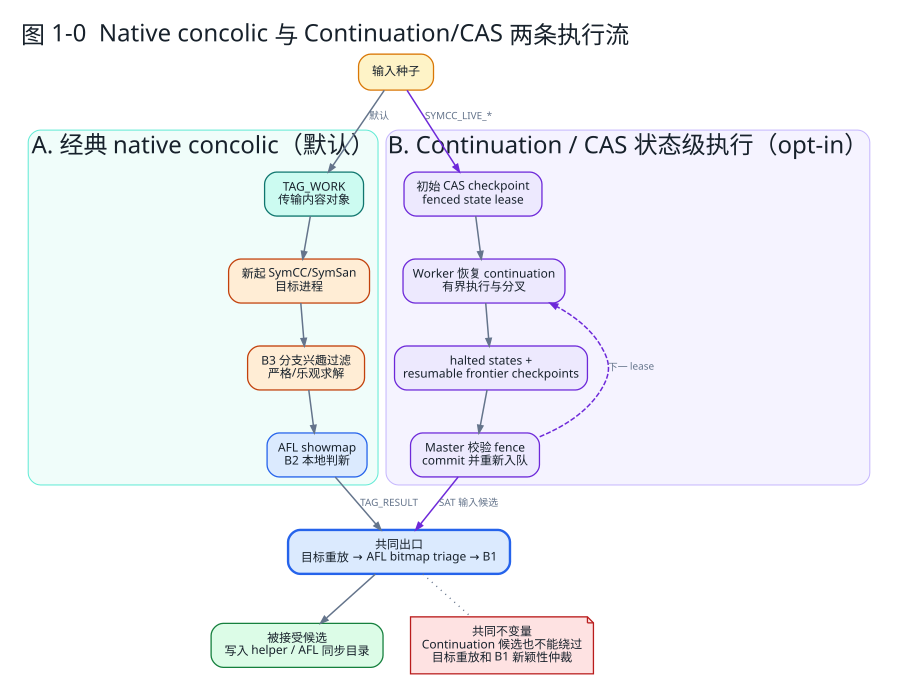

> 可缩放 SVG；[PNG 版本](diagrams/qa3/fig-1-0-execution-modes.png)；[DOT 图源](diagrams/qa3/src/fig-1-0-execution-modes.dot)。


- master 在 `util/mpi_fuzzing_helper.py:2538-2586` 加载 continuation IR，创建共享
  `LiveStateStore` 和初始执行器；worker 在 `:4505-4521` 保持一个跨 lease 存活的
  `LiveContinuationExecutor`；
- 带 `continuation_id` 的任务在 `:4703-4759` **先于种子导入**恢复 CAS checkpoint，
  并按 `SYMCC_LIVE_STEPS_PER_LEASE` / `SYMCC_LIVE_STATES_PER_LEASE` 有界推进；
- master 在 `:3921-3962` 先做 fenced-lease commit，再恢复返回的 frontier descriptor
  并重新入队，因此过期 worker 结果不能重复提交；
- 每个 live worker 可保持增量 QF_BV/Z3 上下文，复用精确 CAS 根或父根增量
  （`docs/Configuration.txt:1852-1880`）；这是状态级路径的 context reuse，不应与
  经典 native 路径每次新起目标进程混写；
- `SYMCC_ASYNC_QUERY_WORKERS>0` 还可启动持久 query service（helper `:1747-1800`），
  但 SAT 候选仍必须经过目标重放与 AFL 新颖性验证。

**范围声明**：§1.2–§1.10 若未特别注明，描述 A；涉及 continuation 的结论会显式写 B。

### 图 1-1 进程拓扑


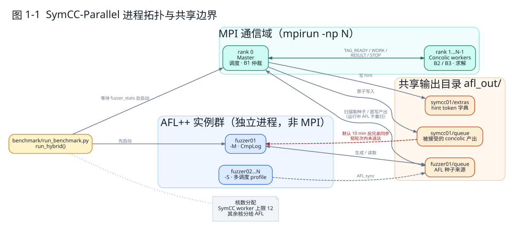

> 可缩放 SVG；[PNG 版本](diagrams/qa3/fig-1-1-process-topology.png)；[DOT 图源](diagrams/qa3/src/fig-1-1-process-topology.dot)。


另外两个容易误认的模块：
- `util/hybrid_feedback.py`（3939 行）是**纯策略库**，无进程、无 MPI、无 AFL，只把覆盖增量当标量奖励（`:3338`, `:3506`）；
- `util/symcc_fuzzing_helper/`（Rust）是**上游单进程版**，单线程轮询 AFL 队列、空则 sleep 5s（`src/main.rs:305-323`），是 MPI 版的祖先，不在并行路径上。

## 1.2 启动次序（严格按序）

`benchmark/run_benchmark.py:2131 run_hybrid()` 用 `subprocess.Popen` 拉起最多五类进程。次序有硬约束：

1. 建 `afl_out/` 和 `work_dir/target_cwd/`（`:2160-2165`）——**CWD 隔离**，否则 sqlite 之类目标会往仓库里拉屎；
2. honggfuzz（`:2172-2181`）、GRIMOIRE（`:2188-2199`）——都在 AFL **之前**；
3. **所有** AFL 实例一次性拉起，不错峰（`:2353-2354`）。`fuzzer01` 是 `-M`，其余 `-S` 且分配不同调度 profile（`:2306-2351`）；
4. **等 `afl_out/fuzzer01/fuzzer_stats` 出现**，最多 30s，每 0.5s 轮询（`:2364-2397`）。只等 master 一个；
5. 建 `symcc_all_outputs/`（`:2404-2405`）；
6. `mpirun -np <symcc_np> python3 -u util/mpi_fuzzing_helper.py -a fuzzer01 -o <afl_out> -n symcc01 --save-all <dir>`（`:2416-2431`, `:2475-2478`）；
7. helper 内 rank 0 建 `afl_out/symcc01/{queue,hangs,crashes}`（`:1733-1738`）。
   **⚠ 顺序陷阱**：自适应控制器**不能**预先创建 `symcc01/`——helper 默认 `SYMCC_RESUME=0`，见到已存在的目录会**拒绝续跑**并直接退出（`:1712-1725`；设 `SYMCC_RESUME=1` 则相反，会接着跑）；控制器为此要等它 30s（`benchmark/run_benchmark.py:2020-2026`）；
8. worker 阻塞在 `send(TAG_READY)` → `recv`（`:4656-4664`）。master 读 `fuzzer_stats` 建 `AflConfig`（`:1924`）——AFL 的目标 argv 和 afl-showmap 路径都是从这里解析出来的（`:479-511`）。

**核数分配**：`SYMCC_WORKER_CAP = 12`（`benchmark/run_benchmark.py:82`），`symcc_ranks = max(2, min(np//2, CAP+1))`，剩下全给 AFL（`:3824-3839`）。这个上限是实测出来的，见 [Q5 §5.3](#q5-equalcpu)。

## 1.3 工作分发：拉模式 + 内容寻址

MPI 标签 `TAG_WORK=1 / TAG_RESULT=2 / TAG_STOP=3 / TAG_READY=4`（`:104-107`）。

- master 把所有 pending `TAG_READY` 排干进 `idle_ranks`（`:3821-3837`），只派给 rank ≤ `max_active_workers`；更高的 rank 被**泊车**（阻塞在 `recv`，~0 CPU），由文件 `symcc01/.active_workers` 控制（`:3087`, `:3126-3132`）；
- `TAG_WORK` 载荷含：内容寻址的输入（`object_id` + 首次才带 `object_content`，`:3699-3709`）、策略/参数覆盖、**以及位图 delta**（`:3710-3718`）；
- 结果一个 item 一条 `TAG_RESULT`，里面的 `new_tests` **已经在 worker 端去过重**（`:5065-5092`）。

经典 native 流只在内容寻址失败时用文件系统兜底（`shutil.copy2`，`:4790-4791`），正常
输入传输走 MPI 字节，因此该流**跨节点不要求共享输入 FS**。continuation 流例外：当前
`SYMCC_LIVE_STATE_STORE` 必须对所有 rank 可见，非共享文件系统的 CAS 复制尚未实现
（`docs/Configuration.txt:1923-1929`）。

## 1.4 位图全景：一共 5 张图 + 1 层内容哈希

### 图 1-2 五张位图 —— 谁在哪、什么哈希空间、谁读谁写


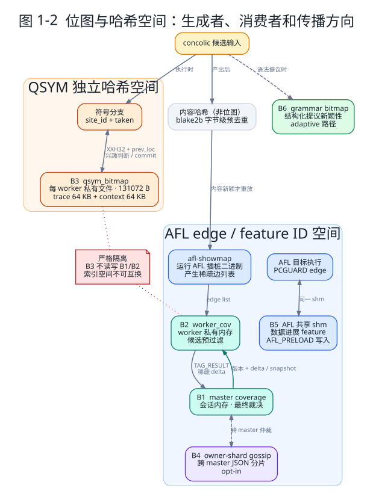

> 可缩放 SVG；[PNG 版本](diagrams/qa3/fig-1-2-bitmap-spaces.png)；[DOT 图源](diagrams/qa3/src/fig-1-2-bitmap-spaces.dot)。


| # | 名字 | 位置 | 大小 / 空间 | 干什么 |
|---|---|---|---|---|
| **B1** | master `coverage` (`CoverageBitmap`) | 内存 `bytearray` + `set[int]`，`:2407` | 惰性 65536，**可增长** | helper 已观察到的 AFL edge/hit-count bucket bits；**只在本 helper 会话内**最终裁决 concolic 候选，不是 AFL campaign 的持久 virgin map |
| **B2** | worker `worker_cov` | 内存，`:4580` | 由 B1 经 MPI delta 播种 | 上报 master 前的**本地预过滤**；在确定性重放、相同目标/环境/map 下保持 coverage |
| **B3** | `qsym_bitmap` | **文件** `worker_dir/qsym_bitmap`，`:4477-4479` | **2×65536 = 131072 B**，XXH32 空间 | 分支方向/上下文的**兴趣与已尝试状态**，在 concolic runtime 内部剪枝；不是 SAT/成功求解记录。**⚠ 只存在于 SymCC/QSYM 路径**：`SymSanEngine` 不读 `SYMCC_AFL_COVERAGE_MAP` |
| **B4** | `CoverageOwnerShardGossip` 分片 | 磁盘 JSON，`symcc01/.coverage_owner/state/NNNN.json` | 按 bitmap 下标分片 | 跨 **master**（多节点）全局新颖性仲裁，opt-in |
| **B5** | AFL 目标执行时共享图 `__afl_area_ptr` | 每个 AFL 目标执行绑定的 shm | `MAP_SIZE 65536` | `AFL_PRELOAD` 写入数据进展 feature；AFL 实例自己的 virgin state 决定是否保留（见 §1.8） |

加一层**非位图**去重：内容哈希（§1.7）。

还有两处容易漏的：
- **B6 语法位图**：`util/semantic_proposals.py:419` 的 `GRAMMAR_BITMAP_SIZE = 1 << 16` + `grammar_bitmap`，用于结构化提议的新颖性判定——**第六张图**。（⚠ 它由 `semantic_proposals` 侧维护；`mpi_fuzzing_helper.py` 里搜不到 `grammar_bitmap`，本文未能确认它在 `--adaptive` 下的确切启用条件。）
- **分片版 delta journal**：`SYMCC_BITMAP_SHARDS > 1` 时 `ShardedBitmapDeltaJournal`（`distributed_state.py:143`）会取代下面讲的 `BitmapDeltaJournal`（`:2997-2999`）。

### B3 —— 默认决定"是否值得尝试求解"的那张图

代码在 vendored QSYM 里：`runtime/src/backends/qsym/qsym/qsym/pintool/afl_trace_map.cpp`。

```cpp
// :16-34  分支哈希：只哈希传入的 site identity 和方向，和 AFL edge ID 毫无关系
XXH32_hash_t hashPc(ADDRINT pc, bool taken) {
  XXH32_state_t state;
  XXH32_reset(&state, 0);
  XXH32_update(&state, &pc, sizeof(pc));
  XXH32_update(&state, &taken, sizeof(taken));
  return XXH32_digest(&state) % kMapSize;      // kMapSize = 65536, :5
}
// :66-68  边索引：模仿 AFL 的 prev_loc 混合
ADDRINT AflTraceMap::getIndex(ADDRINT h) { return ((prev_loc_ >> 1) ^ h) % kMapSize; }
```

判定 + 落盘（`:130-162`）：

```cpp
bool AflTraceMap::isInterestingBranch(ADDRINT pc, bool taken) {
  ADDRINT h = hashPc(pc, taken);
  ADDRINT idx = getIndex(h);
  bool new_context = isInterestingContext(h, virgin_map_[idx]);
  bool ret = true;
  virgin_map_[idx]++;
  if ((virgin_map_[idx] | trace_map_[idx]) != trace_map_[idx]) {
    ADDRINT inv_h = hashPc(pc, !taken);
    ADDRINT inv_idx = getIndex(inv_h);
    trace_map_[idx] |= virgin_map_[idx];
    // mark the inverse case, because it's already covered by current testcase
    virgin_map_[inv_idx]++;                    // ← 反方向也被标记为已覆盖
    trace_map_[inv_idx] |= virgin_map_[inv_idx];
    commit();                                  // ← 立刻写回文件
    virgin_map_[inv_idx]--;                    // ← 只还原本地命中计数;trace_map_ 的标记【不还原】
    ret = true;
  }
  else if (new_context) {
    ret = true;
    commit();
  }
  else
    ret = false;
  prev_loc_ = h;
  return ret;
}
```

文件格式 = `trace_map_`（64KB）紧跟 `context_map_`（64KB），`commit()`/`import()` 在 `:107-117`/`:51-64`。
路径来自 `SYMCC_AFL_COVERAGE_MAP`（`runtime/src/Config.cpp:75-77` → `runtime/src/backends/qsym/Runtime.cpp:130`）。

**【论文】这套设计出自 QSYM §3.3 "Basic Block Pruning"**：*"QSYM measures the frequency of each basic block execution at runtime and selects repetitive blocks to prune. If a basic block has been executed too frequently, QSYM stops generating further constraints from it."*，其中 `context_map_` 对应 *"**Context-sensitivity** acts as a tool for distinguishing running the same basic block in a different context for frequency counting."*
⚠ **论文并未描述** `(prev_loc>>1) ^ XXH32(pc,taken)` 这个 AFL 式的边索引——那是实现层的东西。这反而**加强**了 [§1.0](#q1) 的论断：它和 AFL 的边 ID 是两套独立设计，不是同一套的两种叫法。

调用点在 `solver.cpp:4675-4685`：

```cpp
bool Solver::isInterestingJcc(ExprRef rel_expr, bool taken, ADDRINT pc) {
  bool interesting = trace_.isInterestingBranch(pc, taken);
  last_interested_ = interesting;
  return interesting;
}
```

#### 【实测】B3 的过滤效果：同一个种子跑 5 次

```bash
SEED=benchmark/public/seeds/google-fts/xml_read_fuzzer/seed_01.xml
for i in 1 2 3 4 5; do
  mkdir -p out$i                      # SymCC 不会自己建目录,不建则 exit 255、0 产出
  SYMCC_OUTPUT_DIR=out$i SYMCC_INPUT_FILE=$SEED \
  SYMCC_AFL_COVERAGE_MAP=./qsym_bitmap SYMCC_TELEMETRY_OUT=tel$i.json \
  benchmark/public/bin/google-fts/xml_read_fuzzer $SEED
done
```

| 轮 | symbolic_branches | interesting_branches | z3_solves | 输出 | solver 耗时 |
|---:|---:|---:|---:|---:|---:|
| 1 | 240 | **225** | 225 | **225** | 64.9 ms |
| 2 | 240 | **0** | 0 | **0** | 0.0 ms |
| 3 | 240 | 0 | 0 | 0 | 0.0 ms |
| 4 | 240 | 0 | 0 | 0 | 0.0 ms |
| 5 | 240 | 0 | 0 | 0 | 0.0 ms |

`qsym_bitmap` 文件大小：**131072 字节**（= 2×65536，和代码一致）。

**读法**：符号分支数恒为 240（程序没变），但第 2 轮起 `interesting` 归零——B3 记住了
第 1 轮已经**尝试过的分支方向/上下文**，所以基线策略不再发查询。这里不能推出 225 个查询
全部 SAT，更不能推出其模型都产生了有效测试。编译器在 `compiler/Symbolizer.h:352-356`
传入 `stableSiteId`；QSYM 中沿用的参数名 `pc` 只是历史命名，不是 ASLR 敏感的运行时地址。

此外 B3 不是不可越过的硬门：`SYMCC_TARGET_BRANCH` 或 S2F `solve/sample` 可强制设置
`is_interesting=true`，`SYMCC_SKIP_SITES`、directed pruning 或 S2F `skip` 则可在 B3
记账之后阻止求解（`solver.cpp:1293-1380`）。B3 文件仅为**每 worker 私有**，当前没有
跨 worker 合并，因此相同 site/context 仍可能被多个 worker 分别尝试。

### B1 / B2 —— 决定"产出是不是重复"的那张图

类定义 `util/mpi_fuzzing_helper.py:674-813`。核心是重新实现的 AFL `has_new_bits`（`:791-813`）：

```python
def _merge_sparse_delta(self, edges: list) -> int:
    if self.data is None:
        self.data = bytearray(_AFL_MAP_SIZE)
    delta = 0
    for edge_id, hit in edges:
        if edge_id >= len(self.data):          # 目标 map 比初值大 → 增长
            self.data.extend(b"\x00" * (edge_id + 1 - len(self.data)))
        old = self.data[edge_id]
        new_bits = hit & ~old                  # 新观察到的 hit-count bucket bits
        delta += new_bits.bit_count()
```

`hit` 是 afl-showmap 已经分桶（1,2,4,8,16,32,64,128）后的计数字节（因为三处调用都没传 `-r`/`-s`），所以 `hit & ~old` 是**逐桶**精确的：同一条边命中次数进了新桶也算"新"。

**判定点（worker 侧，`:1208-1232`）** —— 整个框架最关键的一段：

```python
for entry, content in uniq:
    if worker_coverage is not None and (use_batch or streaming_showmap is not None):
        edges = (batch_edges.get(entry.path) if use_batch
                 else streaming_showmap.get_edges(content))
        if edges is None:                      # 无 map(超时/崩溃) 或流式进程死亡
            redun["showmap_none"] += 1
            continue
        is_new = worker_coverage.merge(edges)  # ← B2 判新
        ...
        if is_new:
            tc_entry = {"content": content, "bitmap": edges}   # 只有判新的才回传
```

**判定点（master 侧，`:1530-1559`）**：优先直接用 worker 传回的稀疏边列表，退化才自己跑 showmap；然后 `coverage.merge_delta(bitmap_data)`，`coverage_delta > 0` 才写进队列。

→ B2 是 worker 的保守预过滤，B1 是 helper 会话内的最终裁决。 在目标确定、输入重放
确定、目标 argv/环境与 map 一致时，B2 只会因状态较旧而多报候选，不会漏掉相对 B1 的新
coverage；但对并发调度、非确定性目标或同字节输入的语义多样性，它可能丢失不同执行结果。
B1 又因为没有从 AFL 队列初始化，不能代表整个 AFL campaign 的全局历史。

### 更底一层：AFL 的边 ID 本身是怎么来的（PCGUARD）

前面讲的是"怎么把一次执行**读**成边集"，这里补上"边 ID **从哪来**"——这一层直接决定了 §1.0 的"两个哈希空间"论断成不成立。

本项目用 clang-18 + `afl-clang-fast`，走的是 **PCGUARD**（LLVM SanitizerCoverage 的 `trace-pc-guard`），不是老式的编译期随机 `cur_loc`。AFL++ 运行时的实现（[`instrumentation/afl-compiler-rt.o.c`](https://github.com/AFLplusplus/AFLplusplus/blob/stable/instrumentation/afl-compiler-rt.o.c)，stable 分支，**下面三段来自文件的三个不同位置，注释为源码原文**）：

```c
/* ── 位置 1：命中时的自增（函数体，:2195-2233；中间 30 行是注释掉的调试代码，此处以 ... 略去）*/
void __sanitizer_cov_trace_pc_guard(uint32_t *guard) {
  ...
  __afl_area_ptr[*guard] =
      __afl_area_ptr[*guard] + 1 + (__afl_area_ptr[*guard] == 255 ? 1 : 0);
}
```
**下标就是 `*guard` 本身，没有 `prev_loc` 异或。**

```c
/* ── 位置 2：加载期一次性分配 guard 值（:2802-2814）*/
  if (__afl_final_loc < 4) __afl_final_loc = 4;  // we skip the first 5 entries

  *(start++) = ++__afl_final_loc;

  while (start < stop) {
    if (likely(inst_ratio == 100) || AFL_R(100) < inst_ratio) {
      *(start++) = ++__afl_final_loc;
    } else {
      *(start++) = 0;  // write to map[0]
    }
  }
```
**全局计数器顺序递增**（从 5 开始）；抽样未命中的边写 0，即全部落到 `map[0]`。

```c
/* ── 位置 3：map 大小由实际插桩边数决定（:820 与 :1150）*/
    __afl_map_size = __afl_final_loc + 1;  // as we count starting 0
```

**【一手证据】编译产物层面**（`docs/evidence/img_d2_pcguard.png`）：对一个 4 个 `if` 的小目标做
`clang -fsanitize-coverage=trace-pc-guard -c` 再 `objdump -dr`，可以直接数出
`main` 里 10 处 `__sanitizer_cov_trace_pc_guard` 调用 = 基本块数，
`__sancov_guards` 段 **44 字节 = 11 个 4 B guard**，即**每基本块一个、无 hash 碰撞**；
同一目标 `afl-showmap -C` 报 **`map size 16`**——不是 65536。

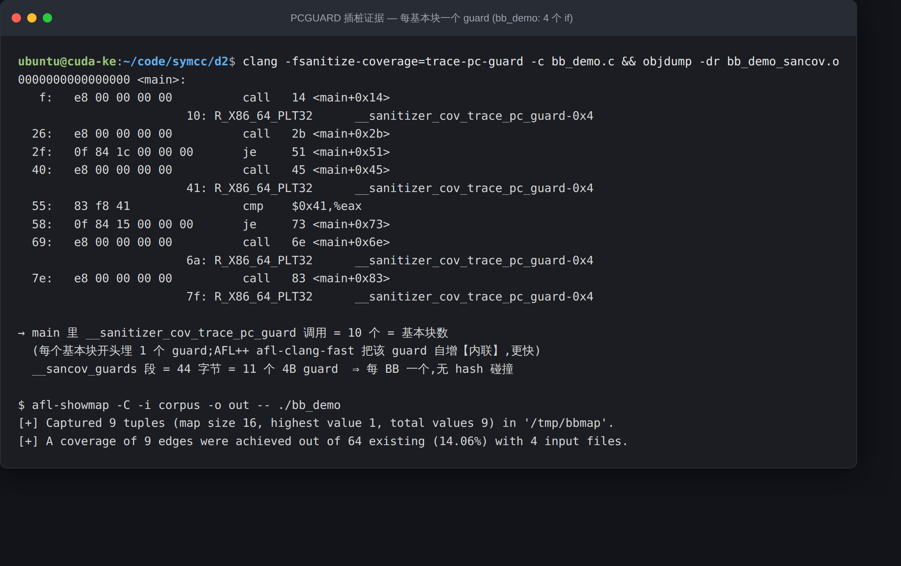

三个直接后果：

1. 边 ID 是加载期顺序分配的整数，不是编译期随机数、也不做 `prev_loc` 异或——所以它与 QSYM 的 `XXH32(pc,taken)` + `(prev_loc>>1)^h`（[§1.4 B3](#q1)）是**根本不同的两套东西**，无法互相索引。这就是 §1.0 那条论断的底层依据。
2. **`MAP_SIZE=65536` 不是硬上限**，是起步值；`__afl_map_size = __afl_final_loc + 1` 随目标插桩规模走。这也是为什么 B1/B2 必须**可增长**（`:796-797`）——不是边界情况，是常态。
3. **`__afl_final_loc` 可以被外部抬高**——本项目的 `util/afl_data_coverage_rt.c:63-65` 正是这么干的：
   ```c
   __attribute__((constructor)) static void data_cov_reserve_namespace(void) {
     if (&__afl_final_loc && __afl_final_loc < MAP_SIZE)
       __afl_final_loc = MAP_SIZE;
   }
   ```
   `LD_PRELOAD` 的构造函数先于主程序的 `.init_array` 执行，于是 guard 从 **65537** 起分配，低位 64 KB 留给数据覆盖（[§1.8](#q1)）。**这就是第三个 ID 空间的来源**：同一个二进制，在 `AFL_PRELOAD` 下的 afl-fuzz 进程里边 ID 从 65537 起，而 helper 自己跑的 `afl-showmap`（不带 preload）从 5 起。

### 位图怎么"生成"：三种 afl-showmap 调用

关键前提：跑的永远是 AFL 插桩二进制，从来不是 SymCC/SymSan 二进制。
目标 argv 从 `fuzzer_stats` 的 `command_line` 解析（`:479-511`），worker 复用同一个 `AflConfig`（`:4764-4769`）。

| 模式 | 命令行 | 单次成本 | 用在哪 |
|---|---|---:|---|
| (c) **批量**（默认热路径） | `afl-showmap -I <listfile> -o <mapdir> -t 5000 -m none -q -- <afl_bin> [@@]`（`:1433-1437`） | ~25 µs/输入 | worker 去重主路径 |
| (b) **流式 forkserver** | `afl-showmap -S -t 5000 -m none -- <afl_bin>`（`:1337-1338`） | ~0.6 ms/输入 | 批量不可用时回退 |
| (a) **每输入 fork，二进制 map** | `afl-showmap [-Q] -t 5000 -m none -b -o <bitmap>`（`:627-630`） | 最慢 | master triage 兜底 + K-Scheduler |

> **还有第四种，不在 helper 里**：`benchmark/run_benchmark.py:810-818` 的
> `afl-showmap -t T -m none -C -i <语料目录> -o <文件>`——**带 `-C`，一次吃整个语料目录**。
> 全文（尤其 Q3/Q6）引用的 **ShowmapCov 覆盖率数字都出自它**，不是上面三种。

**【一手证据】**（`docs/evidence/img_showmap.png`）：pcre2 上跑这条命令，输出同时印证了三件事——
`Persistent mode binary detected`（§6.6 的持久模式）、
`Captured 702 tuples (map size 9697, …)`（**又一次证明 map 不是固定 65536**）、
`A coverage of 702 edges were achieved out of 9728 existing (7.22%) with 8 input files`。

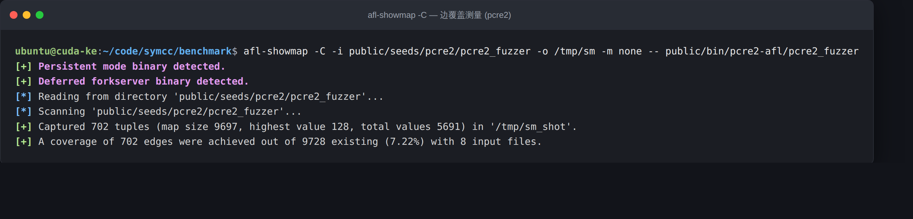

批量模式**不带** `-b`/`-C`，afl-showmap 给每个输入写一份**文本** map，按 `edge_id:count` 解析（`:1446-1453`）：

```python
with open(os.path.join(mapdir, os.path.basename(p))) as mf:
    edges = []
    for line in mf:                    # map 每行 "edge_id:count"
        eid, _, cnt = line.strip().partition(":")
        edges.append((int(eid), int(cnt) if cnt else 0))
```

流式模式的帧协议（`:1369-1391`）：`[u16 status][u32 edges_count][(u32 eid, u8 count) × N][u32 stdout_len][stdout][u32 stderr_len][stderr]`，用 `struct.Struct("<IB").iter_unpack` 解（`:132`），上限 `_MAX_EDGES = 1<<20`。

持久模式检测（决定要不要带 `@@`）用的是**字符串**而非符号（`:1332-1336`）：
```python
self._uses_shmem = b"##SIG_AFL_PERSISTENT##" in _bf.read()
```
> ⚠ 这里绝不能改用 `__afl_sharedmem_fuzzing` 符号判断——fork 模式的 cmplog 伴随二进制也定义该符号，误判会让 `afl-fuzz` 直接 "Fork server handshake failed"、所有轮次覆盖率归零（`benchmark/run_benchmark.py:1438-1450`）。

### B1 → B2 的传播：没有共享文件，全走 MPI

master 侧（`:3710-3718`）按 worker 的版本号决定发全量快照还是稀疏 delta；版本号只在**真有新覆盖**时才自增（`:4233-4236`）。
`BitmapDeltaJournal`（`util/distributed_state.py:84-140`）保留有界历史（`SYMCC_BITMAP_HISTORY`，默认 64）；worker 落后超窗口就发全量（`:107-108`）。
worker 侧应用（`:4689-4694`），`apply` 是按位 OR 合并（`distributed_state.py:139`）。

**【实测】这一步的开销**：见 §1.6 的相位计时，显示精度下 `bmsync` 为约 0.01 s、
0.02 ms/工作项；在这次短测中可忽略，但不能表述成“完全免费”。

### ⚠ 三处需要在文档里说清的"文档/代码不一致"

1. **`init_from_afl` 是死代码。** `CoverageBitmap.init_from_afl`（`:691-730`）本可用 AFL 现有队列预热 B1，但全仓库只有定义、无调用。master 明确跳过（`:2403-2405`）：
   ```python
   coverage = CoverageBitmap()
   # 跳过耗时的 bitmap 初始化 — 前几个 triage 结果会自然建立 bitmap，
   # 代价是初期可能有少量假阳性 (interesting)，但不影响正确性
   ```
   **后果**：B1 从**空**开始，头几个 concolic 产出只要带非零 map feature 就会被 helper
   判“新”，哪怕 AFL 实例自己的 virgin state 早已见过。AFL 在 sync 时仍会用自己的持久
   状态再判一次，因此这是额外 I/O/排队假阳性，而不是对 AFL 保留语义的替代。
2. **`.shared_bitmap` 这个文件已经不存在了。** `docs/Parallel_Architecture_Report.md:172`、`docs/PPT_Material_Complete.md:342`、`docs/SymCC_Technical_Deep_Dive.md:251` 和**一处**代码注释（`util/mpi_fuzzing_helper.py:5296`）还在描述它。**没有任何代码读写它**，现役机制是上面的 MPI `BitmapDeltaJournal`。
3. **`_snap` 读错了图，而且会直接打死 worker** —— 撰写本文期间发现并已修复。
   原代码 `:1057-1068` 把 `SYMCC_AFL_COVERAGE_MAP` 当成"全局 AFL 覆盖快照"读，但 `:4479` 让该变量指向 **B3**（`qsym_bitmap`，XXH32 空间、131072 B）——**索引空间根本对不上**。
   更糟的是 `:1218` 写的是 `any(e >= len(_snap) ... for e in edges)`，而 `edges` 是 `[(edge_id, count)]` **元组列表** ⇒ `tuple >= int` ⇒ **`TypeError`**，且不被 `:1237` 的 `except (IOError, OSError)` 捕获，**整个 worker rank 当场死掉**。
   触发条件：`SYMCC_WORKER_PROFILE=1` **且**已有 `qsym_bitmap`（即每个 worker 的第 2 个 item 起）。这正是**仓库里从来没有可用 `redundancy.csv` 的根本原因**——一开 profiling 就崩。
   本文第一次跑漏斗实测时就撞上了它（`mpi.log` 里 8 份 `TypeError: '>=' not supported between instances of 'tuple' and 'int'`）。
   **已修**：快照改取自 `worker_coverage.data`（AFL 边 ID 空间，语义正确），并按 `for eid, _ in edges` 取下标。

## 1.5 单个 concolic worker 的完整执行次序

> **读法**：下面是**扁平编号**，但实际有嵌套和跨进程边界——步骤 10–13 都发生在步骤 9 的 `run_symcc_worker`（`:1022-1241`）**内部**；步骤 16–17 在 **master 进程**里。相位时钟的边界：`exec` 止于 `:1104`，`showmap_dedup` 起于 `:1110`。图 1-3 的泳道图画的就是这个结构。
> 另有一条**提前返回分支**：消息里带 `continuation_id` 时，worker 直接恢复检查点并 `send(TAG_RESULT); continue`，**跳过步骤 4–15**（`:4699-4755`）。

### 图 1-3 一个工作项的完整时序


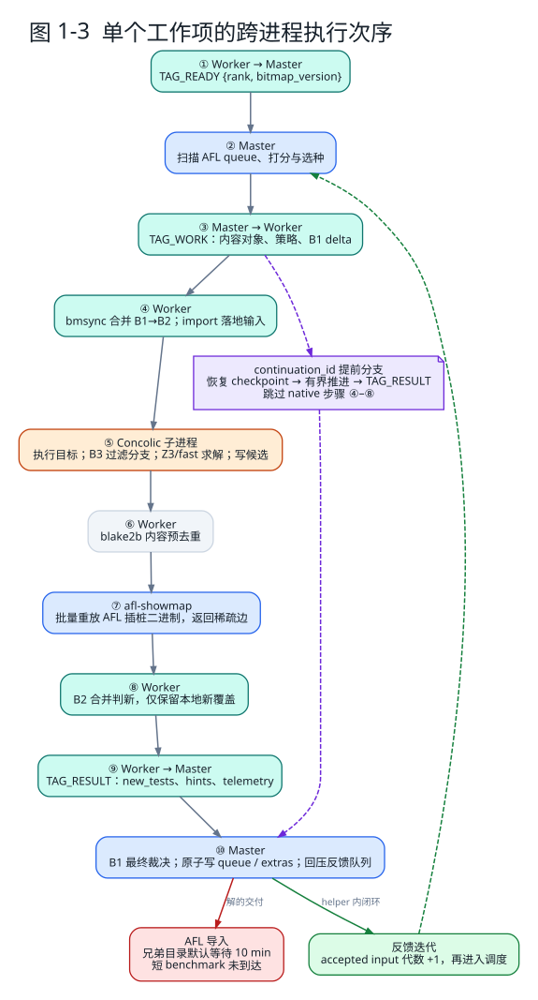

> 可缩放 SVG；[PNG 版本](diagrams/qa3/fig-1-3-worker-sequence.png)；[DOT 图源](diagrams/qa3/src/fig-1-3-worker-sequence.dot)。


1. **启动一次**：`worker_dir = mkdtemp("symcc_mpi_w{rank}_")`（`:4473`）；置 `SYMCC_AFL_COVERAGE_MAP=worker_dir/qsym_bitmap`（**B3**，`:4477-4479`）；置 `SYMCC_TELEMETRY_OUT`/`SYMSAN_TELEMETRY_OUT`（`:4483-4484`）；建 `worker_cov`（**B2**，`:4580`）和 `worker_seen`（内容哈希集，`:4581`）。
2. `comm.send({"rank","bitmap_version"}, TAG_READY)`（`:4658`）→ 阻塞 `recv` ——相位 **`wait`**。
3. 收到 `TAG_WORK`；若 `bitmap_version` 前进，把 B1 的 delta 并进 B2 ——相位 **`bmsync`**（`:4689-4694`）。
4. 首个 item 时惰性建 `StreamingShowmap`，最多重试 5 次（`:4757-4777`）。失败则退化为 master 侧全量 showmap。
5. 按内容摘要落地输入（或 `copy2` 兜底）——相位 **`import`**（`:4779-4805`）。
6. 设 per-item 环境：`SYMCC_FOCUS_BYTES`/`SYMCC_FOCUS_SET`（`:4810-4820`）、策略 profile（`:139-157`, `:4826-4839`）、`SYMCC_TARGET_BRANCH`/`SYMCC_S2F_ACTIONS`（`:4840-4849`）、`SYMCC_TIMEOUT_OUT`（`:4915-4921`）、DPOR 的 `SYMCC_SCHEDULE_*`+`LD_PRELOAD`（`:4923-4957`）。（`SYMCC_SKIP_SITES` 不是 per-item，worker 启动时设一次，`:4553-4554`。）
7. 解析 `ExecutionRoute`（执行器类 → 引擎/命令/超时，`:4864-4865`）——**必须在 TACE 之前**，因为 TACE 要读 `execution_route.engine`。
8. 可选 TACE 依赖剖析（一次、无求解、按输入摘要缓存，`:4866-4902`；仅 `--engine symcc` 生效）；建 `run_output = worker_dir/output_{monotonic_ns}`（`:4907`）。
9. **跑** `run_symcc_worker`（`:4964-4975`）。引擎决定 argv（§1.9）。超时：内层 `timeout -k 5 <timeout_sec>`，外层 Python `timeout_sec + 15` 兜底（`:1080`）；`killed = retcode in (124, -9, 137)`（`:1105`）——相位 **`exec`**。
10. 收集产出：`os.scandir(run_output)`，跳过点文件和 `.hints`；`.hints` 侧车按 `offset:oldhex:newhex` 解析进 `hint_map`（`:1136-1164`）。
11. **内容预去重**（blake2b-128 对 `worker_seen`）→ `uniq`（`:1173-1192`）。
12. **批量 showmap**（`:1194-1204`），退化则逐个流式 `get_edges`。
13. **B2 合并判新**（`:1207-1231`），只把判新的塞进 `new_tests` ——相位 **`showmap_dedup`**。
14. 读 telemetry JSON（`:4990-5040`）。
15. `comm.send(result, dest=0, TAG_RESULT)`（`:5128`），`rmtree(run_output)`（`:5114`）——相位 **`send`**。
16. **master `_batch_triage`**（`:1494-1697`）：B1 合并（或 B4 认领）→ 若 `coverage_delta > 0`：
    - 原子写 `symcc01/queue/id:{queue_id:06d},src:{src_id}`（tmp + `os.replace`，`:1560-1574`）；
    - 记代数，未超 `MAX_GENERATION_DEPTH` 则压回 `symcc_feedback_queue`（`:1576-1584`）——**这就是 concolic 自反馈环**；
    - **同时**原子写 `<afl_out>/fuzzer01/queue/id:symcc_{queue_id:06d},src:{src_id}`，并把内容哈希登记进 `processed_content_hashes` 免得回头再分析（`:1585-1603`）；
    - hint 字节聚合成多字节 token → `symcc01/extras/hint_{n%4096:06d}`（`:1607-1637`），AFL 自动当字典用；
    - `recent_byte_offsets` → 下一轮的 `focus_bytes` 窗口（`:1639-1645`, `:4246-4253`）。
17. 非覆盖类结局：当前代码把 `killed` 的**父输入**拷进 `hangs/`（`:1663-1675`），把
    `retcode > 128 && retcode != 137` 的**父输入**拷进 `crashes/`（`:1676-1691`）。
    `--save-all` 又位于 `for tc in new_tests` 内（`:1516-1524`），只保存已经过 worker
    bitmap 的候选，而非原始全部产出。

> 已知正确性缺陷：crash-only/hang-only 候选可能被静默丢失。 默认批量 showmap 对发生
> crash/hang 的候选不生成 map 文件（`:1415-1453`）；worker 随后把 `edges is None` 的候选
> 记为 `showmap_none` 并跳过（`:1207-1216`），所以 candidate bytes 不进入 `new_tests`。
> master 最后的 crash/hang 分支保存的却是本次工作的 `input_path`（父种子），不是触发异常的
> candidate。因而“无新 coverage、只触发异常”的候选可能既不进 AFL，也不进正确的
> `crashes/`/`hangs/`。本文把它列为待修复项；修复前不能把 helper 的 crash 目录或
> `--save-all` 当成完整异常语料。

<a id="q1-funnel"></a>
## 1.6 【实测】端到端漏斗 + 相位计时

> 这份数据**仓库里此前从未产出过**，而且原因不是没人跑——**是一开 profiling 就崩**。
> `redun_*.csv` / `phase_timing_*.csv` 需要 `SYMCC_WORKER_PROFILE=1`，而该分支上有一个
> `TypeError` 会在每个 worker 的**第 2 个工作项**打死整个 rank（详见 [§1.4 第 3 条](#q1)）。
> 撰写本文期间撞到、定位、修复之后才拿到下面的稳态数据。修复前后的差别很直观：
>
> | | 修复前 | 修复后 |
> |---|---:|---:|
> | 8 个 worker 完成的工作项 | **9** | **322** |
> | 反馈代数 `max_depth` | 1 | **3** |
> | concolic 产出 | 799 | **3,154** |
>
> 复现：`benchmark/qa3_repro/funnel.sh`。AFL `-M fuzzer01` 预热 25 s（**持久模式，不带 `@@`**，
> 见下方陷阱）攒到 3,149 个队列项；再起 `mpirun -np 9` helper（1 master + 8 worker）跑 180 s，
> `SYMCC_TIMEOUT=10 SYMCC_WORKER_PROFILE=1 SYMCC_MASTER_PROFILE=1`，目标 gfts xml。

**漏斗**（8 个 worker、322 个工作项，`redun_rank*.csv` 汇总 + `redun_master.csv`，schema `:4638-4640`）：

| 阶段 | 计数 | 占产出 |
|---|---:|---:|
| concolic 产出（generated） | **3,154** ／ 审计复跑 3,058 | 100 % |
| → 过 **worker 位图 B2**（reported） | **299** ／ 379 | **9.5 %** ／ 12.4 % |
| → 过 **master helper 位图 B1**（accepted，写入同步目录） | **167** ／ 188 | **5.3 %** ／ 6.1 % |

| 冗余成因 | 计数 | 占产出 |
|---|---:|---:|
| **worker 内冗余**（gen − reported） | 2,855 ／ 2,679 | 90.5 % ／ 87.6 % |
| ├ 字节完全相同，直接跳过 showmap（`byte_dup`） | **1,098** ／ 939 | **34.8 %** ／ 30.7 % |
| └ 有新边但本 worker 已自覆盖（`worker_fresh`） | 403 ／ 497 | 12.8 % ／ 16.3 % |
| **worker 间冗余**（reported − accepted） | 132 ／ 191 | 4.2 % ／ 6.2 % |

（`redun` 在代码里有四个桶：`byte_dup` / `showmap_none` / `infeasible` / `worker_fresh`。本轮
`showmap_none` 与 `infeasible` 本轮均为 0，但 `byte_dup + worker_fresh = 1,501` 仍小于 `gen − reported = 2,855`——
差额来自**读文件即失败**（`:1187-1190` 的 `except (IOError, OSError): continue`）等未落入任一桶的产出。
**这张表不是完全穷尽的**，主漏斗 3154 → 299 → 167
才是本轮 helper 日志的总量口径。）

### 图 1-4 四层过滤漏斗（实测，xml，8 worker × 322 工作项，180 s）


> 可缩放 SVG；[PNG 版本](diagrams/qa3/fig-1-4-filter-funnel.png)；[绘图脚本](diagrams/render_qa3_diagrams.py)。


**读法**：
- **两级位图各自都在干实事**：worker 侧砍掉 **90.5 %**；剩下 299 个交给 master，master 又拒掉 **44.1 %**（132/299）；最终 **5.3 %** 的 concolic 产出进得了 AFL 队列。
- **字节完全相同的重复产出占 34.8 %**——对本次确定性 xml 重放，这一项无需再跑 showmap，
  是内容预去重（§1.7）省下的成本；并发调度、时钟/随机数或其他非确定性输入通道会破坏
  “同字节即同执行”的前提。
- **worker 间冗余只有 4.2 %**，比预期低得多。原因是这一轮 AFL 队列有 3,000+ 项，8 个 worker 拿到的种子差异大；种子池小的时候这个数会显著上升（对照 `docs/Research_and_Optimization_Report.md:365-395`：6 worker 端到端有效率 30.0 %，14 worker 降到 18.6 %——注意那是 **interesting/产出** 的端到端比率，对应本表的 **5.3 %**，不是 4.2 % 那一格）。
- `max_depth=3` 说明**反馈环真的在转**：concolic 产出被接受 → 回喂 → 再被 concolic 分析，最深迭代到第 3 代。

> **⚠ 一个容易踩、值得记录的陷阱**：本实验最初两次给 `afl-fuzz` 带了 `@@`，而 xml 的 AFL 二进制是**持久 + shmem** 模式。结果 AFL 在 90 秒内只攒出 20 个队列项，漏斗退化成 `1515 → 8 → 1`——表面看像"concolic 产出几乎全是废品"，实际是**上游 AFL 已被这个参数打瘸**。量化对比见 [§6.6](#q6)。
> **排查"concolic 没用"之前，先确认 AFL 本身处于健康状态。**

### 图 1-5 时间花在哪（实测，8 worker 合计 / 322 工作项）


> 可缩放 SVG；[PNG 版本](diagrams/qa3/fig-1-5-phase-time.png)；[绘图脚本](diagrams/render_qa3_diagrams.py)。


**相位计时**（两次独立运行并列——**这两次的相位排序完全相反，故不能当作结论**）：

| 相位 | 运行 A（本文） | 运行 B（审计复跑） | 每工作项（A / B） | 稳定性 |
|---|---:|---:|---:|---|
| `exec` | 52.82 s (31.8 %) | **79.67 s (41.4 %)** | 164 / 247 ms | 都是大头 |
| `wait` | 43.09 s (25.9 %) | 70.34 s (36.5 %) | 134 / 218 ms | 波动大 |
| `send` | **64.96 s (39.1 %)** | 36.98 s (19.2 %) | 202 / 115 ms | **波动大** |
| `showmap_dedup` | 4.54 s (2.7 %) | 4.97 s (2.6 %) | 14.1 / 15.4 ms | **稳定** |
| `import` | 0.69 s (0.4 %) | 0.64 s (0.3 %) | 2.2 / 2.0 ms | 稳定 |
| `bmsync` | **0.01 s (0.0 %)** | **0.01 s (0.0 %)** | **0.02 / 0.02 ms** | **完全稳定** |
| 工作项数 | 322 | 322 | — | **完全一致** |

**只有下面三条在两次运行里都成立，可以当结论**：

- **`bmsync` 恒为 0.02 ms/工作项**——位图版本同步 + 稀疏 delta 合并**几乎不花钱**。这是本文关于位图机制最硬的一条；
- **`showmap_dedup` 14–15 ms/工作项**（每工作项约 10 个产出 ⇒ **~1.4–1.6 ms/产出**）；
- **master 侧扫 AFL 队列是瓶颈**：运行 A `scan=83.60s/180s`，运行 B `scan=108.59s/180s`，两次都占一半以上；而 dispatch+recv+triage 两次都 < 9 s。

**⚠ 不能当结论的**：`send` / `exec` / `wait` 三者的**相对大小在两次运行之间即发生翻转**（运行 A 是 `send` 最大，运行 B 是 `exec` 最大）。因此不存在"某一项是主要开销"这样的结论，早期草稿中"真正的大头是 send（39.1 %）"一句已作废。

**⚠ 记账率只有 12 %**（166 s / 8×180 s）。相位计数器只累加**已完成**的片段，末次阻塞在 `recv` 的时间在 teardown 时被丢弃（`:4629-4634`）。所以这张表只能读作"**在干活的时候时间花在哪**"，**不能**读成"框架开销占比"。

## 1.7 内容哈希（不是位图，但是第一道闸）

(a) blake2b-128，worker 侧，挡在 showmap 前面（`util/mpi_fuzzing_helper.py:1167-1191`，逐字）：
```python
# 内容级预去重(#1,跨 item):SymCC 常吐出【字节完全相同】的重复输出(实测约 23–28%);字节相同
# → 边集必然相同 → dedup 结果必与首次相同(不可能为"新"),可跳过昂贵的 showmap。用 worker 生命
# 周期的有界集(worker_seen)兼吃 item 内与 item 间重复;未提供则退回 per-item 集。
    ...
            _ckey = hashlib.blake2b(content, digest_size=16).digest()
            if _ckey in seen_content:
                if redun is not None:
                    redun["byte_dup"] = redun.get("byte_dup", 0) + 1
                continue
```
（中间省略 19 行，以 `...` 标出。前两行注释是**源码原文**；"边集必然相同"这个推断成立的前提是同目标、同 argv/环境、确定性重放。）
有界集 `_WORKER_SEEN_CAP = 300_000`（`:112`），worker 生命周期。
**和 showmap 去重的关系：在确定性重放假设下是省钱，放在它前面。** 对调度探索、
非确定性目标或文件以外的隐式输入，同一字节串可能产生不同执行；此时内容去重会丢失
语义多样性，不能宣称无条件 coverage-preserving。
【实测】本轮 xml 上 `byte_dup = 1,098/3,154` = **34.8 %**，比仓库注释里记的
23–28 % 还高；该节省只在上述确定性条件成立时有效。

**(b) SHA-256，master 侧，种子级**（`:580-585`, `:591-592`）：跳过内容已分析过的 AFL 种子；concolic 自己写回 AFL 队列的产出也登记进去（`:1598-1601`），避免自己分析自己，并由 `PersistentShardLedger` 跨重启持久化（`:2415-2425`）。

## 1.8 B5：往 AFL 目标执行时的共享图写数据流进展

`util/afl_data_coverage_rt.c` 是个 `AFL_PRELOAD` 库，把**数据流进展**注入 AFL 自己的 shm 位图：

```c
:110  afl_area_ptr_addr = (unsigned char **)dlsym(RTLD_DEFAULT, "__afl_area_ptr");
:115  const char *shm_id_env = getenv("__AFL_SHM_ID");
:120  void *area = shmat((int)shm_id, NULL, 0);
:168  for (size_t prefix = 0; prefix <= matched; ++prefix) {
:169    uint64_t h = fnv_mix(base, (uint64_t)prefix);
:170    size_t idx = (size_t)(h % afl_data_map_size);
:171    map[idx]++;
```
它 hook `memcmp/strcmp/...`，对从 0 到当前匹配长度的每个前缀写一个散列槽。因此
“匹配 N 字节 → 匹配 N+1 字节”会**尝试**增加一个 data-progress feature；只有该槽/计数桶
相对 AFL 实例的 virgin state 确实新颖时，AFL 才会据此保留输入。FNV 取模会碰撞，计数字节
也会饱和/分桶，所以 N→N+1 不是“必然产生新 bit”的数学保证。源码注释中的 “at least one
genuinely new” 应理解为设计意图，而非无碰撞证明。

> **⚠ 这引出第三个 ID 空间。** `:62-65` 把 `__afl_final_loc` 推到 `MAP_SIZE` 之上来预留低位命名空间，所以在 `AFL_PRELOAD` 生效的 **afl-fuzz 目标进程**里，PCGUARD 的边 ID 会从 **65536 以上**开始；而 helper 自己跑的 `afl-showmap` **不带这个 preload**，边 ID 从 ~1 开始。
> 于是 §1.0 说的“两个空间”实际是**三个**：QSYM 的 `site_id`/XXH32 空间、helper
> `afl-showmap` 的 PCGUARD 空间、以及 preload 生效时 AFL 目标进程内的
> data-feature + 偏移后 PCGUARD 空间。helper 的 showmap 默认**不带这个 preload**，
> 所以 B5 feature 不会直接进入 B1/B2，B1/B2 的可增长性只是为 showmap 协商出的更大
> map/edge ID 留余量，不能用 B5 来证明它在默认配置下必然增长。
构建与挂载：`benchmark/run_benchmark.py:353-368`, `:2222-2229`（仅 hybrid，`--adaptive` 下默认开）。
**这张图是 AFL 的，不是 helper 的**——它改变的是 AFL 保留什么，从而间接改变 concolic 侧能看到什么种子。

## 1.9 引擎抽象对位图路径的影响：没有影响

`util/concolic_engine.py:27-49` 定义接口（3 属性 + `wrap_run`/`build_argv`），工厂在 `:181-198`。
链路：`--engine`（`benchmark/run_benchmark.py:3142-3144`）→ `os.environ["SYMCC_ENGINE"]`（`:3231-3234`）→ `ExecutorPortfolio.from_environment` → `ExecutionRoute.engine` → `run_symcc_worker(engine_name=...)`（`:4968`）→ `get_engine(...).wrap_run(...)`（`:1075-1077`）。

| | SymCC | SymSan |
|---|---|---|
| 命令 | `timeout -k 5 T <目标 argv，@@→输入>` | `timeout -k 5 T <fgtest> <二进制> <输入>` |
| 输出目录 | `SYMCC_OUTPUT_DIR=<out>` | `TAINT_OPTIONS="taint_file=<in> output_dir=<out>"` |
| 额外环境 | `SYMCC_ENABLE_LINEARIZATION=1`, `SYMCC_EMIT_HINTS`, `SYMCC_INPUT_FILE` | `focus_bytes=s-e` 追加进 `TAINT_OPTIONS` |
| argv[0] 之后的参数 | 保留 | **丢弃**（`concolic_engine.py:143`） |

**`subprocess.run` 返回之后，没有任何一行代码再看 `_engine`**：blake2b 预去重、`batch_showmap_edges`/`StreamingShowmap`、`worker_coverage.merge`、master `_batch_triage` 完全一致。关键在于 `streaming_showmap._target_cmd` 是**AFL 插桩二进制**（`:4764-4769`），不是 concolic 二进制——所以 showmap 对 `*_symsan` 的产出照样工作。产出目录的枚举是纯 `scandir` + 名字过滤（`:1136-1141`），**从不解析文件名**，SymCC 的 `%06d` 和 SymSan 的 `id-*` 都能直接吃。

> ⚠ 一处例外：TACE 密度剖析硬绑 SymCC——`engine = get_engine("symcc")`（`:1296`），因为它依赖 SymCC 独有的 `SYMCC_DENSITY_OUT`。不过整个 TACE 块在 `:4878` 由 `execution_route.engine == "symcc"` 把门，所以 **`--engine symsan` 下它整个被跳过**，那行硬编码不可达。

## 1.10 同步

- **AFL ↔ AFL**：标准 `-M fuzzer01` / `-S fuzzerNN` 同一个 `-o` 目录（`benchmark/run_benchmark.py:2306-2351`），`AFL_AUTORESUME=1 AFL_NO_UI=1 AFL_SKIP_CPUFREQ=1`（`:2214-2217`）。**`AFL_SYNC_TIME` 全仓库从未设置**，所以用 AFL++ 默认值：
  > `AFL_SYNC_TIME`：*"allows you to specify a different minimal time (in minutes) between fuzzing instances synchronization. **Default sync time is 20 minutes**, note that **time is halved for -M main nodes**."*
  > —— [AFL++ `docs/env_variables.md`](https://github.com/AFLplusplus/AFLplusplus/blob/stable/docs/env_variables.md)
  即 `-S` 每 **20 分钟**、`-M` 每 **10 分钟** 才同步一次。
- **AFL ↔ concolic**：两条路，都走文件系统。`afl_out/symcc01/` 是个兄弟"fuzzer 实例"目录，靠 AFL 的 `-M/-S` 同步；另外 master 还直接注入 `afl_out/fuzzer01/queue/id:symcc_*`（`:1585-1593`）。

<a id="q1-delivery"></a>
### ⚠ 【实测】这两条路在短时 benchmark 里**都不通**

这是一处**此前没有记录过**的问题，由下面两个独立实验确认：

**实验 A（本文 §1.6 那一轮，180 s）**——直接查产物：

```
symcc01/queue 产出                     : 167
fuzzer01/queue 里的 id:symcc_* 直注文件 : 167
fuzzer01/.synced/                      : 【空】        ← AFL 一次都没同步过 symcc01
fuzzer01 corpus_count                  : 4885
fuzzer01/queue 里 AFL 自产(id:0*)      : 4885         ← 相等 ⇒ 167 个直注文件不在 AFL 队列里
```
`cycles_done = 26`，跑了 26 轮仍是这个结果。

**实验 B（受控对照）**——起一个干净的 `-M fuzzer01`，稳定后往它自己的 `queue/` 里丢 200 个内容各异的 XML，等 120 s 再让 AFL 正常退出刷新最终统计（脚本：`benchmark/qa3_repro/inject_test.sh`）：

```
注入前          : corpus_count=2      queue 文件数=1782
注入 200 个后 120s + 正常退出:
                 corpus_count=2533   queue 文件数=2733   其中 AFL 自产=2533
>>> corpus_count(2533) == AFL 自产数(2533) ⇒ 直注的 200 个【未被采纳】
```

### 图 1-6 concolic 产出到底有没有送到 AFL 手里（实测）


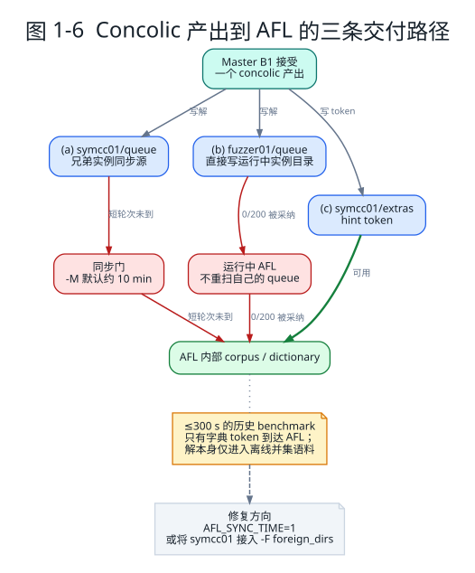

> 可缩放 SVG；[PNG 版本](diagrams/qa3/fig-1-6-afl-delivery.png)；[DOT 图源](diagrams/qa3/src/fig-1-6-afl-delivery.dot)。


**【一手证据】③ AFL 自己的计数器**（`docs/evidence/img_fuzzer_stats.png`）：pcre2 跑了 9 秒后的 `fuzzer_stats` 里
**`sync_time : 0`** 且 **`corpus_imported : 0`**——这两个是 AFL **自己**记的"同步耗时"和"从别的实例导入了几个用例"，
比本文查 `.synced/` 目录为空**更直接**。同一份还印证 `target_mode : persistent shmem_testcase deferred`（§6.6）
和 `total_edges : 9706`（又一次说明 map 大小随目标而变）。

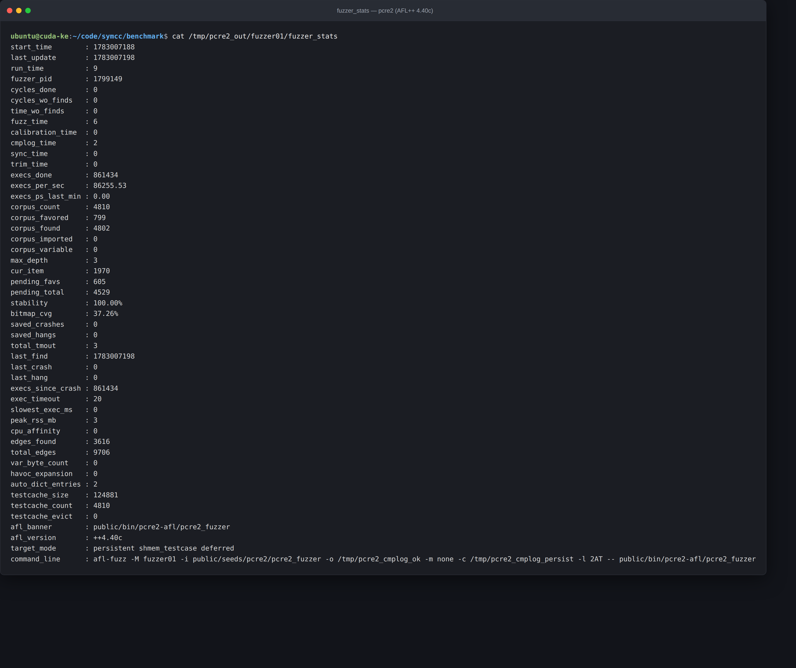

**【一手证据】④ 这条结论会怎样影响既有报告**（`docs/evidence/img_process.png`）：一次 **60 秒**的
`--hybrid --hybrid-adaptive` 实跑（lava-base64，5 AFL + MPI SymCC np=7）报出
`hybrid np=12: 23.62% (+12.04pp, +104.0% relative)`。
按上面的实测，**60 秒的预算内 concolic 产出根本没进 AFL**——所以这个 "+104 % relative"
只能按 **afl-showmap 对并集语料的离线测量**来读，不能解释成"AFL 用上了 concolic 的解"。

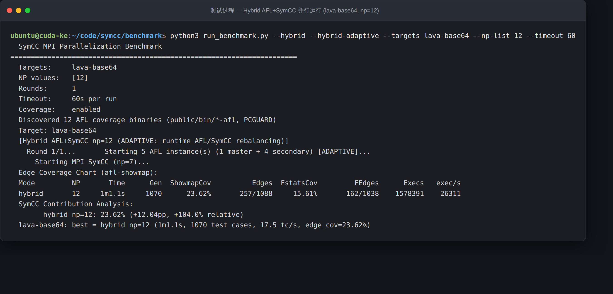

**结论（两个实验一致）**：

1. **运行中的 `afl-fuzz` 不会重扫自己的 `queue/` 目录**——直接往里丢文件是无效的。AFL 只在启动/resume 时读一次自己的队列，之后队列只在内存里维护；它只会去**别的实例**目录里 sync。
2. **兄弟目录同步要等 10 分钟**（`-M` 默认）。而本仓库的 benchmark 轮次是 **120 s / 300 s**（`--timeout` 默认 60 s）。

⇒ 在所有 ≤300 s 的 benchmark 轮次里，concolic 的产出一个都没有真正进到 AFL 手里。
那些"hybrid vs afl-only"的覆盖率差值，来自 **`afl-showmap` 对并集语料的离线测量**（把 concolic 产出和 AFL 队列合在一起量），**不是**"AFL 用上了 concolic 的解之后跑出来的"。这不推翻 [§6.7](#q6) 的覆盖率数字（那些是并集口径，本来就成立），但它**推翻了对因果的解释**：短轮次里根本没有闭环反馈。

> **可操作的修复方向**（按代价从低到高）：
> ① 起 AFL 时加 `AFL_SYNC_TIME=1`（分钟级最小值），让兄弟目录同步真正发生；
> ② 用 AFL++ 的 `-F <dir>` 外部语料导入。**代码里已经有这条路，但没接上**：`run_benchmark.py:2323-2325` 只把 `foreign_dirs` 传给 `-F`，而 `foreign_dirs` 的来源是 `AFL_FOREIGN_DIRS` 环境变量 + honggfuzz/GRIMOIRE 的输出目录（`:2286-2291`）——**从不包含 `symcc01/`**。把它加进去是最小改动；
> ③ 承认 concolic 产出与 AFL 之间只有"离线并集"关系，并在所有报告口径里写明。
>
> 这也解释了 `docs/SymCC_MPI_Report_QA.md:77` 记的那个老问题（"AFL 实际上完全不知道 SymCC 生成了哪些输出——双方的反馈循环处于断开状态"）**比原文以为的更严重**：原文认为只是"不 interesting 的被丢了"，实测是**连被接受的那 167 个也没送到**。

### 其余同步机制

- **master 忙等修复**（都在现役代码里）：
  - `AflConfig._file_cache` 每文件属性缓存，`MAX_FILE_CACHE = 200000` FIFO 淘汰（`:473-476`, `:534-538`）。注释记着原始代价：*"实测该扫描是 master 的主要瓶颈，34s/58s @ 15 workers"*；
  - 扫描节流 `SCAN_MIN_INTERVAL = 0.1`（`:3120`）+ 三路条件（`:3336-3339`）：worker 都忙且刚扫过就跳过；
  - `heapq.nlargest` 代替全排序（`:611-616`）；
  - 内存安全阀 `MAX_DEDUP_ENTRIES = 5_000_000`（`:3206-3220`）。
  【实测】这些优化确实有效，但**还不够**：在 AFL 队列 3,000–5,000 项的实测轮里，master 是 `scan=83.60s/1213次  dispatch=2.41s/1465次  recv=0.14s/293次  triage=4.65s/229次  idle=41.32s`——**扫描重新占了 180 s 里的 83.6 s**。队列规模上千后仍需进一步优化（见 [§1.6](#q1-funnel)）。
- **CWD 隔离**：AFL/MPI 用 `work_dir/target_cwd`（`benchmark/run_benchmark.py:2164-2165`, `:2351`, `:2473`），honggfuzz 用 `hf_cwd`，覆盖率测量用 `mkdtemp("showmap_cwd_")`，批量 showmap 用独立 `_bsm_` 临时目录（`:1424`）。

---

<a id="q2"></a>
# Q2 三类重点比较场景，以及正常编译 vs 自测试

## 2.0 先给结论

下表是本文重点分析的**三类常见比较场景**，不是符号表达式的穷举。最终表达式同时受源码、
LLVM 优化、SymCC 插桩和运行时建模影响，不能只归因于优化器：

| 源码里长什么样 | 在哪里变成约束 | 约束形状 | 谁来加速 |
|---|---|---|---|
| 宽整数 `icmp`（4 字节 magic 一次 `i32` 比较） | `Symbolizer.cpp` → `_sym_read_memory` → QSYM `Concat` | **一条** `Equal(Concat(Read…), Const)` | `fastSolveConcat`（跳过 Z3） |
| **幸存的** `memcmp`/`strcmp` **调用** | `runtime/src/LibcWrappers.cpp` 包装器 | **一条**逐字节 `Equal` 的 `And` 链 | 无（一次 Z3） |
| 源码里逐字节比较的循环 | N 条独立 `icmp` 分支 | N 条单字节分支 | `SYMCC_MULTI_SOLVE` 的连续字节联合求解 |

QSYM 表达式系统还包含 `Extract`、`ZExt`/`SExt`、`Add/Sub/Mul/Div/Rem`、位运算、
移位、关系运算和 `Ite` 等（`runtime/.../expr.h:25-77`）。真实分支经常是这些节点与
`Read`/`Concat` 的组合，例如校验和、长度关系、符号索引和带条件的数据选择。因此，
“宽整数 / libc compare / 字节循环”只能解释比较密集型路径，不能覆盖一般 QF_BV 约束。

还必须把两个正交维度分开：

| 维度 | 研究问题 | 代表机制 |
|---|---|---|
| **SymCC 约束来源/形状** | 动态符号执行实际交给 fast path 或 Z3 的表达式是什么 | 宽 `icmp`、幸存 libc 调用、字节循环、一般算术/位向量/控制表达式 |
| **AFL 侧反馈/比较引导** | 随机变异端如何更容易保留或逼近比较 | LAF、CmpLog、B5 data coverage、CTX、NGRAM |

同一个源码位置在第一维只会沿当前编译结果形成一种实际约束，但第二维可同时叠加多个 AFL
机制；laf-intel 并不是第四种 SymCC 约束。

### 图 2-1 同一段源码，优化器决定你拿到哪种约束


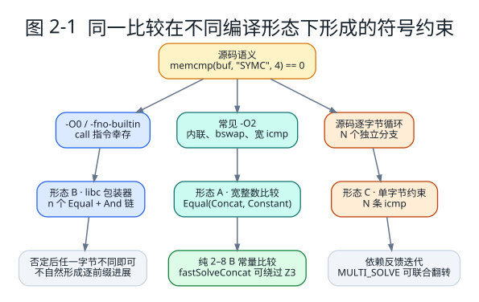

> 可缩放 SVG；[PNG 版本](diagrams/qa3/fig-2-1-constraint-shapes.png)；[DOT 图源](diagrams/qa3/src/fig-2-1-constraint-shapes.dot)。


## 2.1 宽整数内联比较

**取值侧**：`Symbolizer::visitLoadInst`（`compiler/Symbolizer.cpp:1618`）把**任何** load 都变成一次运行时调用（`:1660-1664`）：
```cpp
auto *data = IRB.CreateCall(
    runtime.readMemory,
    {IRB.CreatePtrToInt(addr, intPtrType),
     ConstantInt::get(intPtrType, dataLayout.getTypeStoreSize(dataType)),
     IRB.getInt1(isLittleEndian(dataType) ? 1 : 0)});
```

**Concat 是在运行时拼的，不在编译器里**（`runtime/src/RuntimeCommon.cpp:136-160`）：
```cpp
SymExpr _sym_read_memory(uint8_t *addr, size_t length, bool little_endian) {
  if (isConcrete(addr, length))
    return nullptr;                    // 整段具体 → 根本不建表达式
  ReadOnlyShadow shadow(addr, length);
  return std::accumulate(shadow.begin_non_null(), shadow.end_non_null(),
                         static_cast<SymExpr>(nullptr),
                         [&](SymExpr result, SymExpr byteExpr) {
                           if (result == nullptr) return byteExpr;
                           return little_endian ? _sym_concat_helper(byteExpr, result)
                                                : _sym_concat_helper(result, byteExpr);
                         });
}
```
一个 8 字节 `i64` load ⇒ **7 层嵌套二元 `Concat`**，叶子是 8 个 8-bit `ReadExpr`。

**比较侧**：`Symbolizer::visitCmpInst`（`compiler/Symbolizer.cpp:1477`）**完全不做比较拆分**，谓词原样传下去（`:1536-1540`）：
```cpp
SymFnT handler = runtime.comparisonHandlers.at(I.getPredicate());
auto runtimeCall = buildRuntimeCall(IRB, handler, {I.getOperand(0), I.getOperand(1)});
```

**对该纯 magic 例子的净结果**：一个 4 字节 magic ⇒ **恰好一条**路径约束
`Equal(Concat(Read3,Read2,Read1,Read0), Const32)` ⇒ 一次 Z3 查询可同时解出 4 个字节。
这对 concolic 有利，但不能推广到所有宽比较：混合具体字节、扩展/提取、两侧均符号化、
算术或别名会进入一般求解路径。

### 图 2-2 形态 A 的表达式：8 字节 load 的 Concat 链


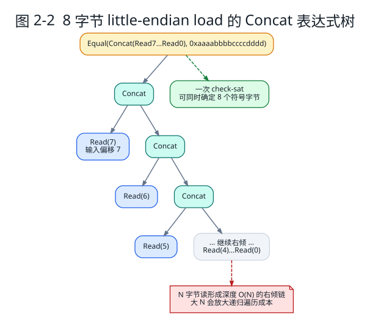

> 可缩放 SVG；[PNG 版本](diagrams/qa3/fig-2-2-concat-expression.png)；[DOT 图源](diagrams/qa3/src/fig-2-2-concat-expression.dot)。


### fastSolveConcat：连 Z3 都不用

声明在 `solver.h:304-310`，由 `SYMCC_FAST_SOLVE=1` 开（`solver.cpp:555-557`，**默认关**），调用点 `solver.cpp:5462-5466`：
```cpp
// Fuzzy-Sat 快速路径：简单约束不走 Z3
if (fast_solve_enabled_ && fastSolve(e, taken)) {
  last_branch_solve_status_ = BranchSolveStatus::Sat;
  return;                              // ← 直接 return，Z3 被跳过
}
```

**接受的形状**（`solver.cpp:4974-5002`）：根是关系运算、恰好两个孩子、一侧是 `ConstantExpr`（≤64 位）、另一侧是**纯 `Concat` of 8 位 `ReadExpr`**，字节数 `k ∈ [2, 8]`，偏移全部在 `inputs_` 范围内。

**拒绝的形状**（全部落回 Z3，逐条验证过）：
`ZExt(Concat(...))` / `SExt(Concat(...))`、移位-或重建 `(b3<<24)|(b2<<16)|…`、任何算术（`x+1==C`、`x^k==C`、校验和）、`Concat` 里混了具体字节或 `Extract`、>8 个符号字节、常量宽于 64 位、两侧都符号化、比较埋在 `And`/`Ite` 底下。

因此“宽比较更优”应严格读成：**2–8 个纯符号输入字节组成的直接 Concat 与 ≤64-bit 常量
进行关系比较**是 `fastSolve` 的理想输入；一般宽位向量比较仍由 Z3 或其他后端处理。

**安全网（这才是它 sound 的原因）**（`solver.cpp:5062-5089`）：
```cpp
// 安全网：从"实际写入的字节"重建值并核验确实满足 negated 关系——比只核验 target 更稳健，
// 捕获偏移别名 / 分解 / 字节序错误；不满足则不写出（回退 Z3），保证 sound。
uint64_t actual = 0;
for (size_t j = 0; j < k; j++)
  actual |= ((uint64_t)values[offs[j]]) << (8 * (k - 1 - j));
```
再加 `validateCandidateAgainstPrefix(e, !taken, values)`（`:5086-5087`），它**具体求值目标谓词和每一条前缀路径约束**（`solver.cpp:5144-5153`）。

> ⚠ **文档过期**：`docs/Work_Progress_Report_3.md:201`、`docs/Parallel_Architecture_v2.md:279`、`docs/SymCC_Technical_Deep_Dive.md:103` 都还写着 "fastSolve 成功后**不跳过** Z3，因此是纯增量产出"。**当前代码是跳过的**（`solver.cpp:5462-5466`）。别再引用"纯增量"这个说法。

## 2.2 memcmp / strcmp / 字符串函数

**拦截方式是改名，不是 `dlsym` 插桩**（`compiler/Pass.cpp:964-968`）：
```cpp
for (auto &function : M.functions()) {
  auto name = function.getName();
  if (isInterceptedFunction(function))
    function.setName(name + "_symbolized");
}
```
白名单 **37 个**（`compiler/Runtime.cpp:218-229`；`:225` 一行放了 7 个，容易数漏）。**比较类建模的是**：`memcmp`, `strcmp`, `strncmp`, `bcmp`；另有 `strchr`, `strstr`, `strlen`, `atoi`, `strtol`, `strtoul`。
**明显缺席**：`strcasecmp`, `strncasecmp`, `memmem`, `strrchr`, `strspn`, `wcscmp`, 以及所有 `*_unlocked` 变体。

> **这套机制只在 call 指令活到 pass 时才有效。** `-O2` 下 LLVM 经常 (a) 把 `memcmp(a,b,4)` 内联成 bswap+`icmp`，(b) 把 `memcmp(...)==0` 规范化成 `bcmp`（所以白名单里专门加了 `bcmp`，见 `test/bcopy_bcmp_bzero.c`），(c) 常量折叠短 `strcmp`。一旦发生，你悄无声息地拿到的是 §2.1 的宽整数路径，libc 建模一次都没跑。

**符号 memcmp 变成什么**（`runtime/src/LibcWrappers.cpp:393-408`）：
```cpp
void pushMemoryEqualityConstraint(const void *a, const void *b, size_t n,
                                  bool taken, uintptr_t site) {
  if (!a || !b || n == 0 || (isConcrete(a, n) && isConcrete(b, n)))
    return;                       // ← 双方都具体就不建约束（这正是 -O2 下常见的情形）

  auto aShadowIt = ReadOnlyShadow(a, n).begin_non_null();
  auto bShadowIt = ReadOnlyShadow(b, n).begin_non_null();
  auto *allEqual = _sym_build_equal(*aShadowIt, *bShadowIt);
  for (size_t i = 1; i < n; i++) {
    ++aShadowIt; ++bShadowIt;
    allEqual = _sym_build_bool_and(allEqual, _sym_build_equal(*aShadowIt, *bShadowIt));
  }
  _sym_push_path_constraint(allEqual, taken, site);
}
```
精确地说：**逐字节相等链，折成一个表达式，作为一条路径约束推进去**。规模线性（n 个 `Equal` + n−1 个 `And`），**不爆炸**；但也没有"部分学分"——它的否定是"存在某字节不等"，Z3 翻一个字节就满足了，**驱动不出逐前缀增长**。

两个后果值得写进设计文档：
1. `_sym_set_return_expression(nullptr)`（`:1247`）——**返回值是具体的**。`memcmp(a,b,n) < 0` 这类序关系对求解器不可见，只有相等/不等这一个分支被建模。
2. `strcmp` **截断到比较前缀**（`:1261-1279`，辅助函数 `comparedCStringBytes` `:410-423`）：只约束到第一个不同字节**为止**——这就是经典的"每轮 concolic 前缀长一个字节"。

**唯一会长度爆炸的是 `strstr`**（`:944-1008`）：真正的二次方析取，护栏在 `:977-980`（`needleLength * (haystackLength - needleLength + 1) > 16384` 就放弃），外加 `SYMCC_STRING_CONSTRAINT_MAX_BYTES`（默认 256，硬上限 4096）。

**`util/string_*.py` 是什么层**：全部是**运行时之上的纯 Python**，一个都不链进插桩二进制。它们消费运行时在 `SYMCC_STRING_CONSTRAINT_OUT` 下吐的 JSONL（生产者 `LibcWrappers.cpp:214-292`，schema `symcc-string-constraint-v1`）。
`util/string_constraints.py`（1941 行）是唯一被实际使用的库（`mpi_fuzzing_helper.py:94` 导入）；`check_string_constraints.py`/`check_string_operations.py`/`string_backend_conformance.py` 是 lit 检查器；**`util/symcc_string_solver.py` 是孤儿**——全仓库无任何调用。

## 2.3 laf-intel

**本项目的编译器/运行时里没有实现，一行都没有。**
```
$ grep -rniE "laf|split[-_]compare|COMPCOV|SplitCompares|cmplog|redqueen" \
       compiler/ runtime/src --exclude-dir=backends
(无输出)
```
（不加 `--exclude-dir=backends` 会有 32 条 `-i` 子串误命中，全部落在 vendored 的
`runtime/src/backends/qsym/qsym/third_party/` 里，如 `instrumentCallAfter`（含 `lAf`）、`IndexLAfix`（含 `LAf`）。）
`visitCmpInst`（`compiler/Symbolizer.cpp:1477-1541`）整条谓词透传，不拆分。

最关键的一句（直接回答"laf-intel 的使用场景"）：`AFL_LLVM_LAF_ALL` 只作用于
**单独的 `*_afl_laf` 二进制**（`compile_public_benchmarks.sh:1038`、`run_benchmark.py:108,114`），
**从不用于任何 SymCC/SymSan 构建**。所以 **laf-intel 完全不改变 concolic 引擎看到的约束**——
它只是让 AFL 那一侧更容易蒙对嵌套比较，属于"另一条腿"，和 §2.0 的三种形态是正交的两件事。

**但 laf-intel 是在用的**——完全委托给 AFL++ 的编译期 flag：`AFL_LLVM_LAF_ALL=1`（`benchmark/run_benchmark.py:108,112-117`；`benchmark/compile_public_benchmarks.sh:1038,1041`）。所谓"否决"是指"不自己再造一个 pass"，不是"不用"。

### ⚠ 关于"cmplog 完胜 laf-intel"这个判断：**仓库里没有对照实验**

现有的只是两个**不可比**的测量：

| | 目标 | 时长 | 指标 | 结果 | 出处 |
|---|---|---|---|---|---|
| laf | sqlite | 150 s | AFL queue 边数（中立二进制上量） | queue 602→894 边（**+48% 多样性**），公共覆盖 **+1.4%** | `docs/Research_and_Optimization_Report.md:50-53` 【B级】 |
| cmplog | SQLite | 120 s | ShowmapCov | AFL+CmpLog **21.03%** > Hybrid **18.84%** | `docs/PPT_Material.md:213` 【B级】 |

两者**基线都不一样**（cmplog 那行的对照是 SymCC Hybrid，不是 laf），时长不同（150 vs 120 s），指标不同（queue 边数 vs ShowmapCov）。而且 **laf 从来没有单独测过**——永远和 NGRAM-4 捆在一起。
项目自己也标注了这点（`docs/Final_Work_Report.md:375`）：*"CmpLog 数据来自独立的 120s A/B 对比实验……与 v2 全量 benchmark 实验条件不同，数值不可直接对比。此结论仅适用于 SQLite 类文本解析器，不可泛化。"*

**否决理由的原文**（`docs/工作小结.md:17`）：*"cmplog 在嵌套/组合比较上完胜，重复建设"*，定位是 *"concolic 的不可替代价值 = 求解 cmplog 也解不了的校验和 / 哈希类约束"*（`:20`）。
**【缺】"嵌套/组合比较上完胜"这句在本仓库内没有任何实测支撑。** 写文档时应说成"依据外部调研 + 定位判断"，不能当成本项目的测量结论。

### 图 2-3 哪个二进制带哪种技术 —— laf-intel 到底作用在谁身上


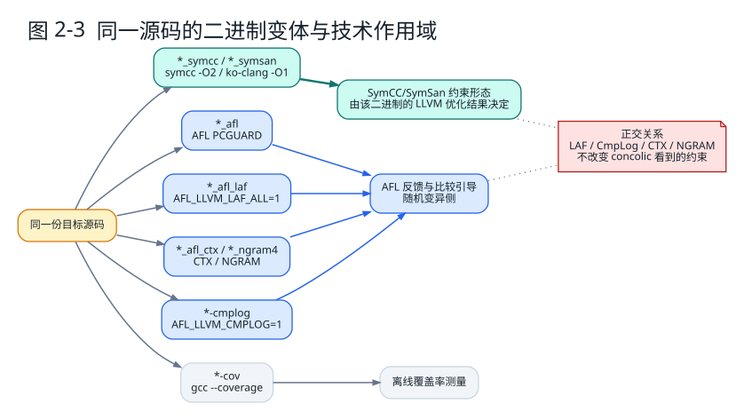

> 可缩放 SVG；[PNG 版本](diagrams/qa3/fig-2-3-binary-variants.png)；[DOT 图源](diagrams/qa3/src/fig-2-3-binary-variants.dot)。


### cmplog 在 AFL 侧怎么用

- **构建**（只有编译期环境变量，本仓库没有 `AFL_CMPLOG` 这个运行期变量）：`AFL_LLVM_CMPLOG=1`，产出 `<suite>-cmplog/` 兄弟目录（`compile_public_benchmarks.sh:1042`，变体表在 `:1037-1043`；`run_benchmark.py:339-347`）；
- **运行**：`afl-fuzz … -c <cmplog_binary> -l 2AT`（`run_benchmark.py:2334` hybrid / `:2677` afl-only）；
- **哪些 profile 带**：master 恒带（`master-cmplog`，在 `run_benchmark.py:2311-2314` 内联拼出），另有 `explore-cmplog`, `laf-exploit`, `laf-seek`, `ngram-lin`（`:118-133`）；
- **持久模式必须匹配**：主二进制和 cmplog 伴随二进制必须**同为持久或同为 fork**，否则 `afl-fuzz` 直接 "Fork server handshake failed"（`README.md:511-514`）。检测器**必须**用 `##SIG_AFL_PERSISTENT##` 字符串而非 `__afl_sharedmem_fuzzing` 符号（原因见 §1.4 引用的 `run_benchmark.py:1438-1450`）。运行期门禁在 `:2332`：`cmplog_ok = bool(cmplog_binary) and cmplog_persistent == runner_persistent`。

## 2.4 正常编译 vs 自测试：真实命令行

### 正常编译（真实目标）

| 变体 | 命令 | 出处 |
|---|---|---|
| **SymCC 微目标** | `symcc -O2 <src> -o <name>_symcc` | `util/concolic_engine.py:79-81` |
| **SymSan 微目标** | 同 argv，编译器换 `ko-clang`，环境 `KO_CC=clang-18 KO_USE_FASTGEN=1 KO_DONT_OPTIMIZE=1 KO_USE_NATIVE_LIBCXX=1` | `concolic_engine.py:169-178` |
| **SymCC 公开目标** | `CC=build/symcc CFLAGS="-O2 …" SYMCC_OUTPUT_DIR=/tmp/output ./configure --quiet` + `make -j$(nproc)` | `compile_public_benchmarks.sh:240-257`, `:1148-1155` |
| **AFL** | `CC=afl-clang-fast CFLAGS="-O2" ./configure --quiet --disable-shared` + `make` | `compile_public_benchmarks.sh:883-891`, `:1008-1011` |
| **cmplog 伴随** | 同上 + `AFL_LLVM_CMPLOG=1` | `compile_public_benchmarks.sh:1041` |
| **覆盖率** | `gcc --coverage -O0 -g` → `<suite>-cov/` | `run_benchmark.py:425-428`; `compile_public_benchmarks.sh:625,668,737,766,834` |

`symcc` wrapper 的真身（`compiler/symcc.in:41-47`）：
```bash
exec "$compiler" @CLANG_LOAD_PASS@"$pass" "$@" \
     -L"$runtime_dir" -lsymcc-rt -Wl,-rpath,"$runtime_dir" -Qunused-arguments
```

插件在 LLVM 13+ 的 pipeline start 注册顺序是
`IFSSSwitchLowering → IFSSLoopSummary → IFSSExitLowering → IFSSContinuationLowering
→ IFSSContinuationMemory → HydraTransformation → LiveContinuationExport → Symbolize`
（`compiler/Main.cpp:117-127`）。这些 pass **总会被注册**，但各研究特性由环境变量门控；
“正常编译”不能再简化成只运行一个 Symbolize pass。优化级别也不是全项目统一常量：
SymCC 公开目标常见 `-O2`，SymSan 脚本常见 `-O1`，覆盖率目标为 `-O0 -g`，目标自己的
构建系统还可能覆盖 flags。

**两个对 §2.2 至关重要的目标特定 hack**：
- LAVA-M 的 `lib/unlocked-io.h` 被改写，把 `*_unlocked` 映射回标准版（`compile_public_benchmarks.sh:212-238`）。原注释（在 `:205-208`）：*"SymCC 运行时只包装标准版本……不禁用的话，所有输入读取绕过 SymCC，导致 0 个符号约束、0 个测试用例。"* AFL 版为保持一致也打同样的补丁（`:985-1006`）；
- glibc ≥2.28 和 `O_SEARCH` 兼容补丁（`:158-194`）。

**注意：真实目标构建里从来没有 `-fno-builtin`。**
```
$ grep -rn "fno-builtin" benchmark/*.sh benchmark/*.py scripts/*.sh
(无输出)
```
**这是"正常编译"和"自测试"之间最重要的一处不对称**——见 §2.5 表格最后一行。

### 自测试（lit）

驱动只有 8 行有效代码（`test/lit.cfg:17-25`，此处略去 `import`）：
```python
config.name = "compiler"
config.test_format = lit.formats.shtest.ShTest()
config.suffixes = [".c", ".cpp", ".ll", ".py"]
config.substitutions += [("%symcc", config.test_exec_root + "/../symcc"), ("%python", "python3")]
```
唯一全局环境变量是 `SYMCC_OUTPUT_DIR`（`test/lit.site.cfg.in:31`）。替换符还有 `%filecheck` `%querysolver` `%queryservice` `%schedrt` `%opt` `%passlib`（`:37-46`）。
后端相关的 FileCheck 前缀：qsym → `QSYM`+`ANY`；simple → `SIMPLE`+`ANY`（`test/CMakeLists.txt:15-28`）。运行入口 `make check` → `lit`（`:32-38`）。

**清单**（`test/` 一级目录 176 个普通文件）：`.ll` 53（+`regression/` 1）、`.c` 53、`.py` 48、`.test32` 17、**`.cpp` 0**（尽管后缀声明里有）。
大类：`backsolver_*` 37（全是 `.ll`，其中 10 个是 `backsolver_*_reject` 反例；全库 `*reject*.ll` 共 11 个）、`test_*.py` 40、`poly_*` 10、`query_*` 7、`string*` 6、`hydra_*` 5、`directed_*` 5，外加约 43 个上游经典（`if.c` `loop.c` `integers.c` `strings.c` …）。约 25% 上游 / 75% 本项目新增。59 个带 `REQUIRES: qsym`。

`%symcc` 不是"编译并运行"的宏，它就是 `build/symcc` 这个路径，是个 clang drop-in。每个测试都自己写全 编译 → 运行 → 检查。

**五种 RUN 行形态**：
1. 编译 → 喂 stdin → FileCheck 合并的 stdout+stderr（`2>&1` 是必须的，后端日志走 stderr）；
2. 冒烟测试，完全没有 CHECK（`test/load_store.ll:27-29`），退出码就是断言；
3. **IR 级 pass 测试**——直接喂 `opt`，绕开 clang（`test/backsolver_switch_ifss.ll:2`）：
   ```
   ; RUN: env SYMCC_IFSS_SWITCH_STATE=1 %opt -load-pass-plugin=%passlib -passes=ifss-switch-lowering -S %s -o %t.lowered.ll
   ```
   `%opt -passes=verify` 作为 IR 良构门禁出现了 **66 次**；
4. **跑插桩二进制，断言产出的输入字节 + telemetry JSON**——现代主力形态。`SYMCC_AFL_COVERAGE_MAP` 出现在 38 个文件里；
5. 自包含 Python unittest（`# RUN: python3 %s`，46 次）。

**代表性例子 1 —— 这就是宽整数 magic 的情形**（`test/integers.c`，**节选**：略去 GPL 头、`#include` 和结尾 `return 0;}`）：
```c
// RUN: %symcc -O2 %s -o %t
// RUN: echo -ne "\x05\x00\x00\x00\x00\x00\x00\x00" | %t 2>&1 | %filecheck %s
uint64_t g_value = 0xaaaabbbbccccdddd;
int main(int argc, char *argv[]) {
  uint64_t x;
  if (read(STDIN_FILENO, &x, sizeof(x)) != sizeof(x)) { ... }
  fprintf(stderr, "%s\n", (x == g_value) ? "yes" : "no");
  // SIMPLE: Trying to solve
  // SIMPLE: Found diverging input
  // Make sure that we don't truncate integers.
  // SIMPLE-DAG: #xaa
  // SIMPLE-DAG: #xbb
  // SIMPLE-DAG: #xcc
  // SIMPLE-DAG: #xdd
  // QSYM-COUNT-2: SMT
  // ANY: no
```
`SIMPLE-DAG: #xaa…#xdd` 是对 **simple 后端打到 stderr 的 SMT-LIB 表达式转储**做 FileCheck——字面上在断言"`Concat` 没被截断"。qsym 后端下这个断言退化成 `QSYM-COUNT-2: SMT`。

**代表性例子 2 —— 强制走 libc 包装器**（`test/libc_long_compare.c`，**节选**：略去 2 行 `#include`；注意下面 `env={...}` 处原文是 `env={**__import__('os').environ, ...}`，把父进程环境整体带入是这个测试能跑通的关键）：
```c
// REQUIRES: qsym
// RUN: %symcc -O0 -fno-builtin-strcmp %s -o %t
// RUN: rm -rf %t-out && mkdir %t-out
// RUN: %python -c "import subprocess; subprocess.run([r'%t'], input=b'A'*80, env={..., 'SYMCC_OUTPUT_DIR':r'%t-out', 'SYMCC_DATA_CMP_BYTES':'64'}, check=True)"
// RUN: %python -c "from pathlib import Path; assert any(p.is_file() for p in Path(r'%t-out').iterdir())"
int main(void) {
  char input[81] = {0}; char expected[81];
  memset(expected, 'A', 80); expected[80] = '\0';
  if (read(STDIN_FILENO, input, 80) != 80) return 1;
  return strcmp(input, expected) == 0 ? 0 : 2;
}
```

**`.ll` 测试确实绕过前端**：53 个里 28 个用 `%opt` + pass 插件，41 个走 `%symcc`，**两组重叠 18 个**——所以"完全不经 clang"的只有 **10 个**；走 `%symcc` 的那 41 个用的是 clang 的**驱动**，但 C 前端/parser 仍被绕过（clang 走 LLVM-IR 输入路径）；另有 2 个（`live_continuation_*.ll`）两者都不用。3 个上游测试额外加 `RUN: llc %s -o /dev/null` 兜底，因为 clang 对手写 IR 的校验比 codegen 松。

**lit 里有没有 AFL？接口层有，campaign 层没有。** `SYMCC_AFL_COVERAGE_MAP` 出现在 38 个文件，`test/test_afl_data_coverage.py:44` 甚至自造了一个 `unsigned char *__afl_area_ptr = map;`（`MAP_SIZE=65536`）。但**没有任何 lit 测试会启动 `afl-fuzz`**。

## 2.5 关键差异一览

### 图 2-4 正常编译 vs 自测试：两条不同的管线


> 可缩放 SVG；[PNG 版本](diagrams/qa3/fig-2-4-build-test-pipelines.png)；[DOT 图源](diagrams/qa3/src/fig-2-4-build-test-pipelines.dot)。


| 维度 | 真实目标 | 自测试 |
|---|---|---|
| 优化级别 | SymCC 微目标/公开目标 **`-O2`**；但 SymSan 公开目标是 **`-O1`**（`scripts/build_public_symsan.sh:27,47,57,70`，sqlite 还要 `KO_DONT_OPTIMIZE` 绕开 ko-clang 强制的 `-O3`）；gcov 覆盖率版是 `-O0 -g` | `RUN: %symcc` 行里 **-O0 占绝大多数（86 处）**、`-O2` **35 处**、`-O1` 6 处、`-O3` 1 处；`.ll` pass 测试 `-O0` |
| `-fno-builtin*` | **从不使用** | 4 个 `.c` 测试显式使用 |
| **后果** | `memcmp`/`strcmp` 常被内联/规范化掉 → §2.2 的包装器**根本不触发** → 实际拿到的是 §2.1 的宽 `icmp` 路径 | 包装器被**强制**触发，测的是 `pushMemoryEqualityConstraint` 本身，而不是优化器的行为 |
| 输入来源 | 文件（`SYMCC_INPUT_FILE` / `@@`）或 AFL 持久模式共享内存 | `printf`/`echo -ne` 喂 stdin |
| 源码 hack | `unlocked-io.h` 改写、glibc-2.28、`O_SEARCH` 补丁 | 无 |
| Fuzzer | 真 `afl-fuzz`，`-M/-S`、`-c cmplog -l 2AT`、`-p <schedule>`、MOpt | 无 |
| 断言对象 | showmap/gcov 覆盖增量、bug 数 | FileCheck 表达式转储 / IR 文本，或 Python 断言产出字节 + telemetry JSON |
| `SYMCC_FAST_SOLVE` / `SYMCC_MULTI_SOLVE` | 默认 **0**，仅特定执行器 profile 打开 | 需要时在 RUN 行显式 `=1` |

> ⚠ **潜在 bug**：`test/lit.cfg:21` 把 `config.suffixes` 重新绑成 **`list`**（lit 默认是 `set`），而 `lit.site.cfg.in:49` 在其后调用 `config.suffixes.add(".test32")`。`list` 没有 `.add` → `TARGET_32BIT=ON` 时必然 `AttributeError`，**17 个 `.test32` 实际是死的**。`lit.cfg` 是本 fork 改过的（加了 `.py`/`%python`），所以这是 fork 引入的回归。

---

<a id="q3"></a>
# Q3 求解策略：什么时候 Z3、什么时候乐观、什么时候丢前缀，占比多少

## 3.0 先给结论

- **不是"全都乐观求解"。默认路径是先严格求解，UNSAT/超时才退到乐观。**
- **"丢前缀"有三种，粒度完全不同**，别混为一谈；依赖切片在依赖追踪完整且未加载字节
  保持当前值时语义等价，不能无条件称为“无损”。
- **占比**：仓库里此前没有归档过生产测量，因此补测了 6 个真实目标的单种子短测（见 §3.3）。
  默认配置下，带 `-optimistic` 标签的**输出文件**占 49%–84%；这不是生产任务占比，
  也不是所有 Z3 `check()` 调用中乐观查询的固定比例。

## 3.1 `negatePath` 的完整决策树

入口：`runtime/src/backends/qsym/Runtime.cpp:326-332` → `Solver::addJcc`（`solver.cpp:1293`）→ 经 `isInterestingJcc`（B3 过滤，见 §1.4）→ `negatePath`（`solver.cpp:5441-5623`）。

### 图 3-1 `negatePath` 决策树（默认配置走粗线）


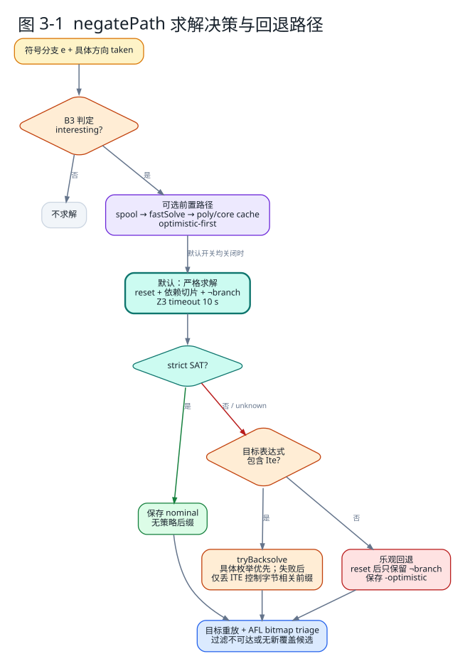

> 可缩放 SVG；[PNG 版本](diagrams/qa3/fig-3-1-solve-decision.png)；[DOT 图源](diagrams/qa3/src/fig-3-1-solve-decision.dot)。


按**求值顺序**：

| # | 步骤 | 代码 | 默认（不设任何环境变量） |
|---:|---|---|---|
| 1 | Query IR 导出 / 延迟求解 | `5455-5459` | 关（`SYMCC_QUERY_SPOOL`） |
| 2 | **`fastSolve` 绕过 Z3** | `5462-5466` | 关（`SYMCC_FAST_SOLVE`） |
| 3 | poly-cache 键 + 线性约束 | `5468-5480` | 关（`SYMCC_POLY_CACHE`） |
| 4 | UNSAT-core 缓存查表 | `5482-5491` | 关（`SYMCC_UNSAT_CORE_CACHE`） |
| 5 | 线性矛盾包含剪枝 | `5492-5505` | 关 |
| 6 | poly-cache 回放 | `5507-5515` | 关 |
| 7 | **乐观优先**查询 | `5535-5570` | 关（`SYMCC_OPTIMISTIC_FIRST`） |
| 8 | **严格（nominal）查询** | `5572-5588` | **开——这就是默认路径** |
| 9 | UNSAT/超时 → **乐观**，或 → **backsolve** | `5606-5621` | **开** |

### (a) 严格求解：什么时候把"完整路径约束"发给 Z3

```cpp
// solver.cpp:5572-5588
std::vector<size_t> strict_core;
z3::check_result strict_result;
if (unsat_core_cache_enabled_) {
  strict_result = checkTrackedConstraints(unsat_constraints, strict_core);
} else {
  reset();
  syncConstraintsCached(e);        // ← 加载"依赖切片"，不是整条路径
  addToSolver(e, !taken);          // ← 取反当前分支
  strict_result = check();
}
bool sat = strict_result == z3::sat;
```
SAT → `saveConcreteValues(values, "")`，**无后缀**——所以 nominal 产出就是那些不带后缀的文件。

> **关键澄清：这里的"完整路径约束"不是整条路径。** 它是 QSYM 的**依赖切片**：`syncConstraints`（`solver.cpp:4546-4581`）沿 `DependencyForest` 只取**与目标分支共享输入字节**的那些约束。
> `docs/Work_Progress_Report_3.md:82` 的权威表述：
> > **SymCC 求解的是什么**：不是"从入口到执行点"的完整路径约束，而是通过**依赖森林**（DependencyForest）筛选出的**与目标分支共享输入字节的所有约束**。……这比加载全部路径约束高效，但当某个字节被大量分支共享时（如循环计数器），依赖树可以非常大，导致 Z3 收到大量约束而超时（默认 10 秒限制）。

### (b) 乐观求解：是**回退**，不是"总是也试一遍"

```cpp
// solver.cpp:5606-5621
if (strict_result == z3::unsat)
  rememberUnsatCore(unsat_constraints, strict_core);
if (!sat && optimistic_first_enabled_ && optimistic_sat) {
  if (!tryBacksolve(e, taken, &optimistic_values))
    saveConcreteValues(optimistic_values, "optimistic-first");
} else if (!sat) {
  if (!ite_target) {
    reset();                       // ← 丢掉【全部】前缀断言
    // optimistic solving
    addToSolver(e, !taken);        // ← 只剩 ¬branch
    checkAndSave("optimistic");
  } else {
    tryBacksolve(e, taken);
  }
  timed_out = timed_out || last_check_timed_out_;
}
```

要点：
- `reset()` 把**所有**前缀断言丢光，只剩取反的当前分支。产出后缀 `-optimistic`；
- 触发条件是 `!sat`，**同时覆盖 UNSAT 和超时/unknown**；
- **如果分支表达式里含 `Ite`，根本不走乐观求解**，改走 `tryBacksolve`（`5617-5619`）。`SYMCC_BACKSOLVER` **默认开**（`solver.cpp:418`）；
- 第 4/5/6 步的缓存/剪枝命中会**提前 return，完全跳过乐观求解**——这是相对基线 QSYM 的行为差异，开缓存时要注意。

**`SYMCC_OPTIMISTIC_FIRST=1` 会反过来**：先跑乐观查询，若不 SAT 就**直接放弃，连严格求解都不做**（`5555-5566`）。

### (c) "丢前缀"的三种粒度 + 一种无损切片

### 图 3-2 三种"丢前缀"的粒度对比


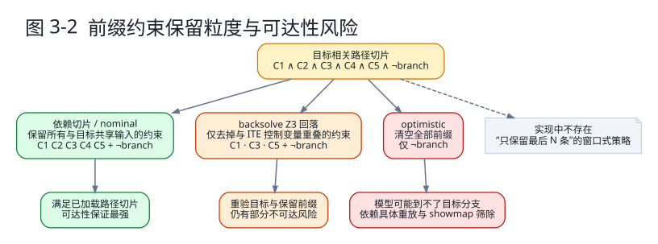

> 可缩放 SVG；[PNG 版本](diagrams/qa3/fig-3-2-prefix-dropping.png)；[DOT 图源](diagrams/qa3/src/fig-3-2-prefix-dropping.dot)。


| 机制 | 丢什么 | 代码 | 产出后缀 | 默认 |
|---|---|---|---|---|
| **依赖切片**（`syncConstraints`） | 不加载与目标无共享字节的约束；仅在依赖追踪完整且这些字节保持当前具体值时语义等价 | `solver.cpp:4546-4581`；`dependency.h:54-88` 并查集 | （nominal） | **开** |
| **乐观求解** | 丢**全部**前缀 | `solver.cpp:5611-5616` | `-optimistic` | 开（作为回退） |
| **backsolve**（仅当分支表达式含 `Ite`） | **主要是具体搜索**：按与当前赋值的汉明距离枚举 ITE 控制变量真值掩码（`:5361-5381`）、用 `invertPredicate` 改字节、具体验证后接受，**全程不碰 Z3**（上限 `SYMCC_BACKSOLVER_CANDIDATES`，默认 128）；只有全部失败才回落到 Z3，此时**只丢与 ITE 控制变量共享字节**的前缀（`:5423-5438`） | `solver.cpp:5318-5439` | `-backsolve` | **开** |
| **group-optimistic** | 联合翻转多分支，先带前缀，UNSAT 再丢前缀 | `solver.cpp:5967-5991` | `-group` / `-group-optimistic` / `-group-half` | 关（`SYMCC_MULTI_SOLVE`） |

Z3 回落时的前缀取舍（`solver.cpp:5328-5347`，简化示意）：
```cpp
std::vector<ExprRef> retained_constraints;
for (ExprRef constraint : collectPrefixConstraintExprs(e)) {
  bool overlaps_controller = false;
  DependencySet* dependencies = constraint->getDependencies();
  ...
  if (overlaps_controller) {
    backsolver_constraints_dropped_++;
  } else {
    retained_constraints.push_back(constraint);
    backsolver_constraints_kept_++;
  }
}
```
且求解后必须 `validateBacksolveCandidate(...)` 才写出（`:5433-5435`）。该函数只具体求值
**目标谓词和 `retained_constraints`**（`:5155-5170`），不会验证已经丢弃的重叠前缀；
因此它防止求解器/改写错误和保留前缀破坏，却不恢复完整路径可达性。最终仍要靠目标重放。
回归测试 `test/backsolver_selective_prefix.ll:6` 断言两个计数器都非零。

> **不存在"保留最后 N 条、丢掉其余"的窗口式策略。** 依据是通读 `negatePath`（`solver.cpp:5441-5623`）、`syncConstraints`（`:4546-4581`）和 `collectPrefixConstraintExprs`（`:2516-2543`）：前缀要么整取（依赖切片）、要么整丢（乐观）、要么按 ITE 依赖选择性丢（backsolve），没有任何按条数的窗口。

### (d) 超时

- **每次 Z3 查询：硬编码 10 000 ms，不可用环境变量调**：
  `solver.cpp:52` `const unsigned kSolverTimeout = 10000; // 10 seconds`，`solver.cpp:546-548` `p.set(":timeout", kSolverTimeout)`。
- 联合求解临时放宽 **3× = 30 000 ms**，RAII 还原（`solver.cpp:5937-5939`）。
- **`SYMCC_SOLVER_TIMEOUT` 这个变量不存在。** `SYMCC_TIMEOUT`（默认 30 s，`mpi_fuzzing_helper.py:110`）是**每个输入的进程级执行超时**，不是求解超时。
- 超时判定刻意保守（Z3 对非线性也返回 `unknown`）（`solver.cpp:1273-1277`）：
  ```cpp
  last_check_timed_out_ = (res == z3::unknown) && (elapsed >= (uint64_t)kSolverTimeout * 900);
  ```

### (e) 曾经不安全的缓存已经删掉了

`solver.cpp:5517-5520`，就在当年缓存所在的位置：
```cpp
// 注意：不在此处做约束内容缓存。negatePath 的可满足性依赖于
// 已同步的路径前缀约束（syncConstraints），仅凭分支表达式做缓存
// 会因忽略路径上下文而误跳过可满足的约束、丢失覆盖率。分支级去重
// 已由上游 isInterestingJcc()/trace_.isInterestingBranch(pc,taken) 负责。
```
删除提交：`39f4fa1`（在**嵌套子模块** `runtime/src/backends/qsym/qsym` 里，仓库根目录 `git rev-parse` 解析不到）。现存的缓存（UNSAT-core / prefix-context / poly，默认全关）都按**完整 clause 集**做键，并对回放的解重新验证。

## 3.2 产出文件名就编码了策略

`solver.cpp:1566-1569`：
```cpp
std::string fname = out_dir_ + "/" + toString6digit(num_generated_);
// Add postfix to record where it is genereated
if (!postfix.empty()) fname = fname + "-" + postfix;
```
完整标签集：`""`(nominal) / `-fast` / `-optimistic` / `-optimistic-first` / `-backsolve` / `-group` / `-group-optimistic` / `-group-half` / `-polycache` / `-polycache-cross-prefix` / **`-poly`**（`:4498`，多解采样） / `-dict`。
注意 `-optimistic` 有**两个**产出点：`negatePath` 的回退（`:5616`）和值枚举路径（`:1483`），所以数 `-optimistic` 文件不等于纯粹的 `negatePath` 统计。
**这正是本文能直接把策略占比数出来的原因。**

<a id="q3-ratio"></a>
## 3.3 【实测】专项短测的产出策略构成

> **仓库此前没有归档的生产数据。** telemetry 计数器（`solver.cpp:722-745`，`schema 3`）
> 早就实现了，但没有留下能代表完整 campaign 的策略分布。以下是本文当场补测的
> **单种子、单次、短时机制实验**，适合回答“代码实际走了哪些路径”，不适合回答
> “生产运行中各策略的稳定占比”。
>
> 复现（每个目标一次，各自的第一个种子，默认配置）：
> ```bash
> SYMCC_OUTPUT_DIR=out SYMCC_INPUT_FILE=$SEED SYMCC_TELEMETRY_OUT=tel.json $SYMCC_BIN $SEED
> ls out | sed 's/^[0-9]*//; s/^-//' | sort | uniq -c        # 策略占比
> ```

### 默认配置（无 FAST/MULTI/OPTIMISTIC_FIRST）

| 目标 | 种子 | 符号分支 | interesting | Z3 严格查询 | **nominal 产出** | **optimistic 产出** | optimistic 占比 | 求解耗时 |
|---|---|---:|---:|---:|---:|---:|---:|---:|
| lava base64_harness | 5 B | 70 | 53 | 53 | **8** | **41** | **83.7 %** | 29.1 ms |
| libarchive | 6 B | 34 | 22 | 22 | **8** | **14** | **63.6 %** | 10.6 ms |
| pcre2 | 11 B | 475 | 133 | 133 | **52** | **79** | **60.3 %** | 61.0 ms |
| gfts png | 69 B | 144 | 142 | 142 | **51** | **81** | **61.4 %** | 194.8 ms |
| sqlite | 34 B | 63 | 45 | 45 | **14** | **31** | **68.9 %** | 13.2 ms |
| gfts xml | 52 B | 240 | 225 | 225 | **114** | **111** | **49.3 %** | 71.7 ms |

### 图 3-3 求解策略占比（实测，6 目标，默认配置）


> 可缩放 SVG；[PNG 版本](diagrams/qa3/fig-3-3-strategy-mix.png)；[绘图脚本](diagrams/render_qa3_diagrams.py)。


**内部一致性自检**（以 xml 为例）：`solver_queries=336 = 225 严格 + 111 乐观`；`solver_sat=225 = 114 严格SAT + 111 乐观SAT`；`solver_unsat=111` = 严格 UNSAT 数 = 触发乐观的次数。

⚠ **但 xml 这条恒等式不普适**——另外三个目标的 nominal+optimistic **小于** interesting：

| 目标 | interesting | nominal+optimistic | 缺口 | 解释 |
|---|---:|---:|---:|---|
| base64_h | 53 | 49 | −4 | 这 4 条分支**严格 UNSAT 后乐观也 UNSAT**（恒真/恒假分支），两次查询都没产出 |
| pcre2 | 133 | 131 | −2 | 同上（变体行独立印证：`214 = 133 严格 + 81 乐观`，其中 79 SAT ⇒ 2 条乐观 UNSAT ✓） |
| png | 142 | 132 | −10 | 同上（FAST 行：`230 = 139 + 91`，81 SAT ⇒ 10 条乐观 UNSAT ✓） |
| libarchive / sqlite / xml | — | 相等 | 0 | 乐观全部 SAT |

所以准确说法是：`solver_unsat = 严格 UNSAT + 乐观 UNSAT`，只有当乐观全 SAT 时才等于"触发乐观的次数"。

另外：六个目标上 `-backsolve`、`-poly`、`-fast`（默认配置下）产出全部为 0。
`SYMCC_BACKSOLVER` 虽然默认开，但它只在分支表达式含 `Ite` 时才触发——这批目标一次都没触发。
因此在这套 benchmark 上，"丢前缀"实际就等于"乐观求解"，没有第三种情况。

### telemetry 能算什么，不能算什么

默认配置没有 fast/poly/cache/optimistic-first，因而可以利用控制流关系反推：

```text
strict_checks       = z3_solves = interesting_branches
optimistic_checks   = solver_queries - strict_checks
strict_sat_outputs  = nominal 文件数
optimistic_outputs  = optimistic 文件数
check 结果占比       = solver_{sat,unsat,unknown} / solver_queries
产出策略占比         = 对应后缀文件数 / generated
```

但在开启 fast solve、poly replay、unsat-core cache、optimistic-first 或 backsolver 后，
`solver_queries` 仍只记录所有 `check()` 的总数，`z3_solves` 则更接近进入主 Z3 路由的
分支数；当前 schema **没有** `strict_checks`、`optimistic_checks`、
`optimistic_models_saved`、`optimistic_replay_success` 四个独立计数器。因此：

- fast 与主 Z3 路由的近似占比可写成
  `fast_solves / (fast_solves + z3_solves)`；
- SAT/UNSAT/UNKNOWN 占比可直接由 `solver_queries` 计算；
- backsolver 丢前缀比例可写成
  `constraints_dropped / (constraints_kept + constraints_dropped)`；
- 严格/乐观 `check()` 的生产占比目前不能从现有 telemetry 无歧义拆出。

**结论**：
- **严格求解永远先跑**——这是**代码事实**（乐观优先的门 `:5535` 默认关闭），不是这个计数推出来的。
  实测里 `z3_solves ≡ interesting_branches`（53/53、22/22、133/133、142/142、45/45、225/225）能说明的是：没有任何一条分支走了缓存/剪枝的提前返回，也没有被 `skip_solve` 跳过（`z3_solve_count_++` 在 `:5521`，位于乐观优先块之前，故它本身不区分先后）；
- **带 `-optimistic` 标签的文件占保存产出的 49%–84%**。这说明该策略在六条 trace 的
  保存事件中占比高，但文件可内容重复，也尚未经过 AFL 接受判定，不能称为 campaign 的
  “主力覆盖来源”；
- **`z3_timeouts = 0`，六个目标全部为 0**。它只证明这六次单种子执行未遇到难查询；
  长时间 campaign 会抵达不同路径和更大约束，不能据此断言“该 benchmark 的 Z3 不是瓶颈”。

### 打开各开关后占比怎么变

| 目标 | 配置 | nominal | fast | optimistic | group-opt | Z3 查询 | 求解耗时 |
|---|---|---:|---:|---:|---:|---:|---:|
| xml | 默认 | 114 | — | 111 | — | 336 | 71.7 ms |
| xml | `SYMCC_FAST_SOLVE=1` | 23 | **91** | 111 | — | **245** | **50.1 ms**（−22 %，5 次中位数口径） |
| xml | `SYMCC_OPTIMISTIC_FIRST=1` | 114 | — | 111* | — | **450**（+34 %） | **95.6 ms**（+33 %） |
| xml | `SYMCC_MULTI_SOLVE=1` | 114 | — | 111 | 0 | 336 | 77.0 ms |
| pcre2 | 默认 | 52 | — | 79 | — | 214 | 61.0 ms |
| pcre2 | `SYMCC_FAST_SOLVE=1` | 38 | **14** | 79 | — | 200 | 61.9 ms |
| pcre2 | `SYMCC_MULTI_SOLVE=1` | 52 | — | 79 | **1** | 216 | 63.5 ms |
| png | `SYMCC_FAST_SOLVE=1` | 48 | 3 | 81 | — | 230 | 150.0 ms（**−9 %**，5 次中位数口径） |

\* `-optimistic-first` 后缀。

**读法**：
- **`SYMCC_FAST_SOLVE` 在 xml 上很划算**：91/225 = **40 % 的分支不用 Z3**，Z3 查询 336→245，求解耗时 −30 %，**产出数一个不少**（225→225）。在 png/sqlite/base64 上几乎不触发（形状不匹配，见 [§2.1](#q2)）；
- **`SYMCC_OPTIMISTIC_FIRST` 在这几个目标上是净亏**：产出完全相同（225→225），查询数 +34 %、耗时 +33 %。原因显而易见——它先跑一次乐观查询，而这里绝大多数严格查询本来就 SAT，那次乐观查询纯属浪费。**只有在严格查询大量 UNSAT/超时的目标上才值得开**；
- **`SYMCC_MULTI_SOLVE` 在这些目标上几乎不产出**（pcre2/sqlite 各 +1）。它针对的是"源码里逐字节比较"的形状（见 [§2.0](#q2)），而这些目标的比较早被 `-O2` 合并成宽比较了。

<a id="q3-side"></a>
## 3.4 【实测】丢前缀的副作用有多大

**副作用的机理**：乐观解满足 `¬branch` 但不满足前缀，具体重放时程序会**走上另一条路，根本到不了那个分支**，翻转没有兑现。每个这样的产出都要额外付一次目标执行 + 一次 `afl-showmap` 执行。

**【论文】这是 QSYM 论文有意为之的取舍**（Yun, Lee, Xu, Jang, Kim, *QSYM: A Practical Concolic Execution Engine Tailored for Hybrid Fuzzing*, USENIX Security 2018）。原文 §1：

> "Additionally, we alleviate the strict soundness requirements of conventional concolic executors … Such incompleteness or unsoundness of constraints is not a problem in a hybrid fuzzer where a co-running fuzzer can quickly validate the newly generated test cases; the fuzzer can quickly discard them if they are invalid."

§3.2 给出具体做法和两条理由：

> "Q SYM strives to generate interesting new test cases from the generated constraints by optimistically selecting and solving some portion of the constraints, if not solvable as a whole. … In particular, Q SYM chooses the last constraint of a path for optimistic solving for the two following reasons. First, **it typically has a very simple form**, making it efficient for constraints solving. … Second, test cases generated from solving the last constraint likely explore the target path as they at least meet the local constraints when reaching the target branch."

以及为什么"不可满足也要解"：

> "with the optimistic solving, even if the constraint is unsatisfiable, the solver will solve only the last constraint and generate a potential crash input, which helps fuzzer move forward…"

**对上本代码库**：`solver.cpp:5611-5616` 的 `reset(); addToSolver(e, !taken); checkAndSave("optimistic")` 正是"只留最后一条（取反的当前分支）"，与论文一致。
论文 Figure 12 还做过消融——在最后一条之外再加 1、2 条约束，结果是 *"our decision uses the last constraint helps QSYM find the most bugs while spending less time"*。

⇒ 所以判断乐观求解划不划算，唯一正确的口径是"它最终贡献了多少新边"，不是"它的解有多少条真的可达"。这也正是 [§1.4](#q1) 那套 showmap 过滤存在的理由。

**系统的预期兜底**：nominal / optimistic / fast / backsolve 的内容唯一候选应通过具体
`afl-showmap` 重放，只有新 feature 才保留（Rust 版 `symcc_fuzzing_helper/src/main.rs:337-369`；
MPI 版 `mpi_fuzzing_helper.py:1207-1231`）。但相同内容会在重放前去重，且 §1.5 已记录
batch crash/hang 候选没有 map 时会被丢失；所以“每一个产出都重放”并不准确。

**但浪费多少？** 按策略拆开量每个产出的边贡献：

复现：`benchmark/qa3_repro/landing2.py`（对每个产出跑 `afl-showmap` 于 AFL 插桩二进制，减去种子边集）。
（⚠ **重放抖动比想象的大**：同一份**冻结语料**复跑 10 次，xml nominal 新边在 439–449 之间摆动（±10 条）；再叠加语料重生成，独有新边可达 99–104。下表数字是单次观测，**只有大小关系稳定，绝对值不要引用**。）

| 目标 | 策略 | 产出数 | 新边（并集） | **独有新边** | **边/产出** |
|---|---|---:|---:|---:|---:|
| **xml**（宽容文本格式） | nominal | 114 | 444 | **84** | **3.89** |
| | optimistic | 111 | 457 | **97** | **4.12** |
| **png**（严格二进制 + CRC） | nominal | 51 | 61 | **31** | **1.20** |
| | optimistic | 81 | 41 | **11** | **0.51** |

### 图 3-4 乐观求解到底浪不浪费？取决于目标格式


> 可缩放 SVG；[PNG 版本](diagrams/qa3/fig-3-4-optimistic-format.png)；[绘图脚本](diagrams/render_qa3_diagrams.py)。


**这是一个分目标的、诚实的答案**：

- **在 xml 上，乐观求解不是"副作用"，而是主力**：它的独有新边（97）**比严格求解还多**（84），单产出边贡献也更高（4.12 vs 3.89）。文本格式对"前缀被破坏"高度容错——解出来的输入依然是合法 XML 的另一个变体，照样进新代码；
- **在 png 上，副作用是真实的**：乐观产出 81 个（比严格的 51 个还多），却只贡献 41 条新边、其中仅 **11 条独有**；单产出边贡献 **0.51 vs 1.20，低 2.4 倍**。CRC/魔数严格的二进制格式里，破坏前缀往往直接被早期校验拒掉。
- png 的 optimistic 集合仍含 **11 条 nominal 集合没有的 edge ID**，说明一次性重放中有
  coverage 互补性；这不是“净正”证明。`landing2.py` 只记录 edge ID 集合，固定
  `AFL_MAP_SIZE=65536`，不比较 hit-count bucket，也没有计入求解、进程启动、内容去重、
  master 排队和长期 AFL 反馈成本。

<a id="q3-nested"></a>
## 3.5 【实测】native 重放 + 取头 FIFO 下多层嵌套为何低效且脆弱

### 实验设计

生成 4 个只有嵌套深度不同的目标：第 `i` 层检查 `b[i] == 'A'+i`，第 `i` 层只有前 `i-1` 层全部成立才可达（短路嵌套）。用 `build/symcc -O0` 编，另用 `afl-clang-fast` 编一份量覆盖率。然后跑**迭代式 concolic**（产出喂回作为下一代种子），两种前沿策略对照：

- **`fifo`**：朴素 FIFO，前沿超 64 就截断（**没有覆盖率反馈**）；
- **`cov`**：**覆盖率制导**——每个产出跑 `afl-showmap`，**只保留带来新边的**（这正是本框架 worker/master 两级位图做的事）。

复现：`benchmark/qa3_repro/iterate2.py`(嵌套目标的生成命令见 `benchmark/qa3_repro/README.md`)。

### 结果

| 深度 | 策略 | 结果 | 执行次数 | 产出 | Z3 查询 | 求解耗时 | 墙钟 |
|---:|---|---|---:|---:|---:|---:|---:|
| 16 | `fifo` | **前沿枯竭，止步深度 10/16** | 298 | 610 | 610 | 161 ms | 4.1 s |
| 16 | `cov` | **第 16 代解出** ✅ | **16** | 136 | 136 | 36 ms | 0.7 s |
| 32 | `fifo` | **前沿枯竭，止步深度 10/32** | 298 | 610 | 610 | 161 ms | 4.0 s |
| 32 | `cov` | **第 32 代解出** ✅ | **32** | 528 | 528 | 135 ms | 2.4 s |

（深度 16 与 32 的两行 `fifo` 数字完全相同不是笔误：两者都止步于深度 10，此前走过的分支结构一模一样，故执行数 / 查询数 / 耗时都一致。）

**每代产出数**的演化（`fifo`，深度 16 与 32 完全一样）：`1 → 2 → 4 → 7 → 12 → 20 → 33 → 54 → 88 → 143 → 118 → 82 → 36 → 9 → 1 → 枯竭`（合计 610，正是表中的产出数与 Z3 查询数）。
**前沿**本身受 `nxt[:64]` 截断：从第 9 代（候选 88 个）起就一直被削到 64，`执行=298` 就是各代前沿之和。

### 图 3-5 嵌套深度：取头 FIFO 为何解不出，覆盖率制导为何能


> 可缩放 SVG；[PNG 版本](diagrams/qa3/fig-3-5-nested-frontier.png)；[绘图脚本](diagrams/render_qa3_diagrams.py)。


**⚠ 对照实验（把截断去掉）**——这条决定了上面到底该归因于谁：

```
$ iterate2.py nested16 nested16_afl 16 60 fifo 100000     # 前沿上限设成 10 万 = 不截断
  [fifo] 深度16 第16代解出 | 执行=2583 产出=6746 Z3查询=6746 求解=1739ms 墙钟=31.6s
```

**不截断的 FIFO 一样能解出**，只是代价高 8.7 倍（执行 2583 vs cov 的 16）。所以：

- ✅ **成立**：把前沿**取头截断**会丢掉唯一那个"前缀正确"的种子，导致彻底解不出；覆盖率位图能精确保住它。
- ❌ **不成立**（早期草稿中的说法，现已删去）：*"前沿枯竭还有另一半原因是 SHA-256 全局去重把 ≤10 层前缀穷尽了"*——对照实验里去重照样开着却能解出，**枯竭是截断的下游后果，不是去重造成的**。
- ⚠ **范围**：本实验的 `fifo` 是**按生成顺序保留前 64 个**（`nxt[:CAP]`），没有任何打分。`nxt[-64:]`（取尾）或随机截断未必同样失败，不能推广成"任何截断都会失败"。

### 这组数据在什么范围内成立

**1）"低效"是结构性的，有三重含义：**

- **深度 N 恰好需要 N 代**，一代解一层。`cov` 策略下前沿**恒为 1 个输入**——严格串行的链条，**无法靠加 worker 缩短**。并行只能加宽"同一代里试多少种可能"，加不快"往下走多少层"；
- **每一代都要从头重跑整个程序、重解整条前缀**。深度 32 时累计 528 个产出，其中真正有用的只有 32 个（每代 1 个）——**94 % 的产出被丢弃**；
- 该合成实验中的累计求解时间为 135 ms，而墙钟为 2.4 s，未计入部分主要落在进程启动、
  目标重放、showmap 和 Python 驱动；不能把这个比例推广为整个框架的固定成本分解。

**2）"脆弱"是字面意义上的——差一点就完全解不出：**

- `fifo` 跑了 **298 次执行、610 次 Z3 查询**，比 `cov` 多一个数量级，**深度 16 和
  32 都只到 10 就死了**。这里严格证明的是脚本采用的**生成顺序取头**
  `nxt[:64]` 策略会在该目标上丢失正确前缀，不是“任何有限截断”都会失败；
- 在这组 native replay 对照里，coverage 是唯一用于识别"比兄弟多走一层"的评分信号；
  这证明它优于该 `nxt[:64]` FIFO，**不证明所有深层嵌套都必须依赖 bitmap**——
  去掉截断后同一个 FIFO 也能解出，只是贵 8.7 倍（见 §3.5 的对照实验）；
- 再往上一层：第 N 层的解只在**前 1..N-1 层全部成立**时有效。AFL 只要变异了前缀里任何一个字节，这个解就作废。这也是为什么分支级约束缓存被删掉（[§3.1(e)](#q3)）、`fastSolve` 必须重验前缀（`solver.cpp:4939`）、backsolve 必须重验保留前缀（`:5433-5435`）。

当前 opt-in continuation/CAS 流可从 checkpoint 恢复状态，并在 lease 间保留增量求解上下文，
因此不必把每一层都简化为“新进程从入口重放”。该流仍有有界 state frontier、可行性查询和
状态爆炸问题，但它改变了本节 native N 代链的成本模型；两种执行流需要分别 benchmark。

**3）代码层面还有几个放大因素：**

| 因素 | 代码 | 后果 |
|---|---|---|
| 依赖森林合并 | `dependency.h:70-83` | 两条约束只要共享一个字节就并成一棵树。循环计数器/长度字段/校验累加器会把整片森林塌成一棵——"切片"退化成"整条路径" |
| `Concat` 链深度 ≈ N | `RuntimeCommon.cpp:150-160` | N 字节符号读 ⇒ 深度 N 的右倾 `Concat` |
| ExprCache **FIFO** 淘汰 | `expr_cache.h:9-14`（`kCacheSize = 65536`，由 1024 提升而来，`SYMCC_EXPR_CACHE_SIZE` 可调） | 命中失败会把同一子表达式重建成**不同指针**，`operator==`（`expr.h:234-252`）退化成结构递归比较 |
| **`kMaxDepth` 是死常量** | `expr.h:23` 定义，**全仓库无任何引用** | `Expr::hash()` / `depth()` / `getDeps()` / `toZ3ExprRecursively` 的递归**没有任何深度上界**——多 KB 的符号字段可以把栈冲爆 |
| Query IR 节点上限 65536 | `solver.cpp:2630-2646` | 超限直接**放弃导出**（`query_export_failures_++`） |
| **反方向在 B3 中同时标记** | `afl_trace_map.cpp:144-147` | 基线兴趣门会抑制后续同一 worker 的再次尝试；target/S2F 可强制覆盖，且不同 context 仍可能产生新颖性 |

`docs/SymCC_Technical_Deep_Dive.md:156` 的原话：*"两条约束共享一个输入字节就被合并到同一棵树。`syncConstraints` 加载整棵树——树很大时 Z3 收到大量约束导致超时。"*

**4）真实目标上的旁证**：`docs/symsan_ported_techniques.md:173-176` —— 嵌套微目标 `deep_branches` 在数千次 concolic 执行后也只到 **27/64 条边**（Z3 fgtest，2821 个输入）。`docs/Work_Progress_Report.md:213` 的判断：*"覆盖率不随并行度线性增长，根因是 SymCC 的单步约束翻转只能到达路径树的一步邻居。这不是并行框架的工程缺陷，而是 concolic execution 技术本身的理论边界。"*

---

<a id="q4"></a>
# Q4 输入为什么决定 DSE 的成败 + 一次真实的求解调试

## 4.1 根因：一次执行 = 一条路径，而路径由种子选定

**编译器把"具体走了哪边"和符号表达式一起传给运行时**（`compiler/Symbolizer.cpp:1582-1586`）：
```cpp
auto runtimeCall = buildRuntimeCall(IRB, runtime.pushPathConstraint,
                                    {{I.getCondition(), true},     // 符号表达式
                                     {I.getCondition(), false},    // ← 本次运行的真实 i1 取值
                                     {getTargetPreferredInt(&I), false}});
```
运行时断言**已走的方向**、只对反方向查询一次（simple 后端最直观，`runtime/src/backends/simple/Runtime.cpp:463-489`）：
```cpp
Z3_solver_push(g_context, g_solver);
Z3_solver_assert(g_context, g_solver, taken ? not_constraint : constraint);
Z3_lbool feasible = Z3_solver_check(g_context, g_solver);
Z3_solver_pop(g_context, g_solver, 1);        // ← 反方向查询是 push/pop 的临时上下文
Z3_ast newConstraint = (taken ? constraint : not_constraint);
Z3_solver_assert(g_context, g_solver, newConstraint);   // ← 已走方向被永久断言
```
### 图 4-1 一次执行 = 路径树上的一条线 + 一步邻居


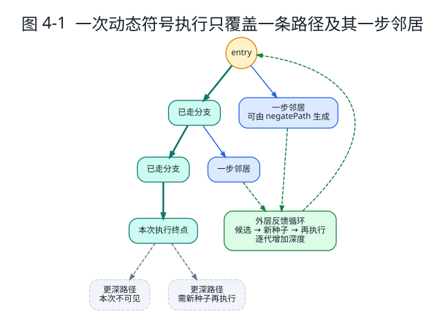

> 可缩放 SVG；[PNG 版本](diagrams/qa3/fig-4-1-path-neighborhood.png)；[DOT 图源](diagrams/qa3/src/fig-4-1-path-neighborhood.dot)。


**【一手证据】① 编译产物**（`docs/evidence/img_ir.png`）：`build/symcc -S -emit-llvm` 后的 IR 里可直接看到
`call void @_sym_push_path_constraint(ptr %29, i1 %30, i64 …)`——`%30` 正是上一行
`icmp eq i32 %22, 51966` 的**具体结果**，而 `br i1 %30` 仍按具体结果跳转。
**"符号表达式 + 具体取值一起传"在 IR 层一目了然**，不必只看编译器源码。

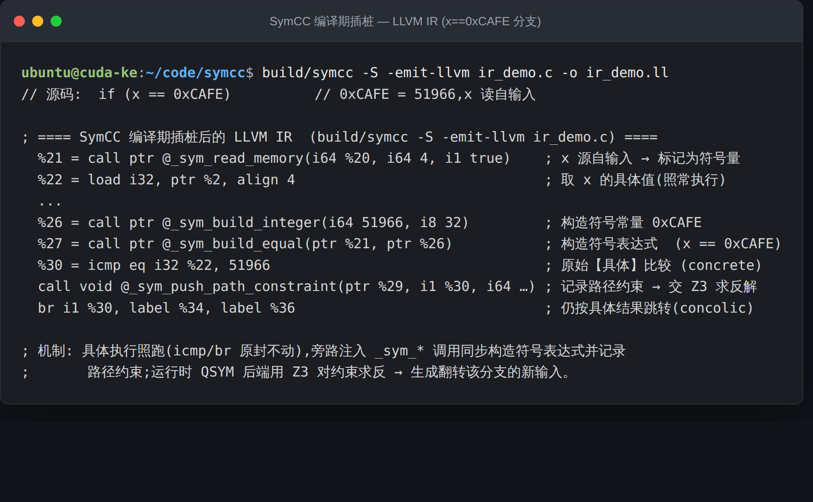

**【一手证据】② 运行时**（`docs/evidence/img_gdb.png`）：`gdb -ex 'b _sym_push_path_constraint' -ex run` 断下来时，
栈帧直接显示 `_sym_push_path_constraint (constraint=0x…, taken=0, site_id=97970033924416)
at runtime/src/backends/qsym/Runtime.cpp:320`——这是"**真实调试**"最直接的一帧。

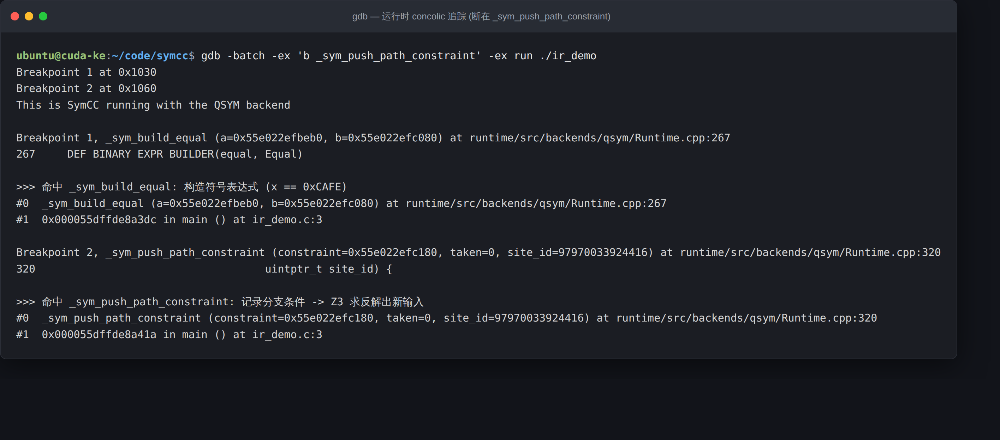

对**经典 native concolic 流**，目标运行时不 fork/快照，也没有进程内 worklist；
`path_hash_`（`solver.cpp:1315`）只是当前 trace 的标量摘要，多路径依赖外层候选反馈。
这句话不能推广到整个项目：§1.1.1 的 opt-in continuation/CAS 流确实保存状态 checkpoint、
维护 frontier，并可跨 lease 恢复。

**产出是种子的变异**（`solver.cpp:1531-1548`）：
```cpp
std::vector<UINT8> values = inputs_;          // ← 先拷贝种子
  ...                                          // 取 decl/name/value，仅处理 Z3_INT_SYMBOL
for (unsigned i = 0; i < num_constants; i++) {
    if (idx >= 0 && (size_t)idx < values.size())
      values[idx] = (UINT8)value;             // ← 只覆盖模型钉住的字节
}
```
求解器没约束到的字节，**原样保留种子的值**。

## 4.2 种子长度直接决定能不能解

**字节偏移就是变量身份**：`_sym_make_symbolic`（`RuntimeCommon.cpp:462-469`）按 `input_offset++` 逐字节建 `ReadExpr(offset)`，Z3 编码是 `context_.int_symbol(index_)`（`expr.h:508-535`），取模型时再按整数符号反查偏移。

三条结构性后果：

1. **只有被真正读到的字节才符号化。** `read` 返回几字节就符号化几字节。
2. **EOF 是具体的。** `LibcWrappers.cpp:709-713`：
   ```cpp
   auto result = getc(stream);
   if (result == EOF) { _sym_set_return_expression(nullptr); return result; }
   ```
   所以 `while ((c = getc(f)) != EOF)` 的**循环次数是具体的**，求解器永远不能靠翻转循环条件来加长/缩短文件。同理 `read()` 的返回值 `n` 是具体的，`if (n < 8)` **根本不是一个符号分支**。
3. **SymCC 不能靠模型凭空加长未建模输入。** 上游 `util/pure_concolic_execution.sh:15`
   表述为保持输入长度：
> `Note that SymCC never changes the length of the input, so be sure that the initial inputs cover all required input lengths.`
   本 fork 的实际输出还取决于 wrapper 如何填充 `inputs_`：有的路径保留整个 seed，有的路径
   只序列化已读取窗口并截掉尾部（§4.6）。共同点是求解器无法创造尚未读取/符号化的新字节。

这里的“输入”是**已被运行时识别并符号化的字节通道**。当前文档和 benchmark 主要覆盖
stdin/文件描述符与 `SYMCC_INPUT_FILE`；命令行参数、环境变量、网络报文、多文件关系、
时钟/随机数和外部持久状态若未显式建模，仍是具体环境。即使文件 seed 相同，这些通道不同
也会选择不同路径，这也是 DSE 效果依赖 harness 和执行环境的原因。

**`focus_bytes` 会进一步收窄**（`runtime/src/backends/qsym/Runtime.cpp:401-412`）：
```cpp
SymExpr _sym_get_input_byte(size_t offset, uint8_t value) {
  initFocusBytes();
  g_enhanced_solver->pushInputByte(offset, value);
  // 连续范围模式：范围外具体化
  if (g_focus_enabled && (offset < g_focus_start || offset > g_focus_end))
    return nullptr;
  ...
  return registerExpression(g_expr_builder->createRead(offset));
}
```
范围外的字节**永远具体**，只依赖它的分支对引擎完全不可见。

> ⚠ **SymSan 侧的一个坑（已修，值得记）**：DFSan 的 flag parser 把 `,` 当分隔符，`focus_bytes=0-3,8-11` 会让运行时 `Die()`——`docs/symsan_ported_techniques.md:81-83`：*"目标当场死掉、一条输出都没有，且**不报错**，看起来就像'这个目标解不动'"*。为此加了三层防御。

## 4.3 【实测】同一个二进制，只改种子长度 → 永远解不出

目标：4 字节魔数 `SYMC` → 长度检查 `n >= 8` + 长度字段 `buf[4]==3` → 校验和 `buf[5]+buf[6]+buf[7]==0x42`。

**8 字节种子 `AAAAAAAA`——第 6 代解出：**

```
gen 0   input=4141414141414141  AAAAAAAA   过 0 关 -> STAGE1a: bad magic[0]   [2 行 SMT 日志 = 1 次查询]
gen 1   input=5341414141414141  SAAAAAAA   过 1 关 -> STAGE1b: bad magic[1]   [4 行 SMT 日志 = 2 次查询]
gen 2   input=5359414141414141  SYAAAAAA   过 2 关 -> STAGE1c: bad magic[2]   [6 行 SMT 日志 = 3 次查询]
gen 3   input=53594d4141414141  SYMAAAAA   过 3 关 -> STAGE1d: bad magic[3]   [8 行 SMT 日志 = 4 次查询]
gen 4   input=53594d4341414141  SYMCAAAA   过 4 关 -> STAGE2b: bad len field  [10 行 SMT 日志 = 5 次查询]
gen 5   input=53594d4303414141  SYMC.AAA   过 5 关 -> STAGE3: bad checksum    [12 行 SMT 日志 = 6 次查询]
gen 6   input=53594d4303000042  SYMC...B   过 6 关 -> *** 命中深层代码 ***
```
字节演进：**`AAAAAAAA → SAAAAAAA → SYAAAAAA → SYMAAAAA → SYMCAAAA → SYMC\x03AAA → SYMC\x03\x00\x00B`**。
（口径说明：日志里每次 `check()` 会打**两行** `[STAT] SMT:`（`solver.cpp:1248` 与 `:1278`），所以"日志行 2,4,6,…,12"对应 **1,2,3,…,6 次 Z3 查询**，与 §4.5 中同一种子的 6 个产出一致。）
注意 gen 5→6：3 字节算术校验和被**一次 Z3 查询**解出（`00 00 42`）。也注意查询数 1,2,3,4,5,6 逐代 +1——**每加深一层，整条前缀都被重走一遍、且多解一个新分支**（呼应 §3.5）。

**4 字节种子 `AAAA`——同一个二进制，永远解不出：**

```
gen 0   41414141  AAAA  过 0 关 -> STAGE1a: bad magic[0]   [2 行 SMT 日志 = 1 次查询]
gen 1   53414141  SAAA  过 1 关 -> STAGE1b: bad magic[1]   [4 行 SMT 日志 = 2 次查询]
gen 2   53594141  SYAA  过 2 关 -> STAGE1c: bad magic[2]   [6 行 SMT 日志 = 3 次查询]
gen 3   53594d41  SYMA  过 3 关 -> STAGE1d: bad magic[3]   [8 行 SMT 日志 = 4 次查询]
gen 4   53594d43  SYMC  过 4 关 -> STAGE2: input too short (n=4)
                                    [8 行 SMT 日志 = 4 次查询 —— 没有增加!]
        候选: ac594d43 / 53a64d43 / 5359b243 / 53594dbc  全都退步
        -> 不动点，卡死
```

**决定性细节：gen 4 的 Z3 查询数停在 4，不是 5。** `if (n < 8)` 这个检查**一次查询都没贡献**——因为 `n` 是 `read()` 的具体返回值，那个分支**根本不是符号分支，无法被翻转**。
不是"解不出长度检查"，而是**对 4 字节种子来说这个检查不存在**。

### 图 4-2 同一个二进制，只改种子长度


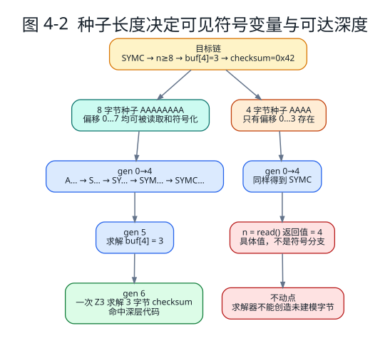

> 可缩放 SVG；[PNG 版本](diagrams/qa3/fig-4-2-seed-length.png)；[DOT 图源](diagrams/qa3/src/fig-4-2-seed-length.dot)。


跑到不动点的完整战报：

| 种子 | concolic 执行次数 | 求解调用 | 唯一输入 | 最深到达 | 墙钟 |
|---|---:|---:|---:|---|---:|
| 4 字节 `AAAA` | 31 | **56** | 30 | `STAGE2: input too short` — **永不命中** | 1.37 s |
| 8 字节 `AAAAAAAA` | 127 | **246** | 126 | **命中深层代码** | 5.45 s |

**空种子则完全惰性**：`input_bytes=0, symbolic_branches=0, z3_solves=0, generated=0`。

## 4.4 【实测】真实的 SMT 约束长什么样

开 `SYMCC_QUERY_SPOOL`（`solver.cpp:563-566`，导出在 `:2808-2810`）。以 `SYMC\x03AAA` 为种子跑一次，导出 6 条查询。

**第一条（魔数字节 0）**。⚠ `SYMCC_QUERY_SPOOL` 指向一个**目录**，实际落盘的是 `<dir>/incoming/query-<pid>-<start>-<seq>.json`——**单行 JSON**，`prefix_smt2` / `target_smt2` 是两个并列字符串字段。下面把这两个字段**拆开排版**便于阅读（`---` 分隔线为排版所加，文件中并不存在）；每个 smt2 串实际以一行 `; ` 注释开头，此处略去：
```smt2
--- prefix_smt2 (已累积的路径条件) ---
(set-info :status unknown)
(check-sat)
--- target_smt2 (被取反的那个分支) ---
(set-info :status unknown)
(declare-fun k!00 () (_ BitVec 8))
(assert (not (= k!00 (_ bv83 8))))
(check-sat)
```
`k!00` 是输入字节 0，`bv83` = `'S'`。导出格式本身就把 `prefix_smt2`（已走路径前缀）和 `target_smt2`（单个取反分支）分开——"一条路径 + 一次翻转"的结构是字面写在文件里的。

**最后一条（校验和）**（同样是把 JSON 字段分开排版）：
```smt2
(set-info :status unknown)
(declare-fun k!60 () (_ BitVec 8))
(declare-fun k!50 () (_ BitVec 8))
(declare-fun k!70 () (_ BitVec 8))
(assert (= k!70 (bvadd (_ bv66 8) (bvmul (_ bv255 8) k!50) (bvmul (_ bv255 8) k!60))))
(check-sat)
```
即 8 位算术下的 `buf[7] == 66 - buf[5] - buf[6]`，正是 `buf[5]+buf[6]+buf[7] == 0x42`。变量 `k!50/k!60/k!70` = 输入偏移 5/6/7 —— **"偏移就是变量"的编码在这里一目了然**。
注意**这里 prefix 是空的**：QSYM 的依赖切片只取与目标共享变量的约束，魔数约束落在偏移 0–4，与 5–7 不相交（呼应 §3.1）。

**Query IR 节点**（`schema: symcc-query-ir-v1`），`"op": "read"` 直接带着输入偏移：
```json
node[1] = {"id":1,"op":"read","bits":8,"children":[],"attrs":{"index":7}}
node[3] = {"id":3,"op":"read","bits":8,"children":[],"attrs":{"index":5}}
node[5] = {"id":5,"op":"read","bits":8,"children":[],"attrs":{"index":6}}
node[7] = {"id":7,"op":"add","bits":32,"children":[4,6],"attrs":{}}
node[9] = {"id":9,"op":"extract","bits":8,"children":[8],"attrs":{"index":0}}
metadata: {"site":<依源文件名而变的哈希>,"branch":0,"desired":false,"dependencies":[5,6,7]}
```

## 4.5 【实测】`focus_bytes` 的效果：范围外的分支直接消失

同一个 8 字节种子 `SYMC\x03AAA`，只改 `SYMCC_FOCUS_BYTES`：

| 配置 | 产出数 | 产出 |
|---|---:|---|
| 无限制（8 字节全符号） | **6** | `ac594d43…` `53a64d43…` `5359b243…` `53594dbc…` `53594d43fc…` `53594d4303000042` |
| `SYMCC_FOCUS_BYTES=0-3` | **4** | 只有魔数 4 个字节的变体 |
| `SYMCC_FOCUS_BYTES=5-7` | **1** | 只有 `53594d4303000042`（校验和解） |
| `SYMCC_FOCUS_BYTES=0-1` | **2** | 只有 `ac594d43…` `53a64d43…` |

### 图 4-3 符号字节 vs 具体字节


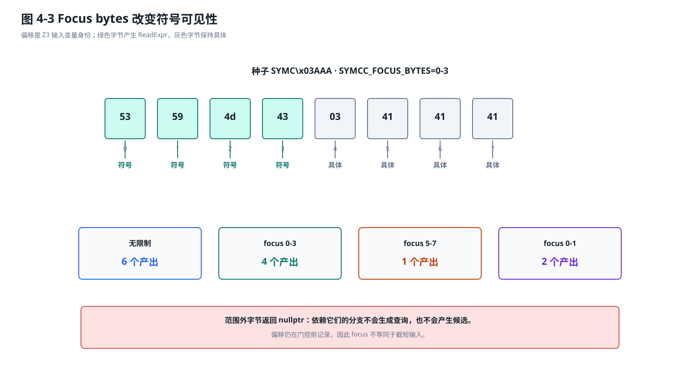

> 可缩放 SVG；[PNG 版本](diagrams/qa3/fig-4-3-focus-bytes.png)；[绘图脚本](diagrams/render_qa3_diagrams.py)。


范围外字节上的分支**不产生查询、不产生输出**——结构性不可见，与 `Runtime.cpp:401-412` 完全吻合。

> **【B级】但要注意，聚焦并不总是加速**（`docs/Research_and_Optimization_Report.md:436-445`）：小种子（<200 B）上全符号化 vs 聚焦 = 7.9 s/1354 边 vs 8.0 s/1361 边，**0.99×，无加速**；12 KB 合成大稀疏输入（1 % 相关）上聚焦反而 **0.02× 更慢**——因为具体化会改变哪些分支是符号的，**非单调地**改变探索路径。

## 4.6 输出序列化长度：不会凭空扩展未读字节

| 种子 | 程序读取 | 产出长度 |
|---|---|---|
| 24 字节 | 前 8 字节 | 24 字节 ⚠ |
| **64 字节** | 缓冲区 32 字节 | **32 字节**（尾部被丢弃） |

> ⚠ 第一行**按字面复现不出来**：`EnhancedQsymSolver` 构造时 `input_file_ = "/dev/null"`（`runtime/src/backends/qsym/Runtime.cpp:130`），`inputs_` 只随 `pushInputByte(offset,…) → resize(offset+1)` 增长。所以**输出长度 = 程序实际消费到的最大偏移 + 1，与种子长度无关**。一个真的只读 8 字节的目标会输出 **8 字节**，不是 24。24 那行只有在"程序把整个文件读进来、只检查前 8 字节"时才成立。**第二行 64→32 的截断可稳定复现**，结论（只截不加）不受影响。

24 字节输入保留尾部，说明“未参与当前约束”不等于“必然删除”；64→32 则说明运行时
`inputs_` 只覆盖当前识别/读取的输入窗口时，模型序列化不会凭空补回窗口外尾部。
因此应区分**原始 seed 文件长度**、**目标实际读取长度**、**运行时 `inputs_` 长度**和
**最终写出的 values 长度**，不能用一句“只截不加”概括所有 wrapper/harness。

## 4.7 种子调度：框架怎么挑给 concolic 的种子

策略全在 `AflConfig.best_new_testcases`（`mpi_fuzzing_helper.py:514-617`）。静态分（`:563-576`）：
```python
if "+cov"  in name: static_score += 100.0
if "+rare" in name: static_score += 60.0
if "symcc_" in name: static_score += 20.0
if   fsize > 50*1024: static_score -= 40.0
elif fsize > 10240:   static_score -= min(30.0, (fsize-10240)/1024.0)
elif fsize < 256:     static_score += 10.0
static_score += min(50.0, math.log1p(afl_id) * 5.0)
```
动态分叠加 `edge_yield`（3 类种子的 Beta-Bernoulli Thompson 采样，`:2732-2764`）和 `frontier`（K-Scheduler 前沿分，权重 40，`:605`）；最后 `heapq.nlargest` 取前 `max_active_workers * 4` 个（`:611-616`, `:3344`）。

**K-Scheduler 前沿分**（【论文】She, Shah, Jana, *Effective Seed Scheduling for Fuzzing with Graph Centrality Analysis*, **IEEE S&P 2022**——原文用 **edge horizon graph** + Katz 中心性；本项目是 **CFG-free 的稀有度代理**，不是原算法。opt-in `SYMCC_KSCHED=1`，开关在 `:3156`，打分在 `:3162-3188`；也可由组件选择器 `component_choices["seed"]=="frontier"` 激活，`:3349-3352`）：
```python
score = 0.0
for e, b in enumerate(data):
    if b:
        f = _edge_freq.get(e, 0)
        score += 1.0 / (f + 1)       # 稀有边贡献大（前沿）
        _edge_freq[e] = f + 1
```
即 rarity = Σ_{e∈edges(seed)} 1/(freq(e)+1)，用"边命中频率"作为 K-Scheduler 图中心性的 **CFG-free 代理**。每轮 showmap 预算 16 次（`:3159`），按内容 SHA-256 缓存。

**注意：种子从不被裁剪/最小化。** 选择路径里没有 `afl-tmin`/`afl-cmin`，也没有任何 minimizer。默认是**整份种子**发给一个 worker（`:381-384`）；只有在多样性模式且种子数少于目标工作项数时，`_build_work_items`（`:358-420`）才把同一个文件切成 `min(focus_parts, …)` 份、各自负责不相交的 `focus_bytes` 区间。

## 4.8 【B级】仓库里种子质量的旁证

`benchmark/benchmark_results_v2/benchmark_data.csv` 对照磁盘上的种子数：

| 目标 | 磁盘种子数 | 仅种子覆盖 | MPI 最佳覆盖 | MPI 产出数 |
|---|---:|---:|---:|---:|
| lava-md5sum | **1** | 7.14 % | **7.14 %** | **0** |
| lava-uniq | **1** | 9.54 % | **9.54 %** | **0** |
| lava-who | **1** | 6.73 % | **6.73 %** | 8 |
| freetype2 | 2 | 2.22 % | 2.26 % | 689 |
| pcre2 | 8 | 7.16 % | **18.66 %** | 140,206 |
| gfts-png | 11 | 10.35 % | 14.94 % | 23,174 |
| lava-base64 | 13 | 11.58 % | **23.25 %** | 107,994 |
| libarchive | 13 | 6.45 % | **13.90 %** | 75,851 |
| gfts-xml | 20 | 3.08 % | 5.74 % | 36,145 |
| sqlite | 25 | 13.70 % | 14.97 % | 31,747 |

单种子目标的 concolic 增益恰好为零，≥8 种子的目标都有明显增益。

> ⚠ **诚实说明：这个相关性是混淆的。** 仓库把单种子目标的零增益归因于"平坦二进制目标随机翻转即可覆盖、无需约束求解"（`docs/Final_Work_Report.md:414`；"目标太浅"那个说法出自 `docs/SymCC_MPI_Parallel_Effectiveness_Analysis.md:219`，且是针对 PNG/XML 而非 LAVA-M）；而后续工作证明 **uniq 的零其实是两个 bug**（`taint_getc` 丢标签 + 构建时 `KO_USE_FASTGEN` 丢失），修完后 **0 → 92 个 concolic 产出**（`docs/symsan_ported_techniques.md:257-277`）。**"种子少"和"目标浅"这两个因素，仓库里没有任何实验把它们分离开。**

**更干净的一条种子多样性 A/B**（`docs/Work_Progress_Report.md:149`）：字典引导在 **1 个种子**时 +50 %（1,802→2,710 边），在 **25 个种子**时 **+0 %**（4,832→4,835）。
注意两个基线本身：**1,802 vs 4,832 边——同一个目标上 2.7 倍的种子质量效应**。原结论（`:151`）：*"字典引导是**种子多样性的替代品**，而非额外提升"*。（精确值是 +50.4 % 和 +0.06 %，后者只多 3 条边。）

**另一个提醒：配置错误看起来和种子问题一模一样。** lava base64 的 afl-only 基线因为漏了 `-d` 参数，覆盖率从 **23.90 % 掉到 7.81 %**（`docs/PPT_Material_Supplement.md:169` 打 †、`:171` 给脚注。注意 `:167` 那行是 **hybrid np=8**，所以"afl-only 基线掉到 7.81 %"是推断而非直读；另有两份历史文档记的是 7.44 %）。排查"这个目标解不动"时，先查命令行。

## 4.9 【实测】真实 `base64` 程序的约束求解轨迹

前面的 `SYMC` 微目标用于隔离机制；这里再用真实的 SymCC 插桩目标
`benchmark/public/bin/lava-m/base64 -d <seed>` 核验一次。复现脚本：
[`benchmark/qa3_repro/trace_base64.sh`](../benchmark/qa3_repro/trace_base64.sh)。

关键环境变量如下：

```bash
SYMCC_OUTPUT_DIR=out \
SYMCC_INPUT_FILE="$seed" \
SYMCC_AFL_COVERAGE_MAP=qsym_bitmap \
SYMCC_TELEMETRY_OUT=telemetry.json \
SYMCC_DATA_COVERAGE=1 \
  benchmark/public/bin/lava-m/base64 -d "$seed"
```

`SYMCC_INPUT_FILE` 不是装饰项：若目标通过文件路径读输入但没有设置它，运行时不知道哪个
文件描述符属于符号输入，实测会得到 `input_bytes=0`、零符号分支、零产出。

| 种子 | 长度 | 退出码 | 符号分支 | interesting | Z3 `check()` | SAT/UNSAT | 产出（严格/乐观） | 内容唯一 |
|---|---:|---:|---:|---:|---:|---:|---:|---:|
| `rand.b64` | 175 B | 0 | **773** | **233** | **412** | 230/182 | **230（54/176）** | **134** |
| `utmp-fuzzed-100.b64` | 4096 B | 1 | 179 | 101 | 200 | 101/99 | 101（2/99） | 45 |

第一组的 `z3_solves=233` 等于 interesting 分支数；`solver_queries=412` 则等于
233 次严格查询再加 179 次乐观回退。总求解耗时约 109 ms、无 unknown/timeout，
只能说明这条 trace 没有 Z3 超时；本次脚本没有把进程执行、重放和筛选完整分相位，
不能据此给出端到端成本排名。

同一个目标换成 4096 字节种子后，程序沿另一条解码/错误退出路径执行：
符号分支从 773 降到 179，严格产出从 54 降到 2，相关输入字节也从 67 降到 8。
这不是“长种子一定更差”，而是**种子具体值决定路径，种子长度决定符号变量上界**；
两者共同决定本次执行能看见哪些分支和约束。

还有一个容易误读的现象：`rand.b64` 生成 230 个文件，但 SHA-256 内容只有 134 种，
即 96 个是内容重复。比如最早的一对 nominal/optimistic 文件会对同一 4 字节产生
相同修改。运行时的 `generated` 因而只能表示求解器保存次数，不能替代 worker 的
内容哈希去重，更不能替代 AFL showmap 的覆盖新颖性判断。这正好闭合了 Q1 的三层漏斗：

```text
求解器保存次数 230
    -> 内容唯一候选 134
    -> AFL showmap 新 bit 候选（由 hybrid worker/master 再筛）
```

异常退出还会截断观测：专项扫描中另一个种子以信号结束，只留下少量候选且没有
`atexit` telemetry；超时种子也没有完整 telemetry。因此真实调试必须同时保留退出码、
stderr、输出目录和 telemetry，不能只看 `generated` 一个数字。

### 4.9.1 真实逐分支调试仍缺什么

§4.4 给出了**合成目标**的一条完整 SMT；§4.9 对真实 base64 目前只有聚合 telemetry，
尚未把某个真实分支从现场一直追到 AFL 结果。科研复现应为至少一个真实 branch 保存以下链：

```text
site_id + parent/path/open_branch_hash
  → prefix_smt2 + target_smt2（或 Query IR 内容哈希）
  → strict/optimistic/backsolve 路由与 check 结果
  → 模型修改的输入 offset/value
  → 候选内容哈希
  → concrete replay 是否重新到达该 site/方向
  → showmap edge + hit-count bucket delta
  → worker B2 / master B1 / AFL virgin-state 的最终保留结论
```

在这条证据链完成前，本文可以回答“真实程序产生了多少分支/查询/文件”，但不能声称已经
展示了真实 base64 的 branch-by-branch 求解过程。crash/timeout 还必须保存未经过滤候选，
否则会受到 §1.5 crash-only 缺陷影响。

---

<a id="q5"></a>
# Q5 ICSE'23 统一再评估与 CoFuzz

## 5.1 论文是哪一篇

> **CoFuzz —— Ling Jiang, Hengchen Yuan, Mingyuan Wu, Lingming Zhang, Yuqun Zhang.
> "Evaluating and Improving Hybrid Fuzzing", ICSE 2023.** DOI `10.1109/ICSE48619.2023.00045`
> （南方科技大学 + UIUC；代码 <https://github.com/Tricker-z/CoFuzz>）

仓库内引用位置：`docs/sota_hybrid_execution_2026.md:48`；`docs/Research_and_Optimization_Report.md:185`（小节标题）与 `:509`（参考文献第 1 条）；代码注释 `util/mpi_fuzzing_helper.py:523` 和 `:2732`。全仓库对 `cofuzz|cohuzz` 共 7 处命中（上列 5 处 + `Research_and_Optimization_Report.md:32` + `docs/README.md:33`）。

**排除项**：仓库根目录三个 PDF 都不是它——`enfuzz.pdf` = EnFuzz（PDF 本身只有 `arXiv:1807.00182v2` 戳，无会议信息；USENIX Sec'19 这个出处来自 µFUZZ 的参考文献）、`pafl.pdf` = PAFL（ESEC/FSE'18）、`ufuzz.pdf` = µFUZZ（仓库里那份是**匿名投稿版**；正式发表为 Yongheng Chen, Rui Zhong, Yupeng Yang, Hong Hu, Dinghao Wu, Wenke Lee, *"µFUZZ: Redesign of Parallel Fuzzing using Microservice Architecture"*, **USENIX Security 2023, pp. 1325–1342**，代码 <https://github.com/s3team/muFuzz>）。仓库另引的 ICSE'23 论文是 GenSym，与评估无关。

> **⚠ 本节的证据来源要分清**：
> **§5.2–§5.3 的内容来自论文原文**（本次为写文档专门取回并逐条核对），**不在本仓库里**——仓库只记了两句头条结论。
> **§5.4 起才是本项目自己的数据**。两者不要混引。

## 5.2 论文是怎么测的

这篇论文的定位是对已有 hybrid fuzzer 做统一设置下的**再评估**，并提出 CoFuzz。它不是
逐个重建并忠实复现每篇原论文的全部 artifact：作者尽可能复用公开源码/运行时，对无法直接
运行的 DigFuzz、Pangolin 等组件进行重新实现或适配。因此本节应称“统一再评估”，而不是
“已有方案的忠实复现”。摘要里的问题意识说得很直白：

> "While the existing hybrid fuzzers have shown their superiority over conventional coverage-guided fuzzers, they seldom follow equivalent evaluation setups, e.g., benchmarks and seed corpora."

### 被评估的对象

| 类别 | 系统 | 说明 |
|---|---|---|
| **7 个 hybrid fuzzer** | **QSYM**（基线）、**Angora**、**Eclipser**、**Intriguer** | 各自设计了 concolic executor |
| | **DigFuzz**、**MEUZZ**、**Pangolin** | 改进的是**协调模式**（调度 / 同步） |
| **3 个传统 CGF 对照** | **AFL**、**FairFuzz**、**AFL++** | — |

**关键的公平性处理（等 CPU）**：所有 hybrid fuzzer 都是"1 核跑 fuzzing 策略 + 1 核跑 concolic"，所以论文把传统 CGF 一律实现成**双实例版本**（同一个 fuzzer 起两个实例、周期性互相同步种子）再来比。这正是本项目后来自己补做的那种等 CPU 对照（[§5.4.2](#q5-equalcpu)）。

### 基准与实验设置

| 维度 | 设置 |
|---|---|
| **真实程序** | **15 个**：readelf / nm / objdump / strip（binutils-2.37）、tcpdump、libxml2 2.9.12、libjpeg v9c、jhead、libpng 1.7.0、libtiff 4.2.0、file、bento、wavpack、cyclonedds、libming |
| **注入 bug 基准** | **LAVA-M**（base64 / md5sum / uniq / who，coreutils-8.24） |
| **种子** | JPEG/PNG/TIFF 用 AFL 官方种子集，其余用项目自带；`afl-cmin` 去重；**所有实验共用同一份种子集** |
| **时长 × 重复** | 真实程序 **24 小时 × 5 次重复取平均**；LAVA-M **5 小时** |
| **指标** | 边覆盖、unique crashes；LAVA-M 上是 bug 数 **N** + **bug 存活时间 Tm（分钟）**；另有"**冗余边比例**"这个自创指标 |
| **统计检验** | **Mann-Whitney U 单尾检验**，显著性水平 0.01 / 0.05 |
| **硬件** | AMD EPYC ROME 7H12 @2.6 GHz，256 GiB RAM，Ubuntu 18.04 |

## 5.3 结果如何：7 条 Finding，对 hybrid fuzzing 相当不客气

### 结果 A：后来的"改进"没打过 2018 年的基线

15 个程序的**平均边覆盖**（Table III，24 h × 5 轮），以 AFL 为 0 基准画增幅：

### 图 5-0A 统一再评估的平均边覆盖


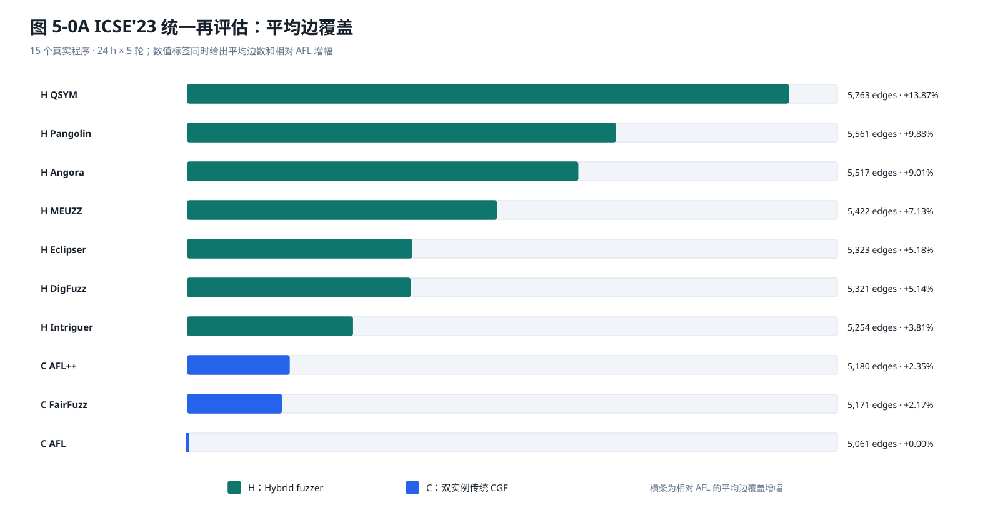

> 可缩放 SVG；[PNG 版本](diagrams/qa3/fig-5-0a-icse23-edge-coverage.png)；[绘图脚本](diagrams/render_qa3_diagrams.py)。


**2018 年的 QSYM 平均最高，且在 15 个程序里 7 个夺冠**；DigFuzz、MEUZZ、Pangolin 分别比它低 **7.67 % / 5.92 % / 3.51 %**——三个明确宣称改进 QSYM 协调模式的工作，在统一设置下都没打过它。

原论文自称 vs 本研究复现：

| 系统 | 原论文声称比 QSYM 高 | 本研究实测 |
|---|---|---|
| Intriguer | +12.42 % | **QSYM 高 3.75 %** |
| MEUZZ | +6.60 % | **QSYM 高 9.99 %** |
| Pangolin | +21.90 % | **QSYM 高 0.17 %** |

⚠ 上表右列（3.75 / 9.99 / 0.17 %）是**只在双方共同评估的程序子集上**算的（Intriguer 4 个、MEUZZ 6 个、Pangolin 9 个），与前面 15 个程序全集的 7.67 / 5.92 / 3.51 % **不是同一口径**，不要并排比较。

同一个程序 readelf 上，QSYM 的边覆盖在 Intriguer / MEUZZ / Pangolin 原论文和本研究里分别是 **6,012 / 1,244 / 8,402 / 9,512**——差了近 8 倍。论文推断原因是**硬件平台和初始种子集不同**。

> **Finding 1**：hybrid fuzzer 原论文之间的边覆盖对比结果，**不一定能推广到其他实验设置**。

### 结果 B：hybrid 相对传统 fuzzer 的优势"整体有限"

等 CPU（双实例 CGF）下，最差的 hybrid（Intriguer 5,254）也只是**略高于**最好的传统 CGF（AFL++ 5,180）。

| 系统 | 原论文声称比 AFL 高 | 本研究实测 |
|---|---|---|
| Angora | +27.08 % | **+9.01 %** |
| Eclipser | +25.15 % | **+5.18 %** |

而且 AFL 在 15 个程序里有 4 个胜过 Intriguer、3 个胜过 MEUZZ。

unique crash 上更难看（Table IV，10 个程序有 crash，合计）：

### 图 5-0B 统一再评估的 unique crashes


> 可缩放 SVG；[PNG 版本](diagrams/qa3/fig-5-0b-icse23-unique-crashes.png)；[绘图脚本](diagrams/render_qa3_diagrams.py)。


> **Finding 2**：hybrid 相对传统 CGF 的边覆盖优势**整体有限**（原文 *"somewhat limited"*、摘要 *"overall limited"*），说明 concolic 的能力没有被充分释放。
> **Finding 4**：大多数 hybrid 在真实程序上暴露 unique crash 方面，相对传统 CGF **优势有限甚至没有**。

### 结果 C：换零件没用，问题在"协调"

论文把 3 个 fuzzing strategy × 4 个 concolic executor 重新排列组合：QSYM-ce 配 AFL / FairFuzz / AFL++ 得到 **5,763 / 5,830 / 5,842** 条边——**最大差距只有 79 条边**。

> **Finding 3**：单独更换 fuzzing strategy 或 concolic executor，对边覆盖的影响很有限。

### 结果 D：真正的病根是**冗余边**

论文定义"冗余边比例" = fuzzing 策略和 concolic 执行器**重复探索到的同一批边**的占比。实测 **0.47（jhead）到 0.95（libjpeg）**；libjpeg 上除 QSYM（0.80）外全部 >0.95。

> ⚠ **下面两组数字不在同一个轴上**：0.47–0.95 是**按程序**在 7 个 fuzzer 上取的均值；紧接着的 0.65 / 0.71 / 0.87 / 0.91 / 0.92 是**按 fuzzer** 在 15 个程序上取的均值；0.80 则是 (libjpeg, QSYM) 单个单元格。不要当成同一条量纲比较。

而且**冗余边比例和性能高度相关**：QSYM 覆盖最高（5,763）且冗余最低（0.65）；Eclipser / Intriguer 覆盖最低（5,323 / 5,254）且冗余最高（0.92 / 0.91）。

原因论文说得很清楚：*fuzzing 策略和 concolic 执行器的覆盖状态是**互相不可见**的，只能周期性同步，中间存在"覆盖更新间隙"，于是 concolic 大量算力花在 fuzzer 早就覆盖了的边上。*

> **Finding 5**：hybrid 的有效性由冗余边比例反映，而它**与协调模式高度相关**（原文 *"highly relevant to"*，非"决定"）。
> **Finding 6**：DigFuzz / MEUZZ 的**种子级**调度**没能降低冗余**（0.87 / 0.71 vs QSYM 0.65）。
> **Finding 7**：Pangolin 的同步机制改进对边覆盖影响也有限。

论文由此给出的处方：必须做 edge-oriented（边级）而不是 seed-oriented（种子级）的调度。

### 结果 E：CoFuzz 自己

在完全相同的设置下，CoFuzz（QSYM + 边级在线线性回归调度 + 采样增强同步）：

- 边覆盖平均 **6,703**，比 AFL **+32.44 %**、比最好的 hybrid（QSYM）**+16.31 %**，15 个程序**全部夺冠**；
- Mann-Whitney U 单尾检验：15 个程序中 **13 个 p<0.01**，其余 2 个（libjpeg、libtiff）p=0.01059<0.05；
- unique crash **456 个**（约为其他 hybrid 的 2 倍）；人工确认出 **42 个 bug，其中 37 个此前未知**，30 个已被开发者确认、**8 个新 CVE**、20 个已修。

### 结果 F：LAVA-M 上——这直接回答了 Q6 的问题

Table VI，5 小时预算，`N` = 发现的 bug 数，`Tm` = **bug 存活时间（分钟，越小越快）**：

| Fuzzer | base64 N / **Tm** | md5sum N / **Tm** | uniq N / **Tm** | who N / Tm |
|---|---|---|---|---|
| QSYM | 44/44 / **8.48** | 57/57 / **31.77** | 28/28 / **4.55** | 1332/2136 / 300 |
| Angora | 48/44 / **6.75** | 57/57 / **16.37** | 29/28 / **7.15** | 1547/2136 / 300 |
| Eclipser | 46/44 / 128.33 | 57/57 / 147.35 | 29/28 / 155.83 | 1030/2136 / 300 |
| Intriguer | 46/44 / 205.07 | 57/57 / 132.60 | 29/28 / 187.22 | 1350/2136 / 300 |
| DigFuzz | 46/44 / 7.53 | 57/57 / 57.30 | 28/28 / 4.32 | 1146/2136 / 300 |
| MEUZZ | 44/44 / 7.28 | 57/57 / 40.35 | 28/28 / 6.50 | 1205/2136 / 300 |
| Pangolin | 48/44 / 9.37 | 57/57 / 132.75 | 29/28 / 13.27 | 1342/2136 / 300 |
| **CoFuzz** | 48/44 / **1.07** | 57/57 / **1.75** | 29/28 / **0.50** | **1913**/2136 / 300 |

**读法（很重要）**：
- **在该论文的 5 h protocol 下**，base64 / md5sum / uniq 上 7 个 hybrid fuzzer 都覆盖了
  validated endpoint（部分还报出列表外 ID），所以这三项主要区分 `Tm`，不是最终 endpoint。
- 只有 **who** 还有区分度，而且**没有任何一个能在 5 小时内拿满**（CoFuzz 1913/2136 最多）。
- 速度差距巨大：CoFuzz 1.07 分钟 vs 第二快的 Angora 6.75 分钟 vs Eclipser 128 分钟。
- 本项目也有一次 `/tmp` 历史语料在 103 秒预算后重放出 44/44（[§6.5](#q6)），但它与
  论文的种子、硬件、CPU 预算、运行方式、重复次数和 `Tm` 口径均不同，**不能**据此排序
  或声称优于 QSYM/接近 CoFuzz；最多说明 base64 endpoint 很容易在 concolic 路径上饱和。

## 5.4 本项目和它的关系

本项目**没有把任何实验命名为"复现 CoFuzz"**，但它独立地撞上了同一批问题——有对上的，也有走反的。

### 5.4.0 ⚠ 本项目实现的"CoFuzz-lite"，方向恰好是论文否定的那个

`util/mpi_fuzzing_helper.py:523` 的 docstring 写着 `增强种子调度策略（受 CoFuzz ICSE'23 启发）`，`:2736` 写着 `# 边产出率在线学习（CoFuzz + T-Scheduler 风格）：`。但实际实现（`:2739-2769`）是对 **3 类种子**（`cov` / `symcc` / `normal`）做 Beta-Bernoulli Thompson 采样，先验 `Beta(1,1)`。

对照论文：

| | CoFuzz 论文 | 本项目实现 |
|---|---|---|
| 调度粒度 | **边级**（edge-oriented） | **种子级**（seed-oriented，且只有 3 个类别） |
| 模型 | 在线线性回归（SGD 增量学习），5 个边特征 | Beta-Bernoulli Thompson 采样 |
| 论文对该方向的结论 | 这是它的核心贡献 | **Finding 6 明确说：种子级调度降不下冗余边** |

也就是说，本项目照搬的是"在线学习调度"这个**形式**，但保留了论文诊断为病根的**种子级粒度**。而且这个调度器**从未做过 A/B 验证**（`docs/` 和 `benchmark/` 里找不到它的消融实验）。仓库自己也声明了 `-style` 标签只表示改编而非忠实复现（`docs/sota_hybrid_execution_2026.md:11`）。

**这是一个应当写进待办的真实差距**：论文的处方是让 concolic 面向低效/未覆盖**边**，
而本项目当前主路径仍是选择**种子**后沿 trace 尝试多个 interesting 分支。§1.6 当前短测
有 132/299 个 worker 上报在 master 被拒，§5.4.3 的历史实验中 14 worker 有效率降至
18.6%；它们都提示跨执行冗余，但统计定义与论文 0.47–0.95 的“冗余边比例”不同，
不能直接称为同一个指标。

顺带一提：`SYMCC_TARGET_BRANCH` + telemetry 的 `target_reached` / `target_status` 已经把"只解某一条指定分支"的机制做出来了（`solver.cpp:714-716`，`util/hybrid_feedback.py:631-648`），差的是把它接到一个边级的效用模型上。

### 5.4.1 本项目自己指出的等 CPU 缺陷

`docs/PPT_Material.md:245`：
> Hybrid 使用的 CPU 核数多于 AFL-only。覆盖率差异中包含 CPU 资源差异的影响——Hybrid 的提升不能完全归功于 SymCC。缺少"多 AFL 实例"的等 CPU 对照组。

核数账（`docs/PPT_Material_Complete.md:432-436`）：AFL-only = **1 核**；Hybrid np=8 = **8 核**（1 AFL + 1 MPI master + 6 SymCC worker）。
可靠性说明（`:459`）：
> 所有数据为**单轮运行**（rounds=1），未计算标准差。AFL-only 基线在 6 次独立实验中的 ShowmapCov 标准差：libarchive ±0.23pp，SQLite ±0.63pp。差异 <1pp 的结论应视为**初步观察**。

被这条削弱的头条结论（`:825`）：`Hybrid 互补性成立 | 10 目标 ShowmapCov 均 ≥ AFL-only`——那是 1 核 AFL 对 8 核 hybrid 测出来的。

<a id="q5-equalcpu"></a>
### 5.4.2 后来真的补做了等 CPU 实验

`docs/Research_and_Optimization_Report.md:304-364`，`三之补 — 并行核心分配实验`。
设置（`:310`）：`np=16，timeout=240s，rounds=3`，两个代表性目标，扫 AFL 实例数 ∈ {1,4,8,12}，总核数恒为 16，`afl-showmap` 量并集语料的边覆盖。**这就是等 CPU 下的 N×AFL vs SymCC-heavy 对照。**

| AFL 实例 | SymCC worker | sqlite | libarchive |
|---:|---:|---:|---:|
| 1（旧默认） | 14 | 19.30 % | 23.30 % |
| 4 | 11 | 21.39 % | 23.79 % |
| **8（新默认）** | **7** | **22.82 %** | **23.92 %**（峰值） |
| 12 | 3 | 22.87 % | 21.60 % |

增幅（`:326-329`）：sqlite `19.30 → 22.82 (+18.2 %)`，libarchive `23.30 → 23.92 (+2.7 %)`，xml `9.11 → 9.47 (+3.9 %)`。

扩展到 **np=64、rounds=2、每个配置独占整机**（`:333-341`）：

| 策略 | sqlite | libarchive |
|---|---:|---:|
| 1 AFL + 63 SymCC（旧默认） | 21.02 % | 23.98 % |
| 均分 32 AFL + 31 SymCC | **24.49 %** | 22.88 %（**−4.6 %** ✗） |
| **封顶 51 AFL + 12 SymCC** | 23.12 %（+9.9 %） | 23.95 %（−0.1 % ✓） |

### 图 5-1 等 CPU 分配扫描：concolic 不是越多越好


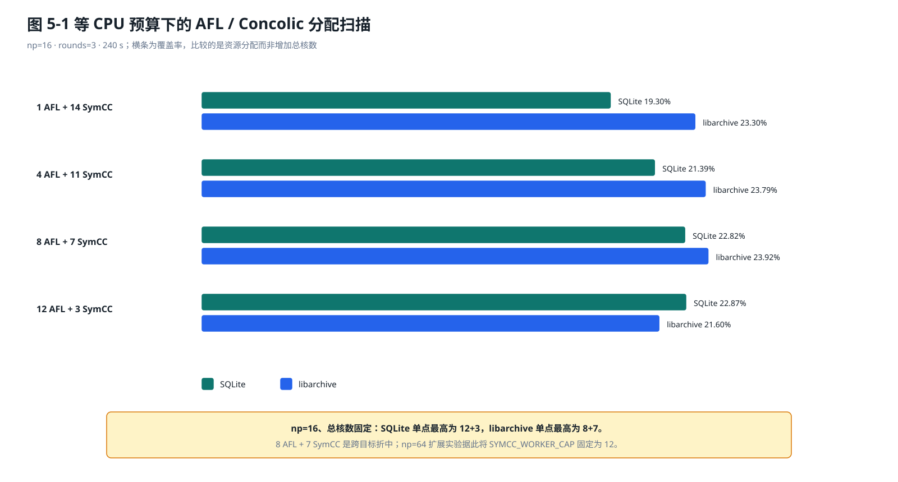

> 可缩放 SVG；[PNG 版本](diagrams/qa3/fig-5-1-cpu-allocation.png)；[绘图脚本](diagrams/render_qa3_diagrams.py)。


已作为默认落地：`benchmark/run_benchmark.py:82` `SYMCC_WORKER_CAP = 12`；分配逻辑 `:3835`。

> **这一段对设计文档的意义**：项目自己的等 CPU 扫描发现，把 ~94 % 的核给 concolic 是**严格的亏损**，最优点是把 concolic 封顶在 ~12 个 worker、其余全给 AFL。这是一个**仓库内部、独立得出**的旁证，支持"朴素 hybrid 的优势里有很大一部分是 CPU 预算不公平的假象"。

### 5.4.3 一批诚实的负面结果（全部仓库内自测）

**并行 concolic 的冗余是结构性的**（`:365-395`，同一个 AFL 队列，各 ~95 s）：

| SymCC worker 数 | 产出 TC | interesting | 有效率 |
|---:|---:|---:|---:|
| 6 | 1055 | 317 | **30.0 %** |
| 14 | 2549 | 474 | **18.6 %** |

`:375-377`：14 worker 时 `~81% 的 concolic 计算浪费在已覆盖边上`；哈希去重的重复率为 0 → **冗余是语义层面的，不是重复输出**。（本文 §1.6 的漏斗实测与此一致。）

- **"多样性感知分发"——否定**（`:382-390`）：有效率 关 18.0 % vs 开 17.9 %（n=2 噪声内），已回退；
- **KRAKEN 式运行期自适应分配——不优于静态**（`:396-420`）：np=64，2 轮，sqlite 23.12±0.10 vs 22.97±0.48；libarchive 23.95±2.31 vs 23.61±0.54。保留为 opt-in，默认关；
- TACE（FSE'24）污点制导选择性符号化——本 benchmark 上无收益（`:421+`）；
- **"集成的天花板很低"这个说法必须限定基准**（`:130` 记的是 `+5.8% branches / +0.68% bugs（EnFuzz-Q vs QSYM）`）——⚠ **那是 EnFuzz 的 LAVA-M 数字**。同一篇论文在 Google FTS 上，EnFuzz-Q 相对 QSYM 是 +16.5 % branches（376,051 vs 322,764）/ +24.2 % bugs（41 vs 33）。用 LAVA-M 的 +0.68 % 论证"再加引擎没用"，恰好犯了 [§6.3](#q6) 批评的那个错；
- **唯一真正提升覆盖率的**（`:54-58`）：GRIMOIRE 式无语法结构重组，sqlite `4339 → 4628 边（+6.7 %）`，原文称 `是所有尝试中唯一实质提升覆盖率的技术`。

### 5.4.4 最近一批多轮数据（SymSan 六目标）

`docs/symsan_hybrid_benchmark_6targets.md`：6 个真实目标，**3 轮 × 20 s**，`--np-list 8` = 3 AFL 实例 + 2 concolic worker，`afl-showmap -C`。

| 目标 | AFL 用例 | concolic interesting（均值） | 区间 | 边 | 边% |
|---|---:|---:|---|---:|---:|
| base64 | 442 | 28 | 23–33 | 97/192 | 50.5 % |
| uniq | 261 | 8 | 8–8 | 134/1216 | 11.0 % |
| xml | 10681 | 89 | **0–139** | 5019/50880 | 9.9 % |
| png | 832 | 37 | 24–44 | 665/3072 | 21.7 % |
| pcre2 | 23743 | 118 | 99–144 | 4520/9728 | 46.5 % |
| sqlite | 5040 | 86 | 83–89 | 6480/31552 | 20.5 % |

方法学自白（`:32-33`）：
> **单轮方差真实**。xml 三轮是 139 / 128 / **0**（有一轮 concolic worker 20s 内超时未贡献）；均值抹平、范围列显示区间。这正是要跑 3 轮的原因。

## 5.5 仓库已具备的统计机制（做正式对比时要用）

- `benchmark/research_protocol.py:1233-1238`：调度校验会**拒绝不等 CPU 预算**——`raise ValueError("schedule does not preserve equal CPU budgets")`，通过后返回 `"equal_cpu_budget": True`（`:1261`）。配对随机区组（`pair_id` + 共享 `random_seed`，`:1243-1250`）、规范序、摘要封存、强制 git 溯源；
- `benchmark/research_protocol.py:27`：`MIN_CONFIRMATORY_REPEATS = 20`——确认性协议少于 20 次重复直接报 `"underpowered confirmatory protocol"`；
- `benchmark/analyze_ablation.py`：`bootstrap_ci` / `paired_bootstrap_ci`（默认 5000 次重采样）、`vargha_delaney`（A12 效应量）、`randomization_p_value`（符号翻转）、`holm_adjust`；
- **Mann-Whitney U 只在计划里，没有实现**（`docs/Recent_Work_and_Next_Research_Plan.md:397`）。落地的是 bootstrap + 符号翻转 + A12/Cliff + Holm；
- 证据分级契约（`docs/Development_History_Traceability.md:75`）：`| R | 等 CPU、多轮、置信区间、效应量和逐项消融 |`；
- **目标协议尚未执行**（`docs/Recent_Work_and_Next_Research_Plan.md:479-483`）：`固定 equal CPU budget：1、4、8、16、32 workers；30min、2h、6h 三档；每组至少 20 次随机重复。`

## 5.6 小结（Q5）

**论文怎么测的**：7 个 hybrid fuzzer（QSYM/Angora/Eclipser/Intriguer/DigFuzz/MEUZZ/Pangolin）+ 3 个传统 CGF（**跑双实例版本以保证等 CPU**），15 个真实程序 + LAVA-M，统一种子集（`afl-cmin` 去重），**24 h × 5 轮取平均**，边覆盖 + unique crash + bug 存活时间 + 自创的"冗余边比例"，**Mann-Whitney U 单尾检验**。

**结果如何**（对 hybrid fuzzing 相当不客气）：

1. **原论文之间的对比结果不能推广**——同一个 readelf，QSYM 的边覆盖在四份工作里是 6,012 / 1,244 / 8,402 / 9,512；
2. **2018 年的基线 QSYM 平均最高**，三个明确宣称改进它的工作（DigFuzz / MEUZZ / Pangolin）在统一设置下分别低 7.67 % / 5.92 % / 3.51 %；
3. **hybrid 相对传统 CGF 的优势"整体有限"**：等 CPU 下最差的 hybrid（+3.81 % vs AFL）只略高于最好的 CGF（+2.35 %）；unique crash 上 Eclipser 和 DigFuzz **还不如 AFL**；
4. **病根是冗余边**（0.47–0.95）：fuzzer 和 concolic 的覆盖状态互相不可见，concolic 大量算力花在 fuzzer 早覆盖的边上。**种子级调度降不下来，必须做边级**；
5. CoFuzz 用边级在线回归调度 + 采样增强同步，边覆盖 +16.31 %（15/15 夺冠，13 个 p<0.01），42 个 bug / 8 个新 CVE。

**本项目和它的关系**：

1. 仓库**只记了头条数字**（16.31 %、2× crash）和两个机制名，**没有记录任何方法学**——上面这些必须引原论文，不能引仓库；
2. 本项目**没有复现** CoFuzz 的评估。它实现的"CoFuzz-lite"是 **3 类种子的 Thompson 采样**——**恰恰是论文 Finding 6 明确否定的种子级粒度**，而且从未做过 A/B 验证（[§5.4.0](#q5)）。这是一个真实差距，不是措辞问题；
3. 但它**独立做出了**等 CPU 对照（16 核 / 64 核分配扫描），观察到 concolic worker
   封顶约 12 后更稳健；§1.6 中 132/299 个 worker 上报被 master 拒也显示并行冗余。
   这些与论文 Finding 2/5 方向相容，但定义不同，不能直接等同论文的冗余边比例；
4. 最强的正面 concolic 结果是**目标特定**的：LAVA-M base64 `0/44 → 39/44`；覆盖率层面最有效的杠杆反而是 GRIMOIRE 结构合成（sqlite +6.7 %），不是求解器。

---

<a id="q6"></a>
# Q6 基准目标与 LAVA-M

## 6.1 本项目的目标集

**微目标**：`benchmark/run_benchmark.py:63-68` 的 `TARGETS` 只声明 **4 个**——`maze`（16 B，指数分支）、`parser`（32 B，嵌套条件）、`deep_branches`（8 B，深依赖链）、`crypto_check`（16 B，逐字节比较）。另有 `benchmark/targets/parallel_scaling.c`（64 个 `MODULE()`，id 0–63）**只有源码、没有接进 runner**（`grep -n parallel_scaling benchmark/run_benchmark.py` 零命中）。

**真实目标**（`benchmark/public/bin/`，版本取自 `benchmark/public/gfts_build/`）：

| 目标 | 库 / 版本 | 格式 | 驱动 | 种子数 |
|---|---|---|---|---:|
| `gfts-png_read_fuzzer` | libpng **1.2.56** | PNG | `compile_public_benchmarks.sh:309-391` 内联 harness | 11 |
| `gfts-xml_read_fuzzer` | libxml2 **2.9.2** | XML | `:468-545` | 20 |
| `pcre2-pcre2_fuzzer` | pcre2 **10.00** | 正则 | `targets/pcre2_harness.c` | 8 |
| `sqlite-sqlite_fuzzer` | sqlite **2016-11-14** | SQL | `targets/sqlite_harness.c` → `sqlite3_exec` on `:memory:` | 25 |
| `libarchive-archive_fuzzer` | libarchive **v3.3.2** | 归档 | `targets/libarchive_harness.c` | 13 |
| `freetype2-freetype2_fuzzer` | freetype2（git `a6d4860`） | 字体 | `targets/freetype2_harness.c` | 2 |
| `lava-base64` / `_harness` | coreutils 8.24 LAVA-M | base64 | `base64 -d @@` | 13 |
| `lava-md5sum` / `uniq` / `who` | coreutils 8.24 LAVA-M | — | `md5sum -c` / `uniq` / `who` | **各 1** |

**声明了但从没下载的套件**：`setup_public_benchmarks.sh:505` 的用法行是 `--all | --lava-m | --unibench | --symcc-paper | --google-fts | --fuzzbench | --magma`（只有 UniBench 在脚本里写明是 20 个程序；FuzzBench/Magma 没写数量）。CGC `cb-multios`（243 个）在**另一个脚本** `compile_public_benchmarks.sh:6,32` 的 `--cgc`。实际下载到 `benchmark/public/` 的只有 `fuzzer-test-suite/` 和 `lava_corpus/`（该目录另有 `bin/`、`gfts_build/`、`seeds/` 三个构建产物目录）。**tcpdump 和 openjpeg（SymCC 论文的目标）从未构建。**

**运行配置**：默认 `--np-list 1,2,4,8 --rounds 3 --timeout 60`；归档实验实际用 120 s 或 300 s、`rounds=1`。主指标是 `afl-showmap -C` 边覆盖（`run_benchmark.py:753-900`），`lcov`/`gcov` 是次要路径。cmplog 默认开（`-c <bin> -l 2AT`）。

> ⚠ **一个容易踩的语义陷阱**：`hybrid` 模式下 `generated = AFL 队列数 + SymCC 产出数`（`run_benchmark.py:2583`），`afl-only` 下只是 AFL 队列（`:2798`），`mpi` 下只是 SymCC 产出。**hybrid 的 `generated` 不是 concolic 产出数。**

## 6.2 别的并行符号执行与并行 fuzzing 用什么目标

### 6.2A 真正的并行符号执行

并行符号执行和并行 fuzzing 的状态单位不同，不能放在同一张“同类系统”表里。前者分发
execution state/path condition，后者并发运行 fuzzer 实例并交换 seed/corpus。

| 系统 | 并行单位 / 目标 | 评估目标 | 关键规模结论 |
|---|---|---|---|
| **Cloud9**（EuroSys 2011） | KLEE state；中心调度 + worker 间状态迁移 | `memcached`、Apache `httpd`、`lighttpd`、Python、`rsync`、`curl` 等真实系统 | 重点证明集群级 state-level symbolic execution 能扩展到服务器和系统程序；与本项目 native seed replay 的执行单位不同 |
| **GenSym**（ICSE 2023） | 编译成 CPS/continuation 后并行展开路径 | 6 个有限路径算法目标；Coreutils 8.32 的 `base32`、`base64`、`cat`、`comm`、`fold`、`echo`、`dirname`、`expand`、`paste`、`cut`、`join`、`link`、`true`、`pathchk` | 4/8/12 线程启用 solver 优化时平均加速 **2.08/2.83/3.10×**；关闭该优化为 **3.63/6.74/9.36×**，显示求解器共享/串行成本会限制扩展 |

Cloud9 的目标强调复杂系统与状态迁移；GenSym 的目标强调 continuation 编译和可枚举路径
的并行扩展。当前项目的 continuation/CAS 流在执行单位上更接近 GenSym，但 lowering 覆盖、
内存模型和正式 scaling 证据仍需单独比较，不能因为有 checkpoint 就宣称复现了 GenSym。

### 6.2B 并行/协同 fuzzing（不是并行符号执行）

| | **EnFuzz**（arXiv:1807.00182v2；据 µFUZZ 参考文献为 USENIX Sec'19） | **PAFL**（ESEC/FSE'18, pp. 809–814） | **µFUZZ**（仓库内为匿名投稿版；正式发表 **USENIX Sec'23, pp. 1325–1342**） |
|---|---|---|---|
| 套件 | LAVA-M(4) + **Google fuzzer-test-suite(24)** + 真实项目(15)，共 43 | **Google FTS(12)** + GitHub(9 有 CVE) | **Magma(6)**：Poppler / SQLite / openssl / sndfile / libxml2 / PHP |
| 时长 | 24 h | 24 h | 24 h |
| 重复 | 10（FTS）；LAVA-M 未说明 | 10 | 5 |
| 核数 | 1（单）/ **4**（并行） | **4** | **40** |
| 基线 | AFL, AFLFast, FairFuzz, libFuzzer, Radamsa, QSYM | AFL, AFLFast, FairFuzz | AFL++, AFLEdge, AFLTeam，外加 2 个 AFL++ 配置变体（-M/-F）与 2 个自身消融（µFUZZ-S/-SM） |
| **用 LAVA-M 吗** | **用** | **不用**（全文 0 次 "LAVA"） | **不用** |
| 指标 | 路径 / 分支 / 唯一 bug | 分支 / 唯一 crash | **边覆盖** + Magma bug ID + **存活时间** |

µFUZZ 在引言里说 "including Magma and FuzzBench"，但全文只有引言和参考文献两处提到 FuzzBench，没有任何 FuzzBench 结果表（摘要里并未出现）。

**三篇并行 fuzzing 论文各自记录了单机优化在并行下退化的现象**：EnFuzz 说
AFLFast/FairFuzz 在 4 核并行下只找到 AFL 的 73.5 %/88.2 % 的 bug；PAFL 说它们只覆盖
AFL 的 97 %/96 % 分支、触发 57 %/89 % 的 crash；µFUZZ 说 QuickJS 上
10 实例 × 1 h 只有 1 实例 × 10 h 的 **49 %** 路径。这与本项目“增加 worker 后边际收益
下降”的方向一致，但机制不同：它们主要研究 corpus 同步/负载，本项目还叠加了求解冗余。

## 6.3 LAVA-M 被认为"太简单/已饱和"吗

**本仓库从未这样说过。** 对 `docs/`、`benchmark/`、`README.md` 做 LAVA × {easy, weak, simple, saturat, 简单, 饱和, 局限} 的组合搜索，**零命中**。仓库的定位反而是正面的（`docs/Parallel_Architecture_Report.md:227`）：*"LAVA-M：学术界标准的 bug 注入基准集，可验证 bug 发现能力"*。

但文献和现有短测都提示：部分目标在特定 protocol 下对 concolic 的 endpoint 区分度有限：

- **EnFuzz 自己就这么说**（§5.3、§5.4 原文）：
  > "The base code of the four applications in LAVA-M are **small (2K-4K LOCs)** and concolic execution could work well on them. However, real projects have code bases that easily reach 10k LOCs. Concolic execution might perform worse or even get hanged."
  > "While LAVA-M is widely used, Google's fuzzer-test-suite is more practical with many more code lines and containing real-world bugs."
  它的小节标题就是 "**Preliminary** Evaluation on LAVA-M"。
- EnFuzz 报告 QSYM 在 **md5sum 上 57/57**、base64 41/44；EnFuzz-Q 相对 QSYM 只多 **0.68 %** 的 bug；
- **【论文】CoFuzz（ICSE'23）的 LAVA-M 表是最直接的证据**（[§5.3 结果 F](#q5)）：7 个 hybrid fuzzer 在 base64 / md5sum / uniq 上全部拿满，区分度只剩"多快"（1.07 ~ 205 分钟）；只有 `who` 还有区分度，且**没有一个能在 5 小时内拿满**；
- **【论文】学界已把它列为"有缺陷"**——Schloegel et al., *SoK: Prudent Evaluation Practices for Fuzzing*, **IEEE S&P 2024**（[arXiv:2405.10220](https://arxiv.org/abs/2405.10220)）在综述 289 篇 fuzzing 论文后原话是：
  > "Despite its success, **LAVA-M is nowadays considered flawed** because it artificially injects vulnerabilities into a given target program that are easy for a fuzzer to find but do not correspond to real bugs. More recent works using LAVA-M often do so only for **comparability reasons**."

  同一节还说 CGC "is widely considered outdated and inadequate"，并把结论压成一句：*"Benchmarks with artificial vulnerabilities are still used."*（言下之意：不该再用）。
- PAFL（2018）与 µFUZZ（2023）两篇并行 fuzzing 论文都不用 LAVA-M，µFUZZ 改用 Magma + 存活时间分析；
- 本项目实测：纯 concolic MPI 在 **np=32 时 103 秒拿满 44/44**（见 §6.5）。

**结论应限定为**：在 CoFuzz 的 5 h 设置和本项目的 base64 历史短测中，
base64/md5sum/uniq endpoint 对多种 hybrid/concolic 系统区分度低；`who` 仍未饱和。
“纯 fuzzer 依然很难”也只由特定 AFL 配置和短预算支持，不能推广到所有 CGF。LAVA-M
适合做通路回归和历史可比性检查，不足以单独支撑真实缺陷发现能力或系统排名。

> 仓库里唯一的"饱和"措辞是针对**自己的** PNG/XML 目标（`docs/SymCC_MPI_Parallel_Effectiveness_Analysis.md:219`）：*"目标太浅：PNG/XML 的 harness 仅调用极少 API，可达路径邻域在 5 分钟内即饱和"*。

## 6.4 bug 是怎么数的

工具是 `scratch_lava_bugcount.py`（提交 `106cdf2`），**不是 benchmark 主流程**。方法：

1. 把语料里每个文件喂给 **gcov 版** `benchmark/public/bin/lava-m-cov/<prog>`，按 LAVA 规范的选项（`base64 -d` / `md5sum -c` / `uniq` / `who`），超时 5 s；
2. 正则抓 `Successfully triggered bug (\d+)`（`:36`）。LAVA 用 `dprintf(1,...)` 绕过 stdio 缓冲，所以这行在随后的 SIGSEGV 中仍能幸存；SEGV 退出码被显式忽略（`:159`）；
3. **去重**：bug ID 累进一个 Python `set`（`:191`）——记的是**不同 bug ID 数，不是 crash 次数**；
4. 与官方 `validated_bugs` 求交，输出两个数：`distinct`（全部 ID）和 `listed hits`（∩ validated，即 LAVA 论文口径）。

`validated_bugs` 行数：base64 **44**、md5sum **57**、uniq **28**、who **2136**。

> ⚠ **benchmark 主流程根本不记 bug 数。** 当前 `benchmark_results*/benchmark_data.csv`
> 共 **19 个文件、379 行数据，`crashes` 列无一非零**——因为 `run_benchmark.py:897`
> 把 `"crashes": 0` 写死了（`afl-showmap -C` 不报 crash）。所有 LAVA-M bug 数都来自
> 上面的离线重放脚本。

**工具自校验**（用 LAVA 自带的 ground-truth 触发输入）：base64 **44/44 ✅ 完全吻合**；md5sum 55/57；uniq **14/28**（LAVA 自带 `inputs/` 本身只到 14，这是个天花板，引用 uniq 数据时必须说明）；who 1492/2136。**用种子语料跑，四个程序全部 0 bug。**

## 6.5 LAVA-M 的实际结果

### 6.5.0 当前仓库内可复算的结果：吞吐与边覆盖

当前已提交的 `benchmark/benchmark_results_lava/benchmark_data.csv` 是 120 s、单轮数据。
它证明并行/混合执行提升了生成吞吐和边覆盖，但其 `crashes` 全为 0，**不能证明 bug 数**：

| 模式 | np | generated | unique | tc/s | 边覆盖 | edges |
|---|---:|---:|---:|---:|---:|---:|
| serial | 1 | 0 | 0 | 0.0 | 11.21 % | 122/1088 |
| MPI | 2 | 12,474 | 7,076 | 121.1 | 21.69 % | 236/1088 |
| MPI | 16 | 128,077 | 60,371 | **1,241.1** | 21.88 % | 238/1088 |
| hybrid | 2 | 265 | 265 | 2.19 | 21.51 % | 234/1088 |
| hybrid | 16 | 1,282 | 1,282 | 10.58 | **23.90 %** | **260/1088** |
| AFL-only | 1 | 85 | 85 | 0.71 | 7.81 % | 85/1088 |

这些行支持两个有限结论：MPI 把候选生成吞吐扩到 1,241 tc/s；hybrid 虽然保留的输入少，
但覆盖更高，说明 coverage triage 有效。它们不是等 CPU、多轮确认性实验，也没有
LAVA bug ID，所以不能从表中写出“发现了多少漏洞”或 time-to-bug。

### 6.5.1 【B级历史】"0 → 39/44" 的完整出处

提交 `106cdf2`：*"Used to measure the afl-only vs hybrid injected-bug counts (base64: 0 -> 39/44)."* 底层是 scratchpad 里的 `lava_fix.sh` + `lava_fix.out`（2026-07-19，**未提交仓库**）：

- **afl-only**：语料 696 个 → **0 / 44**（该语料由另一个脚本 `scratchpad/lava_bugs.sh` 以 `T=240` 秒生成；`lava_fix.sh` 本身不跑 AFL，只消费这份现成语料）
- **hybrid**：对 AFL 语料前 400 个文件各跑一次 SymCC（15 s）→ **409 个新输入**；合并语料 1105 个 → 41 distinct，**39 / 44**
- **uniq**：SymCC 在 505 个 AFL 语料上产出 **0** 个新输入 → **0 / 28**
- **md5sum**：AFL 语料只有 **1 个文件** → **0 / 57**

### 6.5.2 【B级历史】从幸存的 `/tmp` 运行目录重放出的证据

**可复现性说明（已逐行复核）**：这些运行目录目前仍在本机 `/tmp/bench_lava-base64_*` 下、可就地重放。
审查中用仓库内的 `scratch_lava_bugcount.py` 重跑了下表**全部 12 行**（4 行 campaign + 8 行子语料拆解），
**每一行的语料文件数与 bug 数都精确复现**——包括两次独立的 np=32 运行都得到 47 distinct / 44 listed。

但它们**不在仓库内、不受版本控制，随时可能被清理**；而且方法学上是**单次运行、非等 CPU、无 time-to-bug**。
因此仍按 **B 级**引用，也不能与 §6.5.0 的已提交 CSV 合并成同一组正式实验。
（⚠ 早期草稿中"原始运行目录不在当前仓库内"的表述**过于保守**：这些目录仍在，且已逐行复核。）

| 运行 | 配置 | 墙钟 | 语料 | distinct | **listed** |
|---|---|---:|---:|---:|---|
| `bench_lava-base64_mpi8_r0_*` | 纯 MPI，1 master + **7 worker** | 104 s | 4,415 | 43 | **42 / 44** |
| `bench_lava-base64_mpi32_r0_*` | 纯 MPI，**31 worker** | 105 s | 40,847 | 47 | **44 / 44** |
| `bench_lava-base64_mpi32_r0_*`（第二次） | 同上 | 105 s | 28,588 | 47 | **44 / 44** |
| `bench_lava-base64_hybrid8_r0_*` | hybrid np=8：4 AFL + 3 SymCC | ~18 s | 707 | 32 | **29 / 44** |

hybrid np=8 的**分目录拆解**（最有信息量的一片）：

| 子语料 | 文件数 | listed hits |
|---|---:|---|
| `symcc_all_outputs`（SymCC 原始产出） | 117 | **26 / 44** |
| `afl_out/fuzzer02/queue` | 89 | **0 / 44** |
| `afl_out/fuzzer03/queue` | 90 | **0 / 44** |
| `afl_out/fuzzer04/queue` | 101 | 1 / 44 |
| `afl_out/fuzzer04/crashes` | 53 | 28 / 44 |
| `afl_out/fuzzer01/queue`（含 helper 直注的 `id:symcc_*` 文件） | 167 | 26 / 44 |
| `afl_out/fuzzer03/crashes` | 19 | 10 / 44 |
| 全量并集（真实输入文件，不含 extras/.synced/统计文件） | **707** | **29 / 44** |

fuzzer02/03 的队列各为 0，而 fuzzer01 目录中的 helper 直注文件重放得到 26/44，这提示
对应内容来自 SymCC 解；但 §1.10 的受控实验表明运行中的 AFL 不会重扫自己的 queue，
所以这些文件**存在于目录**不等于已经进入 AFL 内部 corpus。本文也没有做逐 bug-ID/
内容哈希来源追踪，不能称为 AFL “已 sync” 或闭环生效。

### 结论（发现漏洞的个数和速度）

### 图 6-1 LAVA-M base64：注入 bug 的发现个数与速度


> 可缩放 SVG；[PNG 版本](diagrams/qa3/fig-6-1-lava-endpoints.png)；[绘图脚本](diagrams/render_qa3_diagrams.py)。


| 配置 | 墙钟 | ≈CPU·秒 | base64 listed bugs |
|---|---:|---:|---|
| AFL-only，8 实例 | 240 s | ~1,920 | **0 / 44** |
| Hybrid np=8（4 AFL + 1 master + 3 SymCC） | ~18 s | ~144 | **29 / 44** |
| 纯 concolic MPI np=8 | 104 s | ~832 | **42 / 44** |
| **纯 concolic MPI np=32** | **105 s** | **~3,360** | **44 / 44（满分）** |

> ⚠ **这不是等 CPU、同语料、同机器或多轮对照**；"18 s / 104 s / 105 s"是 campaign 预算，
> 不是各 bug 的首次触发时间。AFL 0/44 与 concolic 42/44 是有价值的机制观察，但无法
> 量化"快多少倍"，也不能证明差异不会由配置、种子或运行产物选择造成。

### 横向校准：两个独立的外部数据点

**① 【论文】QSYM 自己的 LAVA-M 表**（Table 6，USENIX Security 2018；括号内为占官方 bug 总数的比例）：

| 系统 | uniq /28 | base64 /44 | md5sum /57 | who /2136 |
|---|---:|---:|---:|---:|
| FUZZER（AFL） | 7 (25 %) | **7 (16 %)** | 2 (4 %) | 0 (0 %) |
| SES | 0 (0 %) | 9 (21 %) | 0 (0 %) | 18 (39 %)† |
| VUzzer（论文值） | 27 (96 %) | 17 (39 %) | 0 (0 %) | 50 (2 %) |
| **QSYM** | **28 (100 %)** | **44 (100 %)** | **57 (100 %)** | 1,238 (58 %) |

† 原表如此（SES 的 who 一列计数与百分比不自洽），属论文原文，非本文转录错误。

> **⚠ 这条修正本文上面的口径。** 实测的"AFL-only 8 实例 240 s → 0/44"是**那个预算下**的结果，
> **不能读成"AFL 永远找不到 LAVA-M 的 bug"**——QSYM 论文里 AFL 拿到 **base64 7/44、uniq 7/28**。
> 正确表述是：**在秒级到分钟级预算内，随机变异命中 `lava_get(N)==0x6c617564` 这类精确 4 字节魔数的概率在 2⁻³² 量级（【论文】CoFuzz §IV-D-2 原话：*"the probability of generating the feasible input matching such 32-bit value via probabilistic mutation is **1/2³² ≈ 2.3×10⁻¹⁰**"*；LAVA 论文本身也说 *"Bugs that trigger if and only if a **four-byte extent in the input is set to a magic value are unlikely to be discovered** in this way"*），
> 而约束求解一次即得**——这是**速度的量级差**，不是"能与不能"的绝对差。

**② 三个来源在 base64 上高度一致**（都拿满 44/44），这反过来说明该目标已无区分度：

| 来源 | 系统 | base64 |
|---|---|---|
| 【论文】QSYM (USENIX'18) Table 6 | QSYM | 44/44 |
| 【论文】CoFuzz (ICSE'23) Table VI | QSYM / Angora / Pangolin / CoFuzz | 均 44/44（或 48，含额外误触发） |
| 【实测】本文 | 纯 concolic MPI np=32 | 44/44 |


**可以保留的机制解释**：LAVA-M 中部分 guard 是精确宽整数比较，适合一次位向量求解；
随机变异直接命中特定 32-bit 常量的概率很低。但 guard 可达性还依赖路径前缀、输入通道、
污点传播和构建配置，因此不能把每个 LAVA bug 都简化成“一次求解即可”。

CoFuzz Table VI 的 `Tm` 来自论文自己的 5 h protocol；本项目的 103 s 是另一运行在预算结束
后进行离线 endpoint 重放。二者不是同一 estimand，不能放进同一速度排名。正式横向比较
至少需要同 seed、同硬件/CPU budget、相同版本、逐 bug 首次触发时间和多轮生存分析。

**但要立刻加三条限定**：
1. **这个优势不能外推。** EnFuzz 的数据里，Google FTS 上 EnFuzz（AFL+AFLFast+libFuzzer+Radamsa）找到 60 个 bug、AFL 34 个；而 LAVA-M 那栏用的是含 QSYM 的 **EnFuzz-Q**，它在 FTS 上只有 41 个——**换个基准就完全不是一个量级**。LAVA-M 的 2K–4K 行代码正是 concolic 的舒适区；
2. **base64 已经没有区分能力**：【论文】里 7 个 hybrid fuzzer 全部拿满 44/44，差别只在速度。**用它论证某个系统强于另一个系统是无效的**；
3. **覆盖率维度上更是早已饱和**：`benchmark_results_scaling/benchmark_data.csv` 显示 lava base64 的边覆盖从 **np=8 到 np=190 恒为 23.25 %**——作为 scaling 信号完全无效。

**真正还有区分度的是 `who`**：【论文】里没有任何 hybrid 能在 5 小时内拿满（最好的 CoFuzz 1913/2136）。本项目对 who 只有覆盖率数据（hybrid np=32 达 47.26 %），**从未做过 bug 计数**——这是一个具体可补的实验。

### 覆盖率口径的 LAVA-M 数据（已提交，300 s，1 轮）

`benchmark/benchmark_results_v2/benchmark_data.csv`：

| 目标 | 模式 | np | generated | 边覆盖 | 边 |
|---|---|---:|---:|---:|---:|
| base64 | afl-only | 1 | 108 | 7.81 %† | 85/1088 |
| base64 | mpi | 32 | 351,574 | 23.16 % | 252/1088 |
| base64 | hybrid | 32 | 2,222 | **23.90 %** | 260/1088 |
| md5sum | mpi | 2/8/32 | **0** | 7.14 % | 96/1344 |
| uniq | mpi | 2/8/32 | **0** | 9.54 % | 116/1216 |
| who | hybrid | 32 | 7,150 | **47.26 %** | 5051/10688 |
| who | afl-only | 1 | 44 | 44.57 % | 4764/10688 |

† 这个 afl-only 基线**漏了 `-d` 参数**（`docs/PPT_Material_Supplement.md:168` 已标注），不能当作 AFL 的覆盖率基线引用。

**关于 uniq 的 "92 个 concolic 产出"**（提交 `4058446`，`docs/symsan_ported_techniques.md:264-265`）：修掉两个叠加的 bug（`taint_getc` 逐字符丢标签；构建时 `VAR=1 make clean; make ...` 的环境作用域错误导致 `__taint_trace_cond` 链到空 weak stub）后，uniq 在 SymSan 下产出 **92 个（fgtest）/ 305 个（fgtest_rgd）**。**92 是产出数不是 bug 数**——SymSan 下从未测过 uniq 的 LAVA bug 数。

## 6.6 【实测】持久模式 A/B——补上仓库缺失的那个数据

仓库多处声称"持久模式 png 18×、xml 7.5×"（`benchmark/make_afl_targets_persistent.sh:5`、`docs/工作小结.md:57`、提交 `a4b4842`），但**没有任何数据文件**——全树 + 全 git 历史搜索 `38668/14894/2118/1991` 均无命中，故重新补测。

### 图 6-2 持久模式：带错一个 @@ 就等于没测


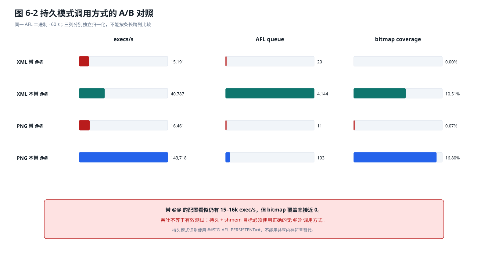

> 可缩放 SVG；[PNG 版本](diagrams/qa3/fig-6-2-persistent-mode.png)；[绘图脚本](diagrams/render_qa3_diagrams.py)。


复现：`benchmark/qa3_repro/persab.sh`，每组 60 s，**同一个 AFL 二进制，唯一差别是命令行带不带 `@@`**（持久+shmem 二进制带 `@@` 会退回文件模式）：

| 配置 | execs/s | 总执行数 | AFL 队列 | **bitmap 覆盖率** |
|---|---:|---:|---:|---:|
| xml 带 `@@`（退回文件模式） | 15,191 | 911,006 | 20 | **0.00 %** |
| **xml 不带 `@@`（持久+shmem）** | **40,787** | 2,445,979 | **4,144** | **10.51 %** |
| png 带 `@@`（退回文件模式） | 16,461 | 987,188 | 11 | **0.07 %** |
| **png 不带 `@@`（持久+shmem）** | **143,718** | 8,621,527 | **193** | **16.80 %** |

**吞吐比 xml 2.7×、png 8.7×——但这远不是重点。** 真正的问题是 **带 `@@` 时 bitmap 覆盖率是 0.00 % / 0.07 %**：模糊测试器在以 1.5 万次/秒的速度跑，却**几乎什么都没测到**，队列 60 秒只长到 20 / 11 个。这正是 `benchmark/run_benchmark.py:821-822` 那条注释描述的失效模式（*"@@ 会让目标落入文件模式/参数错乱、几乎测不到覆盖率（实测 2 边 vs 正确的 399）"*），现在有了直接证据。

> **⚠ 这次复现和提交信息里的数字对不上，而且方法学是同一套。**
> 提交 `a4b4842` 的原话是 *"Measured A/B (**identical binary, @@ vs no-@@**): png 2.1k→38.7k (18x), xml 2.0k→14.9k (7.5x)"*——**和本文用的是完全相同的做法**（同一二进制、只改带不带 `@@`），所以两组数字本来应当可比。但实测：
>
> | | 提交 `a4b4842` | 本文复现 |
> |---|---|---|
> | png 带 `@@` | 2.1 k | **16.5 k** |
> | png 不带 `@@` | 38.7 k | **143.7 k** |
> | xml 带 `@@` | 2.0 k | **15.2 k** |
> | xml 不带 `@@` | 14.9 k | **40.8 k** |
>
> 四个数全部不吻合（本机更快，且"before"侧高出 7–8 倍）。可能来自机器、AFL++ 版本或二进制重编，但原始的 18× / 7.5× 在本仓库内既无数据文件、也无法按其自述方法复现，不应继续引用。
> 真正稳健、且本文能直接复现的结论是下面这条：**带 `@@` 时 bitmap 覆盖率是 0.00 % / 0.07 %**——速度比值多少都不重要，因为那一侧根本没在测东西。

## 6.7 吞吐与 scaling（已提交数据）

### 图 6-3 吞吐 ≠ 覆盖率（xml，120 s，`benchmark_results_scaling_hybrid`）


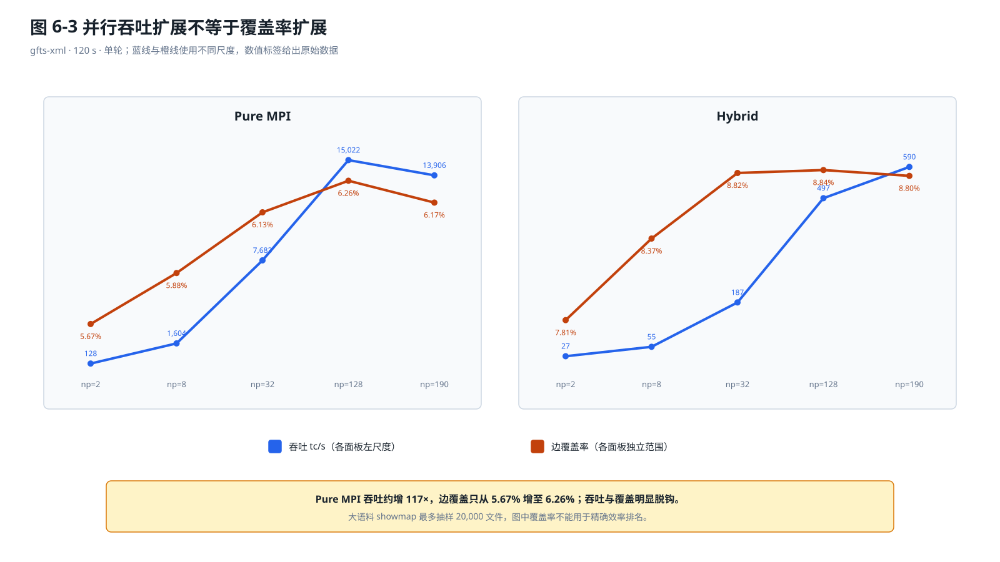

> 可缩放 SVG；[PNG 版本](diagrams/qa3/fig-6-3-scaling-vs-coverage.png)；[绘图脚本](diagrams/render_qa3_diagrams.py)。


`gfts-xml` 行来自图中同一份 `benchmark_results_scaling_hybrid`；其余两行来自
`benchmark_results_scaling`。均为 120 s、1 轮、纯 MPI 吞吐（tc/s）：

| 目标 | np=2 | np=8 | np=32 | np=128 | np=190 |
|---|---:|---:|---:|---:|---:|
| `gfts-xml_read_fuzzer` | 128.2 | 1,603.9 | 7,682.9 | **15,022.1** | 13,905.9 |
| `lava-base64_harness` | 171.6 | 1,027.3 | 4,117.2 | **12,249.2** | 13,023.5 |
| `lava-base64` | 104.5 | 652.6 | 2,222.6 | 5,523.1 | 6,471.4 |

**【一手证据】**（`docs/evidence/img_report.png`）：下面这张表的**一手来源**就是
`benchmark_results_scaling_hybrid/benchmark_report.txt` 本身——afl-only 7.55 %、
hybrid 2/8/32/128/190 = 7.81/8.37/8.82/8.84/8.80 %、mpi = 5.67/5.88/6.13/6.26/6.17 %、serial 3.09 %，
以及各行的 tc/s，均可在截图里逐格核对。

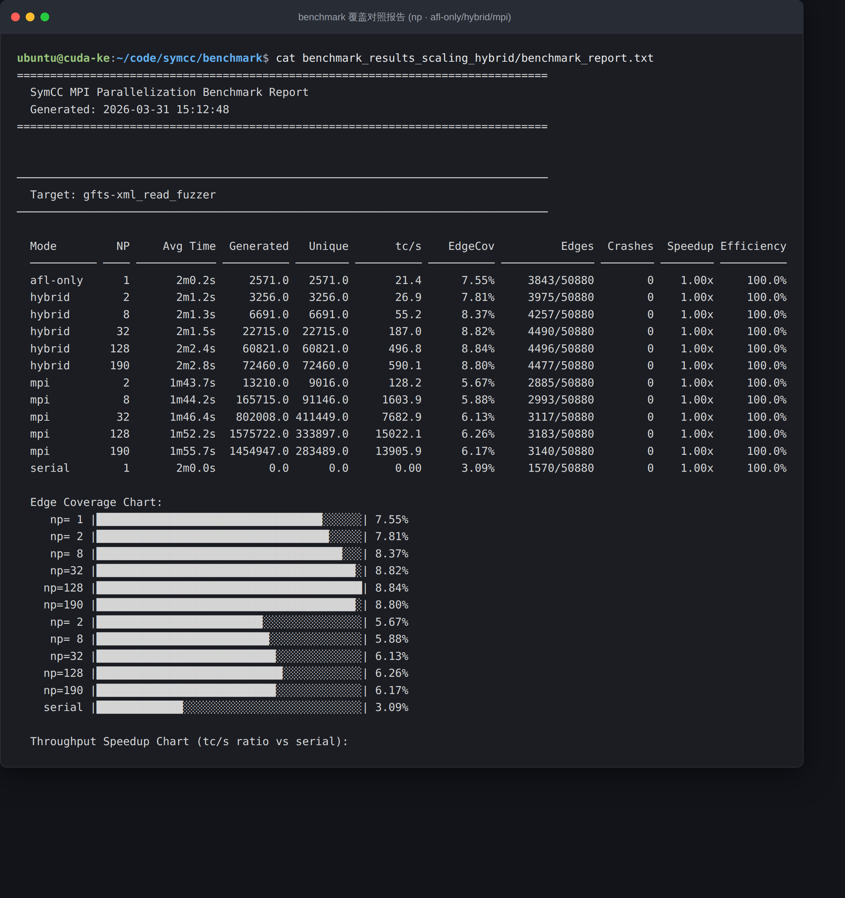

`base64_harness` 是唯一有非零串行基线、因而有真实加速比的目标：np=2 7.30×（100 %）→ np=8 43.68×（85.5 %）→ np=32 175.08×（77.4 %）→ np=128 520.88×（57.1 %）→ np=190 553.80×（41.0 %）。吞吐在 np=128~190 之间掉头。

**但覆盖率不随吞吐单调增长**：图中同一 CSV 的 xml 纯 MPI np=2→128 只从
5.67 % 到 6.26 %，hybrid 为 7.81 % 到 8.84 %。必须同时注明：
`measure_showmap_coverage(..., max_cases=20000)` 会对更大语料随机抽样
（`run_benchmark.py:752-831`）；这些行的候选数远超 20,000，而 CSV schema 没有持久化
`sampled`、`sampled_cases` 或 sample digest。故历史覆盖数字是固定上限样本估计，
不能证明完整语料并集，也不能从“generated/unique”反推 corpus efficiency。

`benchmark_results_v2`（300 s）hybrid vs afl-only：

| 目标 | afl-only execs/s | hybrid np=32 execs/s | afl-only 边 | hybrid np=32 边 |
|---|---:|---:|---:|---:|
| png | 4,928 | 4,121 | 14.10 % | **16.96 %** |
| xml | 2,880 | 2,362 | 7.60 % | **8.90 %** |
| libarchive | 2,277 | 2,138 | 15.07 % | **23.36 %** |
| sqlite | 2,694 | 2,885 | 18.55 % | 18.84 % |
| pcre2 | 4,870 | 3,931 | 41.73 % | 43.58 % |
| freetype2 | 3,496 | 3,433 | 5.75 % | 5.59 % |

> ⚠ **读这张表前必须知道**（[§1.10 实测](#q1-delivery)）：在 ≤300 s 的轮次里，concolic 产出**根本没进到 AFL 手里**（直注被忽略、兄弟目录同步要等 10 分钟）。所以 hybrid 那一列**不是"AFL 用上了 concolic 的解"的结果**，而是 `afl-showmap` 对 **AFL 队列 ∪ concolic 产出**这个并集语料的离线测量。数字本身没错（并集口径下成立），但**不能解释成反馈闭环生效**。

**hybrid 对 AFL 吞吐的影响实测在 −19 % 到 +7 % 之间**（png −16.4 %、xml −18.0 %、pcre2 −19.3 %、libarchive −6.1 %、freetype2 −1.8 %、**sqlite +7.1 %**）——多数是 CPU 争用带来的损失，但并非一律下降。两条必须一起说的限定：

1. freetype2 的 np=32 下跌是**单轮离群**（3 轮复测 np8 14.75±1.34 ≈ np32 14.48±0.72）；
2. 这些 afl-only 基线是**单实例对多核 hybrid**，不是等 CPU 对照（`docs/PPT_Material_Complete.md:432-436` 已标注）。等 CPU 下的正确参照是 [§5.4.2](#q5-equalcpu) 那组 16 核/64 核分配扫描。

> ⚠ **一条本仓库无法验证的数据**：会上补测据称"libarchive 在 32 实例 afl-only 下达到 27.71 %，与 hybrid np=32 的 26.95 % 持平（净增益 ≈ 0）"。**这些数字在本仓库工作树里搜不到**（`27.71`/`26.95` 均无命中），产物在外部。引用时必须注明出处在仓库之外、无法就地复现。

## 6.8 缺口（作为设计文档的 TODO）

- **没有 time-to-bug 数据。** `--timeseries` 已实现（`run_benchmark.py:1101-1279`）但从未在正式实验里启用，全树无 `*timeseries*` 文件。`docs/Final_Work_Report.md:284` 明确记录了这一点。µFUZZ 的 Magma 存活时间分析是这块的标杆；
- **没有 Magma / FuzzBench / UniBench 的实测**——脚本里有开关，但一次都没跑；
- **没有多节点测量**，所有 `np=190` 都是单机 190 个 rank；
- **没有 20 轮确认性实验**（`research_protocol.py` 的门槛是 20，`docs/sota_hybrid_execution_2026.md:2300-2302` 承认公开确认性 campaign 尚未运行）；
- **coverage 抽样不可追溯**：大语料只测最多 20,000 个文件，但 CSV 没保存
  `sampled`、`sampled_cases`、随机种子或 sample digest。正式结果必须持久化这些字段，
  并同时报告完整语料数；
- **crash-only/hang-only 候选链不完整**：先修复 §1.5 中“worker 丢 candidate、master 保存
  parent”的问题，再做异常/bug 计数；否则 `crashes/` 不能作为完备输入；
- **`who` 从未做过 bug 计数**。它是 LAVA-M 四个目标里**唯一还有区分度**的（【论文】里 7 个 hybrid fuzzer 都拿不满 2136，最好的 CoFuzz 1913）。本项目对 who 只有覆盖率（hybrid np=32 47.26 %），`scratch_lava_bugcount.py` 也支持它（需用 `who_countable` 而非仓库预编的 `who`，后者把 bug printf 编掉了）。**这是一个成本极低、区分度极高的可补实验**；
- **调度仍是种子级，不是边级**——论文 Finding 6 明确指出种子级调度降不下冗余边（见 [§5.4.0](#q5)）。`SYMCC_TARGET_BRANCH` 的单分支定向机制已经存在，缺的是接一个边级效用模型。

确认性 protocol 的最小交付物应为：equal CPU、同版本/同 seed、≥20 个独立随机重复、
随时间的 edge/bug 首次发现事件、Kaplan-Meier 或同等生存分析、置信区间/效应量、逐 bug
内容溯源，以及 immutable run manifest。只有终点 bug 数而没有 time-to-bug 不能回答速度。

## 6.9 【论文】对照学界的评估规范：本项目差在哪、又强在哪

`SoK: Prudent Evaluation Practices for Fuzzing`（IEEE S&P 2024）从 2018–2023 年顶会里筛出 **289 篇候选**，再**随机抽取 52 %（150 篇）做深入分析**。**下表所有比例的分母是 150**（论文 §3.1、Table 1 `total #papers analyzed 150/289`）。把本项目摆进去对照：

| 规范维度 | 学界建议（原始出处） | 150 篇抽样论文的现状 | **本项目现状** |
|---|---|---|---|
| 目标数量 | **≥ 10 个**有代表性的真实程序（Böhme et al. R1） | — | ✅ 10 个（6 真实 + LAVA-M 4） |
| 单次时长 | Klees et al. 提 **24 小时**；Böhme et al. R1：**≥12 h（最好 24 h）** | 只有一部分论文跑满 24 h | ❌ **实测多为 120 / 300 s**，最长档也远不够 |
| 重复次数 | Klees et al. 自己用 **30 次**；Böhme et al. R1：每个 fuzzer×程序组合 **≥10 次（最好 20 次）** | **55 %（83 篇）在某个实验里少于 10 次** | ❌ 归档实验多为 `rounds=1`；SymSan 那组是 3 轮 |
| 显著性检验 | SoK §5.6 **明确推荐用置换检验 / bootstrap 取代常用的 Mann-Whitney U**：*"we recommend **an alternative to the widely used Mann-Whitney-U test; permutation tests or resampling tests such as bootstrap methods**"* | **63 %（94 篇）完全不做统计检验**；37 % 做 Mann-Whitney U | ⚠️ 代码里有（bootstrap + 符号翻转），但**归档结果没用上** |
| 效应量 | Vargha–Delaney Â12 | **88 %（132 篇）完全不报效应量**；只有 10 % 做 Â12 | ⚠️ `analyze_ablation.py` 实现了 `vargha_delaney`，同样未用于归档结果 |
| 随时间的曲线 | Klees et al. 建议 plot performance over time | — | ❌ `--timeseries` 实现了但从未启用（§6.8） |
| 主/次指标 | 主指标应为**发现 bug 的能力**，覆盖率（基本块或边）作**次要指标**（Klees et al.） | — | ⚠️ 本项目基本只用边覆盖；bug 计数只有 LAVA-M 的离线脚本 |
| 注入 bug 基准 | LAVA-M **已被视为有缺陷**（SoK §3.2.2 Targets under Test） | **17 %（26 篇）**仍在用 | ⚠️ 本项目在用，但[§6.3](#q6) 已按"只验证通路、不比强弱"定位 |

**Böhme et al. R1 原文**（ICSE 2022 §7.2）：

> "**R1** If possible, select **at least 10 representative programs**. For each fuzzer-program combination, conduct at least 10 (better 20) campaigns of at least 12 (better 24) hours. Increasing these values improves generality and statistical power of the results."

按这条尺子，本项目的差距是**量级级别**的：`--timeout` 默认 60 s、归档实验 120–300 s、`rounds=1`，
对照 R1 的"每组 ≥10 次 × ≥12 小时"——**单个 fuzzer×程序组合的预算差约 3 个数量级**。

**两个诚实的观察**：

1. **本项目的统计工具链其实超过了学界中位数。** SoK 说*"we found no other tests, such as bootstrap-based ones, being used, despite being recommended by Klees et al."*——而 `benchmark/analyze_ablation.py` 恰恰实现了 `bootstrap_ci` / `paired_bootstrap_ci` / `vargha_delaney` / `holm_adjust`，`research_protocol.py` 还强制等 CPU 预算和 ≥20 次重复。**工具比 88 % 的论文都齐全。**
2. **但它们没被用在任何一份归档结果上。** 差距不在"不会做"，而在"没跑"——本文所有 **【实测】** 同样是单次短测（见文末证据等级声明）。**这是本项目当前最大的、也是最容易补的短板**：跑一次符合 `research_protocol.py` 契约的确认性 campaign，就能把大量 B 级结论升到 R 级。

---

# 附：本文新增的实测数据一览

| 测量 | 位置 | 一句话结论 |
|---|---|---|
| **发现一个此前无记录的架构问题** | [§1.10](#q1-delivery) | 两个独立实验证明：运行中的 AFL **不重扫自己的 `queue/`**（直注无效），兄弟目录同步默认要等 **10 分钟**（`-M`）⇒ **≤300 s 的 benchmark 轮次里 concolic 产出一个都没送到 AFL**；hybrid 覆盖率只能按"离线并集"解释 |
| **发现并修复一个真 bug** | [§1.4](#q1) | `_snap` 读错位图 + `tuple >= int` ⇒ 开 profiling 后每个 worker 第 2 个工作项必崩。**这就是仓库从来没有可用 `redundancy.csv` 的原因**；修后工作项 9 → 322 |
| B3 位图过滤效果 | [§1.4](#q1) | 同一种子第 2 轮起 interesting 225→0、Z3 查询归零；位图文件 131072 B |
| 端到端漏斗 | [§1.6](#q1-funnel) | 3,154 产出 → worker 位图 299（9.5 %）→ master 位图 167（5.3 %）；字节级重复占 34.8 %；反馈迭代到第 3 代 |
| 相位计时 | [§1.6](#q1-funnel) | `bmsync` 0.02 ms/项，在本轮可忽略；`scan` 是最大 master 已测相位，但 12% 记账率不足以证明端到端瓶颈 |
| 求解策略构成（6 目标） | [§3.3](#q3-ratio) | `-optimistic` 文件占保存事件 **49–84 %**，不是 campaign 覆盖占比；六条单种子 trace 无 Z3 超时；FAST/OPT-FIRST 的收益也只限该短测 |
| 乐观求解的边贡献 | [§3.4](#q3-side) | 一次性 edge-ID 重放中 xml/png 都有策略互补；脚本未计 hit-count 和端到端成本，不能证明净收益 |
| 嵌套深度 × 前沿策略 | [§3.5](#q3-nested) | `nxt[:64]` 取头 FIFO 在深度 16/32 卡在第 10 层，coverage 前沿可解；结论不外推到其他截断或 continuation 流 |
| 种子长度决定成败 | [§4.3](#q4) | 同一二进制：8 字节种子第 6 代命中；4 字节种子进不动点，因为 `if (n<8)` 根本不是符号分支 |
| 真实 SMT 约束转储 | [§4.4](#q4) | 校验和被单条 `bvadd` 一次解出；`k!50/k!60/k!70` = 输入偏移 5/6/7 |
| `focus_bytes` 效果 | [§4.5](#q4) | 范围外分支不产生查询也不产生输出（6 → 4 → 1 → 2 个产出） |
| 真实 base64 求解轨迹 | [§4.9](#q4) | 175 B 种子 773 符号分支 / 230 产出但内容只有 134 种；4096 B 种子只剩 179 分支——**值定路径、长定上界** |
| 持久模式 A/B | [§6.6](#q6) | 带 `@@` 时 bitmap 覆盖率 **0.00 % / 0.07 %**——跑得飞快但什么都没测到 |
| LAVA-M bug 重放 | [§6.5](#q6) | 不同历史运行的 endpoint 为 AFL 0/44、纯 concolic 42/44/44；非等 CPU、无首次发现时间，只支持机制假设，不支持速度排名 |

**本文已脚本化的实测随文保存**：[`benchmark/qa3_repro/`](../benchmark/qa3_repro/README.md)
（`measure_strategy.sh`、`landing.py`、`landing2.py`、`iterate.py`、`iterate2.py`、`funnel.sh`、`persab.sh`、`trace_base64.sh`）。
**⚠ 尚未脚本化**：§4.3–§4.6 的合成 magic/长度/校验和目标（文中给了完整源码与命令，但没有 driver 脚本）。

**证据等级声明**：本文所有 **【实测】** 数据均为**单次运行**，用于说明机制、量级和方向，
按 `docs/README.md:41-43` 的规则属于 **B 级**。要升级为 R 级结论，需按
`benchmark/research_protocol.py` 的契约补等 CPU、多轮（≥20）、置信区间与逐项消融。

---

# 主要外部原始资料

**论文**

1. Jiang, Yuan, Wu, L. Zhang, Y. Zhang. *Evaluating and Improving Hybrid Fuzzing* (**CoFuzz**), **ICSE 2023**．
   [作者公开 PDF](https://zhangyuqun.github.io/publications/icse2023a.pdf)｜[DOI](https://doi.org/10.1109/ICSE48619.2023.00045)｜[artifact](https://github.com/Tricker-z/CoFuzz)
   —— Q5 全节的方法学与结果、以及 Q6 的 LAVA-M 存活时间表均取自此文原文。
2. Schloegel, Bars, Schiller, et al. *SoK: Prudent Evaluation Practices for Fuzzing*, **IEEE S&P 2024**．
   [arXiv:2405.10220](https://arxiv.org/abs/2405.10220) —— §6.3 的"LAVA-M 已被视为有缺陷"与 §6.9 的评估规范对照。
3. Böhme, Szekeres, Metzman. *On the Reliability of Coverage-Based Fuzzer Benchmarking*, **ICSE 2022**, pp. 1621–1633．
   [论文 PDF](https://mboehme.github.io/paper/ICSE22.pdf)｜[DOI](https://doi.org/10.1145/3510003.3510230)
   —— §6.9 的 R1 建议（≥10 程序 × ≥10 次 × ≥12 h）取自其 §7.2 原文。
   （注：SoK 的参考文献 [23] 把它标为 ASE 2022，实为 **ICSE 2022**，本文按原始出处更正。）
4. Klees, Ruef, Cooper, Wei, Hicks. *Evaluating Fuzz Testing*, **ACM CCS 2018**．
   —— §6.9 里"24 小时运行时长""主指标应为发现 bug 的能力""统计检验"等建议的原始出处（本文经 SoK 转引，未直接读原文，引用时按此标注）。
5. Yun, Lee, Xu, Jang, Kim. *QSYM: A Practical Concolic Execution Engine Tailored for Hybrid Fuzzing*,
   **USENIX Security 2018**．[论文 PDF](https://www.usenix.org/system/files/conference/usenixsecurity18/sec18-yun.pdf)
   —— 乐观求解的原始设计理由与 §3.2 原文（§3.4），以及 Table 6 的 LAVA-M 独立数据点（§6.5）；本项目的求解后端即其 fork。
6. Chen, Zhong, Yang, Hu, Wu, Lee. *µFUZZ: Redesign of Parallel Fuzzing using Microservice Architecture*,
   **USENIX Security 2023**, pp. 1325–1342．[USENIX 页面](https://www.usenix.org/conference/usenixsecurity23/presentation/chen-yongheng)｜[代码](https://github.com/s3team/muFuzz)
   —— §6.2 的并行 fuzzing 基准对照（仓库里那份 `ufuzz.pdf` 是匿名投稿版）。
7. Chen, Jiang, Ma, et al. *EnFuzz: Ensemble Fuzzing with Seed Synchronization among Diverse Fuzzers*
   **USENIX Security 2019**, pp. 1967–1983．
   [USENIX 页面与 PDF](https://www.usenix.org/conference/usenixsecurity19/presentation/chen-yuanliang)
   （仓库内 `enfuzz.pdf` 是 [arXiv:1807.00182v2](https://arxiv.org/abs/1807.00182)）。
8. Liang, Jiang, Chen, et al. *PAFL: Extend Fuzzing Optimizations of Single Mode to Industrial Parallel Mode*,
   **ESEC/FSE 2018**, pp. 809–814．[DOI](https://doi.org/10.1145/3236024.3275525)
   （仓库内 [`pafl.pdf`](../pafl.pdf)）。
9. Wei et al. *Compiling Parallel Symbolic Execution with Continuations* (**GenSym**), **ICSE 2023**．
   [论文 PDF](https://continuation.passing.style/static/papers/icse23.pdf)｜
   [DOI](https://doi.org/10.1109/ICSE48619.2023.00116)
10. Bucur et al. *Parallel Symbolic Execution for Automated Real-World Software Testing* (**Cloud9**), **EuroSys 2011**．
   [论文 PDF](https://dslab.epfl.ch/pubs/cloud9.pdf)

11. Poeplau &amp; Francillon. *Symbolic execution with SymCC: Don't interpret, compile!*, **USENIX Security 2020**．
    —— **本项目即其 fork**；§6.1 提到的"SymCC 论文目标"（OpenJPEG / libarchive / tcpdump）出自其 §5.2。
12. She, Shah, Jana. *Effective Seed Scheduling for Fuzzing with Graph Centrality Analysis* (**K-Scheduler**), **IEEE S&P 2022**．
    —— §4.7 前沿调度的原始算法（edge horizon graph + Katz 中心性）；本项目实现的是 CFG-free 代理。
13. Godefroid, Levin, Molnar. *Automated Whitebox Fuzz Testing* (**SAGE**), **NDSS 2008**．
    —— §4.1 "一次执行 = 一条路径 + 一步邻居"的经典表述（generational search）。
14. Dolan-Gavitt, Hulin, Kirda, et al. *LAVA: Large-scale Automated Vulnerability Addition*, **IEEE S&P 2016**．
    —— LAVA-M 的原始出处；§6.4 的 `validated_bugs` 口径与"4 字节魔数难以被随机变异发现"的论断。
15. Blazytko, Bishop, Aschermann, et al. *GRIMOIRE: Synthesizing Structure while Fuzzing*, **USENIX Security 2019**．
    —— §5.4.3 唯一实质提升覆盖率的那项技术。

**工具文档 / 源码**

16. AFL++ `instrumentation/afl-compiler-rt.o.c` —— §1.4 的 PCGUARD 边 ID 分配（`__sanitizer_cov_trace_pc_guard` / `__afl_final_loc`）：
   <https://github.com/AFLplusplus/AFLplusplus/blob/stable/instrumentation/afl-compiler-rt.o.c>
17. AFL++ `docs/env_variables.md` —— §1.10 的 `AFL_SYNC_TIME` 默认值（20 分钟，`-M` 减半）：
    <https://github.com/AFLplusplus/AFLplusplus/blob/stable/docs/env_variables.md>
