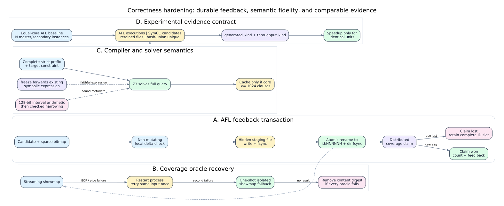

# SymCC 并行符号执行框架正确性加固报告（2026-07-31）

## 1. 范围与结论

本轮工作不是新增一个孤立优化，而是对编译器、QSYM 求解后端、并行反馈通道、
DPOR 运行时和 benchmark 证据链进行端到端一致性修复。审查列出的 10 项中，9 项
对应真实的实现或实验语义风险，均已修复；“32 位 lit 必然因 `suffixes.add()`
失败”经隔离配置实测被证伪。实测还发现并修复了真正的 lit 环境问题：干净 PATH
下找不到 CMake 已知的 LLVM `FileCheck`。

本轮最终门禁为：

- LLVM 18：`214/214` lit，203.26 秒；
- Python：`489/489` unittest，81.672 秒；
- LLVM 17：重新构建通过，本轮 7 项定向 lit 为 `7/7`；
- LLVM 18 的 `SymCC`、`SymCCRuntime`、`symcc_schedule_rt` 构建通过；
- 32 位配置：`TARGET_32BIT=ON` 的 lit 配置可加载并递归发现 231 项测试；未在本机执行
  32 位二进制测试，因为该步骤还要求独立的 32 位 LLVM/Z3/runtime 工具链；
- 项目维护 Python 文件（排除下载到 `benchmark/public/` 的历史 Python 2 源码）
  `py_compile` 通过，本轮 Python 文件 scoped ruff 通过，scoped
  `git diff --check` 通过。

这些结果证明的是实现门禁和局部机制正确性，不等价于公开 benchmark 上覆盖率或
CPU-hour 的统计显著提升。历史实验产物也不会被新指标定义事后改写。



PNG 版本：[correctness-hardening-2026-07-31.png](diagrams/correctness-hardening-2026-07-31.png)；
图源：[correctness-hardening-2026-07-31.dot](diagrams/correctness-hardening-2026-07-31.dot)。

## 2. 审查项处置矩阵

| ID | 审查结论 | 处置 | 主要实现 | 回归证据 |
|---|---|---|---|---|
| R01 | `id:*.tmp` 会被 AFL peer cursor 当作正式 ID | 修复 | `util/mpi_fuzzing_helper.py::_atomic_publish` | staging 名称审计 |
| R02 | coverage claim 早于持久化，写盘失败会吞掉新覆盖 | 修复，并补上竞争失败后的无洞协议 | `_batch_triage`、`CoverageBitmap.count_delta` | disk-full、lost-claim 测试 |
| R03 | UNSAT cache 在 1024 条处截断严格查询，可能漏掉 target | 修复 | `solver.cpp::collectConstraintRecords`、`rememberUnsatCore` | `unsat_core_long_prefix.c` |
| R04 | LLVM `freeze` 未传播符号表达式 | 修复 | `Symbolizer::visitFreezeInst` | `freeze_symbolic.ll` |
| R05 | streaming showmap 死亡后不恢复，当前输入永久跳过 | 修复 | `StreamingShowmap`、`one_shot_showmap_edges` | restart/retry/fallback 测试 |
| R06 | AFL 同步队列按文件相加，`generated/unique` 重复计数 | 修复 | hash union、`execs_done`、拆分计数与单位字段 | corpus/报告单元测试 |
| R07 | AFL-only 单实例与 hybrid 多核配置不公平 | 修复 | `run_afl_only(instances=N)` | 两实例 mock orchestration |
| R08 | DPOR 记录 libc/runtime 内部 pthread 锁，轨迹被污染 | 修复 | 主模块过滤、DSO allowlist | 原子/真实 pthread/DSO 测试 |
| R09 | `suffixes.add()` 在 32 位模式必然失败 | **审查误报**；保留 `.add()` | lit 的 setter 会把赋入 list 规范化为 set | 隔离配置发现 231 tests |
| R10 | 静态输入依赖的地址区间使用 `int64_t` 加法，存在 UB | 修复 | `Pass.cpp` 的 `__int128` 中间算术与受检缩窄 | 双 LLVM Werror 构建、static dependency lit |

此外修复两个审查后发现的二阶问题：

1. distributed claim 竞争失败后不能删除已发布 ID，否则 AFL native peer 的顺序扫描
   会永久停在缺号处；现在保留完整的全局冗余槽位并消费该 ID。
2. benchmark 文本报告虽然已经记录 `throughput_kind`，仍曾把 AFL executions/s 与
   SymCC candidates/s 放进同一 speedup 图；现在不同单位显示 `N/A`，不再计算比值。

## 3. AFL 队列发布与 coverage claim

### 3.1 修复前的失败窗口

AFL native peer 只应看到最终的 `id:NNNNNN,...` 文件。旧实现用
`id:NNNNNN,...tmp` 作为同目录临时文件；文件名前 9 个字符已经满足 peer 的 ID
扫描规则，因此 AFL 可能在写入完成前打开它。另一个顺序问题是先修改共享 virgin
bitmap、再写 queue：磁盘满或 rename 失败时，系统已经认为 coverage 被占用，但没有
任何可重放输入。

### 3.2 当前事务顺序

对每个候选执行以下顺序：

1. `CoverageBitmap.count_delta()` 只读判断本地 bitmap 是否存在新 bit，不改变状态；
2. 在目标 queue 同目录创建 `.symcc-publish-*.tmp` 隐藏 staging 文件；
3. 写完整内容、flush、`fsync(file)`；
4. `os.replace(staging, id:NNNNNN,...)` 原子发布，再 `fsync(directory)`；
5. 只有发布成功后才调用本地 merge 或 distributed coverage claim；
6. claim 获胜时更新 interesting 统计、feedback queue、hash ledger 和可选 AFL foreign
   queue；
7. claim 因并发竞争失败时，不计为新覆盖，但立即把已全局提交的 candidate bits 合入
   本地 bitmap，保留这个完整 ID 并递增 queue counter。

这里有意选择“竞争失败时保留一个完整冗余条目”，而不是删除。AFL peer cursor 要求
ID 连续；删除 `id:000123` 会使稍后扫描的 consumer 永远无法到达 `id:000124`。

### 3.3 可证明的不变量与边界

- 磁盘写入失败：不调用 coverage claim，不消耗 ID；
- AFL 可见的名称：只在完整内容已经 fsync 后出现；
- 分布式竞争失败：可能增加一个冗余 corpus entry，但不会产生 ID hole；
- claim 返回后本地 bitmap 立即收敛，不必等周期性 gossip pull，后续相同 bit 的候选
  会在只读 pre-check 被过滤；
- 进程若在 publish 后、claim 前崩溃，会留下一个完整但尚未计入本地 interesting 的
  输入。这是可重放的保守冗余，不是 coverage-without-input 数据丢失；
- 文件系统发布与多 shard claim 不是跨介质 ACID 事务。当前协议优先保证可恢复性和
  AFL cursor 单调性，不声称提供分布式线性化的 exactly-once corpus。

## 4. Coverage oracle 故障恢复

`StreamingShowmap` 现在把生命周期拆成 `_spawn()`、`restart()` 和
`_get_edges_once()`。一次查询遇到 EOF、broken pipe、损坏的 edge count 或进程死亡
时，执行以下恢复链：

1. 关闭失效进程并启动新的 streaming showmap；
2. 对**同一个输入**重试一次，而不是直接处理下一个输入；
3. 再失败则启动隔离的一次性 `afl-showmap`；
4. 所有 oracle 都失败时，从 worker 的 `seen_content` 删除该内容摘要，使后续扫描有
   机会重试。

这一区分很重要：内容去重只应缓存“已经得到可靠 coverage 判定”的输入，不能把
oracle 故障误记为输入重复。当前恢复有界为一次 stream restart 加一次 isolated
fallback，避免持续故障时形成无限重启循环。

## 5. UNSAT-core 长前缀语义

### 5.1 原问题

旧的 `collectConstraintRecords()` 在累计 1024 条 constraint 后停止收集。该 vector
既被用作 cache artifact，又被用于带 assumption 的严格 Z3 查询，因此 cache 容量
上限错误地改变了求解公式；当 target 位于被截断部分时，严格查询可能求解另一个问题。

### 5.2 当前设计

- `collectConstraintRecords()` 始终收集依赖 forest 中的全部严格约束，并最后加入
  taken/negated target；
- Z3 永远求解完整公式；
- `kMaxUnsatCoreClauses = 1024` 只限制**写入 cache 的 proof artifact**；
- 若实际 core 超过上限，`rememberUnsatCore()` 放弃缓存，但不改变本次 SAT/UNSAT
  结果，也不触发错误 subsumption。

新增回归构造 1100 条前缀约束和第 1101 条 target，要求 cache 开启时仍生成满足
target 的输入。该设计接受“超大 core 不复用”的性能损失，以换取严格查询语义不被
缓存预算修改。

## 6. LLVM `freeze` 符号传播

`Symbolizer::visitFreezeInst()` 对已经存在的 symbolic expression 执行 identity
forwarding；LLVM 原指令仍负责 concrete execution 的 freeze 语义。这样，普通定义值
经过 `freeze` 后的比较仍可被后端反推，不会静默退化为 concrete branch。

边界必须明确：SymCC 当前没有独立 poison/undef symbolic lattice，因此该修复不是对
所有 poison choice 的精确枚举。它保证的是：对已经具有正常符号表达式的 operand，
`freeze` 不应切断 taint/expression；concrete LLVM 语义也不被替换。测试同时检查
instrumented IR、无 unknown-freeze 警告，以及从零输入生成字节 `A` 的实际求解结果。

## 7. DPOR 目标模块过滤

### 7.1 策略

schedule runtime 在 constructor 中通过 `dl_iterate_phdr()` 建立可追踪模块的 PT_LOAD
地址区间。默认仅包含主 executable；pthread wrapper 用
`__builtin_return_address(0)` 判断调用点：

- 主程序发起的 create/join/mutex/rwlock/condition-variable 操作进入受控事件；
- libc、动态加载器、SymCC runtime 内部的 pthread 操作直接调用真实函数；
- `SYMCC_SCHEDULE_MODULES=/abs/liba.so:libb.so` 可按完整路径或 basename 纳入启动时已
  加载的 DSO；
- `SYMCC_SCHEDULE_ALL_MODULES=1` 恢复原来的全模块行为，主要用于诊断；
- compiler 显式插入的 read/write/atomic/branch/action 通知不经过 pthread caller
  filter，因此目标程序的内存依赖证据不会被误删。

当前 allowlist 快照在 constructor 时建立；程序后续 `dlopen()` 的模块不会自动加入，
这是显式边界。若需要 late-loaded plugin 的 pthread trace，应在后续版本增加安全的
模块加载通知或低开销区间刷新，而不是每个同步事件都执行昂贵的路径解析。

### 7.2 实测去噪结果

对同一个 `schedule_atomic_trace` 二进制进行 paired 机制测试：默认过滤模式为 101 行；
设置 `SYMCC_SCHEDULE_ALL_MODULES=1` 模拟旧行为为 1502 行。旧行为额外包含：

| pthread 内部事件 | 全模块 | 默认主模块过滤 |
|---|---:|---:|
| `lock` | 467 | 0 |
| `acquire` | 467 | 0 |
| `unlock` | 467 | 0 |
| 三类合计 | 1401 | 0 |
| trace 总行数 | 1502 | 101 |

总行数下降 93.28%，而 6 个源原子事件和 1 个 cmpxchg result 仍被测试精确断言。
`concurrency_guidance.c` 进一步证明目标程序的一次 create、lock/acquire/unlock、join
仍各自保留；`schedule_module_filter.c` 证明 DSO 默认排除、显式 allowlist 后精确纳入。

## 8. 静态输入依赖的整数边界

静态依赖分析需要把 pointer GEP offset、访问宽度、输入 region 和 overlap 映射到
`[input_lower, input_upper]`。旧代码在 `int64_t` 中直接执行：

```text
upper = lower + size - 1
input = input_offset + overlap - memory_offset
```

恶意或仅仅极端的常量 GEP/size 都可能造成有符号溢出，而 C++ signed overflow 是
undefined behavior。当前实现以 `__int128` 完成 offset 累积、inclusive upper、区间
交集和输入坐标换算；仅当最终 input bounds 落在非负 `int64_t` 范围内才缩窄并写入
依赖表。常量访问长度在调用 `getZExtValue()` 前还检查 active bits 不超过 64，避免
畸形或自定义的 i128 size 触发 LLVM assertion。超出模型范围的项 fail closed，不制造
包裹后的伪依赖。

该修改不会扩大 `kStaticDependencyLimit=128`，也不会把动态 pointer 猜测成常量。
它只保证常量区间运算在所有 `int64/uint64` 输入上有定义。

## 9. Benchmark 指标与公平性

### 9.1 计数定义

新结果必须同时保留以下字段，不能只看 `generated`：

| 字段 | 当前定义 |
|---|---|
| `afl_executions` / `afl_execs_done` | 所有 AFL 实例 `fuzzer_stats.execs_done` 之和 |
| `symcc_generated` | MPI 最终日志、`.symcc_stats` 与 save-all 保守兜底得到的 SymCC candidate 数 |
| `afl_retained_files` | 各 AFL queue 的非 staging 文件数之和，仅作诊断 |
| `afl_retained_unique` | 所有 AFL queue 的 SHA-256 内容并集 |
| `unique` | coverage 测量合并 corpus 的 SHA-256 内容并集 |
| `generated_kind` | `symcc-candidates`、`afl-executions` 或混合 work-unit 的显式类型 |
| `throughput_kind` | 对应 numerator 的每秒单位 |

隐藏文件和 `.tmp` 不进入 retained/unique 计数，也不会从仍在变化的 live queue
复制到最终测量 corpus。多 AFL 实例同步得到的同内容文件只在 hash union 中计一次；
读取过程中被 AFL 原子替换或删除的文件按瞬时队列变化处理，不使整轮 benchmark 失败。

### 9.2 禁止跨单位 speedup

`AFL executions/s`、`SymCC candidates/s` 以及二者之和不是同一个物理量。CSV 现在用
`throughput_per_sec + throughput_kind`；文本报告只在 kind 完全相同时计算 speedup，
否则显示 `N/A`。总体配置排序先比较最终 edge coverage，再比较跨模式语义一致的
retained unique 内容数，不再用异构 throughput 打破平局。

`analyze_current_evaluation.py` 的默认指标也移除了异构 `generated`，改为 edge
coverage、AFL bitmap、retained unique 和 AFL executions。旧 CSV 缺少新字段，不能
事后无损转换，因此历史结论保持原样并标记旧口径。

### 9.3 等 CPU AFL-only

对每个 `np`，AFL-only 现在启动同样数量的 AFL 实例：一个 `-M` master 和
`np-1` 个 `-S` secondary；复用 hybrid 的 schedule/profile/variant 选择和兼容的
cmplog 策略。统计聚合所有实例，timeseries 也读取全部 queue。

这实现了进程/逻辑核预算上的等额基线，但正式论文实验仍应固定 CPU affinity、频率、
NUMA、seed、campaign wall time，并进行多轮随机化/区组设计。等实例数本身不能消除
系统噪声。

## 10. lit 配置审查修订

`test/lit.cfg` 源码中把 `config.suffixes` 赋为 list，但 lit 的 `TestingConfig`
property setter 会将它规范化为 set。因此 site config 加载后 `.add(".test32")` 是正确
调用，改成 `.append()` 反而会产生真实的 `AttributeError`。隔离配置命令使用
`TARGET_32BIT=ON`、LLVM 18.1.3，`lit --show-suites` 成功递归发现 231 项测试；其中
230 项来自 `test/` 顶层已注册后缀，另 1 项是 `test/regression/cxa_vector.ll`。

实际发现的问题是：很多历史测试直接调用 `FileCheck`/`llc`，site config 只提供了
`%filecheck` substitution，没有把 `@LLVM_TOOLS_BINARY_DIR@` 放入 PATH。在干净环境下
全量套件会 exit 127。现在 site config 将 LLVM tools 目录前置到测试环境 PATH；用
`env -i ... lit freeze_symbolic.ll` 的最小环境测试通过，随后全量 214/214 通过。

## 11. 自动化证据索引

| 机制 | 测试 |
|---|---|
| publish/claim、无洞 ID、showmap restart/fallback、计数并集、等核 AFL mock | `test/test_afl_profile_orchestration.py` |
| benchmark 字段、跨单位 speedup 禁止 | `test/test_current_evaluation_analysis.py` |
| 1100+target 长前缀 | `test/unsat_core_long_prefix.c` |
| freeze expression 与真实求解 | `test/freeze_symbolic.ll` |
| 原子事件基数和 pthread 噪声为空 | `test/schedule_atomic_trace.c` |
| 主程序真实 create/lock/join 保留 | `test/concurrency_guidance.c` |
| 默认 DSO 排除与 allowlist 纳入 | `test/schedule_module_filter.c` |
| 静态输入依赖基本语义 | `test/static_dependencies.c` |
| 超宽访问长度 fail closed、无 LLVM assertion | `test/static_dependencies_wide_size.ll` |

## 12. 尚未宣称的结果

本轮没有运行新的 LAVA-M/FuzzBench 长时 campaign，因此不报告 coverage 百分比、漏洞
发现数、time-to-bug 或 CPU-hour 的提升。可以严谨汇报的新增定量结果只有测试门禁、
DPOR 机制去噪和指标语义修复。下一轮正式评估应使用修复后的新 schema 重新运行等 CPU
多轮实验；不能把旧 `generated` 数据与新 `afl_executions/symcc_generated` 数据混在
同一统计检验中。
