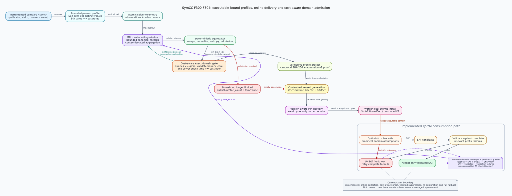

# F304：成本感知的精确经验域准入

## 1. 摘要

F303已经能识别“查询次数足够多但验证成功率低”的精确经验域，并在滚动窗口内暂时
撤销它。该策略仍把一次几十微秒的失败和一次长时间失败等价处理：前者即使累计成本
很小，也会与真正消耗求解预算的热点一起被抑制。F304把**实际Z3检查成本**加入准入
证明，仅当查询数、低验证率和累计求解时间三个条件同时成立时才抑制。

当前默认门限为8次查询、12.5%严格低验证率和`1000 us`累计Z3 `check()`时间。设置
成本下限为0可精确恢复F303策略。新协议使用
`symcc-empirical-value-profile-v3`和
`symcc-empirical-domain-admission-v2`，同时保留v1画像、v2/admission-v1工件及11项
反馈行的读取兼容。该优化仍只决定是否执行可选经验域探针；完整prefix、候选复验、
UNSAT/UNKNOWN完整公式回退和原缓存语义不变。



## 2. 为什么需要成本门

符号执行的瓶颈通常不是“查询条数”本身，而是少量长尾查询占据大量solver时间。
[KLEE](https://www.usenix.org/legacy/event/osdi08/tech/full_papers/cadar/cadar_html/paper.html)
早已指出求解成本主导执行，并通过查询简化和消除减少调用；FormaliSE 2026的
[Profile-Guided Constraint Simplification](https://2026.formalise.org/details/Formalise-2026-papers/18/Profile-Guided-Constraint-Simplification-for-Symbolic-Execution)
也直接以降低constraint-solving time为目标。F304采用相同的“用运行画像识别高成本
工作”方向，但不是该论文的复现：本项目没有实现其完整profiler/analyzer/API，也不
引用论文的性能数字作为本地结果。

只按次数抑制存在两个偏差：

1. **便宜失败被过度利用**：若8次查询总计只耗费很少时间，撤销它对总预算帮助有限，
   却会减少获得后来可验证模型的探索机会；
2. **昂贵热点无法排序**：相同查询数和成功率的域可能相差多个数量级，二值次数门看不
   到这种差异。

F304先解决第一个问题：增加最小累计成本作为必要条件。它还不是完整的收益/成本排序器，
不会根据coverage收益、输入接纳或下游重放成本给域分配连续预算。

## 3. 协议与执行次序

### 3.1 Worker侧计时

当F301经验域探针通过APInt预过滤后，QSYM执行：

1. 同步完整相关prefix并加入反向目标和经验域析取；
2. 在调用`check()`前保存进程累计`solving_time_`；
3. `check()`返回后取非负差值，并以饱和`uint64_t`累加到全局和精确域计数；
4. 按SAT、UNSAT或UNKNOWN更新F303结果计数；
5. SAT候选仍用完整prefix evaluator复验；失败与UNSAT/UNKNOWN仍执行完整公式回退。

反馈行扩展为12项：

```text
[site, bits, [domain_values...], attempts, prefilter_rejects,
 solver_queries, sat, validated, validation_failures, solver_unsat, unknown,
 solver_time_us]
```

前三个守恒式保持不变：

```text
attempts       = prefilter_rejects + solver_queries
solver_queries = sat + solver_unsat + unknown
sat            = validated + validation_failures
```

`solver_time_us`是附加成本证据，不参与计数守恒。它只覆盖经验域Z3 `check()`内部的
累计微秒数，不覆盖表达式构造、APInt预过滤、候选复验、完整公式回退、MPI传输或目标
重放。全局`empirical_domain_solver_time_us`覆盖每个实际经验域查询；精确反馈仍受每次
执行512个域上限约束，超界域因此不能生成抑制证明。

### 3.2 Master侧三条件门

对精确键
`D=(executable_sha256, site, bits, sorted_domain_values)`，滚动窗口内求和后使用：

```text
q_min = 8
tau   = 125000 ppm = 12.5%
t_min = 1000 us

suppress(D) iff queries(D) >= q_min
                and validated(D) * 1,000,000 < queries(D) * tau
                and solver_time_us(D) >= t_min
```

三个比较都是必要条件。比例使用严格小于号；恰好12.5%时保留。`tau=0`关闭抑制，
`t_min=0`只关闭成本保护并恢复F303的次数/比例门。任何规范化错误、计数溢出、身份不
匹配或证据不足都fail open，即保留经验域。

### 3.3 证明工件与恢复

v3工件在F303证明上增加：

- admission schema固定为`...admission-v2`；
- `min_solver_time_us`绑定运行策略；
- 每个`suppressed[]`项绑定精确域`solver_time_us`；
- reason固定为`costly-low-validated-query-ratio-v2`；
- 摘要、画像成员关系、三个守恒式、比例、查询数、成本和runtime domain count全部重验。

协调器恢复时要求当前artifact为v3且三个策略参数与进程配置一致。旧artifact仍可被
验证和物化，但会令状态变脏，在下次lease前从存活滚动记录重建当前策略代际。旧11项
反馈被补零成本，因此在默认`1000 us`下不会形成现代抑制证明；设置成本门为0时可用于
明确的F303兼容实验。

恢复审查还封闭了两个只影响策略证据、不影响求解正确性的边界：若阈值改变但runtime
域集合恰好不变，协调器必须绕过普通semantic no-op，发布绑定新阈值的artifact/sidecar
代际；若旧策略从未产生sidecar但checkpoint保留了记录，重启后仍必须主动重评这些
记录。否则会分别留下陈旧策略证明或错失新策略下的准入机会。

## 4. 实现映射

| 层 | 文件 | F304职责 |
| --- | --- | --- |
| QSYM | `runtime/.../pintool/solver.{h,cpp}` | `check()`差分计时、全局/精确域饱和累计、12项遥测 |
| artifact | `util/empirical_value_profile.py` | 11/12项规范化、三条件门、v3/v2证明、旧工件兼容 |
| coordinator | `util/online_value_profile.py` | 默认成本门、策略恢复检查、累计成本checkpoint |
| telemetry | `util/hybrid_feedback.py` | 全局成本和12项精确域解析，旧行补零 |
| MPI | `util/mpi_fuzzing_helper.py` | 传递`SYMCC_VALUE_PROFILE_FEEDBACK_MIN_SOLVER_US` |
| 实验 | `benchmark/run_evp_admission_smoke.py` | 同一真实反馈的成本门开/关反事实对照 |

## 5. 配置

| 配置 | 默认值 | 作用 |
| --- | ---: | --- |
| `SYMCC_VALUE_PROFILE_FEEDBACK_MIN_QUERIES` | 8 | 最小真实经验域查询数 |
| `SYMCC_VALUE_PROFILE_FEEDBACK_MIN_VALIDATED_PPM` | 125000 | 低验证率阈值；0关闭整个抑制条件 |
| `SYMCC_VALUE_PROFILE_FEEDBACK_MIN_SOLVER_US` | 1000 | 最小累计经验域Z3检查成本；0恢复F303决策 |
| `SYMCC_VALUE_PROFILE_WINDOW` | 256 | 失败和成本证据的滚动寿命 |

正式消融必须记录规范化后的完整环境。不同机器、solver版本和CPU频率会改变微秒成本，
所以`1000 us`是保守工程默认值，不是跨平台最优常数。

## 6. 测试与真实机制证据

### 6.1 自动化覆盖

- artifact测试使用同一低收益域验证：累计`8000 us`满足门并抑制，`999 us`在
  `1000 us`门下保留；即使重算摘要，伪造低于门限的proof也被拒绝；
- 在线窗口测试构造每条`400 us`反馈：两条累计`800 us`时保留，三条累计
  `1200 us`时抑制，新记录挤出旧证据后又降到`800 us`并重新准入；
- 兼容测试把合法v3/v2工件降级为F303 v2/admission-v1，验证旧工件仍可重建；
- 双LLVM真实fixture要求12项反馈、精确域成本和全局成本均为正，并继续检查守恒式；
- F304四个相关Python模块为`86/86`（0.528秒测试时间），LLVM 18/17的
  `empirical_value_profile`过滤组均为`5/5`；
- 顺序全量门禁为Python `511/511`（82.076秒，shell real 82.600秒）、LLVM 18
  `220 passed + 1 unsupported`（137.88秒，shell real 137.935秒）和LLVM 17
  `219 passed + 2 unsupported`（139.25秒，shell real 139.304秒）。

### 6.2 真实同源反事实对照

证据目录：
[`evidence/f304-cost-aware-evp-2026-08-04/`](evidence/f304-cost-aware-evp-2026-08-04/)。

同一instrumented fixture、同一`[1,2]`精确域和同两份真实telemetry得到：

| 决策 | 查询/结果 | 累计Z3检查 | 成本门 | runtime域 | suppressed |
| --- | --- | ---: | ---: | ---: | ---: |
| F303兼容门 | 2 query / 2 UNSAT / 0 validated | 142 us | 0 us | 1 | 1 |
| F304成本保护 | 同一两份反馈 | 142 us | 143 us | 2 | 0 |

主协调器随后让失败记录离开长度2窗口，域从1个恢复到2个，并真实reprobe一次。所有
canonical artifact、runtime sidecar、checkpoint、原始JSON和摘要都由
`SHA256SUMS.txt`校验。`142/143 us`只用于证明边界比较确实执行；它来自一次本机短
fixture，不代表默认1000 us门的性能效果，也不能外推到LAVA-M或公开benchmark。

## 7. 正确性、创新性与局限

F304的工程创新不是“增加一个计时器”，而是把成本归因放入现有可验证分布式事务：

1. 成本绑定到完整精确域身份，画像值集合改变后不继承旧热点；
2. 抑制必须携带可重算的查询、结果和成本充分证据；
3. 策略变化、旧工件和崩溃恢复会在分派前重新物化；
4. 滚动老化保留重新探索；所有性能判断仍位于完整求解正确性链之外。

当前局限也必须明确：

- 成本只测Z3 `check()`，不是经验探针的端到端CPU成本；
- 微秒计时存在平台噪声，尚未做跨机归一化或置信下界；
- 当前是最小成本门，不是连续cost-benefit bandit；
- 精确键不含prefix fingerprint，同一域在不同prefix下的长尾成本会被合并；
- 尚无等CPU、多轮公开target证据证明solver time、coverage AUC或缺陷发现提升。

下一步科研评估应对`t_min`做预注册消融，并与F302关闭门、F303成本门0和F304默认门
等CPU配对比较。至少报告经验/完整查询时间、P50/P95/P99、validated/query、回退数、
accepted/CPU-hour、coverage AUC和time-to-target；只有多轮置信区间、效应量及多重比较
校正支持后，才能从I/T/E-mechanism升级为R级性能结论。
