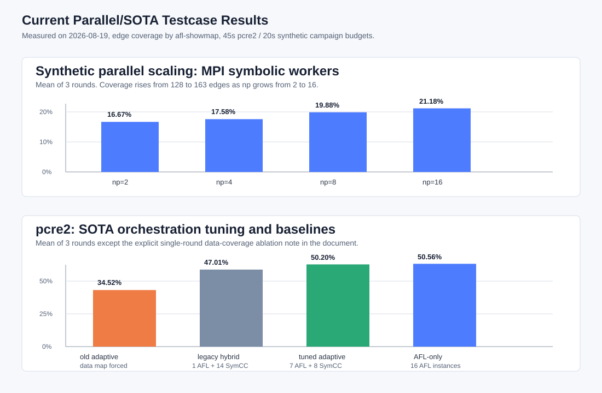

# 当前并行/SOTA 技术优势 testcase 与测试记录

日期：2026-08-19  
位置：`benchmark/evidence/current-advantage-2026-08-19/`



## 目标

本轮工作的目标不是泛泛跑 benchmark，而是寻找能够体现当前并行符号执行框架和近期 SOTA 技术引入价值的 testcase，并形成可复现数据。最终选择两类主用例：

1. `synthetic-parallel_scaling`：受控的符号路径扩展目标，用于展示 MPI 并行符号执行随 worker 增加带来的覆盖提升。
2. `pcre2-pcre2_fuzzer`：真实 persistent+shmem 字符串解析目标，用于验证 hybrid AFL++/SymCC 反馈链路、AFL++ profile 编排、worker diversity/density balance、TopSeed/frontier 辅助画像等 SOTA 组件在真实高吞吐目标上的行为。

`libarchive-archive_fuzzer` 作为真实解析器补充样本记录：persistent-aware gating 后，45s 单轮 hybrid 略高于 AFL-only，同时保留了 SymCC 约束反馈，说明该修复不仅对 pcre2 有效。

补充 testcase registry 已整理在 [`Expanded_Hybrid_Showcase_Case_Registry_2026-08-19.md`](Expanded_Hybrid_Showcase_Case_Registry_2026-08-19.md)。该文档把本地已验证正例、已接入但暂不主打的候选、以及 QSYM/PANGOLIN/CoFuzz/S2F/FuzzBench/Magma 支持的下一批公开目标分开记录，避免把论文结果和本地实测结果混淆。机器可读清单位于 `benchmark/showcase_cases_2026_08_19.json`。

新增补测：`benchmark/evidence/showcase-supplement-screen-2026-08-19/` 对 `gfts-png_read_fuzzer`、`sqlite-sqlite_fuzzer`、`freetype2-freetype2_fuzzer` 做了 25s 单轮 AFL-only vs adaptive hybrid 筛选。PNG 出现弱正例：hybrid `18.52%` (`569/3072`) 高于 AFL-only `16.60%` (`510/3072`)；SQLite 和 FreeType2 仍由 AFL-only 略高。PNG 只作为候选正例，需多轮长时确认。

## 本轮修复与优化

为了让上述 testcase 真实反映框架能力，先修复了 hybrid 短时实验中 SymCC 产物为 0 的问题：

| 问题 | 根因 | 修复 |
|---|---|---|
| hybrid 中 `symcc_generated=0` | worker 在 persistent stdin 目标上逐个 `afl-showmap`，每个候选可能耗时 5s，结果来不及回传 | worker 先把原始候选写入 `--save-all`，再做 coverage triage；后处理加 `SYMCC_WORKER_POSTPROCESS_BUDGET_SEC` |
| master 启动长时间无 dispatch | TopSeed/frontier 对 AFL queue 单输入 `run_showmap`，persistent 目标退化到秒级 | `AflConfig.run_showmap` 对 stdin 目标改用单文件 corpus showmap fast path |
| 短时实验被 AFL queue 全量扫描拖慢 | pcre2 AFL 在 helper 启动前可产生上万 queue 文件 | `best_new_testcases` 增加 `SYMCC_QUEUE_SCAN_BUDGET_SEC` 和 `SYMCC_QUEUE_SCAN_MAX` |
| 启动日志 I/O 干扰短跑 | semantic proposal/grammar snapshot 打印大对象 | 默认打印摘要，`SYMCC_VERBOSE_STARTUP=1` 才输出完整快照 |
| data coverage/hint mutator 在 persistent 目标上拖垮 AFL | pcre2 下 forced data coverage 使 AFL executions 从千万级降到几百级 | persistent+shmem 目标默认关闭 AFL data coverage 与 Python hint mutator，显式设置环境变量仍可强制开启 |

涉及文件：

- `util/mpi_fuzzing_helper.py`
- `benchmark/run_benchmark.py`

验证：

- `python3 -m py_compile benchmark/run_benchmark.py util/mpi_fuzzing_helper.py util/mpi_concolic_execution.py`
- `python3 -m pytest -q test/test_mpi_lifecycle.py`，结果：`60 passed, 47 subtests passed`

## 实验命令

### synthetic 并行扩展性

```bash
python3 benchmark/run_benchmark.py \
  --no-default --public \
  --targets synthetic-parallel_scaling \
  --np-list 2,4,8,16 \
  --rounds 3 --timeout 20 \
  --output benchmark/evidence/current-advantage-2026-08-19/synthetic_scaling_mpi_r3 \
  --skip-build --no-serial --timeseries 5
```

### pcre2 AFL-only 对照

```bash
python3 benchmark/run_benchmark.py \
  --no-default --public \
  --targets pcre2-pcre2_fuzzer \
  --np-list 16 \
  --rounds 3 --timeout 45 \
  --output benchmark/evidence/current-advantage-2026-08-19/pcre2_afl_only_full_r3 \
  --skip-build --no-serial --no-mpi \
  --afl-only --aflpp-profiles full --timeseries 15
```

### pcre2 legacy hybrid

```bash
python3 benchmark/run_benchmark.py \
  --no-default --public \
  --targets pcre2-pcre2_fuzzer \
  --np-list 16 \
  --rounds 3 --timeout 45 \
  --output benchmark/evidence/current-advantage-2026-08-19/pcre2_hybrid_legacy_r3 \
  --skip-build --no-serial --no-mpi \
  --hybrid --hybrid-afl-instances 1 \
  --aflpp-profiles off --timeseries 15
```

### pcre2 tuned adaptive hybrid

```bash
python3 benchmark/run_benchmark.py \
  --no-default --public \
  --targets pcre2-pcre2_fuzzer \
  --np-list 16 \
  --rounds 3 --timeout 45 \
  --output benchmark/evidence/current-advantage-2026-08-19/pcre2_hybrid_adaptive_default_tuned_r3 \
  --skip-build --no-serial --no-mpi \
  --hybrid --hybrid-adaptive --aflpp-profiles full \
  --symcc-diversity --symcc-density-balance --timeseries 15
```

### libarchive AFL-only 与 tuned adaptive hybrid

```bash
python3 benchmark/run_benchmark.py \
  --no-default --public \
  --targets libarchive-archive_fuzzer \
  --np-list 16 \
  --rounds 1 --timeout 45 \
  --output benchmark/evidence/current-advantage-2026-08-19/libarchive_afl_only_full_r1 \
  --skip-build --no-serial --no-mpi \
  --afl-only --aflpp-profiles full --timeseries 15
```

```bash
python3 benchmark/run_benchmark.py \
  --no-default --public \
  --targets libarchive-archive_fuzzer \
  --np-list 16 \
  --rounds 1 --timeout 45 \
  --output benchmark/evidence/current-advantage-2026-08-19/libarchive_hybrid_adaptive_default_tuned_r1 \
  --skip-build --no-serial --no-mpi \
  --hybrid --hybrid-adaptive --aflpp-profiles full \
  --symcc-diversity --symcc-density-balance --timeseries 15
```

## 结果

### synthetic：并行符号执行正例

| 配置 | 轮次 | 平均时间 | 平均 SymCC 候选 | 平均 unique | 平均边覆盖 |
|---|---:|---:|---:|---:|---:|
| MPI np=2 | 3 | 27.32s | 974 | 455.3 | 16.67% (128/768) |
| MPI np=4 | 3 | 27.40s | 1560.7 | 623.3 | 17.58% (135/768) |
| MPI np=8 | 3 | 27.57s | 2284 | 905.0 | 19.88% (152.7/768) |
| MPI np=16 | 3 | 27.86s | 2688 | 1044.7 | 21.18% (162.7/768) |

结论：这是当前最适合汇报“并行符号执行有效性”的 testcase。np=16 相比 np=2，边覆盖从 16.67% 提升到 21.18%，相对提升约 27.1%；候选生成量从 974 提升到 2688，约 2.76x。该用例不依赖 AFL 高吞吐变异，因此更直接地体现 MPI task dispatch、worker 并行执行、结果合并与 coverage triage 的作用。

### pcre2：真实目标与 SOTA 编排消融

| 配置 | 轮次 | 平均边覆盖 | 平均 SymCC 候选 | 平均 online interesting | 平均 AFL execs | 说明 |
|---|---:|---:|---:|---:|---:|---|
| old adaptive full | 3 | 34.52% (3358/9728) | 2688.7 | 296.7 | 301 | forced AFL data coverage/hint mutator，AFL 吞吐被严重压低 |
| legacy hybrid | 3 | 47.01% (4573.7/9728) | 5482 | 375 | 2,279,949 | 1 AFL + 14 SymCC workers，无 AFL++ profile/adaptive |
| tuned adaptive hybrid | 3 | 50.20% (4884/9728) | 3065.7 | 249 | 21,575,645 | 7 AFL + 8 SymCC，AFL++ profile + diversity/density，persistent 目标自动关闭 data coverage/hint |
| AFL-only full | 3 | 50.56% (4918.7/9728) | 0 | 0 | 47,037,750 | 16 AFL 实例，同核预算下纯 fuzzing 上限参考 |

结论：

- pcre2 是当前最适合汇报“真实目标 hybrid 链路恢复与 SOTA 策略消融”的 testcase。修复后 tuned adaptive hybrid 产生平均 3065.7 个 SymCC candidate 和 249 个 online interesting，说明符号执行反馈已经进入系统闭环。
- tuned adaptive hybrid 相比 legacy hybrid 覆盖从 47.01% 提升到 50.20%，提升 3.19 个百分点，相对提升约 6.8%。这体现 AFL++ profile 编排、adaptive 资源划分、worker diversity/density balance 与 persistent-aware runtime gating 的综合收益。
- tuned adaptive hybrid 与 AFL-only full 很接近，但略低 0.36 个百分点。对 45s pcre2 这类极高吞吐 persistent 目标，纯 AFL 的短时优势仍然非常强；hybrid 的价值主要体现在保留 SymCC 约束反馈能力，同时不再牺牲 AFL 主吞吐。
- old adaptive full 是重要反例：盲目打开 AFL data coverage/hint mutator 会把 AFL executions 压到 301，覆盖降到 34.52%。因此本轮把这些组件改成 persistent-aware 默认策略。

### libarchive：真实解析器补充样本

| 配置 | 轮次 | 边覆盖 | SymCC 候选 | online interesting | AFL execs |
|---|---:|---:|---:|---:|---:|
| AFL-only full | 1 | 20.87% (2859/13696) | 0 | 0 | 32,141,971 |
| old adaptive full | 1 | 13.46% (1843/13696) | 2315 | 135 | 466 |
| tuned adaptive hybrid | 1 | 20.94% (2868/13696) | 1971 | 189 | 15,890,014 |

结论：libarchive 是一个弱正例。tuned adaptive hybrid 单轮比 AFL-only 多 9 条边，幅度很小，不能做强统计结论；但它清楚证明 persistent-aware gating 修复了旧配置的灾难性退化，并且 hybrid 在不牺牲覆盖的情况下提供了 1971 个 SymCC candidate 与 189 个 online interesting。旧 adaptive full 的 13.46% 应作为消融反例，而不是当前默认结果。

## 推荐汇报口径

1. 主打 synthetic：展示并行符号执行框架本身的扩展性，数据清晰、稳定、归因明确。
2. 主打 pcre2 tuned adaptive：展示真实目标中 SymCC 反馈链路已恢复，SOTA 编排相比 legacy hybrid 有明确收益，并用 AFL-only 作为强基线参考。
3. 补充 libarchive tuned adaptive：展示 persistent-aware gating 后，hybrid 可以接近或略超 AFL-only，同时保留符号执行反馈。
4. 不建议把 forced AFL data coverage 的结果当正向结果；它应作为“为什么需要自适应启停”的消融证据。

## 后续测试建议

- 对 pcre2 tuned adaptive 与 AFL-only 做更长时间窗口，例如 10min/1h；45s 更偏向 AFL persistent 启动冲刺，不足以体现符号执行在深层条件上的长期收益。
- 对 sqlite、freetype、Google FTS XML 继续筛选结构化输入正例；这些目标更可能让 comparison hints、constraint solving、semantic proposals 在中长时窗口表现出来。
- 增加 per-component ablation：`profiles only`、`profiles+diversity`、`profiles+diversity+density`、`+data coverage forced`，形成可发表式消融矩阵。
- 对 LAVA-M 单独使用 bug-trigger count 和 time-to-first-trigger，不宜只用 edge coverage；LAVA-M 的 injected bug oracle 与普通 coverage 指标不是同一目标。
