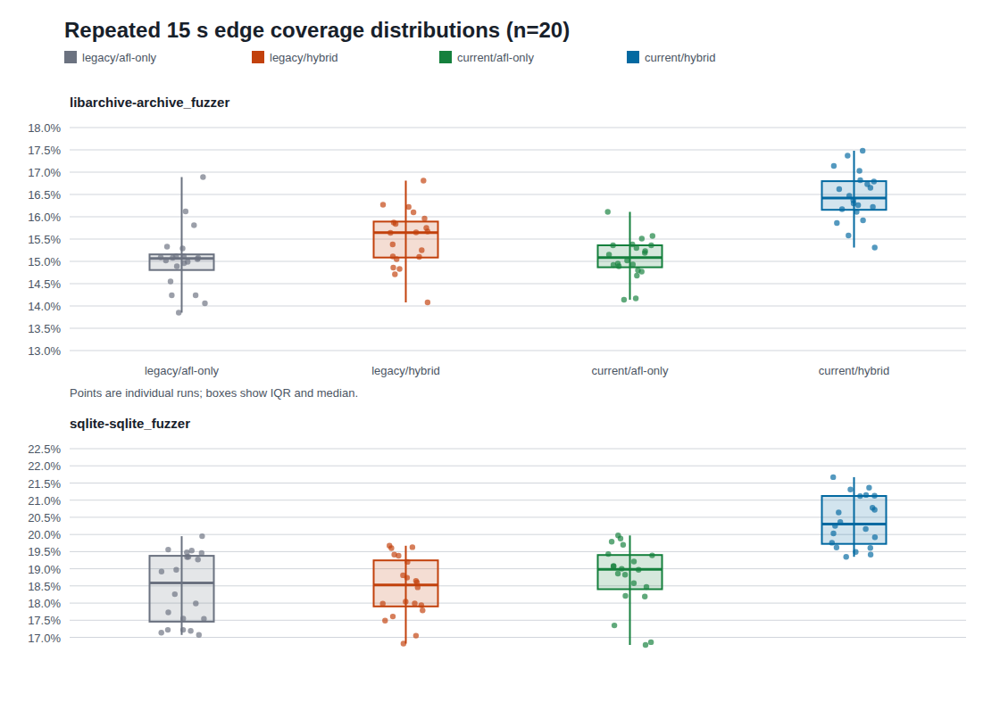

# 当前实现评估与历史对照（2026-07-30）

> 状态：20 轮工程复测、300 s 描述性复测、LAVA-M base64 专项消融和定向回归均已完成。
>
> 本文区分三类证据：当前同二进制配置消融、历史单轮结果、功能/回归测试。
> 三类数据不能混合解释。尤其不能用短时离线语料并集覆盖率宣称 AFL 已在线消费
> SymCC 产出，也不能用两个公开目标代表全部新技术的独立贡献。

## 1. 可用于汇报的结论

### 1.1 LAVA-M base64：当前求解技术相对 strict-first baseline 的实测效果

本轮新增 LAVA-M 专项测试，目标是回答“新实现是否真的被执行、如何改变求解工作量”。
实验使用当前 LLVM17 构建的 LAVA-M `base64` 符号执行二进制，对
`benchmark/public/seeds/lava-m/base64` 的 13 个 public seeds 分别运行三个 profile：

| profile | 含义 |
|---|---|
| `strict-first-z3`（原始目录名 `strict-z3`） | 关闭 fast solve、optimistic-first、backsolver、multi-solve、poly cache、UNSAT core cache、data coverage；strict UNSAT/unknown 后仍保留上游 optimistic fallback |
| `fast-optimistic` | 打开 fast solve、optimistic-first、backsolver、selective query，用于观察轻量策略贡献 |
| `runtime-full` | 打开 fast solve、optimistic-first、backsolver、multi-solve=2、polyhedral cache/cross-prefix、prefix context、UNSAT core cache、selective query、data coverage |

13 seeds x 3 profiles 共 39 个 case，均无 timeout。直接 DSE 生成语料后，用
`benchmark/public/bin/lava-m-cov/base64` 回放计数 LAVA listed bug。结果如下：

| profile | cases | 候选均值 | unique 均值 | listed bug 均值 | listed 并集 | Z3 full solve 总数 | 平均耗时 |
|---|---:|---:|---:|---:|---:|---:|---:|
| `strict-first-z3` | 13 | 159.31 | 84.31 | 21.62/44 | 41/44 | 2742 | 0.34 s |
| `fast-optimistic` | 13 | 203.31 | 86.85 | 21.62/44 | 41/44 | 2552 | 0.43 s |
| `runtime-full` | 13 | 212.92 | 104.15 | 21.62/44 | 41/44 | 1189 | 18.25 s |

相对 `strict-first-z3`，`runtime-full` 的可汇报工作量变化是：

- 候选输入均值 `+33.7%`；
- unique 候选均值 `+23.5%`；
- Z3 full-context 求解次数 `-56.6%`；
- solver queries 从 `4303` 增至 `12500`（`+190.5%`），累计 solver time 从
  `1.019 s` 增至 `1.862 s`（`+82.6%`）；
- 平均 wall time 从 `0.34 s` 增至 `18.25 s`（`×53.3`），candidate/s 从约
  `465.4` 降至 `11.7`（`-97.5%`），unique/s 从约 `246.3` 降至 `5.7`
  （`-97.7%`）；
- LAVA listed bug 数 **没有提升**：三个 profile 的 listed bug 均值和并集完全相同。

`runtime-full` 的 telemetry 用来区分“机制产生工作量”和“缓存真正命中”：

| 计数 | runtime-full 总量 |
|---|---:|
| `fast_solves` | 189 |
| `backsolver_attempts / backsolver_sat` | 678 / 672 |
| `poly_cache_entries` | 2510 |
| `poly_cache_hits` | **0** |
| `poly_samples` | 316 |
| `poly_john_steps` | 5238 |
| `poly_cross_prefix_probes / hits` | 5169 / **0** |
| `prefix_context_entries / hits` | **0 / 0** |
| `unsat_core_hits / entries` | 1333 / 941 |
| `solver_queries` | 12500 |

解释边界：

- 这些结果说明当前技术组合增加了每 seed 的候选总数，并减少完整路径 Z3 调用次数；
  但总 query、solver time 和墙钟均上升，不能写成“降低求解成本”或“降低 Z3 总负担”；
- 这些结果不支持“LAVA-M base64 bug 数提升”的结论。base64 的 listed bug 触发主要受 seed 和目标内置触发条件控制，当前候选增加没有转化为更多 listed bug；
- poly cache 建立了条目且采样器、cross-prefix probe 均运行，但 poly cache、
  cross-prefix 和 prefix context 的命中数均为 0；本轮不能把完整 Z3 调用下降归因于
  Pangolin 式 context reuse，只能归因于整个 `runtime-full` 组合；
- 回放发现额外 ID `274`，不属于 `base64` 的 listed bug 集，汇报时必须单列为 extra，不能计入 41/44；
- `md5sum`、`uniq`、`who` 的 public seed sanity 已跑：`md5sum/uniq` 当前 harness 没有产生候选，`who` 每个 profile 只产生 2 个候选且 0 listed hit。它们不能作为本轮 solver 技术增益的有效统计样本，需要后续单独修 harness/seed 才能纳入确认性评估。

证据文件：

- `docs/codex/evidence/lava_m_current_2026_07_30/base64_summary.json`
- `docs/codex/evidence/lava_m_current_2026_07_30/base64_summary.csv`
- `docs/codex/evidence/lava_m_current_2026_07_30/base64_manifest.json`
- `docs/codex/evidence/lava_m_current_2026_07_30/md5sum_summary.json`
- `docs/codex/evidence/lava_m_current_2026_07_30/uniq_summary.json`
- `docs/codex/evidence/lava_m_current_2026_07_30/who_summary.json`

本轮还修复了一个 LAVA-M 测试暴露的 runtime bug：
开启 `SYMCC_POLY_CACHE` 时，`normalizeLinearConstraint()` 会把 `LAnd/LOr` 这类逻辑谓词误判为可线性归一化的二元比较，随后调用 `negateKind(LOr)` 触发 qsym `UNREACHABLE()`。
修复后 poly/range 快路径只接受 `Equal/Distinct/{U,S}{lt,le,gt,ge}`，逻辑谓词继续走正常 Z3 路径。
新增回归 `test/poly_cache_logical_predicate.c` 已通过 lit，覆盖 `SYMCC_POLY_CACHE` 打开时的 `LOr` 分支。

### 1.2 SQLite/libarchive：并行配置相对 legacy 的 20 轮独立样本结果

在同一台机器、同一份当前 SymCC 目标二进制、相同种子和 15 s 配置预算下，
将旧编排 `1 AFL + 6 SymCC workers` 替换为当前默认的
`4 AFL + 3 SymCC workers + AFL++ basic profiles` 后，20 轮结果如下：

| 目标 | legacy Hybrid 均值 | current Hybrid 均值 | 独立样本均值差（95% CI） | A12 | Holm p |
|---|---:|---:|---:|---:|---:|
| libarchive 3.3.2 | 15.508% | 16.460% | **+0.953pp** `[+0.582,+1.321]` | 0.871 | 0.00168 |
| SQLite 3.13.0 | 18.443% | 20.392% | **+1.949pp** `[+1.466,+2.441]` | 0.961 | 0.00032 |

这里的主指标是 `afl-showmap` 对
`seed ∪ 所有 AFL queues ∪ SymCC outputs` 的最终离线并集覆盖率。结果支持：

1. 当前资源配比与 profile 编排在这两个短时公开目标上，比 legacy 编排产生了更高的
   **最终离线候选并集覆盖率**；
2. 效应在 20 轮样本中方向稳定，不是由某一次幸运运行造成；
3. 提升不能全部归因于某个求解器技术。当前配置同时改变 AFL 实例数、SymCC worker 数和
   AFL profile，属于系统级组合消融。



图中每个点是一轮独立进程运行，箱体为四分位距，中线为中位数。
[可缩放 SVG](evidence/current-eval-2026-07-30/edge_coverage_distributions.svg)

## 2. 实验问题与边界

本轮回答三个问题：

- **RQ1：当前代码能否构建并运行真实公开目标？**
  使用 SQLite amalgamation 和静态链接的 libarchive 构建当前符号执行目标。
- **RQ2：当前默认并行编排是否优于此前的 legacy 编排？**
  使用同一当前二进制做 20 轮配置消融，隔离“编排改变”而不是“源码年代改变”。
- **RQ3：当前结果与仓库历史 300 s 数据是什么关系？**
  复跑同样 300 s 壁钟预算，给出描述性对照；由于历史结果是单轮、旧工作树且没有
  sealed provenance，只能比较量级，不能做因果统计。

本轮没有回答：

- 297 个功能条目各自的独立增益；
- 24 h campaign 的漏洞数、首次触发时间或生存曲线；
- Magma、FuzzBench、UniBench 全套目标上的跨项目泛化；
- 在线反馈闭环相对离线候选并集的净收益；
- 具有随机区组、完全相等 CPU-second 的论文级确认性结论。

## 3. 环境与不可变输入

| 项目 | 值 |
|---|---|
| CPU | AMD Ryzen Threadripper PRO 9995WX，96 核 / 192 线程，单 socket、单 NUMA |
| 内存 | 250 GiB |
| LLVM / Clang | Ubuntu LLVM 18.1.3 |
| AFL++ | 4.40c |
| Open MPI | 4.1.6 |
| 系统 libz3 | 4.8.12 |
| Git HEAD | `146e01b2d6f8e02fd2526764d46ea0d80a4bb6f6` |
| `build/symcc` | `f196e5920bd96689db4a7224dbc1c92b4f1c1f99701726e39c0d6aab9a460e97` |
| `build/libsymcc.so` | `c74d4252c41e355a05ae498b75c03f8a4be3b432ec468073fb93afe8f71d1cd0` |
| SQLite SymCC 目标 | `0b0c2d16d0ddd10d9e4555ad6a650f91bacad7b9b6579fb3c665468bee8a677a` |
| libarchive SymCC 目标 | `23f8b523e28f8342f766bb133b28f794160447ee598bcbb29f32c30a6959cc7b` |
| SQLite seeds | 25 个；有序文件哈希清单的 SHA-256 为 `d1992dbd93845a47428c85334db20eda8ae839a9368f6d1adac7148ea2617628` |
| libarchive seeds | 13 个；有序文件哈希清单的 SHA-256 为 `f9d24241d09446336878b83cd36d6b64a48787fa8d4c78552ba35eb3146954a1` |

工作树包含此前尚未提交的研发改动，因此 Git HEAD 不能单独标识本轮源码。报告同时记录
实际插件、驱动、目标二进制和结果 CSV 的内容哈希；这是工程可追溯性，不等价于
`research_protocol.py` 对完整工作树、命令和调度的封存。

目标版本：

- SQLite `3.13.0`，source id
  `2016-05-18 10:57:30 fc49f556e48970561d7ab6a2f24fdd7d9eb81ff2`；
- libarchive `3.3.2`。

## 4. 配置与执行流程

### 4.1 20 轮短测

| 组 | Hybrid 总核数 | AFL 实例 | MPI ranks | SymCC workers | AFL profiles | 重复 |
|---|---:|---:|---:|---:|---|---:|
| legacy | 8 | 1 | 7 | 6 | off | 20 |
| current | 8 | 4 | 4 | 3 | basic | 20 |
| AFL-only sanity | 1 | 1 | 0 | 0 | off | 每组 20 |

每轮配置预算为 15 s。Hybrid 的实际壁钟均值约为 legacy 16.1 s、current 16.5 s，
差异来自初始化与清理；因此这是“相同配置时限和名义 8 核”的工程消融，不应写成严格相等
CPU-second。运行顺序为先 Hybrid 后 AFL-only，且 CSV 的 `phase=engineering`、
`random_seed=0`。早期分析曾按 repeat index 做后验对齐，但这些 index 没有实验设计上的
配对含义，因此当前主分析把各轮视为独立样本；旧 paired 结果只保留为审计历史，不参与结论。

执行次序：

1. 用 AFL 插桩目标对初始种子运行 `afl-showmap`，得到 seed coverage；
2. 启动 AFL master/secondary 实例；
3. 启动 MPI master 与 SymCC workers，MPI master 扫描 AFL queue、去重、分派并用共享
   coverage bitmap 筛选 SymCC 结果；
4. 到达预算后停止所有进程；
5. 合并种子、各 AFL queue、SymCC interesting queue 和 `--save-all` 产出；
6. 用同一个 AFL 插桩目标离线重放合并语料，记录 `ShowmapCov`；
7. 同时读取 AFL `fuzzer_stats`，记录在线 AFL bitmap 的 `FstatsCov` 与执行数。

### 4.2 三个指标不是同一张 bitmap

| 指标 | 来源 | 本轮含义 |
|---|---|---|
| `ShowmapCov` / `edge_cov_pct` | campaign 结束后 `afl-showmap` 重放合并语料 | 含 `--save-all` 的离线候选并集覆盖；主指标，不等同于在线 accepted corpus |
| `FstatsCov` / `afl_bitmap_cvg` | 运行中 AFL `fuzzer_stats` | AFL 实例在线已接受的 bitmap；多实例时取最大值，不是 union |
| worker shared bitmap | MPI master/worker 的 showmap edge 集合 | 判定 SymCC 输出是否增加共享边、去除重复；不直接等于上述百分比 |

当前 15 s 轮次内，AFL 默认跨实例同步周期远大于 campaign。向 AFL 自己的 queue 目录直接
写文件也不会使运行中的 AFL 重扫。因此 `ShowmapCov - FstatsCov` 的一部分代表
“SymCC 结果在离线重放时有额外边”，不能解释为“AFL 已利用这些输入继续变异”。

## 5. 20 轮结果

### 5.1 离线候选并集边覆盖率

| 配置 | libarchive mean / median `[median CI]` | SQLite mean / median `[median CI]` |
|---|---:|---:|
| legacy Hybrid | 15.508 / 15.645 `[15.105,15.855]` | 18.443 / 18.530 `[17.960,19.005]` |
| current Hybrid | **16.460 / 16.420** `[16.195,16.760]` | **20.392 / 20.305** `[19.840,20.950]` |
| legacy AFL-only（1 核） | 15.038 / 15.065 | 18.437 / 18.590 |
| current AFL-only（1 核） | 15.072 / 15.085 | 18.781 / 18.985 |

两批 AFL-only 的差异没有超过噪声：libarchive 独立样本均值差 `+0.034pp`，
SQLite `+0.344pp`，两者 Holm p 均为 1。这给出一个有用的负对照：current/legacy
Hybrid 的提升不是由两批运行期间机器整体状态单向变好即可解释。

### 5.2 AFL 在线 bitmap

| 目标 | legacy Hybrid 均值 | current Hybrid 均值 | 独立样本均值差（95% CI） | Holm p |
|---|---:|---:|---:|---:|
| libarchive | 15.128% | 15.355% | `+0.227pp` `[+0.002,+0.463]` | 1.000 |
| SQLite | 18.524% | 19.379% | `+0.855pp` `[+0.370,+1.362]` | 0.0401 |

两个方向为正；在将 32 个主/次指标比较一起做 Holm 校正后，SQLite 达到 0.05，
libarchive 未达到。即便如此，该指标是多 AFL 实例中 `fuzzer_stats` 的最大值而不是 union，
且不能证明 AFL 在线消费了 SymCC 输入；它不能被解释为已经建立短时在线闭环。

### 5.3 执行量与语料量

| 目标 | 指标 | legacy Hybrid 均值 | current Hybrid 均值 | 变化 |
|---|---|---:|---:|---:|
| libarchive | AFL execs | 1,087,865 | 4,303,479 | +295.6% |
| SQLite | AFL execs | 661,320 | 3,451,602 | +421.9% |
| libarchive | 合并语料条目 | 1,619 | 4,980 | +207.6% |
| SQLite | 合并语料条目 | 1,452 | 5,124 | +252.8% |

执行量增加主要是把 AFL 从 1 个实例扩为 4 个实例的直接结果，不应包装成单实例吞吐提升。
它验证的是当前资源分配策略：短预算下，将更多核给高吞吐 AFL、保留 3 个 SymCC worker，
在两个目标上形成了更好的联合覆盖包络。

所有 160 个 Hybrid/AFL-only 测量单元状态均为 success，目标崩溃数均为 0。
这只能说明本轮 campaign 没有发现崩溃，不能推出程序无漏洞或系统没有找 bug 的能力。

## 6. 300 s 描述性复测与历史结果

当前 300 s 结果：

| 目标 | 配置 | ShowmapCov | FstatsCov | AFL execs | SymCC generated / interesting |
|---|---|---:|---:|---:|---:|
| SQLite | current Hybrid | **28.04%**（8,848/31,552） | 26.16% | 63,604,671 | 102 / 不可恢复* |
| SQLite | current AFL-only | 27.46%（8,663/31,552） | **27.59%** | 14,929,395 | 0 / 0 |
| libarchive | current Hybrid | **24.31%**（3,330/13,696） | **23.69%** | 81,561,081 | 169 / 不可恢复* |
| libarchive | current AFL-only | 20.85%（2,856/13,696） | 20.87% | 21,731,887 | 0 / 0 |

SQLite 的 Hybrid 离线并集比单实例 AFL-only 高 `0.58pp`，但其“单个 AFL 实例中的最大
FstatsCov”低 `1.43pp`。这不是矛盾：Hybrid 的 Showmap 会联合重放 4 个 AFL queue 和
SymCC outputs，而 Fstats 只取各 AFL 实例 bitmap 百分比的最大值；5 min 内这些实例没有
完成默认周期的充分同步。libarchive 的离线并集和最大在线 bitmap 分别高 `3.46pp` 和
`2.82pp`。由于 Hybrid 使用 8 核而 AFL-only 使用 1 核，这些差值是系统运行画像，不是
equal-CPU Hybrid 因果效应。

\* 本轮之后的审计发现，旧采集代码用 `re.search` 取 MPI 日志第一次出现的
`N interesting`，所以原始 CSV 中 SQLite 的 47、libarchive 的 50 是早期进度快照，
不是最终累计值。临时 campaign 目录已按设计删除，最终值无法可靠恢复，故本文不把两数
伪装成最终结果。代码现优先解析 `Final stats`，再以 `.symcc_stats` 和 accepted queue
文件数兜底；回归测试覆盖多条进度日志后取最终值。

仓库历史单轮 300 s 数据：

| 数据集 | libarchive Hybrid / AFL Fstats | SQLite Hybrid / AFL Fstats |
|---|---:|---:|
| **current 2026-07-30** | **23.69% / 20.87%（+2.82pp）** | 26.16% / **27.59%（-1.43pp）** |
| baseline | 17.94% / 16.56%（+1.38pp） | 28.83% / 27.35%（+1.48pp） |
| enhanced | 21.75% / 17.19%（+4.56pp） | 28.29% / 28.82%（-0.53pp） |
| fastsol | 18.43% / 16.98%（+1.45pp） | 29.58% / 28.62%（+0.96pp） |

历史表只能描述旧 campaign 的单次观测：

- 每格只有 1 轮，无置信区间；
- Hybrid 是 `1 AFL + 6 SymCC workers`，与当前 `4 + 3` 配比不同；
- `baseline/enhanced/fastsol` 还改变了求解环境变量和 timeout；
- 旧结果没有完整工作树摘要和 sealed schedule；
- ≤300 s 时 AFL 没有完成默认的 SymCC sibling 同步，Hybrid 的 Showmap 指标同样主要是
  结束后的离线语料并集。

若只看当前与历史 Hybrid 的单轮量级，当前 ShowmapCov 相对历史 baseline 为：
libarchive `24.31% vs 23.19%`（`+1.12pp`），SQLite
`28.04% vs 21.14%`（`+6.90pp`）。相对历史 enhanced，libarchive 低 `2.39pp`，
SQLite 高 `7.39pp`。但 FstatsCov 呈现不同排序，进一步说明不同编排、在线 bitmap 与
离线并集不能压缩成一个“总体提升百分比”。

因此，历史结果可以展示研发迭代的数量级，但正式汇报应把本轮 20 次配置消融作为主要
统计证据，把历史单轮放在“既有观察/研究动机”页，而不是拼接成连续增长曲线。

## 7. 构建中发现并修复的真实错误

当前插件最初在 `-O3` 编译 libarchive
`archive_write_set_format_7zip.c` 时崩溃，栈顶进入：

```text
llvm::AAResults::getModRefInfo(CallBase, MemoryLocation)
Symbolizer::tryBuildImplicitFlowMemoryLoad
```

根因是 veritesting/implicit-flow 的 memory snapshot 检查对 `CallBase` 直接调用 LLVM
alias/modref 查询；在该 LLVM 18 IR 与分析状态组合下触发崩溃。修复采用保守语义：

- 非写内存指令返回“不修改”；
- `CallBase` 一律视为可能修改目标位置，拒绝该 region snapshot；
- 其他写指令继续使用 LLVM AA 精化。

这会少接受一部分跨 call 的 region 合并，但不会错误地把可能被 call 修改的内存当成稳定
快照。新增 IR 测试验证 call-chain 被拒绝。修复后：

- 原崩溃对象文件在 180 s 超时保护下编译成功；
- `archive_static` 完整构建成功；
- libarchive harness 链接成功并可执行；
- 定向 lit 测试 `backsolver_memory_state_reject` 通过。

编译日志仍显示 `llvm.umin`、`llvm.smin`、`llvm.umax` 被 concretize。它不是本次崩溃，
但会在相关数据流处丢失符号表达式，是后续需要补的 LLVM intrinsic 语义覆盖。

## 8. 回归与交付门禁

| 门禁 | 结果 |
|---|---|
| `cmake --build build -j16` | 通过；runtime 无待编译工作 |
| LLVM 18 全量 lit | **209/209 passed**，本次顺序复跑 134.25 s |
| LLVM 17 全量 lit | **208 passed + 1 unsupported**，本次顺序复跑 133.42 s |
| Python unittest | **475/475 passed**，本次顺序复跑 82.962 s |
| 定向回归 | `test_current_evaluation_analysis` 与 `backsolver_memory_state_reject`，2/2 passed |
| Python 语法 | `run_benchmark.py`、`analyze_current_evaluation.py` 通过 `py_compile` |
| 真实目标 | SQLite 与 libarchive 均构建、smoke run exit 0 |
| 文本/补丁检查 | `git diff --check` 通过 |
| 图表 | SVG XML 解析通过，PNG 以 headless Chrome 渲染并人工检查无裁切/重叠 |

全量 lit 包含编译器 IR、veritesting/backsolver、QF_BV、字符串约束、研究协议、
统计分析、AFL profile/data coverage、分布式状态和语义 proposal 测试。它证明现有测试
契约没有回归，不等同于对全部 297 个功能条目做完真实目标性能消融。
本次文档审阅的完整命令、当前结果与旧 `verification.md` 快照的关系见
[`current_document_review_verification.md`](evidence/current-eval-2026-07-30/current_document_review_verification.md)。

## 9. 统计方法与原始数据

分析脚本：[`benchmark/analyze_current_evaluation.py`](../../benchmark/analyze_current_evaluation.py)

- 每组、每目标 `n=20`；
- 报告均值、中位数、标准差、范围；
- 单组中位数使用 10,000 次 percentile bootstrap；
- 组间比较使用独立样本均值差与 10,000 次独立 bootstrap；
- 双侧 independent label-permutation test 使用 100,000 次采样；
- A12 与 Cliff's delta 报告效应方向与大小；
- 所有输出比较一起做 Holm family-wise correction；
- success、failure、timeout 行不在载入时静默删除。

原始数据：

- [legacy 15 s CSV](evidence/current-eval-2026-07-30/paired_15s_legacy.csv)：
  `22a10551ca752756bf0ee6c42c6d9f1ded9596e809d4397cc24160682ce3f9ee`
- [current 15 s CSV](evidence/current-eval-2026-07-30/paired_15s_current.csv)：
  `3dd501256f5d7fc110b3f885f3fc6174072447feb5c4fc21f36864d422be1275`
- [current 300 s CSV](evidence/current-eval-2026-07-30/descriptive_300s_current.csv)：
  `c4df7caf8442da543d729f68e4ce61348627307f33b63e399396b953aa02a85e`
- 完整统计：
  [`statistical_summary.md`](evidence/current-eval-2026-07-30/statistical_summary.md)
- 当前机器可读主结果：
  [`independent_comparisons.csv`](evidence/current-eval-2026-07-30/independent_comparisons.csv)
- 旧的事后配对结果：
  [`paired_comparisons.csv`](evidence/current-eval-2026-07-30/paired_comparisons.csv)
  （仅供审计，不参与当前结论）
- 命令、二进制和证据哈希：
  [`evidence README`](evidence/current-eval-2026-07-30/README.md)

## 10. 新增结果字段

本轮发现旧 CSV 只有 `generated` 总数，无法区分 AFL queue 与 SymCC 产出，也没有持久化
终端中已经打印的 `symcc_interesting`。`run_benchmark.py` 现新增：

| 字段 | 定义 |
|---|---|
| `afl_generated` | 所有 AFL 实例 queue 文件数之和 |
| `symcc_generated` | `--save-all` 收集到的 SymCC 输出数 |
| `symcc_interesting` | MPI master 最终报告的共享 bitmap 新颖输出数；最终日志、状态快照、accepted queue 三路兜底 |

三者会进入后续 CSV/JSON。字段只提升可观测性，不改变 campaign 行为；旧的 15 s CSV
无法从总数无损反推这三个值，因此没有伪造回填。300 s CSV 已有拆分列，但其中
`symcc_interesting` 在上述解析修复前生成，仅保留为原始审计证据，不用于最终贡献结论。

> **2026-07-31 schema 后续修订**：本节表格描述的是 7 月 30 日证据生成时的口径。
> 当前 runner 已改用所有 AFL 实例 `execs_done` 表示 AFL execution work，并新增
> `afl_executions`、`generated_kind`、`throughput_kind`、retained file 数和跨 queue
> SHA-256 并集。不同 kind 的 throughput 不再计算 speedup。历史 CSV 保持不可变；
> 新定义及迁移边界见
> [`Correctness_Hardening_2026-07-31.md`](Correctness_Hardening_2026-07-31.md#9-benchmark-指标与公平性)。

## 11. 汇报措辞建议

可以说：

> 在两个真实解析目标、每组 20 次短时独立复测中，当前系统配置
> （4 AFL + 3 SymCC + basic profiles）相对旧配置（1 AFL + 6 SymCC + profiles off），
> 将最终离线候选并集边覆盖率的均值提高了 0.953 和 1.949 个百分点；
> 独立 bootstrap 区间不跨 0，A12 为 0.871/0.961。该结果支持短预算下当前组合配置
> 优于旧组合配置，但不能把差异单独归因于资源比例或某项求解技术。

不能说：

> “全部 297 个功能条目让覆盖率提高 X%”；
> “AFL 已在线消费 SymCC 输入并形成闭环”；
> “漏洞发现速度提高 X 倍”；
> “达到/超过 SOTA”。

要把最后三类结论升级为论文级证据，下一轮必须执行
`research_protocol.py` 的 sealed confirmatory campaign：同一工作树快照、相同 CPU-second、
随机区组、每格至少 20 次，并增加 30 min/2 h/6 h 或 24 h 的 coverage AUC、首次 bug
时间与 right-censored 生存分析。
