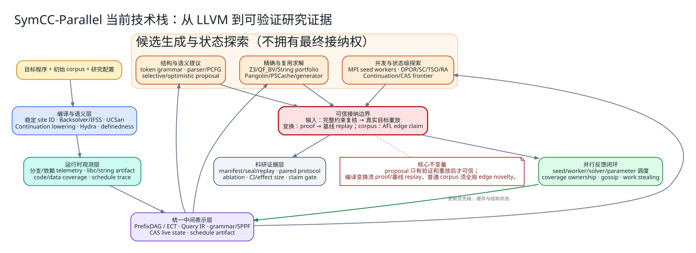
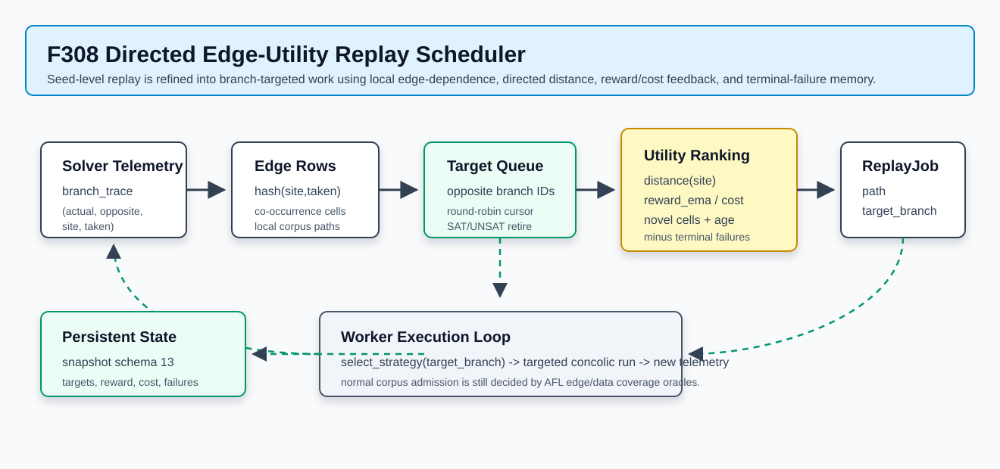

# SymCC-Parallel 当前新增技术全景与实现说明

- 快照日期：2026-08-26
- 覆盖范围：当前工作树相对上游 SymCC 新增或显著扩展的 `F00-F456`
- 连续性：F442/F443/F446/F447/F448/F449/F450/F451/F452/F453/F454/F455/F456 在已封存的 `F00-F441` 基线上继扩展，不改写旧功能编号或证据
- 连续性：F441 在已封存的 `F00-F440` 基线上补齐generation-fenced ULFM恢复substrate，不改写旧功能编号或证据
- 连续性：F437 在已封存的 `F00-F436` 基线上增量扩展，不改写旧功能编号或原始证据
- 连续性：F436 在已封存的 `F00-F435` 基线上增量扩展，不改写旧功能编号或原始证据
- 连续性：F435 在已封存的 `F00-F434` 基线上增量扩展，不改写旧功能编号或原始证据
- 连续性：F432 在已封存的 `F00-F431` 基线上增量扩展，不改写旧功能编号或原始证据
- 历史连续性：F408 在已封存的 `F00-F407` 基线上继续扩展，不重编号旧功能。
- 历史连续性：F409 在已封存的 `F00-F408` 基线上继续扩展，不重编号旧功能。
- 历史连续性：F410 在已封存的 `F00-F409` 基线上继续扩展，不重编号旧功能。
- 历史连续性：F413 在已封存的 `F00-F412` 基线上继续扩展，不重编号旧功能。
- 历史连续性：F414 在已封存的 `F00-F413` 基线上继续扩展，不重编号旧功能。
- 读者对象：第一次接触符号执行的工程人员、系统研究人员、项目汇报与论文写作者
- 权威明细：[`New_Implementation_Archive.md`](New_Implementation_Archive.md)
- 完整配置：[`Configuration.txt`](../Configuration.txt)
- 历史追踪：[`Development_History_Traceability.md`](Development_History_Traceability.md)

## 1. 先给出结论

当前项目已经不再只是“给 SymCC 加一个 MPI master”。它形成了七个彼此连接的
研究层：

1. **编译与语义层**：在 LLVM IR 中提取稳定站点、控制依赖、数据依赖、内存状态
   和可恢复 continuation，并对难以直接符号化的控制流做有界、证明门控的变换；
2. **运行时观测层**：记录路径、求解、数据进展、字符串操作、线程事件和候选来源；
3. **统一表示层**：用 PrefixDAG、ECT、Query IR、grammar/SPPF、schedule artifact
   和 content-addressed live state 保存可复用的结构；
4. **求解与候选层**：组合精确 Z3、QF_BV/String portfolio、Pangolin 式上下文复用、
   PSCache 式部分解、Backsolver、乐观/选择性求解和结构化候选生成；
5. **并行探索层**：同时支持 seed 级 MPI workers、solver 级 portfolio race、
   schedule 级 DPOR 和 continuation state 级 frontier；
6. **反馈闭环层**：普通 corpus 由 AFL edge novelty 接纳；data coverage、内容摘要、
   结构新颖度和执行成本作为调度、去重与独立证据 campaign 的信号；
7. **科研证据层**：把 manifest、seal、独立 replay、随机化配对协议、消融和
   claim gate 作为实现的一部分，而不是实验结束后临时补日志。

最重要的系统不变量是：

> **输入 proposal 不能绕过完整当前约束验证和真实目标程序重放；编译变换不能绕过
> proof gate 与未变换基线 replay；进入普通 corpus 的候选最终必须通过全局 AFL
> edge novelty 仲裁。**

这使项目可以激进地引入新技术，同时把不完备方法隔离在正确性可信边界之外。



### 1.1 阅读路线

- **五分钟了解系统**：阅读第 1、3、4、22 节，先建立执行流、bitmap 和可信边界；
- **准备部署或调试**：继续阅读第 2、7、20、21 节，重点核对默认开关、产物和测试；
- **理解算法实现**：按第 9-18 节的顺序阅读，从 PrefixDAG、Query IR 到 solver、
  grammar、schedule、continuation 和 CFG 变换；
- **准备论文或实验**：阅读第 19、23-25 节，并回到逐项档案核查 ID、证据和已知边界。

### 1.2 术语速查

| 术语 | 本文中的含义 |
| --- | --- |
| concolic / DSE | 用一次真实执行收集符号表达式，再求解相反分支约束的动态符号执行 |
| prefix | 到当前目标分支之前已经走过的路径约束序列 |
| candidate / proposal | 求解器或启发式方法生成的候选输入；尚未因此获得接纳资格 |
| replay | 用候选重新运行 evaluator、未变换基线目标或 AFL-instrumented target |
| Query IR | 与具体 solver 解耦、可持久化并内容寻址的查询表示 |
| ITE | `if-then-else` 表达式，用一个值表达多条控制流路径的合并结果 |
| QF_BV | 无量词位向量逻辑，SymCC 整数路径约束的主要 SMT 子域 |
| CAS | content-addressed storage，以内容摘要而不是可变文件名寻址对象 |
| ECT | Expressive Coverage Tree，保存路径/上下文/结构新颖度的树 |
| SPPF / PCFG | 共享打包解析森林 / 概率上下文无关文法 |
| DPOR | Dynamic Partial-Order Reduction，用依赖关系减少等价线程调度 |
| SC / TSO / RA | 顺序一致、总存储序和 release-acquire 内存模型 |
| I2S / JIGSAW | input-to-state 直接反演 / JIT 梯度约束搜索；由 SymSan RGD 栈编排 |
| seal | 绑定输入、工具、配置和产物摘要的本地证据封装，不是数字签名 |

## 2. 如何理解“已经实现”

### 2.1 结果等级

项目文档使用两类标记，不能把它们读成一条线性的成熟度阶梯：

| 等级 | 含义 | 可以说什么 | 不能说什么 |
| --- | --- | --- | --- |
| I | 已接入真实代码路径 | “已经实现并集成” | 不能据此声称性能提升 |
| T | 有单元、LLVM lit 或集成测试 | “已通过功能回归” | 不能代表所有真实程序 |
| B | 有明确环境和预算的本地测量 | “在该配置下测得……” | 不能外推为普遍优势 |
| R | 等 CPU、多轮、置信区间、效应量和消融 | “实验支持该性能结论” | 仍不能超出实验总体外推 |

`I/T/B/R` 描述证据成熟度；`E` 是正交的**可执行证据属性**，表示有 manifest、
seal、独立 replay 或 claim gate 可重算部分结论。一个功能可以是 `I/T/E`，但并不
因此达到 `B` 或 `R`；`E` 也不是形式化证明、密码学签名或远程证明。

当前多数功能达到 I/T；后期研究路径大量达到 I/T/E；早期并行、公开 benchmark 和
SymSan 路径包含 B 级历史结果。**最新全功能组合尚未整体达到 R**，所以本文不会把
“机制已实现”写成“系统已在公开 benchmark 上达到 SOTA”。

### 2.2 启用方式

功能是否存在与是否默认启用是两件事：

| 运行方式 | 实际默认行为 | 需要显式启用的代表能力 |
| --- | --- | --- |
| 单独运行 instrumented target | 普通 SymCC/QSYM concolic；Backsolver 默认可用，但仅对含 ITE 的目标生效；telemetry 文件和 data-coverage telemetry 默认不输出 | `SYMCC_TELEMETRY_OUT`、`SYMCC_DATA_COVERAGE=1`、跨前缀 poly reuse、portfolio |
| `mpi_fuzzing_helper.py` | `SYMCC_ADAPTIVE_SCHEDULER=1`；worker 自动设置 telemetry 与 `SYMCC_DATA_COVERAGE=1`；PrefixDAG/ECT/self-config 等自适应组件默认打开；poly cache 可用时 helper 以 `setdefault` 打开跨前缀、投影和字段重命名 | 可以逐项设 `0` 做消融；async query workers、外部 solver portfolio 仍需配置 |
| AFL 原生 data coverage | 只有将 `libafl_data_coverage_rt.so` 通过 `AFL_PRELOAD`/`LD_PRELOAD` 注入 AFL target 时，comparison progress 才写入 AFL 共享 map | preload 路径及 `AFL_DATA_COVERAGE`；它与 `SYMCC_DATA_COVERAGE` telemetry 不是同一开关 |
| 编译期研究变换 | pass 会注册，但 IFSS/Hydra/UCSan 的变换开关默认关闭 | `SYMCC_IFSS_*`、`SYMCC_HYDRA`、`SYMCC_UCSAN_ENTRY` 等必须在编译目标时设置 |
| 状态/调度/语法研究路径 | 普通 seed 闭环不自动启动 live continuation、DPOR、native parser campaign 或独立 evidence campaign | `SYMCC_LIVE_*`、`SYMCC_DPOR`、parser/PCFG、query portfolio 和 seal/replay 配置 |

因此“项目记录了 427 个功能 ID（F00–F426）”不表示一次 campaign 会同时执行 427 条路径。
超预算、证据不完整、语义不支持或验证失败时，功能应 fail closed 或退回受支持的
精确路径，而不是静默近似程序语义。

`Configuration.txt` 当前记录 475 个唯一 `SYMCC_*` 配置名。本文只解释配置族，
具体默认值、上限和产物 schema 以该文件为准。

### 2.3 学术技术来源与本项目差异

“借鉴某论文”不等于“复现该论文”。下表明确区分原始思想和本项目实际落地：

| 来源 | 对应实现 | 本项目采用的核心思想 | 没有冒充的部分 |
| --- | --- | --- | --- |
| [QSYM](https://www.usenix.org/conference/usenixsecurity18/presentation/yun) | 上游 QSYM backend；F00/F01/F03 的部分集成基础 | native execution、轻量表达式、混合 fuzzing | F02 Backsolver、F04 data coverage 等扩展不是 QSYM 原功能 |
| [Agolic](https://arxiv.org/abs/2608.06397) | F374 运行级规划；F423 可执行 witness-guided BSE | 有界运行作为规划单元；release前witness单状态/零fork/零solver；release后保留上下文恢复普通探索；concrete replay裁决artifact与coverage | 仅当前有界continuation IR域；未复现原生KLEE实现、任意外部效应或论文的公开目标性能结果 |
| [Selective Concolic Testing, FM 2026](https://link.springer.com/chapter/10.1007/978-3-032-26220-2_14) | F188/F189选择性probe；F424关系图两阶段求解与概率MDP | 加权变量共现图划分`PC_c/PC_r`，partial model加随机completion，完整公式SAT复核；Prefix DAG使用Laplace转移与同步Bellman迭代 | 当前仅QF_BV静态operator-risk近似；未复现KLEE/JFS/METIS/SVM、BVFP公开目标或论文性能数字 |
| [S2F](https://arxiv.org/abs/2601.10068) | F05 | PrefixDAG、high/low queue、困难分支 sampling | 不是论文完整系统与实验复现 |
| [TACO-Fuzz](https://2026.splashcon.org/details/oopsla-2026/35/Efficient-Directed-Hybrid-Fuzzing-via-Target-Centric-Seed-Selection-and-Generation) / [MultiGo](https://doi.org/10.1145/3735555) | F05 的目标调度；F06 提供部分静态基础 | target-centric、路径多样性、Poisson 难度 | 仅实现可审计的有界调度子集 |
| [CoFuzz](https://doi.org/10.1109/ICSE48619.2023.00045) | F08/F15 的在线收益与离线观测；F17-F22 提供协调基础；F308-F311 提供边级重播、在途去重、事务准入与跨主target租约 | 联合观察调度、同步和后续 coverage yield | 当前策略不是 CoFuzz 边级回归的忠实复现 |
| [WU-UCT](https://openreview.net/forum?id=BJlQtJSKDB) / [parallel MCTS analysis](https://openreview.net/forum?id=_FXqMj7T0QQ) | F309-F311 | 未完成worker任务必须进入下一次选择状态；只有真实接纳任务进入已调度统计；跨coordinator共享在途target | 只迁移unobserved-work accounting原则，不复现UCT公式、regret证明或论文实验 |
| [Sparrow](https://cs.stanford.edu/~matei/papers/2013/sosp_sparrow.pdf) | F310-F311 | late binding启发的proposal/admission分离、派发前token复验与冲突后回填 | 不复现随机双选、分布式调度架构或论文性能结果 |
| [Leases](https://doi.org/10.1145/74850.74870) / [Chubby](https://research.google/pubs/the-chubby-lock-service-for-loosely-coupled-distributed-systems/) / [HRW](https://doi.org/10.1109/90.663936) / [Linux flock(2)](https://man7.org/linux/man-pages/man2/flock.2.html) / [Oathkeeper](https://www.usenix.org/conference/osdi22/presentation/lou-demystifying) | F311-F358 | 有限期pre-commit资源权利、heartbeat/expiry、派发补偿、重启安全clock domain、内容级rendezvous放置、record/payload身份绑定、消息/关闭代次fencing、显式epoch接管、目录项持久化、分片group commit、target-group全组预验证、稳定inode短期互斥、启动期能力契约、按协议最小profile、MPI跨client锁资格、generation-fenced运行时语义续期、有界续期抖动、epoch绑定live配置身份、跨重启durable配置承诺、完成epoch持久门控、延迟GC互斥、内核no-clobber退役、三预算可恢复物理回收、有界内存候选发现、expected-first staged corpus完整性、per-parent result准入、stable streaming input准入、public provenance同域投影、锁资格的state/publication重绑定和全master root/leaf identity closure、generation-bound proof transcript、本地renewal result失败原子准入、caller-side rank exception containment、producer-side qualification totalization、collective-safe filesystem/processor输入观测、heartbeat完整partition准入，以及post-begin generation/部分send保留和三值delivery观测 | 共享文件表没有共识复制；opaque token不是全局单调共识编号；F321禁止按墙钟偷取短mutex/committing，F322只对有canonical manifest的standalone commit做redo；F329-F358当前没有真实多机true或存储吞吐证据；F351是提交时身份闭合，不证明ABA历史、Byzantine存储或返回后的命名空间不变；F352使用unkeyed摘要，不提供恶意master认证；F353只证明本地in-memory消费提交；F354-F358依次闭合completion消费、qualification生产、输入观测、相邻heartbeat/clock与请求transport普通异常，均不是持久或分布式事务、communicator修复或rank replacement；F357不回滚heartbeat外部写入，F358不回滚或重试partial/uncertain send；F337/F338只串行化协作reclaimer，时间预算不能抢占单个阻塞syscall且完整namespace scan仍为O(N) |
| [Google SRE periodic pipelines](https://sre.google/sre-book/data-processing-pipelines/) / [Amazon jitter](https://aws.amazon.com/builders-library/timeouts-retries-and-backoff-with-jitter/) / [RFC 8881](https://www.rfc-editor.org/rfc/rfc8881.html) | F331 | 周期任务thundering herd与Moiré负载、抖动分散、租约续期负载和最坏期限预算；本项目使用epoch/generation确定性delay-only jitter、root-only timer和每代缓存 | 1024-job结果是合成计划到达峰值，不是实际NFS/Lustre/CephFS IOPS、DSE吞吐或coverage；F331不重试失败资格，也未复现具体云SDK或NFS客户端算法 |
| [ARIES](https://research.ibm.com/publications/aries-a-transaction-recovery-method-supporting-fine-granularity-locking-and-partial-rollbacks-using-write-ahead-logging) / [ExoFlow](https://www.usenix.org/system/files/osdi23-zhuang.pdf) / [Linux fsync(2)](https://man7.org/linux/man-pages/man2/fsync.2.html) / [SQLite Atomic Commit](https://www.sqlite.org/atomiccommit.html) / [PostgreSQL group commit](https://www.postgresql.org/docs/current/wal-configuration.html) / [RocksDB batch commit](https://github.com/facebook/rocksdb/wiki/RocksDB-Overview) | F322-F325 | commit decision先于corpus副作用、canonical manifest、content-addressed幂等redo、部分publish联合验证、complete-once唯一记账、有序目录屏障、自然批次的same-directory shard group commit，以及target mutation检测故障补偿 | WAL/group-commit-inspired子协议，不含ARIES analysis/undo/CLR/page LSN、数据库多record事务、target-group durable intent、通用workflow lineage、真实物理断电证据或全局exactly-once execution |
| [POSIX rename](https://pubs.opengroup.org/onlinepubs/9799919799/functions/rename.html) / [Linux renameat2(2)](https://man7.org/linux/man-pages/man2/renameat2.2.html) / [Linux openat(2)](https://man7.org/linux/man-pages/man2/openat.2.html) / [Linux unlinkat(2)](https://man7.org/linux/man-pages/man2/unlinkat.2.html) / [Linux fsync(2)](https://man7.org/linux/man-pages/man2/fsync.2.html) / [Python `os.scandir`](https://docs.python.org/3.12/library/os.html#os.scandir) / [SQLite Atomic Commit](https://www.sqlite.org/atomiccommit.html) | F323/F334/F335/F336/F337 | 文件与目录项持久性分层、active名称作为恢复判据、同目录原子名称退役、提交后物理回收延迟、错误返回不伪装回滚、`RENAME_NOREPLACE`内核不变量，以及descriptor-relative no-follow迭代遍历、目录变更下`ENOTEMPTY`重开和三预算可恢复回收 | F335-F337不是数据库事务、独立background GC或总I/O消除；F336/F337只在本机Linux overlayfs验证；time budget不能抢占一个syscall，顶层namespace扫描、真实断电、NFS server failover和跨作业锁尚未证明 |
| [Python `heapq`](https://docs.python.org/3.12/library/heapq.html) / [`tracemalloc`](https://docs.python.org/3.12/library/tracemalloc.html) | F338 | 完整预验证下用固定容量反序heap保留词法最小L个retired根，扫描/候选/选择遥测分离，并以raw traced-peak/time样本核查资源形态 | traced peak不是RSS、内核/远端存储内存；完整getdents/type validation仍为O(N)，本机时间慢1.20%-6.45%，不宣称speedup |
| [POSIX `open()`](https://pubs.opengroup.org/onlinepubs/9799919799/functions/open.html) / [Python `os.open`](https://docs.python.org/3.12/library/os.html#os.open) / [`os.fstat`](https://docs.python.org/3.12/library/os.html#os.fstat) / [`os.scandir`](https://docs.python.org/3.12/library/os.html#os.scandir) / [Linux `openat2`](https://man7.org/linux/man-pages/man2/openat2.2.html) | F339-F351 | manifest membership先于对象metadata/content I/O；context-managed流式stage/result/queue扫描；`O_NOFOLLOW|O_NONBLOCK`打开后以同descriptor `fstat` regular-file；F340-F344依次闭合standalone结果/输入/模拟和hybrid结果；F345用同一稳定SHA-256 snapshot绑定AFL评分、master准入、worker CAS物化与path compatibility模式，并让self-contained continuation脱离原始locator；F346保持写fd跨越durable replace，以rename前后descriptor和公开path身份闭合CAS发布；F347用受控`.json` leaf suffix把同一发布内核扩展到live-state对象图，并让摘要与JSON消费共享一次稳定snapshot；F348在该snapshot之上构建restore-local digest memo与唯一对象/canonical-byte双预算，传递闭合parent continuation Merkle DAG；F349把root/shard逐层打开为directory capability，所有leaf I/O相对shard fd并在cache admission前复核公开root/shard identity；F350再从`/`开始逐组件open-first no-follow解析配置root，仅ENOENT相对创建并在对象I/O后重走完整ancestry；F351把同一descriptor capability原则应用到MPI锁资格，保持root/leaf跨轮次并在全master提交前闭合公开身份 | expected/observed与path/hash metadata仍受manifest/对象上限约束而非全局O(1)；F350/F351不等同于原子`openat2`、mount confinement、完整ABA历史或Byzantine模型；F340/F341/F344显式付出稳定读取成本，F343/F345本机机制测得加速；F346-F351只证明机制关闭与故障语义，均无真实campaign speedup结论 |
| [POSIX `link()`](https://pubs.opengroup.org/onlinepubs/9799919799/functions/link.html) / [Python `os.link`](https://docs.python.org/3.12/library/os.html#os.link) / [`tracemalloc`](https://docs.python.org/3.12/library/tracemalloc.html) | F343-F345 | F343以同RNG固定窗口扇出把模拟输入heap降为固定窗口；F344以digest-only第一遍把coverage-redundant结果heap从总量解耦；F345的digest-only stable input snapshot把32/128 MiB输入traced peak固定在约2.10 MB，并为CAS复用增加内容回验 | worker-private link边界不是fsync持久事务；tracemalloc不含native/kernel/MPI内存；全部为overlayfs机制证据，不能外推coverage、campaign、bug或LAVA-M |
| [MPI 5.0 error model](https://www.mpi-forum.org/docs/mpi-5.0/mpi50-report.pdf) / [MPI 4.1 collective correctness](https://www.mpi-forum.org/docs/mpi-4.1/mpi41-report/node172.htm) / [mpi4py Comm](https://mpi4py.readthedocs.io/en/stable/reference/mpi4py.MPI.Comm.html) / [ULFM specification](https://fault-tolerance.org/ulfm/ulfm-specification/) / [Dijkstra-Scholten](https://doi.org/10.1016/0020-0190(80)90021-6) | F317-F358 | timeout suspicion、任务迁移与endpoint恢复分离、READY/STOP/ACK关闭握手、跨tag有序静止、非阻塞统计、root/peer对称PREPARE/VOTE/COMMIT/ACK、重启redo、持久发布屏障、批量续租遥测、跨进程target/config single-winner、holder-crash回收、pre-service storage gate、按路径契约合并、配置共识/持久fence、完成态退役/GC、有界standalone/hybrid双向数据面、F345 current-RESULT后worker CAS驻留知识、F351独立namespace-identity-closed phase、精确M-check提交基数、F352 generation-bound transcript commit、F353本地结果单提交点、F354 completion异常rank-local隔离、F355 qualification生产总化、F356条件式负membership输入、F357 heartbeat/clock失败收敛，以及F358 post-begin partial-send保真和completed/incomplete/uncertain一次性观测 | 当前实现是应用层watchdog、exact-generation ACK、共享状态重放、运行时语义监测和bounded abort；F345的对象驻留ACK随最终RESULT而非独立早期消息到达；F351/F352故障注入未使用实际MPI transport；F353-F358不把本地异常安全/隔离外推为MPI atomic commit或故障恢复；F356/F357合成collective及F358合成点到点bus都不是实际MPI，peer仍可能等待既有deadline；F358没有端到端ACK、request cancel/free或send rollback；仍不提供communicator revoke/shrink、rank replacement、跨job hybrid membership、分片RESULT/ACK或持续外部队列的完整分布式快照证明 |
| [TLS 1.3 transcript hash](https://www.rfc-editor.org/rfc/rfc8446#section-4.4.1) / [NIST replay resistance](https://pages.nist.gov/800-63-4/sp800-63b.html#replay) | F352 | 用当前generation作为内部challenge，以domain-separated、定长/显式长度编码的SHA-256绑定epoch、有序成员、processor代表与四类证据计数；全master提交同一摘要，完成边界重算并绑定本地startup capability | 工程化迁移transcript/freshness思想，不是TLS、认证协议或NIST合规声明；摘要无密钥，不提供签名、MAC、恶意master或Byzantine存储认证；当前没有真实MPI transport或多机延迟数据 |
| [Abrahams exception safety](https://www.boost.org/doc/libs/1_31_0/more/generic_exception_safety.html) / [Lamport, Specifying Systems](https://www.microsoft.com/en-us/research/publication/specifying-systems-the-tla-language-and-tools-for-hardware-and-software-engineers/) | F353 | 把strong commit-or-rollback和状态机不变量应用于renewal result消费：所有可失败验证/派生先完成，唯一提交点后才推进代次和metrics；畸形proof形成完整failure，内部异常保留pre-state；已提交attempt保持`A=S+F` | 这是本地Python内存状态的工程化迁移，不是数据库事务、持久WAL、分布式atomic commit或TLA+形式证明；当前仅有确定性故障注入和机制证据 |
| [Python exception hierarchy](https://docs.python.org/3/library/exceptions.html#exception-hierarchy) | F354-F358 | 用`Exception`/`BaseException`层次建立completion consumer、qualification producer、external input observation、heartbeat/completion-clock及renewal control transport五道显式rank-local containment：普通错误值化为有界diagnostic并进入既有失败关闭链，proof rejection、malformed quarantine与local transport failure保持独立语义，process-control信号继续传播 | 不是跨rank异常广播、ULFM communicator repair、rank replacement或失败后继续执行；`MemoryError`值化也不能保证耗尽后的进程可用性；provider永久阻塞不产生可捕获异常；heartbeat外部写入和partial send不回滚；当前仅有本地、合成collective和合成点到点故障注入 |
| [pytest testpaths](https://docs.pytest.org/en/stable/reference/reference.html#confval-testpaths) | F359 | 用版本化`testpaths`把无位置参数的父项目pytest发现域限定为`test/`，同时不用`norecursedirs`或`--ignore`屏蔽显式vendored QSYM入口；以清空testpaths反事实和四路生产命令验证默认路由、显式可达与失败归因 | 是hermetic testing和科研证据可重复性改进，不是符号执行算法SOTA；当前环境未构建QSYM/PIN，只证明入口可达和前置条件透明，不证明其原生套件通过 |
| [pytest hook specification](https://docs.pytest.org/en/stable/reference/reference.html#hooks) / [GitHub Actions artifacts](https://github.com/actions/upload-artifact) | F360 | 用显式capability preflight闭合可选集成依赖，通过pytest公共hook逐报告记录测试与subtest，结合collection floor和零skip/xfail/xpass/deselection门；无论成功失败均原子生成并上传JSON证据 | 是hermetic CI、test observability和科研可复现性基础设施，不是符号执行算法SOTA；本地等价门禁和actionlint不等同于GitHub托管runner已执行，也不提供性能或覆盖提升 |
| [pytest node IDs](https://docs.pytest.org/en/stable/example/markers.html#selecting-tests-based-on-their-node-id) / [pytest plugin loading](https://docs.pytest.org/en/stable/how-to/plugins.html#disabling-plugins-from-autoloading) | F361 | 将完整pytest nodeid集合规范化、排序、摘要绑定并纳入版本审查；gate v2对真实collection做missing/unexpected/duplicate集合核对，生成与执行均关闭隐式第三方插件自动加载 | 是测试身份完整性与可复现实验基础设施，不证明测试体、fixture或oracle语义；本地空venv和完整门禁不等同于GitHub托管runner已执行，也不提供符号执行性能或覆盖提升 |
| [Python JSON `object_pairs_hook`](https://docs.python.org/3/library/json.html#json.load) / [pytest plugin loading](https://docs.pytest.org/en/stable/how-to/plugins.html#disabling-plugins-from-autoloading) | F362 | manifest从一个描述符读取至多`MAX+1`字节，使大小门、UTF-8、JSON、schema和摘要消费同一有界快照；pairs hook拒绝重复member，两个入口强制规范插件隔离环境 | 关闭path reopen和JSON解释歧义，不是hostile-filesystem形式化证明、数字签名或测试体语义证明；单次完整回归耗时不提供性能结论 |
| [RFC 8259](https://www.rfc-editor.org/rfc/rfc8259) / [Python JSON decoder](https://docs.python.org/3/library/json.html#json.JSONDecoder) | F363 | 异步Query IR从一个描述符读取至多`MAX+1`字节，解析前判定raw-byte上限；pairs hook拒绝重复member，parse-constant拒绝NaN/Infinity，只有严格顶层object进入持久QueryStore | 约束raw bytes而非完整RSS；未闭合no-follow regular descriptor、原地写事务隔离或多消费者spool claim；不提供求解、覆盖或性能提升结论 |
| [Linux `open(2)`](https://man7.org/linux/man-pages/man2/open.2.html) / [`flock(2)`](https://man7.org/linux/man-pages/man2/flock.2.html) / [Python `os.stat`](https://docs.python.org/3.12/library/os.html#os.stat) | F364 | 用no-follow/nonblocking descriptor、regular-file门和读后六字段身份复核稳定Query IR消费对象；用固定regular锁inode与nonblocking advisory flock形成协作式单消费者提交，并依赖fd生命周期实现SIGKILL后接管 | 不是hostile namespace/ABA形式证明、父目录逐组件锚定、跨主机flock资格、共识或global exactly-once；全spool串行化尚无吞吐/公平性数据 |
| [Python exception hierarchy](https://docs.python.org/3/library/exceptions.html#exception-hierarchy) / [SQLite transactions](https://www.sqlite.org/lang_transaction.html) / [Abrahams exception safety](https://www.boost.org/doc/libs/1_31_0/more/generic_exception_safety.html) | F365 | 用显式`QueryAdmissionError`把持久化前输入拒绝与reader/CAS/SQLite/publication故障分离；validate-once后进入私有提交阶段，只有拒绝可写dead letter，其他错误保留incoming并依赖内容身份幂等重放 | 不是数据库分布式事务或global exactly-once；SQLite前的不可变CAS写可能留下orphan，sidecar+move未形成持久原子事务，服务尚无typed retry/backoff/health telemetry |
| [Linux `openat(2)`](https://man7.org/linux/man-pages/man2/openat.2.html) / [SQLite UPSERT](https://www.sqlite.org/lang_UPSERT.html) / content-addressed storage | F366 | QueryStore复用descriptor-anchored CAS，使SMT2在索引前完成regular/no-follow/namespace/SHA-256证明或安全修复；数据库路径必须由kind+digest规范推导，full/prefix/target三对象在lease token与attempts提交前完成准入 | WorkLease仍传路径而非fd，solver open-time TOCTOU尚未闭合；CAS成功后SQLite失败可留正确orphan，未做GC、跨主机文件系统或吞吐评估 |
| [Linux `memfd_create(2)`](https://man7.org/linux/man-pages/man2/memfd_create.2.html) / [Unix descriptor passing](https://man7.org/linux/man-pages/man7/unix.7.html) / Z3 in-memory SMT-LIB parsing | F367 | QueryStore把三个已验摘要对象复制到四seal memfd；一次性helper继承full fd，持久化helper以query-id-bound `SCM_RIGHTS`接收prefix/target，C++端执行数量/type/size/seal/identity门和bounded `pread/from_string` | Linux-specific且每个active lease持三个快照；尚未测量大artifact/高并发开销，手工无bundle lease走兼容路径，未做CAS orphan GC或跨主机评估 |
| [Pangolin](https://doi.org/10.1109/SP40000.2020.00063) | F03、F176-F185 | polyhedral path abstraction、增量复用、受约束多解采样 | 当前为有界实现子集；新增跨前缀/跨布局路径也不传播 UNSAT |
| [Distributed incremental proof checking](https://doi.org/10.1007/978-3-032-22752-2_18) / [Bitwuzla incremental API](https://bitwuzla.github.io/docs/c/types/bitwuzla.html) | F426 | 将Query IR root、规范QF_BV term、capability、offset和祖先顺序绑定为内容寻址prefix delta chain；跨worker exact identity、本地parent extension、fenced materialization与QueryStore独立复算 | 借鉴增量公式fingerprint与push/pop执行模型；不是LIDRUP checker，不共享solver heap/learned clauses，也没有可检查SMT UNSAT proof或论文性能结论 |
| [GenSlv](https://conf.researchr.org/details/icse-2026/icse-2026-research-track/44/Generator-Solving-for-Symbolic-Execution) | F29、F177-F178、F181 | reusable generator、range sampler、model converter | generator 输出必须经过原查询复核 |
| [PSCache](https://doi.org/10.1145/3660817) | F32、F35、F236 | conflict-derived partial assignment 与相关查询复用 | 未宣称实现论文全部 bit-blast trail 技术 |
| [SMTgazer](https://conf.researchr.org/details/ase-2025/ase-2025-papers/47/SMTgazer-Learning-to-Schedule-SMT-Algorithms-via-Bayesian-Optimization) | F09、F239-F243 | censored-cost algorithm sequence 和 SMBO | 不是私有模型/数据集的复刻 |
| [SymCC-str](http://theory.stanford.edu/~barrett/pubs/CB26-abstract.html) | F30、F33、F193-F200 | BV/String 双表示和 libc string artifact | 只覆盖明确列出的 C string/conversion 子域 |
| [Lase](https://2026.splashcon.org/details/oopsla-2026/43/Online-Input-Grammar-Synthesis-Aided-Symbolic-Execution) | F36、F187、F190-F192 及后续 grammar 机制 | 在线 token grammar、结构化输入生成 | parser/PCFG 扩展是本项目有界实现 |
| [Empc](https://arxiv.org/abs/2505.03555) | F07、F401 | seed/PrefixDAG trace反馈与持久pending live-state两层multiple minimum path covers；函数内SCC DAG、兼容cover收缩和未覆盖suffix调度 | F401是content-addressed continuation适配，edge-exclusion有界；不是论文artifact逐行复现，也未形成公开coverage结论 |
| [Compatible Branch Coverage](https://doi.org/10.1145/3656443) | F402 | 以作者CBC-SE V2.1工件为主源，在持久continuation fork前用data/control closure构造compatible branch set，并在state-pressure门后删除组内latest outcome不一致的child | 函数内保守适配；memory、call/callee、cycle、unknown assume、token歧义和预算均fail-open；synthetic机制结果不等价于论文公开实验 |
| [Concrete Constraint Guided Symbolic Execution](https://doi.org/10.1145/3597503.3639078) | F403 | 以作者ICSE 2024工件为主源，在持久continuation中恢复固定地址store-load-icmp依赖，以具体branch outcome和latest store value驱动双FIFO target优先调度，并由snapshot v5/lease事件重放保持跨worker一致 | 函数内保守子集；symbolic/guarded/overlap/call/SSA-site-token歧义和预算均fail-open；不剪枝、不决定SAT/UNSAT；synthetic target-latency结果不等价于论文公开实验 |
| [Cottontail](https://mboehme.github.io/paper/SP26-cottontail.pdf) | F07、ECT、agentic接口、F399 | context/path-sensitive expressive coverage；独立Query IR通道的alpha-normalized target/joint-prefix constraint class与有界公平结构调度 | ECT按官方设计不承载solver AST；未复现完整LLM seed acquisition/iterative solve-complete协议或论文公开实验 |
| [Gordian](https://arxiv.org/abs/2603.19239) / [NeuroSCA](https://arxiv.org/abs/2603.01272) | F10 的 proposal/verifier **扩展点** | inverse/exemplar/core proposal 应位于不可信平面 | 未实现论文完整 ghost-code 迭代或训练型神经算术 solver，不计作已实现 backend |
| [ParaSuit](https://conf.researchr.org/details/icse-2026/icse-2026-research-track/222/Enhancing-Symbolic-Execution-with-Self-Configuring-Parameters) | F186、F396-F398 | 条件参数图、上下文选择、transfer prior、executable provider、生命周期路由、program-bound MeanShift/silhouette 值空间，以及 inverse-frequency standalone/synergy 参数选择 | 未复刻通用 KLEE/help 参数抽取、sklearn 逐决策等价或论文 12-program 公开实验 |
| [UCSan](https://www.usenix.org/conference/osdi26/presentation/yin) | F11、F393-F395 | 编译式 under-constrained harness、JITI对象图和shadow pointer；严格seed准入、规范耐久快照；显式栈/堆对象的allocation-level OOB、alias UAF、逐字节初始化传播与pointer/branch UBI sink | 尚非完整DFSan shadow或global Super Object；一般libc/custom effect、并发shadow线性化、Windows funclet仍未关闭；论文性能不能转移为本项目结果 |
| [POSE](https://arxiv.org/abs/2407.16827) | F456 | stable proxy、lazy byte/reference field、ITE alias、conditional store/free、alias quotient、QF_BV与continuation CAS | 有界C layout适配；不是任意LLVM自动前端、并发heap或论文Java artifact逐行复现；本地机制结果不外推coverage/speedup |
| [GenSym](https://conf.researchr.org/details/icse-2023/icse-2023-technical-track/39/Compiling-Parallel-Symbolic-Execution-with-Continuations) | F38、F59、F66、F68-F175 | continuation、状态级并行、持久 store/memory | 只支持保守 LLVM 子集，不是完整 GenSym 编译器 |
| [ConDPOR](https://doi.org/10.4230/LIPIcs.CONCUR.2025.26) | F39-F58、F61-F65、F221、F392、F425 | trace/runtime层输入与schedule联合；closed IR与native层的po/rf/co关系、backward revisit、fresh-process重生成；F425增加原子值/commit证据和SC/TSO/RA图证书 | F392/F425只声明各自有限域和资源界限内的机制；不声称完整ISO C11、herd7覆盖或论文级unbounded sound/complete/optimality |
| Backsolver / IFSS / [Hydra](https://doi.org/10.1145/3798202) | F02、F37、F248-F296 | ITE/state merge、targeted control-flow transformation、fork elision | IFSS 是项目内有界实现族；Hydra 采用 failure-preserving 边界，默认关闭且必须 replay/manifest 验证 |

完整论文链接、论文原始结论和逐项差距见
[`sota_hybrid_execution_2026.md`](../sota_hybrid_execution_2026.md) 与
[`SOTA_Gap_Audit_2026-07-24.md`](../SOTA_Gap_Audit_2026-07-24.md)。

## 3. 两条执行主线

### 3.1 Native concolic + AFL++ 闭环

这是当前最成熟的执行主线，单个工作项按以下顺序运行：

1. AFL++ 或 corpus 产生种子；
2. coordinator 扫描队列，结合 PrefixDAG、ECT、目标距离、历史收益和 worker 状态
   选择工作项；
3. master 向 worker 下发种子对象、executor/profile、focus set、目标分支、schedule
   prefix 和 AFL edge-bitmap 版本或增量；
4. instrumented target 真实执行，QSYM/SymCC runtime 构造符号表达式和路径约束；
5. QSYM 的私有 branch-interest bitmap 判断某分支是否值得再次求解；
6. runtime 内的 exact、tailored/Backsolver、sampling 或本地 string backend 可直接
   产生候选；QueryStore、grammar、agentic 等异步路径通过各自 artifact/sidecar
   产生候选，但最后汇入相同 triage；
7. worker 先用 128-bit BLAKE2b 摘要做有界的实用内容去重，再用
   AFL-instrumented target 的 streaming/batched showmap 重放候选；
8. worker 的本地 AFL edge bitmap 做预过滤，只上传本地判新的 sparse edges；
9. master 在自己的会话级 edge bitmap，或多 coordinator coverage-owner shard 上
   做最终 novelty claim；只有全局 edge delta 非零的候选才写入普通 SymCC/AFL queue；
10. master 消费 telemetry，更新 PrefixDAG、ECT、data-progress tracker、策略后验、
    coverage owner 和下一轮工作优先级。


#### 3.1.1 一个最小端到端例子

假设输入 `A0` 到达 `if (x == 0x42)`，当前走 false 分支：

1. runtime 用稳定 site ID 和 taken=false 更新 QSYM branch-interest map，并构造
   `x != 0x42` 的已走路径与 `x == 0x42` 的翻转目标；
2. direct fast solve 可能直接把依赖字节改成 `0x42`；复杂情况再进入当前 prefix
   context、Backsolver 或 Z3；
3. 候选 `B0` 先在 worker 内按内容摘要去重，然后由 AFL target 重放得到
   `[(edge_17, count_1), (edge_31, count_1)]`；
4. 若 worker 本地 bitmap 已有两条边，候选在 worker 被丢弃；否则 sparse edges
   随候选上传；
5. 若 master 全局 bitmap 仍缺 `edge_31`，master 原子接纳 `B0` 并广播 coverage
   delta；若另一 worker 已先声明该边，`B0` 不进入普通 queue；
6. 无论最终是否接纳，solver 状态、候选数、data progress 和耗时都会进入反馈，
   但调度奖励不能代替全局 edge novelty。

### 3.2 Continuation/CAS 状态级执行

该路径不是“多启动几个相同进程”，而是把可恢复符号状态作为工作：

1. LLVM 子集被降低为 executable continuation IR；
2. checkpoint 保存 program counter、symbolic store、path-condition root、
   page-COW memory、对象生命周期和动态选择计数器；
3. 状态内容以 CAS 哈希寻址，coordinator 只租约分发状态描述符；
4. worker 恢复 continuation，在有界步数内执行并在符号分支处 fork；
5. child 的 path condition 追加一个 solver-frame delta；symbolic store 重新内容
   寻址，未改 memory page 通过 page-COW root 共享；
6. halted candidate、frontier checkpoint 和失败原因一起提交；
7. master 通过 fencing token 和内容哈希拒绝过期、重复或被篡改提交；
8. 可具体化的输入仍进入与 native 路径相同的目标重放和 AFL 仲裁。


Continuation 路径当前覆盖的是**明确有界的 LLVM 语义子集**，并不是任意 C/C++ 程序
的完整 GenSym 复刻。遇到异常处理、无法证明的别名、超预算 pointer domain、
不支持的 intrinsic 或复杂循环时会保守拒绝 lowering。

## 4. 位图、集合与哈希空间

项目中“bitmap”不是一个对象的多个名字。混淆它们会直接导致重复求解判断错误。
下表的 `B1-B6` 是本文和 `Architecture_QA3.md` 为讲解定义的标签，不是源码类型名。

| 名称 | 生成者 | 主要用途 | 是否拥有最终接纳权 |
| --- | --- | --- | --- |
| B1：master AFL coverage | AFL-instrumented target 的 showmap 结果 | 会话级 edge novelty 最终仲裁 | 是 |
| B2：worker local coverage | worker 对候选重放后的稀疏 edge | 本地预过滤、减少 MPI 流量 | 否，需提交 B1 |
| B3：QSYM branch-interest map | symbolic branch site/outcome 哈希 | 判断路径分支是否值得求解 | 否 |
| B4：coverage owner shards | 多 coordinator 的分片持久状态 | 跨 master ownership、claim 与 gossip | 仅在多 master 模式代表全局 claim，受 fencing/owner 规则约束 |
| B5：AFL 原生 data namespace | preload runtime 写入 AFL shared map | 让 AFL 自身把 `memcmp` 等 prefix progress 当作 map feature | 注入 AFL target 时由 AFL 与 edge 共同保留；普通 MPI triage 未注入时无此权力 |
| B6：grammar bitmap | parser production/rule ID | 结构化输入新颖度和调度 | 否 |
| 显式键 data novelty set | `(object, offset, width, kind)` | scheduler 内按结构键记录 data-progress dominance | 否 |
| 内容摘要 | worker 输入用 128-bit BLAKE2b；持久对象/队列另有 SHA-256 | 实用去重与内容寻址 | 否；摘要碰撞概率极低，但不是数学上的字节等价证明 |

B3 与 B1/B2 使用不同 ID 空间：B3 关注符号分支及其上下文，B1/B2 关注 AFL
instrumented binary 的覆盖边。`SYMCC_AFL_COVERAGE_MAP` 在 worker 中实际指向
131072-byte 的 QSYM `qsym_bitmap`，不能拿 AFL edge ID 去索引它。B5 是兼容 AFL
的有限 namespace，仍可能发生哈希碰撞；scheduler 的 data tracker 则用显式结构键
记录最佳 matched bits。F247 是独立研究流程：在同一 instrumentation identity 下
分别用 edge-only 与 edge+data showmap 重放相同 candidate/witness，封存 sparse map、
重复稳定性和 feature calibration；它不改变普通 MPI queue 的 edge-only 接纳条件。


## 5. 技术族总表

| 技术族 | 主要功能 ID | 解决的问题 | 主要入口 | 成熟度概览 |
| --- | --- | --- | --- | --- |
| 基础正确性 | F00、F26、F297、F299-F307 | 位宽、线程局部状态、稳定 ID、cache/replay/oracle soundness、scalar min/max、稀疏输入、输入ABI与跨层事务语义 | `compiler/`, `runtime/src/`, `util/`, `benchmark/` | I/T/E，F297 含真实对象机制复验，F299-F307 含跨层门禁 |
| MPI 与 hybrid 基础 | F17-F25、F298-F299 | 并行吞吐、AFL 原生 peer 协同、引擎抽象、交付与等核计量 | `util/mpi_*`, `benchmark/` | I/T/B，F299 的新性能结论仍待 R 级实验 |
| 遥测与覆盖 | F01、F04、F06-F07、F22、F28、F247、F300-F307 | 看见路径、数据、经验值域、域收益、域成本、终端状态和结构进展并正确判新、正确归因 | `hybrid_feedback.py`, coverage runtime、QA3 oracle | I/T/E |
| 调度与目标引导 | F05、F08-F10、F14-F16、F186、F308-F312 | 把有限 CPU 分给更有价值的种子、分支目标和策略，并抑制单主/跨主在途重复与虚假提交 | adaptive/self-config/scheduler | I/T，部分 B/E |
| Query IR 与生成器 | F27、F29、F181 | 持久化查询、重放 converter、批量生成解 | `query_store.py`, `solution_generator.py` | I/T/E |
| 求解复用 | F03、F32、F35、F176-F185、F236、F238 | 减少重复翻译、重复 SAT/UNSAT 和相关查询成本 | QSYM solver、QueryStore | I/T/E |
| Solver portfolio | F02、F31、F34、F177-F178、F188-F189、F237-F246 | 处理长尾、选择算法、控制近似 | query service、QF_BV tools | I/T/E |
| 字符串双表示 | F30、F33、F193-F200 | 把 libc/string 语义接到 BV 和 String solver | wrappers、string tools | I/T/E |
| 语法与解析森林 | F36、F187、F190-F192、F201-F220、F222-F235 | 学习并验证结构化输入、PCFG 和 parser 状态 | semantic/parser modules | I/T/E |
| Under-constrained execution | F11、F393-F395 | 自动构造函数级 harness、可恢复JITI对象图，以及显式对象OOB/UAF与byte-level UBI检查 | `compiler/UCSan.*`, runtime | I/T/E-mechanism |
| 并发状态空间 | F13、F39-F58、F61-F65、F221 | 联合探索输入、schedule 和 memory model | schedule runtime/exploration | I/T/E |
| Live continuation | F12、F38、F59、F66、F68-F175 | 状态级并行、可恢复内存和 LLVM 语义 | continuation compiler/runtime | I/T/E，有界子集 |
| IFSS/Hydra 变换 | F37、F248-F296 | 减少 fork、恢复多出口/循环/内存状态 | compiler transformation passes | I/T/E，默认关闭 |
| 证据与 benchmark | F16、F21、F25、F60、F67、F306-F307 及各 sealed campaign | 可复现评测、独立复核、稳定性审计、输入ABI记录和克制的科研表述 | benchmark/research tools | I/T/B/E |

技术族是多对多视图，同一 ID 可以同时服务调度、solver 和 evidence。第 24 节为避免
重复只给每个 ID 分配一个“主层”；表中范围重叠不表示重复实现。

下面按执行链解释每个技术族。

## 6. 编译器与运行时正确性基础

### 6.1 位宽、线程和站点身份

F00 修复并扩展了符号表达式的基础语义：

- `inttoptr`、`ptrtoint` 按 LLVM `DataLayout` 做扩展或截断，而不是假定 64 位；
- runtime 参数表达式槽和返回表达式改为 `thread_local`，避免多线程目标互相污染；
- test-case handler 可显式保存已经验证的 concrete values；
- QSYM 专属测试按 backend capability gate 运行。

F26 是一次跨层 correctness hardening：

- bit-vector 线性化只有在证明无回绕时才进入整数/polyhedral reasoning；
- poly cache key 绑定完整前缀和表达式上下文；
- fast solve、cache model 和外来 poly sample 都重新验证当前目标；
- LLVM site ID 由稳定模块/位置身份产生，避免 ASLR 和构建顺序污染；
- UCSan shadow copy、multi-master fencing 和 benchmark 字段一致性被重新审计。

F297补齐普通Symbolizer对scalar
`llvm.smin/smax/umin/umax`的精确bit-vector语义。四种runtime builder直接组合
signed/unsigned comparison与ITE，并继续使用表达式短路。Data Coverage来源追踪
同时改为遍历numeric intrinsic的全部参数。双LLVM定向测试实际求得目标输入；
libarchive 7zip对象的相同`-O3`命令中，对应concretize warning由10条降为0。vector
overload及性能收益仍不在已证明范围；详见
[`SOTA_Implementation_Continuation_2026-07-30.md`](SOTA_Implementation_Continuation_2026-07-30.md)。

### 6.2 F299 跨层正确性加固

F299把缓存预算、LLVM表达式、AFL文件发布、coverage claim、showmap oracle、DPOR
调用来源和benchmark单位视为一条证据链，而不是互不相关的局部实现。严格Z3查询不再
被1024条cache上限截断；普通symbolic operand经过`freeze`保持表达式；静态依赖区间
使用128-bit中间算术。AFL peer只看到完整、fsync后的最终ID，disk failure不会提前
claim，distributed race loser保留完整ID槽以维持cursor连续。

DPOR默认只包装主程序发起的pthread同步，显式allowlist可纳入启动时DSO；同一原子
fixture的trace由全模块1502行降为101行，1401条内部lock/acquire/unlock被消除而原子
证据保持。benchmark按内容hash并集去重，AFL-only按np启动等量实例，并禁止不同
throughput kind之间计算speedup。完整不变量、实测和边界见
[`Correctness_Hardening_2026-07-31.md`](Correctness_Hardening_2026-07-31.md)。

### 6.3 F300-F312 稀疏输入、cost-aware EVP、覆盖归因与事务式边级调度

F300首先修复simple backend的乱序输入offset：按最大offset扩张且包含空槽的vector
改为按真实offset保存表达式的稀疏map，首次访问1 TiB逻辑offset也只分配一个条目。
同一offset的变量名和AST稳定，先高后低访问不再返回空表达式。

QSYM侧增加bounded Empirical Value Profile：每个stable comparison/switch site保存
观察数和最多8个不同值，第9个值把画像标为饱和。MPI按实际目标可执行文件SHA-256
绑定画像；无合法context时runtime不采集，不同二进制的site离线聚合时也绝不合并。
确定性工具只准入样本足够、未饱和且频次完整的小值域，并生成可重建SHA-256
artifact。F301进一步物化严格sidecar，对齐branch/select路径site，并把经验域作为
SAT-only探针接入Z3；SAT模型复核完整相关prefix，UNSAT/UNKNOWN删除经验域后重走原
公式，且经验UNSAT绝不进入cache。详见
[`Continuous_Optimization_2026-08-04.md`](Continuous_Optimization_2026-08-04.md)和
[`Profile_Guided_Solver_Consumption_2026-08-04.md`](Profile_Guided_Solver_Consumption_2026-08-04.md)。

F302进一步把手工sidecar消费接入MPI campaign：master在有界滚动窗口中聚合worker
telemetry，发布内容寻址的语义代际；work消息只在worker版本未命中时携带bytes，worker
校验SHA-256后本地原子安装。域失去limited资格时必须发布`profile_count 0` tombstone，
防止旧假设无限保留。真实1-master/1-worker运行产生3代、1次validated SAT和3次安全
回退，最终完成撤销；详见
[`Online_Empirical_Domain_Feedback_2026-08-04.md`](Online_Empirical_Domain_Feedback_2026-08-04.md)。

F303继续把“域稳定”与“域有收益”分开：QSYM按
`(executable context,site,bits,exact values)`发出attempt/prefilter/query/SAT/validated/
fallback守恒计数。默认至少8次真实query且validated比例低于12.5%时，master只抑制
该精确域；画像值集合变化不会继承旧失败，旧证据离开滚动窗口后域自动重新准入。
阈值、原始计数和抑制key封入可重建的v2 artifact，QSYM仍只消费过滤后的v1文本
sidecar，完整公式回退不变。真实状态转换实验得到2 query/2 UNSAT/0 validated、抑制
期间0行和重准入后1次reprobe query；详见
[`Adaptive_Empirical_Domain_Admission_2026-08-04.md`](Adaptive_Empirical_Domain_Admission_2026-08-04.md)。

F304在F303查询/收益门上加入实际经验域Z3 `check()`累计成本。默认只有
`queries>=8`、validated/query严格低于12.5%且`solver_time_us>=1000`三个条件同时
满足才抑制；成本门0恢复F303行为。12项反馈、v3/admission-v2证明和恢复策略都绑定
该成本证据，旧11项反馈补零并保持可读。真实同源对照中两次UNSAT累计142 us：成本
门0抑制为1域，成本门143 us保留2域，证明门确实区分廉价失败；该短fixture不是性能
结论。详见
[`Cost_Aware_Empirical_Domain_Admission_2026-08-04.md`](Cost_Aware_Empirical_Domain_Admission_2026-08-04.md)。

F305继续审查在线状态的可证明恢复：state中的artifact标签即使与runtime一致，也不能
单独证明滚动记录仍支持当前域。restart现在从记录执行与publish相同的聚合、准入和
物化，再比较完整runtime语义；不同、畸形或不完整就dirty并重建。checkpoint写失败
增加独立计数并保留dirty，下一次semantic no-op可补写state。可执行证据在标签不变时
把记录`[1]`换成`[2]`并检出1次mismatch，随后注入state写失败又成功重试。详见
[`Replay_Verified_Online_Profile_Recovery_2026-08-04.md`](Replay_Verified_Online_Profile_Recovery_2026-08-04.md)。

F306把同样的“失败不能伪装成零收益”原则扩展到benchmark覆盖率归因。QA3先比较流式
`afl-showmap -S`与隔离one-shot的状态和完整edge-ID集合；不一致就让整个campaign统一
回退one-shot。corpus按循环位移交错执行3轮，默认strict拒绝任一漂移，显式intersection
保守取交集，union只记录可能边。landing与exclusive-edge从同一份逐轮原始集合派生。
真实XML探针发现`timeout/933`对`ok/1019`的不兼容；20输入的60次正式one-shot观测中
11个输入有漂移，因此strict正确拒绝。详见
[`Interleaved_Fail_Closed_Coverage_Oracle_2026-08-05.md`](Interleaved_Fail_Closed_Coverage_Oracle_2026-08-05.md)。

F307继续把覆盖率oracle的目标调用语义显式化：同一输入字节可能通过persistent stdin
或`argv[1]`文件入口进入harness，二者不是同一个实验。新增`--input-mode`把stdin/file
分流写入schema，新增`--terminal-status-policy`把crash、timeout和error从正常覆盖归因中
分离；MPI showmap fast path也只在status正常且边集可验证时合并bitmap。真实XML证据在
stdin ABI下记录streaming`timeout/933`对one-shot`ok/935`，因此继续one-shot fallback；
baseline交集/并集修正为934/935，候选分母修正为19个真实candidate，19/19均有seed-novel
edge，novel union为1374。详见
[`Input_ABI_Terminal_Stratified_Coverage_Oracle_2026-08-06.md`](Input_ABI_Terminal_Stratified_Coverage_Oracle_2026-08-06.md)。

F308把调度侧的edge-dependence replay从“把种子再跑一次”推进到“指定下一条要尝试的
分支”。`branch_trace`中的`site/taken`形成edge row，opposite branch进入目标队列；
row同时保存静态directed distance、收益/成本EMA、terminal失败数和成功目标数。
`AdaptiveHybridScheduler.replay_candidates()`因此能返回`ReplayJob(path,target_branch)`，
worker沿原有targeted concolic路径执行。普通corpus仍由AFL edge/data coverage oracle
仲裁，F308不改变输入接纳，只减少重复解同一seed中低价值边的概率。机制图见


F309继续审查并行选择使用“只包含已完成任务的陈旧统计”这一缺口。统一target registry
把Prefix DAG、CSTG、hierarchical concurrency、edge replay和fallback replay选出的
primary target及非skip S2F actions组成有界租约组；worker结果释放整组，失联由deadline
恢复。它同时修复row裁剪计数、round-robin游标、空trace terminal退休、CSTG截断trace
outcome和restore幂等性。机制图与可信边界见
[`F309在途目标租约报告`](research-progress/In_Flight_Target_Leasing_F309_2026-08-07.md)。


F310进一步修复“本地选择已修改状态、全局租约随后拒绝”的提交窗口。Prefix DAG、CSTG和
concurrency选择器现在可以无副作用地产生proposal；只有group lease成功的`ReplayJob`才由
对应`commit_jobs()`更新attempt、cooldown、queue epoch和游标。Prefix/CSTG target lane
以已接纳任务而非已查看proposal计算配额，冲突后继续扫描后备target。完整协议和边界见
[`F310事务式目标准入报告`](research-progress/Transactional_Target_Admission_F310_2026-08-07.md)。


F311把上述事务边界扩展到多个MPI coordinator。新增共享target-only表，使不同seed但
primary/非skip S2F action重叠的工作在有效租约期内发生group冲突；全组按target digest
有序持锁、先检查后发布同一token，heartbeat与release必须匹配当前record。scheduler先
取得本地租约，再取得共享租约，最后才提交attempt/cooldown/cursor；selector的worker
配额与proposal扫描深度分离，跨主冲突后仍可回填。派发阶段冻结已有target/actions契约，
防止agent hint绕过租约。target token只防陈旧release，不替代exact-work结果fence，也不
声称是全局单调fencing number。完整失败模型见
[`F311跨协调器target报告`](research-progress/Cross_Coordinator_Target_Fencing_F311_2026-08-07.md)。


F312对该续期路径做故障原子性审查。target group先保存全组record快照，再对副本写统一
时间；后续成员写失败时，在仍持有全部有序锁的条件下恢复已发布成员，避免正常I/O错误制造
不同expiry point。MPI master改为逐条续期active work、active target与pending target，
单条`OSError`或stale token只进入四类守恒计数而不终止协调器；未完成原子replace的临时
record也由`finally`清理。回滚持续失败仍可能留下current-token保护的保守租约，因此它是
尽力失败原子语义，不是跨文件事务。详见
[`F312失败原子heartbeat报告`](research-progress/Failure_Atomic_Lease_Heartbeat_F312_2026-08-07.md)。

这些工作不直接增加覆盖率，却决定所有后续优化是否有可信基础。尤其是“把位向量
当整数”和“跨前缀复用 UNSAT”都可能产生静默漏解，因此项目只允许经过证明的
线性子域，并禁止跨前缀传播 UNSAT。

## 7. MPI 并行与 AFL++ 混合闭环

### 7.1 从串行 seed 到分布式工作

F17 建立 master/worker 协议：worker 声明就绪，master 分发内容寻址的种子与策略，
worker 返回稀疏覆盖和小型 telemetry。协议包含原子文件、非阻塞消息资源回收、
终止握手、超时区分和大规模多 coordinator 路径。

F18 把 AFL queue 增量送入 SymCC，把经过真实 showmap 判新的候选送回 AFL。关键优化
包括 worker-side triage、streaming/batched showmap、增量目录扫描、内容哈希预去重、
coverage delta 和各阶段交错执行。历史固定配置测量曾记录明显的 I/O 与通信下降，
但这些数字是 B 级机制结果，不是跨目标平均加速。

F19 继续解决扩展性：

- focus bytes/focus set 对输入依赖域分区；
- branch-density-balanced partition 避免等长切分造成难度偏斜；
- work stealing 和 adaptive granularity 消化 worker 空闲；
- persistent mode 与 shared-memory testcase 减少启动/I/O；
- 报告 active worker 和总 CPU，而不是只报 `-np`。

### 7.2 异构执行引擎

F20 把 LAF、CTX/NGRAM、CmpLog、MOpt、GRIMOIRE 和 honggfuzz 作为互补候选来源；
F23 用 `ConcolicEngine` 契约统一 SymCC 与 SymSan；F24 把选择性符号化、dictionary、
multi-field hints 和 RGD 的 I2S/JIGSAW/Z3 级联接入 SymSan。所有引擎仍共享
coverage triage、调度和冗余统计，避免评测逻辑因 backend 不同而漂移。

F25 提供可重复安装、离线 bundle、相对 RPATH 和 bare-machine/debootstrap 验证。
它解决“代码能跑”和“别人能重建同一实验环境”之间的工程缺口。

### 7.3 F298 原生在线 peer 反馈

Hybrid runner现在把`afl_out/symcc01/queue`作为AFL++ campaign内的协议兼容peer。
SymCC helper以连续`id:NNNNNN`原子发布，AFL master通过
`.synced/symcc01`的next-ID游标重放，并只把自己当前coverage map认为有价值的输入
保存为`sync:symcc01`。这修复了旧实现向`fuzzer01/queue`直接追加但不会进入AFL
内存corpus的问题。

这里特意没有把SymCC放入`-F`目录：AFL++ 4.40c的foreign scanner按whole-second
文件`mtime`判新，不适合高频producer；原生peer的连续ID游标可恢复、可计量，也不会
依赖同秒时间戳。benchmark分别报告published、scanned、imported、not-retained和
sync-complete，避免把离线文件数当在线贡献。75秒机制run为23 published、22 scanned、
4 imported，四个导入内容与source digest全部相同；hard-stop尾部1被显式报告而没有
隐藏。实现、官方契约链接和完整数据见
[`SOTA实施续档`](SOTA_Implementation_Continuation_2026-07-30.md)及
[`F298 evidence`](evidence/current-eval-2026-07-30/f298_native_peer_sync_2026-07-31.md)。

这仍不是性能收益结论：一次run只能证明数据确实在线进入AFL以及贡献可以精确归因；
需要等CPU、多轮sync开关消融才能判断coverage AUC净增量。

## 8. 遥测、覆盖与结构反馈

### 8.1 统一 SolverTelemetry

F01 把每次执行归一为 engine-neutral telemetry：

- 进程状态：signed return code、timeout、killed、elapsed；
- 路径状态：path hash、open branches、bounded branch trace；
- 求解状态：SAT/UNSAT/unknown/timeout、算法、成本、cache hit；
- 依赖状态：comparison taint、input offsets、结构 context；
- 结果状态：generated、validated、accepted 和拒绝原因；
- capability/missing fields：避免把 backend 缺失字段误当作零。

这使 scheduler 能同时比较 SymCC、SymSan、exact、sampling 和 semantic proposal，
又不会依赖某个求解器的进程内对象。

### 8.2 Data Coverage

F04/F28 将“距离常量还有多远”变成独立反馈：

- 整数 equality 使用相等 bit 数；
- ordered comparison 使用相等高位前缀；
- switch 只探测相邻 case 或范围端点；
- `memcmp/bcmp/strcmp/strncmp` 记录有界字节区域进展；
- 编译期常量全局对象用稳定 module/object ID 注册；
- 未插桩 DSO 的只读 `PT_LOAD` 可在启动时注册；
- runtime 地址归一化为 `(object_id, byte_offset, width, kind)`。

显式结构键 novelty set 负责逐 feature 的精确 dominance；有限的 AFL data
namespace 负责与 AFL 生态兼容。只有 matched bits 严格提升时才替换 scheduler 中的
feature winner，而且该 tracker 不会删除 AFL 自有 queue 文件。

### 8.3 结构覆盖和目标引导

F06 组合 directed coloration、静态依赖、并发提示和结构任务图：

- ColorGo 风格的静态/动态 coloration 从 target 反向计算 CFG/call distance；
- DynamiQ 风格的结构任务把递归 call-graph SCC 压缩成稳定 region，再按收益、成本、
  停滞和 queue pressure 分配 ownership/work stealing；
- 静态 branch-to-byte 摘要可在不额外执行目标的情况下生成 replay focus；
- 并发图标记 thread lifecycle、lock/condition/barrier/semaphore、atomic 和 fence。

F07 用 Expressive Coverage Tree 表示 observed/open outcome、上下文、重复形状和结构
稀有度；Empc 风格 multiple minimum path cover 先折叠 loop SCC，再用不同 maximum
matching 产生多组路径覆盖，并依据真实 trace 缩小 seed 的活动 cover。目标不可行时
退回 predecessor/dependence，而不是持续选择同一条最短路径。

F401 把该思想接到真正的 pending continuation：只在函数内 CFG 上构造 cover，避免缺少
return edge 的调用图误导；checkpoint 的持久 branch token 保守收缩兼容集合，每个
frontier generation 一次预计算未覆盖 SCC suffix，再由 `path-cover` 独立策略领取 ready
state。snapshot v3 绑定 MPC 边界，未知/歧义 token 不删除 cover，无 plan 时回 BFS。

F22 把总耗时拆为取任务、concolic、扫描、去重、showmap、发送等 phase，并建立
redundancy funnel：同 worker 重复、跨 item 重复、跨 worker 重复、coverage 已见和
最终 accepted。没有这些字段，学习型 scheduler 很容易把 I/O 拥塞误认为求解无效。

## 9. PrefixDAG、目标任务与自适应调度

F05 用 PrefixDAG 保存跨 seed 的路径前缀，而不是把一次 execution 当作孤立事件：

- S2F 式 actionseed 把同一 seed 的多个高价值 open branch 批量化；
- exact executor 优先处理明确目标，tailored executor 处理 ITE/隐式流；
- sampling 只分给困难但曾产生收益的前缀；
- TACO 风格目标路径关注 under-explored near-target prefixes；
- MultiGo 风格评分联合目标距离、路径频率、难度和探索保留。

F08 把选择扩展到 seed、worker、executor、strategy 和 parameter；F09 学习
SMT algorithm sequence；F10 提供确定性的 semantic fallback、内置 route、异步
provider 接口和 verifier-gated proposal。当前仓库实现的是 inverse/exemplar/token/
object-partition 等有界数据候选，不包含 Gordian 完整 ghost-code 编译迭代，也没有
把 NeuroSCA 训练模型作为 solver backend。所有外部输出都经过 schema 检查、
Query IR 或 concrete evaluator 验证和目标重放。

具体调度器不是单一 bandit：

- SimiFuzz 风格 LinUCB 对 seed-worker pair 建模，并按固定 time slice 聚合反馈；
- K-Scheduler 风格 frontier score 使用 showmap cache 的稀有边权重；
- TACE 两阶段先执行 bounded no-solve dependency profile，再只符号化 sparse focus；
- Strategy/Component portfolio 分开学习 exact/tailored/sampling、solver、focus 和
  sampling 组件，避免把组合收益错误归给每个开关；
- AdaptiveParallelismController 用带迟滞的 hill climbing 调整 active symbolic
  workers，防止并行度频繁抖动；
- SYMCTS 风格 prefix/edge-dependence 状态为 under-explored branch pair 保留 replay
  机会，而不是只依赖 AFL 的粗粒度边图。

F14 将上述能力组织成 xFUZZ/KRAKEN 风格 AFL profile，组合 LAF/CompCov、CTX、
Ngram、CmpLog、MOpt 和 power schedule；F15 保存 propensity、并行干扰和离线
trajectory，用 clipped IPS、SNIPS、doubly robust、ESS 和 lower confidence bound
做保守 off-policy 评估。F186 又将 ParaSuit 式参数空间升级为带 `active_when`
依赖的机器 schema、上下文后验和只读 transfer prior。F396 进一步由 coordinator 与
`symcc-query-solver --print-parameters` 构建可哈希 registry，并把 53 项按 28 task、
23 query-service、2 coordinator-campaign 路由；只有 task 参数进入逐任务策略，避免
对已经启动的服务或 campaign 参数产生 no-op reward attribution。失活参数不会被错误
归因，exact profile 也会显式下发关闭近似路径的 hard guard。F397 再以完整 argv 与
可执行内容哈希绑定每程序 value history，对 `(normalized value, cost-adjusted reward)`
执行有界确定性 MeanShift，并以 silhouette gate 在 contextual exploration 和 cluster
exploitation 之间切换；hash-bound state pair 防止跨程序、跨 registry 或 torn-state
posterior 污染。
F398 再从 assignment-local `branch_trace(site,taken)` 建立独立参数 baseline，以
inverse-frequency score 提升稀有 outcome，用“低于独立 baseline 则 credit 归零”抑制
低效组合，并提供 pure ParaSuit、hierarchical 和默认 hybrid 三种可消融策略。覆盖集合
采用确定性 MinHash 有界采样；它不替代 QSYM branch-interest bitmap 或 AFL corpus
novelty bitmap。base/value/selection 三文件摘要闭合后，重启也不会把 standalone 样本
误记为组合反馈。
F399再注册2个query-service生命周期调度参数；叠加原生query-solver和F397/F398
campaign providers时，当前生产registry为64项：28 task、25 query-service、11
coordinator-campaign，逐work-item采样维度仍为28。

F399 把 Cottontail artifact 中“ECT结构树”和“constraint expression”两个通道准确
分开：ECT继续保存branch/call-context/taken/visit，QueryStore对完整Query IR执行
alpha-normalization。绝对read offset按首次结构出现改名，op、位宽、常量、根/child顺序
和read alias保持；最近8个prefix roots与target联合投影，避免丢失跨根alias。默认
`structural`以shape novelty优先，rank-r重复项从`1/r`在300秒线性恢复到1；这只改变
claim顺序，不删除query、不推断SAT/UNSAT，也不绕过model validation和concrete replay。

这里的“学习”是资源分配，不是把神经网络放进 correctness oracle。预测错误最多浪费
预算，不能让非法候选进入 corpus。

## 10. Query IR 与持久化查询服务

### 10.1 为什么需要 Query IR

直接保存一段 solver 日志很难跨进程、跨 backend 或跨实验复用。F27 建立内容寻址、
版本化的 Query IR：

- 节点、位宽、输入 offset、prefix roots 和 target root 都有规范表示；
- query trie 共享共同前缀；
- QueryStore 以 digest 管理提交、lease、结果、候选和证据；
- async query service 可在 worker 之外消费查询；
- prefix-keyed incremental solver 避免重复翻译同一断言向量。

F29 从 Query IR 中提取可逆 equality、模型和 polyhedral domain，生成多个候选；
F181 把 converter recipe 持久化并逐步/累积重放。未知 operation、冲突 assignment、
越界 offset 或关闭 full-validation obligation 都会被拒绝。

Query IR 已成为多个技术之间的“公共语言”：Pangolin reuse、PSCache、string solver、
grammar hole、schedule joint solving、QF_BV portfolio 和研究证据都可以引用同一查询
身份，而不是各自发明不可比较的日志格式。

F363-F370进一步闭合异步入口。文件先在一个有界descriptor上完成raw-byte门、严格JSON、
regular-file类型和读后身份复核；同一spool的协作消费者再以固定`.ingest.lock`做非阻塞
`flock`准入，持锁覆盖scan、QueryStore入库和最终move。锁忙不扫描，进程崩溃由内核释放fd；
commit后move前遗留的输入按QueryStore内容身份幂等重放。该协议只在`flock`语义一致的文件系统
上成立，跨主机使用前仍须独立资格验证。F365再用显式`QueryAdmissionError`限定dead-letter入口：
reader、CAS/SQLite和accepted publication错误保留incoming并传播，只有持久化前确定无效的Query IR
进入rejected；当前进程会退出，后续调用或supervisor重启后完成重放。F366进一步把三个SMT2 artifact接入
descriptor-anchored CAS：ingest在索引前证明或修复内容身份，读取强制digest-kind-path规范映射，claim在
lease token和attempts提交前验证full/prefix/target三对象；失败保持`pending, attempts=0`。
F367再把验证结果冻结为三个四seal memfd：完整查询由一次性helper通过exec fd inheritance消费，prefix/target
由持久化helper通过query-id-bound Unix `SCM_RIGHTS`接收。C++ helper只在descriptor数量、regular/size、seal和
稳定读取全部通过后调用`from_string`；claim后CAS pathname replacement不再改变当前任务的solver字节。
F368继续闭合持久化helper的双通道事务：普通字段在任何transport副作用前验证；process group、stdio pipes和
descriptor socketpair组成单一generation，send/write/read/framing/UTF-8/JSON/response-ID任一不确定结果都会
终止整代，下一请求只能冷启动。stdout由`DefaultSelector`在monotonic deadline下按64 KiB块读取，单响应上限
16 MiB；因此post-SCM_RIGHTS故障留下的datagram不能被后续请求消费，成功请求仍保留当前Z3 prefix cache。
F369补齐F368预检字段集合与实际commit image不一致的问题：pathname与sealed mode先归一化为最终六字段tuple，
全部字段在helper选择前拒绝empty/NUL/TAB/CR/LF，descriptor ID还需strict ASCII且不超过256 B；artifact准备结果
必须等于preview，pipe直接提交同一tuple。由此newline pathname不能再注入延迟future-ID frame，纯拒绝也不会
牺牲健康generation或已缓存的prefix context。
F370把该事务的时间边界扩展到请求全生命周期：最终tuple先完成exact-int timeout、strict UTF-8和
268500992 B总frame门；SCM_RIGHTS使用`MSG_DONTWAIT`，stdin使用nonblocking `os.write`和显式offset，
descriptor提交、文本提交与response reader共享一个absolute monotonic deadline。真实未读pipe和满
SOCK_SEQPACKET反例证明旧调用可在Z3看到timeout之前阻塞；production两条路径均有界失败、回收部分
generation并冷恢复，而纯预检仍保留健康prefix cache。
F371继续闭合成功响应后的调用关联：QueryStore重试会复用稳定逻辑ID，旧helper迟到输出的同ID重复JSON可被
下一调用接收。生产准入在任何transport前记录query ID的SHA-256指纹；同ID重复或65,536项容量边界先回收整代，
再在新helper中提交。不同ID继续复用prefix cache，纯预检失败不登记；字段0仍是native descriptor绑定、响应回显
和选择性求解稳定种子使用的逻辑ID。该性质是generation内at-most-once，不是全局exactly-once。
F372由交付校验重放发现F366同摘要writer收敛中的一次复核假失败：writer发现public inode已被精确competitor替换
后，旧逻辑只尝试一次stable snapshot；另一个同内容replace落入读取窗口就误报ESTALE。专用publication verifier
把观察分为exact、wrong、unstable：exact接纳当前inode，稳定wrong立即拒绝，unstable最多重试32次后失败。
descriptor-anchored root/shard复核、no-follow regular门和temporary cleanup不变；真实8-writer F366 driver 20/20收敛。
F373审查CAS publication先于Query主事务所形成的可达性盲区。旧SQL视图只能看到已有artifact row，无法发现物理
namespace中没有row的对象。新审计在同一协作式有界exclusive flock内读取SQLite root snapshot并扫描full/prefix/target
三个descriptor-anchored CAS namespace，随后进行typed relational join，分别报告reachable primary/duplicate、
unreferenced row、unindexed/orphan physical、dangling reference、invalid row、missing primary和noncanonical entry。
扫描以全局entry budget封顶；不完整时缺失类字段为`null`且CLI exit 2，不能形成物理缺失证明。模式固定为report-only，
`safe_to_sweep=false`、`sweep_authorized=false`且不散列对象内容；F374的二次完整mark、grace period与失败原子删除尚未实现。
后续六轮深审第一轮又补齐artifact row与物理leaf的尺寸关系：主路径存在但实际size偏离预期时单独报告
`primary_size_mismatches`、不计为reachable primary并令namespace closure为false；同尺寸内容身份仍由F366/F367证明。
第二轮把同一文件锁细分为publisher shared与audit exclusive，允许CAS准备并行而维持静止审计；同一query ID现在
在任何新CAS副作用前严格核对三SMT2摘要。派生query JSON会由规范字节修复，并在lease token/attempts变化前执行
有界稳定读取及SQLite身份核对；非有限或超过七天的租约也在副作用前拒绝。
第三轮继续审查solver协议和SAT提交语义。一次性helper不再用无界`communicate()`聚合输出，而是在同一absolute
deadline下同时排空stdout/stderr，分别限制16 MiB和1 MiB并要求strict UTF-8；持久helper的非协议stderr改接
`DEVNULL`，消除无人消费pipe导致的伪超时。两种模式统一拒绝重复JSON member及`NaN/Infinity`。故障回收现在针对
整个process group，即使group leader已经退出，继承pipe的后代也会收到TERM/KILL。更关键的是，所有SAT结果不再
只相信helper status：current lease快速门之后，QueryStore以稳定规范query body、SQLite摘要关系、最多250,000个
content-hashed Query IR节点、最多64个witness、4,096次共享候选尝试和8,000,000次共享节点求值独立寻找满足全部
prefix与target的候选；每次generator回调最多请求64个确定性样本；
失败不写result、不置`done`，成功才记录`store_model_verified=true`。materializer在Query IR缺失时也固定fail-closed，
不会再产生`query_ir_verified=false`但标记`solver_verified=true`的候选。
第四轮转向MPI调度事务。持久work journal现在以payload重算work ID，严格拒绝重复JSON member、`NaN/Infinity`、
非有限TTL/时间戳、负worker、孤立`done`和未知lease completion；记录在打开append文件前完成`allow_nan=false`编码，
避免编码失败留下半行。所有target/S2F/recovery branch ID统一限定在正uint64，异常值归一为无目标`0`；dispatch时间和
work/target lease TTL也必须有限。master在确认dispatch token属于当前代后、消费任何rank-owned状态之前，对worker
结果执行完整协议准入：候选字节、AFL稀疏bitmap、hint、proposal、计数、有限时间、strategy/engine/executor、S2F、
schedule prefix/trace、timeout sites、parameter override、canonical telemetry和continuation前沿均有类型、数量与身份门。
失败把当前代标记为invalid，等同代READY到达后走既有补偿/重排，而不会形成部分提交。worker不再回传master从未消费、
且与frontier重复的完整continuation result；timeout-site文件和schedule trace也在源端有界整批读取。

本轮还修复遥测能力的跨进程语义漂移：`SolverTelemetry.from_mapping()`过去对完整dataclass mapping按“字段存在”重新
推断能力，即使所有计数为零，也会把仅支持execution的worker误报成solver、Backsolver、data coverage等全部能力。
现在只有缺少显式`capabilities`的partial observation才按字段存在推断；已物化协议对象以显式能力为准，round-trip保持
完全相等。该接纳发生在mpi4py反序列化之后，因此证明的是后续解析/状态放大有界和事务完整性，不是MPI pickle分配上限、
ULFM rank恢复、性能或coverage提升。

第五轮把“功能正确”继续推进到算法和资源复杂度。Query IR evaluator改为显式post-order栈与cycle set，合法6000层
表达式不再依赖Python调用栈；公共loader与joint SMT消费分别使用SQLite绑定的稳定query body和CAS snapshot。
PrefixDAG constraint summary、MultiGo site frequency、adaptive contexts、data winners、concurrency/CSTG sidecar及
SimiFuzz worker/profile都进入分层硬界，retry deadline改为跨重启有效的relative duration。LinUCB和strategy portfolio
只在完整有限状态通过后原子恢复，非有限反馈释放reservation但不学习。调度热路径也同步整改：CSTG按seed一次分组，
data coverage增量维护路径质量使`path_bonus`从全表扫描降为`O(1)`，三个图结构以`nsmallest(k,N)`替代仅淘汰少量项时的
完整排序。81,920赢家、512查询的隔离kernel测量保持checksum相等，旧扫描/新索引CPU time中位数分别为
0.724276737 s/0.000077346 s；这不是campaign coverage或端到端加速结论。

第六轮对交付闭包做反向验证：规范pytest inventory由787项纯增加到806项，旧项零删除，最终摘要为
`bf5cb4b3defda959fc81f920ac93383dcaf87141d94a4bc2b29f161f2ee62ec1`；capability-closed gate在
`-W error`和零skip/xfail/xpass/deselection约束下通过806 tests及178 subtests。AST枚举的39个adaptive环境变量现全部
出现在配置文档中，并由此发现、修复SimiFuzz/LinUCB超大有限alpha的评分溢出边界。R5证据source hash、文档相对链接、
JSON、SVG/XML和最终图形布局均经机器复核。LLVM 18首次全量lit还发现一个pytest文件缺少`RUN`入口；修复后由既有契约
测试持续扫描所有`test/test_*.py`的lit指令。最终LLVM 18为225 passed、1 unsupported，LLVM 17为224 passed、
2 unsupported，均零失败/未决。该结果闭合Python与双LLVM测试域，但不替代benchmark campaign。

## 11. Pangolin 式 polyhedral/Z3 context 复用

### 11.1 同前缀复用

F03 在 QSYM 内保存：

- SAT/UNSAT/timeout 结果；
- Z3 model 修改的输入字节；
- 依赖字节的可行区间 box；
- 规范化线性约束；
- prefix assertion vector 和可重用 Z3 translation context；
- 小 UNSAT core 及其结构 fingerprint。

同一完整 key 下可重放 SAT model、跳过已知 UNSAT、从 polytope 采样或复用 assertion
vector。UNSAT core 只有在当前约束包含被证明的 core 时才能使用。

### 11.2 跨前缀与跨布局 SAT 候选

F176-F185 将复用扩展为一条逐步加固的链：

1. F176：比较不同前缀的规范线性系统，只召回 SAT 候选；
2. F179：对缺失字节做 `[0,255]` 区间消元，得到保守投影 envelope；
3. F180：搜索保持系数/约束结构的字段 byte bijection；
4. F182：用有界整数 Z3 公式精确检查双向蕴含和交集；
5. F183：通过系数结构证明跨长度、跨 offset、跨 endian 对齐；
6. F184/F185：widening/narrowing 必须经过 exact existential projection；
7. F176/F179 的 interval/polytope 只负责排序和采样，完整当前表达式仍负责接纳。

采样器可构造完整 `A x <= b`，使用 John/Dikin/coordinate walk；每个取整后的 byte
assignment 都重新检查整数约束。奇异、边界或超维情况退回 hit-and-run/coordinate
或普通 Z3。

**不能跨前缀复用 UNSAT。** 即使两个线性抽象看起来等价，未抽象的非线性、数组、
字符串或控制依赖也可能不同。跨前缀路径只把外来 SAT model 当 proposal。

当前 LAVA-M `base64` 的 13-seed 机制实验中，`runtime-full` 虽建立 2,510 个
poly cache entry、执行 5,169 次 cross-prefix probe，并运行 John/Dikin 相关采样，
但 `poly_cache_hits=0`、`poly_cross_prefix_hits=0`、prefix context
`entries/hits=0/0`。这说明能力路径存在且部分子机制产生了工作量，却**没有观察到上下文
复用命中**；该实验不能作为 Pangolin 式复用增益证据。详见
[`Current_Implementation_Evaluation_2026-07-30.md`](Current_Implementation_Evaluation_2026-07-30.md) §1.1。

## 12. 多层求解、Backsolver 与 Solver Portfolio

### 12.1 概念上的决策层，而非固定调用栈

一次目标翻转并不总是直接调用完整 Z3。下面是理解成本层次的概念顺序，实际代码会
根据 executor profile、query shape、cache 命中和异步 ownership 跳过、交换或并发
执行其中若干层：

1. branch-interest、依赖和 prefix policy 判断是否值得求解；
2. exact cache、prefix context、PSCache 或已验证 generator model；
3. direct/optimistic generator 和 Backsolver 的有界候选；
4. selective concolic partition 或 string/grammar 专用 backend；
5. 单 solver exact 求解；
6. bounded parallel portfolio race；
7. timeout/unknown 时保留证据并回退或延后。

QSYM 主路径的关键次序更具体：fast solve 成功会直接返回；否则默认先做带完整 prefix
的 strict solve。strict UNSAT/unknown 后，普通目标可尝试只保留目标的 optimistic
solve；含 ITE 的目标进入 Backsolver，后者才可能选择性丢弃与 ITE controller 依赖
重叠的 prefix。只有设置 `SYMCC_OPTIMISTIC_FIRST=1` 才会先解只含翻转目标的
target-only 公式：结果为 SAT 时保存临时 model 并继续 strict solve；结果为 UNSAT
时，目标本身已经不可满足，可以直接结束；结果为 unknown/timeout 时按当前预算停止。
只有后续 strict solve 未得到 SAT 时，先前的 optimistic model 才作为
Backsolver/保存路径的候选，仍不因此取得 corpus 接纳资格。

求解策略**没有静态占比**。占比由实际 workload 与 profile 决定，应从
`solver_queries`、`fast_solve_count`、`backsolver_*`、cache/poly/generator hits、
portfolio attempts 和 accepted outputs 等 telemetry 计算；没有 campaign 原始计数时，
不能给出“Z3/乐观/丢前缀各占多少”的百分比。


### 12.2 Backsolver 与 bounded Veritesting

F02 在 LLVM 中把 canonical `select`、双前驱 PHI 和有界多臂区域表示为 ITE。
Backsolver 先枚举附近 controller outcome，直接反演并用 lightweight evaluator
验证；若失败，再尝试删除与 ITE controller 依赖重叠的部分前缀并调用 Z3。

丢弃前缀只发生在**明确的 tailored/Backsolver fallback**，而不是普通 exact solve。
实现只删除与 ITE controller input dependencies 重叠的 prefix constraints，保留其余
约束并把目标翻转加入 Z3 或直接反演候选。副作用是：

- 候选可能满足目标却不满足原始路径；
- 嵌套 ITE 会造成候选组合增长；
- 删除过多会把成本从求解器转移到大量无效 concrete replay；
- 因此前缀被删除后，候选必须对保留约束和目标重新求值，并最终真实执行。它并不
  保证满足被删除的原始路径，所以 concrete replay 失败属于预期代价而非 solver bug。

### 12.3 PSCache 与部分解

F32/F35/F236 用 solver assignment、assumption conflict 和最小化 UNSAT core 构造
部分输入 assignment。命中时必须：

- 重建 signed prefix/off-path literal；
- 证明 assignment 与当前 Query IR 相容；
- 对当前完整 roots 重新求值；
- 把固有 UNSAT、空 core、缺字段和 proof tamper 显式拒绝。

它不是“看到相同几个字节就复制答案”，也不实现论文中所有 bit-blast trail 技术。

### 12.4 QF_BV portfolio 与 SMTgazer 式调度

F31/F34 建立异步和并行 portfolio，记录每个 backend 的 SAT/UNSAT、模型验证、
disagreement、child CPU、取消和 timeout。F237-F246 继续加入：

- backend-neutral QF_BV lowering 与 capability certificate；
- prefix-keyed persistent SMT-LIB process；
- cvc5/Bitwuzla/Z3 conformance 和模型双验证；
- censored-cost X-means/BIC prior；
- bagging/boosting schedule optimizer；
- expected-improvement SMBO；
- SAT consensus grace 与可取消 process group；
- Query IR feature schema v2；
- sealed paired holdout 与 leakage check。

UNSAT 只有在 backend 具备授权证据时才用于剪枝；SAT 必须有可验证模型。训练集、
holdout、solver binary identity、配置和内部 attempt 都绑定进 evidence，防止
post-hoc 选择最好结果。

F177/F178 的乐观 generator 和 Z3 tactic model converter同样遵守“proposal +
full validation”：simplify/solve-eqs 可以消掉变量，但必须通过 model converter
恢复 assignment，并对原始完整公式检查。

## 13. 字符串与位向量双表示

F30 先从 `memcmp/strcmp/strncmp` 导出 offset-aware concrete token 和 patch artifact；
F33 加入可执行 string solver 和 MPI/CLI materialization。F193-F200 将其扩展为：

- 同一 query context 中同时声明 String 和逐 offset 8-bit BV；
- 字符、first-NUL、长度与输入 byte 精确连接；
- `contains/indexof/substr` 和 byte predicate 联合求解；
- `strlen/strchr/strstr` 的有界 operation artifact；
- Z3/cvc5 等 backend 的 validation-first portfolio；
- `atoi/strtol/strtoul` 在明确子域内的 regex、String integer 和 BV fold 一致编码；
- wrapper 先用 concrete `strtol/strtoul` 结果、`ERANGE`、base/endptr、位宽和逐十进制
  step bound 判断是否落在精确子域；进入 symbolic 路径后把 digit/range/overflow guard
  编码为约束，并由 string query evaluator 再复核候选；
- contextual backend selector 只学习已通过 concrete evaluator 的结果。

这是 SymCC-str 思想的保守可执行子集，不是完整 C 字符串库模型。非空 `endptr`、
base 0/2-36、Unicode、复杂 alias/lifetime、中间 string object 和域外转换会 fail
closed 或回退普通 BV 路径。

## 14. 在线语法、解析森林与 PCFG

### 14.1 从 token 到可验证 grammar hole

F36 提供 token grammar proposal；F187 根据 comparison-taint span、分隔符和历史
accepted seed 在线学习稳定 production，并允许有界变长 splice。F190 把 Query IR
中的未约束 input bytes 标记为 grammar hole，候选同时经过 grammar evaluator 和
Query IR evaluator。F191 只在 coverage plateau 后从保留历史中采集结构，F192 用
独立 parser oracle 拒绝错误泛化，并按上下文拆分冲突规则。

### 14.2 解析结构与候选事务

F201-F212 建立结构化 parser trace、rule coverage、递归/互递归 CFG fragment、
incremental ECT subtree correspondence、Pareto corpus、packed forest、nullable SCC
fixed point、多 nonterminal 原子 transaction 和 content-addressed parser cache。

这里的关键不是“模型觉得输入像 JSON”，而是每个候选都能指出：

- 来源 production、nonterminal 和 byte span；
- packed forest 中的 alternative 或 nullable proof；
- 与目标 ECT subtree 的 correspondence；
- 修改前后 parser acceptance；
- 被替换 seed 和结构 feature 的 ownership。

### 14.3 概率语法与漂移控制

F213-F226 在 accepted forest 上建立 PCFG：

- Dirichlet posterior 与 inside/outside mass；
- parent、grandparent、ordered sibling 和 second-order sibling context；
- relation-aware synchronized slots；
- prequential log-loss calibration；
- recency window、stale/OOD detection 和恢复；
- Hoeffding cut、anytime-valid drift certificate、跨 context FWER；
- 五级 context order 的 sealed confirmatory ablation。

概率只改变候选排序。校准变差、证据过期或上下文样本不足时回退到更低阶/global
posterior，不会把低概率规则当作不可能。

### 14.4 多解析器与独立证据

F227-F235 接入 persistent Tree-sitter、generalized Earley/Lark、Parglare GLR/SPPF，
并构造：

- exact edit 与增量 tree reuse proof；
- complete SPPF/selected-tree paired telemetry；
- parser-neutral span/boundary correspondence；
- cross-parser calibration；
- grammar correspondence certificate；
- 小范围 exhaustive language differential。

这些机制用于发现单一 parser adapter 的盲点。不同 parser 同意可提高证据强度，
不同意则进入四象限统计和 fail-closed 路径，而不是多数投票修改程序语义。

## 15. UCSan 式 Under-Constrained Execution

F11 允许从指定函数入口开始，而不必手写完整应用 harness：

- 编译器建立函数参数、对象和 pointer shadow 操作；
- structured seed 描述 object graph、大小、内容和引用关系；
- runtime 为 pseudo pointer 提供真实 backing object；
- partial shadow、copy、load/store 和 external policy 有明确配置；
- seed 可 inspect、normalize、learn 和 dump。

它适合库函数、深层模块和难以从程序入口到达的代码，但 under-constrained execution
天然可能产生调用环境中不可达的状态。因此生成结果仍需回到真实 harness 或目标
程序验证；对象图大小、外部函数和 pointer scope 也都有上限。

### 15.1 F393：可恢复 JITI 对象上下文

F393 将运行态 root、point-by path、alias class、对象 bounds 和已物化 bytes 闭合为可重新准入的
`SYMUCS1` 上下文。loader 从 stable regular descriptor 读取并在临时容器中验证完整 graph，拒绝重复
path/payload、非法 kind、bound overflow、尾随字节和预算超限；全图合法后才提交 runtime state。

快照按 root ID 和 path 排序，对象 ID 按首个规范 path 重编号，每个 alias class 恰好输出一个 payload；
发布采用同目录 temporary、file fsync、renameat 和 directory fsync。native 测试修改 cyclic alias object，
显式快照后由 fresh process 重放并再次快照，两份 184-byte 文件逐字节相同。完整门禁为954 Python tests加
235 subtests、LLVM lit 251 passed加1既有unsupported。

该上下文只恢复 UCSan object graph，不保存 native stack/PC/register；它也不恢复 F394
显式对象检查器的 native allocation 或动态 frame。完整 DFSan、global Super Object 和论文大规模实验仍未实现。

### 15.2 F394：显式对象 OOB/UAF 检查闭环

F394 按 UCSan 论文第 3.4 节的 allocation-level 语义，为普通栈/堆分配建立一条与 JITI
对象不同的严格路径：编译器在函数入口创建动态 frame token，为每个 `alloca` 注册
`base/size/frame`，并在正常返回、Itanium 异常展开和直接抛出路径注销整帧；`malloc/calloc`
及常见 Itanium C++ `new/new[]` 注册堆对象，`free/delete` 在调用原生释放前验证对象类型、
基址和存活性，再将所有 alias 可见的共享元数据置为 tombstone。

每次非零内存访问执行以下无溢出边界判定，其中 `a` 为访问地址、`b` 为对象基址、
`n` 为访问宽度、`s` 为对象大小：

```text
a >= b  AND  n <= s  AND  (a - b) <= (s - n)
```

因此下界越界、上界越界以及跨越对象尾部的宽访问都会在 native dereference 前失败；
零长度内存操作保持 no-op。`realloc/reallocarray` 使用 prepare/native/commit 三阶段协议：
先验证旧指针，原生调用失败时保留旧对象；成功原地扩缩时更新边界；搬迁时转移保存于对象
内部的 pointer-slot shadow 并 tombstone 旧对象。未知 native 指针仍交给 libc，JITI 对象则
保留原来的受预算扩张语义，二者不会混用。

当前原生矩阵覆盖 14 种模式、每种 11 次，共 154/154 个预期结果相符；LLVM 17/18
分别覆盖栈/堆 OOB、跨界 `memcpy`、alias UAF、return 后栈 UAF、double/stack free、
calloc、realloc 失败保留、pointer-slot shadow 搬迁、reallocarray 溢出和 C++ unwind/new/delete。
这是 checker 机制证据，不是 coverage、漏洞发现数或跨系统性能收益。F394 提交时尚未实现的
byte-level UNINIT/UBI 已由 F395 接续关闭；global/DFSan/wrapper 全语义、nothrow/placement/custom
allocator effect model 和 Windows funclet 仍未关闭；`musttail` 与 Windows funclet 输入在编译期失败关闭。

### 15.3 F395：字节级初始化传播与 UBI sink

F395 将 UCSan §3.4 的显式对象初始化状态从 allocation-level 提升到 byte-level：`alloca`、malloc/new
初始为 UNINIT，calloc 初始为 INIT；store、memset、memcpy/memmove 按精确范围更新或复制 tag，load 对访问
范围做 OR 并把结果提升为动态 SSA tag。cast、GEP、算术、PHI、select 和 scoped call 的 argument/return TLS
继续传播该 tag，JITI 对象则保持 under-constrained 语义，不被误标为 UNINIT。

检查采用 sink-only 规则：普通 load 只传播；未初始化值真正控制 branch/switch、非零 pointer dereference、
间接目标或内存长度时才在原生操作前拒绝。零长度 memintrinsic 不构成 pointer sink。realloc 保留旧前缀、将
增长尾部标为 UNINIT；atomic RMW 与 cmpxchg 在单线程语义下分别传播 old/success field，并只在 cmpxchg 成功
时提交 pointer-slot shadow。

28 个 native mode 每个执行 11 次，共 308/308 结果相符；LLVM 17/18 UCSan 定向各 10/10，完整 Python 为
954 passed 加 235 subtests，完整 LLVM 18 lit 为 256 passed 加 1 个既有 unsupported。该证据证明 byte tag、
跨函数传播和 sink 机制，不证明 coverage、漏洞收益或 speedup。global Super Object、一般 libc/custom effect、
full DFSan、复杂 stack lifecycle 和 concurrent shadow linearizability 仍是后续研究项。

## 16. 并发调度与内存模型探索

### 16.1 从 trace 到 schedule constraint

F13/F39-F44 建立线程、锁、条件变量、内存读写和 provenance trace，构造
happens-before、lockset conflict 和 schedule artifact。F45-F55 逐步加入：

- bounded SC replay-prefix SMT；
- mutex/rwlock lifecycle；
- condition wait/signal/broadcast；
- create/start/exit/join/detach/cancel identity；
- partial-order/linear-extension encoding；
- sparse lifecycle anchor；
- constructive topology certificate；
- lazy critical-section refinement；
- 系统 libz3 model extraction 和 runtime replay materialization。

### 16.2 Source/Optimal-DPOR 与弱内存

F56 保存 Source-DPOR source/sleep sets；F61 建 wakeup tree；F62 构造 bounded
ConDPOR execution graph 和 backward revisit；F63/F64 根据 observed ready/trace evidence
生成 replay transition 并检查 operational enabledness；F57 联合 Query IR、schedule 和 read-from
求解；F58/F65 支持有界 SC、TSO、RA 与 native atomic trace。F221 修复 signed
integer SMT-LIB 和跨 solver 可移植证据。

当前实现的准确表述是**bounded schedule diversification 和可执行证据框架**：

- event、thread、memory 和 query 数有硬上限；
- 只覆盖已建模 pthread/atomic 生命周期；
- memory model 是参数化有界编码；
- 尚不能声称任意 C/C++ 并发程序的完备模型检查或论文级 ConDPOR 等价证明。

### 16.3 F392：从 observed trace 到 executable graph replay

F392 新增 closed finite SC-QF_BV 并发 IR。replay oracle 从 graph 恢复每个线程的
PC/local/symbolic term，原生生成 `R/W/A/C`；`R` 枚举同址 `rf`，`C` 枚举可满足 outcome，
`W` 枚举全部 `co` 插入并 backward-revisit 旧 read。restriction 删除的 path-dependent
事件由解释器按新 read value 重生成，不从旧 trace 复制。每个 graph 同时通过
`acyclic(po∪rf∪co∪fr)` 和 Z3 QF_BV SAT；terminal model 与证书可确定重算。

两个独立 oracle 分别枚举 `2W+2R` 的 18 个关系候选和双对象双分支程序的全部 concrete
SC interleavings，均得到 4 类并与 F392 精确相等。完整门禁为 950 Python tests + 235
subtests，lit 250 passed + 1 unsupported。该能力仍不是 native pthread/LLVM adapter、同步原语、
dynamic thread、弱内存或论文 unique maximal-extension proof。

## 17. Content-Addressed Live Continuation

### 17.1 状态数据面

F12 先提供 content-addressed 分布式状态、lease、fencing、coverage gossip 和
multi-coordinator 控制面；F38 定义 canonical continuation descriptor；F59 保存
solver stack、symbolic store 和 page-COW memory；F66 让 continuation IR 可执行并
接入 MPI frontier。

checkpoint descriptor 的内容身份同时绑定 frames/PC、path-condition root、
symbolic-store root、memory root、program root、parent 和 target branch。不同数据面
使用不同持久结构：path condition 是 parent solver frame + assertion delta；
symbolic store 是规范化全量映射 root；memory 是 page-level COW root，未修改页共享
摘要。worker 可以从 CAS 完整恢复这些 root。

同一 worker 对相邻 child 复用 prefix-keyed incremental solver 与已物化 SMT
fragment；迁移到其他 worker 时从持久 solver-frame chain 重建。进程内 solver-frame、
fragment 和 process cache 不进入 checkpoint identity，丢失它们只影响性能，不改变
checkpoint 语义。

### 17.2 LLVM 到 continuation 的有界语义

F68-F175 是一条很长但逻辑一致的工程链，可分为四段：

| 范围 | 主要能力 | 保守边界 |
| --- | --- | --- |
| F68-F80 | integer SSA、静态对象、input ABI、stack/heap、有限 alias、pointer PHI/select、跨函数/间接调用 | 无法证明的 alias、递归和 typed ABI 拒绝 |
| F81-F95 | memcmp/copy/string/search summary、pointer-valued memory、invoke、freeze、scalar intrinsic | 只支持有界长度和已列白名单 |
| F96-F141 | bit intrinsic、overflow/poison/definedness、跨调用和多路径 memory sidecar | 不近似未证明的 poison 或 clobber |
| F142-F175 | 多 cell、符号索引区间、byte-lane definedness、循环与递归 source tree | region、tree、lane、depth 均有预算 |

关键对象包括：

- **对象身份**：global、frame-local alloca、heap site/instance、input buffer；
- **生命周期**：alloc/free/realloc、frame depth、live/init marker；
- **指针 provenance**：有限候选对象、guard、offset domain、caller certificate；
- **内存**：page-COW byte memory、pointer sidecar、definedness sidecar；
- **未定义行为**：除零、shift、overflow、exact/nuw/nsw、freeze 和 poison；
- **外部语义**：只对可证明长度/对象域的 libc/intrinsic 建 summary；
- **恢复身份**：program counter、frame、dynamic choice counter 和 path root 均入状态。

后期 byte-lane 技术之所以细分许多 ID，是因为“一个 load 的值是否定义”可能来自
不同路径上的多个部分写入。实现从单 cell PHI 演进到多 cell、循环 carry、递归
condition tree、同源/多源 group 和 forwarded corridor，每次扩展都要求独立的
拓扑与 source-membership 证明。它们不是 30 个互不相关的功能。

### 17.3 F423：可执行 Agolic witness-guided BSE

F423把F374的Agolic运行级规划从回调协议闭合为当前continuation域的真实BSE执行器。
`witness-guided`在release前依具体witness以单状态推进，记录route constraints但禁止fork与solver；
到达唯一release function或decision site后保留memory、frame和solver-prefix，恢复普通符号分叉。
terminal checkpoint用完整QF_BV路径条件求input model，worker只能写plan-private staging；
coordinator对每个候选从入口执行零fork/零solver的concrete-only replay，通过后才发布corpus并以
真实`(branch site,T/F)`快照提交coverage。该机制已有8配置源级oracle与6类篡改反例，
但不宣称native KLEE等价、公开目标coverage提升或端到端speedup。


### 17.4 F424：关系图 Selective Concolic 与概率 MDP

F424把F188/F189从“完全断开的byte组件固定”扩展为共享边界的`PC_c/PC_r`两阶段候选生成。
query helper按原子约束中的input-byte共现构造有界加权图，以高成本QF_BV operator形成随机侧，
先求`PC_c` partial model，再补全random-only byte。每个候选必须回到原完整prefix+target solver
取得SAT，并继续通过Query IR evaluator与concrete replay；局部UNSAT、unknown、timeout或miss只会
回退full Z3，不能剪枝或写UNSAT cache。

调度侧对同一branch site的结果使用Laplace平滑转移概率，把coverage/data/backsolver/path-cover
收益、feasibility和solver cost纳入同步Bellman迭代。循环状态以迭代轮数和残差封闭，恢复后重算
派生值。四位源级oracle覆盖16个witness与65,536个赋值，16/16 candidate hit，且
`false_sat=false_unsat=0`；解析两状态固定点与17轮迭代值相差约`1.22e-13`。这仍是受限QF_BV
机制证据。完整Python为1,130 passed加253 subtests，LLVM17/18全量为304+2与305+1 expected
unsupported；这些不是FM 2026的KLEE/JFS/METIS/SVM/BVFP或公开性能复现。


### 17.5 F425：Native ConDPOR 与 C11 原子提交

F425把native schedule replay从pre-hook顺序提升为真实原子commit顺序。compiler按group记录
atomic load/store/RMW/cmpxchg/fence及最多64-bit具体值；runtime只在原子指令、value/result hook和
seq_cst commit均完成后推进prefix。schedule-only构建跳过全局symbolic shadow和LowerAtomicPass，
使调度控制面保留C11原子IR并与路径求解产物隔离。

分析器枚举有界`rf/mo/sc`关系等价类，以权威SC/TSO/RA SMT context准入并封存确定性关系摘要；
fresh-process campaign为每个successor重新运行程序、重建path/event/value，严格拒绝fallback、commit
mismatch和pending conflict。只有SC、全建模事件为atomic且每个事件有唯一无错配commit时才标记
硬件RF强制证据。独立oracle和双LLVM各40次原生回放已通过，但完整ISO C11/herd7/unbounded证明及
公开目标性能实验仍未完成。


### 17.6 F426：跨 Worker 增量 QF_BV 上下文

F426把单进程persistent prefix cache扩展为内容寻址的跨worker公式上下文。每条prefix assertion
形成一个不可变delta manifest；terminal SHA-256同时绑定parent、Query IR root、规范SMT-LIB term、
backend capability、累计/新增input offset、lowering protocol、depth和累计formula digest。worker
发布后必须完整解析祖先链，另一worker可识别exact formula identity；若本地只有父solver则只追加
最后一个delta，否则从验证后的plan冷重建交互式solver。

新建solver受`(context, owner, monotonic token, TTL)` fenced lease和全局配额控制，等待纳入query
deadline并可取消；quota timeout不会启动solver。SAT model先由backend在Query IR上验证，QueryStore
提交前再独立lowering并复算terminal/parent/depth/certificate。32条参考链零身份偏差，真实cvc5验证
同worker parent reuse和另一backend的`shared_exact_hit=true/local_hit=false`。这里共享的是公式plan，
不是solver heap、learned clause或result；可检查SMT UNSAT proof仍属于W4后续工作。


## 18. IFSS、Hydra 与证明携带的 CFG 变换

### 18.1 为什么在编译期改控制流

复杂分支会产生大量短路径和嵌套 ITE。IFSS/Veritesting 尝试把多个路径合成一个
表达式状态，Hydra 尝试把相似控制流臂合并，从而减少 fork 和重复执行。错误变换会
直接改变程序语义，所以该技术族默认关闭并使用“证明、原程序重放、denylist”三层门。

F37 最初只生成 targeted transformation proposal；F248 将 profile-guided Hydra
接入真实 LLVM pass，并用未变换基线目标/原始 IR 生成的目标作为权威 replay oracle。
只有“变换目标出现失败而基线目标没有”的 site 才形成 spurious-failure 证据并进入
denylist；这符合 Hydra 的 failure-preserving 而非完整 semantics-preserving 边界。

### 18.2 多臂 IFSS、switch 与 continuation tuple

F249-F259 逐步实现：

- 3-8 臂 region-state worklist；
- MemorySSA/AA 证明的 memory-state merge 和 NoMod def-chain；
- data/memory 共享 partition 与 condition DAG ownership；
- 多 return exit state；
- switch linear、unsigned balanced 和 profile-optimal alphabetic tree；
- shared-destination edge/PHI multiplicity；
- branch-weight import 和可重放 switch manifest。

F260-F270 再将多出口区域表示为 exit-id + live-out tuple：

- scalar 和 MemorySSA-proven memory slot；
- affine natural-loop closed form；
- upper-triangular recurrence；
- post-update break/continue；
- nested acyclic MemoryPhi provenance；
- manifest、SHA-256 seal 和 fresh LLVM process replay。

F271-F274 扩展多 break priority、unequal linear arms、internal-tree Hydra，并把三条
transformation pipeline 统一成 sealed independent replay。seal 绑定 input/lowered
IR、compiler、LLVM tool、配置和 ordered proof identities；它能发现本地 artifact
漂移与篡改，但不是数字签名或远程 attestation。F275进一步恢复双端序、
constant-offset byte-lane partial-overlap continuation memory，并复检实际组合IR；
F276再增加有界two-arm pointer-select alias partition与guarded lane replay。
F277把共同循环前缀上的canonical两输入MemoryPhi恢复为真实整数byte-lane fixed
point：entry提供初值，latch逐lane选择partial store或self-carry，且独立replay核对
实际header PHI与端序表达式。它仍不等于conditional/multi-latch general-memory
loop summary。
F278再把一个pointer store扩展为depth-2/4-leaf finite union并重放实际select tree；
F279允许两条guarded write按MemorySSA顺序组合，保证后写select位于外层并具有覆盖
优先级。两者仍是有界值恢复，不是general points-to或heap fixed point。
F280进一步识别单回边上的strict write/carry diamond：actual latch MemoryPhi的一臂
执行partial update，另一臂self-carry；lowering在byte层保留原guard与极性，v9重放
branch/arm/guard拓扑和递归PHI。它仍不支持multi-latch或一般循环内存fixed point。
F281另行接纳恰好两个unconditional latch，为每个latch独立构造partial-store/carry
transfer并保留actual三输入PHI predecessor语义；v10不等于任意回边数或一般heap
fixed point。
F282进一步组合一个最新depth-two pointer-union writer和一个旧single-level
guarded writer。Lowering先构造旧guard的fallback byte，再把它嵌入最新pointer
tree，因此严格保留MemorySSA最近写者语义；v11独立重放两层actual select。该能力
仍限定为一条union和一条旧guard，不等于一般points-to或多writer heap graph。
F283把F280 conditional transfer与F281 two-latch header组合：两个backedge各自
保留partial-store/self-carry和guard polarity，header仍是actual三输入recursive
PHI，不构造虚假跨latch priority。V12独立重放每条普通或conditional transfer；
共享dominant guard、大端lane映射和fail-closed边界均有专项测试。该能力仍是严格
two-latch/one-diamond/constant-offset byte-lane子集，不等于general-memory loop。
F284把header扩为一个entry加2--4个latch。每条backedge仍独立证明ordinary或strict
conditional partial-store/carry，lowering保留actual 3--5输入PHI；v13为每条
transfer显式编码presence tag，并要求slot至少有一个3/4-latch状态。4-latch混合
语义、大端3-latch全无条件和5-latch拒绝均有专项证据；v1--v13兼容组26/26、
全量LLVM/lit 177/177及Python 459/459通过。它仍不支持nested predicate、任意
latch数、symbolic address或一般heap fixed point，上述结果也不是公开target的
性能比较。
F285进一步允许一个backedge由最多3个内部条件、4个叶子的unique-parent二叉树
选择。每个叶子独立证明pure carry或partial-store/carry，并在原叶子块物化完整值；
latch上的actual leaf PHI按真实predecessor选择，再反馈到1--4 latch header PHI。
V14绑定node/child/leaf拓扑、NoMod链和逐lane provenance，独立verifier检查唯一根、
单位入度和前向引用。最大树5120组差分、大端tree+ordinary双latch、双seal/replay、
Backsolver及5-leaf拒绝均有专项证据；v1--v14兼容29/29、LLVM/lit 180/180及
Python 459/459通过。它仍是3-node/4-leaf reducible-tree预算，不等于共享
predicate DAG、symbolic address或一般heap fixed point。
F286再把pointer-partition与guarded store统一为newest-first writer序列：最多4层，
其中最多2个depth-two partition和2个single-level guard。Lowering按oldest-to-newest
应用更新，最新写成为actual select最外层；较新无条件定义会mask较老lane。V15逐层
绑定ordinal/kind、guard极性、lane来源和完整partition tree。最大四层交错192组
差分还显式检查被遮蔽旧lane变为fallback；大端双partition、Backsolver、双
seal/replay、三类tamper及第三partition拒绝均有专项证据；v1--v15兼容32/32。
它仍是constant-offset byte-lane有界表达式，不等于一般points-to、symbolic array
或heap fixed point。
F287则把Hydra的F273 unique-parent tree扩为真正含local reconvergence的有界
acyclic SESE DAG。最近公共post-dominator确定外部merge，stable-site拓扑排序确保
前驱定义先于local PHI；incoming-edge guards经OR形成block guard，局部PHI再折叠
为ITE并进入predicated LCS alignment。V4完整绑定predecessor/successor、local
merge/PHI、alignment/output与指纹，独立verifier从successor反推拓扑。最大
2+1 local merge和aggressive readback-store正例各通过256输入差分、symbolization、
seal/replay及tamper rejection；external predecessor、cycle和第4个local merge
fail closed。它仍是10-block/3-local-merge的reducible proof budget，不是任意
Hydra/DARM region或公开性能结论。
F288补齐profile到实验权威程序的身份链：v2 profile封存产生遥测的resolved
command和executable SHA-256，compiler manifest绑定profile/command/selected-site
统计，replay-v2再要求campaign original与其完全一致。Malformed或空profile
fail closed，v1只保留兼容而不声称binary identity。四类compiler manifest还统一
使用`flock`、`O_APPEND`、partial-write循环和`fsync`；24进程竞争测试得到24/24条
完整record。它解决本机协作进程的完整性，不等于签名、透明日志或跨主机证明。
F289再把F274 seal及其全部artifact role装入content-addressed ZIP64，以external
trust-root Ed25519签署canonical descriptor；分离log key签署RFC9162-style
Merkle tree head，bundle携带offline inclusion proof。接收端先验签、复算root、
检查精确ZIP成员/全部blob/嵌入seal，再原子导入。8并发publisher和6项篡改/传输
测试通过。它仍不是公共透明服务、key lifecycle、timestamp、gossip anti-rollback
或reproducible-build证明。
F290把Hydra的LLVM语义边界变成显式可复检契约：每个alignment slot只保留一个
动态`freeze`实例，非活动除数以1安全化，其他非活动operand以零屏蔽；`invoke`、
EH pad和非branch terminator仍fail closed。Manifest绑定LLVM版本、语义策略和四类
freeze计数，独立verifier从alignment重算。跨major工具先重放F274 baseline，再用
ABI匹配的candidate plugin运行相同pass；去掉仅允许变化的版本字段后，proof
identity和manifest必须相等，textual IR必须SHA-256/size完全相同，并通过LLVM
verifier和candidate `llvm-diff`。当前只在LLVM 18.1.3与17.0.6上证明一个Hydra
fixture，不是任意IR的跨版本形式化等价。同时，QueryStore现在拒绝未通过完整
Query IR回放的partial model，fixed/converter补全也必须经过同一validator。
F291把continuation memory从有限pointer-select leaf推进到固定heap region上的精确
symbolic byte index。对`malloc/calloc`常量大小对象，编译器不枚举64-bit地址域，而
是按load lane和store byte生成等式
`index = load_offset + lane - source_byte - writer_base_offset`，再以有界
`icmp/select`链保持last-writer语义。V16把allocation、extent、index位宽、有符号
case和writer次序写入proof；compiler从actual IR剥离表达式，Python独立重算同一
指纹。Malloc 768组差分、真实Backsolver、calloc非零base、大端、负例和LLVM17/18
exact replay均通过。它只覆盖固定单对象、线性MemorySSA和最多8层writer，不是一般
heap graph、symbolic base、realloc或循环array fixed point。
F292进一步把同一overlap equality放进一个有限循环递推。Compiler只维护最终固定
read window：每个lane是整数PHI的一部分，本轮index命中时选择stored byte，否则
carry上一迭代byte。表达式大小与`load_width × store_width`相关而不随trip count
增长。V17把cycle topology、entry byte state、all-carry backedge和region writer
绑定；actual PHI/select/icmp、Python fingerprint、双seal和LLVM17/18 exact replay
均复验。当前只接受单entry、单unconditional backedge和单dynamic writer，不是
一般array或symbolic-base heap summary；这是v17自身的边界，F294另以v18扩展
conditional/multi-latch子域。

F293把Hydra DAG的可证明域扩到每arm 14 blocks、5 branch、10 leaf edge、4个
local merge、12个local PHI和96条指令，但旧v4候选仍优先匹配，因此已有制品和
lowering不漂移。V5对每条`(block,successor)` edge guard只物化一次，local PHI、
后继block和final leaf共享该SSA值；两个arm还按lowered predicate身份共享反值。
Manifest绑定完整predicate序列、canonical guard graph、结构/运行时复用计数，
Python verifier从拓扑和predicate等价类重算后纳入指纹。13-block正例完成256输入
差分、seal/replay与LLVM17/18 exact replay；16-block/5-local-merge仍拒绝。该复用
仅在一个selected region内，不等于跨region全局CSE或任意CFG lowering。

F294把F292的fixed-window symbolic-region transfer扩展到2--4个回边，并允许每个
latch上的单一writer受一层branch guard控制。关键语义不是把latch writer按顺序
应用，而是让MemoryPhi在entry和各latch transfer之间选择：内层equality/select
表达`index`命中本lane，外层guard/select表达该latch是否真正执行store；guard为假
时精确carry旧byte。V18为每个transfer绑定writer presence、allocator/extent、
store/index/guard identity、polarity和signed overlap cases，compiler从actual
PHI/guard/equality链重放，Python独立重算presence-aware fingerprint。双回边
conditional/unconditional正例完成126组差分和真实Backsolver，PowerPC64四回边
i16正例覆盖大端上界；同latch双dynamic writer、动态extent和五回边fail closed。
LLVM17/18 exact certificate进一步固定proof、manifest和lowered IR。这仍不是同一
latch多writer、nested predicate、dynamic extent、symbolic base或一般SMT array。

F295首次让一次Hydra pass显式处理同一函数中2--4个selected v5 region。只有当给定
site顺序形成strict dominance chain、arm-owned block两两不相交且所有region共享
至少一个原始SSA predicate时才准入。Function-scoped cache保存predicate反值及其
producer site；每次跨region命中都用当前函数的新DominatorTree证明旧反值支配当前
branch，否则重新物化。V6的transaction fingerprint绑定有序sites和共同predicate
集合，每条record再绑定ordinal、实际cross reuse和前序producer；独立verifier在
JSONL层检查完整事务，统一seal/replay按同一site数组重编译。双13-block/4-merge
fixture把独立构造的8条i1反值降为5条并通过256输入差分与LLVM17/18 exact replay。
它不跨函数共享任意表达式，也不支持非支配、overlapping/nested或一般CFG region。

F296处理的是与F294不同的顺序语义：同一latch的一次迭代内2--4个dynamic writer
全部执行，最新MemorySSA定义必须优先。Proof以ordinal 0记录newest writer；lowering
先把oldest equality/select包在carry byte外，再逐层加入newer writer，最终实际
表达式的最外层就是最后写者。Compiler replay从外向内剥离并要求终点是同一cycle
PHI byte；Python verifier独立检查writer数量、连续ordinal、不同store site、共享
固定allocation/extent及v17/v19字段互斥，再重算fingerprint。小端3 writer正例
完成105组差分和真实Backsolver，PowerPC64双writer覆盖大端，5 writer与unknown
ModRef拒绝，LLVM17/18 exact replay一致。它仍不是nested/conditional writer tree、
multi-latch内multiwriter、symbolic base、dynamic heap或一般SMT array模型。

### 18.3 编译 pass 次序

LLVM new pass manager 把工作拆为 module pipeline start 与 vectorizer start 两段：

```text
Module pipeline start:
IFSSSwitchLowering
  -> IFSSLoopSummary
  -> IFSSExitLowering
  -> IFSSContinuationLowering
  -> IFSSContinuationMemory
  -> HydraTransformation
  -> LiveContinuationExport
  -> SymbolizePass(module)

Function pipeline at vectorizer start:
Scalarizer
  -> LowerAtomic
  -> SymbolizePass(function)
```

module 版 `SymbolizePass` 初始化 stable site IDs，插入 UCSan/atomic schedule
instrumentation，导出静态依赖/距离图，重命名 wrapper 并建立 runtime constructor；
function 版才 lower intrinsic/inline assembly、建立参数表达式、插入 basic-block
notification 并逐 instruction 符号化。LLVM 15 及以下的 legacy pipeline 保持相同的
逻辑变换顺序，但把 `Scalarizer -> LowerAtomic -> SymbolizeLegacyPass` 串在同一注册点。

这个顺序保证 CFG/continuation 变换先完成、atomic/vector 形态先规范化，再由普通
symbolization 看最终 IR。各变换对 proof failure 必须 fail closed；对于先构建再验证的
局部变换，回滚后不能留下孤立 runtime call、不完整 PHI 或残余 metadata。

## 19. 科研证据、实验协议与可复现性

F16/F21 统一 benchmark schema、公开目标、coverage/crash 口径、AFL stats、抽样和
统计；F60 把 backend oracle、semantic gate、digest 和 claim gate 写成可执行证据；
F67 提供 sealed randomized paired protocol。后续各技术族继续把证据内建：

- F198：String/BV cross-solver conformance；
- F221：schedule SMT 跨 solver 可移植性；
- F226：PCFG 五档 confirmatory ablation；
- F228/F230-F235：parser cache/forest/cross-parser calibration；
- F244-F246：固定 solver identity、holdout、leakage check；
- F247：AFL edge/data coverage join；
- F263-F296：compiler manifest、seal、profile identity、signed transport、LLVM
  semantic contract、symbolic heap-region proof和cross-major exact replay；
- F306：流式/隔离oracle兼容探针、交错复测、逐轮边集和同源覆盖归因。
- F307：输入ABI显式记录、terminal status分层、strict sparse-map解析和MPI showmap
  fast path状态准入。
- F308：edge-dependence目标队列、directed distance、收益/成本反馈和branch-targeted replay。
- F309：跨调度lane的在途target group租约、结果释放、失联过期恢复和状态完整性修复。
- F310：无副作用proposal、原子租约准入、接纳后状态提交和冲突后配额回填。
- F311：跨coordinator target-only group claim、current-token释放保护、派发契约和冲突后
  全proposal回填。
- F312：target group续期快照/回滚、逐租约I/O故障隔离、heartbeat守恒计数和临时record清理。
- F359-F373：默认pytest发现域、显式QSYM可达性、完整capability前检、零退化结果门、规范nodeid
  身份清单、等量替换反事实、单描述符严格manifest准入、异步Query IR有界严格JSON入口，以及稳定
  regular-file读取、crash-released单消费者spool准入、validate/persist/publish结果隔离，以及SMT2 artifact
  的descriptor-anchored内容证明、pre-lease准入、sealed fd handoff、失败原子helper generation reset、
  协议完整六字段request preflight、完整事务deadline、generation内唯一逻辑请求准入，以及同摘要CAS writer的
  内容等价有界publication重验证，以及Query artifact数据库/物理namespace的report-only有界可达性审计。

一份可用于科研结论的运行至少应保存：

1. source revision 与 dirty-worktree 状态；
2. compiler、LLVM、Z3/cvc5/Bitwuzla、AFL++ 和 target binary identity；
3. corpus、dictionary、random seed、CPU affinity 和总 CPU 预算；
4. 完整配置与 capability；
5. 原始 telemetry、coverage maps、query/schedule/parser/transform artifacts；
6. baseline、逐项消融和 full system；
7. 多轮结果、coverage AUC、time-to-target、accepted/CPU-hour、solver CPU；
8. median、bootstrap confidence interval、effect size 和失败运行。

项目现有 B 级历史数字可以说明某优化机制在特定环境可工作，但不能与不同 harness、
CPU 配额或版本的结果直接拼成 SOTA 对比。

## 20. 配置使用导航

| 目的 | 主要配置族 | 提醒 |
| --- | --- | --- |
| 基础 concolic | `SYMCC_INPUT_*`, `OUTPUT_DIR`, `TIMEOUT` | 先确认目标输入 ABI |
| 自适应 hybrid | `TELEMETRY`, `PREFIX_DAG`, `ECT`, `DATA_COVERAGE` | helper 会自动设置部分默认 |
| Poly/Z3 复用 | `POLY_*`, `PREFIX_CONTEXT_CACHE`, `UNSAT_CORE_*` | 跨前缀只复用 SAT proposal |
| Query service | `QUERY_*`, `GENERATOR_*`, `PARTIAL_SOLUTION_*` | 保存 Query IR 与 solver identity |
| Solver portfolio | `QUERY_SOLVER_PORTFOLIO_*`, `SMT_*`, `SOLVER_PSCACHE_*` | 控制总 CPU，不只看 wall time |
| String | `STRING_*` | 域外 libc 语义会保守回退 |
| Grammar/parser | `GRAMMAR_*`, `PARSER_*`, `PCFG_*`, `PROPOSAL_*` | 研究 artifact 可设为强制 |
| 并发 | `SCHEDULE_*`, `DPOR_*` | event/thread/memory bound 必须记录 |
| Live state | `LIVE_*`, `STATE_*`, `OBJECT_TRANSPORT` | 仅适用受支持 LLVM 子集 |
| UCSan | `UCSAN_*` | 结果需真实 harness 验证 |
| IFSS/Hydra | `IFSS_*`, `HYDRA_*`, manifest/seal | compile-time、默认关闭 |
| 科研协议 | `RESEARCH_*`, `EXPERIMENT_ID`, `PAIR_ID`, `RANDOM_SEED` | 不允许调参数据泄漏到 holdout |

建议从已定义 profile 启用功能，不要一次手工打开数十个开关。profile 会同步设置
依赖、hard guard、预算和输出路径；自定义实验则应保存规范化后的完整环境。

## 21. 代码与测试导航

当前快照包含：

- `compiler/` 顶层 27 个 C++/header 文件；
- `util/` 顶层 86 个 Python/C 工具；
- `test/` 顶层 262 个 `.py/.c/.cpp/.ll` 测试源（107 `.ll`、64 `.c`、3 `.cpp`、88 `.py`），
  另有 17 个 `.test32`、11 个配置/include/YAML/TXT/JSON 辅助文件和 1 个 README，
  共 291 个顶层文件（其中 290 个 regular file、1 个 README symlink）；
- `Configuration.txt` 中 475 个唯一 `SYMCC_*` 配置名；
- `New_Implementation_Archive.md` 中连续的 404 个功能 ID（F00–F403）。

其中 `F00-F373` 是 2026-08-11 已封存的历史连续检查点；`F00-F390` 是上一个可验证检查点；
本快照在其后追加 F391/F392/F393/F394/F395/F396/F397/F398/F399/F400/F401/F402/F403，
没有改写历史证据的测试数字或成熟度。
`F00-F389` 表示加入 recursive writer graph 之前的上一连续检查点，供逐阶段证据复核。

这些数量只能说明覆盖面，不能替代测试结果。常用入口如下：

| 主题 | 代码 | 代表测试 |
| --- | --- | --- |
| Compiler/Backsolver | `compiler/Symbolizer.cpp`, `compiler/Pass.cpp` | `backsolver_*.ll` |
| Continuation | `compiler/ContinuationLowering.cpp`, `util/live_continuation.py` | `live_continuation_*.ll` |
| IFSS/Hydra | `compiler/IFSS*.cpp`, `compiler/HydraTransformation.cpp` | `hydra_*.ll`, `backsolver_*ifss*.ll` |
| QSYM/Query | QSYM `solver.*`, `query_solver.cpp`, `util/query_store.py` | `query_*.py`, `poly_*.c` |
| Feedback | `util/hybrid_feedback.py`, `util/expressive_coverage.py` | `test_hybrid_feedback.py` |
| String | `runtime/src/LibcWrappers.cpp`, `util/string_constraints.py` | `string_*.py/.c` |
| Grammar/parser | `util/semantic_proposals.py`, parser adapters | `test_*parser*.py`, `test_semantic_proposals.py` |
| Schedule | `util/symcc_schedule_rt.c`, `util/schedule_exploration.py` | `test_schedule_exploration.py` |
| Distributed/live state | `util/distributed_state.py`, `util/symcc_live_state.py` | `test_distributed_state.py` |
| Persistent live search | `util/live_state_search.py`, `util/live_state_frontier.py`, `util/live_continuation.py` | `test_persistent_live_state_frontier.py`, `test_persistent_live_continuation.py` |
| QF_BV campaigns | `util/qf_bv_*.py`, SMT scheduler modules | `test_qf_bv_*.py`, `test_smt_*.py` |
| Evidence | `util/research_evidence.py`, benchmark tools | `test_research_*.py` |

本快照在 2026-07-30 重新执行了两套全量门禁：

```text
PATH=/usr/lib/llvm-18/bin:$PATH cmake --build build -j16
  -> passed

PATH=/usr/lib/llvm-17/bin:$PATH cmake --build build-llvm17 -j16
  -> passed

PATH=/usr/lib/llvm-18/bin:$PATH /home/ubuntu/venv/symcc/bin/lit -sv -j16 build/test
  -> 210/210 passed after F298

PATH=/usr/lib/llvm-17/bin:$PATH /home/ubuntu/venv/symcc/bin/lit -sv -j16 build-llvm17/test
  -> 209 passed, 1 unsupported after F298

python3 -m unittest discover -s test -p 'test_*.py' -v
  -> 480/480 passed after F298
```

F298后的最终验证把Python与两个LLVM套件顺序执行，Python、LLVM 18与LLVM 17
分别耗时83.682 s、133.54 s和133.41 s。F297后的对应结果为
475/475、210/210与209+1 unsupported；F00-F296汇报快照的对应结果为
209/209、208+1 unsupported与475/475。此前把两套默认
192-worker lit与Python同时启动时，
两个资源敏感用例各失败一次；隔离复测均通过，固定`-j16`后的两套全量门禁也通过。
这说明失败来自同机过度并发争用，而不是F293语义回归。上述耗时只作为可复现实验
日志，不作为性能基准。

F299后的当前门禁为LLVM 18 `214/214`（203.26秒）、Python unittest `489/489`
（81.672秒）；LLVM 17重新构建及本轮7项定向lit为`7/7`。32位site config在
`TARGET_32BIT=ON`下可递归发现231项测试，但本机未配置完整32位LLVM/Z3 runtime，故不把
“可发现”写成“32位全量已执行”。

F300后的当前门禁为Python `495/495`（81.669秒）、LLVM 18
`216 passed + 1 unsupported`（209.04秒）、LLVM 17定向
`4 passed + 1 unsupported`（0.33秒）和独立simple backend `1/1`（0.07秒）。
F300的真实QSYM机制运行产生3个画像、1个有限域准入，不能解释为覆盖率或求解耗时
提升。

F301完成经验域求解消费后，真实fixture产生validated `evp-domain` candidate；经验域
不含目标值时四次尝试由APInt预过滤为0次domain Z3，并保持原链4个candidate。最终
Python为497/497（81.953秒），LLVM 18为218 passed加1 unsupported（134.51秒），
LLVM 17为217 passed加2 unsupported（134.22秒），simple为1/1。这些仍是机制证据，
不是公开target性能结论。

F302后的Python全量为`503/503`（82.039秒）；LLVM 18为219 passed加1 unsupported
（138.48秒），LLVM 17为218 passed加2 unsupported（135.24秒）。真实MPI机制运行
收到17条记录、发布3个语义代际，
attempt/query/SAT/validated为4/4/1/1，3次经验UNSAT完整回退，最终0-profile tombstone
撤销旧域。该短运行仍不构成coverage或wall-time提升结论。

F303新增精确域反馈和滚动重新探索。Python全量为`508/508`（82.829秒），LLVM 18
为`220 passed + 1 unsupported`（134.27秒），LLVM 17为
`219 passed + 2 unsupported`（133.18秒），两版EVP过滤组均为5/5。真实smoke先得到
2 query/2 solver UNSAT/0 validated并抑制一个精确域，抑制期间该key为0反馈行，失败
证据离窗后重准入并再次产生1次query。恢复状态同时绑定记录完整性和当前artifact
SHA；裁剪、旧状态、代际错配或缺失state会在下一次lease前重新物化或撤销。这些数字
证明机制和状态转换，不是性能提升。

F304新增精确域Z3检查成本和三条件准入。相关Python为86/86、双LLVM EVP过滤组均
5/5；顺序全量为Python `511/511`（82.076秒）、LLVM 18
`220 passed + 1 unsupported`（137.88秒）和LLVM 17
`219 passed + 2 unsupported`（139.25秒）。同一真实2-query/142-us反馈在成本门0时
抑制，在143 us门时保留；滚动重准入和完整公式回退保持不变。这证明成本门和兼容
事务执行，不证明公开target性能提升。

F305新增恢复期记录重放和checkpoint故障重试。相关Python为88/88、online为14/14；
顺序全量为Python `513/513`（84.787秒）、LLVM 18
`220 passed + 1 unsupported`（138.10秒）和LLVM 17
`219 passed + 2 unsupported`（138.78秒）。可执行证据在artifact标签保持时检出
`[1] -> [2]`记录漂移，并在一次state写失败后保持dirty、由下一次semantic no-op落盘。
这证明恢复不变量和重试执行，不代表公开target性能提升。

F306新增16项QA3测试，并把流式协议边界测试纳入26项MPI编排套件。真实机制campaign
执行20输入×3轮，加2次兼容探针；探针发现流式`timeout/933`与隔离`ok/1019`不一致并
全局回退。显式intersection得到baseline 1018边、11个漂移输入和46个不稳定边事件；
默认strict拒绝该结果。顺序全量为Python `532/532`（83.282秒）、LLVM 18
`221 passed + 1 unsupported`（133.39秒）和LLVM 17
`220 passed + 2 unsupported`（133.89秒）。这些数据证明oracle能够暴露测量不稳定性，
不代表求解策略性能提升。

F307新增输入ABI与terminal status分层后，QA3测试增至`19/19`，MPI/AFL profile编排
测试增至`31/31`，Ruff定向通过。真实XML schema v2 evidence在stdin ABI下得到
streaming`timeout/933`对one-shot`ok/935`，因此oracle仍为one-shot；20个唯一测量输入中
baseline不计入candidate，19个nominal candidate全部landing，novel union为1374。
顺序全量门禁为Python `540/540`（83.144秒）、LLVM 18
`221 passed + 1 unsupported`（136.93秒）和LLVM 17
`220 passed + 2 unsupported`（138.14秒）。这些数据仍证明机制和回归通过，不代表求解策略
性能提升。

F308新增edge-dependence directed utility replay后，`test_hybrid_feedback.py`增至
45项，覆盖非零目标分支、静态距离优先、收益/成本/失败反馈恢复以及scheduler输出
`ReplayJob(path,target_branch)`。定向门禁为`ruff check util/hybrid_feedback.py
test/test_hybrid_feedback.py`通过、`pytest test/test_hybrid_feedback.py -q`为45/45。
完整Python回归为542/542（86.687秒）。该结果证明调度机制接入正确，尚未构成公开
benchmark性能结论。

F309新增在途target group租约与四类状态完整性修复后，`test_hybrid_feedback.py`增至
53/53；相关调度/编排组合为89 passed加8 subtests，Ruff和compileall通过。测试覆盖
跨row、Prefix/CSTG跨lane、S2F action group、lease expiry/result release、branch prune、
restore幂等和截断trace outcome。完整Python回归为550/550（82.659秒）；F308-F309未修改
LLVM pass，因此LLVM门禁沿用F307结果。该证据证明机制不变量，不代替公开target性能消融。

F310新增事务式proposal/admission/commit和冲突后工作保持型回填后，
`test_hybrid_feedback.py`增至56/56，相关调度/编排组合为92 passed加8 subtests；完整Python
回归为553/553（83.193秒），Ruff与compileall通过。测试证明被拒绝的Prefix/CSTG/
concurrency/edge proposal不再污染attempt、cooldown或游标，并证明2-worker target batch
在首对proposal冲突时可由后备target补足，且失败group不会遮蔽同一seed/primary的可行
fallback。该证据仍不替代公开target的等CPU性能消融。
F310未修改LLVM pass，因此LLVM门禁继续沿用F307结果。

F311新增跨协调器target group表、两级事务准入、proposal深度回填和hint派发契约。新增8项
故障导向回归后，分布式状态/调度/MPI编排组合为167 passed加12 subtests；完整Python
unittest为561/561（83.576秒测试计时，84.111秒shell墙钟），Ruff和`py_compile`通过。
测试证明重叠group互斥、写故障回滚、stale release保护和外部拒绝零副作用，不证明真实
双master吞吐或coverage提升；F311未修改LLVM pass，LLVM门禁继续沿用F307结果。

F312新增3项故障注入回归：第二成员heartbeat写失败后恢复统一expiry point，work/target
续期异常逐条隔离并保持四类计数守恒，replace失败后不遗留record或`.tmp`。分布式状态、
调度和MPI编排组合为170 passed加12 subtests（5.81秒）；完整Python为564/564
（83.089秒测试计时，83.632秒shell墙钟），Ruff和`py_compile`通过。该证据证明失败状态机，
不证明共享NFS性能或覆盖率收益；F312未修改LLVM pass。

F313把MPI派发前后的异构reservation统一纳入PREPARING、ACTIVE、COMMITTING、COMMITTED
状态机。target/work/state lease、参数与算法token、seed-worker pairing及verified proposal
均登记send前撤销或send后丢弃语义；exact-work fence接受后才迁移到committing，triage和资源
完成全部成功后才清空补偿栈。CAS worker对象缓存只在send返回后更新；非send准备异常也由
三registry统一清理。新增10项回归后，分布式状态/策略/MPI编排组合为213 passed加12
subtests（5.98秒），完整Python为574/574（82.846秒测试计时，83.376秒shell墙钟），Ruff与
`py_compile`通过。该结果只证明状态机与
补偿守恒；真实MPI rank失联、EIO和进程kill campaign仍待执行，F313未修改LLVM pass。

F314修复默认本地lease仍可能重复占用及跨重启时钟失效的问题。work/state ID现在实行单owner
准入，completion与rollback按master记录的worker校验；state结果使用master活动ID与MPI source
rank，而不信任回传ID覆盖。新持久化记录使用带`clock=unix`的wall clock，legacy monotonic
record和zero-TTL resume可确定回收；coordinator restart保留累计state统计但使旧rank lease
立即失效。新增6项回归后，分布式状态/MPI编排定向组合为123 passed加12 subtests（5.69秒），
扩展F313/F314相关组合为219 passed加12 subtests（6.23秒）；完整Python为580/580
（81.846秒测试计时，82.385秒shell墙钟），Ruff与`py_compile`通过。
这些结果证明owner fencing与clock迁移，不证明solver CPU或coverage提升；F314未修改LLVM pass。

F315继续收紧result identity：MPI rank只标识worker，不标识这个rank上的派发代次。master现在
按随机epoch、rank和单调sequence派生每次派发的64-hex token，并强制事务与`TAG_WORK`共同持有；
worker的continuation、输入失败、正常和异常结果统一回显。master在弹出任何active map之前把
结果分类为current、unowned、missing、malformed或stale，只有current可以进入work fence、
triage、coverage和学习反馈，其他结果保持当前任务状态并进入按原因统计的quarantine。新增4项
回归后，MPI/AFL profile编排为42 passed加8 subtests，相关组合为223 passed加12 subtests；
完整Python为584/584（81.618秒），Ruff与`py_compile`通过。结果证明协议门和状态不消费语义，
不证明真实网络性能；F315未修改LLVM pass。完整说明见
[`F315研究报告`](research-progress/Dispatch_Generation_Result_Fencing_F315_2026-08-07.md)。

F316补齐F315 fail-closed后的活性：worker在RESULT发送成功后，把同一token放入下一条READY；
master分别观察两个MPI tag并按generation join，只有同代READY与missing/malformed current
RESULT同时存在才恢复。stale结果不会污染current invalid状态，异常READY不会修改版本元数据
或提前idle；越界/未来bitmap version回退为-1以强制后续状态修复。恢复以rank和exact token原子回滚事务及所有side table，立即保存state snapshot，
并按稳定语义work ID做有界重试；预算耗尽后写入append-only deferred journal，重启resume时
zero-TTL回收，持久化失败则保留内存任务。新增6项回归后，MPI编排为48 passed加8 subtests，
六模块为253 passed加12 subtests，完整Python为590/590（83.320秒）；这些结果证明乱序状态机和日志恢复，不证明真实MPI故障率、
coverage或吞吐收益。完整说明见
[`F316研究报告`](research-progress/Generation_Aware_READY_Recovery_F316_2026-08-07.md)。

F317继续处理没有任何完成消息的静默worker。事务只在TAG_WORK send返回后记录monotonic
deadline；RESULT/F316 join先排空，current READY又作为完成证据抑制误超时。真正超时只回滚
exact `(rank, token)`并通过统一requeue/deferred路径迁移语义任务，原rank进入parked而非idle。
迟到result仍被generation fence拒绝，只有retired exact-token READY才能恢复该rank。配置默认
为`max(120,4*SYMCC_TIMEOUT)`且可设0关闭；stats报告timeout与worker recovery。新增3项回归后，
MPI编排为51 passed加8 subtests，六模块为256 passed加12 subtests。该机制把timeout误判限制为
额外计算；完整Python为593/593（82.938秒），但没有ULFM communicator repair或真实故障性能证据。完整说明见
[`F317研究报告`](research-progress/Generation_Fenced_Dispatch_Watchdog_F317_2026-08-07.md)。

F318闭合运行期恢复之后的进程生命周期。master不再向所有rank盲目阻塞发送STOP，而只在
READY或权威idle证据后执行一次tokenized `isend`；worker完成profile、showmap、live-state和
临时目录清理后，以source/rank/exact-token一致的ACK证明结束。关闭宽限期仍有pending时由
rank 0明确Abort；全ACK后也只进入有deadline的`Ibarrier()+Test()`，避免finalization前再次无限
等待。新增3项回归使完整Python达到596/596，并完成Open MPI 4.1.6真实三进程2/2 ACK与有界
barrier测试；静默rank注入在0.150064秒形成pending并由框架Abort(70)，未触发5秒外层timeout。
这些证据不等于rank-kill恢复或性能提升。完整说明见
[`F318研究报告`](research-progress/Acknowledged_Bounded_MPI_Shutdown_F318_2026-08-07.md)。

F319把F318的关闭语义抽取到两个MPI前端共享的`mpi_lifecycle.py`，并对
standalone runner建立完整静止顺序。`_WorkerAvailabilityGate`停泊可先被选择性探测
观察的READY，只在前一active RESULT经严格解析并退役ownership后允许再派发。主循环
和shutdown drain共用结果消费器，因此wall-time/signal边界的晚到hash与生成数不再丢账。
畸形或未拥有结果的rank被禁止再claim，但READY仍保留给shutdown gate有序清理。
跨master最终统计改为strict schema、random-token `isend`与exact ACK；任何通信/结果错误
都使`clean=false`，并在collective free前Abort。`--max-idle`也改为monotonic deadline。
相关回归为268 passed加17 subtests；真实Open MPI单/双master健康路径exit 0，静默
stats peer在0.150484秒显式pending并Abort(70)。双master对单seed仍形成2次analysis observation，
是已记录的下一轮全局work-routing效率缺口，不是F319性能收益。完整说明见
[`F319研究报告`](research-progress/Shared_MPI_Lifecycle_and_Ordered_Quiescence_F319_2026-08-07.md)。

F320闭合F319记录的复制frontier缺口。standalone多master以输入SHA-256执行HRW/
rendezvous放置，再以job-epoch共享lease取得exact fencing token；正常路径只有首选owner可
claim，过期路径允许任意master接管，旧token RESULT不能完成新owner。hash broadcast被共享
corpus扫描替代，worker复制后重算输入摘要并与master assignment绑定。全局退出不再依赖各
master各自的idle deadline，而是stable status触发PREPARE；submaster在重扫输入、corpus和
expired lease后投票，YES冻结discovery，root经COMMIT并收齐exact ACK后才关闭worker。
锁获取也有monotonic deadline。定向回归为100 passed加9 subtests，完整Python为611 passed
加37 subtests；真实Open MPI双master单seed从2次分析降为1次，24 seeds严格24次且12/12分布，
12 seeds共享一个child时严格13次总分析。该证据证明机制去重与无漏任务，不推导公开目标覆盖
收益。完整说明见
[`F320研究报告`](research-progress/Lease_Fenced_Global_Work_Ownership_F320_2026-08-07.md)。

F321把F320的内容身份和终止边界推进为失败原子frontier事务。外部、共享扫描和过期恢复路径
都由owner回验实际SHA-256；原子发布使用独占临时名、file-fsync和异常传播。worker child先进入
按global rank/result id隔离的隐藏stage，master严格匹配inventory、逐对象回验摘要，并只在父任务
exact fence成功后提升到公开corpus。共享lease record严格绑定文件id、payload、token和有限Unix
时间，record-aware recovery拒绝hash重定向；`committing`是不可逆决定，不再跨TTL被新owner
偷取，消除了长triage/发布期间旧holder恢复双写的窗口。畸形
RESULT在corpus完整且token仍current时保留原assignment并交给健康worker重试；摘要损坏、token
替换或容量耗尽均fail closed。root与peer在PREPARE前执行相同的外部输入、corpus、过期lease
刷新；短update lock不再按墙钟年龄被删除，状态表直接拒绝非有限lease/lock时间参数。定向回归
为107 passed加10 subtests，完整Python为618 passed加38 subtests；真实Open MPI健康双master对12 seeds严格12次且6/6分布；暂存场景将
12个同child生成结果去重为1个公开对象，形成13次分析和7/6分布；摘要错配对象在worker前被拒绝
并Abort(70)；单master暂存兼容路径也以2 seeds + 1 unique child、3次分析和2/2 ACK干净退出。
完整说明和原始证据见
[`F321研究报告`](research-progress/Failure_Atomic_Frontier_Prepare_F321_2026-08-07.md)。

F322闭合F321明确保留的commit后崩溃窗口。standalone master在公开任何child前，把worker/stage
identity、排序去重child hashes和generated计数作为canonical manifest与`committing`决定共同
持久化。恢复master验证`stage ∪ public`中每个对象的真实摘要，幂等补齐部分publication；并发
helper通过`complete_once`收敛，只有`completed`胜者恢复本次generated/analysis记账并claim
children。显式64位hex epoch由rank 0广播，不可变`state.json`校验shard布局；启动先redo commit，
再以TTL 0扫描和TTL 0 claim剩余pre-commit lease，最后导入新输入，因此future-clock旧lease也
无需等待默认120秒。现存损坏record或缺manifest的committing记录会保留状态并Abort(70)，不能
被误判为空frontier。定向为111 passed加10 subtests，完整Python为622 passed加38 subtests；真实
Open MPI覆盖健康单/双master、future lease、双master部分publish和缺manifest四类路径。该证据
证明进程级恢复机制，不是机器掉电、原子多文件事务、AFL triage恢复或coverage/throughput结论。
完整说明见
[`F322研究报告`](research-progress/Durable_Result_Manifest_Replay_F322_2026-08-07.md)。

F323继续闭合F322刻意保留的机器掉电边界。原子record、content-addressed对象、epoch metadata和
corpus promotion不再在file fsync与rename后立即返回成功，而是同步包含final entry的目录。跨目录
`stage -> public`固定先同步public目录、再同步staging目录，使第二个屏障失败时公开对象已经耐久，
源名称即使重现也能由SHA-256幂等redo收敛。新目录逐级同步自身及父目录，hard link与unlink也有
明确屏障；不支持directory fsync时失败关闭。新增故障路径7/7，定向为116 passed加10 subtests，
完整Python为627 passed加38 subtests；真实Linux trace确认系统调用顺序，Open MPI单/双master健康
路径退出0。overlayfs微基准量化约2.88 ms中位新增成本，这属于可靠性代价，不是吞吐提升；当前仍
没有真实物理断电证据。完整说明见
[`F323研究报告`](research-progress/Directory_Entry_Durability_Barriers_F323_2026-08-07.md)。

F324针对F323量化出的高频目录屏障固定成本，引入same-directory shard-level heartbeat group
commit。每条lease JSON仍独立完成file fsync与atomic rename，但同一自然heartbeat快照中每个命中
shard只执行一次directory fsync；later-record失败时先flush已发布前缀，barrier失败时整批不返回
成功。跨目录stage/public publication在rename前被batch类型边界拒绝，继续走F323的public-first
顺序。standalone、hybrid active work和target-group续租均已接入，并补齐target NaN/损坏record
失败关闭。定向9/9，完整Python为636 passed加38 subtests；64-record微基准约1.94--1.95x，真实
双master避免26/67次目录同步且6/6 ACK。该证据只支持持久化热路径优化，不是coverage或solver
性能结论。完整说明见
[`F324研究报告`](research-progress/Shard_Level_Heartbeat_Group_Commit_F324_2026-08-07.md)。

F325继续审查target-group的mutation边界，发现旧release会在后部成员token不匹配前先删除匹配
前缀，形成“返回失败但已有副作用”。当前claim/release都先在digest全序锁内完成全组schema、状态
和exact-token验证；claim还在首写前固定payload并预检JSON。逐record file fsync/rename或unlink
不变，parent-directory屏障按shard合并；检测到write/unlink/barrier错误时按旧快照补偿并再次flush。
新增7项测试，完整Python为643 passed加38 subtests；64-target claim+release目录sync由128降至2
或16，中位约2.82x；两个独立进程对16-target overlap竞争50轮均严格单赢家、无部分发布或残留。
该协议不含durable group intent，因此不宣称跨文件crash atomicity。完整说明见
[`F325研究报告`](research-progress/Prevalidated_Target_Group_Mutation_Batching_F325_2026-08-07.md)。

F326审查共享状态的最底层互斥语义，发现work/target的`mkdir/rmdir`锁在SIGKILL后永久残留，而
coverage锁依据wall-clock年龄删除目录会把暂停holder误判为死亡，使两个writer同时进入。当前三条
路径统一使用稳定普通文件上的`flock(LOCK_EX|LOCK_NB)`，以monotonic deadline有界等待；close、
异常或进程退出由内核释放锁，stable pathname不unlink以避免inode split。不支持flock、旧lock
directory或其他非普通路径直接失败关闭。coverage authority只有ENOENT初始化为空；损坏JSON、
错误schema/shard、跨shard index、非法bits/contributors、I/O错误和非有限时间均不覆盖原状态。
完整Python为654 passed加41 subtests；40个已确认holder SIGKILL后40/40重新取得，10轮8进程OR-state
均精确保留2048/2048 bits；无竞争短锁中位9.932→5.349 us。证据只覆盖本机Linux overlayfs，未
外推NFS/CIFS/Lustre或DSE吞吐。完整说明见
[`F326研究报告`](research-progress/Crash_Released_Kernel_Locks_and_Coverage_Integrity_F326_2026-08-07.md)。

F327把上述协议对底层存储的隐含前提变成可执行startup contract：在epoch、async service、共享
lease和coverage-owner之前，对真实state/corpus/work/target/coverage roots执行file/dir fsync、
same/cross-root replace、hard link、durable unlink，并用两个隔离Python child分别验证flock排斥和
descriptor-close释放。hybrid roots按realpath去重并缓存snapshot，失败时先有界STOP/ACK再非零
Abort。完整Python为668 passed加41 subtests；60/60串行/并发探针无失败或残留，Open MPI单/双
master均完整ACK并exit 0。本机中位54.315 ms是一次性启动成本；snapshot固定
`same-host-subprocess-v1`和`cluster_lock_verified=false`，不证明远端NFS/CIFS/Lustre锁域或断电
恢复。完整说明见
[`F327研究报告`](research-progress/Shared_Filesystem_Capability_Contract_F327_2026-08-07.md)。

F328进一步按真实writer调用点把统一契约拆为standalone/lease/coverage三种9/6/5项profile。
部分快照以v2的`true/null`区分已验证与未测试；hybrid在pre-service阶段按canonical path合并
operation union，cache只有在verified set覆盖新required set时复用。完整Python为673 passed加
41 subtests；full/lease/coverage各40次平衡交错探针的中位一次性成本为51.763/42.038/36.918 ms，
且replace/link/unlink计数与0 residue均通过。该观察不外推为DSE吞吐或跨host锁证明。完整说明见
[`F328研究报告`](research-progress/Path_Specific_Filesystem_Requirement_Profiles_F328_2026-08-07.md)。

F329用standalone master-only MPI控制面补上本机child无法覆盖的跨client lock-domain资格：实际
processor identity决定H个host代表，每个代表持锁时其余M-1个master必须被排除，close后下一远端
代表必须接管；只有H/H*(M-1)/H完整基数才升级snapshot。同机真实2-master保持false，合成状态机
before/after只作为机制证据，当前没有第二台真实client的true部署快照。完整说明见
[`F329研究报告`](research-progress/MPI_Cross_Host_Shared_Lock_Qualification_F329_2026-08-07.md)。

F330不再永久相信F329的startup snapshot：只有真实跨processor资格为true时才保留master-only
communicator，由rank 0周期发起epoch/generation绑定的下一代请求，peer只接受精确n+1。每代先续期
当前work lease，再重演完整H/H*(M-1)/H锁litmus；runtime timeout不超过lease TTL/3，并避开
quiescence prepare与wall-time关闭窗口。真实MPI合成拓扑双方完成3代成功，第二代排他语义漂移时
双方记录失败并exit 70；该证据不替代真实远端client实验。完整说明见
[`F330研究报告`](research-progress/Runtime_Cross_Host_Lock_Qualification_Renewal_F330_2026-08-07.md)。

F331处理多个独立job共享固定续期节拍的thundering herd：rank 0用epoch/generation域分离SHA-256
生成`[I, I*(1+j))`的仅延后计划，默认`j=0.1`且最大0.5；高53位归一化保证哈希分数不等于1，最终
乘加若因binary64舍入命中上端则以`nextafter`回退一个ULP，亚ULP抖动安全退化为基础间隔；peer仍只
跟随认证请求。下一计划只在controller初始化和每代完成后计算并缓存；完成时把旧`next`直接提升为
实际`last`，因此`due()`与metrics快照均不重复哈希。metrics-v2公开最大与相邻计划值。1024-job×12代的合成
计划在严格事件守恒下将100 ms峰值1024降到26；真实MPI合成拓扑双方完成5代一致计划，真实同机
高频50% jitter仍保持cluster false且不启动monitor。97.46%不外推为真实存储或DSE吞吐。完整说明见
[`F331研究报告`](research-progress/Deterministic_Bounded_Renewal_Jitter_F331_2026-08-07.md)。

F332消除F330/F331中“所有master读取相同续期配置”的隐含前提。controller把epoch与有效
interval/timeout/jitter规范编码为大端binary64并形成域分离SHA-256指纹；`-0.0`归一化，非法或
非有限数值失败关闭。所有qualified master在generation 0通过既有有界point-to-point exchange
比较完整记录，缺rank、畸形或漂移不会进入第一次续期。controller默认必须由成功exchange封印本地
指纹，未封印时due/begin/accept/complete都拒绝；请求升级为v2并逐代绑定该指纹，发送前和结果提交前
都重算配置，使运行中突变不能推进代次、计数或下一计划缓存。真实Open MPI同机合成拓扑以固定epoch
复跑两次，健康作业双方每次完成3代且指纹2/2一致；peer jitter 0.1→0.25时两次均保持
generation/attempts为0，并在各自worker ACK后经有界master rendezvous于0.912403/0.875331秒exit 70。
2/4/8-master验证相对裸exchange的中位增量为0.050506/0.104471/0.339265 ms，只表示同机Python机制
成本。processor identity和漂移均为测试注入，不替代真实多主机、rank repair或DSE实验。完整说明见
[`F332研究报告`](research-progress/Epoch_Bound_Renewal_Configuration_Consensus_F332_2026-08-07.md)。

F333把F332的“当前live masters一致”延长为“同一work epoch跨重启一致”。只有已封印且未漂移的
controller才能生成canonical ASCII manifest；缺文件时通过file-fsync、hard-link create-once和
directory-fsync建立唯一承诺，已有文件走`O_NOFOLLOW` regular-file bounded exact-read快路径。
不同配置、截断/追加、非普通文件或超限状态均在generation 1前失败关闭，且不能覆盖原文件。真实
Open MPI同机三阶段在manifest后注入SIGKILL；统一错误jitter恢复使双方generation/attempts保持0/0、
原SHA不变并exit 70，恢复原配置后双方各3次成功续期、exit 0并清理状态。20轮不同配置并发竞争均
恰好一个winner；本机复用快路径10.481 us与删除前2698.4085 us反事实只量化一次性控制I/O。完整
说明见
[`F333研究报告`](research-progress/Durable_Renewal_Configuration_Manifest_F333_2026-08-07.md)。

F334修复完成边界的静默清理错误：所有rank在worker ACK和master rendezvous后先进入pre-cleanup
bounded barrier；其原始实现只允许`durable_rmtree`删除shared root下精确匹配
`.standalone-work-<64位小写十六进制>`的active epoch并fsync shared root，普通目录、短epoch和大小写
异常均在删除前拒绝；非root在第二个bounded barrier等待，只有清理确认后才能共同Finalize。删除或
目录屏障失败为Abort(72)，pre/post
barrier超时分别为71/73。真实Open MPI同机2-master故障注入在3/3+2/2 ACK后exit 72并保留状态，
同epoch恢复exit 0并删除状态。本机父目录fsync的中位增量2686.8465 us是一次完成时可靠性成本，
不表示DSE性能提升。完整说明见
[`F334研究报告`](research-progress/Durable_Completed_Epoch_Cleanup_F334_2026-08-07.md)。

F335在不绕过F334双barrier的前提下，把persistent output的中间动作从O(n)递归删除改为同目录
active→retired rename和shared-root fsync；owned temporary root仍完整删除。后续启动由rank 0持有
stable no-follow bounded flock，先预验证完整reserved namespace，再按严格limit回收retired roots，
畸形对象、锁超时或回收不确定以Abort(66)阻断service。真实Open MPI同机post-rename/pre-fsync故障
在3/3+2/2 ACK后exit 72，active消失且retired保留；相同epoch重启GC 1个旧根后exit 0并产生新id。
本机3/129/1025文件树完成边界比率为0.990x/1.243x/3.133x，表明小树无收益、规模增长后收益显现；
树构造和延迟GC未计时，不表示总I/O或DSE吞吐提升。完整说明见
[`F335研究报告`](research-progress/Atomic_Completed_Epoch_Retirement_F335_2026-08-07.md)。

F336收紧F335的目标名称语义：普通`lexists + os.replace`只提供调用前冲突检查，不能阻止检查与
rename之间的目标创建。生产路径现通过libc调用Linux
`renameat2(RENAME_NOREPLACE)`，目标已存在时由内核返回`EEXIST`并同时保留active与retired；没有
check-then-rename降级。persistent service启动前，rank 0在真实output root的私有probe目录内验证一次
成功rename和一次既有目标拒绝，任一ABI、文件系统、fsync或清理错误均在service前Abort(67)。真实
Open MPI同机冲突在3/3+2/2 ACK后exit72并保留双方，相同epoch重启GC冲突根后exit0；strace直接观察
成功`RENAME_NOREPLACE`、parent fsync和`EEXIST`。全量Python为712 passed加58 subtests；本机60+60
交错样本的no-replace中位增量5.068 us（1.002x），完整启动探针中位11.944 ms。它只证明本机Linux/
overlayfs机制与同机MPI恢复，不代表多机存储或DSE性能。完整说明见
[`F336研究报告`](research-progress/Kernel_Enforced_No_Clobber_Epoch_Retirement_F336_2026-08-07.md)。

F337继续修复F335启动GC的剩余无界点：根limit不再触发整棵树的`shutil.rmtree`，而是组合root、成功
`unlink/rmdir`目录项数和协作式时间三类预算。底层用`O_NOFOLLOW|O_DIRECTORY`的descriptor-relative
显式frame stack迭代遍历；预算停止前按最深优先fsync仍存活dirty目录，部分树保留在retired namespace并
由下次启动自然续删。目录变更导致`scandir`短枚举时，EOF后的`ENOTEMPTY`会重开同一fd的iterator。
完整Python为717 passed加71 subtests；真实Open MPI 7-rank/2-master三次启动以2-entry预算把旧根
5→3→1 files→absent，每轮3/3+2/2 ACK并exit0。local overlayfs固定64-entry单步在129/1025/4097
文件时中位3.089/3.579/3.648 ms，而完整删除为3.372/7.365/28.521 ms；结论是单次启动工作封顶，
不是最终总I/O或DSE吞吐减少。完整说明见
[`F337研究报告`](research-progress/Resumable_Budgeted_Retired_Tree_GC_F337_2026-08-07.md)。

F338继续收紧F337发现阶段的资源形态：完整reserved namespace预验证仍先于任何删除，但
`tuple(scandir)+全候选列表+全排序`改为context-managed单遍扫描和容量最多root limit的反序heap，严格保持
词法最小L项选择。GC状态现分别报告scanned/candidate/selected/removed。完整Python为718 passed加71
subtests；真实Open MPI同机扫描19个条目、识别17个候选并选择4个，最终根守恒17-4+1=14且exit0。
128/1024/4096候选时，Python traced peak从66130/502762/1995370降到3586/3652/3652 B，但时间中位
慢6.45%/4.06%/1.20%，因此只证明有界Python保留状态，不宣称启动speedup或完整扫描时限。完整说明见
[`F338研究报告`](research-progress/Streaming_Bounded_Memory_Retired_Discovery_F338_2026-08-07.md)。

F339回到F321/F322的result-commit热路径，修复目录资源形态和对象身份边界：stage不再先
`tuple(scandir)`，而以context-managed iterator逐项读取；规范化名称必须在expected manifest中，才会进入
no-follow类型与摘要I/O。统一摘要以`O_NOFOLLOW|O_NONBLOCK|O_CLOEXEC`打开，要求同descriptor
`fstat`为regular file，再从该descriptor读取SHA-256；缺flag、symlink、非普通对象或I/O不确定性失败关闭。
live结果仍要求stage与manifest精确相等，crash replay仍可从stage/public联合恢复，但public和promotion
existing/post-publish检查也使用同一原语。完整Python为722 passed加71 subtests；真实Open MPI同机
4-rank/1-master/3-worker产生并发布1个child，最终2/2 public摘要正确、无stage残留、3/3 ACK、exit0。
合法4096对象的traced peak由1532256降至562297 B但时间慢3.17%；16 MiB非manifest对象30次由30 hash/
480 MiB requested降至0/0。后者是异常I/O消除，不是DSE/coverage speedup。完整说明见
[`F339研究报告`](research-progress/Streaming_Expected_First_NoFollow_Staging_F339_2026-08-07.md)。

F340继续收紧result进入F339验证之前的资源边界：rank 0严格解析并广播每parent对象数与逻辑总字节预算；
worker以context-managed `scandir`在limit+1提前停止，只接收no-follow regular entry，再以固定1 MiB窗口对
same-fd regular inode同步SHA-256和partial-safe写入，不构造整文件Python `bytes`。ordered hash vector保留
重复项，master对unique stage对象独立重算digest/size并按vector展开duplicate logical bytes；exact inventory、
声明和双预算成立后才允许`begin_commit`。超限不截断、不发布、不确定性重试；worker本地清理
不确定时保留规范`staging_id`供master重试删除，而保留pre-commit状态并
Abort(70)；历史durable committing manifest不受后来降低的live预算阻断。完整Python为727 passed加82
subtests；真实Open MPI同机成功/对象超限/字节超限分别exit0/70/70且无stage residue。32 MiB微基准traced
peak由35653086降至2099636 B（16.98x）、RSS中位70600降至37252 KiB，但时间慢10.16%，只证明机制资源
形态。完整说明见
[`F340研究报告`](research-progress/Bounded_Streaming_Result_Admission_F340_2026-08-10.md)。

F341继续修复反向输入数据面：external seed不再整文件`read()`，而是以`O_NOFOLLOW`打开regular
inode，在1 MiB窗口中计算SHA-256，并对比读前/读后fd和最终path的
`dev/ino/size/mtime/ctime`。内容HRW owner按阶段A的exact identity第二次稳定打开，完成有界copy/hash/
fsync/content-addressed publication；filename cache升级为identity cache，同名原子replacement可重新准入。
rank 0新增并广播每输入字节预算，且强制result total不大于input limit；超限在target前不发布/不派发
并Abort(70)。worker将`copy2+二次digest read`合并为一次稳定流式copy/hash。F341当时的关闭统计只计数
canonical no-follow regular对象，并以shutdown external hash set修复late AFL queue输入被误报为DSE新增
case的错误；其phantom集合域由F342继续纠正。完整Python为731 passed加87 subtests；真实MPI同名replacement两个内容各2/2执行、
external=2/new=0并exit0，17 B对16 B在target前exit70。32 MiB traced peak降低16.98x、RSS降低1.92x，
时间慢11.04%，仅为机制证据。详见
[`F341研究报告`](research-progress/Stable_Streaming_Input_Admission_F341_2026-08-10.md)。

F342进一步修正F341终态统计的集合域：阶段A观察到的external hash可能因源在owner阶段B发布前消失而
留在observed set，却不在public corpus。直接执行`public-len(observed)`会由phantom external少报真正的
generated对象。final root现在在同一个context-managed `scandir`中只接受canonical no-follow regular对象，
同时计算public总数与`public ∩ observed-external`，并以二者之差得到new interesting；结构上保证
`public=external+generated`。真实Open MPI 7-rank/2-master/5-worker显式延迟owner反例中，rank 0观察的
external未发布，唯一generated对象执行一次，最终external0/new1、5/5 ACK、exit0。4096对象机制基准中旧
公式错误报告0，新公式精确报告2048，扫描中位成本增加约1.77%；这不是coverage或DSE加速。详见
[`F342研究报告`](research-progress/Public_Provenance_Intersection_F342_2026-08-10.md)。

F343继续审查`--simulate`测试替身的资源真实性。旧路径对每个输入同时保留完整`bytes`、完整
`bytearray`和写前`bytes(mutated)`，并在5份输出落盘后才检查result预算。新路径先证明对象数与`N*B`
逻辑字节，再以稳定no-follow source、同RNG position/value计划、1 MiB chunk和最多32个输出fd分批扇出；
一次只复制当前需要patch的chunk。全部temporary写完并复验fd/path identity后，以hard link原子no-clobber
发布；partial write、源变化、目标竞态或部分link失败均清理temporary并回滚本次名称。完整Python为
735 passed加90 subtests；真实2-rank MPI公开1 external加5 generated one-byte对象，6/6各执行一次、1/1 ACK、
stage residue0、exit0。8/32 MiB fresh-process基准的traced peak从25.18/100.67 MB降到稳定3.153 MB，
本机模拟机制时间加速2.146x/4.821x；这不是solver、coverage或campaign结果。详见
[`F343研究报告`](research-progress/Bounded_Streaming_Simulation_Mutations_F343_2026-08-10.md)。

F344审查了另一条独立的hybrid worker结果路径。旧`run_symcc_worker`会物化完整目录、无上限读取
每个输出，并在coverage判断前同时保留全部唯一内容。新路径在读取任何result或hint payload前证明
对象数、聚合逻辑字节、单对象、hint记录和目录entry预算；随后用no-follow稳定identity进行摘要遍与
内容遍，只有coverage-interesting内容进入最终RESULT。任一预算超限整批拒绝并保留真实target状态，
不按不稳定的`readdir`前缀截断。完整Python为739 passed加94 subtests；32/128 MiB fresh-process机制
实验的traced peak由33.57/134.28 MB降至1.09/1.16 MB（30.787x/115.313x），但两遍稳定读取使本地
时间增加1.583x/1.649x。本地真实child经生产`SymCCEngine + run_symcc_worker`完成正常接收及三类
精确拒绝；该证据没有经过MPI transport、afl-showmap、solver或campaign。详见
[`F344研究报告`](research-progress/Bounded_Hybrid_Worker_Result_Admission_F344_2026-08-10.md)。

F345闭合相反方向的hybrid输入数据面。AFL queue使用稳定no-follow SHA-256 snapshot和
device/inode/size/mtime/ctime身份缓存；finite K在扫描中维护capacity-K heap、逐插入执行cache cap，
并在K可容纳时固定最终selected score records，避免高分早枚举项被FIFO逐出后丢失dispatch摘要栅栏。
master在任何policy、lease、state或agentic副作用前稳定导入CAS，object/path两种worker模式都要求
本地materialized digest等于master fence；已有CAS对象必须先证明regular/no-follow且内容摘要等于名称，
损坏或symlink对象只能由精确payload原子修复。master不再在send后猜测远端驻留，而只在current RESULT
回显exact object id后记录，missing/mismatch会驱逐并触发未来重传。self-contained continuation的初始输入
使用稳定snapshot，随后以checkpoint id派发且不再依赖原AFL路径。完整Python为742 passed加94 subtests；
本地生产原语集成11/11检查通过。32/128 MiB机制基准把traced peak从33.56/134.22 MB降到固定2.10 MB
（15.994x/63.968x），本机机制时间约加速1.445x/1.440x；该sparse overlayfs数据不代表真实MPI、solver、
coverage或campaign提升。详见
[`F345研究报告`](research-progress/Stable_Hybrid_Input_Admission_F345_2026-08-10.md)。

F346继续审查F345的CAS首次发布窗口。写入fd现在保持到`durable_replace`完成后，分别采样
rename前后descriptor identity，并要求内容字段`(dev,ino,size,mtime)`稳定及rename后fd完整identity
等于no-follow公开路径；`ctime`不用于rename前后相等，因为合法rename本身会更新change time。无竞争
路径不做第二次payload hash；观察到同inode修改或不同公开inode时，才稳定重哈希当前regular对象。
同摘要竞争writer可幂等收敛，错误摘要或symlink拒绝且不建立positive identity cache。本地生产原语
故障注入8/8检查通过，完整Python为743 passed加94 subtests；该机制没有MPI、target、solver或campaign
提升证据。详见
[`F346研究报告`](research-progress/Descriptor_Bound_CAS_Publication_Closure_F346_2026-08-10.md)。

F347把相同可信边界推广到executable live continuation对象图。`LiveStateStore`不再用会跟随symlink的
`isfile`把存在性视为内容证明，也不再维护较弱的独立writer；受控`.json` leaf suffix保持历史路径与
checkpoint ID不变，所有expression/frame/store/page/root/descriptor都进入F346 CAS。读取端用一次有界
no-follow retain-content snapshot同时完成fd/path identity闭合、SHA-256和JSON字节消费；成功读回写
verified identity，失败读撤销旧positive fact。六对象图、精确symlink、损坏修复、同摘要竞争和读取中
path replacement共8/8机制检查通过，完整Python为745 passed加97 subtests；没有MPI、solver或campaign
提升证据。详见
[`F347研究报告`](research-progress/Unified_Live_State_CAS_F347_2026-08-10.md)。

F348继续把可信边界从“每个对象正确”扩展到“一次恢复的完整可达图有界且正确”。每次restore创建
digest-indexed验证账本，当前checkpoint与完整parent ancestry共享同一mapping memo；solver、symbolic
store、memory root/page/expression和program按唯一摘要稳定读取、schema验证并只计费一次。独立
unique-object/canonical-byte预算在下一个first-seen对象JSON parse前失败关闭；memory page不再只做
存在性检查，重复symbolic name/page index/cell offset也被拒绝。两层共享DAG机制集成为8个唯一对象、
2062 bytes和8次snapshot，精确预算通过而少1对象/1字节拒绝，9/9检查通过；完整Python为
749 passed加101 subtests。canonical bytes不是精确Python heap，且没有MPI、solver或campaign提升证据。
详见
[`F348研究报告`](research-progress/Budgeted_Transitive_Live_State_Restore_F348_2026-08-10.md)。

F349继续把F346-F348的可信边界从最终对象leaf扩展到CAS root/shard namespace。root以
`O_DIRECTORY|O_NOFOLLOW`打开，shard从root fd相对创建/打开；temporary、rename、stat、snapshot和cleanup
都相对shard fd执行。内部I/O完成后再比较公开root/shard name与已打开fd的device/inode，因而并发detach
不会把I/O重定向到新alias，也不会把detached对象登记为公开成功。Live-state读与普通input CAS共享该原语，
verified cache只有namespace closure成功后才提交。机制集成11/11：四个external alias/race目录均0 entry、
四个失败store均0 cache、detached bytes精确、temporary为0；完整Python为753 passed加101 subtests。
这是本地overlayfs正确性证据，不是完整`openat2(RESOLVE_BENEATH)`、多机文件系统或campaign提升证据。详见
[`F349研究报告`](research-progress/Descriptor_Anchored_CAS_Namespace_F349_2026-08-10.md)。

F350关闭F349仍保留的配置root祖先信任边界。构造与每次重开都从`/`目录fd开始，对绝对root的每个组件
执行open-first `O_DIRECTORY|O_NOFOLLOW`；只有`ENOENT`才相对父fd创建并同步child/parent。内部shard/leaf
I/O完成后再次严格重走完整ancestry，并要求最终root identity等于本次I/O使用的root fd，随后才允许
positive cache提交。相对配置根还统一为构造时绝对公开路径，避免`chdir`后路径漂移。生产原语集成
11/11：4个新建目录调用均为leaf-only dirfd、symlink祖先外部副作用0、发布/live read失败cache 0、
detached bytes精确、temporary 0；完整Python为759 passed加101 subtests，F346-F349历史drivers继续通过。
这是本地overlayfs正确性证据，不是原子`openat2`、mount/NFS/Lustre或campaign提升证据。详见
[`F350研究报告`](research-progress/Component_Wise_Anchored_CAS_Root_F350_2026-08-10.md)。

F351把F349/F350形成的namespace closure原则迁移到F329-F333跨节点锁资格的提交边界。每个master在
membership前复核state/publication当前dev/fsid，保持root与stable-lock leaf fd跨越全部holder、contention
和release轮次；结束时重开公开root/leaf并比较本地`(dev,ino)`与exact token，再由独立MPI phase要求
identity checks等于master数。成功能力使用v3 snapshot和`cross-host-mpi-lock-v2`；升级gate、renewal
controller与standalone runtime setup三处均拒绝旧v1或不完整基数。生产协议机制集成8/8：正常
M=3/H=2得到2/4/2/3四类计数；同内容不同inode替换使两方完成行为轮次后仍一致失败；过期state/publication
绑定在round 0拒绝，同processor不误报，legacy v1续期记failure。完整Python为762 passed加101 subtests。
证据使用本地overlayfs、线程控制面和合成processor name，不是实际多机MPI/NFS/Lustre或campaign提升证据。
详见
[`F351研究报告`](research-progress/Identity_Closed_Cluster_Lock_Qualification_F351_2026-08-10.md)。

F352继续审查renewal completion，发现其只消费布尔verified、v2 scope和identity基数，未把成功对象绑定
当前in-flight generation，也未核对result、capability和live master拓扑。新实现以固定domain、big-endian
u64和显式UTF-8长度计算proof transcript，覆盖epoch、generation、有序成员、processor代表及四类计数；
独立`qualification-transcript-commit` phase要求全master摘要一致。controller重跑F351结构gate、重算
transcript，并在生产路径精确绑定ordered master ranks与client-local startup capability。机制集成10/10：
M=3/H=2/g=7三方摘要一致可重算，单方变异使全体失败，旧代重放、零轮次和foreign-root capability拼接均
拒绝；完整Python为766 passed加114 subtests。unkeyed SHA-256只提供受信组件内部一致性，不是签名、MAC或
Byzantine认证；证据也不是实际多机MPI、共享存储或campaign提升。详见
[`F352研究报告`](research-progress/Generation_Bound_Lock_Proof_Transcript_F352_2026-08-10.md)。

F353继续审查F352结果的本地消费顺序，复现了`members=object()`导致validator抛异常而controller已提前
推进generation和attempt的半提交状态。新实现把精确int generation、有限elapsed、F351/F352结果验证、
next-jitter和累计耗时全部放在唯一commit point之前；畸形proof总化为完整failure，validator/scheduler
内部异常则保留逐字段相同的in-flight快照。机制集成10/10，覆盖1个成功、5类畸形字段、2个内部异常、
布尔代次和全局`attempts=successes+failures`守恒；六模块相关回归为375 passed加101 subtests，完整
Python为768 passed加121 subtests。该证据只
证明本地controller强异常安全，不是持久事务、真实MPI atomic commit或campaign提升。详见
[`F353研究报告`](research-progress/Failure_Atomic_Renewal_Result_Admission_F353_2026-08-10.md)。

当前复跑命令和旧测试快照的解释见
[`current_document_review_verification.md`](evidence/current-eval-2026-07-30/current_document_review_verification.md)。

文档自身还执行 `docs/codex/verify_delivery.py`、本地 Markdown 链接检查、Python
`py_compile` 和 `git diff --check`。这些结果证明当前机制回归通过，
不替代真实目标的等 CPU、多轮覆盖率实验。

## 22. 当前边界与不应夸大的结论

1. **实现不等于 SOTA 实验结论。** 最新 full system 缺少统一版本下的等 CPU、多轮、
   全消融 R 级结果。
2. **GenSym/ConDPOR/IFSS/SymCC-str 均为有界实现。** 项目覆盖论文思想的重要可执行
   子集，但不能用论文名称暗示已复刻全部语义或证明。
3. **学习和 agentic 模块不可信。** 它们只能排序或提议，不能授权 UNSAT、覆盖或
   程序等价。
4. **跨前缀复用不传播 UNSAT。** SAT model、poly sample 和字段重命名始终需要当前
   完整约束验证。
5. **AFL data namespace 可能碰撞。** scheduler 的显式结构键 tracker 才能区分
   `(object, offset, width, kind)`，但它记录的是观测到的最佳进展，不是程序语义完备性。
6. **多 coordinator 依赖共享存储语义。** 当前不是无共享存储的拜占庭一致性系统。
7. **proof artifact 有边界。** seal/replay 可检测本地漂移和证据篡改，不等于形式化
   验证、密码学签名或远程 attestation。
8. **LLVM lowering fail closed 会损失覆盖范围。** 保守拒绝是 correctness 选择，
   不是“所有输入程序都已经支持”。

## 23. 可归纳的研究创新

不借用论文名称，仅从当前系统本身看，可以归纳出八个有研究价值的组合创新：

1. **多粒度并行统一闭环**：seed、query、schedule 和 continuation state 使用版本化、
   可互操作的 telemetry/artifact contract，并在具体化后汇入 coverage ownership 与
   可信接纳边界；它们不是一个完全相同的 JSON schema；
2. **Query IR 作为跨层证据总线**：求解复用、字符串、语法补洞、schedule 和
   holdout campaign 共享内容身份和验证语义；
3. **双覆盖平面**：AFL 兼容位图保证生态互操作，显式结构键的
   data/grammar/structure 状态提高调度与研究测量的可解释性；
4. **激进 proposal、保守 acceptance**：polyhedral renaming、optimistic slice、
   grammar/PCFG、agentic route 和 Hydra transformation 都可增加召回，但正确性由
   独立 validator/replay 保持；
5. **证明携带的系统优化**：编译变换、parser forest、solver strategy 和 coverage
   join 不只输出结果，还输出可重算的结构证据和 sealed experiment identity。
6. **内容寻址的全局任务权属**：确定性放置负责减少协调流量，过期租约负责恢复活性，
   fencing token负责拒绝旧结果，实际字节摘要回验负责闭合任务身份，两阶段静止提交负责
   把全局frontier收敛与MPI生命周期连接起来；
7. **失败原子的frontier事务**：把原子字节发布、隐藏child stage、严格inventory/摘要验证、
   不可偷取commit fence、record/payload恢复绑定、exact-token失败重排与root/peer对称PREPARE
   组合起来，使内容、所有权、执行和终止使用同一可信边界；
8. **可执行的部署能力契约**：对真实共享根执行持久化、跨根publication和隔离进程锁litmus，
   让文件系统假设在epoch/service发布前失败关闭，并以机器可读proof scope阻止本机证据外推。

这些是合理的系统设计贡献候选。是否能形成论文主张，仍应由 R 级公开 benchmark、
消融和与最强 baseline 的公平对照决定。

## 24. 完整功能索引

下表与 `New_Implementation_Archive.md` 和
`Development_History_Traceability.md` 同步维护。每个已分配的 `F00-F456` 必须恰好出现一次；
交付校验器在缺号或重号时失败。

<!-- FEATURE_INDEX_START -->
| ID | 技术名称 | 主层 | 当前证据 | 权威明细 |
| --- | --- | --- | --- | --- |
| F00 | 编译/runtime 基础正确性 | 基础正确性 | I/T | [档案 §3.1](New_Implementation_Archive.md) |
| F01 | 统一执行遥测与后端抽象 | 遥测与覆盖 | I/T | [档案 §4](New_Implementation_Archive.md) |
| F02 | Backsolver 与 bounded Veritesting | Query / solver | I/T | [档案 §5](New_Implementation_Archive.md) |
| F03 | 分层求解、Pangolin 上下文复用与 UNSAT 复用 | Query / solver | I/T | [档案 §6](New_Implementation_Archive.md) |
| F04 | data coverage、comparison taint 与 AFL 原生 map | 遥测与覆盖 | I/T | [档案 §7](New_Implementation_Archive.md) |
| F05 | S2F actionseed、PrefixDAG、TACO/MultiGo | 调度与目标引导 | I/T | [档案 §8](New_Implementation_Archive.md) |
| F06 | directed coloration、并发引导和结构任务图 | 遥测与覆盖 | I/T | [档案 §9](New_Implementation_Archive.md) |
| F07 | Expressive Coverage Tree 与 minimum path cover | 遥测与覆盖 | I/T | [档案 §9](New_Implementation_Archive.md) |
| F08 | 学习型 seed/worker/策略/参数调度 | 调度与目标引导 | I/T | [档案 §10](New_Implementation_Archive.md) |
| F09 | SMTgazer 式算法序列调度 | 调度与目标引导 | I/T | [档案 §10](New_Implementation_Archive.md) |
| F10 | 语义 fallback、agentic route 与验证式 proposal | 调度与目标引导 | I/T | [档案 §11](New_Implementation_Archive.md) |
| F11 | UCSan 式 under-constrained execution | UCSan | I/T | [档案 §12](New_Implementation_Archive.md) |
| F12 | content-addressed 分布式状态、fenced lease 与 coverage gossip | Live continuation | I/T | [档案 §13](New_Implementation_Archive.md) |
| F13 | bounded-DPOR 调度探索 | 并发状态空间 | I/T | [档案 §14](New_Implementation_Archive.md) |
| F14 | AFL++ hint mutator 与 profile 编排 | 调度与目标引导 | I/T | [档案 §15](New_Implementation_Archive.md) |
| F15 | 干扰感知离线策略评估 | 调度与目标引导 | I/T | [档案 §11](New_Implementation_Archive.md) |
| F16 | benchmark、消融与统计报告 | 证据与 benchmark | I/T | [档案 §16](New_Implementation_Archive.md) |
| F17 | MPI 并行执行基础与可靠协议 | MPI / hybrid | I/T/B | [档案 §17.1](New_Implementation_Archive.md) |
| F18 | AFL++/SymCC 闭环与吞吐优化 | MPI / hybrid | I/T/B | [档案 §17.2](New_Implementation_Archive.md) |
| F19 | 可扩展工作分解与资源控制 | MPI / hybrid | I/T/B | [档案 §17.3](New_Implementation_Archive.md) |
| F20 | 结构化输入与异构 fuzzing 协同 | MPI / hybrid | I/T/B | [档案 §17.4](New_Implementation_Archive.md) |
| F21 | 公开 benchmark 与测量正确性 | MPI / hybrid | I/T/B | [档案 §17.5](New_Implementation_Archive.md) |
| F22 | 阶段计时与冗余归因 | MPI / hybrid | I/T/B | [档案 §17.6](New_Implementation_Archive.md) |
| F23 | 可配置 SymCC/SymSan 引擎抽象 | MPI / hybrid | I/T/B | [档案 §17.7](New_Implementation_Archive.md) |
| F24 | SymSan 技术迁移与 RGD 求解栈 | MPI / hybrid | I/T/B | [档案 §17.8](New_Implementation_Archive.md) |
| F25 | 可复现安装与离线交付 | MPI / hybrid | I/T/B | [档案 §17.9](New_Implementation_Archive.md) |
| F26 | 跨层正确性审查修复 | 基础正确性 | I/T | [档案 §21](New_Implementation_Archive.md) |
| F27 | 持久化 Query IR、异步 query trie 与增量 Z3 服务 | Query / solver | I/T | [档案 §22](New_Implementation_Archive.md) |
| F28 | 完整 static Data Coverage 与独立 novelty/dominance | 遥测与覆盖 | I/T | [档案 §23](New_Implementation_Archive.md) |
| F29 | reusable solution generator 与 full-matrix AFL mutator | Query / solver | I/T | [档案 §24](New_Implementation_Archive.md) |
| F30 | string-constraint artifact 与 offset-aware candidate | 字符串双表示 | I/T | [档案 §25](New_Implementation_Archive.md) |
| F31 | asynchronous solver portfolio 与 disagreement telemetry | Query / solver | I/T | [档案 §26](New_Implementation_Archive.md) |
| F32 | PSCache-inspired partial solution cache 与 Query IR verified reuse | Query / solver | I/T | [档案 §27](New_Implementation_Archive.md) |
| F33 | SymCC-str phase-2 string theory backend 与 MPI/CLI materialization | 字符串双表示 | I/T | [档案 §28](New_Implementation_Archive.md) |
| F34 | Bounded parallel solver portfolio racing | Query / solver | I/T | [档案 §29](New_Implementation_Archive.md) |
| F35 | Solver-helper internal PSCache assignment probing | Query / solver | I/T | [档案 §30](New_Implementation_Archive.md) |
| F36 | Lase/Cottontail-inspired token grammar solve-complete proposals | 语法与解析 | I/T | [档案 §31](New_Implementation_Archive.md) |
| F37 | IFSS/Hydra-style targeted transformation proposals | IFSS / Hydra | I/T | [档案 §32](New_Implementation_Archive.md) |
| F38 | GenSym-style live continuation checkpoint descriptors | Live continuation | I/T | [档案 §33](New_Implementation_Archive.md) |
| F39 | ConDPOR-style HB/lockset schedule conflict analysis | 并发状态空间 | I/T | [档案 §34](New_Implementation_Archive.md) |
| F40 | ConDPOR-style memory read/write schedule trace instrumentation | 并发状态空间 | I/T | [档案 §35](New_Implementation_Archive.md) |
| F41 | ConDPOR-style schedule constraint artifact export | 并发状态空间 | I/T | [档案 §36](New_Implementation_Archive.md) |
| F42 | Query IR × schedule artifact joint replay validation | 并发状态空间 | I/T | [档案 §37](New_Implementation_Archive.md) |
| F43 | Schedule memory provenance filtering | 并发状态空间 | I/T | [档案 §38](New_Implementation_Archive.md) |
| F44 | Schedule memory provenance tags and artifact propagation | 并发状态空间 | I/T | [档案 §39](New_Implementation_Archive.md) |
| F45 | Bounded SC schedule-SMT replay-prefix encoding | 并发状态空间 | I/T | [档案 §40](New_Implementation_Archive.md) |
| F46 | Mutex/rwlock lifecycle-state schedule-SMT | 并发状态空间 | I/T | [档案 §41](New_Implementation_Archive.md) |
| F47 | Condition-variable wait/wake operational schedule-SMT | 并发状态空间 | I/T | [档案 §42](New_Implementation_Archive.md) |
| F48 | Thread create/join operational schedule-SMT | 并发状态空间 | I/T | [档案 §43](New_Implementation_Archive.md) |
| F49 | Lifecycle partial-order / linear-extension schedule-SMT v5 | 并发状态空间 | I/T/B | [档案 §44](New_Implementation_Archive.md) |
| F50 | Scaled-anchor sparse lifecycle order links | 并发状态空间 | I/T/B | [档案 §45](New_Implementation_Archive.md) |
| F51 | Constructive linear-extension certificate checker | 并发状态空间 | I/T | [档案 §46](New_Implementation_Archive.md) |
| F52 | Verified topology-to-runtime replay materialization | 并发状态空间 | I/T | [档案 §47](New_Implementation_Archive.md) |
| F53 | Violation-driven lazy critical-section refinement | 并发状态空间 | I/T/B | [档案 §48](New_Implementation_Archive.md) |
| F54 | Direct system-libz3 model extraction and solve CLI | 并发状态空间 | I/T | [档案 §49](New_Implementation_Archive.md) |
| F55 | Detach/cancel/join-cancelled identity lifecycle | 并发状态空间 | I/T/B | [档案 §50](New_Implementation_Archive.md) |
| F56 | Bounded Source-DPOR certificate、source set 与 sleep-set persistence | 并发状态空间 | I/T | [档案 §51](New_Implementation_Archive.md) |
| F57 | Single-context Query IR × schedule × read-from solving | 并发状态空间 | I/T | [档案 §52](New_Implementation_Archive.md) |
| F58 | Parameterized SC/TSO/RA bounded memory-model constraints | 并发状态空间 | I/T | [档案 §53](New_Implementation_Archive.md) |
| F59 | Content-addressed live state、solver stack 与 page-COW memory | Live continuation | I/T | [档案 §54](New_Implementation_Archive.md) |
| F60 | Executable research-evidence bundle and claim gates | 证据与 benchmark | I/T | [档案 §55](New_Implementation_Archive.md) |
| F61 | Bounded Optimal-DPOR wakeup tree and cooperative ready evidence | 并发状态空间 | I/T | [档案 §56](New_Implementation_Archive.md) |
| F62 | Bounded ConDPOR execution graph、backward revisit 与 maximal extension | 并发状态空间 | I/T | [档案 §57](New_Implementation_Archive.md) |
| F63 | Path-dependent branch/action schedule events 与 causal regeneration | 并发状态空间 | I/T | [档案 §58](New_Implementation_Archive.md) |
| F64 | Operational enabledness offers 与可复检证书 | 并发状态空间 | I/T | [档案 §59](New_Implementation_Archive.md) |
| F65 | Native atomic trace 与扩展 bounded C11 RA 语义 | 并发状态空间 | I/T | [档案 §60](New_Implementation_Archive.md) |
| F66 | Executable continuation IR 与 MPI live-state fork/resume | Live continuation | I/T | [档案 §61](New_Implementation_Archive.md) |
| F67 | Sealed randomized research protocol 与配对统计 | 证据与 benchmark | I/T | [档案 §62](New_Implementation_Archive.md) |
| F68 | Conservative LLVM-to-continuation lowering 与 feasibility pruning | Live continuation | I/T | [档案 §63](New_Implementation_Archive.md) |
| F69 | Object-aware static memory continuation lowering | Live continuation | I/T | [档案 §64](New_Implementation_Archive.md) |
| F70 | Explicit-size symbolic input-buffer entry ABI | Live continuation | I/T | [档案 §65](New_Implementation_Archive.md) |
| F71 | Frame-local fixed stack objects 与 resumable lifetime | Live continuation | I/T | [档案 §66](New_Implementation_Archive.md) |
| F72 | Bounded call-site heap objects 与 alloc/free lifetime | Live continuation | I/T | [档案 §67](New_Implementation_Archive.md) |
| F73 | Bounded symbolic offset/alias enumeration 与 finite ITE memory | Live continuation | I/T | [档案 §68](New_Implementation_Archive.md) |
| F74 | Guarded pointer PHI/select provenance union | Live continuation | I/T | [档案 §69](New_Implementation_Archive.md) |
| F75 | Bounded multi-instance heap identity 与 canonical slot reuse | Live continuation | I/T | [档案 §70](New_Implementation_Archive.md) |
| F76 | Bounded cross-function pointer/object references | Live continuation | I/T | [档案 §71](New_Implementation_Archive.md) |
| F77 | CAS-rooted state-local incremental solver contexts | Live continuation | I/T | [档案 §72](New_Implementation_Archive.md) |
| F78 | Nullable runtime-sized allocator 与 conditional heap state | Live continuation | I/T | [档案 §73](New_Implementation_Archive.md) |
| F79 | Caller-domain symbolic pointer certificate | Live continuation | I/T | [档案 §74](New_Implementation_Archive.md) |
| F80 | Bounded indirect-call points-to dispatch 与 typed continuation ABI | Live continuation | I/T | [档案 §75](New_Implementation_Archive.md) |
| F81 | Deterministic external memory-compare effect summary | Live continuation | I/T | [档案 §76](New_Implementation_Archive.md) |
| F82 | Bounded external region-write effect summaries | Live continuation | I/T | [档案 §77](New_Implementation_Archive.md) |
| F83 | Pointer-returning bounded indirect dispatch | Live continuation | I/T | [档案 §78](New_Implementation_Archive.md) |
| F84 | Guarded memory access 与 bounded NUL-aware string summaries | Live continuation | I/T | [档案 §79](New_Implementation_Archive.md) |
| F85 | Bounded pointer-returning memory/string search summaries | Live continuation | I/T | [档案 §80](New_Implementation_Archive.md) |
| F86 | Guarded memory write 与 bounded string-copy summaries | Live continuation | I/T | [档案 §81](New_Implementation_Archive.md) |
| F87 | LLVM defined-value guards for integer UB/poison conditions | Live continuation | I/T | [档案 §82](New_Implementation_Archive.md) |
| F88 | Bounded pointer-valued memory 与 finite provenance sidecar | Live continuation | I/T | [档案 §83](New_Implementation_Archive.md) |
| F89 | Scalar function-pointer memory 与 typed target recovery | Live continuation | I/T | [档案 §84](New_Implementation_Archive.md) |
| F90 | Bounded global pointer/function-pointer tables | Live continuation | I/T | [档案 §85](New_Implementation_Archive.md) |
| F91 | Direct-predecessor pointer-memory merge | Live continuation | I/T | [档案 §86](New_Implementation_Archive.md) |
| F92 | Proven-`nounwind` invoke normal-edge lowering | Live continuation | I/T | [档案 §87](New_Implementation_Archive.md) |
| F93 | Stable dynamic nondeterministic freeze choice | Live continuation | I/T | [档案 §88](New_Implementation_Archive.md) |
| F94 | Bounded acyclic pointer-memory SSA closure | Live continuation | I/T | [档案 §89](New_Implementation_Archive.md) |
| F95 | Deterministic scalar external/intrinsic summaries | Live continuation | I/T | [档案 §90](New_Implementation_Archive.md) |
| F96 | Bounded bit-count intrinsic summaries | Live continuation | I/T | [档案 §91](New_Implementation_Archive.md) |
| F97 | Direct deferred-poison freeze | Live continuation | I/T | [档案 §92](New_Implementation_Archive.md) |
| F98 | Bounded cyclic pointer-memory SSA fixed point | Live continuation | I/T | [档案 §93](New_Implementation_Archive.md) |
| F99 | Canonical constant-GEP pointer-cell identity | Live continuation | I/T | [档案 §94](New_Implementation_Archive.md) |
| F100 | Bounded bit-permutation/funnel-shift intrinsics | Live continuation | I/T | [档案 §95](New_Implementation_Archive.md) |
| F101 | Bounded saturating add/sub intrinsics | Live continuation | I/T | [档案 §96](New_Implementation_Archive.md) |
| F102 | Bounded saturating shift intrinsics | Live continuation | I/T | [档案 §97](New_Implementation_Archive.md) |
| F103 | Bounded scalar abs/min/max intrinsics | Live continuation | I/T | [档案 §98](New_Implementation_Archive.md) |
| F104 | LLVM branch-hint identity intrinsics | Live continuation | I/T | [档案 §99](New_Implementation_Archive.md) |
| F105 | Bounded static objectsize intrinsic | Live continuation | I/T | [档案 §100](New_Implementation_Archive.md) |
| F106 | Bounded dynamic objectsize intrinsic | Live continuation | I/T | [档案 §101](New_Implementation_Archive.md) |
| F107 | Bounded overflow arithmetic aggregates | Live continuation | I/T | [档案 §102](New_Implementation_Archive.md) |
| F108 | Integer/data/function-pointer `ssa.copy` | Live continuation | I/T | [档案 §103](New_Implementation_Archive.md) |
| F109 | Dynamic realloc objectsize | Live continuation | I/T | [档案 §104](New_Implementation_Archive.md) |
| F110 | Transitive deferred poison chain | Live continuation | I/T | [档案 §105](New_Implementation_Archive.md) |
| F111 | Totalized deferred division freeze | Live continuation | I/T | [档案 §106](New_Implementation_Archive.md) |
| F112 | Path-sensitive select poison | Live continuation | I/T | [档案 §107](New_Implementation_Archive.md) |
| F113 | PHI edge-definedness merge | Live continuation | I/T | [档案 §108](New_Implementation_Archive.md) |
| F114 | Straight-line memory poison sidecar | Live continuation | I/T | [档案 §109](New_Implementation_Archive.md) |
| F115 | Canonical-address memory poison | Live continuation | I/T | [档案 §110](New_Implementation_Archive.md) |
| F116 | Linear-CFG memory poison | Live continuation | I/T | [档案 §111](New_Implementation_Archive.md) |
| F117 | Direct-call return poison ABI | Live continuation | I/T | [档案 §112](New_Implementation_Archive.md) |
| F118 | Direct-call argument poison ABI | Live continuation | I/T | [档案 §113](New_Implementation_Archive.md) |
| F119 | Bounded multi-callsite poison ABI | Live continuation | I/T | [档案 §114](New_Implementation_Archive.md) |
| F120 | Symbolic pointer-memory + initial definition merge | Live continuation | I/T | [档案 §115](New_Implementation_Archive.md) |
| F121 | Transitive argument-to-return poison | Live continuation | I/T | [档案 §116](New_Implementation_Archive.md) |
| F122 | Bounded multi-consumer deferred poison | Live continuation | I/T | [档案 §117](New_Implementation_Archive.md) |
| F123 | Bounded multi-load memory poison | Live continuation | I/T | [档案 §118](New_Implementation_Archive.md) |
| F124 | Acyclic branch memory poison | Live continuation | I/T | [档案 §119](New_Implementation_Archive.md) |
| F125 | Path-dependent memory definedness PHI | Live continuation | I/T | [档案 §120](New_Implementation_Archive.md) |
| F126 | Interprocedural memory definedness PHI | Live continuation | I/T | [档案 §121](New_Implementation_Archive.md) |
| F127 | Multilevel memory definedness PHI | Live continuation | I/T | [档案 §122](New_Implementation_Archive.md) |
| F128 | Cyclic memory definedness PHI | Live continuation | I/T | [档案 §123](New_Implementation_Archive.md) |
| F129 | Initial memory definedness merge | Live continuation | I/T | [档案 §124](New_Implementation_Archive.md) |
| F130 | Initial subobject definedness merge | Live continuation | I/T | [档案 §125](New_Implementation_Archive.md) |
| F131 | Cyclic no-write definedness carry | Live continuation | I/T | [档案 §126](New_Implementation_Archive.md) |
| F132 | Conditional store/carry transfer | Live continuation | I/T | [档案 §127](New_Implementation_Archive.md) |
| F133 | Forwarded conditional carry | Live continuation | I/T | [档案 §128](New_Implementation_Archive.md) |
| F134 | Multi-arm equivalent-source carry | Live continuation | I/T | [档案 §129](New_Implementation_Archive.md) |
| F135 | Equivalent defined-store carry | Live continuation | I/T | [档案 §130](New_Implementation_Archive.md) |
| F136 | Shared-poison writer carry | Live continuation | I/T | [档案 §131](New_Implementation_Archive.md) |
| F137 | Nested conditional writer carry | Live continuation | I/T | [档案 §132](New_Implementation_Archive.md) |
| F138 | Bounded recursive writer/carry tree | Live continuation | I/T | [档案 §133](New_Implementation_Archive.md) |
| F139 | Grouped recursive source tree | Live continuation | I/T | [档案 §134](New_Implementation_Archive.md) |
| F140 | Repeated-source recursive tree | Live continuation | I/T | [档案 §135](New_Implementation_Archive.md) |
| F141 | Multi-carry recursive tree | Live continuation | I/T | [档案 §136](New_Implementation_Archive.md) |
| F142 | Disjoint multi-cell definedness PHI | Live continuation | I/T | [档案 §137](New_Implementation_Archive.md) |
| F143 | Identified-object multi-cell definedness PHI | Live continuation | I/T | [档案 §138](New_Implementation_Archive.md) |
| F144 | Fixed-heap-object multi-cell definedness PHI | Live continuation | I/T | [档案 §139](New_Implementation_Archive.md) |
| F145 | Finite pointer-domain multi-cell definedness PHI | Live continuation | I/T | [档案 §140](New_Implementation_Archive.md) |
| F146 | Guard-correlated pointer-domain multi-cell PHI | Live continuation | I/T | [档案 §141](New_Implementation_Archive.md) |
| F147 | PHI-correlated pointer-domain multi-cell PHI | Live continuation | I/T | [档案 §142](New_Implementation_Archive.md) |
| F148 | Symbolic-index interval multi-cell PHI | Live continuation | I/T | [档案 §143](New_Implementation_Archive.md) |
| F149 | Byte-lane memory definedness composition | Live continuation | I/T | [档案 §144](New_Implementation_Archive.md) |
| F150 | Direct-predecessor byte-lane definedness PHI | Live continuation | I/T | [档案 §145](New_Implementation_Archive.md) |
| F151 | Cyclic byte-lane definedness PHI | Live continuation | I/T | [档案 §146](New_Implementation_Archive.md) |
| F152 | Conditional cyclic byte-lane carry | Live continuation | I/T | [档案 §147](New_Implementation_Archive.md) |
| F153 | Forwarded conditional cyclic byte-lane carry | Live continuation | I/T | [档案 §148](New_Implementation_Archive.md) |
| F154 | Multi-arm conditional cyclic byte-lane carry | Live continuation | I/T | [档案 §149](New_Implementation_Archive.md) |
| F155 | Forwarded multi-arm cyclic byte-lane carry | Live continuation | I/T | [档案 §150](New_Implementation_Archive.md) |
| F156 | Recursive conditional cyclic byte-lane carry | Live continuation | I/T | [档案 §151](New_Implementation_Archive.md) |
| F157 | Forwarded recursive cyclic byte-lane carry | Live continuation | I/T | [档案 §152](New_Implementation_Archive.md) |
| F158 | Grouped recursive cyclic byte-lane source | Live continuation | I/T | [档案 §153](New_Implementation_Archive.md) |
| F159 | Repeated-source recursive cyclic byte-lane transfer | Live continuation | I/T | [档案 §154](New_Implementation_Archive.md) |
| F160 | Composed repeated-source recursive byte-lane transfer | Live continuation | I/T | [档案 §155](New_Implementation_Archive.md) |
| F161 | Multi-carry composed recursive byte-lane tree | Live continuation | I/T | [档案 §156](New_Implementation_Archive.md) |
| F162 | Multiple internal recursive byte-lane groups | Live continuation | I/T | [档案 §157](New_Implementation_Archive.md) |
| F163 | Mixed multi-group recursive byte-lane composition | Live continuation | I/T | [档案 §158](New_Implementation_Archive.md) |
| F164 | Forwarded grouped recursive byte-lane source | Live continuation | I/T | [档案 §159](New_Implementation_Archive.md) |
| F165 | Forwarded repeated-source recursive byte-lane transfer | Live continuation | I/T | [档案 §160](New_Implementation_Archive.md) |
| F166 | Forwarded composed repeated-source byte-lane transfer | Live continuation | I/T | [档案 §161](New_Implementation_Archive.md) |
| F167 | Forwarded multi-group recursive byte-lane tree | Live continuation | I/T | [档案 §162](New_Implementation_Archive.md) |
| F168 | Forwarded mixed multi-group byte-lane composition | Live continuation | I/T | [档案 §163](New_Implementation_Archive.md) |
| F169 | Forwarded multi-carry composed byte-lane tree | Live continuation | I/T | [档案 §164](New_Implementation_Archive.md) |
| F170 | Three-group recursive byte-lane tree | Live continuation | I/T | [档案 §165](New_Implementation_Archive.md) |
| F171 | Double-composed multi-group byte-lane tree | Live continuation | I/T | [档案 §166](New_Implementation_Archive.md) |
| F172 | Forwarded double-composed multi-group tree | Live continuation | I/T | [档案 §167](New_Implementation_Archive.md) |
| F173 | Forwarded Three-Group Recursive Byte-Lane Tree | Live continuation | I/T | [档案 §168](New_Implementation_Archive.md) |
| F174 | Composed Three-Group Recursive Byte-Lane Tree | Live continuation | I/T | [档案 §169](New_Implementation_Archive.md) |
| F175 | Forwarded Composed Three-Group Byte-Lane Tree | Live continuation | I/T | [档案 §170](New_Implementation_Archive.md) |
| F176 | Validated Cross-Prefix Polyhedral Reuse | Query / solver | I/T/E | [档案 §171](New_Implementation_Archive.md) |
| F177 | Verifier-Gated Optimistic Generator Simplification | Query / solver | I/T/E | [档案 §172](New_Implementation_Archive.md) |
| F178 | Native Z3 Tactic Model-Converter Generation | Query / solver | I/T/E | [档案 §173](New_Implementation_Archive.md) |
| F179 | Validated Cross-Size Polyhedral Projection | Query / solver | I/T/E | [档案 §174](New_Implementation_Archive.md) |
| F180 | Bounded Structure-Preserving Polyhedral Field Renaming | Query / solver | I/T/E | [档案 §175](New_Implementation_Archive.md) |
| F181 | Persistent Query-IR Converter Replay | Query / solver | I/T/E | [档案 §176](New_Implementation_Archive.md) |
| F182 | SMT-Validated Exact Integer Projection Relations | Query / solver | I/T/E | [档案 §177](New_Implementation_Archive.md) |
| F183 | Cross-Size Endian-Aware Field Alignment | Query / solver | I/T/E | [档案 §178](New_Implementation_Archive.md) |
| F184 | Exact-Proof Widening Field Alignment | Query / solver | I/T/E | [档案 §179](New_Implementation_Archive.md) |
| F185 | Exact-Proof Narrowing Field Alignment | Query / solver | I/T/E | [档案 §180](New_Implementation_Archive.md) |
| F186 | Conditional Contextual ParaSuit Parameter Graph | 调度与目标引导 | I/T/E | [档案 §181](New_Implementation_Archive.md) |
| F187 | Feedback-Validated Online Token Grammar | 语法与解析 | I/T/E | [档案 §182](New_Implementation_Archive.md) |
| F188 | Fail-Soft Per-Query Selective Concolic Partitioning | Query / solver | I/T/E | [档案 §183](New_Implementation_Archive.md) |
| F189 | Persistent Cost-Aware Mixed Completion Policy | Query / solver | I/T/E | [档案 §184](New_Implementation_Archive.md) |
| F190 | Query-IR-Verified Grammar Hole Completion | 语法与解析 | I/T/E | [档案 §185](New_Implementation_Archive.md) |
| F191 | Plateau-Gated Retained-History Acquisition | 语法与解析 | I/T/E | [档案 §186](New_Implementation_Archive.md) |
| F192 | Independent Parser Oracle and Contextual Grammar Conflict Splitting | 语法与解析 | I/T/E | [档案 §187](New_Implementation_Archive.md) |
| F193 | Exact String/BV Dual-View Query Contract | 字符串双表示 | I/T/E | [档案 §188](New_Implementation_Archive.md) |
| F194 | Guarded Runtime String-Operation Query Artifacts | 字符串双表示 | I/T/E | [档案 §189](New_Implementation_Archive.md) |
| F195 | Validation-First Parallel String Backend Portfolio | 字符串双表示 | I/T/E | [档案 §190](New_Implementation_Archive.md) |
| F196 | Exact-Subdomain Decimal Conversion Semantics | 字符串双表示 | I/T/E | [档案 §191](New_Implementation_Archive.md) |
| F197 | Width-Bound Signed strtol Contract | 字符串双表示 | I/T/E | [档案 §192](New_Implementation_Archive.md) |
| F198 | Executable Cross-Solver String Conformance Gate | 字符串双表示 | I/T/E | [档案 §193](New_Implementation_Archive.md) |
| F199 | Validation-Aware Contextual String Backend Selection | 字符串双表示 | I/T/E | [档案 §194](New_Implementation_Archive.md) |
| F200 | Width-Bound Unsigned strtoul and Overflow-Proof Decimal Folds | 字符串双表示 | I/T/E | [档案 §195](New_Implementation_Archive.md) |
| F201 | Parser-State Structural Trace and Nonterminal-Aware Grammar Context | 语法与解析 | I/T/E | [档案 §196](New_Implementation_Archive.md) |
| F202 | Structural Rule-Coverage-Aware Grammar Scheduling | 语法与解析 | I/T/E | [档案 §197](New_Implementation_Archive.md) |
| F203 | Recursive Parser Production Induction and Independent Grammar Bitmap | 语法与解析 | I/T/E | [档案 §198](New_Implementation_Archive.md) |
| F204 | Bounded Multi-Slot/Mutual CFG Fragments and Derivation Search | 语法与解析 | I/T/E | [档案 §199](New_Implementation_Archive.md) |
| F205 | Incremental ECT Subtree Correspondence and Verified Substitution | 语法与解析 | I/T/E | [档案 §200](New_Implementation_Archive.md) |
| F206 | Seven-Objective Pareto Grammar/ECT Scheduling | 语法与解析 | I/T/E | [档案 §201](New_Implementation_Archive.md) |
| F207 | Epsilon-Pareto Corpus Metadata Ownership and Replacement | 语法与解析 | I/T/E | [档案 §202](New_Implementation_Archive.md) |
| F208 | Packed Parser Forest Families and Verified Epsilon Derivation | 语法与解析 | I/T/E | [档案 §203](New_Implementation_Archive.md) |
| F209 | Shared Packed DAG and Deep Alternative ECT Correspondence | 语法与解析 | I/T/E | [档案 §204](New_Implementation_Archive.md) |
| F210 | Nullable SCC Least Fixed Point and Proof-Carrying Deletion | 语法与解析 | I/T/E | [档案 §205](New_Implementation_Archive.md) |
| F211 | Atomic Multi-Nonterminal ECT Transactions | 语法与解析 | I/T/E | [档案 §206](New_Implementation_Archive.md) |
| F212 | Content-Addressed Incremental Parser Cache Protocol | 语法与解析 | I/T/E | [档案 §207](New_Implementation_Archive.md) |
| F213 | Accepted-Forest PCFG Posterior and Inside/Outside Scheduling | 语法与解析 | I/T/E | [档案 §208](New_Implementation_Archive.md) |
| F214 | Relation-Aware Synchronized Slots with Exploration Reserve | 语法与解析 | I/T/E | [档案 §209](New_Implementation_Archive.md) |
| F215 | Hierarchical Context-Conditioned PCFG and Context-State Forest Mass | 语法与解析 | I/T/E | [档案 §210](New_Implementation_Archive.md) |
| F216 | Prequential Context Calibration and Drift-Safe Global Fallback | 语法与解析 | I/T/E | [档案 §211](New_Implementation_Archive.md) |
| F217 | Recency-Window Calibration, Stale Detection and Recovery | 语法与解析 | I/T/E | [档案 §212](New_Implementation_Archive.md) |
| F218 | Bounded Adaptive Log-Loss Window and Verifiable Cut Certificate | 语法与解析 | I/T/E | [档案 §213](New_Implementation_Archive.md) |
| F219 | Verifier-Gated Grandparent Multi-Context Probabilistic Circuit | 语法与解析 | I/T/E | [档案 §214](New_Implementation_Archive.md) |
| F220 | Bounded Ordered-Sibling Autoregressive PCFG Factor | 语法与解析 | I/T/E | [档案 §215](New_Implementation_Archive.md) |
| F221 | Portable SMT-LIB Signed-Integer Schedule Evidence | 并发状态空间 | I/T/E | [档案 §216](New_Implementation_Archive.md) |
| F222 | Fail-Closed MPI Grammar-Hole QueryStore Wiring | 语法与解析 | I/T/E | [档案 §217](New_Implementation_Archive.md) |
| F223 | Context-Wise Anytime-Valid PCFG Drift Certificates | 语法与解析 | I/T/E | [档案 §218](New_Implementation_Archive.md) |
| F224 | Bounded Second-Order Sibling-History PCFG Factor | 语法与解析 | I/T/E | [档案 §219](New_Implementation_Archive.md) |
| F225 | Cross-Context Infinite-Horizon FWER Audit | 语法与解析 | I/T/E | [档案 §220](New_Implementation_Archive.md) |
| F226 | Five-Level PCFG Confirmatory Ablation and Sealed Artifact | 语法与解析 | I/T/E | [档案 §221](New_Implementation_Archive.md) |
| F227 | Persistent Native Tree-sitter Incremental Parser | 语法与解析 | I/T/E | [档案 §222](New_Implementation_Archive.md) |
| F228 | Proof-Carrying Parser Telemetry and Sealed Cost Ablation | 语法与解析 | I/T/E | [档案 §223](New_Implementation_Archive.md) |
| F229 | Persistent Generalized Earley Complete-SPPF Adapter | 语法与解析 | I/T/E | [档案 §224](New_Implementation_Archive.md) |
| F230 | Proof-Carrying Complete-Forest Telemetry and Calibration | 语法与解析 | I/T/E | [档案 §225](New_Implementation_Archive.md) |
| F231 | Candidate-Paired Cross-Parser Calibration | 语法与解析 | I/T/E | [档案 §226](New_Implementation_Archive.md) |
| F232 | Parser-Neutral Structural Correspondence Certificate | 语法与解析 | I/T/E | [档案 §227](New_Implementation_Archive.md) |
| F233 | Independent GLR/SPPF Differential Oracle | 语法与解析 | I/T/E | [档案 §228](New_Implementation_Archive.md) |
| F234 | Proof-Carrying Cross-Parser Grammar Correspondence | 语法与解析 | I/T/E | [档案 §229](New_Implementation_Archive.md) |
| F235 | Bounded Exhaustive Parser-Language Differential Certificate | 语法与解析 | I/T/E | [档案 §230](New_Implementation_Archive.md) |
| F236 | Proof-Carrying Assumption-Conflict PSCache | Query / solver | I/T/E | [档案 §231](New_Implementation_Archive.md) |
| F237 | Proof-Carrying Backend-Neutral QF_BV Portfolio | Query / solver | I/T/E | [档案 §232](New_Implementation_Archive.md) |
| F238 | Prefix-Keyed Persistent SMT-LIB QF_BV Contexts | Query / solver | I/T/E | [档案 §233](New_Implementation_Archive.md) |
| F239 | Proof-Carrying X-means/BIC Censored Sequence Prior | Query / solver | I/T/E | [档案 §234](New_Implementation_Archive.md) |
| F240 | Bagged/Boosted Censored-Cost Budgeted Sequence Optimizer | Query / solver | I/T/E | [档案 §235](New_Implementation_Archive.md) |
| F241 | Bounded Expected-Improvement Schedule SMBO | Query / solver | I/T/E | [档案 §236](New_Implementation_Archive.md) |
| F242 | SAT-Gated Bounded-Consensus Portfolio Cancellation | Query / solver | I/T/E | [档案 §237](New_Implementation_Archive.md) |
| F243 | Query-IR Structural Context Feature Schema v2 | Query / solver | I/T/E | [档案 §238](New_Implementation_Archive.md) |
| F244 | Fixed-Version Bitwuzla QF_BV Conformance Evidence | Query / solver | I/T/E | [档案 §239](New_Implementation_Archive.md) |
| F245 | Sealed Paired QF_BV Holdout Campaign | Query / solver | I/T/E | [档案 §240](New_Implementation_Archive.md) |
| F246 | Leakage-Checked Solver-Strategy Holdout Campaign | Query / solver | I/T/E | [档案 §241](New_Implementation_Archive.md) |
| F247 | Sealed AFL Edge/Data Coverage Join 与 Feature Calibration | 遥测与覆盖 | I/T/E | [档案 §242](New_Implementation_Archive.md) |
| F248 | Profile-Guided Hydra Control-Flow Melding 与 Original Replay | IFSS / Hydra | I/T/E | [档案 §243](New_Implementation_Archive.md) |
| F249 | Bounded Multi-Arm IFSS Region-State Worklist | IFSS / Hydra | I/T | [档案 §244](New_Implementation_Archive.md) |
| F250 | MemorySSA/AA-Proven IFSS Memory-State Merge | IFSS / Hydra | I/T | [档案 §245](New_Implementation_Archive.md) |
| F251 | Bounded NoMod MemorySSA Def-Chain Recovery | IFSS / Hydra | I/T | [档案 §246](New_Implementation_Archive.md) |
| F252 | Shared Multi-Arm IFSS Data/Memory Partition | IFSS / Hydra | I/T | [档案 §247](New_Implementation_Archive.md) |
| F253 | Partition-Scoped Condition DAG Cache 与 Ownership | IFSS / Hydra | I/T | [档案 §248](New_Implementation_Archive.md) |
| F254 | Bounded Multi-Return Exit-State Lowering | IFSS / Hydra | I/T | [档案 §249](New_Implementation_Archive.md) |
| F255 | Bounded Switch-to-IFSS Chain Lowering | IFSS / Hydra | I/T | [档案 §250](New_Implementation_Archive.md) |
| F256 | Unsigned Range-Balanced Switch Tree | IFSS / Hydra | I/T | [档案 §251](New_Implementation_Archive.md) |
| F257 | Profile-Weighted Optimal Alphabetic Switch Tree | IFSS / Hydra | I/T | [档案 §252](New_Implementation_Archive.md) |
| F258 | Shared-Destination Switch Edge/PHI Multiplicity Proof | IFSS / Hydra | I/T | [档案 §253](New_Implementation_Archive.md) |
| F259 | LLVM Branch-Weight Import 与可重放 Switch Manifest | IFSS / Hydra | I/T | [档案 §254](New_Implementation_Archive.md) |
| F260 | Bounded Multi-Continuation Exit-ID/Live-Out Tuple | IFSS / Hydra | I/T | [档案 §255](New_Implementation_Archive.md) |
| F261 | Proof-Carrying Bounded Affine Natural-Loop Summary | IFSS / Hydra | I/T | [档案 §256](New_Implementation_Archive.md) |
| F262 | MemorySSA/AA-Proven Continuation Memory Tuple | IFSS / Hydra | I/T | [档案 §257](New_Implementation_Archive.md) |
| F263 | Replay-Verifiable Continuation CFG/Tuple Manifest | IFSS / Hydra | I/T/E | [档案 §258](New_Implementation_Archive.md) |
| F264 | Atomic SHA-256 Continuation Artifact Seal | IFSS / Hydra | I/T/E | [档案 §259](New_Implementation_Archive.md) |
| F265 | Independent Bitcode MemorySSA/AA Proof Replay | IFSS / Hydra | I/T/E | [档案 §260](New_Implementation_Archive.md) |
| F266 | Upper-Triangular Affine Loop Closed Form and Manifest | IFSS / Hydra | I/T/E | [档案 §261](New_Implementation_Archive.md) |
| F267 | Bounded Post-Update Break/Continue Exit Tuple | IFSS / Hydra | I/T/E | [档案 §262](New_Implementation_Archive.md) |
| F268 | Bounded Multi-Block Linear-Arm Hydra Alignment | IFSS / Hydra | I/T/E | [档案 §263](New_Implementation_Archive.md) |
| F269 | Partial Store/Live-on-Entry Continuation Memory Tuple | IFSS / Hydra | I/T/E | [档案 §264](New_Implementation_Archive.md) |
| F270 | Bounded Acyclic Nested-MemoryPhi Provenance Tree | IFSS / Hydra | I/T/E | [档案 §265](New_Implementation_Archive.md) |
| F271 | Bounded Multi-Break Exit-Priority Circuit | IFSS / Hydra | I/T/E | [档案 §266](New_Implementation_Archive.md) |
| F272 | Proof-Carrying Unequal Linear-Arm Hydra Alignment | IFSS / Hydra | I/T/E | [档案 §267](New_Implementation_Archive.md) |
| F273 | Proof-Carrying Bounded Internal-Tree Hydra Melding | IFSS / Hydra | I/T/E | [档案 §268](New_Implementation_Archive.md) |
| F274 | Unified Sealed Independent Transformation Replay | IFSS / Hydra | I/T/E | [档案 §269](New_Implementation_Archive.md) |
| F275 | Proof-Carrying Continuation Byte-Lane Partial Overlap | IFSS / Hydra | I/T/E | [档案 §270](New_Implementation_Archive.md) |
| F276 | Guarded Two-Arm Symbolic Alias Partition | IFSS / Hydra | I/T/E | [档案 §271](New_Implementation_Archive.md) |
| F277 | Proof-Carrying Cyclic Byte-Lane Continuation MemoryPhi | IFSS / Hydra | I/T/E | [档案 §272](New_Implementation_Archive.md) |
| F278 | Bounded Multi-Level Finite Pointer-Union Partition | IFSS / Hydra | I/T/E | [档案 §273](New_Implementation_Archive.md) |
| F279 | Two-Write Guarded Priority Composition | IFSS / Hydra | I/T/E | [档案 §274](New_Implementation_Archive.md) |
| F280 | Conditional Cyclic Byte-Lane Transfer | IFSS / Hydra | I/T/E | [档案 §275](New_Implementation_Archive.md) |
| F281 | Two-Latch Cyclic Byte-Lane MemoryPhi | IFSS / Hydra | I/T/E | [档案 §276](New_Implementation_Archive.md) |
| F282 | Pointer-Union Writer Priority Composition | IFSS / Hydra | I/T/E | [档案 §277](New_Implementation_Archive.md) |
| F283 | Conditional Multi-Latch Cyclic Byte-Lane MemoryPhi | IFSS / Hydra | I/T/E | [档案 §278](New_Implementation_Archive.md) |
| F284 | Bounded 2--4-Latch Cyclic Byte-Lane MemoryPhi | IFSS / Hydra | I/T/E | [档案 §279](New_Implementation_Archive.md) |
| F285 | Nested-Predicate Cyclic Byte-Lane Transfer Tree | IFSS / Hydra | I/T/E | [档案 §280](New_Implementation_Archive.md) |
| F286 | Bounded Ordered Pointer/Guard Writer Graph | IFSS / Hydra | I/T/E | [档案 §281](New_Implementation_Archive.md) |
| F287 | Bounded Acyclic SESE DAG and Local-PHI Predication | IFSS / Hydra | I/T/E | [档案 §282](New_Implementation_Archive.md) |
| F288 | Profile-Bound and Concurrent-Safe Transformation Evidence | IFSS / Hydra | I/T/E | [档案 §283](New_Implementation_Archive.md) |
| F289 | Signed Merkle-Logged Cross-Host Transformation Bundle | IFSS / Hydra | I/T/E | [档案 §284](New_Implementation_Archive.md) |
| F290 | LLVM Semantic Refinement and Cross-Major Exact Replay | IFSS / Hydra | I/T/E | [档案 §285](New_Implementation_Archive.md) |
| F291 | Exact Symbolic-Index Heap-Region Writer Graph | IFSS / Hydra | I/T/E | [档案 §286](New_Implementation_Archive.md) |
| F292 | Symbolic-Region Cyclic Byte Fixed Point | IFSS / Hydra | I/T/E | [档案 §287](New_Implementation_Archive.md) |
| F293 | Bounded Shared-Predicate DAG Guard Hash-Consing | IFSS / Hydra | I/T/E | [档案 §288](New_Implementation_Archive.md) |
| F294 | Conditional Multi-Latch Symbolic-Region Transfer | IFSS / Hydra | I/T/E | [档案 §289](New_Implementation_Archive.md) |
| F295 | Dominance-Proven Cross-Region Guard Hash-Consing | IFSS / Hydra | I/T/E | [档案 §290](New_Implementation_Archive.md) |
| F296 | Same-Latch Ordered Symbolic-Region Multiwriter | IFSS / Hydra | I/T/E | [档案 §291](New_Implementation_Archive.md) |
| F297 | Scalar LLVM Integer Min/Max Symbolization | 基础正确性 | I/T/B-mechanism | [档案 §292](New_Implementation_Archive.md) |
| F298 | AFL++ Native SymCC Peer Feedback | MPI / hybrid | I/T/B-mechanism | [档案 §293](New_Implementation_Archive.md) |
| F299 | Cross-Layer Correctness Hardening | 基础正确性 / evidence | I/T/E-mechanism | [档案 §294](New_Implementation_Archive.md) |
| F300 | Executable-Bound Empirical Value Profiling and Sparse Input Correctness | Query / solver | I/T/E-mechanism | [档案 §295](New_Implementation_Archive.md) |
| F301 | Verified Empirical-Domain Solver Consumption | Query / solver | I/T/E-mechanism | [档案 §296](New_Implementation_Archive.md) |
| F302 | Versioned Online Empirical-Domain Feedback | MPI / solver | I/T/E-mechanism | [档案 §297](New_Implementation_Archive.md) |
| F303 | Outcome-Adaptive Exact-Domain Admission | MPI / solver | I/T/E-mechanism | [档案 §298](New_Implementation_Archive.md) |
| F304 | Cost-Aware Exact-Domain Admission | MPI / solver | I/T/E-mechanism | [档案 §299](New_Implementation_Archive.md) |
| F305 | Replay-Verified Online EVP Recovery | MPI / solver | I/T/E-mechanism | [档案 §300](New_Implementation_Archive.md) |
| F306 | Interleaved Fail-Closed Coverage Attribution Oracle | Evidence / benchmark | I/T/E-mechanism | [档案 §301](New_Implementation_Archive.md) |
| F307 | Input-ABI and Terminal-Stratified Coverage Oracle | Evidence / benchmark | I/T/E-mechanism | [档案 §302](New_Implementation_Archive.md) |
| F308 | Directed Edge-Utility Replay Scheduler | 调度与目标引导 | I/T | [档案 §303](New_Implementation_Archive.md) |
| F309 | In-Flight Target Leasing and Scheduler Integrity | 调度与目标引导 | I/T | [档案 §304](New_Implementation_Archive.md) |
| F310 | Transactional Target Admission and Work-Conserving Backfill | 调度与目标引导 | I/T | [档案 §305](New_Implementation_Archive.md) |
| F311 | Cross-Coordinator Target-Group Fencing | 调度与目标引导 / MPI | I/T | [档案 §306](New_Implementation_Archive.md) |
| F312 | Failure-Atomic Lease Heartbeat and Fault Isolation | 调度与目标引导 / MPI | I/T | [档案 §307](New_Implementation_Archive.md) |
| F313 | Transactional MPI Dispatch Handoff | MPI / 分布式状态 | I/T | [档案 §308](New_Implementation_Archive.md) |
| F314 | Reboot-Safe Local Lease Fencing | MPI / 分布式状态 | I/T | [档案 §309](New_Implementation_Archive.md) |
| F315 | Dispatch-Generation Result Fencing | MPI / 分布式状态 | I/T | [档案 §310](New_Implementation_Archive.md) |
| F316 | Generation-Aware READY Join and Persistent Dispatch Recovery | MPI / 分布式状态 | I/T | [档案 §311](New_Implementation_Archive.md) |
| F317 | Generation-Fenced Dispatch Watchdog and Worker Rehabilitation | MPI / 分布式状态 | I/T | [档案 §312](New_Implementation_Archive.md) |
| F318 | Acknowledged Bounded MPI Shutdown and Finalization | MPI / 分布式状态 | I/T/E-mechanism | [档案 §313](New_Implementation_Archive.md) |
| F319 | Shared MPI Lifecycle and Ordered Quiescence | MPI / 分布式状态 | I/T/E-mechanism | [档案 §314](New_Implementation_Archive.md) |
| F320 | Lease-Fenced Global Work Ownership and Two-Phase Quiescence | MPI / 分布式状态 | I/T/E-mechanism | [档案 §315](New_Implementation_Archive.md) |
| F321 | Failure-Atomic Frontier Admission and Symmetric Quiescence PREPARE | MPI / 分布式状态 | I/T/E-mechanism | [档案 §316](New_Implementation_Archive.md) |
| F322 | Durable Result Manifest and Idempotent Corpus Redo | MPI / 分布式状态 | I/T/E-mechanism | [档案 §317](New_Implementation_Archive.md) |
| F323 | Directory-Entry Durability Barriers | MPI / 分布式状态 | I/T/E-mechanism | [档案 §318](New_Implementation_Archive.md) |
| F324 | Shard-Level Durable Heartbeat Group Commit | MPI / 分布式状态 | I/T/E-mechanism | [档案 §319](New_Implementation_Archive.md) |
| F325 | Prevalidated Target-Group Mutation Batching | MPI / 分布式状态 | I/T/E-mechanism | [档案 §320](New_Implementation_Archive.md) |
| F326 | Crash-Released Kernel Locks and Coverage-State Integrity | MPI / 分布式状态 | I/T/E-mechanism | [档案 §321](New_Implementation_Archive.md) |
| F327 | Shared-Filesystem Capability Contract | MPI / 分布式状态 | I/T/E-mechanism | [档案 §322](New_Implementation_Archive.md) |
| F328 | Path-Specific Filesystem Requirement Profiles | MPI / 分布式状态 | I/T/E-mechanism | [档案 §323](New_Implementation_Archive.md) |
| F329 | MPI Cross-Host Shared-Lock Qualification | MPI / 分布式状态 | I/T/E-mechanism | [档案 §324](New_Implementation_Archive.md) |
| F330 | Runtime Cross-Host Lock Qualification Renewal | MPI / 分布式状态 | I/T/E-mechanism | [档案 §325](New_Implementation_Archive.md) |
| F331 | Deterministic Bounded Renewal Jitter | MPI / 分布式状态 | I/T/E-mechanism | [档案 §326](New_Implementation_Archive.md) |
| F332 | Epoch-Bound Renewal Configuration Consensus | MPI / 分布式状态 | I/T/E-mechanism | [档案 §327](New_Implementation_Archive.md) |
| F333 | Durable Renewal Configuration Manifest | MPI / 分布式状态 | I/T/E-mechanism | [档案 §328](New_Implementation_Archive.md) |
| F334 | Durable Completed-Epoch Cleanup and Finalize Gate | MPI / 分布式状态 | I/T/E-mechanism | [档案 §329](New_Implementation_Archive.md) |
| F335 | Atomic Completed-Epoch Retirement and Deferred Reclamation | MPI / 分布式状态 | I/T/E-mechanism | [档案 §330](New_Implementation_Archive.md) |
| F336 | Kernel-Enforced No-Clobber Epoch Retirement | MPI / 分布式状态 | I/T/E-mechanism | [档案 §331](New_Implementation_Archive.md) |
| F337 | Resumable Budgeted Retired-Tree GC | MPI / 分布式状态 | I/T/E-mechanism | [档案 §332](New_Implementation_Archive.md) |
| F338 | Streaming Bounded-Memory Retired-Root Discovery | MPI / 分布式状态 | I/T/E-mechanism | [档案 §333](New_Implementation_Archive.md) |
| F339 | Streaming Expected-First No-Follow Staging Integrity | MPI / 分布式状态 | I/T/E-mechanism | [档案 §334](New_Implementation_Archive.md) |
| F340 | Bounded Streaming Result Admission | MPI / 分布式状态 | I/T/E-mechanism | [档案 §335](New_Implementation_Archive.md) |
| F341 | Stable Streaming Input Admission | MPI / 分布式状态 | I/T/E-mechanism | [档案 §336](New_Implementation_Archive.md) |
| F342 | Public Corpus Provenance Intersection | MPI / 分布式状态 | I/T/E-mechanism | [档案 §337](New_Implementation_Archive.md) |
| F343 | Bounded Streaming Simulation Mutations | MPI / 分布式状态 | I/T/E-mechanism | [档案 §338](New_Implementation_Archive.md) |
| F344 | Bounded Hybrid Worker Result Admission | MPI / 分布式状态 | I/T/E-mechanism | [档案 §339](New_Implementation_Archive.md) |
| F345 | Stable Hybrid Input Admission and Acknowledged CAS Residency | MPI / 分布式状态 | I/T/E-mechanism | [档案 §340](New_Implementation_Archive.md) |
| F346 | Descriptor-Bound CAS Publication Closure | MPI / 分布式状态 | I/T/E-mechanism | [档案 §341](New_Implementation_Archive.md) |
| F347 | Unified Live-State CAS and Stable Snapshot Reads | continuation / 分布式状态 | I/T/E-mechanism | [档案 §342](New_Implementation_Archive.md) |
| F348 | Budgeted Transitive Live-State Restore | continuation / 分布式状态 | I/T/E-mechanism | [档案 §343](New_Implementation_Archive.md) |
| F349 | Descriptor-Anchored CAS Namespace | 分布式状态 / CAS 完整性 | I/T/E-mechanism | [档案 §344](New_Implementation_Archive.md) |
| F350 | Component-Wise Anchored CAS Root | 分布式状态 / CAS 完整性 | I/T/E-mechanism | [档案 §345](New_Implementation_Archive.md) |
| F351 | Identity-Closed Cluster-Lock Qualification | MPI / 分布式状态 | I/T/E-mechanism | [档案 §346](New_Implementation_Archive.md) |
| F352 | Generation-Bound Lock-Proof Transcript | MPI / 分布式状态 | I/T/E-mechanism | [档案 §347](New_Implementation_Archive.md) |
| F353 | Failure-Atomic Renewal Result Admission | MPI / 分布式状态 | I/T/E-mechanism | [档案 §348](New_Implementation_Archive.md) |
| F354 | Rank-Contained Renewal Completion | MPI / 分布式状态 | I/T/E-mechanism | [档案 §349](New_Implementation_Archive.md) |
| F355 | Total Cluster-Lock Qualification Boundary | MPI / 分布式状态 | I/T/E-mechanism | [档案 §350](New_Implementation_Archive.md) |
| F356 | Collective-Safe Qualification Input Observation | MPI / 分布式状态 | I/T/E-mechanism | [档案 §351](New_Implementation_Archive.md) |
| F357 | Renewal Heartbeat and Clock Containment | MPI / 分布式状态 | I/T/E-mechanism | [档案 §352](New_Implementation_Archive.md) |
| F358 | Renewal Control Transport Containment | MPI / 分布式状态 | I/T/E-mechanism | [档案 §353](New_Implementation_Archive.md) |
| F359 | Hermetic Pytest Discovery Boundary | 测试 / 科研证据 | I/T/E-mechanism | [档案 §354](New_Implementation_Archive.md) |
| F360 | Capability-Closed Python CI Gate | 测试 / 科研证据 | I/T/E-mechanism | [档案 §355](New_Implementation_Archive.md) |
| F361 | Canonical Pytest Identity Inventory | 测试 / 科研证据 | I/T/E-mechanism | [档案 §356](New_Implementation_Archive.md) |
| F362 | Single-Snapshot Pytest Manifest Admission | 测试 / 科研证据 | I/T/E-mechanism | [档案 §357](New_Implementation_Archive.md) |
| F363 | Bounded Single-Snapshot Query IR Admission | Query / solver 基础设施 | I/T/E-mechanism | [档案 §358](New_Implementation_Archive.md) |
| F364 | Stable Query IR and Crash-Released Spool Admission | Query / solver 基础设施 | I/T/E-mechanism | [档案 §359](New_Implementation_Archive.md) |
| F365 | Outcome-Separated Query Spool Commit | Query / solver 基础设施 | I/T/E-mechanism | [档案 §360](New_Implementation_Archive.md) |
| F366 | Verified Query Artifact CAS and Pre-Lease Admission | Query / solver 基础设施 | I/T/E-mechanism | [档案 §361](New_Implementation_Archive.md) |
| F367 | Sealed Query Artifact FD Handoff | Query / solver 基础设施 | I/T/E-mechanism | [档案 §362](New_Implementation_Archive.md) |
| F368 | Failure-Atomic Persistent Solver Generation Reset | Query / solver 基础设施 | I/T/E-mechanism | [档案 §363](New_Implementation_Archive.md) |
| F369 | Protocol-Complete Persistent Solver Request Preflight | Query / solver 基础设施 | I/T/E-mechanism | [档案 §364](New_Implementation_Archive.md) |
| F370 | Deadline-Bounded Dual-Channel Request Commit | Query / solver 基础设施 | I/T/E-mechanism | [档案 §365](New_Implementation_Archive.md) |
| F371 | Generation-Unique Logical Request Admission | Query / solver 基础设施 | I/T/E-mechanism | [档案 §366](New_Implementation_Archive.md) |
| F372 | Bounded Content-Equivalent CAS Publication Revalidation | 分布式状态 / Query 基础设施 | I/T/E-mechanism | [档案 §367](New_Implementation_Archive.md) |
| F373 | Report-Only Query Artifact Reachability Audit | Query / 分布式状态基础设施 | I/T/E-mechanism | [档案 §368](New_Implementation_Archive.md) |
| F374 | Agolic Run-Level Bounded-Execution Planning | 调度 / agentic execution | I/T/E-mechanism | [档案 §369](New_Implementation_Archive.md) |
| F375 | Checkpoint-Resumable Cleanup-Only Exception Unwind | Live continuation / LLVM semantics | I/T/E-mechanism | [档案 §370](New_Implementation_Archive.md) |
| F376 | Collision-Checked Exact Typed Exception Matching | Live continuation / LLVM semantics | I/T/E-mechanism | [档案 §371](New_Implementation_Archive.md) |
| F377 | Capability-Closed Declarative Pure External Models | Live continuation / environment models | I/T/E-mechanism | [档案 §372](New_Implementation_Archive.md) |
| F378 | Scalar Exception Token and Catch Lifecycle | Live continuation / exception semantics | I/T/E-mechanism | [档案 §373](New_Implementation_Archive.md) |
| F379 | Bounded Trivial Scalar Catch Object | Live continuation / exception values | I/T/E-mechanism | [档案 §374](New_Implementation_Archive.md) |
| F380 | Generation- and Ownership-Certified Exception Object Arena | Live continuation / exception memory | I/T/E-mechanism | [档案 §375](New_Implementation_Archive.md) |
| F381 | Pre-I/O Persistent Portfolio Cancellation Registration | Query / solver 基础设施 | I/T/E-mechanism | [档案 §376](New_Implementation_Archive.md) |
| F382 | DataLayout-Precise Constant-GEP Exception Object Fields | Live continuation / C++ exception | I/T/E-mechanism | [档案 §377](New_Implementation_Archive.md) |
| F383 | Proof-Carrying Multi-Cell Alias Graph | Live continuation / MemorySSA alias contract | I/T/E-mechanism | [档案 §378](New_Implementation_Archive.md) |
| F384 | Shared PHI Edge Discriminator | Live continuation / relational alias contract | I/T/E-mechanism | [档案 §379](New_Implementation_Archive.md) |
| F385 | Proof-Carrying Byte-Lane Writer Graph | Live continuation / byte-lane MemorySSA contract | I/T/E-mechanism | [档案 §380](New_Implementation_Archive.md) |
| F386 | Proof-Carrying Byte-Lane PHI Writer Graph | Live continuation / endpoint MemorySSA contract | I/T/E-mechanism | [档案 §381](New_Implementation_Archive.md) |
| F387 | Proof-Carrying Cyclic Byte-Lane Writer Graph | Live continuation / loop-carried MemorySSA contract | I/T/E-mechanism | [档案 §382](New_Implementation_Archive.md) |
| F388 | Proof-Carrying Conditional Cyclic Byte-Lane Writer Graph | Live continuation / conditional loop MemorySSA contract | I/T/E-mechanism | [档案 §383](New_Implementation_Archive.md) |
| F389 | Proof-Carrying Multi-Arm Cyclic Byte-Lane Writer Graph | Live continuation / multi-arm loop MemorySSA contract | I/T/E-mechanism | [档案 §384](New_Implementation_Archive.md) |
| F390 | Proof-Carrying Recursive Cyclic Byte-Lane Writer Graph | Live continuation / recursive loop MemorySSA contract | I/T/E-mechanism | [档案 §385](New_Implementation_Archive.md) |
| F391 | Lease-Fenced Persistent Live-State Frontier | Live continuation / persistent search and work ownership | I/T/E-mechanism | [档案 §386](New_Implementation_Archive.md) |
| F392 | Bounded Interpreter-Level ConDPOR | Concurrency / executable graph exploration | I/T/E-mechanism | [档案 §387](New_Implementation_Archive.md) |
| F393 | Recoverable UCSan Object Context | Under-constrained execution / durable object state | I/T/E-mechanism | [档案 §388](New_Implementation_Archive.md) |
| F394 | UCSan Explicit-Object OOB/UAF Closure | Under-constrained execution / explicit object safety | I/T/E-mechanism | [档案 §389](New_Implementation_Archive.md) |
| F395 | UCSan Byte Initialization and UBI Sink Closure | Under-constrained execution / byte-level initialization safety | I/T/E-mechanism | [档案 §390](New_Implementation_Archive.md) |
| F396 | Native Parameter Provider and Lifecycle-Safe ParaSuit Registry | 调度与目标引导 / 参数自配置 | I/T/E-mechanism | [档案 §391](New_Implementation_Archive.md) |
| F397 | Program-Bound ParaSuit Value Space and Silhouette Policy | 调度与目标引导 / 参数自配置 | I/T/E-mechanism | [档案 §392](New_Implementation_Archive.md) |
| F398 | ParaSuit Branch-Rarity Parameter Selection and Synergy-Aware Hybrid Policy | 调度与目标引导 / 参数自配置 | I/T/E-mechanism | [档案 §393](New_Implementation_Archive.md) |
| F399 | Cottontail-Inspired Alpha-Normalized Constraint Selection | Query IR / 结构化查询调度 | I/T/E-mechanism | [档案 §394](New_Implementation_Archive.md) |
| F400 | Persistent Multi-Objective Live-State Feedback | Live continuation / 持久调度 | I/T/E-mechanism | [档案 §395](New_Implementation_Archive.md) |
| F401 | Persistent Empc-Style Live-State Multiple Minimum Path Covers | Live continuation / 路径覆盖调度 | I/T/E-mechanism | [档案 §396](New_Implementation_Archive.md) |
| F402 | Compatible Branch Coverage Live-State Pruning | Live continuation / 分支覆盖剪枝 | I/T/E-mechanism | [档案 §397](New_Implementation_Archive.md) |
| F403 | Concrete Constraint Guided Scheduling | Live continuation / 具体约束引导调度 | I/T/E-mechanism | [档案 §398](New_Implementation_Archive.md) |
| F404 | TopSeed-Style Persistent Campaign Seed Selection | MPI / 跨运行种子选择 | I/T/E-mechanism | [档案 §399](New_Implementation_Archive.md) |
| F405 | Certified Finite Heap-Lifetime Pointer Union | Live continuation / heap points-to | I/T/E-mechanism | [档案 §400](New_Implementation_Archive.md) |
| F406 | Collective Dominating Heap-Union Initialization | Live continuation / heap initialization proof | I/T/E-mechanism | [档案 §401](New_Implementation_Archive.md) |
| F407 | Guard-Correlated Heap-Union Initialization | Live continuation / guarded heap initialization proof | I/T/E-mechanism | [档案 §402](New_Implementation_Archive.md) |
| F408 | LLVM MemorySSA/AA Bounded Heap Initialization | Live continuation / MemorySSA/AA heap initialization proof | I/T/E-mechanism | [档案 §403](New_Implementation_Archive.md) |
| F409 | Callsite-Instantiated Interprocedural Heap Effect Summary | Live continuation / interprocedural heap effect proof | I/T/E-mechanism | [档案 §404](New_Implementation_Archive.md) |
| F410 | Bounded Symbolic-Length Dynamic Byte-Lane Cover | Live continuation / symbolic region memory proof | I/T/E-mechanism | [档案 §405](New_Implementation_Archive.md) |
| F411 | Loop-Carried MemoryPhi Byte-Lane Induction | Live continuation / loop MemoryPhi induction proof | I/T/E-mechanism | [档案 §406](New_Implementation_Archive.md) |
| F412 | Strided Loop MemoryPhi Residue-Class Byte-Lane Cover | Live continuation / affine loop memory proof | I/T/E-mechanism | [档案 §407](New_Implementation_Archive.md) |
| F413 | Conditional Loop MemoryPhi Guard-Carry Byte-Lane Certificate | Live continuation / conditional loop memory proof | I/T/E-mechanism | [档案 §408](New_Implementation_Archive.md) |
| F414 | Multi-Latch MemoryPhi SCC Finite Fixed-Point Certificate | Live continuation / multi-latch loop memory proof | I/T/E-mechanism | [档案 §409](New_Implementation_Archive.md) |
| F415 | Ordered Multi-Writer Backedge Transfer Certificate | Live continuation / ordered loop memory effect proof | I/T/E-mechanism | [档案 §410](New_Implementation_Archive.md) |
| F416 | Nested-Loop MemoryPhi Summary Composition | Live continuation / nested loop memory effect proof | I/T/E-mechanism | [档案 §411](New_Implementation_Archive.md) |
| F417 | Nested-Loop MemoryPhi Last-Write Value Summary | Live continuation / nested loop value summary proof | I/T/E-mechanism | [档案 §412](New_Implementation_Archive.md) |
| F418 | Nested-Loop MemoryPhi Two-Dimensional Affine Summary | Live continuation / two-dimensional affine loop value proof | I/T/E-mechanism | [档案 §413](New_Implementation_Archive.md) |
| F419 | Nested-Loop MemoryPhi Affine Symbolic Value Summary | Live continuation / affine symbolic value proof | I/T/E-mechanism | [档案 §414](New_Implementation_Archive.md) |
| F420 | Nested-Loop MemoryPhi Guard-Specialized Piecewise-Affine Value Summary | Live continuation / piecewise-affine value proof | I/T/E-mechanism | [档案 §415](New_Implementation_Archive.md) |
| F421 | Nested-Loop MemoryPhi Affine Decision DAG Value Summary | Live continuation / bounded multi-guard value proof | I/T/E-mechanism | [档案 §416](New_Implementation_Archive.md) |
| F422 | Executable Nested-Loop Memory Summary Transfer | Live continuation / transactional ITE loop replacement | I/T/E-mechanism | [档案 §417](New_Implementation_Archive.md) |
| F423 | Executable Agolic Witness-Guided BSE Runner | Agentic planning / live continuation / replay authority | I/T/E-mechanism | [档案 §418](New_Implementation_Archive.md) |
| F424 | Selective Concolic Relation Graph 与概率 MDP | Query solving / Prefix DAG scheduling | I/T/E-mechanism | [档案 §419](New_Implementation_Archive.md) |
| F425 | Native ConDPOR、C11 原子提交与有界再执行 | Concurrency / native execution graph / atomic replay | I/T/E-mechanism | [档案 §420](New_Implementation_Archive.md) |
| F426 | Content-Addressed Cross-Worker Incremental QF_BV Context | Distributed solver / Query IR / incremental context | I/T/E-mechanism | [档案 §421](New_Implementation_Archive.md) |
| F427 | Proof-Carrying QF_BV UNSAT Receipts | Distributed solver / independently checked UNSAT result | I/T/E-mechanism | [档案 §422](New_Implementation_Archive.md) |
| F428 | Verified QF_BV Learned Lemma Exchange | Distributed solver / verified learned knowledge | I/T/E-mechanism | [档案 §423](New_Implementation_Archive.md) |
| F429 | Lease-Fenced QF_BV Artifact Lifecycle 与依赖感知 GC | Distributed solver / artifact lifecycle and GC | I/T/E-mechanism | [档案 §424](New_Implementation_Archive.md) |
| F430 | Native QF_BV Solver-State Fork Reuse | Query solver / native state reuse | I/T/E-mechanism | [档案 §425](New_Implementation_Archive.md) |
| F431 | Verified Variable-Substitution QF_BV UNSAT-Core Reuse | Distributed solver / proof-carrying structural core reuse | I/T/E-mechanism | [档案 §426](New_Implementation_Archive.md) |
| F432 | Verified Incremental QF_BV SAT 与持久 Proof DAG | Distributed solver / activation-scoped checked clause exchange | I/T/E-mechanism | [档案 §427](New_Implementation_Archive.md) |
| F433 | Realtime Checked QF_BV Proof Stream | Distributed solver / realtime checked proof stream | I/T/E-mechanism | [档案 §428](New_Implementation_Archive.md) |
| F434 | Qualified Multi-Rank Realtime Proof Evaluation | Distributed solver / qualified MPI evaluation | I/T/E-local | [档案 §429](New_Implementation_Archive.md) |
| F435 | Adaptive Checked-Proof Admission 与背压恢复 | Distributed solver / adaptive proof admission | I/T/E-local | [档案 §430](New_Implementation_Archive.md) |
| F436 | Native Clause Activity 与可验证效用遥测 | Distributed solver / native clause activity telemetry | I/T/E-local | [档案 §431](New_Implementation_Archive.md) |
| F437 | Utility-Aware Proof-Worker Pairing | Distributed solver / utility-aware worker pairing | I/T/E-local | [档案 §432](New_Implementation_Archive.md) |
| F438 | Generation-Fenced Malleable Worker Pool | Distributed solver / generation-fenced malleability | I/T/E-local | [档案 §433](New_Implementation_Archive.md) |
| F439 | LIDRUP / PalRUP Proof-Wire 互操作 | Distributed solver / proof wire interoperability | I/T/E-local | [档案 §434](New_Implementation_Archive.md) |
| F440 | PalRUP 多 Worker 全局确认流水线 | Distributed solver / native parallel proof confirmation | I/T/E-local | [档案 §435](New_Implementation_Archive.md) |
| F441 | Generation-Fenced MPI / ULFM 故障恢复 | MPI / generation-fenced ULFM recovery | I/T/E-local | [档案 §436](New_Implementation_Archive.md) |
| F442 | 并行规模模型与有界 Prefix-DAG MDP | Parallel scaling / bounded scheduling model | I/T/E-engineering | [档案 §440](New_Implementation_Archive.md) |
| F443 | 生产热路径 Generation-Fenced ULFM | MPI / production recovery path | I/T/E-local | [档案 §437](New_Implementation_Archive.md) |
| F446 | 弹性 Multi-Master ULFM 与 Warm Spare | MPI / elastic multi-master recovery | I/T/E-local | [档案 §438](New_Implementation_Archive.md) |
| F447 | 跨节点连续恢复与规模证据门禁 | MPI / cross-host recovery and engineering scale | I/T/E-crosshost | [档案 §439](New_Implementation_Archive.md) |
| F448 | Proof-Prefix 引导的可认证 QF_BV 分区 | Distributed solver / certified cube partitioning | I/T/E-mechanism | [档案 §441](New_Implementation_Archive.md) |
| F449 | 证明感知的可认证 QF_BV 分区执行 | Distributed solver / certified cube execution and proof aggregation | I/T/E-mechanism | [档案 §442](New_Implementation_Archive.md) |
| F450 | 闭包绑定的有界证明重放授权缓存 | Distributed solver / proof-DAG replay authorization cache | I/T/E-mechanism | [档案 §443](New_Implementation_Archive.md) |
| F451 | 代次栅栏下的跨节点认证 Cube 执行 | Distributed solver / certified cube recovery | I/T/E-crosshost-adapter | [档案 §444](New_Implementation_Archive.md) |
| F452 | 原生 Checker 子句压缩 | Distributed solver / native checked-clause storage | I/T/E-mechanism | [档案 §445](New_Implementation_Archive.md) |
| F453 | 在线 Activity/Cost 引导认证分块 | Distributed solver / adaptive certified cubing | I/T/E-mechanism | [档案 §446](New_Implementation_Archive.md) |
| F454 | Solver-native 子句共享与 PalRUP 生产闭环 | Distributed solver / native parallel proof production | I/T/E-mechanism | [档案 §447](New_Implementation_Archive.md) |
| F455 | 结构化 Agentic Concolic 闭环 | Agentic concolic / reactive discovery / verified execution feedback | I/T/E-mechanism | [档案 §448](New_Implementation_Archive.md) |
| F456 | POSE-C Initial Symbolic Heap | Initial symbolic heap / path-optimal ITE alias / continuation CAS | I/T/E-mechanism（1542 full gate） | [档案 §449](New_Implementation_Archive.md) |
<!-- FEATURE_INDEX_END -->

## 25. 关联文档

- [`research-progress/Proof_Carrying_Recursive_Cyclic_Byte_Lane_Writer_Graph_F390_2026-08-13.md`](research-progress/Proof_Carrying_Recursive_Cyclic_Byte_Lane_Writer_Graph_F390_2026-08-13.md)：
  F390 的验证器重建父分支、四叶 parent-bounded last-writer 重放、forwarded corridor、poison 闭包及 specialized 合同隔离；
- [`research-progress/Lease_Fenced_Persistent_Live_State_Frontier_F391_2026-08-13.md`](research-progress/Lease_Fenced_Persistent_Live_State_Frontier_F391_2026-08-13.md)：
  F391 的可恢复搜索快照、generation CAS、heartbeat/TTL、token fencing、child closure、observation rebase、故障矩阵及单文件机制成本边界；
- [`research-progress/Persistent_Multi_Objective_Live_State_Feedback_F400_2026-08-14.md`](research-progress/Persistent_Multi_Objective_Live_State_Feedback_F400_2026-08-14.md)：
  F400 的多目标真实state选择、attempt/outcome持久反馈、成功/失败原子事务、并发rebase、snapshot v2上界、五轮review及机制成本边界；
- [`research-progress/Persistent_Empc_Live_State_Path_Cover_F401_2026-08-14.md`](research-progress/Persistent_Empc_Live_State_Path_Cover_F401_2026-08-14.md)：
  F401 的函数内SCC/MPC、checkpoint-token兼容cover、generation-local未覆盖suffix、snapshot v3恢复、生产frontier接线、深图/歧义反例及机制成本边界；
- [`research-progress/Compatible_Branch_Coverage_Live_State_Pruning_F402_2026-08-14.md`](research-progress/Compatible_Branch_Coverage_Live_State_Pruning_F402_2026-08-14.md)：
  F402 的data/control closure、compatible set、fork-time剪枝、durable pressure、snapshot v4、保守fail-open、穷举oracle和synthetic机制边界；
- [`research-progress/Concrete_Constraint_Guided_Scheduling_F403_2026-08-15.md`](research-progress/Concrete_Constraint_Guided_Scheduling_F403_2026-08-15.md)：
  F403 的固定地址具体依赖、位向量谓词、RHS前瞻、双FIFO、snapshot v5、lease事件重放、别名/调用失败开放、独立oracle和synthetic target-latency边界；
- [`research-progress/Certified_Finite_Heap_Lifetime_Union_F405_2026-08-15.md`](research-progress/Certified_Finite_Heap_Lifetime_Union_F405_2026-08-15.md)：
  F405 的有限ordinary-heap points-to证书、单状态条件free、live/size/init一致更新、暂停恢复和POSE适配边界；
- [`research-progress/Collective_Heap_Union_Initialization_F406_2026-08-15.md`](research-progress/Collective_Heap_Union_Initialization_F406_2026-08-15.md)：
  F406 的多支配store集合覆盖、load owner-base证书、consumer闭合、符号free后survivor load、独立oracle和失败关闭边界；
- [`research-progress/Guard_Correlated_Heap_Union_Initialization_F407_2026-08-16.md`](research-progress/Guard_Correlated_Heap_Union_Initialization_F407_2026-08-16.md)：
  F407 的有界guard tree、select/PHI路径相关对象选择、同路径store witness、跨语言proof transcript、64路径边界、独立oracle和严格MemorySSA声明边界；
- [`research-progress/MemorySSA_AA_Heap_Initialization_F408_2026-08-16.md`](research-progress/MemorySSA_AA_Heap_Initialization_F408_2026-08-16.md)：
  F408 的真实LLVM MemoryUse/Phi/Def图、AA/ModRef消歧、pass分析失效管理、跨语言证书重放、64路边界、独立graph oracle与严格实验边界；
- [`research-progress/Interprocedural_Heap_Effect_Summary_F409_2026-08-16.md`](research-progress/Interprocedural_Heap_Effect_Summary_F409_2026-08-16.md)：
  F409 的caller/callee effect连接、formal-relative callsite实例化、wrapper/initializer证书、64-callsite生产边界、独立interval oracle与严格性能声明边界；
- [`research-progress/Symbolic_Length_Byte_Lane_Cover_F410_2026-08-16.md`](research-progress/Symbolic_Length_Byte_Lane_Cover_F410_2026-08-16.md)：
  F410 的bounded symbolic-length region effect、dynamic-index lane Cartesian cover、条件byte-init runtime、64-byte/456-lane生产边界、独立有限域oracle与严格性能声明边界；
- [`research-progress/Loop_MemoryPhi_Byte_Lane_Induction_F411_2026-08-16.md`](research-progress/Loop_MemoryPhi_Byte_Lane_Induction_F411_2026-08-16.md)：
  F411 的规范loop MemoryPhi/标量归纳绑定、load lane到writer iteration证书、严格edge-copy重放、runtime byte-init权威、64-byte/456-witness边界与独立有限域oracle；
- [`research-progress/Strided_Loop_MemoryPhi_Residue_Cover_F412_2026-08-16.md`](research-progress/Strided_Loop_MemoryPhi_Residue_Cover_F412_2026-08-16.md)：
  F412 的常量step/affine scale、完整alias与可达writer同余类分离、writer-lane证书、无回绕证明、runtime bitmap权威及24744-case独立oracle；
- [`research-progress/Conditional_Loop_MemoryPhi_Guard_Carry_F413_2026-08-16.md`](research-progress/Conditional_Loop_MemoryPhi_Guard_Carry_F413_2026-08-16.md)：
  F413 的五块条件writer CFG、两层MemoryPhi、true/false polarity、逐lane guard-carry、runtime bitmap权威及126624-case独立oracle；
- [`research-progress/Multi_Latch_MemoryPhi_Fixed_Point_F414_2026-08-16.md`](research-progress/Multi_Latch_MemoryPhi_Fixed_Point_F414_2026-08-16.md)：
  F414 的2--4 latch MemoryPhi SCC、互斥writer/carry transfer、有限byte-lane不动点、严格跨语言重放、runtime bitmap权威及42208-case独立oracle；
- [`research-progress/Bounded_Interpreter_Level_ConDPOR_F392_2026-08-13.md`](research-progress/Bounded_Interpreter_Level_ConDPOR_F392_2026-08-13.md)：
  F392 的closed IR、interpreter replay、`rf/co/outcome`枚举、SC/QF_BV联合准入、backward revisit控制重生成、独立oracle、机制实验及严格声明边界；
- [`research-progress/Recoverable_UCSan_Object_Context_F393_2026-08-13.md`](research-progress/Recoverable_UCSan_Object_Context_F393_2026-08-13.md)：
  F393 的严格seed事务、JITI对象预算、point-by规范身份、耐久快照、fresh-process字节闭环、跨LLVM验证及完整UCSan差距边界；
- [`research-progress/UCSan_Explicit_Object_Checkers_F394_2026-08-13.md`](research-progress/UCSan_Explicit_Object_Checkers_F394_2026-08-13.md)：
  F394 的显式栈/堆对象生命周期、allocation-level OOB、alias UAF、realloc事务、C++ unwind、机制矩阵及明确未实现边界；
- [`research-progress/UCSan_Byte_Initialization_and_UBI_F395_2026-08-13.md`](research-progress/UCSan_Byte_Initialization_and_UBI_F395_2026-08-13.md)：
  F395 的逐字节初始化、SSA/调用传播、sink-only UBI、realloc/atomic迁移、28模式机制矩阵及完整声明边界；
- [`research-progress/Native_Parameter_Provider_and_Lifecycle_Routing_F396_2026-08-13.md`](research-progress/Native_Parameter_Provider_and_Lifecycle_Routing_F396_2026-08-13.md)：
  F396 的可执行参数协议、bounded discovery、provider原子合并、生命周期路由、schema-bound state及机制开销；
- [`research-progress/Program_Bound_ParaSuit_Value_Space_F397_2026-08-13.md`](research-progress/Program_Bound_ParaSuit_Value_Space_F397_2026-08-13.md)：
  F397 的程序身份绑定、assignment-exact value history、成本校正MeanShift/silhouette gate、hash-bound state pair、机制开销及公开实验边界；
- [`research-progress/ParaSuit_Branch_Rarity_Parameter_Selection_F398_2026-08-13.md`](research-progress/ParaSuit_Branch_Rarity_Parameter_Selection_F398_2026-08-13.md)：
  F398 的branch-outcome MinHash、standalone baseline、inverse-frequency/synergy credit、三策略消融、三文件一致恢复、机制开销及公开实验边界；
- [`research-progress/Cottontail_Alpha_Normalized_Constraint_Selection_F399_2026-08-13.md`](research-progress/Cottontail_Alpha_Normalized_Constraint_Selection_F399_2026-08-13.md)：
  F399 的Query IR alpha-equivalence、跨prefix-target alias、事务式duplicate class、novelty-first/age恢复调度、完整回归与公开实验边界；

- [`research-progress/Proof_Carrying_MultiArm_Cyclic_Byte_Lane_Writer_Graph_F389_2026-08-13.md`](research-progress/Proof_Carrying_MultiArm_Cyclic_Byte_Lane_Writer_Graph_F389_2026-08-13.md)：
  F389 的三叶 route-specific branch 边界、逐 arm last-writer 重放、forwarded corridor、poison 闭包与反例门禁；

- [`research-progress/Proof_Carrying_Conditional_Cyclic_Byte_Lane_Writer_Graph_F388_2026-08-13.md`](research-progress/Proof_Carrying_Conditional_Cyclic_Byte_Lane_Writer_Graph_F388_2026-08-13.md)：
  F388 的 direct/forwarded leaf 分区、三段 last-writer 重放、条件 poison 闭包、主动反例与跨 LLVM 门禁；

- [`research-progress/Proof_Carrying_Cyclic_Byte_Lane_Writer_Graph_F387_2026-08-13.md`](research-progress/Proof_Carrying_Cyclic_Byte_Lane_Writer_Graph_F387_2026-08-13.md)：
  F387 的 seed/backedge last-writer 重放、merge-load carry 边界、graph-local poison transfer、条件循环保守隔离与完整门禁；

- [`research-progress/Proof_Carrying_Byte_Lane_Writer_Graph_F385_2026-08-13.md`](research-progress/Proof_Carrying_Byte_Lane_Writer_Graph_F385_2026-08-13.md)：
  F385 的地址闭合 last-writer oracle、覆盖写/initial lane、poison transfer、跨函数 capability 修复与完整门禁；

- [`research-progress/Proof_Carrying_Byte_Lane_PHI_Writer_Graph_F386_2026-08-13.md`](research-progress/Proof_Carrying_Byte_Lane_PHI_Writer_Graph_F386_2026-08-13.md)：
  F386 的逐 endpoint last-writer 重放、initial lane、graph-local poison source、跨合同作用域复核与完整门禁；

- [`research-progress/Shared_PHI_Edge_Discriminator_F384_2026-08-13.md`](research-progress/Shared_PHI_Edge_Discriminator_F384_2026-08-13.md)：
  F384 的共享 predecessor identity、edge discriminator 合同、reordered-PHI 反例、function-pointer capability 修复与完整门禁；

- [`research-progress/Proof_Carrying_Multicell_Alias_Graph_F383_2026-08-12.md`](research-progress/Proof_Carrying_Multicell_Alias_Graph_F383_2026-08-12.md)：
  F383 的对称 pairwise alias 图、有限 cell 重建、guard/index 关系复核、symbolic-index 误报修复、LLVM 17/18 证据和 PHI-correlation 边界；

- [`research-progress/Trivial_Scalar_Catch_Object_F379_2026-08-12.md`](research-progress/Trivial_Scalar_Catch_Object_F379_2026-08-12.md)：
  F379 的 begin-result 全 use-set 准入、caught-phase 精确位宽值投影、fresh-executor 恢复、对象操作负例与完整 ABI 边界；
- [`research-progress/Bounded_Exception_Object_Arena_F380_2026-08-12.md`](research-progress/Bounded_Exception_Object_Arena_F380_2026-08-12.md)：
  F380 的真实对象内存、generation/owner/lifetime 证书、跨 frame unwind、catch 销毁、同槽复用与平凡析构边界；
- [`research-progress/Scalar_Exception_Token_and_Catch_Lifecycle_F378_2026-08-12.md`](research-progress/Scalar_Exception_Token_and_Catch_Lifecycle_F378_2026-08-12.md)：
  F378 的 landingpad token provenance、begin/end/rethrow 三相状态机、checkpoint 恢复、搜索图边、Clang 风格对拍与完整 C++ ABI 边界；
- [`research-progress/Declarative_Pure_External_Models_F377_2026-08-12.md`](research-progress/Declarative_Pure_External_Models_F377_2026-08-12.md)：
  F377 的版本化纯函数 DSL、LLVM effect contract、双 parser/ABI 准入、QF_BV/CAS 执行、native replay 信任边界与失败关闭反例；
- [`research-progress/Exact_Typed_Exception_Matching_F376_2026-08-12.md`](research-progress/Exact_Typed_Exception_Matching_F376_2026-08-12.md)：
  F376 的稳定 exact-type selector、landingpad 前置匹配、错配续展开、capability 闭包与 checkpoint 组合不变量；
- [`research-progress/Cleanup_Only_Exception_Unwind_F375_2026-08-12.md`](research-progress/Cleanup_Only_Exception_Unwind_F375_2026-08-12.md)：
  F375 的 cleanup-only LLVM lowering、异常元状态、逐帧展开、handler-depth 清理与 CAS 恢复；
- [`research-progress/Agolic_Run_Level_Planning_F374_2026-08-12.md`](research-progress/Agolic_Run_Level_Planning_F374_2026-08-12.md)：
  F374 的跨 BSE 运行规划、确定性准入、并行执行/串行 replay、四类证据和失败原子持久化；
- [`research-progress/Executable_Agolic_Witness_Guided_BSE_Runner_F423_2026-08-17.md`](research-progress/Executable_Agolic_Witness_Guided_BSE_Runner_F423_2026-08-17.md)：
  F423 的release前witness单状态、release后solver-backed exploration、精确求模、私有staging、串行concrete replay与coverage信任边界；
- [`research-progress/Selective_Concolic_Relation_Graph_and_MDP_F424_2026-08-17.md`](research-progress/Selective_Concolic_Relation_Graph_and_MDP_F424_2026-08-17.md)：
  F424 的关系图切分、partial-model completion、完整SAT裁决、Laplace转移、循环value iteration与有限oracle边界；
- [`research-progress/SOTA_Gap_Audit_After_F424_2026-08-17.md`](research-progress/SOTA_Gap_Audit_After_F424_2026-08-17.md)：
  F424后仍未关闭的P0/P1/P2语义、系统工程与R级实验缺口，以及按信任依赖排序的实施路线；
- [`research-progress/SOTA_Gap_Audit_After_F433_2026-08-18.md`](research-progress/SOTA_Gap_Audit_After_F433_2026-08-18.md)：
  F433后重新核对GenSlv、IFSE、WP suffix summary、Locus、ConcoLixir和分布式proof生态，给出当前P0/P1/P2缺口与完成定义；
- [`research-progress/Qualified_Multirank_Realtime_Proof_Evaluation_F434_2026-08-18.md`](research-progress/Qualified_Multirank_Realtime_Proof_Evaluation_F434_2026-08-18.md)：
  F434 的MPI角色/身份/共享状态资格、native active门禁、并发event归属、root独立ACK重放、同钟域指标与本机5-rank机制证据；
- [`research-progress/Adaptive_Checked_Proof_Admission_F435_2026-08-18.md`](research-progress/Adaptive_Checked_Proof_Admission_F435_2026-08-18.md)：
  F435 的proof-first固定点准入、有界延期与背压恢复、跨solve source反馈、native ACK闭环、QueryStore二次裁决和六轮真实机制压力证据；
- [`research-progress/SOTA_Gap_Audit_After_F435_2026-08-18.md`](research-progress/SOTA_Gap_Audit_After_F435_2026-08-18.md)：
  F435后仍未完成的native utilization/协议互操作、worker pairing/malleability、多节点R级实验、
  proof-prefix partitioning及语义主线，并依据SAT 2025证据将LBD降为诊断字段；
- [`research-progress/Native_Clause_Activity_and_Utility_Feedback_F436_2026-08-18.md`](research-progress/Native_Clause_Activity_and_Utility_Feedback_F436_2026-08-18.md)：
  F436的CaDiCaL trail活跃度状态机、first unit/conflict receipt、QueryStore独立复核、MPI delivery/activation分离证据与严格因果边界；
- [`research-progress/SOTA_Gap_Audit_After_F436_2026-08-18.md`](research-progress/SOTA_Gap_Audit_After_F436_2026-08-18.md)：
  F436后仍未完成的utility-aware pairing、malleability、PalRUP/ImpCheck互操作、proof-prefix分区、语义扩展和R级实验完成定义；
- [`research-progress/Native_ConDPOR_C11_Atomic_Reexecution_F425_2026-08-17.md`](research-progress/Native_ConDPOR_C11_Atomic_Reexecution_F425_2026-08-17.md)：
  F425原子值ABI、两阶段commit、SC/TSO/RA关系图、fresh-process campaign、双LLVM oracle与严格边界；
- [`research-progress/Cross_Worker_Incremental_QFBV_Context_F426_2026-08-17.md`](research-progress/Cross_Worker_Incremental_QFBV_Context_F426_2026-08-17.md)：
  F426内容寻址prefix delta chain、跨worker exact identity、本地parent extension、fenced materialization、QueryStore独立复算与UNSAT/lemma边界；
- [`research-progress/Report_Only_Query_Artifact_Reachability_Audit_F373_2026-08-11.md`](research-progress/Report_Only_Query_Artifact_Reachability_Audit_F373_2026-08-11.md)：
  F373 的SQL-only盲区、typed orphan join、descriptor-anchored有界扫描、partial/null语义、publication fence与无删除边界；
- [`research-progress/Bounded_Content_Equivalent_CAS_Publication_Revalidation_F372_2026-08-11.md`](research-progress/Bounded_Content_Equivalent_CAS_Publication_Revalidation_F372_2026-08-11.md)：
  F372 的同摘要CAS一次复核假失败、三值有界重验证、稳定损坏立即拒绝、32次封顶和真实并发收敛；
- [`research-progress/Generation_Unique_Logical_Request_Admission_F371_2026-08-11.md`](research-progress/Generation_Unique_Logical_Request_Admission_F371_2026-08-11.md)：
  F371 的同ID迟到重复响应反例、generation内at-most-once准入、有界digest历史、协议兼容冷换代与完整回归；
- [`research-progress/Deadline_Bounded_Dual_Channel_Request_Commit_F370_2026-08-11.md`](research-progress/Deadline_Bounded_Dual_Channel_Request_Commit_F370_2026-08-11.md)：
  F370 的真实pipe/SCM_RIGHTS阻塞反例、strict UTF-8有界frame、双通道共享deadline、整代恢复与完整回归；
- [`research-progress/Protocol_Complete_Persistent_Solver_Request_Preflight_F369_2026-08-11.md`](research-progress/Protocol_Complete_Persistent_Solver_Request_Preflight_F369_2026-08-11.md)：
  F369 的newline future-ID注入、延迟同ID stale-model反例、最终六字段commit image、descriptor envelope预检与完整回归；
- [`research-progress/Failure_Atomic_Persistent_Solver_Generation_Reset_F368_2026-08-11.md`](research-progress/Failure_Atomic_Persistent_Solver_Generation_Reset_F368_2026-08-11.md)：
  F368 的双通道半提交反例、generation fencing、selector有界framing、ID/超长/部分响应故障冷恢复与完整回归；
- [`research-progress/Sealed_Query_Artifact_FD_Handoff_F367_2026-08-11.md`](research-progress/Sealed_Query_Artifact_FD_Handoff_F367_2026-08-11.md)：
  F367 的三artifact sealed memfd、一次性pass_fds、query-id-bound SCM_RIGHTS、C++ descriptor准入、路径替换/回滚/真实helper与完整回归；
- [`research-progress/Verified_Query_Artifact_CAS_F366_2026-08-11.md`](research-progress/Verified_Query_Artifact_CAS_F366_2026-08-11.md)：
  F366 的descriptor-anchored SMT2 CAS、repair-before-index、规范路径门、pre-lease artifact准入、并发收敛与完整回归；
- [`research-progress/Outcome_Separated_Query_Spool_Commit_F365_2026-08-11.md`](research-progress/Outcome_Separated_Query_Spool_Commit_F365_2026-08-11.md)：
  F365 的显式准入类型、validate/persist/publish结果隔离、三类故障传播、幂等恢复与完整回归；
- [`research-progress/Stable_Query_IR_and_Crash_Released_Spool_Admission_F364_2026-08-11.md`](research-progress/Stable_Query_IR_and_Crash_Released_Spool_Admission_F364_2026-08-11.md)：
  F364 的稳定regular-file读取、六字段身份闭包、crash-released单消费者flock、真实SIGKILL接管与完整回归；
- [`research-progress/Bounded_Single_Snapshot_Query_IR_Admission_F363_2026-08-11.md`](research-progress/Bounded_Single_Snapshot_Query_IR_Admission_F363_2026-08-11.md)：
  F363 的Query IR有界单描述符读取、严格JSON、入库前失败关闭、五类生产反事实与完整回归；
- [`research-progress/Single_Snapshot_Pytest_Manifest_Admission_F362_2026-08-11.md`](research-progress/Single_Snapshot_Pytest_Manifest_Admission_F362_2026-08-11.md)：
  F362 的单描述符有界读取、重复JSON member拒绝、强制插件隔离、三类生产反事实与完整回归；
- [`research-progress/Canonical_Pytest_Identity_Inventory_F361_2026-08-10.md`](research-progress/Canonical_Pytest_Identity_Inventory_F361_2026-08-10.md)：
  F361 的规范nodeid清单、gate v2身份集合准入、插件环境隔离、等量替换反事实、空venv复核及完整回归；
- [`Architecture_QA3.md`](Architecture_QA3.md)：执行次序、位图、约束形态、求解策略、
  种子影响、ICSE'23 和 benchmark 的逐问分析；
- [`Correctness_Hardening_2026-07-31.md`](Correctness_Hardening_2026-07-31.md)：
  F299 的跨层不变量、实现、测试与科研边界；
- [`Continuous_Optimization_2026-08-04.md`](Continuous_Optimization_2026-08-04.md)：
  F300 的稀疏输入修复、EVP证据链、图示和后续求解边界；
- [`Profile_Guided_Solver_Consumption_2026-08-04.md`](Profile_Guided_Solver_Consumption_2026-08-04.md)：
  F301 的路径site对齐、严格sidecar、SAT-only消费、完整回退和真实机制遥测；
- [`Online_Empirical_Domain_Feedback_2026-08-04.md`](Online_Empirical_Domain_Feedback_2026-08-04.md)：
  F302 的滚动聚合、版本化MPI交付、worker本地安装、域撤销和真实并行证据；
- [`Adaptive_Empirical_Domain_Admission_2026-08-04.md`](Adaptive_Empirical_Domain_Admission_2026-08-04.md)：
  F303 的精确域结果反馈、v2证明工件、低收益抑制、滚动重新探索和真实状态转换证据；
- [`Cost_Aware_Empirical_Domain_Admission_2026-08-04.md`](Cost_Aware_Empirical_Domain_Admission_2026-08-04.md)：
  F304 的Z3检查成本归因、三条件准入、v3证明工件、兼容迁移和同源反事实证据；
- [`Replay_Verified_Online_Profile_Recovery_2026-08-04.md`](Replay_Verified_Online_Profile_Recovery_2026-08-04.md)：
  F305 的恢复期记录重放、runtime语义复核、checkpoint故障重试和原始状态证据；
- [`Interleaved_Fail_Closed_Coverage_Oracle_2026-08-05.md`](Interleaved_Fail_Closed_Coverage_Oracle_2026-08-05.md)：
  F306 的受界流式协议、兼容探针、交错复测、同源指标和逐轮原始边集；
- [`Input_ABI_Terminal_Stratified_Coverage_Oracle_2026-08-06.md`](Input_ABI_Terminal_Stratified_Coverage_Oracle_2026-08-06.md)：
  F307 的输入ABI显式化、terminal status分层、MPI fast path准入和schema v2证据；
- [`diagrams/edge-utility-replay-2026-08-06.svg`](diagrams/edge-utility-replay-2026-08-06.svg)：
  F308 的branch-targeted edge-dependence replay机制示意图；
- [`research-progress/In_Flight_Target_Leasing_F309_2026-08-07.md`](research-progress/In_Flight_Target_Leasing_F309_2026-08-07.md)：
  F309 的在途target group、跨lane去重、完整性修复、测试和实验边界；
- [`research-progress/Transactional_Target_Admission_F310_2026-08-07.md`](research-progress/Transactional_Target_Admission_F310_2026-08-07.md)：
  F310 的无副作用proposal、原子准入、接纳后提交、回填测试和科研边界；
- [`research-progress/Cross_Coordinator_Target_Fencing_F311_2026-08-07.md`](research-progress/Cross_Coordinator_Target_Fencing_F311_2026-08-07.md)：
  F311 的跨主target-only group表、current-token语义、MPI生命周期、测试和实验边界；
- [`research-progress/Failure_Atomic_Lease_Heartbeat_F312_2026-08-07.md`](research-progress/Failure_Atomic_Lease_Heartbeat_F312_2026-08-07.md)：
  F312 的失败原子group续期、逐租约故障隔离、持久化清理、测试和实验计划；
- [`research-progress/Lease_Fenced_Global_Work_Ownership_F320_2026-08-07.md`](research-progress/Lease_Fenced_Global_Work_Ownership_F320_2026-08-07.md)：
  F320 的rendezvous全局任务放置、共享fencing lease、内容摘要回验、过期接管、两阶段静止提交和真实双master机制证据；
- [`research-progress/Failure_Atomic_Frontier_Prepare_F321_2026-08-07.md`](research-progress/Failure_Atomic_Frontier_Prepare_F321_2026-08-07.md)：
  F321 的失败原子corpus准入、child隐藏暂存与fenced提升、不可偷取commit、record-aware恢复、exact-token失败重排、对称PREPARE、锁安全修订和真实故障注入证据；
- [`research-progress/Durable_Result_Manifest_Replay_F322_2026-08-07.md`](research-progress/Durable_Result_Manifest_Replay_F322_2026-08-07.md)：
  F322 的WAL-inspired持久result manifest、部分corpus publish幂等redo、complete-once唯一记账、显式epoch future-lease接管、损坏日志fail-closed和真实MPI恢复证据；
- [`research-progress/Directory_Entry_Durability_Barriers_F323_2026-08-07.md`](research-progress/Directory_Entry_Durability_Barriers_F323_2026-08-07.md)：
  F323 的file/目录双层屏障、跨目录public-first同步、耐久mkdir/link/unlink、故障注入、syscall trace、同步成本与真实MPI证据；
- [`research-progress/Shard_Level_Heartbeat_Group_Commit_F324_2026-08-07.md`](research-progress/Shard_Level_Heartbeat_Group_Commit_F324_2026-08-07.md)：
  F324 的分片续租group commit、失败前缀闭合、同目录类型边界、target状态加固、同步次数微基准和强制heartbeat真实MPI证据；
- [`research-progress/Prevalidated_Target_Group_Mutation_Batching_F325_2026-08-07.md`](research-progress/Prevalidated_Target_Group_Mutation_Batching_F325_2026-08-07.md)：
  F325 的target-group部分释放修复、首写前序列化预检、全组验证、claim/release分片屏障、故障补偿、微基准与双进程重叠竞争证据；
- [`research-progress/Crash_Released_Kernel_Locks_and_Coverage_Integrity_F326_2026-08-07.md`](research-progress/Crash_Released_Kernel_Locks_and_Coverage_Integrity_F326_2026-08-07.md)：
  F326 的stable-inode kernel lock、SIGKILL自动释放、monotonic deadline、coverage authority失败关闭、系统调用追踪、多进程crash/OR-state证据与适用边界；
- [`research-progress/Shared_Filesystem_Capability_Contract_F327_2026-08-07.md`](research-progress/Shared_Filesystem_Capability_Contract_F327_2026-08-07.md)：
  F327 的真实共享根startup contract、state→corpus边界、隔离child锁litmus、hybrid前置gate、并发/MPI证据与same-host证明边界；
- [`research-progress/Path_Specific_Filesystem_Requirement_Profiles_F328_2026-08-07.md`](research-progress/Path_Specific_Filesystem_Requirement_Profiles_F328_2026-08-07.md)：
  F328 的9/6/5项profile、条件探针、v1/v2三态快照、路径并集与cache包含关系、40×3成本实验和严格证明边界；
- [`research-progress/MPI_Cross_Host_Shared_Lock_Qualification_F329_2026-08-07.md`](research-progress/MPI_Cross_Host_Shared_Lock_Qualification_F329_2026-08-07.md)：
  F329 的master-only控制面、五阶段跨host轮转、H/H*(M-1)/H证据升级、同机反误报、合成before/after与真实多client待验证边界；
- [`research-progress/Runtime_Cross_Host_Lock_Qualification_Renewal_F330_2026-08-07.md`](research-progress/Runtime_Cross_Host_Lock_Qualification_Renewal_F330_2026-08-07.md)：
  F330 的rank-0代次授权、运行期资格租约、续期前work heartbeat、TTL/quiescence/wall组合安全、语义漂移失败关闭与严格实验边界；
- [`research-progress/Deterministic_Bounded_Renewal_Jitter_F331_2026-08-07.md`](research-progress/Deterministic_Bounded_Renewal_Jitter_F331_2026-08-07.md)：
  F331 的epoch/generation确定性delay-only jitter、root-only缓存计划、v2窗口指标、1024-job事件守恒反事实、真实MPI接线与同机资格门；
- [`research-progress/Epoch_Bound_Renewal_Configuration_Consensus_F332_2026-08-07.md`](research-progress/Epoch_Bound_Renewal_Configuration_Consensus_F332_2026-08-07.md)：
  F332 的规范binary64配置身份、generation-0有界master共识、request-v2配置fencing、逐rank漂移故障注入、关闭次序修复与机制成本；
- [`research-progress/Durable_Renewal_Configuration_Manifest_F333_2026-08-07.md`](research-progress/Durable_Renewal_Configuration_Manifest_F333_2026-08-07.md)：
  F333 的live/durable两级配置承诺、hard-link create-once、bounded exact-read恢复快路径、并发单赢家、真实MPI崩溃/错误/正确恢复与机制成本；
- [`research-progress/Durable_Completed_Epoch_Cleanup_F334_2026-08-07.md`](research-progress/Durable_Completed_Epoch_Cleanup_F334_2026-08-07.md)：
  F334 的durable rmtree、pre/post-cleanup bounded barrier、71/72/73失败分类、真实MPI清理故障恢复与完成边界成本；
- [`research-progress/Atomic_Completed_Epoch_Retirement_F335_2026-08-07.md`](research-progress/Atomic_Completed_Epoch_Retirement_F335_2026-08-07.md)：
  F335 的原子名称退役、no-follow locked startup GC、post-rename不确定性、真实MPI收敛与分层完成边界成本；
- [`research-progress/Kernel_Enforced_No_Clobber_Epoch_Retirement_F336_2026-08-07.md`](research-progress/Kernel_Enforced_No_Clobber_Epoch_Retirement_F336_2026-08-07.md)：
  F336 的Linux `RENAME_NOREPLACE` ABI、真实挂载点启动资格、EEXIST双名称保持、真实MPI冲突恢复、syscall轨迹与机制成本；
- [`research-progress/Resumable_Budgeted_Retired_Tree_GC_F337_2026-08-07.md`](research-progress/Resumable_Budgeted_Retired_Tree_GC_F337_2026-08-07.md)：
  F337 的三预算增量GC、descriptor-relative no-follow DFS、ENOTEMPTY重开、跨启动真实MPI收敛、syscall与分层成本；
- [`research-progress/Streaming_Bounded_Memory_Retired_Discovery_F338_2026-08-07.md`](research-progress/Streaming_Bounded_Memory_Retired_Discovery_F338_2026-08-07.md)：
  F338 的完整预验证流式Top-K、不变量、扫描遥测、真实MPI根守恒、traced-memory/time原始对照与边界；
- [`research-progress/Streaming_Expected_First_NoFollow_Staging_F339_2026-08-07.md`](research-progress/Streaming_Expected_First_NoFollow_Staging_F339_2026-08-07.md)：
  F339 的expected-first staged准入、descriptor/no-follow regular-inode摘要、live/replay统一失败关闭、真实MPI、traced-memory/time与异常读取证据；
- [`research-progress/Bounded_Streaming_Result_Admission_F340_2026-08-10.md`](research-progress/Bounded_Streaming_Result_Admission_F340_2026-08-10.md)：
  F340 的每parent对象/逻辑字节双预算、worker固定块暂存、master独立重复展开复算、超限/恢复时间语义、真实MPI与内存/时间机制证据；
- [`research-progress/Stable_Streaming_Input_Admission_F341_2026-08-10.md`](research-progress/Stable_Streaming_Input_Admission_F341_2026-08-10.md)：
  F341 的稳定inode snapshot、两阶段seed发布、input/result预算不变量、worker单遍copy/hash、late external provenance统计修正、真实MPI与机制成本；
- [`research-progress/Public_Provenance_Intersection_F342_2026-08-10.md`](research-progress/Public_Provenance_Intersection_F342_2026-08-10.md)：
  F342 的observed/public集合域修正、单遍交集计数不变量、7-rank确定性MPI反例、4096对象正确性与成本；
- [`research-progress/Bounded_Streaming_Simulation_Mutations_F343_2026-08-10.md`](research-progress/Bounded_Streaming_Simulation_Mutations_F343_2026-08-10.md)：
  F343 的模拟变异预算前移、同RNG固定窗口扇出、稳定源、失败原子发布、真实MPI及fresh-process内存/时间证据；
- [`research-progress/Bounded_Hybrid_Worker_Result_Admission_F344_2026-08-10.md`](research-progress/Bounded_Hybrid_Worker_Result_Admission_F344_2026-08-10.md)：
  F344 的完整结果准入、stable no-follow两遍收集、whole-parent拒绝、本地生产wrapper集成及fresh-process资源证据；
- [`research-progress/Stable_Hybrid_Input_Admission_F345_2026-08-10.md`](research-progress/Stable_Hybrid_Input_Admission_F345_2026-08-10.md)：
  F345 的稳定queue snapshot、前副作用摘要栅栏、自校验CAS、确认式worker驻留、continuation身份与fresh-process资源证据；
- [`research-progress/Descriptor_Bound_CAS_Publication_Closure_F346_2026-08-10.md`](research-progress/Descriptor_Bound_CAS_Publication_Closure_F346_2026-08-10.md)：
  F346 的descriptor-bound CAS提交、rename ctime语义、乐观竞争仲裁、无竞争零重哈希与确定性故障注入证据；
- [`research-progress/Unified_Live_State_CAS_F347_2026-08-10.md`](research-progress/Unified_Live_State_CAS_F347_2026-08-10.md)：
  F347 的后缀感知统一CAS、live continuation对象图、稳定no-follow读取、cache状态机与8-check故障注入证据；
- [`research-progress/Budgeted_Transitive_Live_State_Restore_F348_2026-08-10.md`](research-progress/Budgeted_Transitive_Live_State_Restore_F348_2026-08-10.md)：
  F348 的parent ancestry传递闭包、restore-local Merkle DAG memo、唯一对象/canonical-byte双预算、深层page/expression验证与9-check精确边界证据；
- [`research-progress/Descriptor_Anchored_CAS_Namespace_F349_2026-08-10.md`](research-progress/Descriptor_Anchored_CAS_Namespace_F349_2026-08-10.md)：
  F349 的root/shard directory capability、descriptor-relative leaf I/O、使用后namespace identity closure、11-check目录替换证据及openat2边界；
- [`research-progress/Component_Wise_Anchored_CAS_Root_F350_2026-08-10.md`](research-progress/Component_Wise_Anchored_CAS_Root_F350_2026-08-10.md)：
  F350 的逐组件open-first no-follow根能力链、仅ENOENT相对创建、使用后ancestry closure、绝对公开路径、11-check祖先替换证据及openat2/mount边界；
- [`research-progress/Identity_Closed_Cluster_Lock_Qualification_F351_2026-08-10.md`](research-progress/Identity_Closed_Cluster_Lock_Qualification_F351_2026-08-10.md)：
  F351 的state/publication文件系统重绑定、root/lock descriptor锚点、全master namespace identity closure、v2 typestate、8-check故障注入及真实多机边界；
- [`research-progress/Generation_Bound_Lock_Proof_Transcript_F352_2026-08-10.md`](research-progress/Generation_Bound_Lock_Proof_Transcript_F352_2026-08-10.md)：
  F352 的generation challenge、规范化证明转录、全master transcript commit、expected topology/client-local capability双层门、10-check重放与拼接故障注入及Byzantine边界；
- [`research-progress/Failure_Atomic_Renewal_Result_Admission_F353_2026-08-10.md`](research-progress/Failure_Atomic_Renewal_Result_Admission_F353_2026-08-10.md)：
  F353 的结果准入总化、validate/derive/commit单提交点、精确代次/elapsed门、attempt守恒、异常零状态变更及10-check机制证据；
- [`research-progress/POSE_C_Initial_Symbolic_Heap_F456_2026-08-26.md`](research-progress/POSE_C_Initial_Symbolic_Heap_F456_2026-08-26.md)：
  F456 的stable proxy、ITE alias、conditional store/free、64-bit reference field、QF_BV、严格model gate、continuation CAS、公开风格path oracle和机制成本边界；
- [`research-progress/SOTA_Gap_Audit_After_F456_2026-08-26.md`](research-progress/SOTA_Gap_Audit_After_F456_2026-08-26.md)：
  F456 后功能缺口归零及R-track、LLVM/C前端、大型ITE solver与并发heap研究边界；
- [`Correctness_Review_Fixes_2026-07.md`](../Correctness_Review_Fixes_2026-07.md)：
  correctness 审查和修复；
- [`sota_hybrid_execution_2026.md`](../sota_hybrid_execution_2026.md)：学术来源、SOTA
  映射和边界；
- [`SOTA_Gap_Audit_2026-07-24.md`](../SOTA_Gap_Audit_2026-07-24.md)：逐论文语义差距；
- [`Recent_Work_and_Next_Research_Plan.md`](../Recent_Work_and_Next_Research_Plan.md)：
  近期实现和后续研究；
- [`benchmark/README.md`](../../benchmark/README.md)：benchmark 命令、schema 和产物。

主要技术来源包括
[QSYM](https://www.usenix.org/conference/usenixsecurity18/presentation/yun)、
[Backsolver](https://doi.org/10.1145/3712194)、
[Pangolin](https://doi.org/10.1109/SP40000.2020.00063)、
[GenSlv](https://conf.researchr.org/details/icse-2026/icse-2026-research-track/44/Generator-Solving-for-Symbolic-Execution)、
[PSCache](https://doi.org/10.1145/3660817)、
[SymCC-str](http://theory.stanford.edu/~barrett/pubs/CB26-abstract.html)、
[Lase](https://2026.splashcon.org/details/oopsla-2026/43/Online-Input-Grammar-Synthesis-Aided-Symbolic-Execution)、
[Data Coverage](https://www.usenix.org/conference/usenixsecurity24/presentation/wang-mingzhe)、
[CoFuzz](https://doi.org/10.1109/ICSE48619.2023.00045)、
[GenSym](https://conf.researchr.org/details/icse-2023/icse-2023-technical-track/39/Compiling-Parallel-Symbolic-Execution-with-Continuations)、
[ConDPOR](https://doi.org/10.4230/LIPIcs.CONCUR.2025.26)、
[Hydra](https://doi.org/10.1145/3798202)、
[SMTgazer](https://conf.researchr.org/details/ase-2025/ase-2025-papers/47/SMTgazer-Learning-to-Schedule-SMT-Algorithms-via-Bayesian-Optimization)、
[Cottontail](https://mboehme.github.io/paper/SP26-cottontail.pdf)、
[Compatible Branch Coverage](https://doi.org/10.1145/3656443) 和
[UCSan](https://www.usenix.org/conference/osdi26/presentation/yin)、
[POSE](https://arxiv.org/abs/2407.16827)。
论文中的性能数字、证明和适用范围属于原论文；本文只描述本仓库已经实现并有证据
支持的部分。
