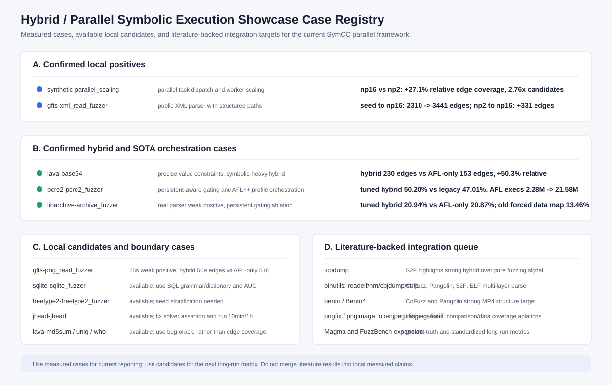

# 可体现当前并行符号执行工作的公开 testcase 补充清单

日期：2026-08-19  
目的：根据公开论文、公开 benchmark 与本仓库现有可执行目标，补充一套更完整的 testcase registry，用于后续汇报、长时实验和消融实验。本文只把本地已经跑出的结果称为“本地实测”；论文中的覆盖率和目标列表只作为选型依据。



## 筛选原则

本轮不是单纯罗列 benchmark，而是按“能否体现当前工作效果”筛选。入选 case 至少满足一个条件：

1. 能直接体现 MPI worker 扩展、任务调度、候选输入合并和 coverage triage。
2. 能体现 hybrid fuzzing 中符号执行对精确约束、结构化输入、复杂解析状态机的补充。
3. 能体现近期 SOTA 组件的价值，例如 AFL++ profile orchestration、persistent-aware gating、worker diversity/density balance、TopSeed/frontier、polyhedral/Z3 context reuse、S2F action seed。
4. 在 QSYM、PANGOLIN、CoFuzz/S2F、FuzzBench、Magma 或 Google Fuzzer Test Suite 中有公开使用基础。

## 结论摘要

当前最适合汇报的 case 分四组。

| 组别 | Case | 本地状态 | 最适合体现的工作效果 | 结论 |
|---|---|---|---|---|
| A. 并行框架强正例 | `synthetic-parallel_scaling` | 已构建、已 3 轮实测 | MPI 并行符号执行、任务派发、结果合并 | `np=16` 相比 `np=2` 覆盖相对提升约 `27.1%`，candidate 约 `2.76x` |
| A. 公开复杂 parser 并行正例 | `gfts-xml_read_fuzzer` | 已构建、已 3 轮实测 | 真实 XML parser 上并行符号执行扩展 | `np=16` 相比 seed 多 `1131` edges；相比 `np=2` 多 `331` edges |
| B. Hybrid 强正例 | `lava-base64` | 已构建、已 3 轮实测 | 符号执行突破精确值约束 | hybrid `230` edges vs AFL-only `153` edges，相对 AFL-only `+50.3%` |
| B. 真实 hybrid 编排正例 | `pcre2-pcre2_fuzzer` | 已构建、已 3 轮实测 | adaptive AFL/SymCC 资源划分、persistent-aware gating、AFL++ profile 编排 | tuned adaptive hybrid 比 legacy hybrid 覆盖 `+3.19pp`，AFL execs 从 `2.28M` 提升到 `21.58M` |
| B. 真实 parser 弱正例 | `libarchive-archive_fuzzer` | 已构建、已 1 轮实测 | persistent-aware gating 修复旧配置退化 | tuned hybrid `20.94%`，AFL-only `20.87%`，幅度小但方向正确 |
| B. 新增短时弱正例 | `gfts-png_read_fuzzer` | 已构建、已 1 轮补测 | PNG chunk/宽整数/CRC 结构，comparison/data coverage 长时候选 | 25s 单轮 hybrid `18.52%`，AFL-only `16.60%`；需多轮确认 |
| C. 已接入但暂不主打 | `sqlite-sqlite_fuzzer`, `freetype2-freetype2_fuzzer`, `jhead-jhead`, `lava-md5sum`, `lava-uniq`, `lava-who` | 已构建或已测试 | 筛选负例、长时候选、oracle/bug-count 候选 | 短时 edge coverage 下暂不支持强结论 |
| D. 需要新增接入 | `tcpdump`, `binutils` 的 `readelf/nm/objdump/strip`, `bento`, `pngfix/pngimage`, `openjpeg`, `libjpeg`, `libtiff`, `cyclonedds`, `imginfo`, Magma/FuzzBench 扩展目标 | 未完整接入 | 论文强候选、长时真实目标、bug/reached/triggered 指标 | 应作为下一阶段 P1/P2 接入队列 |

## 本地已验证正例

### `synthetic-parallel_scaling`

定位：最干净的并行符号执行扩展性 case。它不依赖 AFL 高吞吐，不受真实 parser 初始化成本和持久模式影响，因此最适合说明框架本身的 MPI task dispatch、worker 并行求解、coverage triage 与 corpus admission。

本地实测：

| 配置 | 轮次 | 平均 SymCC candidates | 平均 unique | 平均边覆盖 |
|---|---:|---:|---:|---:|
| MPI `np=2` | 3 | `974` | `455.3` | `16.67%` (`128/768`) |
| MPI `np=4` | 3 | `1560.7` | `623.3` | `17.58%` (`135/768`) |
| MPI `np=8` | 3 | `2284` | `905.0` | `19.88%` (`152.7/768`) |
| MPI `np=16` | 3 | `2688` | `1044.7` | `21.18%` (`162.7/768`) |

证据目录：`benchmark/evidence/current-advantage-2026-08-19/synthetic_scaling_mpi_r3/`

推荐汇报口径：这是框架级主图。强调同等短时预算下，worker 数增加后候选生成、去重输入和边覆盖同步增长。

### `gfts-xml_read_fuzzer`

定位：真实公开 parser 上的并行符号执行正例。XML 输入包含 token、属性、DTD/entity、namespace、CDATA、嵌套树结构和 XPath/validation 逻辑，能体现结构化输入路径扩展。

本地实测：

| 配置 | 轮次 | SymCC candidates | Unique retained | Edge coverage |
|---|---:|---:|---:|---:|
| seed | 3 | `0` | `20` | `4.54%` (`2310/50880`) |
| MPI `np=2` | 3 | `2664` | `1889` | `6.11%` (`3110/50880`) |
| MPI `np=4` | 3 | `3101` | `2201` | `6.21%` (`3161/50880`) |
| MPI `np=8` | 3 | `3527` | `2497` | `6.31%` (`3212/50880`) |
| MPI `np=16` | 3 | `5669` | `4041` | `6.76%` (`3441/50880`) |

证据目录：`benchmark/evidence/public-xml-parallel-r3-2026-08-19/`

推荐汇报口径：这是公开真实程序补充主图。它比 synthetic 更贴近真实解析器，又比 pcre2/libarchive hybrid 更少受 AFL persistent 吞吐支配。

### `lava-base64`

定位：最清楚的 hybrid 正例。LAVA-M `base64` 包含精确输入条件，AFL-only 短时靠随机变异不容易稳定跨过，符号执行能从路径约束中反推出新输入。

本地实测：

| Mode | NP | 轮次 | SymCC candidates | AFL execs | Edge coverage |
|---|---:|---:|---:|---:|---:|
| seed | 0 | 3 | `0` | `0` | `11.58%` (`126/1088`) |
| AFL-only | 8 | 3 | `0` | `2,147,017` | `14.06%` (`153/1088`) |
| Hybrid | 8 | 3 | `267` | `381,921` | `21.14%` (`230/1088`) |

证据目录：`benchmark/evidence/hybrid-advantage-lava-base64-symbolic-heavy-r3-2026-08-19/`

推荐汇报口径：这是“为什么需要符号执行补充 fuzzing”的主例。需要说明该配置是 symbolic-heavy 机制展示配置，不是默认 adaptive 资源最优配置。

### `pcre2-pcre2_fuzzer`

定位：真实 persistent+shmem 目标上的 SOTA 编排正例。它不一定在 45s 内超过 16 个 AFL 实例的极高吞吐上限，但非常适合展示近期改动：AFL++ profile orchestration、adaptive AFL/SymCC 资源划分、worker diversity/density balance、persistent-aware gating、TopSeed/frontier 快路径。

本地实测：

| 配置 | 轮次 | 平均边覆盖 | 平均 SymCC candidates | 平均 online interesting | 平均 AFL execs |
|---|---:|---:|---:|---:|---:|
| old adaptive full | 3 | `34.52%` (`3358/9728`) | `2688.7` | `296.7` | `301` |
| legacy hybrid | 3 | `47.01%` (`4573.7/9728`) | `5482` | `375` | `2,279,949` |
| tuned adaptive hybrid | 3 | `50.20%` (`4884/9728`) | `3065.7` | `249` | `21,575,645` |
| AFL-only full | 3 | `50.56%` (`4918.7/9728`) | `0` | `0` | `47,037,750` |

证据目录：`benchmark/evidence/current-advantage-2026-08-19/pcre2_hybrid_adaptive_default_tuned_r3/`

推荐汇报口径：主张“当前 hybrid 编排已经恢复 AFL 主吞吐，同时保留符号执行反馈”，不要主张“45s 内显著超过 AFL-only”。

### `libarchive-archive_fuzzer`

定位：真实 parser 弱正例，适合放在消融页。它证明 persistent-aware gating 修复了旧配置的灾难性退化，但单轮 `+9` edges 幅度太小，不能做强统计结论。

本地实测：

| 配置 | 轮次 | 边覆盖 | SymCC candidates | Online interesting | AFL execs |
|---|---:|---:|---:|---:|---:|
| AFL-only full | 1 | `20.87%` (`2859/13696`) | `0` | `0` | `32,141,971` |
| old adaptive full | 1 | `13.46%` (`1843/13696`) | `2315` | `135` | `466` |
| tuned adaptive hybrid | 1 | `20.94%` (`2868/13696`) | `1971` | `189` | `15,890,014` |

证据目录：`benchmark/evidence/current-advantage-2026-08-19/libarchive_hybrid_adaptive_default_tuned_r1/`

### `gfts-png_read_fuzzer`

定位：新增短时弱正例。PNG 目标来自 Google Fuzzer Test Suite 的 libpng 方向，本地 harness 会走 PNG signature、IHDR、IDAT/zlib、颜色类型、bit depth、interlace、palette/gray/alpha 等分支。它适合后续展示宽整数长度字段、chunk 类型比较、CRC/压缩结构、comparison hints 与符号执行候选的互补作用。

补测命令：

```bash
python3 benchmark/run_benchmark.py \
  --no-default --public \
  --targets gfts-png_read_fuzzer,sqlite-sqlite_fuzzer,freetype2-freetype2_fuzzer \
  --np-list 8 \
  --rounds 1 --timeout 25 \
  --output benchmark/evidence/showcase-supplement-screen-2026-08-19 \
  --skip-build --no-serial --no-mpi \
  --afl-only --hybrid --hybrid-adaptive \
  --aflpp-profiles full \
  --symcc-diversity --symcc-density-balance \
  --timeseries 10
```

本地实测：

| Mode | NP | 轮次 | SymCC candidates | AFL execs | Edge coverage |
|---|---:|---:|---:|---:|---:|
| seed | 0 | 1 | `0` | `0` | `12.99%` (`399/3072`) |
| AFL-only | 8 | 1 | `0` | `25,186,763` | `16.60%` (`510/3072`) |
| Hybrid adaptive | 8 | 1 | `732` | `10,260,985` | `18.52%` (`569/3072`) |

相对 AFL-only，hybrid 多 `59` 条边，增加 `1.92pp`，相对提升约 `11.6%`。这是目前新补测中最值得保留的新增 case，但它只有单轮 25s 数据；此前 30s 筛选中 PNG 曾出现 AFL-only 略高，因此当前结论必须写成“弱正例/候选正例”，正式汇报前应补 `3-10` 轮和更长时间窗口。

证据目录：`benchmark/evidence/showcase-supplement-screen-2026-08-19/`

## 已接入但不适合当前主打的 case

这些 case 仍要保留在测试矩阵中，因为它们能说明边界条件、负例和后续优化方向。

| Case | 本地状态 | 当前判断 | 后续使用方式 |
|---|---|---|---|
| `gfts-png_read_fuzzer` | 已构建，已补测 | 25s 单轮 hybrid 高于 AFL-only，但历史 30s 筛选不稳定 | 保留为弱正例候选；补 3-10 轮、10min/1h，并对齐 FuzzBench/ICSE23 libpng 版本和 seed |
| `sqlite-sqlite_fuzzer` | 已构建，已筛选 | AFL persistent 吞吐强，短时 edge coverage 下 hybrid 不占优 | 用长时 SQL 语法深层分支、dictionary/grammar seed、AUC 指标复测 |
| `freetype2-freetype2_fuzzer` | 已构建，已筛选 | candidates 增加但 coverage 基本不动 | 增加字体种子分层，改用 FuzzBench corpus |
| `jhead-jhead` | 已构建，已测试 | 论文强候选，但本地 60s AFL-only 更高；QSYM/SymCC 路径有 solver assertion 瓶颈 | 修复非关系型 branch 约束路径，对齐论文 seed，跑 10min/1h |
| `lava-md5sum` | 已构建，已筛选 | edge coverage 持平 | 改用 LAVA listed bug count / time-to-trigger |
| `lava-uniq` | 已构建，已筛选 | edge coverage 持平或 AFL-only 略高 | 改用 LAVA listed bug count / time-to-trigger |
| `lava-who` | 已构建，已筛选 | AFL-only 短时 edge coverage 明显更高 | 不用普通 coverage 做结论，转向 bug oracle |

## 需要新增接入的公开候选

### P1：最应该优先接入

| Case | 公开依据 | 为什么能体现当前工作 | 建议指标 |
|---|---|---|---|
| `tcpdump` | QSYM、PANGOLIN、S2F 都使用；S2F 指出 `tcpdump` 与 `jhead` 是 hybrid 相比 pure fuzzing 覆盖优势特别明显的 case | PCAP 语法检查复杂，适合 S2F action seed、target distance、constraint difficulty 调度 | edge coverage、AUC、time-to-new-edge |
| `jhead` 长时/修复版 | ICSE23/CoFuzz、PANGOLIN、S2F 均报告为强候选 | 当前已经接入，剩余瓶颈明确，修复后最可能成为真实程序 hybrid 强正例 | edge coverage、SymCC candidate retention、solver failure rate |
| `binutils`: `readelf`, `nm`, `objdump`, `strip` | ICSE23/CoFuzz、PANGOLIN、S2F 均使用 | ELF 多层格式解析适合并行路径调度、prefix DAG、polyhedral/Z3 context reuse | edge coverage、AUC、unique corpus、solver reuse hit rate |
| `bento`/Bento4 | ICSE23/CoFuzz 与 PANGOLIN 都显示 MP4 parser 是 hybrid 强候选 | MP4 box 层次结构深，适合结构化路径规划和目标导向调度 | edge coverage、AUC、deep box type coverage |
| `pngfix`/`pngimage` | S2F 使用；与 libpng 方向一致 | PNG chunk、CRC、宽整数长度字段适合 comparison/data coverage 与约束解算组合 | edge coverage、chunk-type coverage、dictionary/hint ablation |

### P2：扩展真实目标和 bug-centric 指标

| Case | 公开依据 | 为什么值得接入 | 建议指标 |
|---|---|---|---|
| `openjpeg` | QSYM 真实程序、S2F 目标、SymCC paper 相关方向 | JPEG2000 结构复杂，适合长时约束复用和 target distance | edge coverage、AUC、candidate retention |
| `libjpeg`/`djpeg` | PANGOLIN/CoFuzz/S2F 使用 | JPEG marker 与 Huffman 表解析适合 comparison 与 symbolic bytes | edge coverage、format-state coverage |
| `libtiff`/`imginfo` | PANGOLIN/CoFuzz/S2F 使用 | TIFF IFD/tag 结构适合结构化调度 | edge coverage、tag-kind coverage |
| `cyclonedds` | CoFuzz/S2F 使用 | IDL grammar 与解析状态机复杂 | grammar-state coverage、edge coverage |
| Magma `libpng/libtiff/libxml2/sqlite3/openssl/php/poppler` | Magma 是 real programs + real bugs + ground-truth instrumentation | 适合把单纯覆盖率补充为 reached/triggered 指标 | reached/triggered、time-to-trigger、AUC |
| FuzzBench `harfbuzz`, `jsoncpp`, `lcms`, `libjpeg-turbo`, `libpcap`, `openssl_x509`, `php_php-fuzz-parser`, `re2`, `woff2`, `zlib` | FuzzBench 官方 benchmark 列表 | 标准化目标，适合未来做多轮统计和跨工具对比 | edge coverage、coverage AUC、统计检验 |

## 推荐执行矩阵

第一阶段用于汇报当前成果：

```bash
# 并行符号执行框架
python3 benchmark/run_benchmark.py \
  --no-default --public \
  --targets synthetic-parallel_scaling,gfts-xml_read_fuzzer \
  --np-list 2,4,8,16 \
  --rounds 3 --timeout 30 \
  --skip-build --no-serial --timeseries 15

# Hybrid 明显正例
python3 benchmark/run_benchmark.py \
  --no-default --public \
  --targets lava-base64 \
  --np-list 8 \
  --rounds 3 --timeout 60 \
  --skip-build --no-serial --no-mpi \
  --afl-only --hybrid \
  --hybrid-afl-instances 1 \
  --aflpp-profiles off --timeseries 20

# 真实目标 SOTA 编排消融
python3 benchmark/run_benchmark.py \
  --no-default --public \
  --targets pcre2-pcre2_fuzzer,libarchive-archive_fuzzer \
  --np-list 16 \
  --rounds 3 --timeout 45 \
  --skip-build --no-serial --no-mpi \
  --hybrid --hybrid-adaptive --aflpp-profiles full \
  --symcc-diversity --symcc-density-balance --timeseries 15
```

第二阶段用于补齐论文强候选：

1. 优先修复并长时复测 `jhead`。
2. 接入 `tcpdump` 和 binutils 四目标。
3. 接入 `bento` 与 `pngfix/pngimage`。
4. 接入 Magma 的 `libpng/libxml2/sqlite3`，用 reached/triggered 替代单一 edge coverage。
5. 把 FuzzBench 的 `harfbuzz/jsoncpp/lcms/libjpeg-turbo/libpcap/openssl_x509/php/re2/woff2/zlib` 作为标准化长期矩阵。

## 机器可读 registry

同步产物：`benchmark/showcase_cases_2026_08_19.json`

字段约定：

- `status`: `measured-positive`, `measured-weak-positive`, `measured-negative`, `available-candidate`, `integration-candidate`。
- `evidence_kind`: `local-measured` 表示本仓库数据；`literature` 表示公开论文/benchmark 依据；`mixed` 表示两者都有。
- `recommended_use`: 建议在汇报或后续测试中的角色。

## 参考资料

- QSYM: A Practical Concolic Execution Engine Tailored for Hybrid Fuzzing, USENIX Security 2018: https://www.usenix.org/conference/usenixsecurity18/presentation/yun
- Evaluating and Improving Hybrid Fuzzing, ICSE 2023 / CoFuzz: https://shadowmydx.github.io/papers/icse23main-p966.pdf
- PANGOLIN: Incremental Hybrid Fuzzing with Polyhedral Path Abstraction, IEEE S&P 2020: https://wcventure.github.io/FuzzingPaper/Paper/SP20_PANGOLIN.pdf
- S2F: Principled Hybrid Testing With Fuzzing, Symbolic Execution, and Sampling, arXiv 2026: https://arxiv.org/pdf/2601.10068
- Google Fuzzer Test Suite: https://github.com/google/fuzzer-test-suite
- FuzzBench benchmark list: https://google.github.io/fuzzbench/reference/benchmarks/
- Magma: https://hexhive.epfl.ch/magma/
