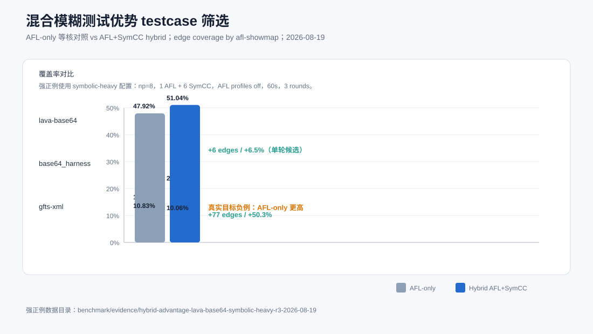

# 混合模糊测试优势 testcase 筛选记录

日期：2026-08-19  
目标：寻找能够体现“加入符号执行后，覆盖率明显高于纯 fuzzing”的 testcase。



## 结论摘要

当前最适合做 hybrid 覆盖率提升主案例的是：

| 推荐级别 | Testcase | 配置 | 结论 |
|---|---|---|---|
| 强正例 | `lava-base64` | np=8，1 AFL + 6 SymCC，AFL profiles off，60s，3 rounds | hybrid 21.14% / 230 edges，AFL-only 14.06% / 153 edges，提升 77 edges，约 +50.3% 相对 AFL-only |
| 弱候选 | `lava-base64_harness` | 同上，60s，1 round | hybrid 51.04% / 98 edges，AFL-only 47.92% / 92 edges，提升 6 edges；需要更多轮确认 |
| 真实程序负例 | `jhead-jhead` | ICSE23 真实 JPEG 目标，np=8，60s，profiles off/full | 已接入并测试；AFL-only 33.93%-34.49%，hybrid 32.81%-32.87%，当前不适合作为强正例 |
| 不推荐做强正例 | `gfts-xml_read_fuzzer` | symbolic-heavy 60s 或 adaptive full 30s | SymCC 有输入流，但等核 AFL-only 覆盖更高 |
| 不推荐做强正例 | `pcre2`, `sqlite`, `libarchive`, `gfts-png` | adaptive full 30s，np=8 | hybrid 与 AFL-only 接近或略低，不支持“明显提升” |
| 不推荐做强正例 | `lava-md5sum`, `lava-uniq`, `lava-who` | adaptive full 30s，np=8/16 | md5sum/uniq 无 SymCC 覆盖优势；who 的 edge coverage 明显低于 AFL-only |

2026-08-19 追加补测：`benchmark/evidence/showcase-supplement-screen-2026-08-19/` 中，`gfts-png_read_fuzzer` 在 25s 单轮 adaptive hybrid 下达到 `18.52%` (`569/3072`)，AFL-only 为 `16.60%` (`510/3072`)。由于该结果与此前 30s 筛选不完全一致，PNG 目前应归为“弱正例候选”，不能替代 `lava-base64` 的强主例。

## 强正例：LAVA-M base64

实验命令：

```bash
python3 benchmark/run_benchmark.py \
  --no-default --public \
  --targets lava-base64 \
  --np-list 8 \
  --rounds 3 --timeout 60 \
  --output benchmark/evidence/hybrid-advantage-lava-base64-symbolic-heavy-r3-2026-08-19 \
  --skip-build --no-serial --no-mpi \
  --afl-only --hybrid \
  --hybrid-afl-instances 1 \
  --aflpp-profiles off \
  --timeseries 20
```

3 轮均值：

| Mode | NP | Time | SymCC candidates | AFL executions | Unique | Showmap coverage |
|---|---:|---:|---:|---:|---:|---:|
| seed | 0 | 0.0s | 0 | 0 | 13 | 11.58% (126/1088) |
| AFL-only | 8 | 60.1s | 0 | 2,147,017 | 546 | 14.06% (153/1088) |
| Hybrid | 8 | 61.1s | 267 | 381,921 | 363 | 21.14% (230/1088) |

相对 AFL-only：

- edge 数量：153 -> 230，增加 77 条边。
- 覆盖率：14.06% -> 21.14%，增加 7.08 个百分点。
- 相对提升：约 50.3%。

这个 testcase 适合做 hybrid 原理展示，因为 LAVA-M base64 包含精确输入值检查，纯随机变异很难稳定跨过；SymCC 可以从实际路径约束中反推出满足条件的输入，补上 AFL-only 难以到达的路径。

需要注意：本配置是 symbolic-heavy 机制展示配置，不是当前默认 adaptive hybrid 最优配置。配置刻意关闭 AFL profiles，并固定 `1 AFL + 6 SymCC worker`，目的是隔离“符号执行加入后”的贡献。

## 弱候选：base64 harness

单轮 symbolic-heavy 筛选结果：

| Mode | NP | Showmap coverage |
|---|---:|---:|
| seed | 0 | 38.02% (73/192) |
| AFL-only | 8 | 47.92% (92/192) |
| Hybrid | 8 | 51.04% (98/192) |

它也能体现符号执行对精确条件的帮助，但总边数只有 192，6 条边的差异容易受运行波动影响；默认 adaptive 3 轮确认中没有稳定超过 AFL-only。因此它只能作为辅助案例，不建议做主案例。

## 已排除的强正例候选

### jhead JPEG 真实程序目标

本轮已把 ICSE23 中的 `jhead` 目标接入 public benchmark：

- SymCC：`benchmark/public/bin/jhead/jhead`
- AFL：`benchmark/public/bin/jhead-afl/jhead`
- CmpLog：`benchmark/public/bin/jhead-cmplog/jhead`
- AFL++ variants：`jhead-afl-laf`, `jhead-afl-ctx`, `jhead-afl-ngram4`, `jhead-afl-laf-ctx`
- seeds：`benchmark/public/seeds/jhead/jhead`，14 个 JPEG 样本。

60s symbolic-heavy 结果：

| Mode | NP | Showmap coverage |
|---|---:|---:|
| seed | 0 | 22.15% (397/1792) |
| AFL-only | 8 | 33.93% (608/1792) |
| Hybrid | 8 | 32.87% (589/1792) |

60s full-profile 结果：

| Mode | NP | Showmap coverage |
|---|---:|---:|
| seed | 0 | 22.10% (396/1792) |
| AFL-only | 8 | 34.49% (618/1792) |
| Hybrid | 8 | 32.81% (588/1792) |

判断：`jhead` 是论文中的强候选，但当前本地短时实验没有复现 hybrid 覆盖优势。主要瓶颈是 SymCC/QSYM 对该目标贡献太少：单 seed 冒烟能生成 1 个输入，但 QSYM 在非关系型 branch 上断言退出；完整 hybrid 轮次只有 1 个 peer-published 输入，AFL 未完成导入。因此它应作为真实程序接入和瓶颈分析 case，而不是汇报主正例。

### 当前默认 adaptive full 等核筛选

配置：

```bash
python3 benchmark/run_benchmark.py \
  --no-default --public \
  --np-list 8 \
  --rounds 1 --timeout 30 \
  --skip-build --no-serial --no-mpi \
  --afl-only --hybrid --hybrid-adaptive \
  --aflpp-profiles full \
  --symcc-diversity --symcc-density-balance
```

结果摘要：

| Target | AFL-only | Hybrid | 判断 |
|---|---:|---:|---|
| `gfts-png_read_fuzzer` | 17.15% (527/3072) | 16.70% (513/3072) | AFL-only 更高 |
| `sqlite-sqlite_fuzzer` | 21.40% (6753/31552) | 20.57% (6491/31552) | AFL-only 更高 |
| `libarchive-archive_fuzzer` | 16.92% (2318/13696) | 16.87% (2311/13696) | 近似持平，AFL-only 略高 |
| `pcre2-pcre2_fuzzer` | 48.08% (4677/9728) | 47.93% (4663/9728) | 近似持平，AFL-only 略高 |
| `gfts-xml_read_fuzzer` | 10.34% (5262/50880) | 10.25% (5214/50880) | 近似持平 |

这些目标仍然有 SymCC candidate / interesting 输入，说明反馈链路在工作；但短时等核 edge coverage 主要由 AFL persistent 吞吐决定，因此不适合证明“hybrid 明显超过纯 fuzzing”。

### LAVA-M 其他目标

默认 adaptive full 筛选：

| Target | AFL-only best | Hybrid best | 判断 |
|---|---:|---:|---|
| `lava-md5sum` | 7.37% (99/1344) | 7.37% (99/1344) | 持平 |
| `lava-uniq` | 10.61% (129/1216) | 10.53% (128/1216) | AFL-only 略高 |
| `lava-who` | 44.55% (4762/10688) | 26.67% (2850/10688) | AFL-only 明显更高 |

这些不适合用 edge coverage 展示 hybrid 优势。`lava-who` 后续更适合用 bug-trigger count 而不是普通 edge coverage。

## 推荐汇报口径

1. 用 `lava-base64` symbolic-heavy 配置作为“hybrid fuzzing 为什么有用”的强主例。
2. 说明该 case 的技术本质：AFL-only 难以跨过精确值约束；SymCC 从路径条件生成满足分支的输入，扩展覆盖。
3. 明确区分两类结论：
   - 机制正例：`lava-base64`，hybrid 明显高于 AFL-only。
   - 真实高吞吐 parser：pcre2/sqlite/libarchive/XML/PNG，当前短时等核下 AFL-only 通常持平或略高；这些目标适合展示 hybrid 反馈链路、persistent-aware gating 和 SOTA 编排，而不是“覆盖率显著超过 AFL-only”。
4. 后续应新增一个结构化协议 maze benchmark，把宽整数比较、`memcmp`、checksum、跨字段依赖和多子目标结合起来，形成比 LAVA-M 更复杂、比真实 persistent parser 更可控的 hybrid 正例。

## 产物

- 强正例确认：`benchmark/evidence/hybrid-advantage-lava-base64-symbolic-heavy-r3-2026-08-19/`
- symbolic-heavy 筛选：`benchmark/evidence/hybrid-advantage-symbolic-heavy-screen-2026-08-19/`
- 默认 adaptive 筛选：`benchmark/evidence/hybrid-advantage-screen-2026-08-19/`
- LAVA-M 默认筛选：`benchmark/evidence/hybrid-advantage-lava-screen-2026-08-19/`
- 真实目标默认筛选：`benchmark/evidence/hybrid-advantage-real-screen-2026-08-19/`
- jhead 默认 profiles 筛选：`benchmark/evidence/hybrid-advantage-jhead-screen-2026-08-19/`
- jhead full profiles 筛选：`benchmark/evidence/hybrid-advantage-jhead-fullprofiles-2026-08-19/`
- 本轮补充测试记录：`docs/codex/Public_Hybrid_Case_Supplement_Test_2026-08-19.md`
