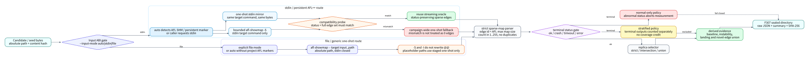

# F307 Input-ABI and Terminal-Stratified Coverage Oracle

本文记录 2026-08-06 新增的 F307 机制：AFL++ 覆盖率 oracle 的输入 ABI 对齐、终端状态
分层，以及由此带来的 QA3 证据修正。它是 F306 之后的正确性加固，不改写 F306 的历史
结论，而是解释为什么同一个 XML 输入在不同 harness 入口下会得到不同边集，并把当前
测量流程固定为可复算的 schema v2。

[PNG 版本](diagrams/input-abi-terminal-strata-2026-08-06.png)；[DOT 图源](diagrams/input-abi-terminal-strata-2026-08-06.dot)。

## 1. 问题背景

F306 已经解决了“showmap 失败不能伪装成 0 覆盖”的问题，但后续真实复验发现另一个更隐蔽
的问题：同一份输入字节并不等价于同一种 target 调用 ABI。项目里的 google-fts XML harness
同时支持两条入口：

| 入口 | 目标命令形态 | 输入来源 | 语义 |
| --- | --- | --- | --- |
| persistent stdin | `afl-showmap ... -- xml_read_fuzzer` | AFL persistent shared memory / stdin 字节 | 项目 AFL 插桩二进制的主 fuzzing 入口 |
| file route | `afl-showmap ... -- xml_read_fuzzer seed.xml` | argv[1] 文件路径 | harness 的离线文件读取入口 |
| streaming `-S` | `afl-showmap -S ... -- xml_read_fuzzer` | AFL++ streaming request body | 理论上应复用 persistent 入口，但当前 XML target 会 timeout |

在本机 AFL++ 4.40c 上，`afl-showmap` 对 `@@` 也有工具级限制：一次性 direct `@@`
会报“该工具不支持 @@ 语法”，streaming `-S -- target @@` 虽返回 `ok`，但只观测到 2 条边，
显然不是目标 XML 路径。因此 F307 的原则是：输入 ABI 必须显式建模；不允许通过 `@@`
在 streaming 或 batch 模式里猜测 AFL++ 会替我们改写 target argv。

## 2. 当前执行流程

1. `run_qa3_coverage_campaign.py` 读取 seed、corpus 和目标二进制，先按绝对路径排除
   baseline seed，避免 seed 同时进入候选分母。F306 的 20 个 nominal output 因此在 F307
   修正为 19 个候选 output；`unique_measured_inputs` 仍为 20，因为 baseline 仍要测。
2. `StreamingCoverageOracle` 调用 `detect_afl_input_mode(binary, requested)` 解析输入 ABI。
   `--input-mode stdin` 或检测到项目 AFL SHM / persistent marker 时走 stdin；`--input-mode file`
   或未检测到项目标记时走文件模式。这个 auto 规则是项目 harness 约定；通用第三方 target
   应显式传 `--input-mode`。
3. stdin 模式先做兼容探针：同一输入分别走 bounded streaming `-S` 和 one-shot stdin。
   只有二者的 terminal status 和完整 edge-ID 集合都一致，后续 campaign 才复用 streaming。
   任一状态或边集不一致，整个 campaign 统一 fallback 到 one-shot，避免前半段 streaming、
   后半段 isolated 的混合测量。
4. file 模式不创建 streaming 客户端，直接使用 `afl-showmap -- target absolute_input_path`，
   并关闭 stdin。MPI helper 的 one-shot 文件路径也通过临时 staged file 替换 placeholder；
   batch `-I` 遇到 placeholder 直接返回空结果，不把不可验证的文件 ABI 当成 stdin ABI。
5. 所有 sparse map 都通过 `parse_sparse_edge_rows` 严格解析：行格式必须是 `edge:count`；
   edge id 小于 AFL++ 最大 map size 上限，hit count 在 1..255，无重复 edge，无空 map。
   这里区分两个资源边界：`MAX_EDGES=1<<20` 限制返回的 sparse 记录数，`MAX_MAP_SIZE=1<<23`
   限制合法 AFL edge id 范围。
6. `coverage_status_is_eligible` 决定 terminal status 的处理。`normal-only` 策略下，
   baseline 或候选出现 `crash`、`timeout`、`error` 会 fail closed；`stratified` 策略下，
   terminal 输出被计入 `terminal_outputs` / `excluded_terminal_outputs`，但不参与 landing、
   novel edge union 和 exclusive edge 归因。
7. 每个输入按轮次交错复测，保留全部 replica。默认 `intersection` 选择器只使用多次运行都
   出现的边；`strict` 要求所有 replica 完全一致；`union` 只表达“可能覆盖”，不适合保守归因。

## 3. 实现位置

| 模块 | F307 变更 |
| --- | --- |
| `util/afl_streaming_showmap.py` | bounded streaming 客户端拒绝 `@@` target；保留 status；严格解析 binary/text sparse edge；`get_edges()` 只兼容返回正常非空边集 |
| `benchmark/qa3_repro/qa3_common.py` | 输入 ABI 自动/显式解析、file/stdin one-shot 分流、terminal status policy、bounded input read、schema v2 共同基础 |
| `benchmark/run_qa3_coverage_campaign.py` | `--input-mode`、`--terminal-status-policy`、baseline seed 排除、normal/terminal 分层指标、raw/summary v2 |
| `benchmark/qa3_repro/landing*.py`, `iterate2.py` | 继承 ABI 和 terminal policy，使旧入口不会绕过新语义 |
| `util/mpi_fuzzing_helper.py` | batch/streaming triage 不再默默吞掉 terminal；streaming 快路径只接受 `ok`；batch fast path 的候选先用 status-preserving streaming 重验后再合并 bitmap |
| `test/test_qa3_repro.py`, `test/test_afl_profile_orchestration.py` | 覆盖 stdin/file 调用 ABI、`@@` 拒绝、strict parser、terminal 分层和 campaign v2 统计 |

## 4. 为什么 F306 与 F307 数字不同

差异来自两类修正，不是算法覆盖能力突然变化。

| 观测 | F306 历史证据 | F307 当前证据 | 原因 |
| --- | ---:| ---:| --- |
| isolated probe edges | 1019 | 935 | F306 probe 走文件 argv 入口；F307 probe 与 persistent stdin ABI 对齐 |
| streaming probe | timeout / 933 edges | timeout / 933 edges | streaming `-S` 仍与目标不兼容，因此继续 fallback |
| baseline selected/union | 1018 / 1020 | 934 / 935 | baseline 入口从文件路由修正为 stdin 路由 |
| candidate outputs | 20 | 19 | F307 排除了 corpus 中与 baseline seed 同路径的重复候选 |
| nominal landing | 19 / 20 | 19 / 19 | 分母修正，19 个真实候选全部有 seed-novel edge |
| novel edge union | 1378 | 1374 | ABI 变化和分母修正共同影响边集 |

因此，F306 仍是历史上“fail-closed streaming oracle”的有效证据；F307 是当前应引用的
ABI 对齐测量证据。汇报中如果讨论当前实现，应优先使用 F307 的 schema v2 数字。

## 5. 真实 evidence 结果

F307 证据目录为
[`evidence/f307-input-abi-terminal-stratification-2026-08-06/`](evidence/f307-input-abi-terminal-stratification-2026-08-06/)。
内容包括 `raw-campaign.json`、`summary.json`、`README.md` 与 `SHA256SUMS.txt`。

| 项目 | 数值 |
| --- | --- |
| target SHA-256 | `68269c89d36da5046f1de0531ddab8b06775c4518f5272ff0aaeae5a24dd7e2f` |
| seed SHA-256 | `b97f4b93891b87eae9974d4922628b4cbd47cff79350a09253489acfcc10db33` |
| afl-showmap SHA-256 | `feedfc2f5b2825fd7badeb098aa8b25c1857dc3e3afe8159688786997833791b` |
| rounds / delay | 3 / 1000 ms |
| input mode | `stdin` |
| terminal status policy | `normal-only` |
| campaign / probe observations | 60 / 2 |
| oracle mode | `one-shot`，1 次 campaign-wide fallback |
| streaming probe | `timeout`，933 edges |
| isolated probe | `ok`，935 edges |
| baseline selected / union | 934 / 935 edges |
| unstable inputs / events | 20 / 57 |
| nominal outputs | 19 outputs，19 normal，0 terminal-excluded |
| nominal landing | 19 / 19，`landing_rate_ppm=1000000` |
| nominal novel edge union | 1374 |
| nominal novel edges per normal output | `72315789 ppm` |

该 evidence 只验证覆盖 oracle 与统计口径，不证明某个求解策略提速。当前 corpus 标签全为
`nominal`，因此 exclusive novel edges 等于 nominal novel union；如果后续引入多策略语料，
同一 schema 可以直接比较每个策略的 normal output、terminal output 和互补边。

## 6. 测试与边界

F307 当前门禁：

| 测试 | 结果 |
| --- | --- |
| `python3 -m unittest discover -s test -p 'test_qa3_repro.py' -v` | 19 passed |
| `python3 -m unittest discover -s test -p 'test_afl_profile_orchestration.py' -v` | 31 passed |
| `ruff check util/afl_streaming_showmap.py util/mpi_fuzzing_helper.py benchmark/qa3_repro benchmark/run_qa3_coverage_campaign.py test/test_qa3_repro.py test/test_afl_profile_orchestration.py` | passed |
| `python3 -m unittest discover -s test -p 'test_*.py' -v` | 540/540 passed，83.144 s |
| `PATH=/usr/lib/llvm-18/bin:$PATH lit -sv -j16 build/test` | 221 passed + 1 unsupported，136.93 s |
| `PATH=/usr/lib/llvm-17/bin:$PATH lit -sv -j16 build-llvm17/test` | 220 passed + 2 unsupported，138.14 s |

F307归档时虚拟环境尚未安装 pytest，因此上表采用测试文件原生的 `unittest discover`
路径。F308开发前已安装 pytest，并复跑F307两组pytest入口：50项通过、28个subtest通过。
F307本身只改 QA3/MPI coverage oracle 与文档，不新增 `SYMCC_*` 配置名；当时
`Configuration.txt` 为388个唯一名称。后续F308新增配置名后，当前总数以
[`Current_Technology_Compendium.md`](Current_Technology_Compendium.md) 和
[`Configuration.txt`](../Configuration.txt) 为准。

## 7. 后续研究价值

F307 的价值不在覆盖数本身，而在测量体系变得更接近科研可复现要求：

1. 输入 ABI 进入 schema，避免 persistent target、file harness 和 AFL++ 工具协议互相混用；
2. terminal 结果进入分层统计，避免 crash/timeout 被误归因成“没有新覆盖”；
3. streaming 快路径必须先由同 ABI one-shot 证明，失败时 campaign 统一回退；
4. MPI worker/master bitmap 更新前增加状态可见的覆盖验证，减少异常候选污染全局覆盖图；
5. F306 与 F307 的历史差异被文档化，后续报告可以明确引用“当时 evidence”和“当前 evidence”。

后续若要把该机制推进到 R 级实验，应在同一 harness ABI 下重跑多策略、等 CPU、独立随机种子
的确认性实验，并把 terminal stratum 作为单独 outcome 报告。
