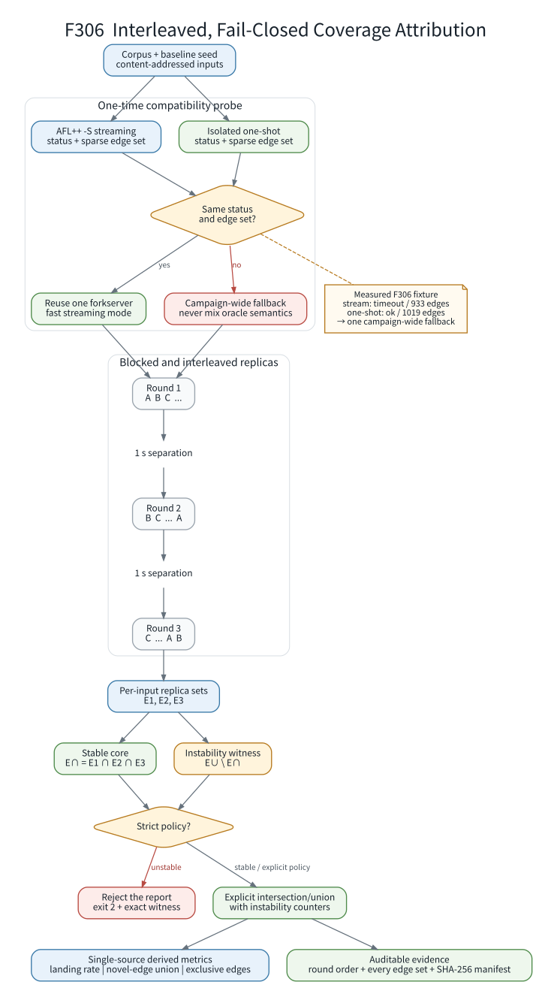

# F306：交错复测与 fail-closed 覆盖率归因 oracle

- 功能编号：F306
- 状态：I/T/E-mechanism
- 日期：2026-08-05
- 适用范围：QA3 benchmark、AFL coverage triage、MPI worker 流式 showmap 客户端
- 结论边界：证明测量协议、稳定性审计和原始证据链；不把单一 nominal corpus
  表述为求解策略、覆盖率或漏洞发现性能提升

## 1. 为什么需要这一轮修复

全目录 Ruff 扫描首先在 `benchmark/qa3_repro` 的四个历史脚本中发现 42 个问题。
格式问题之外，审查确认了会改变科研结论的行为：

1. `afl-showmap` 返回码、空 map 和畸形行没有严格检查，失败会被静默解释为“没有新边”；
2. `iterate.py`/`iterate2.py` 未处理执行超时和缺失遥测，文件未关闭，异常时临时目录不清理；
3. `iterate2.py` 复用固定 `m.txt`，失败后可能读取旧 map；
4. `landing.py` 与 `landing2.py` 各自重新运行 corpus，因此 landing 与 exclusive-edge
   数字并非来自同一组观测；
5. 每个输入的副本连续执行，无法检出按时间相关的 coverage 漂移；
6. MPI `StreamingShowmap` 丢弃协议状态字，对 stdout/stderr 长度没有上界，损坏响应可
   诱导超大读取；协议读取也没有独立 wall-clock deadline；
7. 流式模式是否适合当前目标未经验证。真实 XML fixture 中，流式观测为
   `timeout/933 edges`，隔离观测为 `ok/1019 edges`。直接混用会系统性低估覆盖率。

这些问题解释了为什么“脚本能运行”不等于“数字可归因”。F306 的目标是把 showmap
从工具调用改造成有状态、有边界、可拒绝、可重算的实验 oracle。



## 2. 受界 AFL++ 流式协议

`util/afl_streaming_showmap.py` 从 MPI helper 中抽出通用客户端，同时保持原有
`get_edges()` 兼容接口。新增 `get_result()` 完整解析 AFL++ `-S` 协议：

```text
request  = u32(length) || input_bytes
response = u16(status)
        || u32(edge_count) || edge_count * (u32(edge_id), u8(hit_count))
        || u32(stdout_length) || stdout
        || u32(stderr_length) || stderr
```

状态低 2 位分别表示正常、超时和崩溃，高 8 位保存退出码或信号；保留位非零、未知状态、
EOF 或短读均使当前 oracle 失效并最多重启一次。硬边界为：

| 对象 | 上界 |
|---|---:|
| 单输入 | 16 MiB |
| sparse edge 数 | 1,048,576 |
| stdout / stderr 各自 | 4 MiB |
| 单查询读取 deadline | 目标 timeout + 5 s grace |

关闭时主动终止 forkserver 并限时等待，避免 benchmark 完成后额外悬挂。MPI worker 仍只
消费 edge list，因此抽取不改变本地去重语义；QA3 则使用状态和边集执行兼容性审计。
即使一次调用开始时会话已经失效，该调用也至多重启一次；真实pipe的`select`/fd错误
直接终止协议，只有无文件描述符的内存测试流允许同步读取。

one-shot文本map也执行同级别的严格解析：edge ID必须在map范围内，hit count必须在
1--255，重复edge行和空map均拒绝。符号执行telemetry采用1 MiB受界读取，再校验JSON
对象与两个无符号64位计数，避免超大或类型错误的结果进入代际统计。

## 3. 一次性兼容性探针

一个 campaign 的首个输入同时经过流式和隔离 one-shot oracle。只有状态与 edge-ID 集合
完全相同，后续才复用同一 forkserver。任一条件不满足则：

1. 关闭流式 oracle；
2. 整个 campaign 一次性切换到 one-shot；
3. 记录两侧状态、edge 数、fallback 原因和累计重启；
4. 禁止在同一结果中混合两种 oracle 语义。

这里比较 edge-ID 集合而非仅比较 edge 数。两个集合可能大小相同但元素不同；F306
真实观测多次出现“计数不变、差集非空”，只看 tuple count 会漏报漂移。

## 4. 分轮交错复测

设 corpus 为 `P = [p0, ..., pn-1]`，第 `r` 轮使用循环位移顺序：

```text
pi_r(P) = [p_(r mod n), ..., p_(n-1), p_0, ..., p_(r-1)]
```

默认执行 3 轮，轮间隔 1 秒。它同时改变输入相对位置并跨越短期时间相关状态，避免
`p0,p0,p0,p1,p1,p1` 这种连续副本共同落入同一噪声阶段。对输入 `p` 的三组边集
`E1(p), E2(p), E3(p)` 定义：

```text
stable(p)   = E1(p) intersection E2(p) intersection E3(p)
possible(p) = E1(p) union E2(p) union E3(p)
drift(p)    = possible(p) - stable(p)
```

三种显式策略为：

- `strict`：`drift(p)` 非空即退出 2，并报告输入、每轮 edge 数和差集大小；
- `intersection`：使用稳定交集，同时保留 union 和不稳定边计数；
- `union`：研究者显式选择可能边集合；该模式可能高估稳定覆盖，不能伪装成默认值。

默认仍为 `strict`。交集与并集必须在命令行显式选择。

## 5. 单一数据源的归因指标

`benchmark/run_qa3_coverage_campaign.py` 只运行一次 campaign，再从同一组集合计算：

```text
landing_rate(s) = |{x in strategy s : E(x) - E(seed) != empty}| / |s|
novel_union(s)  = union over x in s of (E(x) - E(seed))
exclusive(s)    = novel_union(s) - union over t != s of novel_union(t)
```

`raw-campaign.json` 保存轮换顺序、每个输入每轮的完整 edge-ID 集合、最终选择集合及输入
SHA-256；`summary.json` 保存从这些集合派生的计数；`SHA256SUMS.txt` 对证据目录验签。
因此 landing、互补性和稳定性不再依赖两个独立进程的终端文本。

## 6. 实现位置

| 文件 | 作用 |
|---|---|
| `util/afl_streaming_showmap.py` | 受界 `-S` 协议、状态保留、deadline、重启与兼容 edge API |
| `util/mpi_fuzzing_helper.py` | 使用抽出的兼容客户端，删除本地重复实现 |
| `benchmark/qa3_repro/qa3_common.py` | 严格 map/telemetry 解析、oracle 探针、交错复测和集合归并 |
| `benchmark/qa3_repro/landing.py` | 从一次交错 campaign 计算落地率 |
| `benchmark/qa3_repro/landing2.py` | 从一次交错 campaign 计算互补边 |
| `benchmark/qa3_repro/iterate*.py` | 结构化 CLI、严格遥测、完整清理和 coverage oracle |
| `benchmark/run_qa3_coverage_campaign.py` | 原始 JSON、统一指标、工具/目标哈希和证据清单 |
| `test/test_qa3_repro.py` | 解析、状态、fallback、交错顺序、集合策略和 driver 测试 |
| `test/test_afl_profile_orchestration.py` | MPI 兼容接口、状态解码、超界响应和重启测试 |

## 7. 真实机制实验

证据目录：
[`evidence/f306-interleaved-coverage-oracle-2026-08-05/`](evidence/f306-interleaved-coverage-oracle-2026-08-05/README.md)

固定对象：

| 项目 | 值 |
|---|---|
| 目标 | Google FTS `xml_read_fuzzer` AFL build |
| 目标 SHA-256 | `68269c89d36da5046f1de0531ddab8b06775c4518f5272ff0aaeae5a24dd7e2f` |
| baseline seed SHA-256 | `b97f4b93891b87eae9974d4922628b4cbd47cff79350a09253489acfcc10db33` |
| `afl-showmap` SHA-256 | `feedfc2f5b2825fd7badeb098aa8b25c1857dc3e3afe8159688786997833791b` |
| 输入 / 轮数 / 轮间隔 | 20 / 3 / 1000 ms |
| 正式观测 / 探针 / 总观测 | 60 / 2 / 62 |

兼容性探针结果：

| oracle | 状态 | edge 数 |
|---|---:|---:|
| streaming | timeout | 933 |
| isolated one-shot | ok | 1019 |

因此本轮记录 `status-mismatch+edge-set-mismatch`，执行 1 次 campaign-wide fallback，
正式 60 次观测均为 `ok`，没有流式重启。

交集策略结果：

| 指标 | 值 |
|---|---:|
| baseline intersection / union | 1018 / 1020 |
| 存在漂移的输入 | 11 / 20 |
| 不稳定边事件 | 46 |
| nominal 输入相对 seed 有新边 | 19 / 20（95%） |
| nominal seed-novel edge union | 1378 |

严格稳定性为 `false`，因此默认 `strict` 会拒绝这份报告；上述覆盖率数字只在显式
`intersection` 策略下成立。corpus 没有 nominal 以外的策略标签，所以
`exclusive_novel_edges=1378` 只是单组集合恒等式，不能证明任何求解策略互补性或优势。

## 8. 测试与验证

本轮定向结果：

- `test/test_qa3_repro.py`：16/16；
- `test/test_afl_profile_orchestration.py`：26/26；
- Python `unittest` 全量：532/532，83.282 s；
- LLVM 18 lit 全量：221 passed + 1 expected unsupported，133.39 s；
- LLVM 17 lit 全量：220 passed + 2 expected unsupported，133.89 s；
- Ruff：`util/ benchmark/ test/` 全目录清零；
- F306 证据目录 SHA-256 清单：全部通过；
- 真实 `strict` 运行能够检出跨轮漂移并返回 2；
- 真实 `intersection` 运行完成且保留每一轮完整边集。

三套全量门禁均按 Python、LLVM 18、LLVM 17 的顺序执行，避免并发资源争用；LLVM 的
unsupported 分别来自已有的 QSYM-only/simple backend 限制和 LLVM 17 跨-major driver
限制，不是 F306 失败。定向结果没有替代全量结论。

## 9. 使用方法

严格审计：

```bash
python3 benchmark/run_qa3_coverage_campaign.py \
  --afl-binary benchmark/public/bin/google-fts-afl/xml_read_fuzzer \
  --corpus benchmark/public/seeds/google-fts/xml_read_fuzzer \
  --seed benchmark/public/seeds/google-fts/xml_read_fuzzer/seed_01.xml \
  --output /tmp/qa3-strict \
  --rounds 3 --stability-policy strict --replica-delay-ms 1000
```

保守交集证据：

```bash
python3 benchmark/run_qa3_coverage_campaign.py \
  --afl-binary benchmark/public/bin/google-fts-afl/xml_read_fuzzer \
  --corpus benchmark/public/seeds/google-fts/xml_read_fuzzer \
  --seed benchmark/public/seeds/google-fts/xml_read_fuzzer/seed_01.xml \
  --output /tmp/qa3-intersection \
  --rounds 3 --stability-policy intersection --replica-delay-ms 1000
```

## 10. 科研边界与后续

交集是保守欠近似：它减少把瞬时边误归因给策略的风险，但可能丢弃真实、低概率可达边。
并集适合研究“曾观察到的可能覆盖”，却不能作为稳定覆盖默认值。正式比较仍需：

1. 每种策略独立、带标签的等 CPU campaign；
2. 多个 campaign-level 随机种子，而不仅是输入内重复；
3. 报告 coverage AUC、time-to-target、方差、效应量和置信区间；
4. 固定并记录目标、showmap、seed manifest、环境和 CPU 绑定；
5. 对 timeout/crash 分层，不把异常终态与正常 edge attribution 混为一谈。

F306 提高的是测量可信度和失败可见性。它可能使旧的“漂亮数字”被拒绝，这是正确性收益，
不是性能回退。
