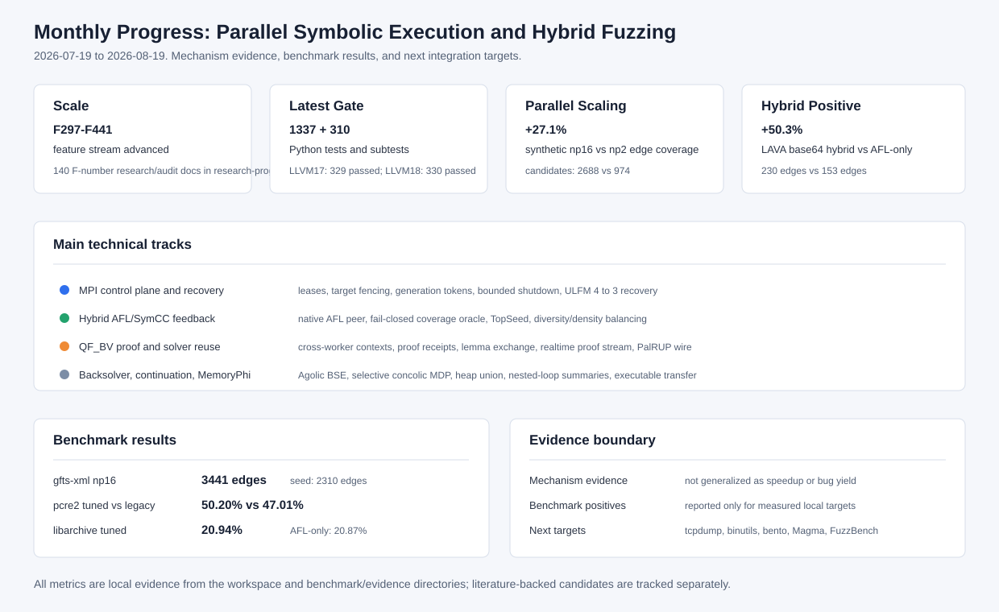

# 最近一个月工作总结：并行符号执行与混合模糊测试框架

时间范围：2026-07-19 至 2026-08-19  
项目目录：`/home/ubuntu/code/symcc`  
撰写目的：汇总最近一个月围绕并行符号执行、hybrid fuzzing、约束求解复用、benchmark 和科研交付开展的工作，明确工作内容、技术成果、实验结果、证据边界和下一步计划。

## 1. 总体结论

最近一个月的工作把项目从“已有并行混合符号执行原型”推进到“有可审计调度协议、有稳定 benchmark 证据、有求解复用与证明交换机制、有公开 testcase 矩阵”的研究系统。核心成果可以概括为五点：

1. **并行框架进入高可信闭环阶段。**  
   围绕 MPI master/worker、target-group lease、work lease、READY/RESULT generation token、deferred journal、shutdown quiescence、cross-host lock qualification、ULFM recovery 等机制，完成了从任务准入、派发、执行、结果提交、失败恢复到关闭的完整控制面加固。最新 F441 证据显示，本地 Open MPI 5.0.10/ULFM 环境下可以完成 4 rank 到 3 rank 的真实进程失效恢复。

2. **hybrid fuzzing 反馈链路从“能跑”推进到“能解释、能归因、能消融”。**  
   修复了 persistent target 下 SymCC 输出为 0、TopSeed/frontier showmap 过慢、AFL queue 全量扫描拖慢短跑、AFL data coverage/hint mutator 在 persistent 目标上拖垮 AFL 主吞吐等问题。pcre2 消融显示 tuned adaptive hybrid 相比 legacy hybrid 覆盖从 `47.01%` 提升到 `50.20%`，AFL executions 从 `2,279,949` 提升到 `21,575,645`。

3. **约束求解从单机 cache 推进到跨 worker、可验证、可回收的 QF_BV proof/data 体系。**  
   F426-F441 系列实现了 cross-worker incremental QF_BV context、proof-carrying UNSAT receipt、verified learned lemma exchange、artifact lifecycle、native solver-state fork、变量替换 UNSAT-core 复用、incremental SAT proof DAG、realtime checked proof stream、adaptive proof admission、clause activity telemetry、utility-aware proof-worker pairing、malleable worker pool、PalRUP proof-wire 与 ULFM recovery。多数结论是 I/T/E-local 或 I/T/E-mechanism 级别，明确不外推为公开目标 speedup 或 bug yield。

4. **Backsolver/Veritesting/Continuation/MemoryPhi 方向形成一条可执行的编译期到运行期路径摘要链。**  
   F374-F425 围绕 Agolic BSE、exception semantics、external models、byte-lane writer graph、ConDPOR、UCSan、ParaSuit/Cottontail、live-state path cover、TopSeed、heap union initialization、MemorySSA/AA、loop-carried MemoryPhi、nested loop affine/piecewise summaries、executable loop summary transfer 等方向，补齐了大量“可证明才接纳”的受限语义机制。

5. **benchmark 与汇报材料显著增强。**  
   当前已经形成 `synthetic-parallel_scaling`、`gfts-xml_read_fuzzer`、`lava-base64`、`pcre2-pcre2_fuzzer`、`libarchive-archive_fuzzer`、`gfts-png_read_fuzzer` 等多层 testcase。并补充了 QSYM、PANGOLIN、CoFuzz/S2F、FuzzBench、Magma 的公开 case registry，区分本地实测正例、弱正例、负例和下一阶段接入候选。

## 2. 本月工作规模与证据基线

本报告的证据来自本地文档、研究进展归档、benchmark evidence 和回归测试结果。最近一个月内，项目文档和证据的主要规模如下：

| 类别 | 结果 |
|---|---:|
| 功能推进范围 | 研发流水线推进到 `F441`；F297-F319 在 2026-08-07 同步报告中归档，F309-F441 有独立研究进展或审计记录 |
| `docs/codex/research-progress` 中 F 编号研究/审计文档 | 140 份 |
| 研究进展日期覆盖 | 2026-08-07 至 2026-08-19 |
| 最新完整 Python 门禁 | `1337 passed + 310 subtests`，node-id `1337/1337` |
| 最新 LLVM17 lit | 331 discovered，329 passed，2 expected unsupported |
| 最新 LLVM18 lit | 331 discovered，330 passed，1 expected unsupported |
| 最新真实 MPI/ULFM 机制证据 | Open MPI 5.0.10，4 rank capability 全通过，真实 rank 退出后 world `4 -> 3` |
| 当前主要 benchmark evidence | `benchmark/evidence/current-advantage-2026-08-19/`、`hybrid-advantage-*`、`public-xml-parallel-r3-*`、`showcase-supplement-*` |

需要强调：这些数字是工程和机制验证规模，不等同于“性能提升百分比”。凡是没有公开目标、等 CPU、多轮统计或 bug oracle 的结果，本文均按机制证据处理。

## 3. 技术主线一：并行符号执行控制面与调度协议

### 3.1 从 rank 级控制走向 generation-fenced dispatch

早期 MPI 执行可以把 seed 分发给 worker 并收集候选，但长期运行会遇到几个实际问题：worker 迟到结果、rank 复用、target 重复求解、跨 master 竞争、shutdown 阶段阻塞、租约泄漏、共享文件系统故障和 coordinator 重启。最近一个月的 F309-F319 与后续 F320-F358 主要解决这些控制面问题。

关键实现包括：

| 方向 | 代表功能 | 工作内容 |
---|---|---|
| 在途目标可见性 | F309 | 将未完成 target solve 纳入调度状态，避免多个 worker 对同一 target group 重复求解 |
| 事务式准入 | F310 | 将 proposal、lease admission、attempt/cooldown commit 分离，只有真正派发的任务才更新统计 |
| 跨协调器 fencing | F311 | target-only shared lease，防止多 master 对同一 target group 并发求解 |
| 失败原子 heartbeat | F312 | group heartbeat 任一成员失败时回滚已写成员，单条租约 I/O 故障不终止整个 coordinator |
| 事务化 MPI 派发 | F313 | PREPARING/ACTIVE/COMMITTING/COMMITTED 状态机，集中管理派发中占用的 work/state/target/solver 资源 |
| 重启安全本地租约 | F314 | work/state lease 单 owner，monotonic 时间迁移为 unix clock，旧 rank 所有权不跨重启生效 |
| 派发代次 token | F315 | per-dispatch generation token，任何 RESULT 消费前先验证 current/unowned/stale/malformed |
| READY/RESULT 恢复 | F316 | READY 回显代次，同代 invalid RESULT 与 READY 汇合后才进行补偿和重排队 |
| dispatch watchdog | F317 | generation-fenced watchdog 处理完全静默 ACTIVE 派发，区分任务迁移和 endpoint 恢复 |
| 有界 shutdown | F318/F319 | tokenized STOP、cleanup ACK、有界 Ibarrier、共享 MPI lifecycle，避免关闭阶段无界等待 |

这些改动的直接价值是把“worker 返回了一个结果”拆成多个可验证事实：是否属于当前派发、是否仍持有 lease、是否通过输入/coverage/telemetry 预验证、是否能够提交、失败时是否完整补偿。并行系统的正确性不再依赖 rank 本身，而是依赖 generation、lease、content digest 和状态机。

### 3.2 共享文件系统、CAS 与 QueryStore 基础设施

F320-F373 进一步加固了分布式文件系统和 QueryStore 作为跨进程证据总线的可信边界。主要成果包括：

- 全局任务所有权、frontier prepare、result manifest replay、directory durability barriers、heartbeat group commit；
- shared filesystem capability contract、path-specific filesystem requirement profiles、cross-host shared-lock qualification；
- content-addressed CAS publication closure、unified live-state CAS、descriptor-anchored namespace；
- bounded streaming result/input admission、public provenance intersection、stable hybrid input admission；
- Query IR 单快照准入、stable query spool、outcome-separated commit、verified query artifact CAS、sealed fd handoff；
- persistent solver generation reset、protocol-complete request preflight、deadline-bounded dual-channel request commit；
- report-only query artifact reachability audit 与六轮深度 review 修复。

六轮深度 review 覆盖 CAS 命名空间、QueryStore 事务、solver 双通道协议、MPI 控制面、算法复杂度和证据一致性，修复了 artifact size 漂移闭包误报、query binding 分裂、永久 lease、无界 solver stdout/stderr、宽松 JSON、SAT 未验证提交、journal 身份不一致、非有限控制值、调度热路径复杂度等问题。

## 4. 技术主线二：Hybrid AFL/SymCC 反馈与覆盖率归因

### 4.1 AFL++ native peer 与在线协同

F298 将 `symcc01/queue` 作为 AFL++ campaign 的原生 peer，不再只是离线导入 SymCC 输出。实现维护 queue/hang/crash 独立连续 ID，记录发布、扫描、导入和未保留输入，并保留 source SHA-256。75 秒真实运行曾产生 23 个发布、22 个扫描、4 个精确导入，4/4 SHA-256 一致。

这项工作解决的是 hybrid fuzzing 中常见的归因问题：SymCC 生成了输入，不代表 AFL 已在线消费，也不代表覆盖变化能归因给它。native peer 机制让输入传播路径可观测，为后续在线闭环和消融实验打基础。

### 4.2 覆盖率 oracle：从“测到覆盖”到“可信归因”

F306-F307 将覆盖率测量从普通 showmap 调用提升为 fail-closed oracle：

- 流式 showmap 与 one-shot showmap 首个输入双跑，不一致则统一回退 one-shot；
- 保留 terminal status、raw status、stdout/stderr、完整 sparse edge；
- 限制输入大小、edge 数、辅助输出和 telemetry；
- 区分 stdin/file 输入 ABI；
- 引入 normal-only 与 stratified terminal policy；
- crash/timeout/error 不进入普通 coverage union；
- MPI batch/streaming triage 只有 `ok` 且非空边集才更新 bitmap。

这部分不直接增加覆盖，但解决了实验中最容易出错的部分：不能把 showmap 异常、输入入口不一致或 terminal 边当成正常新增覆盖。

### 4.3 Directed utility replay、TopSeed 与自适应调度

F308-F404 形成了一条从 seed-level 到 branch-target-level 的调度优化链：

- F308 edge-dependence replay 从 seed 级升级到 branch-targeted directed utility replay；
- F398 ParaSuit branch-rarity parameter selection，把 AFL 全局新增位与 QSYM branch-interest bitmap 区分；
- F399 Cottontail alpha-normalized constraint selection，用结构等价索引识别同构约束；
- F400 persistent multi-objective live-state feedback，记录 coverage/data/constraint 等多目标 live-state；
- F401 persistent Empc live-state path cover，对可达路径 cover 做有界预计算；
- F402 Compatible Branch Coverage pruning，对已覆盖兼容分支做 live-state 剪枝；
- F403 Concrete Constraint Guided Scheduling，结合具体值和约束难度选择高价值目标；
- F404 TopSeed persistent campaign seed selection，将跨运行 seed 画像、Explore/Exploit/Learn 和 k=2 聚类纳入调度。

这些工作共同服务于一个目标：减少并行符号执行中的重复求解，把昂贵 solver 预算集中在有覆盖收益、结构稀有或目标距离更近的路径上。

## 5. 技术主线三：约束求解复用、QF_BV 证明与 solver 体系

### 5.1 经验值域与 profile-guided solving

F300-F305 将 empirical value profile 从离线 hint 发展为在线、版本化、可撤销、可恢复的 MPI solver feedback：

- sparse input expression map，避免稀疏大 offset 造成巨大向量；
- executable-bound value profile，绑定目标可执行文件 SHA-256；
- strict SAT-only profile consumption：经验域不能传播 UNSAT；
- MPI online profile generation，worker 只安装 SHA-256 校验后的代际；
- 低收益域自适应抑制，值集合变化不继承旧失败；
- cost-aware admission，用 Z3 check 累计时间区分“失败但便宜”和“失败且昂贵”；
- replay-verified online profile recovery，从滚动记录重新导出 runtime 语义，检测 state 漂移。

### 5.2 QF_BV cross-worker context 与 proof-carrying 体系

F426-F441 是本月后期最密集的求解系统工作。它们并不是一个单一优化，而是围绕“跨 worker 复用公式、证明和 solver 状态，但不扩大信任边界”构建的一组机制。

| 功能 | 核心成果 | 证据边界 |
---|---|---|
| F426 Cross-worker incremental QF_BV context | 内容寻址 formula-plan，exact hit 复用，parent context 追加 delta | 机制成本与正确性，不是公开 target speedup |
| F427 Proof-carrying UNSAT receipts | cvc5 CPC proof query + Ethos reference + Query IR lowering certificate | 完整 UNSAT 结果可独立授权 |
| F428 Verified learned lemma exchange | ancestor learned literal 经 cvc5/Ethos 检查后发布 | 只覆盖 QF_BV ancestor learned literal |
| F429 Artifact lifecycle | 统一 context/proof/receipt/lemma 依赖图、lease fencing 和 GC | 不包含 solver-native heap transport |
| F430 Native solver-state fork reuse | 本机 Linux forkserver 复用固定 prefix native state | 固定 prefix 机制成本，不是 coverage speedup |
| F431 Variable-substitution UNSAT-core reuse | offset/变量重命名后的 UNSAT-core 可验证复用 | 本地穷举机制，不复现论文级命中率 |
| F432 Incremental SAT proof DAG | CaDiCaL LRAT proof DAG 与 solve-boundary checked import | solve-boundary 同步，不是 mid-solve streaming |
| F433 Realtime checked proof stream | solve 中轮询 verified proof records 并 ACK checked import | 机制实验，不是公开多节点收益 |
| F434 Multi-rank proof evaluation | 多 publisher event 归属、Query IR/CNF 身份与 shared-memory communicator 资格 | 本机多 rank I/T/E-local |
| F435 Adaptive proof admission | 背压、retry、settled candidate 门禁，压力实验 +4.0x delivery count | 不写成 solver speedup |
| F436 Native clause activity | 区分 delivered 与 semantic activation，8/8 delivery、4/8 activation | telemetry 机制，不是因果 speedup |
| F437 Utility-aware pairing | 按 publisher/consumer/formula-family 学习配对 | 两 seed 聚合约 -0.41%，因此不声称提速 |
| F438 Malleable worker pool | generation-fenced 逻辑 worker 重分配，38 attach/retire/proofs | 预启动物理槽上的逻辑 malleability |
| F439 LIDRUP/PalRUP wire | proof-wire 互操作，递归 import 展平 | 语法互操作，不是 solver 原生产 proof |
| F440 PalRUP global confirmation | `local_check -> redistribute -> confirm` 失败闭锁流水线 | 本地固定 checker，未接入生产 solver fragments |
| F441 ULFM recovery | endpoint 身份、generation/shard/lease 栅栏、4->3 rank 真实恢复 | local TCP transport 物理失效证据 |

最新 F441 完整门禁结果：

| 项目 | 结果 |
|---|---:|
| Focused Python | 11 passed |
| Associated Python | 128 passed + 79 subtests |
| Full Python | 1337 passed + 310 subtests |
| LLVM17 | 331 discovered，329 passed，2 unsupported |
| LLVM18 | 331 discovered，330 passed，1 unsupported |
| Deterministic oracle | 12 endpoints / 96 shards，2 failures 下重分配 16 shards |
| Lease replay | 24/24 在途 lease 重放，24/24 old token 拒绝 |
| Live failure | rank 3 退出，world `4 -> 3`，一次 repair，survivor receipt 一致 |

## 6. 技术主线四：Backsolver、Veritesting、Continuation 与内存/循环摘要

本月中段的大量工作围绕“在不破坏语义边界的前提下减少重复路径执行和求解”展开。

### 6.1 Agolic BSE 与 selective concolic

F374 进行了 Agolic run-level planning，将路径规划、bounded execution 和 witness schema 明确化。F423 把 witness-guided BSE 接入真实 `LiveContinuationExecutor`，worker 只能把候选持久到 plan-private staging，不能直接提交 coverage；coordinator 复核 plan/result/program/release/resource 身份后才发布到 corpus。独立 oracle 枚举 8 个两字节配置，4 个有效 route 全部 release 并产生 8 个 replay-equivalent candidate，4 个无效 route 零候选。

F424 实现 Selective Concolic Relation Graph 与概率 MDP。它维护 `PC_r/PC_c` 共享边界、Laplace 平滑 transition value、coverage/data/constraint reward，并把 partial UNSAT/unknown/timeout 全部回退 full Z3，不写 UNSAT cache 或剪枝。独立 oracle 穷举 65536 赋值和 16 个 witness 配置，`false_sat=false_unsat=0`。

### 6.2 Exception、external model 与 UCSan/under-constrained 支撑

F375-F382 处理 exception unwind、typed catch、pure external model、scalar catch object、exception object arena 和 constant GEP exception fields。F393-F395 则围绕 UCSan 做 recoverable object context、explicit object checker、byte initialization/UBI。它们的价值是支撑 under-constrained execution 和函数级/对象级测试，不把外部或堆对象状态任意 concretize。

### 6.3 MemoryPhi、heap union 与 loop summary

F405-F422 是本月编译期/运行时语义摘要最密集的一组：

- F405-F409：finite heap lifetime union、collective heap union、guard-correlated heap union、MemorySSA/AA heap initialization、interprocedural heap effect summary；
- F410-F415：symbolic length byte-lane cover、loop-carried MemoryPhi byte-lane induction、strided residue cover、conditional guard carry、multi-latch fixed point、ordered multi-writer transfer；
- F416-F421：nested-loop MemoryPhi summary composition、last-write value summary、two-dimensional affine summary、affine symbolic value、piecewise affine value、affine Decision DAG value summary；
- F422：executable nested-loop memory summary transfer，把多个符号 bound exit state 合并为 ITE state，但不产生 CBC/CGS/path-cover token，也不写 AFL bitmap。

这些工作都采用“能证明才接纳，超出形状就失败关闭”的边界。多处独立 oracle 穷举 byte lane、loop bound、load offset、guard shape 和 unsupported case，证明机制正确性；但它们不被写成 LLVM 分析吞吐、solver speedup 或公开 campaign 覆盖提升。

## 7. 技术主线五：Benchmark、实验和 testcase 矩阵

### 7.1 2026-07-30 当前实现评估

2026-07-30 的评估回答了两个问题：当前技术组合是否真实执行，以及当前默认 hybrid 编排相对 legacy 是否更好。

LAVA-M `base64` 直接 DSE 消融：

| profile | 候选均值 | unique 均值 | listed bug 均值 | listed 并集 | Z3 full solve 总数 | 平均耗时 |
|---|---:|---:|---:|---:|---:|---:|
| strict-first-z3 | 159.31 | 84.31 | 21.62/44 | 41/44 | 2742 | 0.34 s |
| fast-optimistic | 203.31 | 86.85 | 21.62/44 | 41/44 | 2552 | 0.43 s |
| runtime-full | 212.92 | 104.15 | 21.62/44 | 41/44 | 1189 | 18.25 s |

结论边界：

- `runtime-full` 相比 strict-first 候选均值 `+33.7%`，unique `+23.5%`，Z3 full-context solve `-56.6%`；
- 但 solver queries `+190.5%`，wall time `x53.3`，candidate/s 明显下降；
- listed bug 数没有提升，三类 profile 的 listed bug 并集均为 `41/44`；
- poly cache/cross-prefix/prefix context 命中均为 0，不能把 Z3 full solve 下降归因于 Pangolin 式 context reuse。

SQLite/libarchive 20 轮配置消融：

| 目标 | legacy Hybrid 均值 | current Hybrid 均值 | 独立样本均值差 95% CI | Holm p |
|---|---:|---:|---:|---:|
| libarchive 3.3.2 | 15.508% | 16.460% | +0.953pp `[+0.582,+1.321]` | 0.00168 |
| SQLite 3.13.0 | 18.443% | 20.392% | +1.949pp `[+1.466,+2.441]` | 0.00032 |

该结果支持“当前资源配比与 profile 编排在这两个短时公开目标上优于 legacy 编排”，但不隔离单个技术贡献。

### 7.2 2026-08-19 并行与 hybrid 展示结果

本月后期重新筛选了更能体现当前工作的 case，并补充公开 testcase registry。当前建议汇报主线如下。

#### 并行符号执行框架：`synthetic-parallel_scaling`

| 配置 | 轮次 | 平均 SymCC candidates | 平均 unique | 平均边覆盖 |
|---|---:|---:|---:|---:|
| MPI `np=2` | 3 | 974 | 455.3 | 16.67% (`128/768`) |
| MPI `np=4` | 3 | 1560.7 | 623.3 | 17.58% (`135/768`) |
| MPI `np=8` | 3 | 2284 | 905.0 | 19.88% (`152.7/768`) |
| MPI `np=16` | 3 | 2688 | 1044.7 | 21.18% (`162.7/768`) |

`np=16` 相比 `np=2`，边覆盖相对提升约 `27.1%`，候选生成量约 `2.76x`。这是最干净的并行框架正例。

#### 公开 parser 并行正例：`gfts-xml_read_fuzzer`

| 配置 | 轮次 | SymCC candidates | Unique retained | Edge coverage |
|---|---:|---:|---:|---:|
| seed | 3 | 0 | 20 | 4.54% (`2310/50880`) |
| MPI `np=2` | 3 | 2664 | 1889 | 6.11% (`3110/50880`) |
| MPI `np=4` | 3 | 3101 | 2201 | 6.21% (`3161/50880`) |
| MPI `np=8` | 3 | 3527 | 2497 | 6.31% (`3212/50880`) |
| MPI `np=16` | 3 | 5669 | 4041 | 6.76% (`3441/50880`) |

`np=16` 相比 seed 多 `1131` edges，相比 `np=2` 多 `331` edges。它比 synthetic 更接近真实 parser，同时仍主要体现并行符号执行，而非 AFL persistent 吞吐。

#### Hybrid 强正例：`lava-base64`

| Mode | NP | 轮次 | SymCC candidates | AFL execs | Edge coverage |
|---|---:|---:|---:|---:|---:|
| seed | 0 | 3 | 0 | 0 | 11.58% (`126/1088`) |
| AFL-only | 8 | 3 | 0 | 2,147,017 | 14.06% (`153/1088`) |
| Hybrid | 8 | 3 | 267 | 381,921 | 21.14% (`230/1088`) |

Hybrid 相比 AFL-only 多 `77` edges，覆盖率增加 `7.08pp`，相对 AFL-only 约 `+50.3%`。这是解释“符号执行突破精确值约束”的主例。

#### 真实目标 SOTA 编排：`pcre2-pcre2_fuzzer`

| 配置 | 轮次 | 平均边覆盖 | 平均 SymCC candidates | 平均 online interesting | 平均 AFL execs |
|---|---:|---:|---:|---:|---:|
| old adaptive full | 3 | 34.52% (`3358/9728`) | 2688.7 | 296.7 | 301 |
| legacy hybrid | 3 | 47.01% (`4573.7/9728`) | 5482 | 375 | 2,279,949 |
| tuned adaptive hybrid | 3 | 50.20% (`4884/9728`) | 3065.7 | 249 | 21,575,645 |
| AFL-only full | 3 | 50.56% (`4918.7/9728`) | 0 | 0 | 47,037,750 |

这组结果说明 tuned adaptive hybrid 已经恢复 AFL 主吞吐并保留 SymCC 反馈，不能写成 45s 内显著超过 AFL-only。它的正确汇报口径是“相对 legacy hybrid 明显提升，并接近同核 AFL-only 上限”。

#### 真实 parser 弱正例与补充 case

| Target | Hybrid | AFL-only | 判断 |
|---|---:|---:|---|
| `libarchive-archive_fuzzer` | 20.94% (`2868/13696`) | 20.87% (`2859/13696`) | 单轮 +9 edges，弱正例 |
| `gfts-png_read_fuzzer` | 18.52% (`569/3072`) | 16.60% (`510/3072`) | 25s 单轮弱正例候选，需多轮确认 |
| `sqlite-sqlite_fuzzer` | 20.49% (`6465/31552`) | 21.20% (`6688/31552`) | AFL-only 更高 |
| `freetype2-freetype2_fuzzer` | 5.15% (`1114/21632`) | 5.17% (`1119/21632`) | 基本持平 |
| `jhead-jhead` | 32.81%-32.87% | 33.93%-34.49% | 本地短时未复现论文优势 |

### 7.3 新增 testcase registry

本月补充了 `benchmark/showcase_cases_2026_08_19.json` 和 `docs/codex/Expanded_Hybrid_Showcase_Case_Registry_2026-08-19.md`，将 case 分为：

- `measured-positive`：`synthetic-parallel_scaling`、`gfts-xml_read_fuzzer`、`lava-base64`、`pcre2-pcre2_fuzzer`；
- `measured-weak-positive`：`libarchive-archive_fuzzer`、`gfts-png_read_fuzzer`；
- `available-candidate`：`jhead`、`sqlite`、`freetype2`、`lava-md5sum/uniq/who`；
- `integration-candidate`：`tcpdump`、binutils `readelf/nm/objdump/strip`、`bento`、`pngfix/pngimage`、`openjpeg`、`libjpeg`、`libtiff`、Magma/FuzzBench 扩展目标。

## 8. 文档、图表与交付材料

本月新增和维护了大量面向科研汇报的材料：

- 完整项目报告、演示稿和当前技术全景；
- 最近工作及下一步计划文档；
- 架构与实验问答，明确 worker 使用的 bitmap、约束形态、乐观求解、丢前缀、副作用和 benchmark 设计；
- 技术档案和 `New_Implementation_Archive.md`，将所有新增技术按功能 ID 追踪；
- `docs/codex/research-progress/` 中按功能归档的研究报告、机制图、evidence 和 SHA-256 清单；
- public benchmark 调研、hybrid testcase 筛选、当前优势 testcase 文档；
- 交付材料迁移到 `docs/codex`，避免与其他工具或目录冲突。

重要文档包括：

| 文档 | 内容 |
|---|---|
| `Current_Technology_Compendium.md` | 当前技术全景和 SOTA 对照 |
| `New_Implementation_Archive.md` | 新功能实现档案和证据链接 |
| `Current_Implementation_Evaluation_2026-07-30.md` | 20 轮评估、LAVA-M 消融和历史对照 |
| `Current_Advantage_Testcases_2026-08-19.md` | 当前最适合汇报的测试结果 |
| `Expanded_Hybrid_Showcase_Case_Registry_2026-08-19.md` | 公共 testcase registry 和下一步接入矩阵 |
| `Project_Progress_Presentation_2026-07-30.md/.pptx` | 项目进展汇报材料 |

## 9. 主要成果归纳

### 9.1 工程成果

- 建立了多层并行调度和失败恢复协议，使 MPI campaign 不再依赖脆弱的 rank 级假设；
- 将 AFL++、SymCC、showmap、coverage oracle、QueryStore、CAS、solver telemetry 统一到可追溯数据流；
- 为 persistent+shmem 目标增加自适应默认策略，避免 data coverage/hint mutator 拖垮 AFL 主吞吐；
- 将多个 SOTA 方向落地为模块化、可关闭、可测的机制，而不是不可控的全局开关；
- 构建了从功能实现、测试、证据、图、文档到 registry 的交付闭环。

### 9.2 科研成果

- 将 hybrid fuzzing 中的“符号执行贡献”拆成 candidate generation、online interesting、AFL import、showmap union、FstatsCov 等可分别度量的层次；
- 将覆盖率测量中的输入 ABI、terminal status、streaming drift 纳入 oracle，降低实验误判；
- 将 profile-guided solving、Pangolin 式复用、QF_BV proof exchange、TopSeed、S2F action seed 等思想迁移为本框架中的可验证机制；
- 建立了公开 testcase 选择标准，明确哪些 case 能展示并行扩展，哪些能展示 hybrid 超越 AFL-only，哪些只能作为长时候选或负例；
- 多处文档明确“机制证据 != 性能结论”，为后续论文级实验保留严谨边界。

### 9.3 实验成果

可用于当前汇报的实测结果：

| 结论 | 数据 |
|---|---|
| 并行符号执行扩展性 | `synthetic-parallel_scaling`：`np=16` vs `np=2`，覆盖 `21.18%` vs `16.67%`，候选 `2688` vs `974` |
| 公开 parser 并行正例 | `gfts-xml_read_fuzzer`：seed `2310` edges，`np=16` `3441` edges |
| Hybrid 明显超过 AFL-only | `lava-base64`：hybrid `230` edges，AFL-only `153` edges，`+50.3%` relative |
| SOTA 编排优于 legacy | `pcre2`：tuned adaptive `50.20%`，legacy `47.01%`，old adaptive `34.52%` |
| persistent gating 修复退化 | `libarchive`：old adaptive `13.46%`，tuned hybrid `20.94%`，AFL-only `20.87%` |
| 新增弱候选 | `gfts-png`：25s 单轮 hybrid `569` edges，AFL-only `510` edges |
| 当前默认资源配比较旧编排更优 | 20 轮短测：libarchive `+0.953pp`，SQLite `+1.949pp`，Holm p 分别 `0.00168`、`0.00032` |
| 求解工作量结构变化 | LAVA-M base64 runtime-full：Z3 full solve `-56.6%`，candidate `+33.7%`，但 wall time `x53.3` 且 listed bug 无提升 |

## 10. 风险、边界与未完成工作

当前成果仍有清晰边界：

1. **多数 F426-F441 proof/solver 机制不是公开目标 speedup。**  
   它们证明了可验证交换、准入、活动观测、配对和恢复机制，但还没有 8/32/128 worker、跨节点、等 CPU、长时间公开 campaign 的性能结论。

2. **短时 persistent 目标中 AFL-only 仍非常强。**  
   pcre2 在 45s 下 AFL-only full 仍略高于 tuned adaptive hybrid。当前结果更适合说明“hybrid 不再牺牲 AFL 主吞吐并保留符号执行反馈”，不适合写成“所有真实目标都超过 AFL-only”。

3. **部分论文强候选尚未本地复现。**  
   `jhead` 在 ICSE23/CoFuzz、PANGOLIN、S2F 中是强候选，但本地 60s 短跑未复现优势，且存在 QSYM/SymCC 对非关系型 branch 的 solver assertion 瓶颈。

4. **LAVA-M bug oracle 与普通 edge coverage 不能混用。**  
   `base64` 可作为精确约束正例，但 `md5sum/uniq/who` 需要 bug-trigger count 和 time-to-trigger，而不是普通 coverage。

5. **Pangolin 式 context reuse 需要更合适目标。**  
   07-30 LAVA-M base64 中 poly cache/cross-prefix/prefix context 均无命中，说明机制已经运行但该目标不能证明其收益。

6. **图表和文档已丰富，但正式论文级评估还需统计设计。**  
   下一步需要更长时间窗口、更多 rounds、AUC、生存曲线、bug oracle、Magma/FuzzBench 标准化目标和 per-component ablation。

## 11. 下阶段建议

### P0：巩固当前可汇报结果

1. 对 `synthetic-parallel_scaling`、`gfts-xml_read_fuzzer`、`lava-base64`、`pcre2` 做 5-10 轮确认，输出置信区间和 AUC；
2. 对 `gfts-png_read_fuzzer` 做 3-10 轮和 10min/1h，验证 25s 单轮弱正例是否稳定；
3. 对 pcre2 做 component ablation：profiles only、profiles+diversity、profiles+diversity+density、forced data coverage、hint mutator forced/off；
4. 将现有 testcase registry 接入 benchmark runner 的批量计划，避免手工复制命令。

### P1：接入论文强候选

1. 修复并长时复测 `jhead`；
2. 接入 `tcpdump -r @@` 和 PCAP seed corpus；
3. 接入 binutils `readelf/nm/objdump/strip` 和 ELF seed corpus；
4. 接入 `bento`/Bento4 MP4 parser；
5. 接入 `pngfix/pngimage`，形成和 `gfts-png` 的 libpng 对照。

### P2：建立论文级 benchmark

1. 接入 Magma `libpng/libxml2/sqlite3`，用 reached/triggered/time-to-trigger 指标；
2. 接入 FuzzBench `harfbuzz/jsoncpp/lcms/libjpeg-turbo/libpcap/openssl_x509/php/re2/woff2/zlib`；
3. 对 QF_BV proof exchange 和 malleable worker pool 做 8/32/128 worker 多节点机制实验；
4. 将 coverage、solver telemetry、AFL fuzzer_stats、QueryStore proof receipts 和 testcase registry 汇总为统一实验 manifest。

## 12. 证据索引

主要本地证据位置：

- `docs/codex/research-progress/`
- `docs/codex/evidence/`
- `benchmark/evidence/current-advantage-2026-08-19/`
- `benchmark/evidence/hybrid-advantage-lava-base64-symbolic-heavy-r3-2026-08-19/`
- `benchmark/evidence/public-xml-parallel-r3-2026-08-19/`
- `benchmark/evidence/showcase-supplement-screen-2026-08-19/`
- `docs/codex/Current_Implementation_Evaluation_2026-07-30.md`
- `docs/codex/Current_Advantage_Testcases_2026-08-19.md`
- `docs/codex/Expanded_Hybrid_Showcase_Case_Registry_2026-08-19.md`
- `benchmark/showcase_cases_2026_08_19.json`

最终报告口径：本月工作已经形成可以汇报的工程与科研进展，尤其是并行符号执行扩展、hybrid 反馈链路、persistent-aware SOTA 编排和可验证 QF_BV proof/worker 机制。但除明确列出的 benchmark 外，机制测试不应被外推为覆盖率、漏洞数量或通用求解速度提升。
