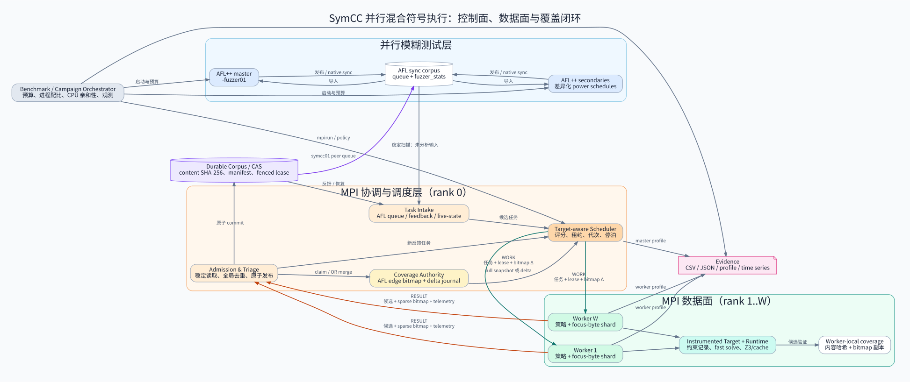
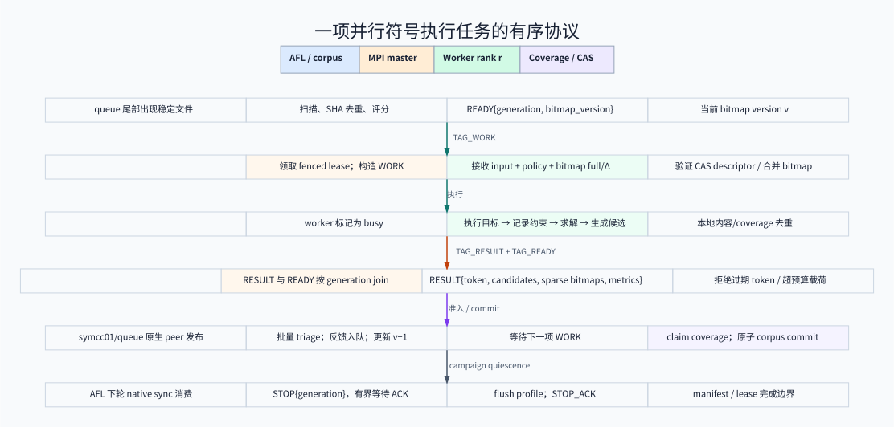

# SymCC 并行框架：架构、执行流程与通信协议

> **文档状态**：基于 2026-08-20 当前代码审阅；描述的是已经落地的执行路径，
> 不把实验性模块接口误写为默认启用能力。主要实现入口为
> `util/mpi_fuzzing_helper.py`、`util/mpi_concolic_execution.py` 与
> `benchmark/run_benchmark.py`。

## 1. 一句话理解整个框架

本项目把动态符号执行从“一个进程读取一个输入、顺序翻转分支”改造成一个有明确
**控制面、数据面和覆盖反馈闭环**的并行系统：AFL++ 持续产生低成本输入，MPI master
把稳定输入、目标分支、路径前缀或 continuation 组织成带租约的工作项，worker 独立运行
插桩目标并求解，master 再用统一的 AFL edge bitmap 验证覆盖增量并原子发布语料。



该设计与 Cloud9 的集群符号执行思想、GenSym 的 continuation/CPS 并行化方向相容，
但当前工程不是对任一论文系统的逐行复刻：[Cloud9](https://dslab.epfl.ch/pubs/cloud9.pdf)
强调分布式状态管理；[GenSym](https://www.cs.purdue.edu/homes/rompf/papers/wei-icse23.pdf)
展示了 continuation 化符号执行在并行场景的可扩展性。本项目进一步把这些思想放进
AFL++ 语料闭环、持久 CAS、代次 fencing 和多层去重协议中。

## 2. 两条可运行的并行路径

当前代码中有两套互补而非重复的 MPI 入口。

| 路径 | 入口 | 输入来源 | 覆盖权威 | 适用目的 |
|---|---|---|---|---|
| Hybrid AFL+SymCC | `util/mpi_fuzzing_helper.py` | AFL queue、SymCC feedback、结构任务、live-state | AFL `afl-showmap` edge map | 用符号执行提升 fuzzing 覆盖 |
| Standalone parallel concolic | `util/mpi_concolic_execution.py` | 指定语料目录与共享 CAS | 内容哈希与输出语料，目标自行度量覆盖 | 纯并行 DSE、跨节点吞吐与恢复测试 |

Hybrid 路径的 rank 0 是单个协调 master；其余 ranks 是 SymCC workers。整个作业预算还要
分给 AFL++ master/secondaries，所以“总 `np`”不等于“符号执行 worker 数”。Standalone
路径会根据 `--workers-per-master` 自动分组；默认目标是每 master 约 90 workers，
`MPI_Comm_split` 把每个 master 和自己的 workers 隔离到独立 communicator，master 间控制
协议再走单独 communicator。

## 3. Hybrid 的逐步执行次序

以下次序对应 `run_benchmark.py::run_hybrid` 与
`mpi_fuzzing_helper.py::run_symcc_master/run_symcc_worker` 的真实控制流。

### 3.1 启动与角色分配

1. Campaign orchestrator 解析总预算、目标、seed、超时和 profile 组合。
2. 它先启动 AFL++：一个 `-M fuzzer01` 主实例和若干 `-S fuzzerNN` 从实例。
3. AFL 实例可使用不同 power schedule、CmpLog、MOpt 或编译变体，形成低成本异构探索。
4. 等 `fuzzer01/fuzzer_stats` 出现后，orchestrator 用剩余 ranks 启动 MPI helper。
5. 高并行规模下，AFL 与 SymCC ranks 被放到不相交 CPU 集；adaptive 模式还可停泊/唤醒
   SymCC worker，动态调整 fuzzing 与 concolic 的核心配比。

非 adaptive 默认配比约为一半 AFL、一半 SymCC。实际公式是：

```text
A = min(requested_afl_instances, max(1, total_np - 2))
symcc_mpi_np = max(2, total_np - A)
symcc_workers = symcc_mpi_np - 1
```

本轮 4/8/16/32 总进程实验因此对应 1/3/7/12 个 SymCC workers；32 进程档的 worker
数量受现有上限策略约束，并不是 15。

### 3.2 Master 构造任务

6. Master 稳定扫描 `fuzzer01/queue`，先跳过已派发路径，再做 regular-file/no-follow
   检查、稳定快照和 SHA-256 内容去重。
7. 候选依据 `+cov`、`+rare`、历史 edge yield、输入大小、AFL id、目标距离或 live-state
   元数据评分。固定容量 top-k 避免候选集随 queue 无界增长。
8. 输入被扩展为工作项。最小工作项是输入路径；开启相应模块后还可以携带
   `focus_bytes`、`target_branch`、S2F actions、schedule prefix、continuation、参数覆盖、
   executor/solver 策略与 empirical value profile 版本。
9. Master 只向已经发送 `READY` 且属于当前 generation 的空闲 worker 派发；派发前领取
   local/shared fenced lease，并用事务式 rollback 闭包保证中途失败不会遗留半领取状态。

### 3.3 Worker 执行与本地过滤

10. Worker 接收 `WORK`，校验 dispatch token，按版本安装 coverage full snapshot 或 sparse
    delta、value profile 和对象内容。
11. Worker 把输入导入本地 content-addressed store；continuation 工作可跳过已移动的原始
    AFL 文件，直接从自包含 checkpoint 恢复。
12. 插桩目标执行时，runtime 记录符号表达式与路径约束；fast solve、optimistic solve、
    Z3、polyhedral/prefix cache、字符串后端及策略调度按约束形状和配置协作。
13. SymCC 生成候选后，worker 用 streaming `afl-showmap` 得到 AFL edge-id 空间中的稀疏
    bitmap；先做内容哈希去重，再与本地 coverage 副本比较，只回传本地尚未覆盖的候选。
14. Worker 返回 `RESULT{dispatch token, candidates, sparse bitmaps, hints, telemetry}`，随后
    再发带已完成 token 的 `READY`。master 必须按 generation 将 RESULT 与 READY join，
    防止 MPI 不同 tag 的可见顺序造成同一 worker 被提前复用。

### 3.4 Master 准入与反馈闭环

15. Master 对 RESULT 做对象数、总字节、单对象大小、bitmap 结构与 token ownership 检查；
    过期、越权或超预算结果整批拒绝，不做会破坏语义的静默截断。
16. Batch triage 对候选做最终全局 coverage claim。只有在 master 权威 bitmap 上增加新
    feature 的输入才进入 durable corpus；多个 master/作业共享状态时使用原子锁与 lease
    fence 防止重复 commit。
17. 通过准入的输入发布到 `afl_out/symcc01/queue`。该目录是 AFL native sync peer；
    `fuzzer01` 按 AFL 的单调 id cursor 消费，而不是依赖易竞态的秒级 mtime。
18. 新输入还可进入 `symcc_feedback_queue`，形成多跳 concolic；master 更新 bitmap version，
    下一次只向落后的 worker 发送 delta，历史窗口不足时才发完整 snapshot。
19. 到达预算或全局 quiescence 后，master 发送带 generation 的 STOP，worker flush profile
    并返回 ACK；orchestrator 先停语料生产者，再停 AFL secondaries，最后停 AFL master，
    尽量保留 final sync 边界。



## 4. 任务如何合并、去重和分配

“任务合并”在本框架中不是把两条任意路径约束强行做逻辑合取；那会改变可达语义。
实现采用四种保持语义的合并方式。

| 层次 | key / 条件 | 合并动作 | 不变量 |
|---|---|---|---|
| 输入层 | SHA-256 + 稳定文件身份 | 相同内容只分析一次；replacement 重新准入 | 不因同名文件误去重 |
| 目标层 | input、focus、branch、actions、schedule、continuation | 形成稳定 work id；lease 防止重复占有 | 不合并语义不同的目标 |
| 状态层 | Prefix DAG / live-state id / CAS descriptor | 共享公共前缀和不可变对象 | checkpoint 可独立验证和恢复 |
| 覆盖层 | AFL edge-id + hit-count bucket | bitmap OR/claim；传播版本化 sparse delta | 全局覆盖单调增长 |

分配策略是“pull readiness + master push work”：worker 用 READY 表示容量，master 掌握全局
队列和目标收益后发送 WORK。这样避免 worker 各自盲扫相同 AFL queue，同时允许 master
基于 rarity、distance、yield、cost、state shard 和参数策略做全局选择。worker diversity
将策略和 `focus_bytes` 分区组合成尽量不重叠的工作格；density balance 有有效 profile 时按
符号密度划分，没有 profile 时回退等宽分区。

当 worker 数超过当前收益上限时，adaptive controller 不杀死 worker，而是消费其 READY 后
“停泊”；减少 active-worker cap 即释放核心给 AFL，增大 cap 又可恢复派发。停泊不删除任务，
因此不会因资源重配直接丢失路径。

## 5. 模块间通信模式

| 通信双方 | 模式 | 载荷 | 一致性措施 |
|---|---|---|---|
| AFL instances ↔ AFL queue | 共享文件系统 + AFL native sync | corpus files、cursor、stats | 单调 id；final sync 观测 |
| AFL queue → hybrid master | 有预算目录扫描 | stable snapshot、SHA、元数据 | no-follow、两次身份校验、unseen budget |
| Master ↔ worker | MPI point-to-point tags | READY/WORK/RESULT/STOP/ACK | generation、dispatch token、RESULT/READY join |
| Master → workers | 版本化广播的点对点实现 | bitmap full/Δ、value profile | 每 worker version；历史不足发 full |
| Worker → master | 有界 RESULT | bytes、sparse bitmap、hints、telemetry | schema/budget 校验、owner fence |
| Master ↔ CAS/corpus | 共享状态事务 | object、manifest、lease、commit | content hash、fsync/rename、fenced lease |
| Standalone master ↔ master | 独立 MPI control communicator | status、probe、quiescence、stats | 两阶段 quiescence、exact ACK、超时 |

Hybrid 热路径刻意使用 point-to-point 消息而非每项 collective：worker 完成时间受路径和 solver
长尾影响，collective 会让所有 rank 被最慢查询阻塞。只有配置共识、全局角色建立或跨 master
完成边界适合 collective/control-plane 同步。

## 6. 三种 bitmap 必须严格区分

这是理解并行正确性的关键；它们不能互换。

### 6.1 AFL edge coverage bitmap：是否“有新覆盖”的权威

- **生成方法**：用 AFL 插桩版本目标运行 `afl-showmap`；对于 persistent/stdin 目标可批量
  使用 streaming fork server，输出完整 map 或 `(edge_id, bucket)` 稀疏列表。
- **master 用途**：初始化已知覆盖、全局 triage、coverage claim、统计 edge coverage。
- **worker 用途**：接收 master 的 full/Δ 副本，对 SymCC 候选做本地 coverage 去重。
- **重复判断**：worker 的判断只是降低网络和 master 压力；最终是否接收由 master bitmap
  决定，因为并发 worker 的副本存在 freshness gap。

### 6.2 QSYM/SymCC solver bitmap：runtime 内部剪枝

每个 worker 在临时目录维护独立 `qsym_bitmap`，通过 `SYMCC_AFL_COVERAGE_MAP` 交给 runtime。
它使用 runtime 的分支哈希空间（代码注释明确为 `XXH32(pc,taken)`，131072 bytes），用于
求解/生成过程内部的覆盖判断。它**不是 AFL edge-id map**，不能拿来判断一个候选是否给
AFL 带来新边，也不能用 AFL edge id 去索引它。

### 6.3 AFL native data coverage map：比较数据反馈

可选的 data-coverage runtime 通过 `AFL_PRELOAD` 把比较位置、操作数差异等信息映射到 AFL
共享 map，使 fuzzing 能感知“控制流未变但比较距离发生改善”的输入。它是增强 fuzzing
梯度的反馈，不取代 edge coverage 权威，也不等同于 SymCC 的约束缓存。

因此，问题“worker 判断符号执行输出和重复测试用哪个 bitmap”的准确答案是：

1. runtime 内部是否继续求解，使用 worker 私有的 QSYM/SymCC solver bitmap；
2. worker 是否把候选回传，使用 master 同步来的 AFL edge bitmap 副本，加内容哈希；
3. master 是否全局接收，使用 master 权威 AFL edge bitmap；
4. AFL 是否看到比较进展，可额外使用 data coverage map，但它不是 corpus 准入条件。

## 7. Standalone 多 master 的执行语义

Standalone 模式专门解决更大的纯 DSE 作业。

1. rank 0 广播统一 admission budget 与 work epoch。
2. `compute_roles` 计算 master ranks 和 worker groups；`Comm.Split` 隔离数据面。
3. persistent 输出目录启用共享文件系统能力探测、跨主机锁资格和运行期续期；能力不满足时
   fail closed，而不是假定 NFS/并行文件系统具有本地 ext4 语义。
4. 输入先流式稳定读取并写入共享 CAS；master 间通过共享 work coordinator 领取 fenced
   lease。WORK 热路径只发送 hash，worker 从共享 CAS 读取内容。
5. 每个 master 独立驱动本组 workers；多 master 之间周期发布 idle/busy status。
6. rank 0 发起 exact quiescence probe；各 master 刷新 frontier 后回复。全体 idle 才进入
   commit，任一 busy 则 abort。完成后再做有界、确认式统计交换和 worker shutdown。
7. result manifest、corpus redo、retired epoch GC 与 directory durability barrier 支持中断后
   幂等恢复；旧 generation 的迟到结果被 fencing，而不是覆盖新所有者的结果。

## 8. 可观测性与复现实验

并行性能不能只看“生成了多少文件”。本轮补齐的观测包括：

- benchmark CSV/JSON：总预算、wall time、AFL executions、SymCC candidates、retained unique、
  edge coverage、coverage AUC、peer published/scanned/imported；
- master profile：queue scan、dispatch、receive、triage、idle 的累计时间和调用次数；
- worker profile：wait、bitmap sync、input import、concolic exec、showmap/dedup、send；
- redundancy funnel：generated → worker-reported → master-accepted，并拆分 worker 内部冗余与
  bitmap freshness 引起的跨 worker 冗余；
- coverage time series：避免终点覆盖相同却掩盖“谁更早发现”的差异。

分析入口：

```bash
python3 benchmark/analyze_parallel_profiles.py RUN_DIR... --output PROFILE_REPORT
python3 benchmark/analyze_parallel_scaling.py RESULT.csv... \
  --target TARGET --mode mpi --output SCALE_REPORT --physical-cores 96
```

## 9. 已知边界

1. 当前 hybrid 使用单 master；Standalone 才有完整多-master控制协议。不能把 Standalone 的
   多-master 容错能力无条件写成 hybrid 默认能力。
2. AFL native sync 以分钟为时间尺度，90 秒短跑中 SymCC peer 常未追平；最终 combined
   corpus 会包含 SymCC 输出用于覆盖测量，但这不等价于 AFL 已在线消费全部输出。
3. bitmap delta 降低了通信量，却不能消除并发 freshness gap：两个 worker 仍可能同时发现
   相同边，最后由 master 接收一个、拒绝另一个。
4. Prefix DAG、live continuation、agentic proposal 等只有在对应 artifact/config 可用时进入
   工作项；最小默认路径仍是输入级 concolic，不应在报告中把所有模块说成每次都启用。
5. 多轮实验中的“上限”是目标、seed、预算、机器和策略的函数，不是框架永久常数；具体模型
   与本轮数据见配套的并行扩展性报告。

## 10. 设计价值

框架真正的技术难点不在于“启动更多进程”，而在于同时维持四个性质：任务不会因重复领取
浪费大规模 solver 预算；迟到结果不能污染新 generation；coverage 在并发更新下保持单调且
使用同一语义空间；中断/共享文件系统异常后语料仍能恢复。当前实现用 readiness-driven
调度、content/CAS identity、fenced lease、versioned bitmap delta、事务式 result admission
和 bounded acknowledged shutdown 把这些性质贯穿到了端到端执行流程。
