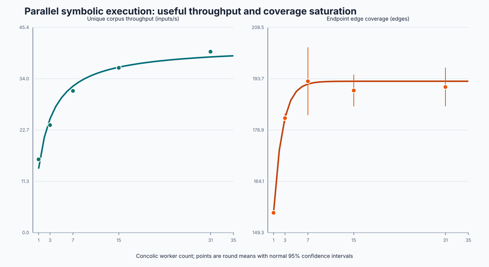
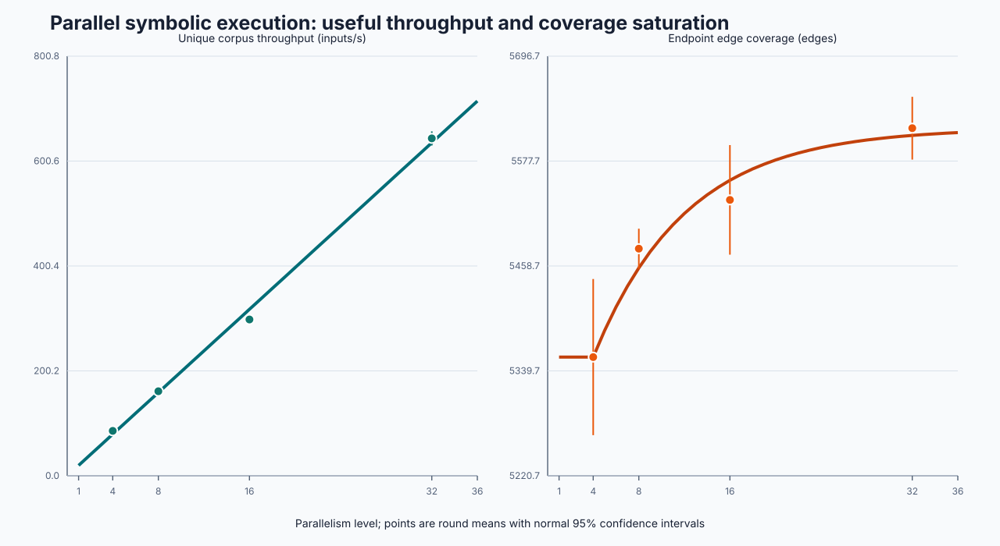
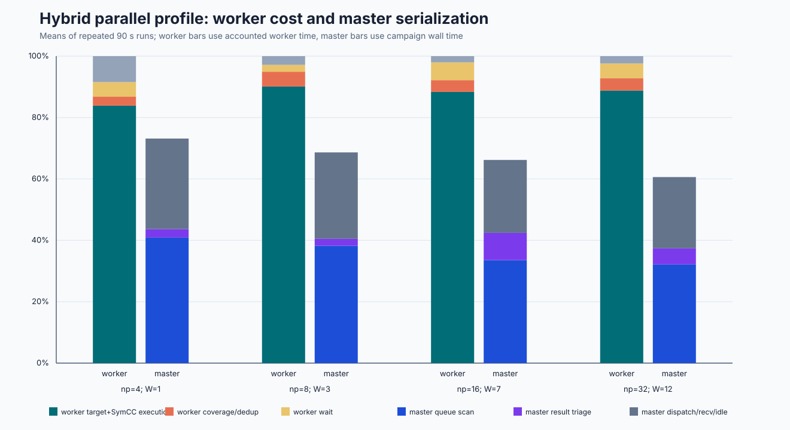
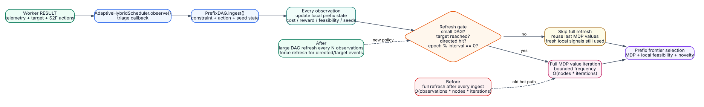

# 并行扩展性、瓶颈诊断与优化报告

> **日期**：2026-08-20  
> **范围**：并行符号执行 synthetic benchmark、Google Fuzzer Test Suite
> `libxml2-2.9.2/xml_read_fuzzer` hybrid campaign、master/worker profile、并行规模
> 上限模型与优化 A/B。所有原始 CSV/JSON/profile/time-series 位于
> `benchmark/evidence/parallel-scale-study-2026-08-20/`。

> **2026-08-29 证据复核**：本文中的 `7 workers` 和 `50 total processes` 来自历史
> `v1` 探索性拟合。使用当前 `v5` 门禁重算后，两组实验均为
> `decision_eligible=false`，正式规模上限为未知。原始观测值仍有效，但不能据此直接配置
> 资源。复核结果位于 `reanalysis-v5-2026-08-30/`。v5 进一步要求记录语料抽样
> provenance，抽样端点不得用于正式上限拟合。

## 1. 执行摘要

本轮不是再做一次单点“跑通”测试，而是用两层 workload 回答四个问题：并行框架如何
扩展，吞吐增长是否转化成覆盖，瓶颈在哪一阶段，以及多少 workers 之后不值得继续增加
符号执行资源。

核心结论如下。

1. **纯并行 concolic 吞吐继续增长，但覆盖未随规模单调增长。** Synthetic 60 秒、3 轮实验中，
   1→31 workers 的 unique throughput 从 16.21 增到 40.04 inputs/s（2.47×），而平均
   endpoint coverage 在 7 workers 达到 193 edges，15/31 workers 分别是 190.3/191.3。
2. **真实 XML hybrid 的总吞吐扩展良好。** 总 `np=4→32` 时，以 executions/wall
   计算的 AFL 执行率从约 59.9k 增至 606.3k exec/s（10.12×），合并语料 unique rate
   从 85.79 增至 643.85 inputs/s
   （7.51×）；endpoint edges 从 5355.3 增至 5615.0（+4.85%），AUC 从 4899.7 增至
   5147.6（+5.06%）。
3. **符号执行的有效率明显下降。** Master-accepted / worker-generated 比例从 1 worker
   的 26.34% 降到 12 workers 的 5.33%。worker 内部已过滤的冗余约 88%，跨 worker
   bitmap freshness 冗余在 12 workers 平均约 7.1%。增加 workers 主要是在更快地产生
   低新颖度候选。
4. **worker 热点仍是目标执行/求解，不是 bitmap 通信。** 各规模中，worker `exec`
   占已归属 worker 时间约 84%–90%，`showmap+dedup` 约 3%–5%；bitmap sync、import、send
   合计很小。
5. **master 瓶颈已从 queue scan 迁移到 result triage / Prefix DAG。** Baseline 90 秒
   16 进程时 queue scan 是最大单项，约 `30.19 ± 2.38 s`；poll 间隔优化后降到
   `19.47 ± 3.01 s`。继续拉长到 180 秒后，scan 只占 12.43 s，而 triage 达到
   78.73 s，其中 `AdaptiveHybridScheduler.observe` 占 59.37 s。
6. **Prefix DAG / ColorGo MDP 全图刷新是新的可证明热点。** 新增 `[PROF-TRIAGE]`
   内部 profiler 后，150 秒定位 run 显示 `adaptive_scheduler=2.29 s` 中
   `adaptive.prefix_dag=2.20 s`。随后把 MDP value iteration 改为小图即时刷新、大图有界
   限频刷新；在相近 observation 规模下，`adaptive_scheduler` 从 180 秒未限频 run 的
   59.37 s 降到 150 秒限频 run 的 14.28 s，master triage 从 78.73 s 降到 33.78 s。
7. **优化没有被包装成虚假覆盖提升。** Queue-poll A/B 的 edges 为 5533.7 vs 5553.3，
   AUC 为 5089.5 vs 5093.0，置信区间均重叠；MDP 限频单轮为 5663 edges / AUC 5295.9，
   与 150/180 秒参考 run 在噪声范围内。当前能严格宣称的是 master 串行开销下降，覆盖
   未检测到结构性回归。
8. **规模数值只能用于安排下一轮探针。** 以 master-accepted SymCC inputs/s 拟合得到的
   11 workers，以及历史 hybrid 覆盖拟合得到的约 50 total processes，均未通过当前证据
   门禁。它们可以用于选择 8/12/48 等后续测量点，不能作为生产上限或最优配置结论。

## 2. 实验设计

### 2.1 环境

| 项目 | 配置 |
|---|---|
| CPU | AMD Ryzen Threadripper PRO 9995WX，96 physical cores / 192 threads |
| Socket / NUMA | 1 socket，当前系统报告 1 个 NUMA node |
| 内存 | 250 GiB |
| 目标 A | `synthetic-parallel_scaling`，用于隔离 MPI/concolic 扩展性 |
| 目标 B | Google FTS `libxml2 2.9.2` `xml_read_fuzzer`，20 个结构化 XML seeds |
| 覆盖口径 | AFL edge-id/hit-count bitmap，`afl-showmap -C` |
| 统计 | 3 个独立轮次；均值与 normal 95% CI；同时报告 endpoint 与 AUC |

`normal 95% CI` 在每组只有 3 轮时偏乐观，因此本文把它用于显示波动范围，不把边界接近
零的差异宣称为严格显著性结果。更严谨的论文评测仍应做至少 10–20 轮、随机 seed 配对和
非参数检验。

### 2.2 测试矩阵

| Study | 并行规模 | 单轮预算 | 轮数 | 目的 |
|---|---|---:|---:|---|
| Pure MPI synthetic | `np=2,4,8,16,32` | 60 s | 3 | worker 吞吐与 coverage saturation |
| Hybrid XML baseline | total `np=4,8,16,32` | 90 s | 3 | 真实 parser、不同 AFL/SymCC 配比、阶段 profile |
| Queue-poll A/B | total `np=16` | 90 s | 3+3 | 100 ms baseline vs 500 ms optimized |
| Sustained confirmation | total `np=16` | 300 s | 1 | 长 queue、native sync 和长尾行为 |
| Adaptive triage detail | total `np=16` | 150/180 s | 1+1 | 拆解 result triage 内部热点 |
| Prefix-DAG MDP bounded refresh | total `np=16` | 150 s | 1 | 验证大图限频刷新降低调度器串行成本 |

Hybrid 的实际进程分配为：

| total np | AFL instances | SymCC master | SymCC workers |
|---:|---:|---:|---:|
| 4 | 2 | 1 | 1 |
| 8 | 4 | 1 | 3 |
| 16 | 8 | 1 | 7 |
| 32 | 19 | 1 | 12 |

32 进程档受现有 SymCC worker cap 控制。它不是“19 AFL 与 12 SymCC 恰好最优”的先验
结论，而是本轮要用数据检验的资源分配点。

### 2.3 可复现命令

Baseline hybrid 每个规模/轮次使用相同参数：

```bash
SYMCC_MASTER_PROFILE=1 \
SYMCC_WORKER_PROFILE=1 \
SYMCC_WPROF_DIR=/absolute/evidence/path/profiles \
python3 benchmark/run_benchmark.py \
  --no-default --public --targets gfts-xml_read_fuzzer \
  --np-list NP --rounds 1 --timeout 90 \
  --output RUN_DIR --skip-build --no-serial --no-mpi \
  --hybrid --aflpp-profiles basic \
  --symcc-diversity --symcc-density-balance --timeseries 15
```

聚合与建模：

```bash
python3 benchmark/analyze_parallel_profiles.py RUN_DIR... --output PROFILE_DIR
python3 benchmark/analyze_parallel_scaling.py RESULT.csv... \
  --target gfts-xml_read_fuzzer --mode hybrid \
  --output MODEL_DIR --physical-cores 96
```

## 3. Pure MPI：并行不是覆盖的同义词

| SymCC workers | rounds | generated/s | unique/s | worker acceptance | edges |
|---:|---:|---:|---:|---:|---:|
| 1 | 3 | 42.90 | 16.21 | 37.8% | 155.0 |
| 3 | 3 | 67.60 | 23.80 | 35.2% | 182.3 |
| 7 | 3 | 95.28 | 31.36 | 32.9% | **193.0** |
| 15 | 3 | 117.88 | 36.47 | 30.9% | 190.3 |
| 31 | 3 | 131.19 | 40.04 | 30.5% | 191.3 |



历史 `v1` 模型曾将约 7 workers 解释为 novelty ceiling；当前 `v5` 复核拒绝该结论，原因
包括三轮均复用随机种子 0、角色账本缺失、计划时间预算不等、覆盖来源字段缺失以及覆盖
观测非单调。可以保留的结论是：吞吐随规模增长，而该短预算下最高覆盖观测出现在
7 workers；不能证明 7 是稳定上限。

这也是并行符号执行最容易误判的地方：如果只画 generated/s，会得到“31 workers 最好”；
如果研究目标是覆盖，则需要独立种子和更长预算复测后才能判断平台位置。

## 4. 真实 XML hybrid 扩展性

### 4.1 端到端结果

| total np | AFL exec/s | SymCC cand/s | unique/s | edges mean ± 95% CI | AUC mean ± 95% CI |
|---:|---:|---:|---:|---:|---:|
| 4 | 59,933 | 4.41 | 85.79 | 5355.3 ± 88.6 | 4899.7 ± 46.4 |
| 8 | 154,607 | 15.68 | 161.39 | 5478.3 ± 22.6 | 5018.2 ± 22.8 |
| 16 | 290,681 | 29.14 | 298.32 | 5533.7 ± 62.1 | 5089.5 ± 48.2 |
| 32 | 606,340 | 43.43 | 643.85 | 5615.0 ± 35.6 | 5147.6 ± 22.1 |



从 4 到 32 total processes，合并语料处理能力近线性增长；coverage 曲线则明显变平。
`np=8→16` 平均只增加 55.3 edges，`np=16→32` 增加 81.3 edges。后者不是严格单调的
“加速曲线”：单轮分别为 5641、5624、5580，仍存在运行随机性和覆盖抽样误差。

此外，本 study 同时增加 AFL 与 SymCC 资源，不能从这张表单独归因“新增边都是符号执行
产生的”。此前同项目 60 秒等核对照中，XML hybrid 与 AFL-only 接近；本轮的作用是测
并行框架与 hybrid 总系统扩展，不是重新声称 hybrid 对该目标显著胜过 AFL-only。

### 4.2 Worker 与 master 的时间花在哪里



| total np / SymCC workers | worker busy | exec / accounted | showmap+dedup / accounted | master scan | master triage |
|---:|---:|---:|---:|---:|---:|
| 4 / 1 | 88.8% | 83.9% | 2.9% | 36.8 s | 2.5 s |
| 8 / 3 | 90.2% | 90.1% | 4.8% | 34.4 s | 2.0 s |
| 16 / 7 | 85.9% | 88.3% | 3.8% | 30.2 s | 8.0 s |
| 32 / 12 | 82.1% | 88.8% | 4.0% | 28.9 s | 4.7 s |

Worker 侧结论很明确：当前不是 MPI send、bitmap delta 或 input import 限制吞吐，而是目标
执行和 solver 工作本身。Master 侧 scan 是最大单项已测串行时间；dispatch/recv 很小，
triage 在 7 workers 时上升但尚未成为主导。

Master 各阶段最后一次 profile sample 可能早于 campaign 终止，表中时间不是完整 wall-time
分解；图中 master bar 未填满 100% 正是为了保留未归属时间，不能把剩余部分强行解释成
某个阶段。

### 4.3 冗余漏斗

| SymCC workers | worker 内部冗余 | 跨 worker freshness 冗余 | master accepted |
|---:|---:|---:|---:|
| 1 | 73.66% | 0.00% | 26.34% |
| 3 | 88.18% | 3.01% | 8.81% |
| 7 | 87.38% | 6.01% | 6.61% |
| 12 | 87.56% | 7.11% | 5.33% |

这里的“worker 内部冗余”包含候选未产生新的 AFL edge/bucket、内容重复或在同一 worker
本地 bitmap 已覆盖；不能全部归咎于 solver 求了同一个公式。跨 worker 冗余才是多个并发
副本在 bitmap delta 到达前同时报告相同增量的 freshness gap。

因此，下一阶段收益最大的优化不是再压缩几 KB MPI payload，而是**在求解之前提高目标
新颖度预测**：更好的 target branch、prefix/state 分片、约束难度/距离组合和 stagnation
触发的结构化 proposal。

## 5. 已落地的 P0 优化

### 5.1 修复 bounded scan 的尾部饥饿

旧逻辑把 `SYMCC_QUEUE_SCAN_MAX` 计在所有目录项上，包括已经在 `seen` 中的历史文件。
当 AFL queue 超过 4096 且头部都已处理时，每轮永远在同一历史前缀用尽预算，新追加文件
可能永久不可见。现在 scan limit 只计算 unseen work；对应生命周期回归构造 4 个已见文件、
limit=1 和一个尾部 `+cov` 文件，验证尾部仍被选择。

这是一项 correctness fix，不是简单性能调参。它可能让一次扫描走过更多历史项，但消除了
“进程还活着、worker 却永远收不到新尾部”的隐性停滞。

### 5.2 Busy-path poll 100 ms → configurable 500 ms

Master 已有一个重要快速路径：只要有空闲 worker，就立即扫描，不受 poll interval 限制。
因此将“所有 workers 都忙”时的最小间隔改为 `SYMCC_QUEUE_POLL_INTERVAL`，默认 0.5 秒，
不会给正在等工作的 worker 增加固定 500 ms 延迟。

16 total processes、7 SymCC workers、每组 3 轮 A/B：

| 指标 | 100 ms baseline | 500 ms optimized | 变化 |
|---|---:|---:|---:|
| master scan time | 30.19 ± 2.38 s | 19.47 ± 3.01 s | **-35.49%** |
| scan calls | 521.7 ± 80.3 | 143.3 ± 2.4 | **-72.52%** |
| mean scan cost | 59.0 ± 14.7 ms | 135.7 ± 18.9 ms | +129.86% |
| worker busy | 85.86% | 87.54% | +1.69 pp |
| edges | 5533.7 ± 62.1 | 5553.3 ± 153.9 | +19.7，区间重叠 |
| coverage AUC | 5089.5 ± 48.2 | 5093.0 ± 99.2 | +3.5，区间重叠 |
| AFL exec/s | 295.1k ± 33.3k | 284.4k ± 13.6k | -3.62%，区间重叠 |

单次 scan 变慢是预期结果：较长间隔内 queue 增长更多，一次会看到更多新项。但调用次数
下降得更多，所以总 scan 成本显著下降。覆盖和 AFL 吞吐没有检测到统计上可分离的变化；
本轮优化的有效声明是“减少 master 元数据扫描开销而没有检测到覆盖回归”。

### 5.3 Profiling artifact 生命周期

此前 worker CSV 可通过 `SYMCC_WPROF_DIR` 保留，master `[PROF]` 只在临时 work dir，
campaign 结束后即被删除。本轮把 `mpi_master.log` 与 `mpi_worker.err` 同步导出到 profile
目录，使每一轮的 scan/dispatch/recv/triage 和 worker phases 能离线关联。否则所谓瓶颈
分析无法由原始证据复核。

### 5.4 Result triage 的目录提交与 proposal checkpoint 降频

300 秒 sustained run 暴露出第二类瓶颈：当 queue scan 被降频后，master 的 result triage
成为长尾阶段。`gfts_hybrid_poll500ms_np16_300s_r1` 的 profile 中，最后样本显示：

| 指标 | 数值 |
|---|---:|
| wall time | 304.08 s |
| master scan | 36.65 s / 201 calls |
| master dispatch | 41.52 s / 613 calls |
| master triage | 126.80 s / 585 calls |
| worker busy | 58.24% |
| worker internal redundancy | 93.32% |
| cross-worker redundancy | 2.04% |
| accepted / generated | 4.64% |

源码检查与本地微基准显示，每个 accepted testcase 都做 file fsync 与 parent directory fsync。
在本地 filesystem 上，256 个 testcase 的逐条目录 fsync 约 1.35 s，其中目录 fsync 占约
0.66 s；同目录 group commit 后约 0.69 s。代码因此改成：

- 本地 `_batch_triage` 在没有 distributed coverage claim 时延迟 parent-directory fsync 到
  natural batch 末尾，仍保留每个 testcase 文件 fsync。
- 使用 distributed coverage claim/callback 时继续逐 candidate 做 durable publication，
  避免“全局 coverage 已 claim，但本地 corpus entry 尚未 durable”的跨节点一致性窗口。
- MPI master 中 `SemanticProposalGenerator(autosave=False)`，proposal 状态由 master 周期性
  checkpoint 与 shutdown save 负责，避免每次 observation 重写较大的 proposal state。

单轮 300 秒对照不是统计显著 A/B，但能说明瓶颈迁移方向：

| 指标 | poll500ms 300s | group-commit + deferred autosave 300s | 变化 |
|---|---:|---:|---:|
| master triage | 126.80 s | 93.68 s | -26.1% |
| worker busy | 58.24% | 69.92% | +11.68 pp |
| edges | 5791 | 5871 | 单轮方向性提升 |
| AUC | 5442.3 | 5529.7 | 单轮方向性提升 |

该结论边界很重要：coverage/AUC 只是一轮结果，不能当作严格增益；但 triage 时间下降与
worker busy 上升和机制改变一致，可以作为下一轮重复实验的优先假设。

### 5.5 Scan timestamp completion 修复

在 poll 降频后又发现一个细节 bug：`last_scan_time` 旧逻辑在扫描开始前记录 `_now`。如果
一次扫描本身耗尽 0.5 秒预算，事件循环返回时会立即满足“距离上次扫描已超过 poll interval”，
导致连续重扫。现在改为扫描完成后再记录 `time.monotonic()`。

120 秒验证 run `gfts_hybrid_triacetail_np16_120s_r1` 显示：

| 指标 | 数值 |
|---|---:|
| master scan | 14.04 s / 176 calls |
| master triage | 4.90 s / 116 calls |
| worker busy | 90.26% |
| edges | 5486 |
| AUC | 5131.3 |

该 run 的目的不是覆盖对照，而是验证 scan 不再因时间戳语义产生立即重扫。

### 5.6 Adaptive scheduler 内部 profile

当 scan 与目录 fsync 下降后，180 秒 run `gfts_hybrid_triacetail_np16_180s_r1` 暴露出新的
热路径：

| 指标 | 数值 |
|---|---:|
| wall time | 184.33 s |
| master scan | 12.43 s / 113 calls |
| master dispatch | 32.65 s / 393 calls |
| master triage | 78.73 s / 394 calls |
| `batch_core` | 72.44 s |
| `observation_callback` | 69.46 s |
| `adaptive_scheduler` | 59.37 s |
| `semantic_proposals` | 9.53 s |
| edges / AUC | 5690 / 5306.5 |

为定位 `adaptive_scheduler`，新增可选 `profile: dict[str, float]` 参数给
`AdaptiveHybridScheduler.observe()`。默认调用不变；当 `SYMCC_MASTER_PROFILE=1` 时，
master 传入临时 dict，并把 `adaptive.context`、`adaptive.data_coverage`、
`adaptive.edge_dependence`、`adaptive.prefix_dag`、`adaptive.ect`、`adaptive.cstg` 等
子阶段累加到 `[PROF-TRIAGE]`。`benchmark/analyze_parallel_profiles.py` 同步解析这些字段
到 CSV/JSON/Markdown。

150 秒定位 run `gfts_hybrid_adaptive_detail_np16_150s_r1` 在 118 次 observation 的样本中：

| 子阶段 | 时间 |
|---|---:|
| `adaptive_scheduler` | 2.29 s |
| `adaptive.prefix_dag` | 2.20 s |
| `adaptive.ect` | 0.04 s |
| `adaptive.edge_dependence` | 0.02 s |

因此主因不是 LinUCB、data coverage、replay record 或 MPI，而是 Prefix DAG ingest 中的全图
MDP value iteration。

### 5.7 Prefix DAG / ColorGo MDP bounded refresh

Prefix DAG 负责 S2F action seed、ColorGo/MultiGo/TACO 式目标导向调度和路径上下文复用。
它不能简单关闭。问题在于 `_update_dynamic_coloration()` 每次 ingest 都调用
`_refresh_mdp_values()`，而 `_refresh_mdp_values()` 会按所有节点和所有转移组做多轮 value
iteration，复杂度接近：

```text
O(observations * prefix_nodes * mdp_iterations)
```



新实现把语义拆成两层：

- **每次 ingest 仍更新本地节点**：`color_feasibility`、`target_path_reward`、solver cost、
  timeout penalty、seed paths、constraint summary 和 action productivity 都即时维护。
- **全图 MDP 变为有界刷新**：当 DAG 节点数不超过
  `SYMCC_SELECTIVE_MDP_SMALL_GRAPH_NODES`（默认 512）时保持每次刷新；超过阈值后每
  `SYMCC_SELECTIVE_MDP_REFRESH_INTERVAL`（默认 8）次 observation 刷新一次。target reached
  或 directed-distance 命中会强制刷新。
- **可观测性**：Prefix DAG snapshot 和 master `Adaptive` 行记录 `mdp=refresh/skipped@interval`，
  便于判断是否真的进入 bounded 模式。

单元测试 `test_prefix_dag_mdp_refresh_is_bounded_on_large_graph` 将 small graph 阈值设为 0、
refresh interval 设为 4，连续 7 次 ingest 后断言只刷新 1 次、跳过 6 次。

优化后 150 秒 run `gfts_hybrid_mdpbounded_np16_150s_r1`：

| 指标 | 未限频 180s reference | MDP bounded 150s | 解释 |
|---|---:|---:|---|
| profile observation scale | 约 1030 observations | 1133 observations | 规模相近，非等时 A/B |
| master triage | 78.73 s | 33.78 s | -57.1% |
| `adaptive_scheduler` | 59.37 s | 14.28 s | -75.9% |
| `semantic_proposals` | 9.53 s | 7.35 s | 同阶但未主导 |
| worker busy | 60.87% | 68.89% | +8.02 pp |
| SymCC generated | 4326 | 7599 | master 可消费更多结果 |
| edges / AUC | 5690 / 5306.5 | 5663 / 5295.9 | 单轮覆盖接近 |

这不是严格等时多轮显著性实验，但已经足够支持工程判断：Prefix DAG 的全图 MDP 刷新是
当前 master triage 上限之一，bounded refresh 能明显降低串行调度成本，且没有在单轮中观察
到覆盖结构性回退。后续应补 `150/180/300 s × 3-5 rounds`，同时记录
`mdp=refresh/skipped@interval`，再决定默认 interval 是否从 8 调到 16。

## 6. 并行规模上限模型

### 6.1 为什么不能只套 Amdahl 定律

符号执行的工作集合会随新路径动态增长，coverage 又是有限且逐渐变稀的目标；它既不是
固定工作量强扩展，也不是纯吞吐服务。因此采用四个约束的组合模型：

```text
N* = min(N_resource, N_master, N_USL, N_novelty)
```

`N_resource` 是物理核心、内存与 solver licence/backend 的资源界；`N_master` 是协调器
利用率界；`N_USL` 描述 contention/coherency 下的有效吞吐；`N_novelty` 描述在固定预算内
新增覆盖变稀。

### 6.2 有效吞吐 USL

使用 Gunther Universal Scalability Law：

```text
C(N) = gamma * N / [1 + sigma(N - 1) + kappa N(N - 1)]
```

其中 `sigma` 是串行/争用项，`kappa` 是随参与者对数增长的一致性项。实现采用非负参数的
确定性网格 + local pattern search，不依赖 SciPy；并定义“资源翻倍后预测增益低于 10%”
为 operational ceiling。USL 的原始形式与参数解释见
[Gunther 的论文](https://arxiv.org/abs/0808.1431)。

对 hybrid 不能使用 AFL executions 作为“符号执行有效吞吐”，否则模型只会拟合 AFL。
本轮改用 `master-accepted SymCC inputs/s`：

```text
gamma = 0.8311, sigma = 0.3026, kappa = 0
R² = 0.7231, RMSE = 0.3156 accepted inputs/s
10% doubling-gain ceiling = 11 SymCC workers
```

`R²` 只有 0.72，说明随机路径收益还占较大比例；11 应读作“当前预算下 8–12 的合理区间”，
不是精确到一个 worker 的物理常数。

### 6.3 Coverage saturation

固定目标、seed 和时间预算下拟合：

```text
E(N) = E_base + L * [1 - exp(-rho(N - N_base))]
```

历史 `v1` 分析定义 `E(2N)-E(N) < 1 edge` 时到达 novelty ceiling，其探索性结果为：

| Workload | 实测范围 | 拟合 | novelty ceiling | 解释 |
|---|---|---|---:|---|
| Synthetic pure MPI 60 s | 1–31 workers | `R²=0.844` | 7 workers | 历史探索值，未通过 v5 门禁 |
| XML hybrid 90 s | 4–32 total np | `R²=0.890` | 50 total np | 历史外推值，未通过 v5 门禁 |

当前正式结论是规模上限未知。后续实验可以把 7、11、49/50 附近作为探针，但必须采用
至少五档规模、每档至少三个独立随机种子、完整配对区组、等计划时间预算、固定 hybrid
资源比例和显式 `existing_edges` 覆盖分母，之后才能恢复决策性拟合。

### 6.4 Master service bound

协调器还需要满足：

```text
U_master = lambda_scan * S_scan
         + lambda_result * (S_recv + S_triage + S_commit) < U_target
```

`lambda` 是调用/结果到达率，`S` 是每项服务时间。Baseline 7 workers 的已归属 scan
约占 90 秒预算 33.5%；优化后约 21.6%，尚未触及建议的 70% 持续利用率警戒线。它不是
当前 12-worker cap 的直接限制，但若未来提高 useful solve rate，scan 与 result commit
仍会先于 96 physical cores 成为单 master 的上限。

### 6.5 当前决策表

| 决策对象 | 当前建议 | 证据强度 |
|---|---|---|
| Synthetic 60 s | 7 仅作历史观测点 | 低：v5 判定证据不合格 |
| XML 的 SymCC worker 数 | 8–12 仅作下一轮探针区间 | 低：随机种子和暴露时间不满足门禁 |
| XML hybrid total np | 已观测到 32；48/50 仅作探针 | 低：v5 不给出正式上限 |
| 单机绝对资源界 | 96 physical cores，不用 192 SMT threads 冒充物理核心 | 高：硬件事实 |
| 多节点 | 每目标重新拟合，并加入网络/CAS/lock service 项 | 尚无本轮跨节点数据 |

## 7. 技术优化优先级

### P0：已经完成并有 A/B

1. Bounded scan 尾部饥饿修复。
2. Busy-path queue poll 配置化，默认 500 ms。
3. Master profile artifact 持久导出。
4. Hybrid scale 指标口径修复：total work、AFL exec、SymCC candidates 与 combined unique
   分列，避免出现不可能的 >100% retention。
5. Dependency-free USL + coverage saturation model、CSV/JSON/Markdown/SVG 分析流水线。
6. Result triage group directory commit：本地 batch 合并 parent-directory fsync，分布式
   coverage claim 路径保持逐 candidate durable publication。
7. MPI semantic proposal autosave 延迟到 coordinator checkpoint，避免 observation 热路径
   重复重写 proposal state。
8. Queue scan completion-time timestamp 修复，防止预算内长扫描结束后立即重扫。
9. `AdaptiveHybridScheduler.observe()` 内部 profiler 与 profile 聚合器解析
   `[PROF-TRIAGE] adaptive.*` 子阶段。
10. Prefix DAG / ColorGo MDP bounded refresh：小图即时刷新、大图限频刷新、target/directed
    信号强制刷新，并在 snapshot/master log 中记录刷新/跳过计数。

### P1：下一轮优先验证

1. **Novelty-aware allocation**：在线估计 `accepted_symcc/s`、coverage slope 与 queue age；
   若增加 active workers 后 useful rate 的增益低于阈值，停泊 SymCC worker 并把核心交给
   AFL。现有停泊控制器提供执行机制，缺的是把本轮模型指标接入控制律。
2. **Prefix DAG refresh interval ablation**：对
   `SYMCC_SELECTIVE_MDP_REFRESH_INTERVAL=4,8,16,32` 做 150/300 秒多轮对照，联合比较
   `adaptive.prefix_dag`、accepted rate、coverage AUC 和 target-reached telemetry，确定
   默认值是否应从 8 上调。
3. **前缀/目标分片而非仅输入分片**：worker 内部冗余约 88%，应优先把同一输入的 branch
   target、Prefix DAG frontier 和 focus-byte density 组合成互斥或低重叠任务。
4. **SymCC→AFL sync latency**：12/12 个 90 秒 baseline 的 `sync_complete=0`。要区分 AFL
   已扫描但未保留与根本未扫描；设计秒级 acknowledgement/cursor telemetry，而不是仅靠
   campaign 结束时总数。
5. **完整 corpus coverage oracle**：高规模 combined corpus 超过 20,000 后使用固定种子
   抽样。增加先 `afl-cmin`/feature-union 再完整 replay 的测量路径，降低规模相关采样偏差。

### P2：研究性高挑战工作

1. **Hybrid multi-master**：Standalone 已有 communicator 隔离、global quiescence、fenced
   lease 与恢复协议；hybrid 仍是单 master。超过单机或 master service bound 后，再迁移
   coverage owner sharding 和跨 master result admission。
2. **长尾 solver service**：按 constraint shape、预计 cost 和 timeout history 做异步查询
   分级；短查询留 worker 本地，长查询进入可恢复 spool/backend pool，避免一个路径长期占用
   worker。
3. **跨目标层级模型**：用 hierarchical/Bayesian 或 mixed-effects 模型同时解释 target、
   seed、budget、worker count 和 allocator，而不是为每个目标孤立拟合一个常数。

## 8. 大模型能解决什么，不能解决什么

### 8.1 不应放进热路径的地方

Queue scan、bitmap merge、lease fencing、RESULT schema validation 和简单约束求解都是确定性
系统问题。让 LLM 决定是否接收一个 bitmap 或同步一个 lease 会增加毫秒到秒级延迟、成本和
不可复现性，也不能修复本轮 100 ms 重扫这样的明确工程问题。

### 8.2 适合的异步研究接口

当前代码已经有 `AgenticBackendManager`：支持 command/HTTP backend、线程池异步请求、
timeout、cache、失败计数和 circuit breaker；模型只能返回白名单字段，例如 strategy、
target branch、focus bytes、S2F actions 和 route。`VerifiedProposalManager` 再把数据变换候选
交给真实目标执行、分支 telemetry 验证和 AFL coverage triage。

下一步不是重新造一个“LLM 直接生成输入”的无约束接口，而是增加**stagnation gate**：

```text
trigger = coverage_slope < tau_cov
       and accepted_symcc_rate < tau_useful
       and deterministic_frontier_exhausted
```

触发后异步给模型约束 core、parser token/grammar context、历史成功 action 和可用 branch
targets；模型返回有限 action plan。每个 proposal 都有固定预算、TTL、concrete verifier 和
反事实奖励；若连续失败，circuit breaker 自动退回确定性调度。

这与 Cottontail 报告的“LLM 负责结构化输入语义、concolic 负责可验证执行”的方向一致；
其论文报告相对 SymCC/Marco 的平均 line coverage 增益属于论文结果，不是本项目实测结果，
不能直接写进本项目成果：[Cottontail 论文](https://arxiv.org/abs/2504.17542) 与
[公开实现](https://github.com/Cottontail-Proj/cottontail)。

### 8.3 建议的 LLM ablation

固定 target/seed/cores/budget，至少比较：deterministic scheduler、stagnation gate + built-in
planner、stagnation gate + LLM、always-on LLM。指标除 coverage/AUC 外，必须包含 model
calls、latency、proposal verified rate、retained rate、额外 CPU/费用和确定性 fallback 次数。
只有 `verified retained edges / model cost` 提升，才说明大模型真正解决了本轮 5.3% accepted
rate 问题。

## 9. 测量边界与不能宣称的内容

1. 大语料 endpoint `afl-showmap` 默认固定随机种子抽样 20,000 inputs；该结果可复现但不是
   60k+ corpus 的完整并集，且更大规模更容易发生抽样漏边。
2. 3 轮 normal CI 不等价于论文级显著性；A/B 的覆盖差异不能宣称显著。
3. 该 XML study 没有同轮 equal-core AFL-only control，不能归因 hybrid 相对纯 fuzzing 的
   因果增益。
4. 所有 scale ceiling 都绑定 target、seed、预算、allocator、机器和版本。换目标或从 90 秒
   增加到 1 小时后必须重拟合。
5. 本轮是单机实验；关于跨节点网络、共享文件系统锁和多 master overhead 的公式项有代码
   支持，但没有本轮实测数据，不能伪造多节点线性扩展结论。

## 10. 文献定位

- [Cloud9](https://dslab.epfl.ch/pubs/cloud9.pdf)：集群级并行符号执行与分布式状态管理。
- [GenSym, ICSE 2023](https://www.cs.purdue.edu/homes/rompf/papers/wei-icse23.pdf)：
  continuation/CPS 风格高性能与并行符号执行；论文报告的 4.6×/9.4× 是其 benchmark 结果。
- [PANGOLIN](https://home.cse.ust.hk/~charlesz/papers/pangolin.pdf)：利用约束结构、复用和近似
  降低求解成本；本项目 polyhedral/prefix cache 的目标与其问题定义相近。
- [S²F](https://arxiv.org/abs/2601.10068)：把 fuzzing、symbolic solving 与 sampling 组织成
  明确 action space；本项目用 action seed/portfolio 承载这一类决策。
- [USL](https://arxiv.org/abs/0808.1431)：同时刻画 contention 与 coherency 的扩展性模型。

## 11. 交付物索引

| 内容 | 路径 |
|---|---|
| Pure MPI 原始结果与模型 | `benchmark/evidence/parallel-scale-study-2026-08-20/synthetic_mpi_60s_r3/` |
| 12 轮 hybrid baseline | `benchmark/evidence/parallel-scale-study-2026-08-20/gfts_hybrid_profiled_90s_r3/` |
| 3 轮 queue-poll A/B | `benchmark/evidence/parallel-scale-study-2026-08-20/gfts_hybrid_poll500ms_np16_90s_r3/` |
| 300 秒持续运行 | `benchmark/evidence/parallel-scale-study-2026-08-20/gfts_hybrid_poll500ms_np16_300s_r1/` |
| Group commit / deferred autosave 300 秒验证 | `benchmark/evidence/parallel-scale-study-2026-08-20/gfts_hybrid_groupcommit_np16_300s_r1/` |
| Scan timestamp 120 秒验证 | `benchmark/evidence/parallel-scale-study-2026-08-20/gfts_hybrid_triacetail_np16_120s_r1/` |
| Adaptive triage detail 180 秒定位 | `benchmark/evidence/parallel-scale-study-2026-08-20/gfts_hybrid_triacetail_np16_180s_r1/` |
| Adaptive internal profile 150 秒定位 | `benchmark/evidence/parallel-scale-study-2026-08-20/gfts_hybrid_adaptive_detail_np16_150s_r1/` |
| Prefix DAG MDP bounded refresh 150 秒验证 | `benchmark/evidence/parallel-scale-study-2026-08-20/gfts_hybrid_mdpbounded_np16_150s_r1/` |
| Profile 聚合器 | `benchmark/analyze_parallel_profiles.py` |
| Scale 聚合器 | `benchmark/analyze_parallel_scaling.py` |
| 数学模型 | `util/parallel_scale_model.py` |
| 模型单元测试 | `test/test_parallel_scale_model.py` |
| Profile 解析单元测试 | `test/test_parallel_profile_analysis.py` |
| 架构与通信文档 | `docs/codex/Parallel_Framework_Architecture_and_Execution_2026-08-20.md` |

本轮最重要的工程判断是：当前系统已经能把更多核心转化为更高吞吐，但下一阶段的研究主线
应从“更多 workers”转向“更高的求解前新颖度与更精确的动态资源分配”。这比继续优化已经只占
几个百分点的 bitmap/send 阶段更可能提高真实覆盖收益。
