## 项目定位

**目标：用并行动态符号执行突破 fuzzing 难以跨越的精确约束，并用统一覆盖判据验证和接纳候选。**

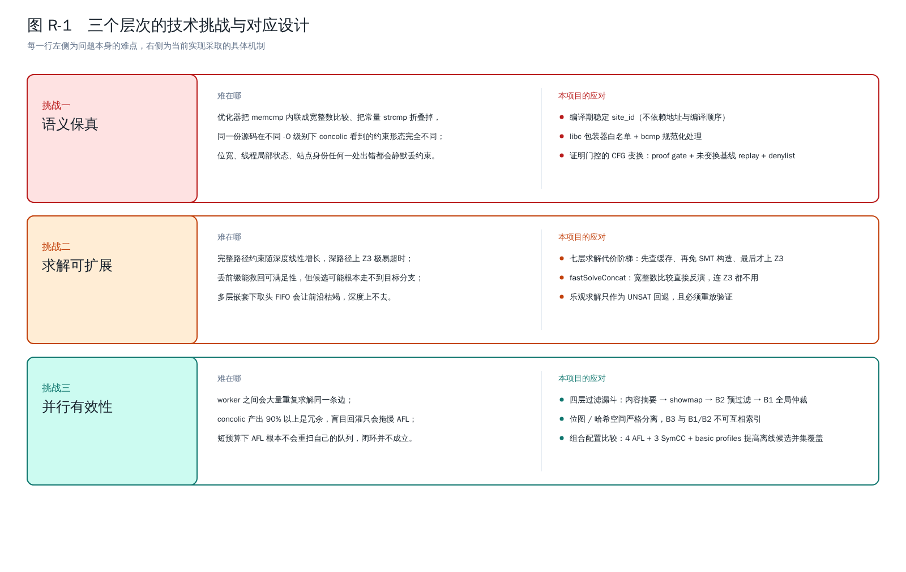{width=88%}

::: notes
项目不是单纯“把 SymCC 多起几个进程”，而是同时处理三类问题：编译和运行时语义必须保真，
求解必须可扩展，并行产生的大量候选必须被有效去重和调度。三层中任何一层失效，增加 CPU
都只会放大浪费。
:::

## 当前成果概览

- **系统**：7 层研究栈，四种并行粒度，双执行引擎
- **工程**：F00-F296 全链路追踪，`test/` 一级目录 231 个文件
- **结果**：当前组合配置相对旧配置的离线候选并集覆盖均值为
  **+0.953 / +1.949pp**
- **机制**：LAVA-M 完整路径 Z3 调用 **-56.6%**，但总 query **+190.5%**

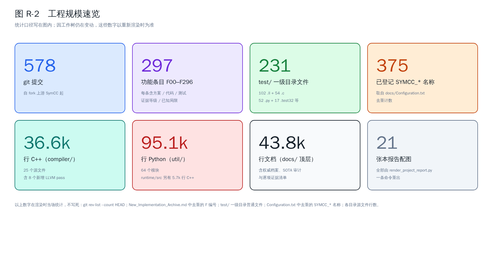{width=70%}

::: notes
规模本身不是论文贡献，价值在于每项功能都能追溯到代码、测试和证据。汇报中的主要正结果
来自 20 轮独立样本工程统计；LAVA-M 结果仅用于解释求解工作量结构，不能与主实验混为同一证据等级。
:::

## 项目推进路径

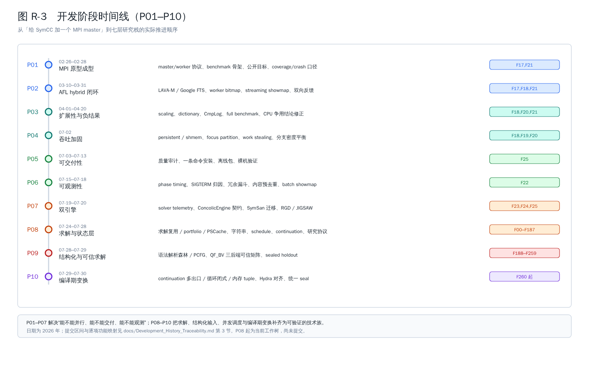{width=92%}

::: notes
推进顺序是先并行、交付和观测，再叠加算法层。P01-P07 解决系统能否稳定运行和测量；
P08-P10 才进入求解复用、结构化输入、并发状态、continuation 和编译期 CFG 变换。
P08 起仍位于当前未提交工作树，因此这些技术以实现和回归证据为主。
:::

## 七层系统架构

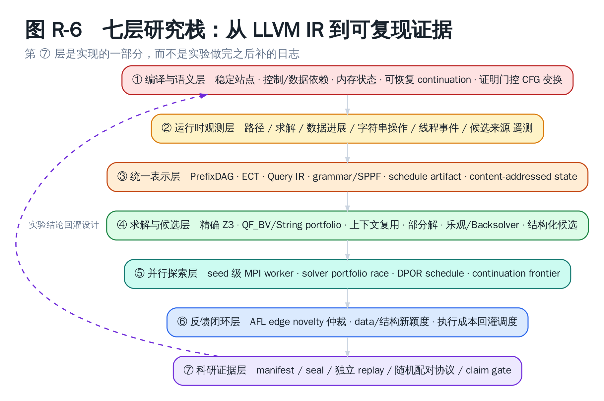{width=95%}

::: notes
自上而下是编译语义、运行时观测、统一表示、求解候选、并行探索、反馈闭环和科研证据。
底层实验观察会反向影响上层设计，例如 20 轮比较发现旧的
1 AFL + 6 SymCC + profiles off 组合不理想，促使默认配置调整为
4 AFL + 3 SymCC + basic profiles。该比较没有隔离单独的资源比例效应。
:::

## 软件模块与职责边界

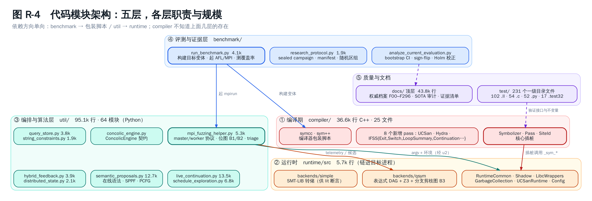{width=92%}

::: notes
编译器只负责插入 `_sym_*` 调用；运行时在目标进程内构造表达式与路径约束；Python 编排层
通过 ConcolicEngine 契约启动不同后端并处理候选；benchmark 层负责运行身份、统计和封存。
依赖保持单向，是 SymCC 与 SymSan 两种后端能够共享同一评测口径的前提。
:::

## 同一源码的多二进制协作

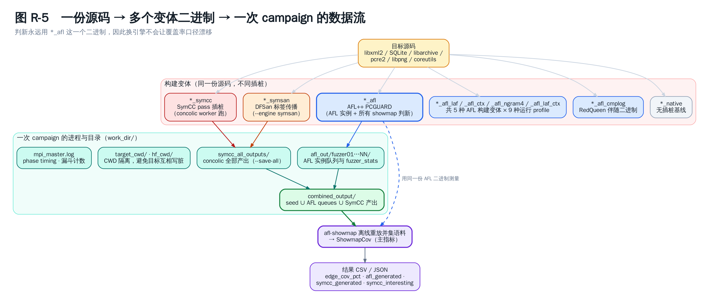{width=94%}

::: notes
一次 campaign 并不是只运行一个二进制。SymCC/SymSan 插桩变体用于 concolic，AFL PCGUARD
变体用于 fuzzing 和所有 showmap 判新，native 变体用于基线与重放。无论候选由谁产生，
最终都用同一个 AFL 插桩二进制测量，避免边 ID 空间漂移。
:::

## 并行执行流程

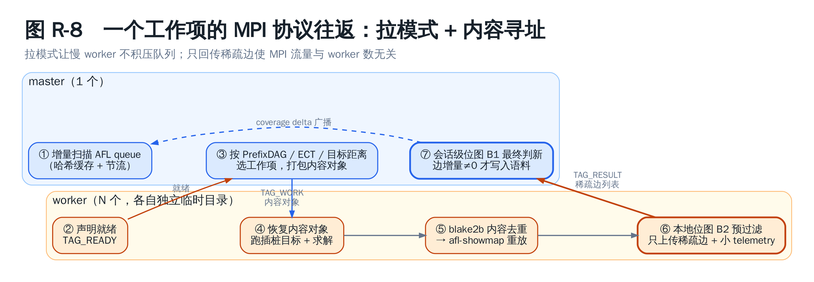{width=92%}

::: notes
执行次序是：worker 先发 READY，master 扫描并选择 AFL seed，分发内容对象；worker 恢复输入，
运行插桩目标并求解；候选先做内容去重和 showmap，再用 worker 私有 B2 预过滤；master 用会话级
B1 作最终仲裁。拉模式避免慢任务在 worker 端排队，内容寻址保证临时目录可完全隔离。
:::

## Bitmap 不是一张图

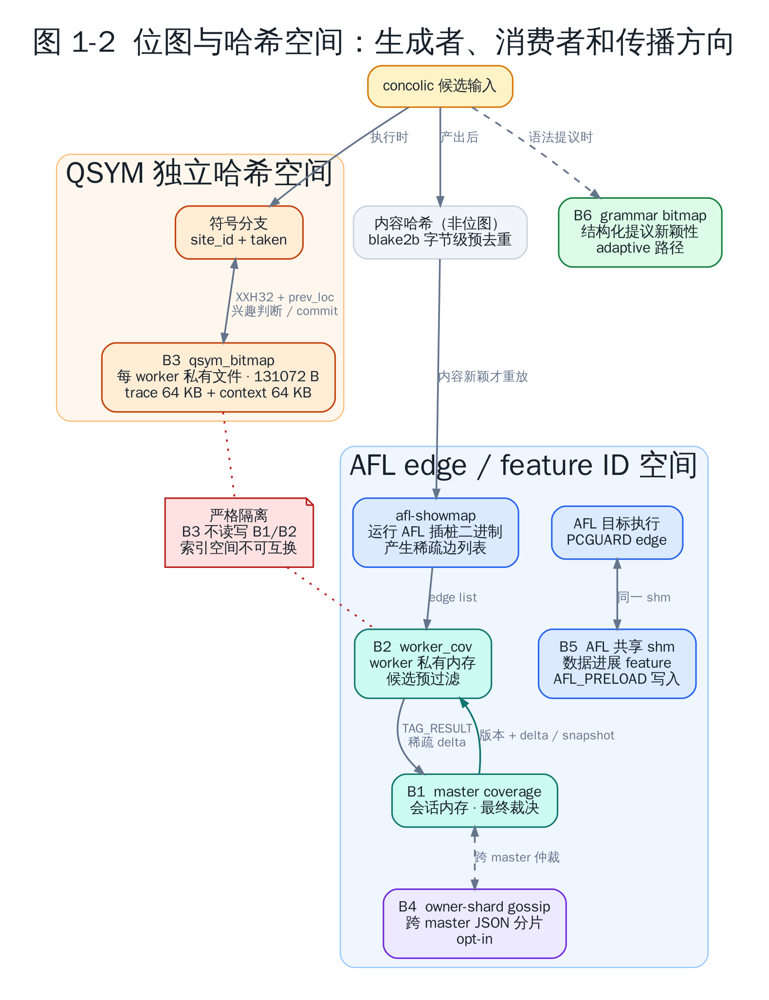{height=74%}

::: notes
B1/B2 属于 AFL edge ID 空间，均由 `*_afl` 二进制经 showmap 产生；B3 属于 QSYM 的
`site_id + taken` 独立哈希空间，只用于判断某个符号分支是否值得求解；B5 是 AFL 原生共享
data coverage feature map；B6 是语法结构新颖度。B3 绝不能直接索引 B1/B2。
:::

## 四层候选过滤

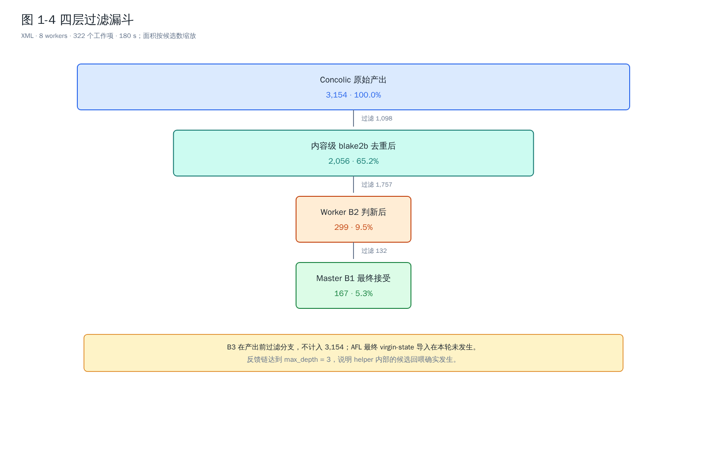{width=84%}

::: notes
并行 worker 会生成大量重复候选。第一层按 blake2b 内容摘要去重；第二层用 AFL 二进制重放；
第三层与 worker 本地覆盖状态比较；第四层由 master 对全局覆盖状态仲裁。网络只传稀疏边增量
和小型 telemetry，而不是完整 bitmap。真正的并行收益来自“少做重复工作”，不只是多起进程。
:::

## 约束形态由编译决定

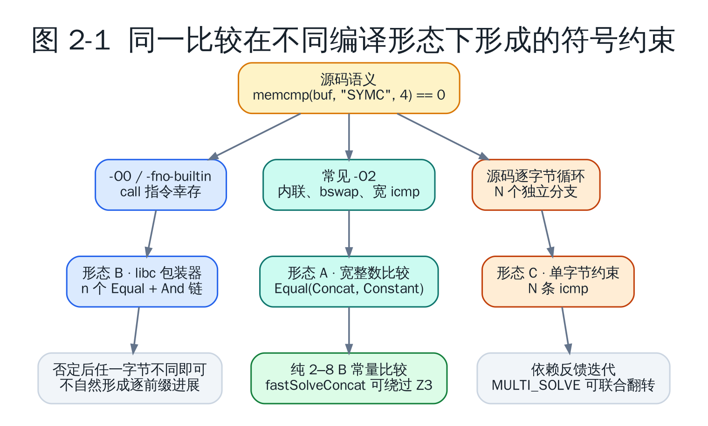{width=90%}

::: notes
同一段源码在优化后可能变成宽整数比较、逐字节短路链，或保留为 memcmp/strcmp 调用。
宽整数形态适合 `fastSolveConcat` 直接反演；逐字节形态适合 multi-solve；保留 libc 调用时
依赖包装器和字符串语义。LAF-Intel 把宽比较拆开，利于 AFL 渐进命中，却可能破坏 concolic
快速路径，因此 AFL 与 SymCC 使用不同编译变体。
:::

## 求解不是“全部交给 Z3”

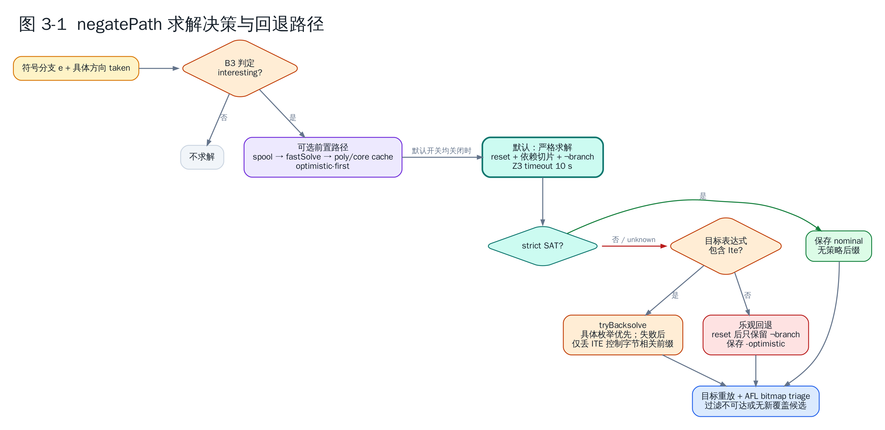{width=86%}

::: notes
默认先做分支兴趣与依赖过滤，再尝试 exact cache、prefix context、fast solve、Backsolver 或
专用字符串/语法 backend，最后才进入精确 Z3 或并行 portfolio。普通路径默认先 strict；
strict UNSAT/unknown 后才回退 optimistic。丢前缀只产生 proposal，必须完整验证和真实重放。
:::

## Query IR：跨层证据总线

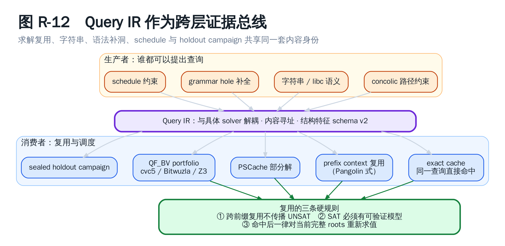{width=91%}

::: notes
Query IR 给节点、位宽、输入 offset、prefix roots 和 target root 统一内容身份。Pangolin 式复用、
PSCache、字符串求解、grammar hole、schedule joint solving 和 QF_BV portfolio 都能引用同一
查询，而不是各自保存不可比较的日志。它也是跨进程 lease、缓存和证据封存的接口。
:::

## Pangolin 式上下文复用

- 同前缀复用 Z3 assertion、model、polyhedral domain 与小 UNSAT core
- 跨前缀只召回 SAT candidate，**绝不传播 UNSAT**
- 当前完整验证与重放决定接纳；LAVA-M 本轮三类复用**命中均为 0**

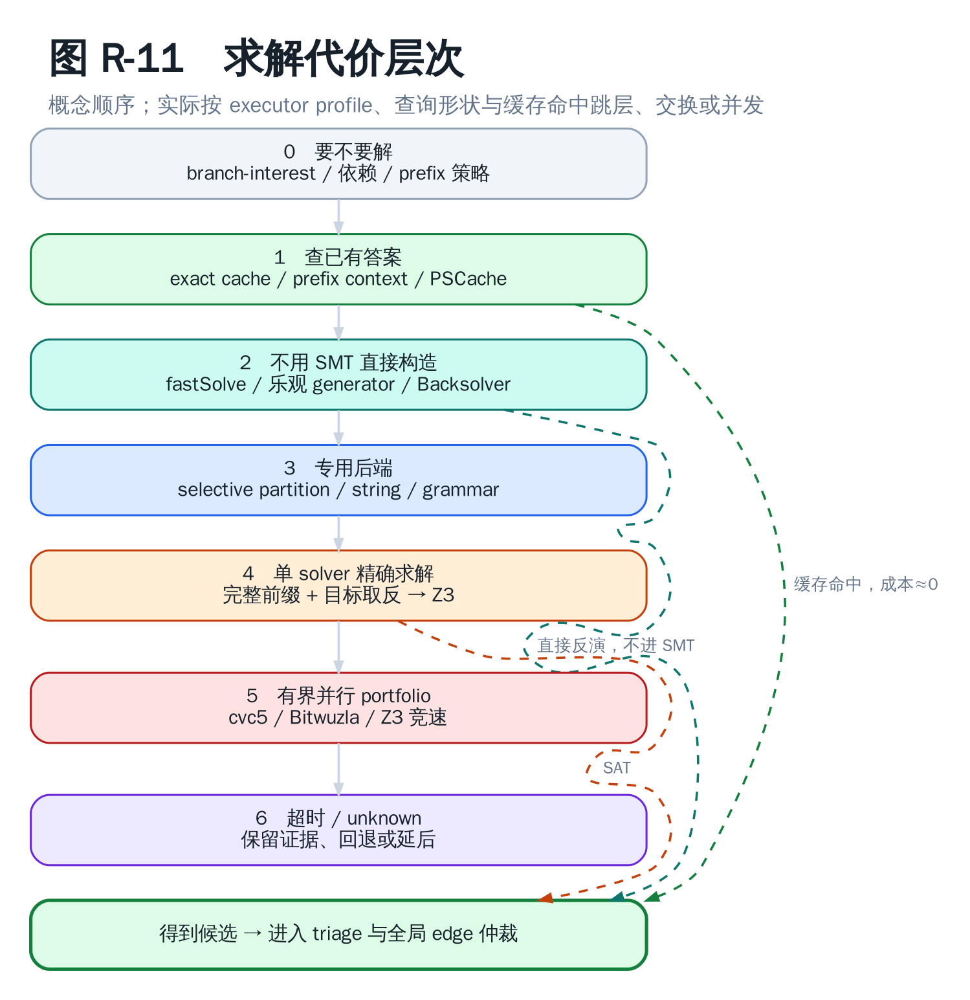{width=68%}

::: notes
核心思想是把昂贵的完整 Z3 求解推到最后。polyhedral envelope 和采样器可以激进召回模型，
但它们不拥有正确性裁决权。跨前缀的未建模非线性、数组或字符串约束可能不同，因此 UNSAT
不能传播；外来 SAT 模型只作为候选。当前 LAVA-M 运行建立了 cache entry 并执行 probe，
但三类复用命中都是 0，因此只能证明路径存在，不能宣称 context reuse 已带来收益。
:::

## Solver portfolio 与部分解

- PSCache 与 Backsolver：复用可验证部分解，有界反演 ITE controller
- QF_BV portfolio：Z3 / cvc5 / Bitwuzla，模型双验证与能力证书
- SMTgazer 式算法序列调度；String/BV 有界双表示

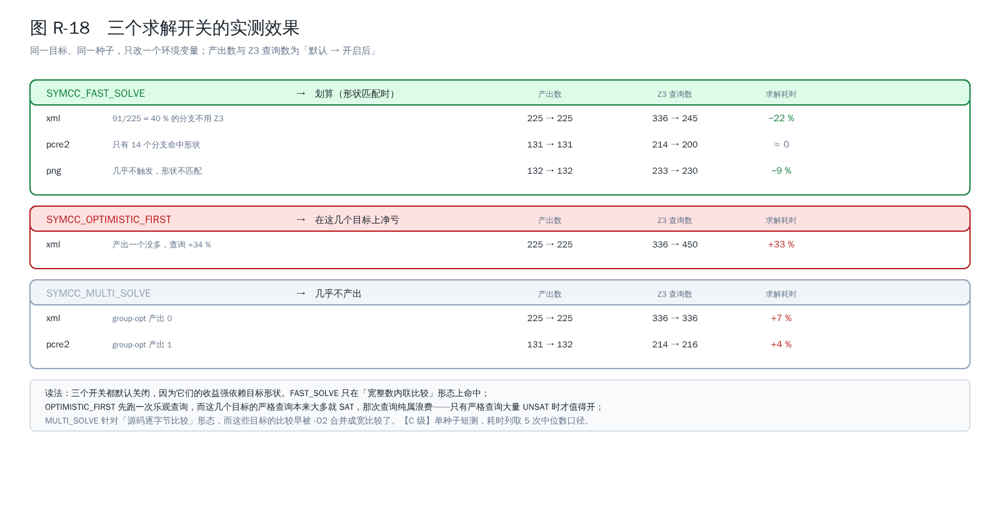{width=66%}

::: notes
这些机制不是固定串行调用栈，而是由 query shape、cache 命中和 executor profile 选择。
FAST_SOLVE 在 XML 宽比较形态上可减少 22% 求解耗时和 91 次 Z3 查询；OPTIMISTIC_FIRST
在同一目标上反而增加 33% 求解耗时，说明高级技术必须通过目标形状和 telemetry 启用。
:::

## 结构化与状态级探索

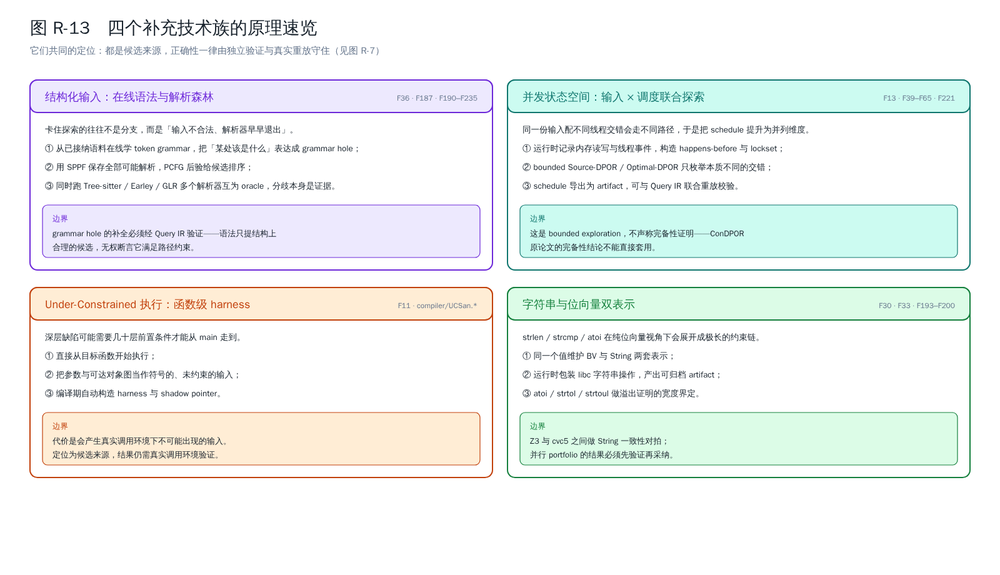{width=93%}

::: notes
在线 grammar/SPPF/PCFG 处理“输入不合法、解析器早退”；schedule + DPOR 处理输入和线程交错的
联合空间；UCSan 从指定函数构造对象图和 under-constrained harness；String/BV 双表示避免把
字符串语义完全展开为长位向量链。四类模块都只生成候选，不改变正确性边界。
:::

## Continuation 与证明门控 CFG 变换

- continuation 把 `PC + 符号存储 + 路径条件 + page-COW 内存` 作为工作项
- IFSS / Hydra 对多出口、循环与内存 tuple 做有界、证明门控的 lowering
- manifest + 未变换基线 replay；超出语义边界一律 fail closed

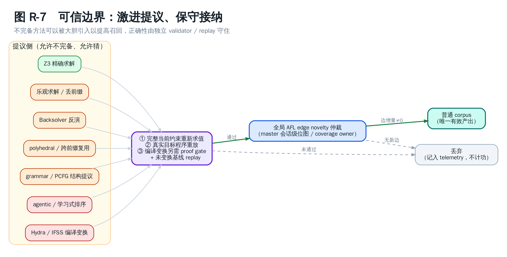{width=67%}

::: notes
状态级执行并不是任意 C/C++ 的完整快照系统，当前覆盖的是明确有界的 LLVM 语义子集。
这种保守边界允许我们激进试验 CFG 变换，同时保证不能证明的情况拒绝 lowering，而不是静默
改变语义。
:::

## 引入的 SOTA 技术与落地边界

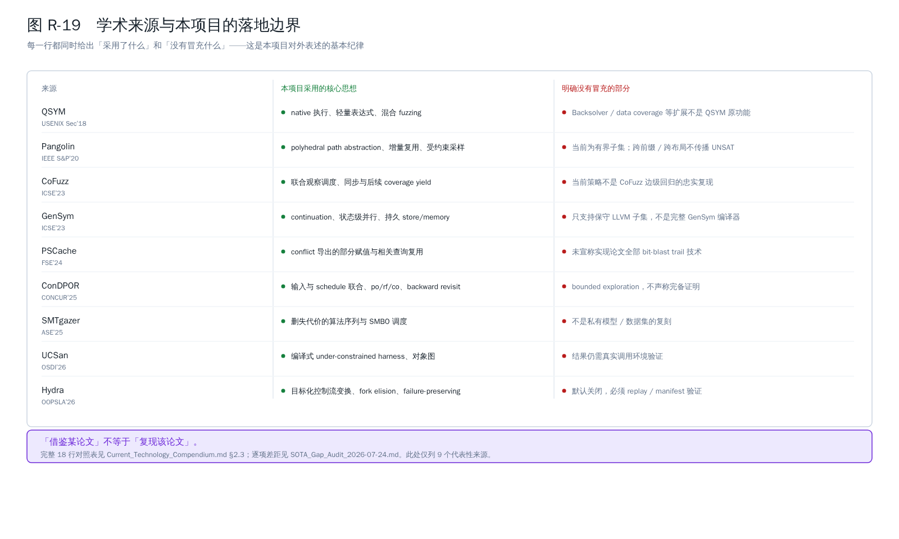{width=94%}

::: notes
“借鉴论文”不等于“完整复现论文”。项目吸收 QSYM、Pangolin、CoFuzz、GenSym、PSCache、
ConDPOR、SMTgazer、UCSan、Hydra 等工作的核心思想，并逐项记录没有复刻的部分。完整对照表
有 18 行，位于 Current_Technology_Compendium §2.3。
:::

## 落地成熟度与可信边界

| 状态 | 代表能力 |
|---|---|
| 默认主路径 | MPI seed 分派、B1/B2 triage、严格优先求解 |
| helper 自动启用 | telemetry、data coverage、部分 adaptive scheduling |
| 显式 opt-in | poly cross-prefix、portfolio、AFL native data map |
| 有界机制验证 | continuation、DPOR、UCSan、IFSS/Hydra |

::: notes
“已实现”不等于“当前 campaign 全部启用”。近似、学习和结构化模块只负责 proposal；
Query IR、proof gate 与真实 replay 负责验证，AFL edge novelty 负责普通 accepted corpus
仲裁。短预算下 SymCC 输出尚未被 AFL 在线消费，这是下一阶段要接通的闭环。
:::

## 实验方法：先定义证据等级

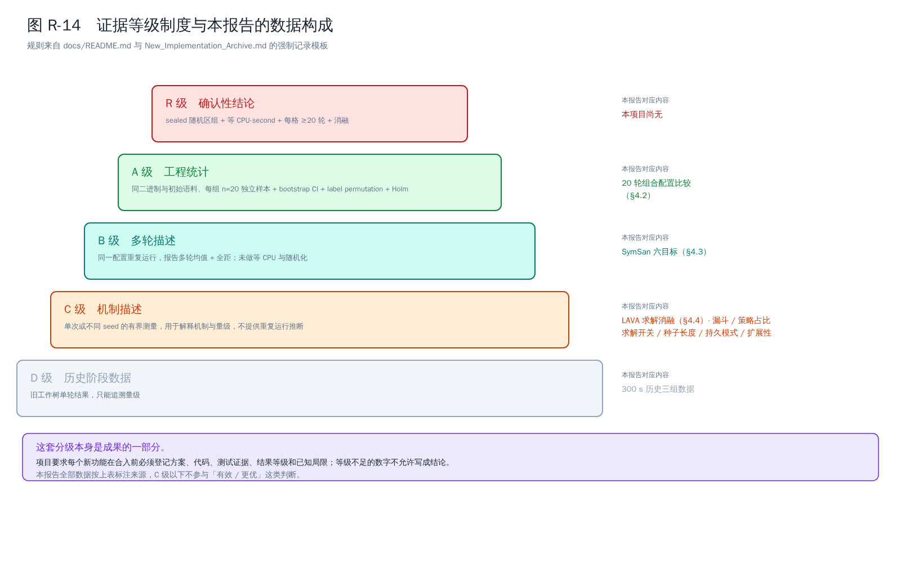{width=86%}

::: notes
主结论采用 A 级工程统计：同一 SymCC/重放二进制和初始语料、每组 20 个独立样本，
independent bootstrap 区间、label-permutation 检验和 Holm 多重比较校正。
LAVA-M 求解描述属于 C 级：13 个测量单元是不同 seed，不是重复运行，也没有置信区间。
当前还没有满足
长时、等 CPU-second、sealed 随机区组的 R 级确认性 campaign。
:::

## 主实验：当前组合配置提高 15 s 离线候选并集覆盖

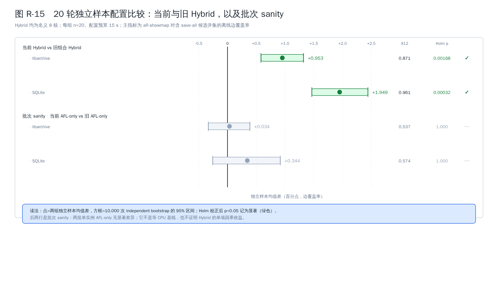{width=94%}

::: notes
在 libarchive 3.3.2 和 SQLite 3.13.0 上，每组 n=20、15 秒配置预算。主指标是结束后对
`seed ∪ AFL queues ∪ SymCC outputs（含 save-all）` 进行 afl-showmap 离线重放。
当前 `4 AFL + 3 SymCC + basic profiles` 相对同为名义 8 核的旧
`1 AFL + 6 SymCC + profiles off`，独立样本均值差为 +0.953 / +1.949pp，
Holm p 为 0.00168 / 0.00032。该结果比较组合配置，不能隔离资源比例。
:::

## 关键发现：组合配置而非 worker 数量决定短预算结果

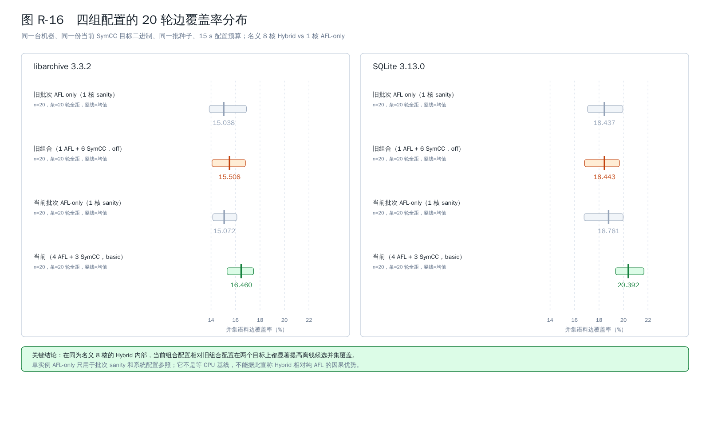{width=93%}

::: notes
两组 Hybrid 都是名义 8 核，但 AFL 实例数、SymCC worker 数和 AFL profiles 同时变化，
所以只能比较完整组合。AFL-only sanity 只有 1 核，不进入主森林图；两批 AFL-only 的
独立样本均值差为 +0.034 / +0.344pp、Holm p 均为 1，仅用于排查批次机器漂移。
:::

## LAVA-M：完整 Z3 调用下降，但总成本显著上升

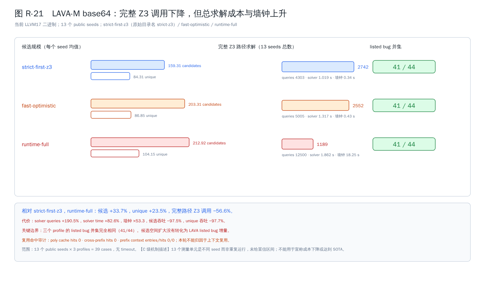{width=94%}

::: notes
13 个 public seeds 运行 strict-first-z3、fast-optimistic、runtime-full 三个 profile，共
39 个 case。runtime-full 的每 seed 候选总数 +33.7%，完整路径 Z3 调用 -56.6%；
但 solver queries +190.5%、候选吞吐 -97.5%、平均墙钟 ×53.3，listed bug 并集仍为 41/44。
poly cache、cross-prefix 与 prefix context 命中均为 0。结论是“工作量结构被改变且总成本
更高”，不是上下文复用收益、求解提速或漏洞数提升。
:::

## 并行吞吐不等于覆盖率扩展

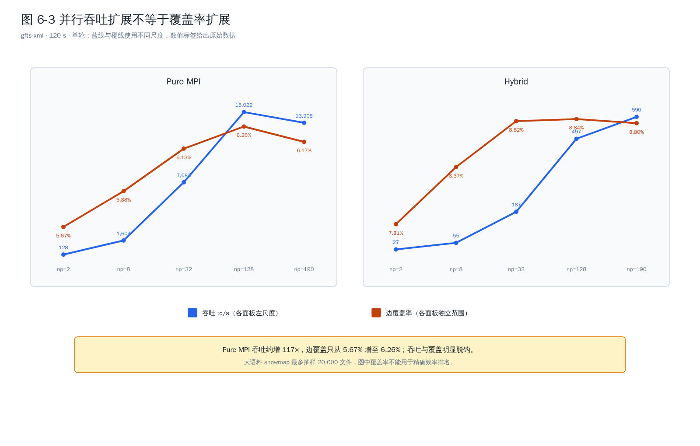{width=88%}

::: notes
gfts-xml 单轮 120 秒中，纯 MPI 从 np=2 到 np=128，吞吐由 128 增到 15,022 tc/s，
约 117 倍；边覆盖只从 5.67% 到 6.26%。并行加速的是逼近当前路径邻域上限的速度，
不是自动抬高上限。提高种子质量、候选新颖度和资源编排比盲目增加 worker 更重要。
:::

## 双引擎与真实目标覆盖

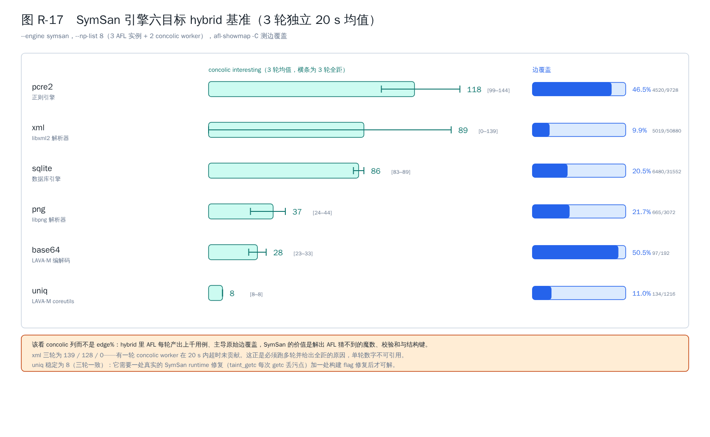{width=90%}

::: notes
`--engine symcc` 和 `--engine symsan` 共享编排、覆盖口径和评测流程。SymSan 在 pcre2、xml、
SQLite、png、base64、uniq 六个目标上各运行 3 轮 20 秒。该结果证明执行引擎抽象可用；
它是 B 级端到端结果，不是两引擎的等 CPU 性能排名。
:::

## 可以归纳的五项创新

1. **统一**：四种并行粒度共享身份、验证与反馈协议
2. **证据总线**：Query IR 连接求解、语法、schedule 与 replay
3. **双覆盖平面**：AFL 兼容边图 + 可解释结构键
4. **可信**：激进 proposal、保守 acceptance
5. **可复算**：变换、求解、解析和实验均携带证据

::: notes
创新不在于把论文名称堆在一起，而在于将不同粒度的执行、求解和结构化候选统一到同一身份、
验证与反馈协议中。科研证据层不是实验结束后的日志，而是会约束运行配置和对外结论的系统组件。
:::

## 当前边界与下一步

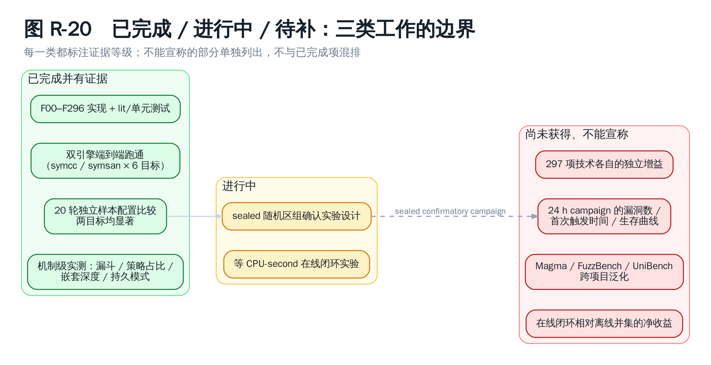{width=91%}

::: notes
目前不能宣称 297 个功能条目各自带来固定百分比，也不能把短时离线候选并集说成 AFL 已在线
消费 SymCC 输出，更不能宣称达到或超过 SOTA。下一步优先接通短预算 AFL foreign sync，
再按 sealed protocol 做等 CPU-second、长时、多目标、每格至少 20 轮的技术族消融。
:::

## 总结

- 框架已经从单一 MPI 扩展为 **七层、双引擎、多粒度并行**的研究系统
- 20 轮独立样本结果支持：**当前组合配置在两个目标的 15 s 离线候选并集指标上优于旧配置**
- LAVA-M 描述证明：新求解技术减少完整路径 Z3 调用，但总 query、墙钟和单位候选成本上升，
  listed bug 数没有增加
- 最大的工程创新是：**让激进算法只能提议，让统一验证决定接纳**
- 最大的研究挑战是：把技术族级效果升级为长时、等预算、可复算的确认性证据

::: notes
收束时强调两点。第一，项目已经给出短预算组合配置的正向工程统计，但不能拆分归功于
单项技术，也不能称为 AFL 在线闭环收益。第二，负结果同样重要：LAVA 总成本上升且 bug 数
未增、吞吐与覆盖脱钩，这些结果反过来塑造了当前架构和下一阶段实验设计。
:::
