# SymCC-Parallel 项目汇报（2026-07）

> **一句话定位**：把编译期插桩的动态符号执行（SymCC）改造成一套可并行、可换引擎、
> 可被统计检验的混合模糊测试系统，并为其中每一项技术建立"实现—测试—证据等级"的完整链路。
>
> 配套汇报：[28 页演示稿源文件](Project_Progress_Presentation_2026-07-30.md)｜
> [16:9 PowerPoint](Project_Progress_Presentation_2026-07-30.pptx)

| | |
|---|---|
| **代码基线** | fork 自 SymCC（USENIX Security'20），当前分支 `engine-configurable-symsan`，`git HEAD 146e01b2` |
| **规模（2026-07-30 快照）** | 仓库历史 578 次提交，其中 P01–P07 追踪 139 个项目定制提交；当时未提交工作树覆盖 P08–P10 · 297 个功能条目 F00–F296 · `test/` 一级目录 231 个文件 · `Configuration.txt` 记录 375 个去重 `SYMCC_*` 名称；最新状态见[当前技术全景](Current_Technology_Compendium.md) |
| **主结论（A 级工程统计）** | 同机、同一 SymCC/重放二进制和同一初始语料，每组 20 轮独立样本：当前组合配置 `4 AFL + 3 SymCC + basic profiles` 相对同为名义 8 核的旧组合配置 `1 AFL + 6 SymCC + profiles off`，最终离线候选并集边覆盖均值在 libarchive **+0.953 pp**、SQLite **+1.949 pp**（独立 bootstrap 95% CI 不跨 0，A12 = 0.871 / 0.961，Holm p = 0.00168 / 0.00032） |
| **单实例参照** | 当前 Hybrid 相对 1 核 AFL-only 的独立样本均值差为 libarchive **+1.389 pp**、SQLite **+1.611 pp**，但这是 **8 核 vs 1 核**的系统配置参照，不能解释为等 CPU 下 Hybrid 的因果优势 |
| **双引擎** | `--engine symcc` / `--engine symsan` 两条后端在 6 个真实程序上端到端跑通（3 轮 20 s 均值） |
| **项目进展** | 十个阶段 P01–P10（2026-02 → 2026-07）：先解决并行 / 交付 / 观测，再叠算法层（见 [§1.4](#14-项目进展十个阶段)） |
| **技术族描述** | LAVA-M base64 13 seeds × 3 profile：`runtime-full` 使完整路径 Z3 调用 **−56.6 %**、每 seed 候选总数 **+33.7 %**，但 solver queries **+190.5 %**、候选吞吐 **−97.5 %**、**listed bug 数持平**、墙钟 **×53.3**（见 [§4.4](#44-求解技术族消融完整-z3-调用下降但总成本上升c-级描述)） |
| **明确不宣称** | Hybrid 相对等 CPU 纯 AFL 的因果优势、297 个功能条目各自的独立增益、24 h campaign 的漏洞数与首次触发时间、跨 Magma/FuzzBench 泛化、AFL 在线闭环相对离线候选并集的净收益 |

**证据规则**：本文每个数字都标注来源与等级。
**【A 级】** = n≥20 独立样本 + bootstrap CI + label-permutation + Holm 校正，但尚未达到 sealed 随机区组；
**【B 级】** = 多轮均值 + 全距；
**【C 级】** = 单次机制短测或无重复的多实例描述，用于解释机制与量级，不参与"更优"判断；
**【D 级】** = 历史阶段单轮数据，仅供追溯；
**【论文】** = 外部文献原文。分级规则本身见 [§4.1](#41-证据分级)。

---

## 目录

- [一、问题定位与技术挑战](#一问题定位与技术挑战)　—　矛盾 · 三层挑战 · 工程规模 · **项目进展（P01–P10）**
- [二、系统架构](#二系统架构)　—　**五层模块与规模** · **构建产物与目录布局** · 七层研究栈 · 可信边界 · 两条执行主线 · MPI 协议 · 六张位图 · 双引擎
- [三、关键技术：原理与实现细节](#三关键技术原理与实现细节)　—　站点身份 · 约束形态 · 求解层次 · 过滤漏斗 · Query IR · IFSS/Hydra · 四个补充技术族
- [四、实验与结论](#四实验与结论)　—　证据分级 · **20 轮统计消融** · 双引擎基准 · **求解技术族消融** · 求解开关 · 两条负面结论 · **吞吐扩展 ≠ 覆盖率扩展**
- [五、创新性与先进性小结](#五创新性与先进性小结)　—　学术来源与落地边界 · 五个组合创新
- [六、边界、风险与下一步](#六边界风险与下一步)　—　五类不能宣称的结论 · 已知边界 · 路线
- [附录　复现与证据索引](#附录复现与证据索引)

---

## 一、问题定位与技术挑战

### 1.1 混合模糊测试要解决的矛盾

覆盖率制导模糊测试（AFL++ 一类）靠随机变异推进，单核每秒可以跑上万次执行，但它
**猜不出精确取值**：一个 4 字节魔数比较 `if (x == 0x6c617564)`，随机命中的概率在
2⁻³² 量级。动态符号执行（DSE / concolic）反过来——它把这条分支的取反条件交给 SMT
求解器，一次就能算出答案，但每个测试用例都要真实执行一遍、构造表达式、调用求解器。

本项目自己的实测可以对照这个量级差：png 目标上 AFL 持久模式跑到
**143,718 execs/s**（[§4.10](#410-工程性能实测c-级)）；而 concolic 侧，8 个 worker 在
180 s 内一共完成 **322 个工作项**（[§3.6](#36-四层过滤漏斗并行有效性的核心)），
即约 **1.8 个工作项/秒**——每个工作项是"一次完整目标执行 + 符号追踪 + 求解"。
两者是不同目标上的观测，只用于说明量级，不是受控对比。

混合模糊测试的思路是让两者互补：模糊测试负责广度和吞吐，符号执行负责啃下那些
"钥匙型"约束（魔数、长度字段、校验和、结构标记）。这个思路在 QSYM（USENIX Sec'18）
之后已成为共识，**但"怎么让它真的有效"仍然是开放问题**。ICSE'23 的 CoFuzz 在统一
设置下重测了 7 个 hybrid fuzzer，两条发现直接指向这个问题（详见 [§4.12](#412-与-icse23-统一再评估的关系论文)）：

- **Finding 1**：hybrid fuzzer 原论文之间的边覆盖对比结果**不一定能推广到其他实验设置**——
  三个明确宣称改进 QSYM 协调模式的工作（DigFuzz / MEUZZ / Pangolin），在统一设置下
  **都没打过 2018 年的 QSYM**；
- **Finding 2**：hybrid 相对传统覆盖率制导模糊测试的边覆盖优势**整体有限**
  （原文 *"overall limited"*），说明 concolic 的能力没有被充分释放。

本项目要回答的正是工程侧的这个问题：**在多核机器上，把符号执行并行起来之后，它到底
在哪些环节产生价值、在哪些环节纯属浪费，以及如何用可检验的方式说清楚。**

### 1.2 三个层次的技术挑战

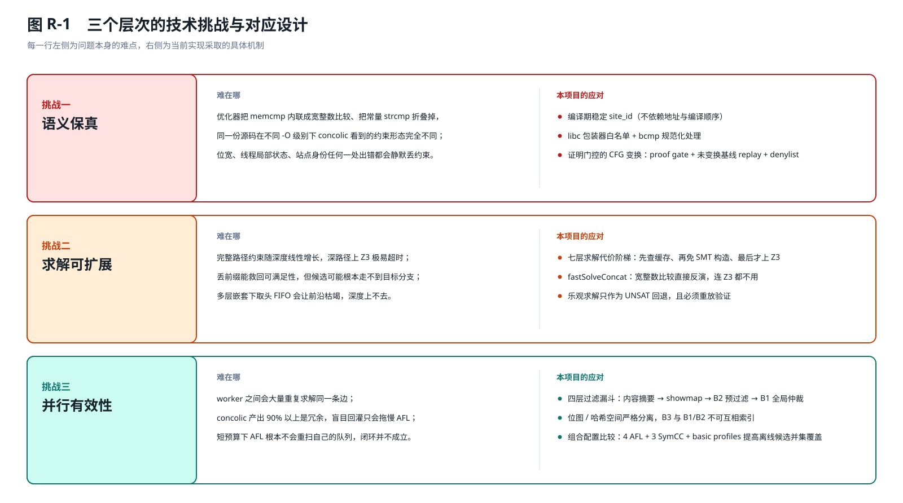

> 图 R-1。[PNG 版本](diagrams/report/fig-r1-challenges.png)｜[绘图脚本](diagrams/render_project_report.py)

三个挑战不是并列的，而是层层依赖：**语义不保真，求解再快也解错了；求解不可扩展，
并行只是把错误放大 N 倍；并行没有有效性设计，再多核也只是重复劳动**。项目的架构分层
正对应这三层。

### 1.3 工程规模

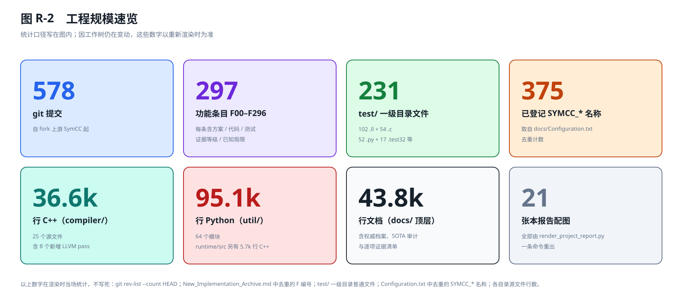

> 图 R-2。统计口径写在图内。[PNG 版本](diagrams/report/fig-r2-scale.png)

规模数字本身不是成果，但它决定了一件事：**这个体量的系统，如果没有强制的记录与证据
制度，任何一处"看起来有效"的改动都无法被后来的人复核。** 这就是 [§4.1](#41-证据分级)
那套分级存在的原因。

### 1.4 项目进展：十个阶段

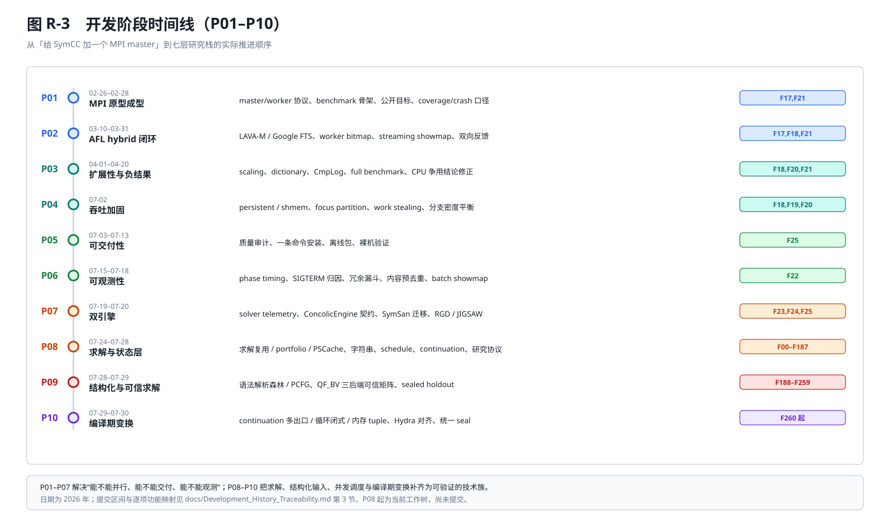

> 图 R-3。[PNG 版本](diagrams/report/fig-r3-timeline.png)｜数据源
> [`Development_History_Traceability.md`](Development_History_Traceability.md) 第 3 节

推进顺序本身就是一条结论：**先解决"能不能并行、能不能交付、能不能观测"，
再往上叠算法**。

| 阶段 | 日期（2026） | 主题 | 关键交付 |
|---|---|---|---|
| P01 | 02-26 – 02-28 | MPI 原型成型 | master/worker 协议、benchmark 骨架、coverage/crash 口径、多 master |
| P02 | 03-10 – 03-31 | AFL hybrid 闭环 | LAVA-M / Google FTS、worker bitmap、streaming showmap、双向反馈 |
| P03 | 04-01 – 04-20 | 扩展性与**负结果** | scaling、dictionary、CmpLog、full benchmark、**CPU 争用结论修正** |
| P04 | 07-02 | 吞吐加固 | persistent / shmem、focus partition、work stealing、分支密度平衡 |
| P05 | 07-03 – 07-13 | 可交付性 | 质量审计、一条命令安装、离线包、裸机验证 |
| P06 | 07-15 – 07-18 | 可观测性 | phase timing、SIGTERM 归因、冗余漏斗、内容预去重、batch showmap |
| P07 | 07-19 – 07-20 | 双引擎 | solver telemetry、`ConcolicEngine` 契约、SymSan 迁移、RGD / JIGSAW |
| P08 | 07-24 – 07-28 | 求解与状态层 | 求解复用 / portfolio / PSCache、字符串、schedule、continuation、研究协议 |
| P09 | 07-28 – 07-29 | 结构化与可信求解 | 语法解析森林 / PCFG、QF_BV 三后端可信矩阵、sealed holdout |
| P10 | 07-29 – 07-30 | 编译期变换 | continuation 多出口 / 循环闭式 / 内存 tuple、Hydra 对齐、统一 seal |

两点需要说明：

1. **P03 的主要产出是一个负结果。** 那一轮把"CPU 争用"当成扩展性瓶颈的结论被自己的
   对照实验推翻并公开修正——这类修正在本项目里不是例外，而是常态（见
   [§4.9](#49-两条负面结论c-级) 和 [§6.1](#61-明确不能宣称的结论)）。
2. **P08 起为当前工作树，尚未提交。** 因此 P08–P10 的功能只有实现与单元/lit 测试证据，
   还没有进入 §4.2 那种统计消融。

### 1.5 顺带修掉的一个真实编译器崩溃

工程侧值得单独记一笔：本轮为构建 libarchive 评测目标时，插件在 `-O3` 编译
`archive_write_set_format_7zip.c` 时崩溃，栈顶为

```text
llvm::AAResults::getModRefInfo(CallBase, MemoryLocation)
Symbolizer::tryBuildImplicitFlowMemoryLoad
```

根因是 veritesting / implicit-flow 的内存快照检查对 `CallBase` 直接发起 LLVM
alias/modref 查询，在该 LLVM 18 IR 与分析状态组合下触发崩溃。修复采用**保守语义**：
非写内存指令返回"不修改"；`CallBase` 一律视为**可能修改**目标位置，因此拒绝该 region
快照；其他写指令继续用 LLVM AA 精化。

这会少接受一部分跨 call 的 region 合并，但不会错误地把可能被 call 修改的内存当成稳定
快照——又一次 fail closed 的取舍。修复后原崩溃对象文件编译成功、`archive_static`
完整构建、harness 链接可执行，定向 lit 测试 `backsolver_memory_state_reject` 通过。

> 编译日志仍显示 `llvm.umin` / `llvm.smin` / `llvm.umax` 被 concretize。它不是本次崩溃，
> 但会在相关数据流处丢失符号表达式，是后续要补的 LLVM intrinsic 语义覆盖
> （[§6.3](#63-下一步)）。

---

## 二、系统架构

### 2.1 系统构成：五层模块与它们的规模

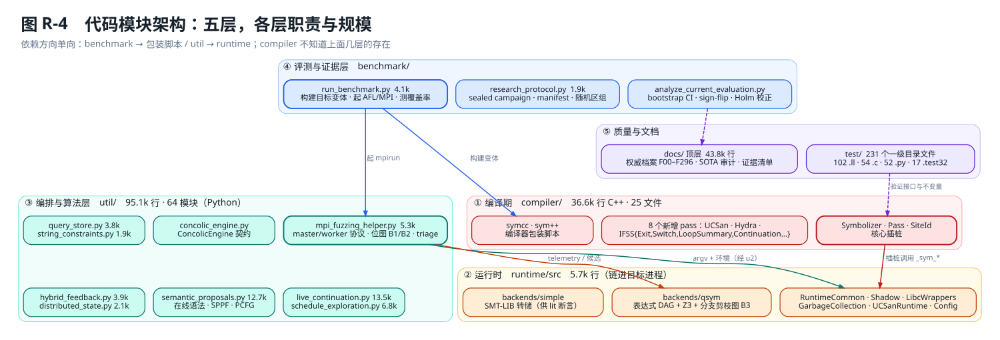

> 图 R-4。[PNG 版本](diagrams/report/fig-r4-modules.png)｜[DOT 图源](diagrams/report/src/fig-r4-modules.dot)

先把系统当作一套软件看。它由五层构成，每层有明确的边界与规模：

| 层 | 目录 | 规模 | 职责 | 关键文件 |
|---|---|---:|---|---|
| **① 编译期** | `compiler/` | 36.6k 行 C++<br>25 个文件 | 生成插桩后的目标二进制 | `Symbolizer.cpp`、`Pass.cpp`、`SiteId.h`，以及 8 个新增 pass：`UCSan`、`HydraTransformation`、`IFSSExitLowering`、`IFSSSwitchLowering`、`IFSSLoopSummary`、`IFSSContinuationLowering`、`IFSSContinuationMemory`、`ContinuationLowering` |
| **② 运行时** | `runtime/src/` | 5.7k 行 | 链进目标进程，构造表达式与路径约束 | `RuntimeCommon.cpp`、`Shadow.cpp`、`LibcWrappers.cpp`、`UCSanRuntime.cpp`；后端 `backends/qsym`（Z3 + 分支剪枝图 B3）与 `backends/simple`（SMT-LIB 转储，供 lit 断言） |
| **③ 编排与算法** | `util/` | 95.1k 行 Python<br>64 个模块 | 并行调度、求解复用、结构化提议、状态级探索 | `mpi_fuzzing_helper.py`(5.3k)、`concolic_engine.py`、`query_store.py`(3.8k)、`semantic_proposals.py`(12.7k)、`live_continuation.py`(13.5k)、`schedule_exploration.py`(6.8k)、`hybrid_feedback.py`(3.9k) |
| **④ 评测与证据** | `benchmark/` | — | 构建变体、跑 campaign、统计分析、封存实验身份 | `run_benchmark.py`(4.1k)、`research_protocol.py`(1.9k)、`analyze_current_evaluation.py` |
| **⑤ 质量与文档** | `test/`、`docs/` | `test/` 一级目录 231 个文件<br>`docs/` 顶层 43.8k 行文档 | 验证接口与不变量；记录方案 / 证据 / 局限 | `test/*.ll`(102)、`*.c`(54)、`*.py`(52)、`*.test32`(17)；`New_Implementation_Archive.md` |

**依赖方向是单向的**：`benchmark/` 调用编译器包装脚本和 `mpirun`；`util/` 通过
`ConcolicEngine` 契约拼出 argv 与环境去起运行时；运行时把 telemetry 和候选回传给
`util/`；`compiler/` 只负责往目标里插 `_sym_*` 调用，不知道上面几层的存在。
**这条单向性是双引擎能够共存的前提**（[§2.10](#210-双引擎抽象)）。

### 2.2 构建产物：一份源码，七类二进制

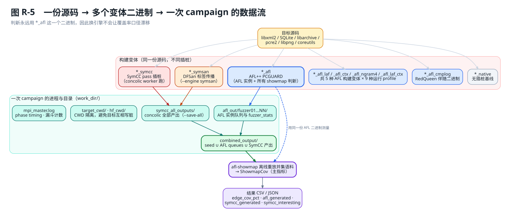

> 图 R-5。[PNG 版本](diagrams/report/fig-r5-artifacts.png)｜[DOT 图源](diagrams/report/src/fig-r5-artifacts.dot)

一个容易误解的地方：**campaign 里跑的不是一个二进制，而是同一份源码编出的一组变体**。

| 变体 | 插桩方式 | 谁在跑 |
|---|---|---|
| `*_symcc` | SymCC LLVM pass | concolic worker |
| `*_symsan` | DFSan 标签传播 | `--engine symsan` 的 worker |
| `*_afl` | AFL++ PCGUARD | **AFL 实例，以及所有 `afl-showmap` 判新**（B1 / B2） |
| `*_afl_laf` / `*_afl_ctx` / `*_afl_ngram4` / `*_afl_laf_ctx` | laf-intel / 上下文 / n-gram 组合 | 多 profile 并行时的 AFL 从实例 |
| `*_afl_cmplog` | RedQueen 伴随二进制 | 与主二进制配对使用 |
| `*_native` | 无插桩 | 基线与崩溃复现 |

仓库定义了 **5 种 AFL 构建变体 × 9 种运行 profile**（`explore-cmplog`、`mopt-fast`、
`laf-exploit`、`ctx-rare`、`ngram-coe`、`laf-seek`、`ctx-mmopt`、`ngram-lin`、`lafctx-quad`），
由 `--aflpp-profiles auto/basic/full/off` 选择启用多少。

> **一条必须记住的规则**：无论哪个引擎产出候选，**判新永远用 `*_afl` 这一个二进制**。
> 这保证了 B1/B2 位图始终在同一个边 ID 空间里（[§2.9](#29-位图与哈希空间最容易搞错的地方)），
> 也保证了换引擎不会让覆盖率口径漂移。

**一次 campaign 的目录布局**（`work_dir/`）：

| 目录 | 内容 |
|---|---|
| `afl_out/fuzzer01…NN/` | 各 AFL 实例的 `queue/`、`crashes/`、`fuzzer_stats` |
| `symcc_all_outputs/` | concolic 的全部产出（`--save-all`） |
| `combined_output/` | `seed ∪ 所有 AFL queue ∪ SymCC 产出`，主指标就在这上面测 |
| `target_cwd/`、`hf_cwd/` | CWD 隔离，避免 sqlite 一类目标互相写脏工作目录 |
| `mpi_master.log` | phase timing 与漏斗计数 |

截至本报告的 F296 快照，[`Configuration.txt`](../Configuration.txt) 记录 **375 个去重 `SYMCC_*` 名称**
（按文档文本中的完整名称去重，包含编译期、运行时和 helper 选项）。主要技术族包括：
`POLY_*`(23)、`LIVE_*`(22)、`IFSS_*`(11)、`SCHEDULE_*`(23)、`SELECTIVE_*`(14)、
`STRING_*`(13)、`QUERY_*`(13)、`AGENTIC_*`(12)、`SOLVER_*`(10)、`UCSAN_*`(8)、
`HYDRA_*`(8)、`DPOR_*`(8) 等。
**绝大多数默认关闭**——原因见 [§4.6](#46-三个求解开关到底值不值得开c-级)：收益强依赖目标形状。
完整清单见 [`Configuration.txt`](../Configuration.txt)。

### 2.3 七层研究栈

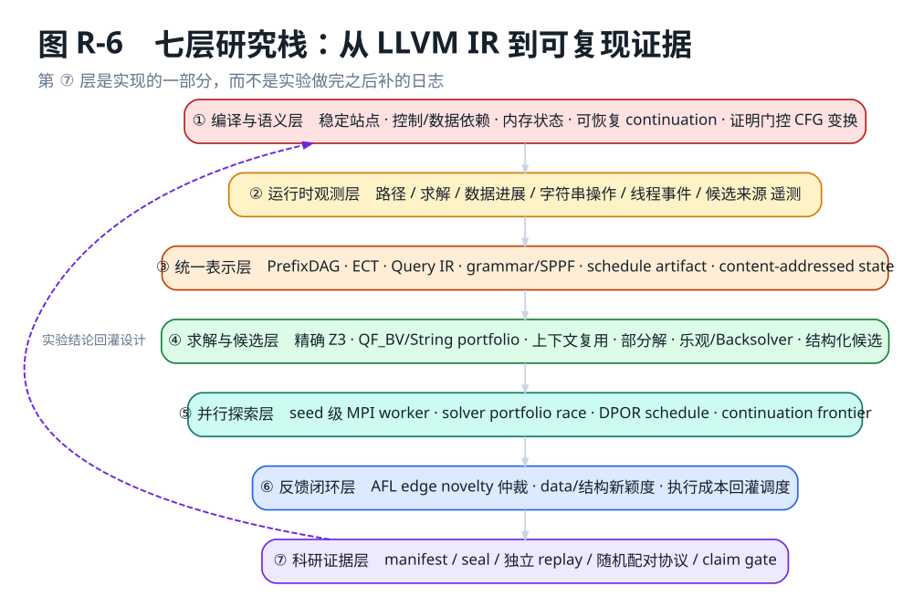

> 图 R-6。[PNG 版本](diagrams/report/fig-r6-layers.png)｜[DOT 图源](diagrams/report/src/fig-r6-layers.dot)

项目已经不再是"给 SymCC 加一个 MPI master"。当前形成七个彼此连接的层：

| 层 | 职责 | 主要产物 |
|---|---|---|
| ① 编译与语义层 | 在 LLVM IR 里提取稳定站点、控制/数据依赖、内存状态和可恢复 continuation；对难以直接符号化的控制流做有界、证明门控的变换 | 插桩后的目标二进制、变换 manifest |
| ② 运行时观测层 | 记录路径、求解、数据进展、字符串操作、线程事件和候选来源 | 统一 `SolverTelemetry` JSON |
| ③ 统一表示层 | 用 PrefixDAG、ECT、Query IR、grammar/SPPF、schedule artifact 和内容寻址状态保存可复用结构 | 可持久化、可跨进程传递的中间表示 |
| ④ 求解与候选层 | 组合精确 Z3、QF_BV/String portfolio、上下文复用、部分解、乐观求解、Backsolver 与结构化候选生成 | 候选输入 |
| ⑤ 并行探索层 | 同时支持 seed 级 MPI worker、solver 级 portfolio 竞速、schedule 级 DPOR、continuation state 级前沿 | 分布式工作项 |
| ⑥ 反馈闭环层 | 普通语料由 AFL edge novelty 仲裁接纳；data 覆盖、内容摘要、结构新颖度与执行成本作为调度信号 | 接纳/丢弃决策、下一轮优先级 |
| ⑦ 科研证据层 | manifest、seal、独立 replay、随机化配对协议、消融与 claim gate | 可复算的实验身份 |

第 ⑦ 层是**实现的一部分，而不是实验做完之后补的日志**——这一点在 [§5](#五创新性与先进性小结)
展开。

### 2.4 最重要的系统不变量：激进提议、保守接纳

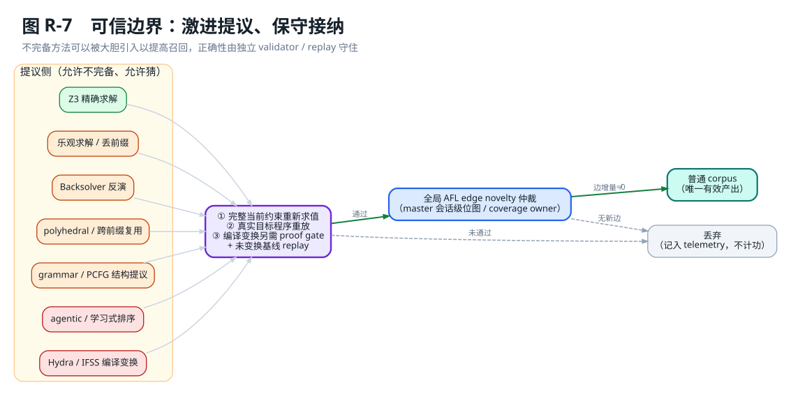

> 图 R-7。[PNG 版本](diagrams/report/fig-r7-trust-boundary.png)｜[DOT 图源](diagrams/report/src/fig-r7-trust-boundary.dot)

整个系统只有一条硬约束：

> **输入 proposal 不能绕过完整当前约束验证和真实目标程序重放；编译变换不能绕过
> proof gate 与未变换基线 replay；进入普通语料的候选最终必须通过全局 AFL edge
> novelty 仲裁。**

这条不变量的工程意义在于**解耦了"敢不敢用"和"对不对"**：乐观求解可以丢掉前缀、
polyhedral 可以跨前缀复用模型、语法模块可以按 PCFG 瞎猜、agentic 模块可以给出没有
任何保证的排序、Hydra 可以改写控制流——它们全都只是提议。正确性由独立的验证与重放
保证，因此这些不完备方法**可以被激进地引入，而不污染结论**。

反过来说，这也划出了一条明确的红线：**学习式和 agentic 模块永远没有授权 UNSAT、
覆盖或程序等价的权力**。

### 2.5 两条执行主线

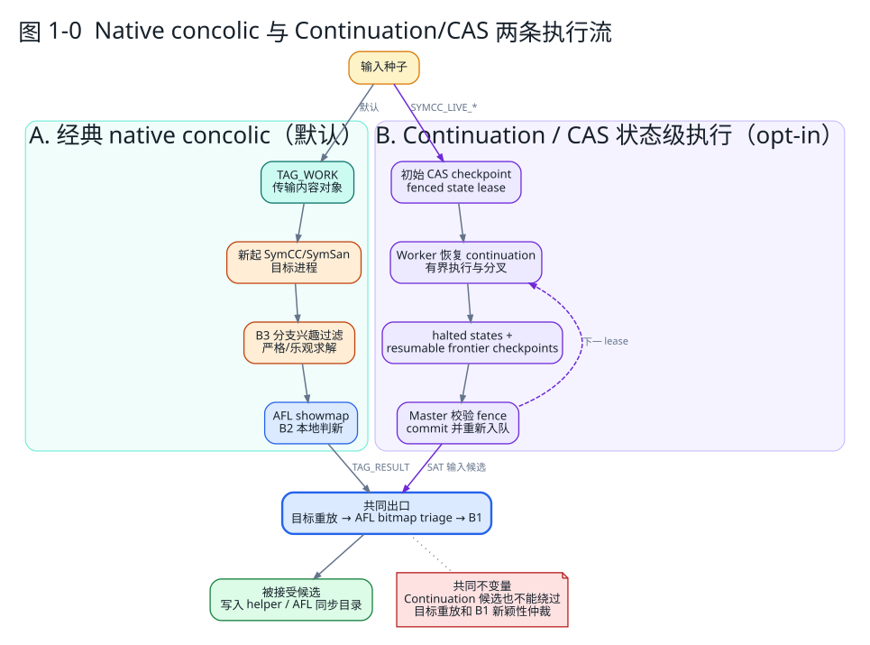

> 图 1-0（引自 QA3 图集）。[PNG 版本](diagrams/qa3/fig-1-0-execution-modes.png)

**主线 A：native concolic + AFL++ 闭环（默认、最成熟）**——每个工作项起一个真实的
插桩目标进程，跑完一条路径，翻转分支，产出候选，经 triage 回到语料。

**主线 B：Continuation / CAS 状态级执行**——不是"多起几个相同进程"，而是把**可恢复
的符号状态**本身当作工作单元：LLVM 子集被降低为 continuation IR，检查点保存程序计数器、
符号存储、路径条件根、page-COW 内存和对象生命周期，状态以内容哈希寻址，coordinator
只租约分发状态描述符，worker 恢复后在有界步数内执行并在符号分支处 fork。

两条主线的关键共性是：**具体化之后走同一个目标重放和同一个 AFL 仲裁**，所以评测口径
不会因为执行模式不同而漂移。

> ⚠ 主线 B 当前覆盖的是**明确有界的 LLVM 语义子集**，遇到异常处理、无法证明的别名、
> 超预算 pointer domain、不支持的 intrinsic 或复杂循环时会保守拒绝 lowering。它不是
> 任意 C/C++ 程序的完整状态级符号执行。

### 2.6 进程拓扑

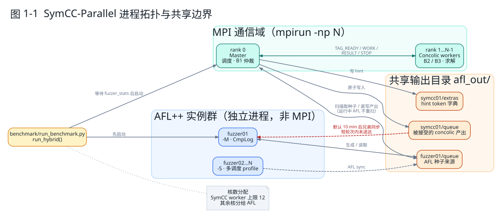

> 图 1-1（引自 QA3 图集）。[PNG 版本](diagrams/qa3/fig-1-1-process-topology.png)

一次 hybrid campaign 在一台机器上同时存在三类角色：

1. **AFL++ 实例群**：标准 `-M fuzzer01` / `-S fuzzerNN` 共享同一个 `-o` 目录，
   带 `AFL_AUTORESUME=1 AFL_NO_UI=1 AFL_SKIP_CPUFREQ=1`；
2. **MPI 通信域**：1 个 master + N 个 concolic worker，master 扫描 AFL 队列、
   去重、分派工作项，并持有会话级覆盖位图；
3. **共享目录**：`symcc01/` 作为 concolic 产出的落地目录，`target_cwd` 做 CWD 隔离
   （否则 sqlite 一类目标会互相写脏工作目录）。

### 2.7 MPI 协议：拉模式 + 内容寻址 + 严格启动次序

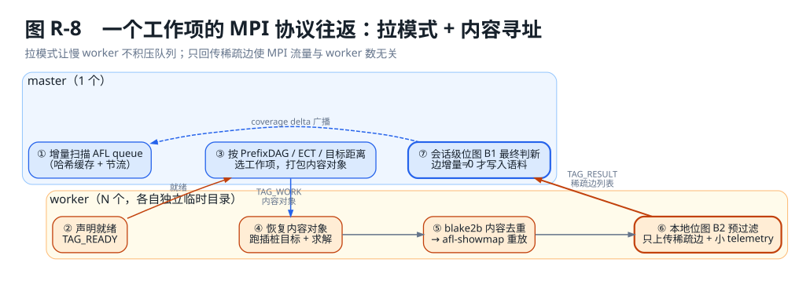

> 图 R-8。[PNG 版本](diagrams/report/fig-r8-mpi-protocol.png)｜[DOT 图源](diagrams/report/src/fig-r8-mpi-protocol.dot)

并行框架的三个协议决策，直接决定了它能不能扩到几十个 worker：

1. **拉模式而非推模式**——worker 先声明就绪，master 才分发。这样慢 worker 不会积压
   队列，也不需要 master 预测每个工作项的耗时（耗时方差极大，见
   [§4.5](#45-求解策略的实际构成c-级) 的求解耗时列）。
2. **内容寻址的种子对象**——分发的是内容对象而不是路径，因此 worker 的临时目录可以
   完全隔离（`mkdtemp("symcc_mpi_w{rank}_")`），不存在多个 worker 抢同一个文件的问题。
3. **只回传稀疏边 + 小型 telemetry**——worker 在本地做完 showmap 和 B2 预过滤，
   上行流量是"边 ID 列表"而不是候选文件本身。这是 [§3.6](#36-四层过滤漏斗并行有效性的核心)
   那个漏斗必须放在 worker 侧的直接原因。

协议还包含原子文件写入、非阻塞消息的资源回收、终止握手、以及**超时区分**——
内层 `timeout -k 5 <timeout_sec>`、外层 Python `timeout_sec + 15` 兜底，
`killed = retcode in (124, -9, 137)`，超时与崩溃在统计上不混为一谈。

**focus set 是这套协议的一个副产品**：master 可以在工作项里指定"只把哪些输入字节当作符号"。


> 图 4-3（引自 QA3 图集）。[PNG 版本](diagrams/qa3/fig-4-3-focus-bytes.png)

范围外的字节返回 `nullptr`，依赖它们的分支既不生成查询也不产生候选——所以
`SYMCC_FOCUS_BYTES=0-3` 会把 6 个产出压到 4 个。**注意 focus 不等同于截短输入**：
偏移仍在门控前记录，程序看到的仍是完整输入。这让 master 可以按输入依赖域切分工作，
而不必真的去改种子。

**启动次序是严格的**：先用 AFL 插桩目标对初始种子跑 `afl-showmap` 得到 seed coverage
→ 启动 AFL master/secondary → 等 `afl_out/fuzzer01/fuzzer_stats` 出现（AFL 的目标 argv
和 afl-showmap 路径都从这里解析）→ 才启动 MPI master 与 worker。顺序颠倒会导致
helper 拿不到目标 argv。

### 2.8 单个工作项的完整执行次序

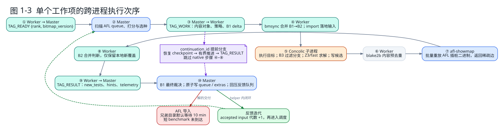

> 图 1-3（引自 QA3 图集）。[PNG 版本](diagrams/qa3/fig-1-3-worker-sequence.png)

1. AFL++ 或语料产生种子；
2. coordinator 结合 PrefixDAG、ECT、目标距离、历史收益和 worker 状态选择工作项；
3. master 下发种子对象、executor/profile、focus set、目标分支、schedule prefix 和
   AFL 边位图版本或增量；
4. 插桩目标**真实执行**，运行时构造符号表达式和路径约束；
5. QSYM 的私有 branch-interest 位图判断该分支是否值得再次求解；
6. 运行时内的精确解、Backsolver、采样或字符串后端可直接产生候选；QueryStore、grammar、
   agentic 等异步路径通过各自 artifact 产生候选，但汇入相同 triage；
7. worker 先用 **128-bit BLAKE2b 摘要**做内容去重，再用 AFL 插桩目标做 showmap 重放；
8. worker 的本地边位图做预过滤，只上传本地判新的稀疏边；
9. master 在会话级边位图上做**最终 novelty claim**，只有全局边增量非零才写入语料；
10. master 消费 telemetry，更新 PrefixDAG、ECT、数据进展跟踪器、策略后验和下一轮优先级。

### 2.9 位图与哈希空间：最容易搞错的地方

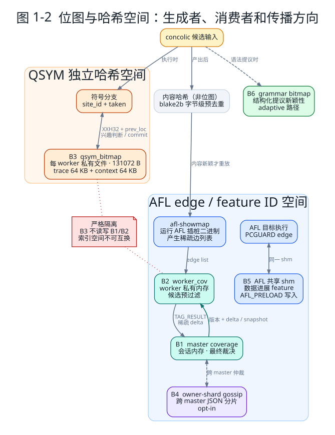

> 图 1-2（引自 QA3 图集）。[PNG 版本](diagrams/qa3/fig-1-2-bitmap-spaces.png)

系统里"bitmap"不是同一个对象的多个名字，**混淆它们会直接导致重复求解判断错误**：

| 标签 | 生成者 | 哈希空间 | 用途 | 有最终接纳权？ |
|---|---|---|---|---|
| **B1** master 覆盖图 | AFL 插桩目标的 showmap | AFL 边 ID | 会话级 edge novelty 最终仲裁 | **是** |
| **B2** worker 本地图 | worker 对候选重放的稀疏边 | AFL 边 ID | 本地预过滤，减少 MPI 流量 | 否 |
| **B3** QSYM 分支兴趣图 | 符号分支站点/结果哈希 | `XXH32(site_id, taken) % 65536`，索引 `(prev_loc>>1)^h` | 判断分支是否值得求解 | 否 |
| **B4** coverage owner 分片 | 多 coordinator 持久状态 | AFL 边 ID | 跨 master 的 ownership 与 claim | 仅多 master 模式 |
| **B5** AFL 数据命名空间 | preload runtime 写 AFL 共享图 | AFL map 低位保留区 | 让 AFL 把 `memcmp` 前缀进展当作 map feature | 注入时与边共同保留 |
| **B6** grammar 位图 | parser production/rule ID | 规则 ID | 结构化输入新颖度 | 否 |

**B3 与 B1/B2 是互不相通的 ID 空间。** `SYMCC_AFL_COVERAGE_MAP` 在 worker 中实际指向
131072 字节的 QSYM `qsym_bitmap`（64 KB trace + 64 KB context），**拿 AFL 边 ID 去索引
它得到的分类毫无意义**。代码里对此有显式注释要求分离。

再往底一层，AFL 边 ID 本身也不是"编译期随机数"：本项目 clang-18 走 **PCGUARD**，
`__sanitizer_cov_trace_pc_guard` 直接用 `__afl_area_ptr[*guard]` 索引，guard 下标在
**加载期顺序分配**，`__afl_map_size = __afl_final_loc + 1` 随目标插桩规模走——
`MAP_SIZE=65536` 是起步值而非硬上限，这就是 B1/B2 必须可增长的原因。

### 2.10 双引擎抽象

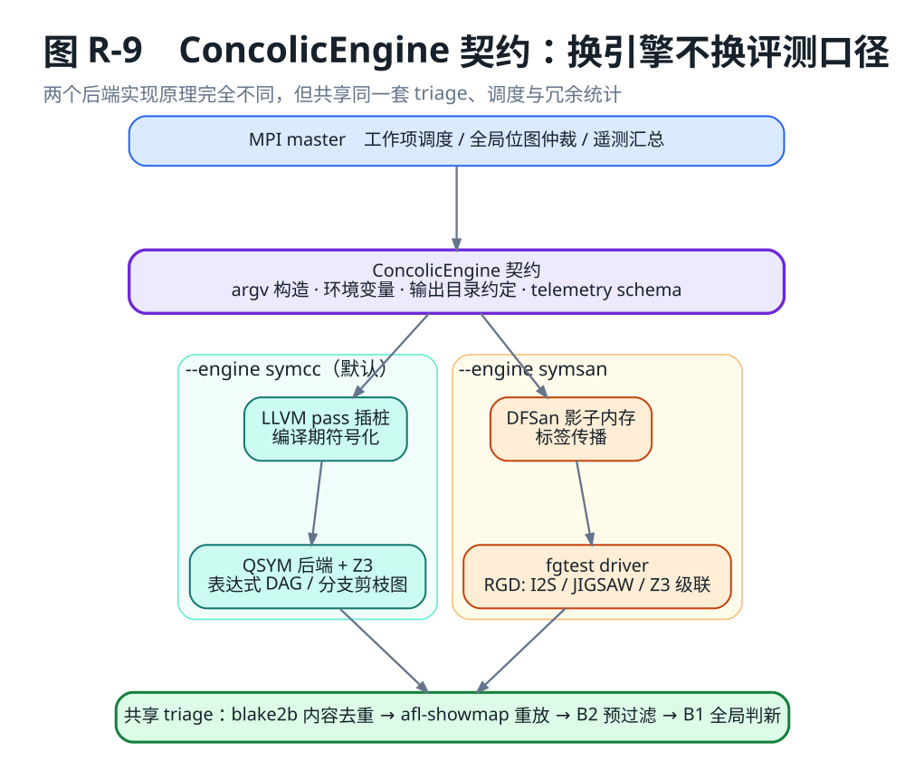

> 图 R-9。[PNG 版本](diagrams/report/fig-r9-engine-abstraction.png)｜[DOT 图源](diagrams/report/src/fig-r9-engine-abstraction.dot)

`--engine symcc | symsan` 是本项目一个**结构性**的工程成果：两个后端在符号执行的实现
原理上完全不同——

- **SymCC**：LLVM pass 在编译期插入 `_sym_*` 调用，运行时构造表达式 DAG，QSYM 后端 + Z3 求解；
- **SymSan**：DFSan 影子内存做标签传播，`fgtest` driver 走 RGD 的 I2S / JIGSAW / Z3 级联。

但它们对上层暴露同一份 `ConcolicEngine` 契约（argv 构造、环境变量、输出目录约定、
telemetry schema），因此**共享同一套 triage、调度和冗余统计**。这样做的直接好处是：
换引擎时评测逻辑不会跟着漂移，两条后端的数字可以放在同一张表里比较。

---

## 三、关键技术：原理与实现细节

### 3.1 编译期符号化与稳定站点身份

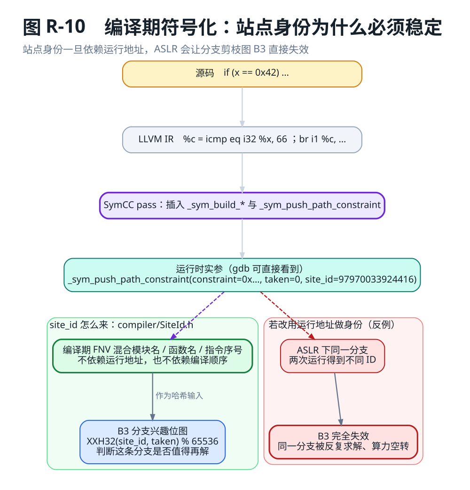

> 图 R-10。[PNG 版本](diagrams/report/fig-r10-site-id.png)｜[DOT 图源](diagrams/report/src/fig-r10-site-id.dot)

SymCC 的基本原理是**编译期插桩**：LLVM pass 遍历函数，为每条会产生符号数据流的指令
插入 `_sym_build_*` 调用；在条件跳转处插入 `_sym_push_path_constraint(expr, taken, site_id)`。
运行时按这些调用增量构造表达式 DAG，程序真实跑完一条路径后，把路径约束和目标取反交给求解器。

工程上最容易出错、也最关键的是 **site_id 的稳定性**。分支身份如果依赖运行地址，
ASLR 会让同一分支在两次运行里得到不同 ID，分支剪枝图（B3）立刻失效。本项目在
`compiler/SiteId.h` 生成编译期确定的稳定 ID，**不依赖地址、也不依赖编译顺序**——
QSYM 代码里沿用的变量名 `pc` 实际接收的正是这个 `site_id`。

gdb 断在 `_sym_push_path_constraint` 时可以直接看到栈帧：
`_sym_push_path_constraint (constraint=0x…, taken=0, site_id=97970033924416)`。

### 3.2 三类约束形态：同一段源码，优化器决定 concolic 看到什么

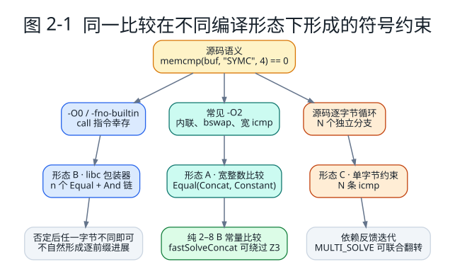

> 图 2-1（引自 QA3 图集）。[PNG 版本](diagrams/qa3/fig-2-1-constraint-shapes.png)

这是理解"为什么有的目标好解、有的目标解不动"的关键。同一句
`if (memcmp(buf, "SYMC", 4) == 0)`，在不同优化级别下 concolic 看到的约束形态完全不同：

| 形态 | 触发条件 | 约束长什么样 | 求解难度 |
|---|---|---|---|
| **A. 宽整数内联比较** | `-O2` 下 LLVM 把 `memcmp(a,b,4)` 内联成 bswap + `icmp` | 单个 `Equal(Concat(b0,b1,b2,b3), 0x53594D43)` | **最容易**，可免 SMT |
| **B. 存活的 libc 调用** | 长度较大或编译器未内联，命中运行时包装器 | n 个 `Equal` + n−1 个 `And` 的链 | 中等；规模线性，但**没有"部分学分"**——否定是"存在某字节不等"，Z3 翻一个字节就满足 |
| **C. 逐字节循环** | 源码手写循环比较 | N 条独立的单字节分支 | 每条都简单，但需要 N 次 concolic 迭代 |

还有一件容易混淆的事：**同一个目标会被编译成多个变体二进制，不同技术作用在不同变体上**。

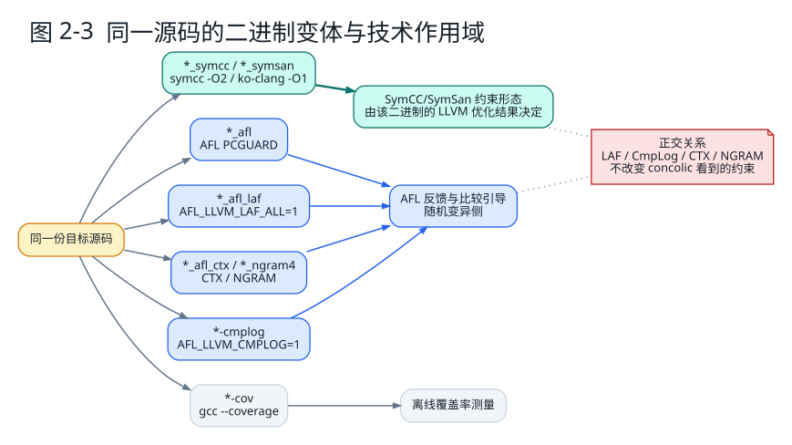

> 图 2-3（引自 QA3 图集）。[PNG 版本](diagrams/qa3/fig-2-3-binary-variants.png)

其中最值得记住的一条：**laf-intel 只作用于 `*_afl_laf` 变体，从不作用于 SymCC 构建**。
它改变的是 AFL 保留什么，从而间接改变喂给 concolic 的种子，而**不改变 concolic 引擎
看到的约束本身**。

两个实现细节值得指出：

1. `-O2` 下 LLVM 会把 `memcmp(...)==0` 规范化成 **`bcmp`**，所以运行时包装器白名单里
   专门加了 `bcmp`（对应测试 `test/bcopy_bcmp_bzero.c`）。漏掉这一条会静默丢失整类约束。
2. **真实目标构建里从来没有 `-fno-builtin`**——形态 A 是现代主力形态，不是边角情况。

### 3.3 fastSolveConcat：宽整数比较连 Z3 都不用

对形态 A，本项目实现了一条免 SMT 的快路径。触发条件严格：根是关系运算、恰好两个孩子、
一侧是 ≤64 位 `ConstantExpr`、另一侧是**由纯符号输入字节直接组成的 Concat 链**。

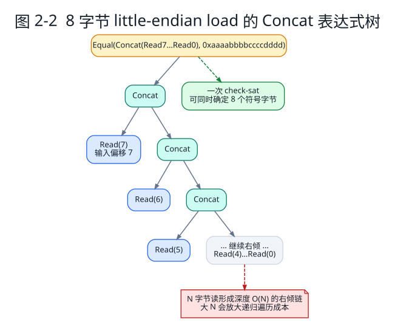

> 图 2-2（引自 QA3 图集）。[PNG 版本](diagrams/qa3/fig-2-2-concat-expression.png)

满足条件时，求解退化成**按字节把常量拆开写回输入缓冲区**，完全不进 SMT 求解器。
安全性由"解出来之后仍要重新读取校验"的安全网保证——这正是 [§2.4](#24-最重要的系统不变量激进提议保守接纳)
那条不变量的一个具体实例。

> ⚠ 边界：它处理直接 load 组成的 Concat，**不处理 shift-or 拼装或 `ZExt(Concat)`**。
> 一般宽位向量比较仍由 Z3 或其他后端处理。

### 3.4 求解代价层次

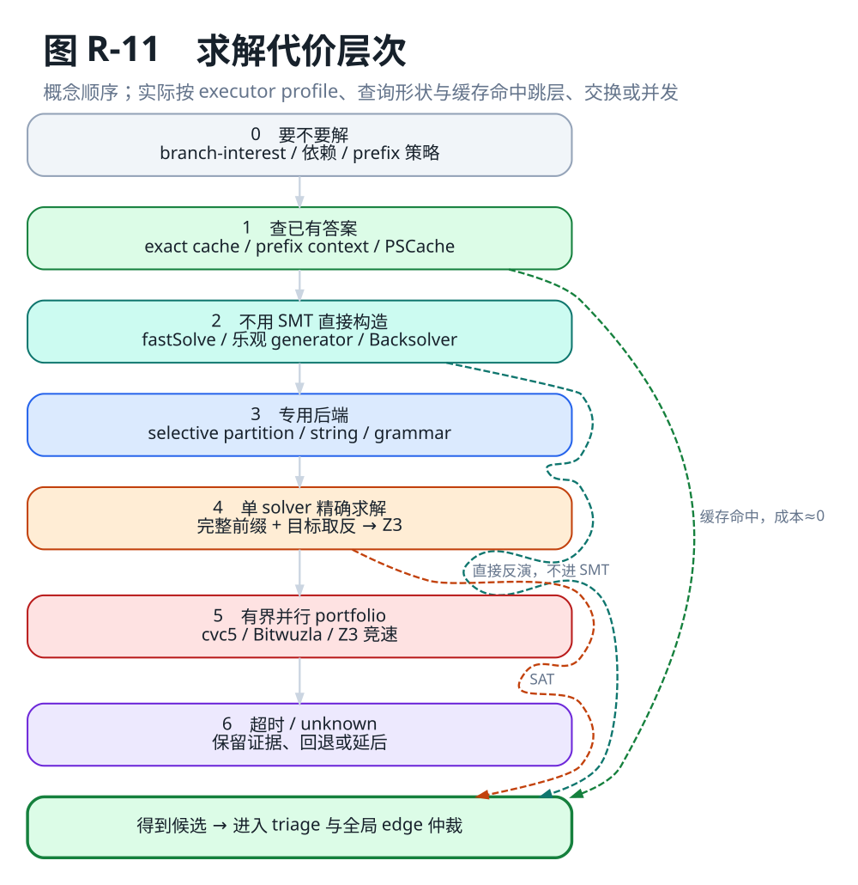

> 图 R-11。[PNG 版本](diagrams/report/fig-r11-solve-cost-layers.png)｜[DOT 图源](diagrams/report/src/fig-r11-solve-cost-layers.dot)

一次目标翻转**不总是直接调用完整 Z3**。上图是理解成本的概念顺序；实际代码会按
executor profile、查询形状、缓存命中和异步 ownership 跳过、交换或并发执行其中若干层。

QSYM 主路径的具体次序是明确的：

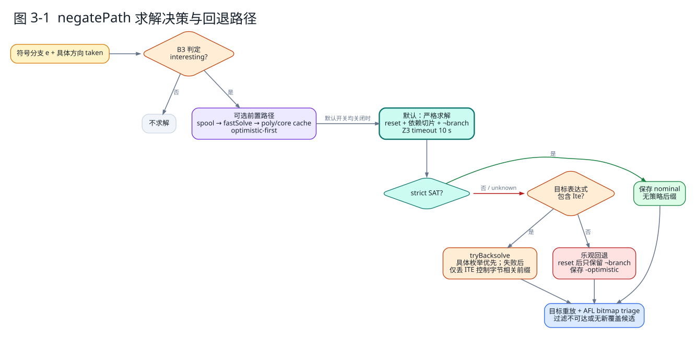

> 图 3-1（引自 QA3 图集）。粗线为默认配置路径。[PNG 版本](diagrams/qa3/fig-3-1-solve-decision.png)

1. **fastSolve 成功 → 直接返回**；
2. 否则默认先做**带完整前缀的严格求解**；
3. 严格 UNSAT / unknown 之后：普通目标尝试**只保留目标**的乐观求解；含 `Ite` 的目标
   进入 **Backsolver**，后者才可能选择性丢弃与 ITE controller 依赖重叠的前缀；
4. 只有设置 `SYMCC_OPTIMISTIC_FIRST=1` 才会**先**解 target-only 公式。

**求解超时是硬编码的 `kSolverTimeout = 10000` ms，没有对应的环境变量**——文档里
一度被写成 `SYMCC_SOLVER_TIMEOUT`，该变量并不存在。

### 3.5 "丢前缀"的三种粒度与副作用

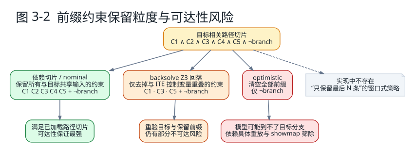

> 图 3-2（引自 QA3 图集）。[PNG 版本](diagrams/qa3/fig-3-2-prefix-dropping.png)

丢前缀的代价是明确的：**候选满足目标谓词，但不保证满足原始路径**，具体重放时程序可能
根本走不到那条分支。因此前缀被删除后，候选必须对保留约束和目标重新求值，并最终真实执行；
**具体重放失败属于预期代价，而不是 solver bug**。

QSYM 原文对此的表述是 *"optimistically selecting and solving some portion of the
constraints, if not solvable as a whole"*，理由是最后一条约束 *"typically has a very
simple form"*，因此 *"test cases generated from solving the last constraint likely
explore the target path as they at least meet the local constraints when reaching the
target branch"*。【论文】

这套做法的**净收益是否为正，取决于目标的输入格式**——[§4.7](#47-乐观求解的边际价值取决于格式c-级) 有实测。

### 3.6 四层过滤漏斗：并行有效性的核心

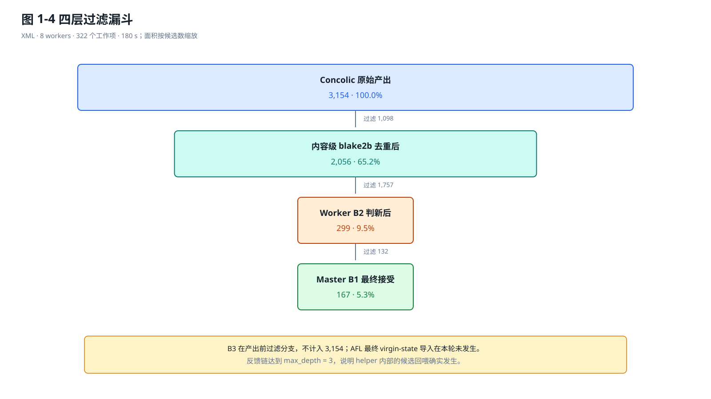

> 图 1-4（引自 QA3 图集，实测数据）。[PNG 版本](diagrams/qa3/fig-1-4-filter-funnel.png)

concolic 产出里绝大部分是冗余的。本项目用四道闸门把它们挡在回灌之前：

1. **内容摘要（128-bit BLAKE2b）**——字节完全相同直接跳过 showmap，连重放都省了；
2. **afl-showmap 重放**——用 AFL 插桩目标实际跑一遍，拿到稀疏边集合；
3. **B2 worker 本地位图预过滤**——本 worker 已自覆盖的边不上传，压 MPI 流量；
4. **B1 master 会话级位图**——全局判新，只有边增量非零才写入语料。

【C 级】xml 目标、8 worker、322 个工作项、180 s 的一次实测：

| 阶段 | 计数 | 占产出 |
|---|---:|---:|
| concolic 产出 | **3,154** | 100 % |
| → 过 B2（worker 判新） | **299** | 9.5 % |
| → 过 B1（写入语料） | **167** | 5.3 % |

冗余成因中，**字节完全相同的重复占 34.8 %**（1,098 / 3,154）——这一层纯靠内容摘要
就挡掉了，成本接近 0。这解释了为什么第一道闸门必须放在 showmap 前面。

那么 worker 的时间到底花在哪？

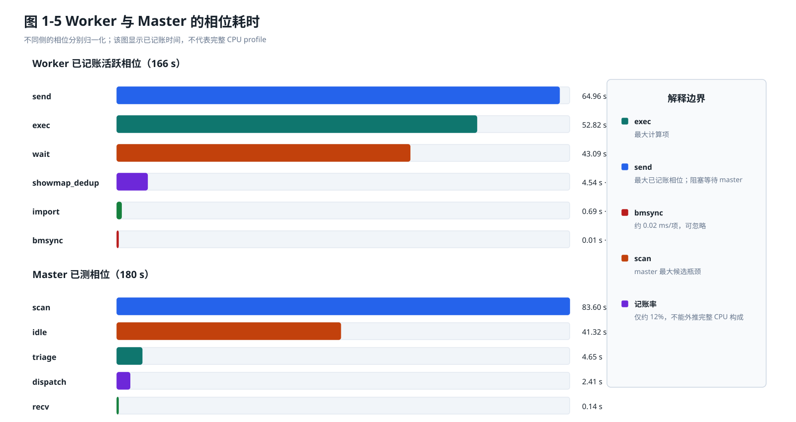

> 图 1-5（引自 QA3 图集）。[PNG 版本](diagrams/qa3/fig-1-5-phase-time.png)

有两个量级稳定、可以引用：`showmap_dedup` 约 **14–15 ms/工作项**，而位图同步
（版本比对 + 稀疏 delta 合并）恒为 **0.02 ms/工作项**——**位图同步不是瓶颈**，
这条实测支撑了 [§2.7](#27-mpi-协议拉模式--内容寻址--严格启动次序) 只回传稀疏边的设计。

> ⚠ 但 `send` / `exec` / `wait` **三者的相对大小在两次运行之间就发生了翻转**，
> 所以"哪一项是主要开销"在这份数据上不成立，此处只引用可复现的部分。

### 3.7 Query IR 与跨层证据总线

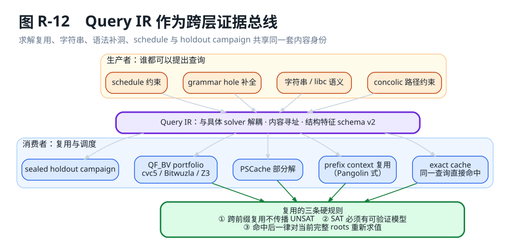

> 图 R-12。[PNG 版本](diagrams/report/fig-r12-query-ir.png)｜[DOT 图源](diagrams/report/src/fig-r12-query-ir.dot)

Query IR 把查询表示与具体 solver 解耦，并做**内容寻址**。它带来的不只是缓存：求解复用、
字符串后端、语法补洞、schedule 探索和 holdout campaign **共享同一套内容身份和验证语义**，
因此可以在不同层之间传递证据而不丢失可追溯性。

配套的复用机制有严格的安全约束：

- **跨前缀复用不传播 UNSAT**——SAT 模型、poly 采样和字段重命名**始终需要当前完整约束验证**；
- **PSCache 部分解**命中时必须重建 signed prefix / off-path literal、证明与当前 Query IR
  相容、对当前完整 roots 重新求值，并显式拒绝固有 UNSAT、空 core、缺字段和 proof tamper；
- **QF_BV portfolio**（cvc5 / Bitwuzla / Z3）里，**UNSAT 只有在后端具备授权证据时才用于剪枝，
  SAT 必须有可验证模型**；训练集、holdout、solver 二进制身份和内部尝试全部绑进 evidence，
  防止事后挑最好的结果。

> ⚠ 历史文档中曾出现过一个**不安全的缓存**：按分支表达式缓存 `negatePath` 结果。它是
> 路径前缀相关的，已经删除。这条记录保留在这里，是因为它正是"跨前缀复用不传播 UNSAT"
> 这条规则的由来。

### 3.8 IFSS / Hydra：证明携带的编译期 CFG 变换

复杂分支会产生大量短路径和嵌套 ITE。IFSS/Veritesting 把多条路径合成一个表达式状态，
Hydra 合并相似控制流臂，从而减少 fork 和重复执行。**错误的变换会直接改变程序语义**，
所以这一族默认关闭，并使用三层门：

1. **proof gate**：MemorySSA / AA 证明的内存状态合并与 NoMod def-chain；
2. **未变换基线 replay**：以原始 IR 生成的目标作为权威 oracle，只有"变换目标失败而基线
   目标没失败"的站点才形成 spurious-failure 证据；
3. **denylist**：这些站点被永久排除。

这符合 Hydra 的 **failure-preserving 而非完整 semantics-preserving** 边界。功能上已经
覆盖到多臂 region-state worklist、switch 的 linear/balanced/profile-optimal 树、多出口
exit-id + live-out tuple、affine 自然循环闭式、上三角递推、byte-lane 部分重叠的
continuation 内存等（F248–F296）。

变换结果绑定 manifest 与 SHA-256 seal，并在**全新 LLVM 进程**里独立重放。

> ⚠ seal 能发现本地 artifact 漂移与篡改，**不等于形式化验证、数字签名或远程 attestation**。
> lowering 遇到不能证明的情况一律 fail closed——这会损失覆盖范围，是有意的正确性取舍。

### 3.9 四个补充技术族

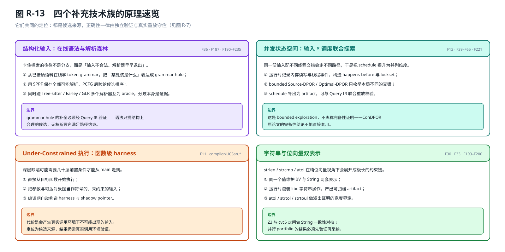

> 图 R-13。[PNG 版本](diagrams/report/fig-r13-tech-families.png)

下面四节展开这张图。它们共同的定位是：**都是候选来源，正确性一律由独立验证与真实重放
守住**（[§2.4](#24-最重要的系统不变量激进提议保守接纳)）。

#### 3.9.1 结构化输入：在线语法与解析森林

对 XML / SQL / 正则这类**语法驱动**的目标，逐字节翻转分支的收益很快见顶——真正卡住
探索的是"输入不合法，解析器早早退出"。这一族的做法是把结构本身变成可求解对象：

1. 从已接纳语料在线学习 **token grammar**，把"某处应该是什么"表达成可验证的
   **grammar hole**；
2. 用 **SPPF**（共享打包解析森林）保存所有可能的解析结果，而不是单一解析树；
   配合 **PCFG** 后验给候选排序；
3. 关键约束：**grammar hole 的补全必须经 Query IR 验证**——语法只负责提出结构上
   合理的候选，它没有资格断言这个候选满足路径约束。

同时跑**多个独立解析器**（Tree-sitter 增量解析、generalized Earley、GLR）互为
oracle：同一候选被两个解析器给出不同接受判定时，这个分歧本身是可归档的证据，
用来发现语法学错的地方。

#### 3.9.2 并发状态空间：输入与调度联合探索

多线程目标上，同一份输入配不同的线程交错会走不同路径。本族把 **schedule 提升为
和输入并列的探索维度**：

1. 运行时记录内存读写与线程事件，构造 happens-before 与 lockset；
2. 用 **bounded Source-DPOR / Optimal-DPOR** 枚举本质不同的交错，而不是穷举所有排列；
3. schedule 被导出成 **artifact**，可以和 Query IR 做联合重放校验；
4. 支持扩展的 C11 release-acquire 语义与弱内存模型下的 backward revisit。

> ⚠ 这是 **bounded exploration**，不声称完备性证明——ConDPOR 原论文的完备性结论
> 不能直接套到本实现上。

#### 3.9.3 Under-Constrained 执行：自动构造函数级 harness

很多真实缺陷藏在深层函数里，从 `main` 出发的路径可能需要几十层前置条件才能到达。
UCSan 式做法是**直接从目标函数开始执行**，把它的参数和可达对象图当作符号的、
未约束的输入（`compiler/UCSan.cpp`）。

代价是会产生**真实调用环境下不可能出现的输入**，从而报出假阳性。因此本项目的定位
很明确：UC 执行是**候选来源**，结果仍需真实调用环境验证——同样落在
[§2.4](#24-最重要的系统不变量激进提议保守接纳) 的不变量之下。

#### 3.9.4 字符串与位向量双表示

`strlen` / `strcmp` / `atoi` 这类操作在纯位向量视角下会展开成极长的约束链。本族给
同一个值维护 **BV 和 String 两套表示**，让约束可以送进 String 理论求解器：

- 运行时包装 libc 字符串操作，产出可归档的 string artifact；
- `atoi` / `strtol` / `strtoul` 的转换做**溢出证明的宽度界定**，避免用错位宽；
- Z3 与 cvc5 之间做 String 一致性对拍（conformance），并行 portfolio 的结果必须
  先验证再采纳。

### 3.10 技术族全表

| 技术族 | 功能 ID | 解决的问题 | 成熟度 |
|---|---|---|---|
| 基础正确性 | F00、F26 | 位宽、线程局部状态、稳定 ID、cache/replay soundness | 已实现 + 测试 |
| MPI 与 hybrid 基础 | F17–F25 | 并行吞吐、AFL 协同、引擎抽象、可重复安装 | 已实现 + 测试 + B 级结果 |
| 遥测与覆盖 | F01、F04、F06–F07、F22、F28、F247 | 看见路径 / 数据 / 结构进展并正确判新 | 已实现 + 证据 |
| 调度与目标引导 | F05、F08–F10、F14–F16、F186 | 把有限 CPU 分给更有价值的种子和策略 | 已实现，部分 B 级 |
| 求解复用 | F03、F32、F35、F176–F185、F236、F238 | 减少重复翻译与重复 SAT/UNSAT | 已实现 + 证据 |
| Solver portfolio | F02、F31、F34、F177–F178、F188–F189、F237–F246 | 处理长尾、选择算法、控制近似 | 已实现 + 证据 |
| 字符串双表示（§3.9.4） | F30、F33、F193–F200 | 把 libc/string 语义接到 BV 和 String solver | 已实现 + 证据 |
| 语法与解析森林（§3.9.1） | F36、F187、F190–F192、F201–F235 | 学习并验证结构化输入、PCFG、parser 状态 | 已实现 + 证据 |
| Under-constrained 执行（§3.9.3） | F11 | 自动构造函数级 harness 与对象图 | 已实现 + 测试 |
| 并发状态空间（§3.9.2） | F13、F39–F65、F221 | 联合探索输入、schedule 与内存模型 | 已实现 + 证据 |
| Live continuation | F12、F38、F59、F66、F68–F175 | 状态级并行与可恢复内存 | 有界子集 |
| IFSS/Hydra 变换（§3.8） | F37、F248–F296 | 减少 fork、恢复多出口/循环/内存状态 | 有界子集，默认关闭 |

完整逐项说明见 [`New_Implementation_Archive.md`](New_Implementation_Archive.md)，
全景解释见 [`Current_Technology_Compendium.md`](Current_Technology_Compendium.md)。

---

## 四、实验与结论

### 4.1 证据分级

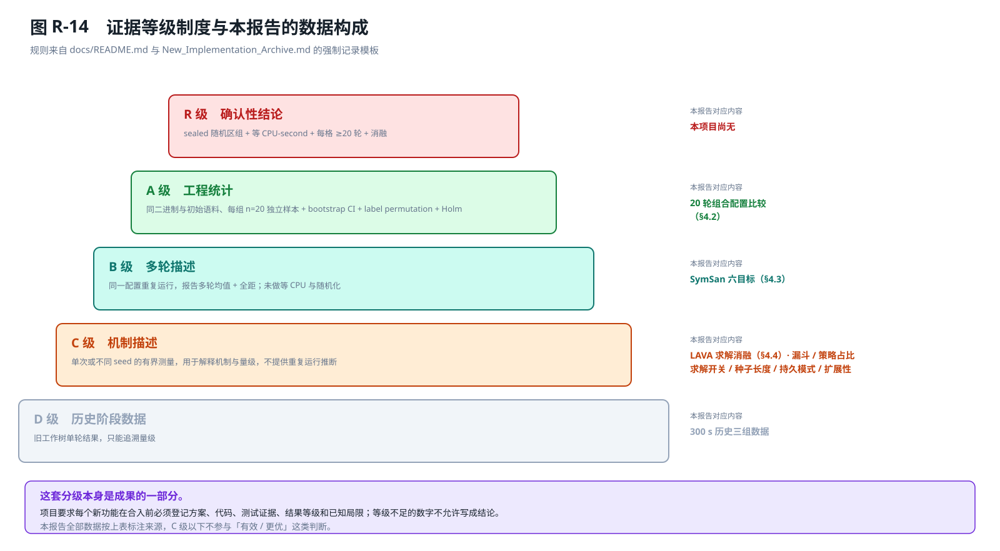

> 图 R-14。[PNG 版本](diagrams/report/fig-r14-evidence-grades.png)

项目要求**每个新功能在合入前必须登记**方案、代码、测试证据、结果等级和已知局限；
等级不足的数字不允许写成结论。这套制度约束的第一个对象就是本报告自己：下面每一节都
标注了等级，**C 级以下不参与"有效 / 更优"这类判断**。

### 4.2 主结论：20 轮独立样本配置比较【A 级工程统计】

**实验问题**（两问，按重要性排序）：

1. 当前默认编排（4 AFL 实例 + 3 SymCC worker + AFL++ basic profile）是否优于同为
   名义 8 核的旧编排（1 AFL + 6 SymCC worker）？
2. 单实例 AFL-only 在两批运行之间是否稳定，并可作为批次 sanity 参照？

**做法**：同一台机器、**同一份当前 SymCC 目标二进制**、同一批种子、15 s 配置预算；
两组 Hybrid 均为名义 8 核，AFL-only sanity 为 1 核，每组重复 20 轮。主指标是
campaign 结束后用 `afl-showmap` 对
`seed ∪ 所有 AFL queue ∪ SymCC 输出（含 --save-all）` 的**离线候选并集边覆盖率**。
早期报告曾按 repeat index 事后配对，但这些 index 没有实验设计上的配对含义；当前主分析
把各轮视为独立样本，使用 10,000 次独立 bootstrap 求均值差区间、100,000 次双侧
label-permutation test，并对全部比较做 Holm family-wise 校正。旧 paired 结果只保留为审计历史。

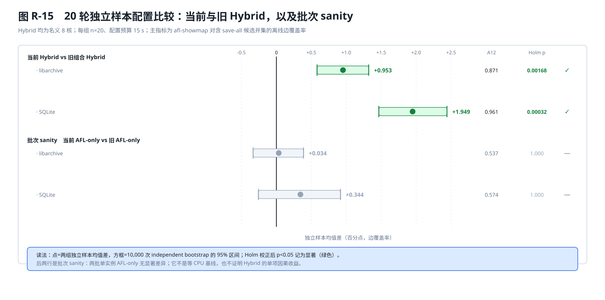

> 图 R-15。[PNG 版本](diagrams/report/fig-r15-headline-forest.png)｜数据源
> [`independent_comparisons.csv`](evidence/current-eval-2026-07-30/independent_comparisons.csv)

| 比较 | 目标 | 独立样本均值差 | 95% CI | A12 | Holm p |
|---|---|---:|---|---:|---:|
| 当前 Hybrid vs 旧配置 Hybrid | libarchive | **+0.953 pp** | `[+0.582, +1.321]` | 0.871 | **0.00168** |
| 当前 Hybrid vs 旧配置 Hybrid | SQLite | **+1.949 pp** | `[+1.466, +2.441]` | 0.961 | **0.00032** |
| 当前 AFL-only vs 旧 AFL-only（批次 sanity） | libarchive | +0.034 pp | `[−0.333, +0.389]` | 0.537 | 1.000 |
| 当前 AFL-only vs 旧 AFL-only（批次 sanity） | SQLite | +0.344 pp | `[−0.257, +0.918]` | 0.574 | 1.000 |

8 核 Hybrid 与 1 核 AFL-only 的非等 CPU 比较仍保存在机器可读结果中，但不再放进主结论表和
主森林图，避免把资源预算不公平的显著性误读成 Hybrid 的因果优势。

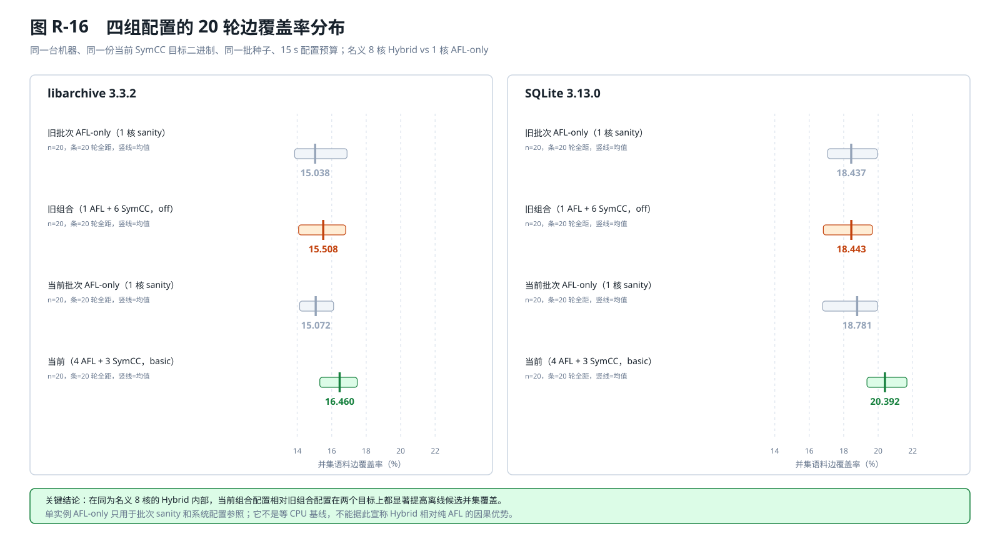

> 图 R-16。[PNG 版本](diagrams/report/fig-r16-eval-groups.png)

**三条可以写进汇报的结论**：

1. **当前组合配置在短预算离线候选并集指标上优于旧组合配置。** 在同为名义 8 核的
   Hybrid 内部，当前配置相对旧配置在 libarchive / SQLite 上分别提高
   +0.953 / +1.949 pp，两个独立 bootstrap 区间均不跨 0。由于 AFL 实例数、
   SymCC worker 数和 AFL profiles 同时变化，不能把差异单独归因于资源比例。
2. **单实例 AFL-only 是非等 CPU 参照，不是公平基线。** 当前 Hybrid 相对 1 核 AFL-only
   的 +1.389 / +1.611 pp 可以描述系统配置差异，但不能推出等 CPU 下 Hybrid 优于纯 AFL。
3. **批次 sanity 未发现单向机器漂移**：两批单实例 AFL-only 之间无显著差异
   （独立样本均值差为 +0.034 / +0.344 pp，Holm p 均为 1）。这削弱了“机器整体单向漂移”
   这一替代解释，但不能代替随机区组，也不能补偿 AFL-only 的 CPU 预算不公平。

**一份独立佐证**：在固定总核数、只改 AFL / SymCC 配比的另一组扫描里（np=16、3 轮、240 s），
最佳点同样**不在"把绝大多数核给 concolic"那一端**：


> 图 5-1（引自 QA3 图集）。[PNG 版本](diagrams/qa3/fig-5-1-cpu-allocation.png)

| 配比（np=16） | SQLite | libarchive |
|---|---:|---:|
| 1 AFL + 14 SymCC | 19.30 % | 23.30 % |
| 4 AFL + 11 SymCC | 21.39 % | 23.79 % |
| **8 AFL + 7 SymCC** | 22.82 % | **23.92 %** |
| 12 AFL + 3 SymCC | **22.87 %** | 21.60 % |

SQLite 的单点最高值在 12 AFL + 3 SymCC，libarchive 的最高值在 8 AFL + 7 SymCC；
8 + 7 是兼顾两个目标的折中点，而不是两个目标各自都严格最优。1 AFL + 14 SymCC
在两个目标上均最差。
这与 §4.2 主结论方向一致，但它是**另一批运行、另一种核数、另一种扫描方式**，
因此只作为佐证，不并入 A 级统计。

配套的吞吐与候选量变化（同为 A 级工程统计，n=20）：

| 目标 | 指标 | 旧编排 Hybrid | 当前 Hybrid | 变化 |
|---|---|---:|---:|---:|
| libarchive | AFL 执行数 | 1,087,865 | 4,303,479 | **+295.6 %** |
| SQLite | AFL 执行数 | 661,320 | 3,451,602 | **+421.9 %** |
| libarchive | 合并语料条目 | 1,619 | 4,980 | +207.6 % |
| SQLite | 合并语料条目 | 1,452 | 5,124 | +252.8 % |

> ⚠ 执行量的增长主要是把 AFL 从 1 个实例扩为 4 个实例的直接结果，**不应包装成单实例
> 吞吐提升**。它验证的是资源分配策略，不是求解器优化。

> ⚠ 还有一个必须说清的口径问题：15 s 轮次远小于 AFL 默认的跨实例同步周期，
> 向 AFL 自己的 queue 目录直接写文件也**不会**让运行中的 AFL 重扫。因此
> `ShowmapCov − FstatsCov` 的一部分代表"SymCC 结果在离线重放时有额外边"，
> **不能解释为"AFL 已利用这些输入继续变异"**。在线 AFL 位图指标（`afl_bitmap_cvg`）
> 的独立样本均值差也为正（libarchive +0.227 pp、SQLite +0.855 pp）；Holm 校正后
> SQLite p=0.0401、libarchive p=1。但该指标是多 AFL 实例中的最大值而非 union，
> 仍不能证明 AFL 在线消费了 SymCC 输入。

### 4.3 双引擎六目标基准【B 级】

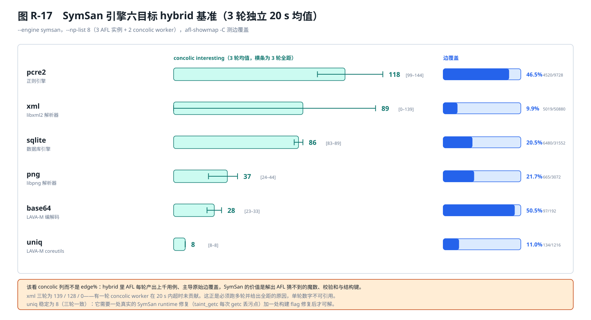

> 图 R-17。[PNG 版本](diagrams/report/fig-r17-symsan-6targets.png)｜数据源
> [`symsan_hybrid_benchmark_6targets.md`](../symsan_hybrid_benchmark_6targets.md)

`--engine symsan` 的完整 hybrid 流水线在 **6 个真实程序**上端到端跑通，每个值是
**3 轮独立 20 s** 的均值：

| 目标 | 类别 | AFL 用例 | concolic interesting | 全距 | 边覆盖 | 边% |
|---|---|---:|---:|---:|---:|---:|
| pcre2 | 正则引擎 | 23,743 | **118** | 99–144 | 4520/9728 | 46.5 % |
| xml | libxml2 解析器 | 10,681 | **89** | 0–139 | 5019/50880 | 9.9 % |
| sqlite | 数据库引擎 | 5,040 | **86** | 83–89 | 6480/31552 | 20.5 % |
| png | libpng 解析器 | 832 | **37** | 24–44 | 665/3072 | 21.7 % |
| base64 | LAVA-M 编解码 | 442 | **28** | 23–33 | 97/192 | 50.5 % |
| uniq | LAVA-M coreutils | 261 | **8** | 8–8 | 134/1216 | 11.0 % |

**要看 concolic 列，不是 edge%。** hybrid 里 AFL 每轮产出上千用例、主导原始边覆盖；
SymSan 的价值是它解出并喂给 AFL 的 interesting 输入——魔数、校验和、结构键这些
AFL 猜不出来的"钥匙"。

三个值得说明的点：

- **单轮方差是真实的**：xml 三轮为 139 / 128 / **0**——有一轮 concolic worker 在 20 s
  内超时未贡献。均值会抹平它，所以全距列必须一起给。**单轮数字不可引用。**
- **uniq 是攻下来的**：它需要一处真实的 SymSan runtime 修复（`taint_getc` 每次 `getc`
  丢污点）加一处构建 flag 修复，gnulib 的行比较分支才变得可解。稳定的 concolic = 8
  （三轮一致）说明它真在跑，不是噪声。
- **三类真实软件**（编解码 / coreutils / 格式与引擎解析器）全部经同一个 `--engine symsan`
  接口 + 引擎感知目标发现跑通。

### 4.4 求解技术族消融：完整 Z3 调用下降，但总成本上升【C 级描述】

这是目前**唯一一组把消融粒度下沉到技术族**的结果，也是对"新技术到底有没有被执行、
有没有带来可量化提升"最直接的回答。

**做法**：LAVA-M `base64` 的符号执行二进制（**该目标由 LLVM17 构建**，与 §4.2 的
libarchive / SQLite 目标所用的 LLVM 18.1.3 不同），对 13 个 public seed 分别跑三个
profile，13 × 3 = 39 个 case，无 timeout；再用 `lava-m-cov/base64` 回放计数 listed bug。

> ⚠ **等级口径**：13 个测量单元是**不同 seed，而不是同一 seed 的重复运行**，也没有
> 置信区间，因此按 C 级多实例描述处理。它能说明机制确实执行及本批实例的数量级，
> 不能支撑跨运行效应估计或“性能提升”。

| profile | 打开了什么 |
|---|---|
| `strict-first-z3`（原始目录名 `strict-z3`） | 关闭 fast solve / optimistic-first / backsolver / multi-solve / poly cache / UNSAT core cache / data coverage；strict UNSAT/unknown 后仍保留上游 optimistic fallback |
| `fast-optimistic` | fast solve + optimistic-first + backsolver + selective query |
| `runtime-full` | 上面全部，再加 multi-solve=2、polyhedral cache/cross-prefix、prefix context、UNSAT core cache、data coverage |

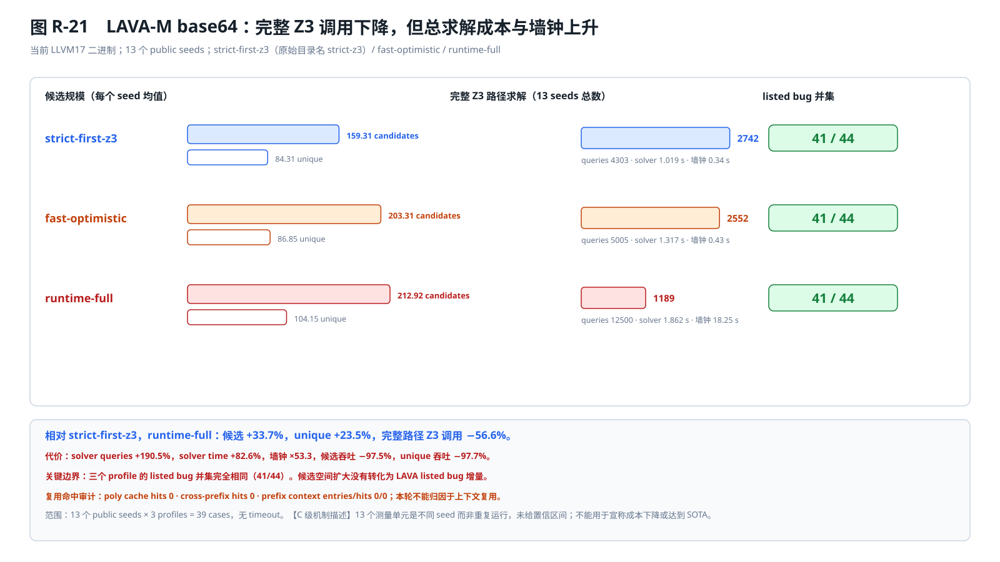

> 图 R-21。[PNG 版本](diagrams/report/fig-r21-lava-ablation.png)｜数据源
> [`Current_Implementation_Evaluation_2026-07-30.md`](Current_Implementation_Evaluation_2026-07-30.md) §1.1、
> [`evidence/lava_m_current_2026_07_30/`](evidence/lava_m_current_2026_07_30/base64_summary.csv)

| profile | 候选均值 | unique 均值 | listed bug 均值 | listed 并集 | Z3 完整求解总数 | 平均耗时 |
|---|---:|---:|---:|---:|---:|---:|
| `strict-first-z3` | 159.31 | 84.31 | 21.62/44 | 41/44 | 2,742 | 0.34 s |
| `fast-optimistic` | 203.31 | 86.85 | 21.62/44 | 41/44 | 2,552 | 0.43 s |
| `runtime-full` | **212.92** | **104.15** | 21.62/44 | 41/44 | **1,189** | **18.25 s** |

相对 `strict-first-z3`，`runtime-full` 的每 seed 候选总数 **+33.7 %**、
unique 候选总数 **+23.5 %**、**完整路径 Z3 调用次数 −56.6 %**。这些是工作量结构变化，
不是效率提升。

**但必须同时说的两件事**：

1. **平均墙钟从 0.34 s 涨到 18.25 s**（约 53.3 倍）；候选吞吐约从
   465.4 降到 11.7 candidate/s（−97.5 %），unique 吞吐约从 246.3 降到
   5.7/s（−97.7 %）。完整路径 Z3 调用虽少，但 solver queries 从 4,303 增到
   12,500（+190.5 %），累计 solver time 从 1.019 s 增到 1.862 s（+82.6 %）。
2. **LAVA listed bug 数完全没有提升**——三个 profile 的均值（21.62/44）和并集（41/44）
   一模一样。base64 的 listed bug 触发主要由 seed 和目标内置触发条件决定，
   **候选变多并没有转化成更多 bug**。

telemetry 可以区分各子机制是“产生了工作量”“产生了缓存条目”还是“真正命中”：

| 计数 | `runtime-full` 总量 |
|---|---:|
| `fast_solves` | 189 |
| `backsolver_attempts / sat` | 678 / 672 |
| `poly_cache_entries` | 2,510 |
| `poly_cache_hits` | **0** |
| `poly_samples` / `poly_john_steps` | 316 / 5,238 |
| `poly_cross_prefix_probes / hits` | 5,169 / **0** |
| `prefix_context_entries / hits` | **0 / 0** |
| `unsat_core_hits / entries` | 1,333 / 941 |
| `solver_queries` | 12,500 |

这里必须区分“路径已启用”“产生了内部工作量”和“真正复用命中”。`runtime-full` 确实建立了
2,510 个 poly cache entry、执行了采样和 5,169 次跨前缀 probe，但本轮
`poly_cache_hits=0`、`poly_cross_prefix_hits=0`，prefix context 也没有 entry/hit。
因此该实验**不能证明 Pangolin 式 context reuse 带来收益**；完整 Z3 调用减少和候选增加
只能归因于整个 `runtime-full` 技术组合，不能单独归因于上下文复用。

> ⚠ 回放时发现额外 ID `274`，**不属于 base64 的 listed bug 集**，必须单列为 extra，
> 不能计进 41/44。另外 `md5sum` / `uniq` 当前 harness 没有产生候选，`who` 每个 profile
> 只有 2 个候选且 0 listed hit——三者都**不能**作为本轮 solver 技术增益的有效样本。

**这一节的意义**：它证明技术确实在运行，并把工作从完整路径 Z3 调用转移到更多缓存、
采样、cross-prefix probe 和其他 solver query；但总求解成本和墙钟显著上升，也没有转化为
更多 listed bug。
[§6.1](#61-明确不能宣称的结论) 第 1 条禁语因此**部分解禁**：可以说"求解技术族在
base64 上把 Z3 完整求解降低了 56.6 %"，但仍**不能**说"这些技术让覆盖率或 bug 数提高了 X %"。

### 4.5 求解策略的实际构成【C 级】

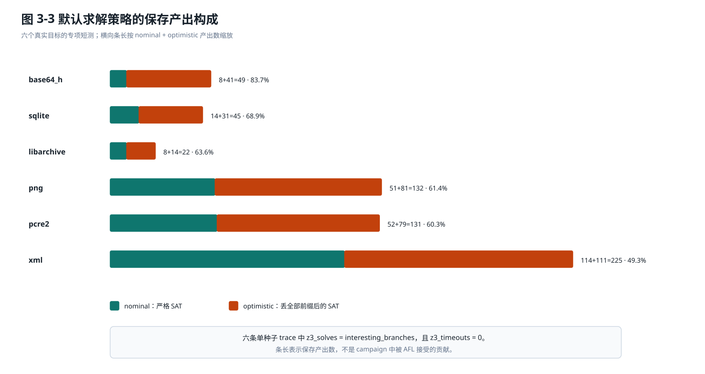

> 图 3-3（引自 QA3 图集）。[PNG 版本](diagrams/qa3/fig-3-3-strategy-mix.png)

一个常见误解是"符号执行都是乐观求解"。实测（6 个真实目标、默认配置、单种子短测）：

| 目标 | 种子 | 符号分支 | Z3 严格查询 | nominal 产出 | optimistic 产出 | optimistic 占比 |
|---|---|---:|---:|---:|---:|---:|
| lava base64 | 5 B | 70 | 53 | 8 | 41 | **83.7 %** |
| libarchive | 6 B | 34 | 22 | 8 | 14 | 63.6 % |
| pcre2 | 11 B | 475 | 133 | 52 | 79 | 60.3 % |
| gfts png | 69 B | 144 | 142 | 51 | 81 | 61.4 % |
| sqlite | 34 B | 63 | 45 | 14 | 31 | 68.9 % |
| gfts xml | 52 B | 240 | 225 | 114 | 111 | **49.3 %** |

**默认路径是先严格求解，UNSAT / 超时才退到乐观。** 但保存下来的产出里乐观占 49 %–84 %，
说明严格求解在这些目标上 UNSAT 的比例相当高。

内部一致性可以自检（以 xml 为例）：`solver_queries = 336 = 225 严格 + 111 乐观`；
`solver_sat = 225 = 114 严格 SAT + 111 乐观 SAT`；`solver_unsat = 111`。

> ⚠ 这条恒等式不普适：base64 / pcre2 / png 上 `nominal + optimistic < interesting`，
> 差额是**严格 UNSAT 之后乐观也 UNSAT**的恒真/恒假分支。准确表述是
> `solver_unsat = 严格 UNSAT + 乐观 UNSAT`。

另外，六个目标上 `-backsolve`、`-poly`、`-fast` 在默认配置下产出**全部为 0**——
`SYMCC_BACKSOLVER` 虽然默认开，但只在分支表达式含 `Ite` 时触发，这批目标一次都没触发。
**因此在这套 benchmark 上，"丢前缀"实际就等于"乐观求解"，没有第三种情况。**

### 4.6 三个求解开关到底值不值得开【C 级】

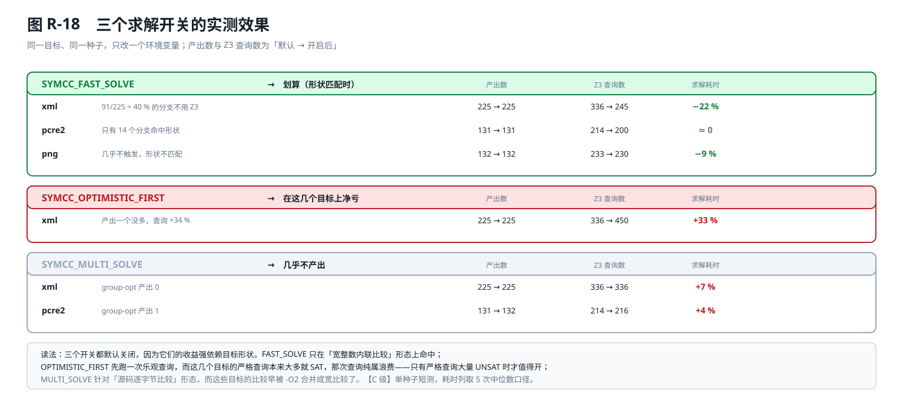

> 图 R-18。[PNG 版本](diagrams/report/fig-r18-solver-switches.png)｜数据源
> [`Architecture_QA3.md`](Architecture_QA3.md) §3.3

同一目标、同一种子，只改一个环境变量：

| 开关 | 目标 | 产出数 | Z3 查询数 | 求解耗时 | 判断 |
|---|---|---|---|---|---|
| `SYMCC_FAST_SOLVE` | xml | 225 → 225 | 336 → **245** | **−22 %** | **划算**：91/225 = 40 % 的分支不用 Z3，产出一个不少 |
| | pcre2 | 131 → 131 | 214 → 200 | ≈ 0 | 只有 14 个分支命中形状 |
| | png | 132 → 132 | 233 → 230 | −9 % | 几乎不触发，形状不匹配 |
| `SYMCC_OPTIMISTIC_FIRST` | xml | 225 → 225 | 336 → **450** | **+33 %** | **净亏**：产出一个没多，查询 +34 % |
| `SYMCC_MULTI_SOLVE` | xml | 225 → 225 | 336 → 336 | +7 % | group-opt 产出 **0** |
| | pcre2 | 131 → 132 | 214 → 216 | +4 % | group-opt 产出 **1** |

**这三个开关默认全部关闭，原因写在数据里**：

- `FAST_SOLVE` 的收益完全取决于**约束形态**——它只在 [§3.2](#32-三类约束形态同一段源码优化器决定-concolic-看到什么)
  的"形态 A（宽整数内联比较）"上命中。xml 上 40 % 的分支免 Z3，png 上几乎为零。
- `OPTIMISTIC_FIRST` 先跑一次乐观查询，而这几个目标的严格查询本来大多就 SAT，
  那次查询纯属浪费。**只有在严格查询大量 UNSAT / 超时的目标上才值得开。**
- `MULTI_SOLVE` 针对"源码里逐字节比较"的形态，而这些目标的比较早被 `-O2` 合并成
  宽比较了（[§3.2](#32-三类约束形态同一段源码优化器决定-concolic-看到什么) 形态 A）。

这组数据也说明了一件更一般的事：**在这个系统里，"某项技术有没有用"几乎总是
"在什么目标形状上有用"。** 这正是把开关做成默认关闭、由 profile 与 telemetry 驱动
选择的原因。

> ⚠ 单种子短测，求解耗时列取 5 次中位数口径。绝对值不可引用，只有方向和量级稳定。

### 4.7 乐观求解的边际价值取决于格式【C 级】

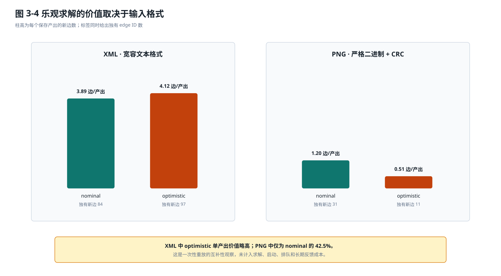

> 图 3-4（引自 QA3 图集）。[PNG 版本](diagrams/qa3/fig-3-4-optimistic-format.png)

把每个产出的边贡献按策略拆开量之后，两个目标给出了**方向相反**的结果：

| 目标 | 格式特点 | 策略 | 产出数 | 独有新边 | 边 / 产出 |
|---|---|---|---:|---:|---:|
| **gfts xml** | 文本，容错 | 严格 | — | 84 | 3.89 |
| | | **乐观** | — | **97** | **4.12** |
| **gfts png** | 二进制，带 CRC 与魔数 | 严格 | 51 | — | **1.20** |
| | | **乐观** | 81 | 11（共 41 条新边） | **0.51** |

- **在 xml 上，乐观求解不是"副作用"而是主力**：它的独有新边比严格求解还多。文本格式对
  "前缀被破坏"高度容错——解出来的输入依然是合法 XML 的另一个变体，照样进新代码。
- **在 png 上，副作用是真实的**：乐观产出 81 个（比严格的 51 个还多），却只贡献 41 条新边、
  其中仅 11 条独有；单产出边贡献 0.51 vs 1.20，**低 2.4 倍**。CRC / 魔数严格的二进制格式里，
  破坏前缀往往直接被早期校验拒掉。这与 [§3.5](#35-丢前缀的三种粒度与副作用) 的机制分析一致。

结论是**乐观求解不是无条件的净收益**：它在松散格式上划算，在强结构格式上会把成本从
求解器转移到大量无效的具体重放。

> ⚠ 重放抖动比想象的大：同一份**冻结语料**复跑 10 次，xml 严格求解的新边在 439–449 之间
> 摆动；再叠加语料重生成，独有新边可达 99–104。**上表只有大小关系稳定，绝对值不要引用。**

### 4.8 输入决定 DSE 成败：同一个二进制，只改种子长度就永远解不出【C 级】

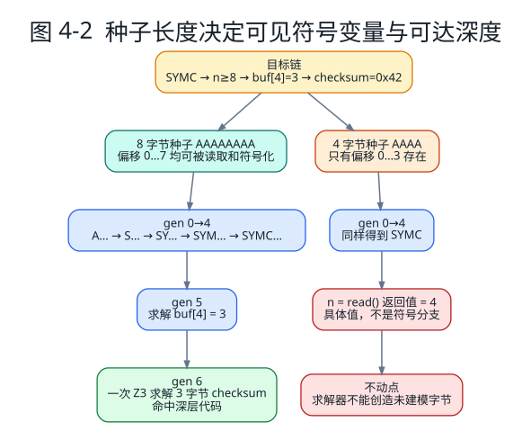

> 图 4-2（引自 QA3 图集）。[PNG 版本](diagrams/qa3/fig-4-2-seed-length.png)

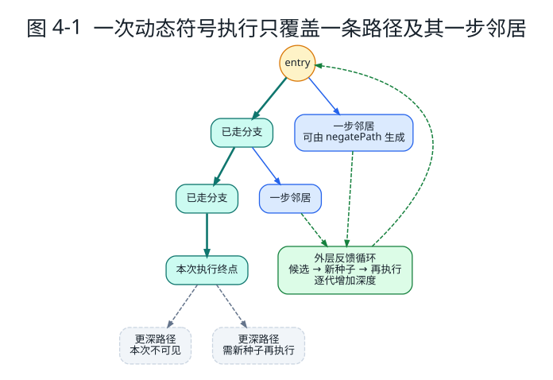

> 图 4-1（引自 QA3 图集）。[PNG 版本](diagrams/qa3/fig-4-1-path-neighborhood.png)

一次 concolic 执行只覆盖路径树上的**一条线**，能翻转的只有这条线上的分支——也就是
**一步邻居**。种子决定了这条线在哪，因而决定了这一轮能看到哪些邻居。

实测里最直观的一组用的是一个三关微目标：
4 字节魔数 `SYMC` → 长度检查 `n >= 8` + 长度字段 `buf[4]==3` → 校验和 `buf[5]+buf[6]+buf[7]==0x42`。

- **8 字节种子 `AAAAAAAA`：第 6 代解出。** 字节逐代演进
  `AAAAAAAA → SAAAAAAA → SYAAAAAA → SYMAAAAA → SYMCAAAA → SYMC\x03AAA → SYMC\x03\x00\x00B`，
  Z3 查询数逐代 1→2→3→4→5→6。注意最后一步：3 字节算术校验和被**一次查询**解出。
- **4 字节种子 `AAAA`：同一个二进制，永远解不出。** 第 4 代拿到 `SYMC` 后进入
  `STAGE2: input too short (n=4)`，随后候选全部退步，进入不动点卡死。

**决定性细节：4 字节种子时 Z3 查询数停在 4，不是 5。** `if (n < 8)` 这个检查一次查询都
没贡献——因为 `n` 是 `read()` 的**具体返回值**，那个分支**根本不是符号分支，无法被翻转**。
准确的说法不是"解不出长度检查"，而是**对 4 字节种子来说这个检查不存在**：求解器永远
不能靠翻转循环条件来加长输入文件。

顺带一个可推广的观察：查询数逐代 +1，说明**每加深一层，整条前缀都要被重走一遍、
且多解一个新分支**——这正是多层嵌套代价随深度累积的直接来源。

这条结论对实践的意义很直接：**种子集的构造质量，是 concolic 能否发挥作用的前置条件，
优先级高于任何求解器优化。**

### 4.9 两条负面结论【C 级】

诚实的负面结论和正面结论一样重要，它们直接决定了下一步该往哪投入。

**（1）短轮次里不存在在线闭环。**

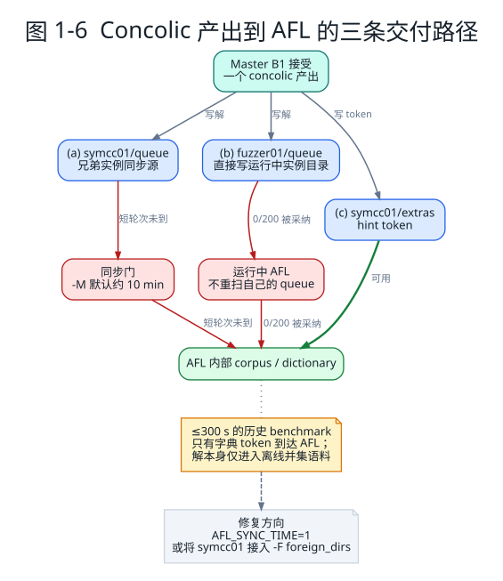

> 图 1-6（引自 QA3 图集）。[PNG 版本](diagrams/qa3/fig-1-6-afl-delivery.png)

两个独立实验（180 s hybrid 实跑 + 受控注入实验）都表明：

- 运行中的 `afl-fuzz` **不会重扫自己的 `queue/` 目录**，直接往里丢文件是无效的；
- 兄弟实例同步要等 **10 分钟**（`-M` 默认；`-S` 为 20 分钟），而 benchmark 轮次是 120–300 s；
- `-F` foreign_dirs 里从来没有 `symcc01/`。

**所以在所有 ≤300 s 的轮次里，concolic 的产出一个都没有真正进到 AFL 手里。**
[§4.2](#42-主结论20-轮独立样本配置比较a-级工程统计) 的覆盖率数字是 `afl-showmap` 对**候选并集**的
离线测量，这个口径本身成立；但它**不能被解释成"AFL 用上了 concolic 的解之后跑出来的"**。

修复方向是明确的（起 AFL 时设 `AFL_SYNC_TIME=1`；把 `symcc01/` 接进 `-F`），
代码里已有那条路径，只是没接上。

**（2）多层嵌套下，取头 FIFO 的前沿会枯竭。**

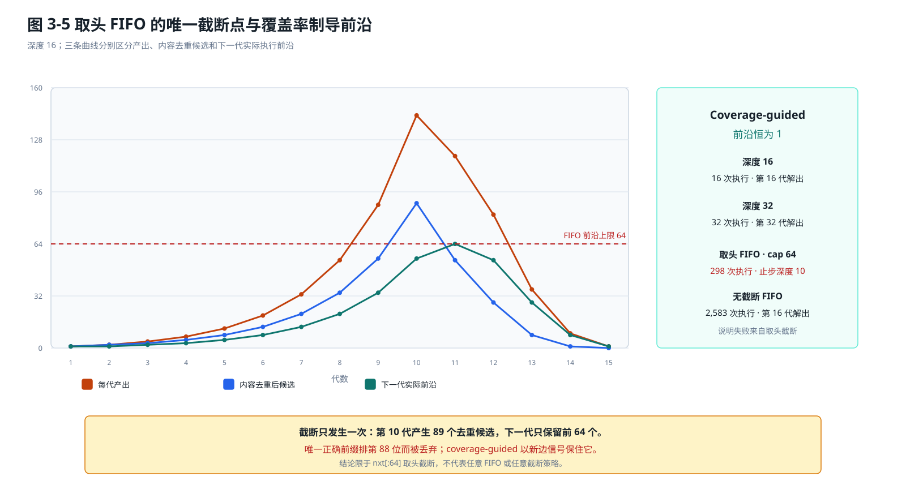

> 图 3-5（引自 QA3 图集）。[PNG 版本](diagrams/qa3/fig-3-5-nested-frontier.png)

对照实验里，`fifo` 策略跑了 298 次执行、610 次 Z3 查询（比覆盖率制导多一个数量级），
深度 16 和 32 都只到 10 就停住；而无截断的覆盖率制导策略在第 16 代解出深度 16。
**枯竭的原因是候选队列的截断，不是全局去重**——这一点由一组控制实验直接证伪了早期
的错误归因。

### 4.10 工程性能实测【C 级】

**持久模式的吞吐差距**：


> 图 6-2（引自 QA3 图集）。[PNG 版本](diagrams/qa3/fig-6-2-persistent-mode.png)


| 配置 | execs/s | 总执行数 | AFL 队列 | bitmap 覆盖率 |
|---|---:|---:|---:|---:|
| xml 带 `@@`（退回文件模式） | 15,191 | 911,006 | 20 | 0.00 % |
| **xml 不带 `@@`（持久 + shmem）** | **40,787** | 2,445,979 | **4,144** | **10.51 %** |
| png 带 `@@`（退回文件模式） | 16,461 | 987,188 | 11 | 0.07 % |
| **png 不带 `@@`（持久 + shmem）** | **143,718** | 8,621,527 | **193** | **16.80 %** |

> ⚠ 这里有一个值得记录的陷阱：给持久 + shmem 二进制传 `@@` 会让 AFL **退回文件模式**，
> 90 秒只攒出 20 个队列项。这种情况下再去看"concolic 有没有用"，得到的结论完全是错的
> ——上游 AFL 已经被参数打瘸了。**排查 concolic 效果之前，先确认 AFL 本身是健康的。**

**300 s 描述性复测**（已完成，非等 CPU，Hybrid 8 核 vs AFL-only 1 核）：

| 目标 | 配置 | ShowmapCov | FstatsCov | AFL 执行数 |
|---|---|---:|---:|---:|
| SQLite | current Hybrid | **28.04 %**（8,848/31,552） | 26.16 % | 63,604,671 |
| SQLite | current AFL-only | 27.46 % | **27.59 %** | 14,929,395 |
| libarchive | current Hybrid | **24.31 %**（3,330/13,696） | **23.69 %** | 81,561,081 |
| libarchive | current AFL-only | 20.85 % | 20.87 % | 21,731,887 |

> ⚠ SQLite 上出现了一个看似矛盾的现象：Hybrid 的**离线并集**比 AFL-only 高 0.58 pp，
> 但"单个 AFL 实例的最大 FstatsCov"反而低 1.43 pp。这不是矛盾——Showmap 联合重放了
> 4 个 AFL queue 与 SymCC 产出，而 Fstats 只取各实例 bitmap 的**最大值**；5 分钟内这些
> 实例没有完成默认周期的充分同步（同 [§4.9](#49-两条负面结论c-级)）。
> **由于 Hybrid 用 8 核而 AFL-only 用 1 核，这些差值是系统运行画像，不是等 CPU 因果效应。**

**LAVA-M base64**（44 个注入 bug）：

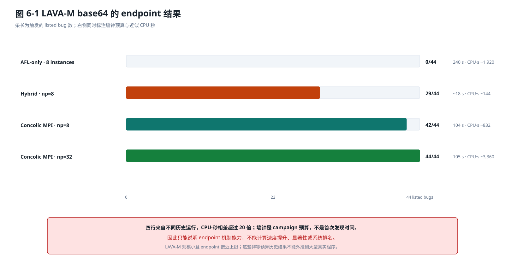

> 图 6-1（引自 QA3 图集）。[PNG 版本](diagrams/qa3/fig-6-1-lava-endpoints.png)


| 配置 | 墙钟 | 语料 | listed bug |
|---|---:|---:|---|
| 纯 MPI，1 master + 7 worker | 104 s | 4,415 | **42 / 44** |
| 纯 MPI，31 worker | 105 s | 40,847 | **44 / 44** |
| 纯 MPI，31 worker（第二次） | 105 s | 28,588 | **44 / 44** |
| hybrid np=8（4 AFL + 3 SymCC） | ~18 s | 707 | 29 / 44 |

> ⚠ **base64 已经没有区分能力**：ICSE'23 的再评估里 7 个 hybrid fuzzer 全部拿满 44/44，
> 差别只在速度。用它论证某个系统强于另一个系统是无效的；这里给出它只是为了说明
> "并行度提高确实缩短了拿满的时间"。SoK（IEEE S&P'24）也已把 LAVA-M 列为有缺陷的基准。

### 4.11 并行吞吐扩展 ≠ 覆盖率扩展【C 级】

这是对"并行符号执行"这件事本身最关键的一条实测，也是理解
[§4.2](#42-主结论20-轮独立样本配置比较a-级工程统计) 为什么要把更多核分配给 AFL 的背景。


> 图 6-3（引自 QA3 图集）。gfts-xml，120 s，单轮。
> [PNG 版本](diagrams/qa3/fig-6-3-scaling-vs-coverage.png)

| 模式 | np | 吞吐 tc/s | 边覆盖率 |
|---|---:|---:|---:|
| 纯 MPI | 2 | 128 | 5.67 % |
| 纯 MPI | 8 | 1,604 | 5.88 % |
| 纯 MPI | 32 | 7,687 | 6.13 % |
| 纯 MPI | 128 | **15,022** | 6.26 % |
| 纯 MPI | 190 | 13,906 | 6.17 % |
| hybrid | 2 | 27 | 7.81 % |
| hybrid | 32 | 187 | 8.82 % |
| hybrid | 128 | 497 | 8.84 % |
| hybrid | 190 | **590** | 8.80 % |

**两条结论**：

1. **纯 MPI 的吞吐涨了约 117 倍（128 → 15,022 tc/s），边覆盖率只从 5.67 % 挪到 6.26 %。**
   吞吐与覆盖率明显脱钩——多出来的测试用例绝大部分落在已覆盖的路径邻域里，这正是
   [§3.6](#36-四层过滤漏斗并行有效性的核心) 那个漏斗要挡掉的东西。
2. **hybrid 用少约 26 倍的测试用例，拿到更高的覆盖率**（8.84 % vs 6.26 %）。

**所以并行度加速的是"逼近路径邻域上限"的速度，而不是上限本身。** 想抬高上限，
要么换更好的种子（[§4.8](#48-输入决定-dse-成败同一个二进制只改种子长度就永远解不出c-级)），
要么把核让给能产生结构性新路径的组件——这就是 §4.2 那个编排结论的物理含义。

> ⚠ 单轮观测；大语料 showmap 最多抽样 20,000 文件，图中覆盖率**不能用于精确效率排名**，
> 只有"吞吐涨两个数量级而覆盖率几乎不动"这个量级关系稳定。

### 4.12 与 ICSE'23 统一再评估的关系【论文】


> 图 5-0a（引自 QA3 图集，数据取自 CoFuzz 论文原文）。
> [PNG 版本](diagrams/qa3/fig-5-0a-icse23-edge-coverage.png)

CoFuzz（Ling Jiang, Hengchen Yuan, Mingyuan Wu, Lingming Zhang, Yuqun Zhang,
*"Evaluating and Improving Hybrid Fuzzing"*, ICSE 2023, DOI `10.1109/ICSE48619.2023.00045`）
统一再评估了 7 个 hybrid fuzzer（QSYM、Angora、Eclipser、Intriguer、DigFuzz、MEUZZ、
Pangolin）与 3 个传统 CGF（AFL、FairFuzz、AFL++），15 个真实程序 24 小时 × 5 次重复，
LAVA-M 5 小时，Mann-Whitney U 检验。

**它最重要的公平性处理**是：所有 hybrid fuzzer 都是"1 核跑 fuzzing + 1 核跑 concolic"，
所以论文把传统 CGF 一律实现成**双实例版本**再来比。

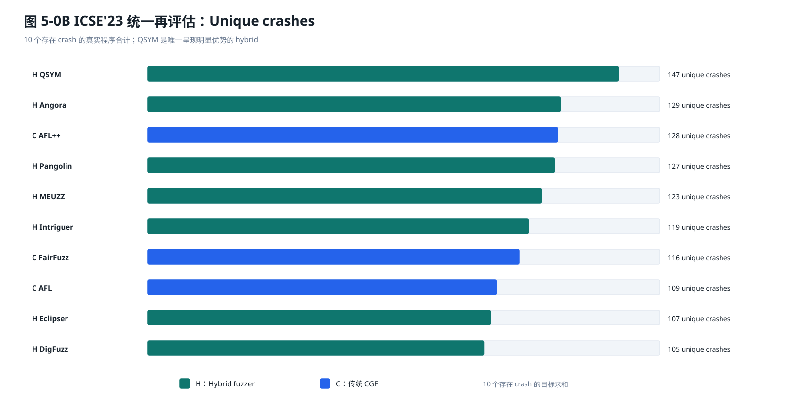

> 图 5-0b（引自 QA3 图集，数据取自 CoFuzz 论文原文）。
> [PNG 版本](diagrams/qa3/fig-5-0b-icse23-unique-crashes.png)

**两条与本项目直接相关的发现**：

| 系统 | 原论文声称比 QSYM 高 | CoFuzz 统一设置下实测 |
|---|---:|---|
| Intriguer | +12.42 % | **QSYM 反高 3.75 %** |
| MEUZZ | +6.60 % | **QSYM 反高 9.99 %** |
| Pangolin | +21.90 % | **QSYM 反高 0.17 %** |

| 系统 | 原论文声称比 AFL 高 | CoFuzz 统一设置下实测 |
|---|---:|---:|
| Angora | +27.08 % | **+9.01 %** |
| Eclipser | +25.15 % | **+5.18 %** |

2018 年的 QSYM 平均边覆盖最高，且在 15 个程序里 **7 个夺冠**；DigFuzz、MEUZZ、Pangolin
分别比它低 **7.67 % / 5.92 % / 3.51 %**——三个明确宣称改进 QSYM 协调模式的工作，
在统一设置下都没打过它。

**这对本项目意味着两件事**：

1. **对照方式必须对齐。** Hybrid 要和同 CPU-second 的纯 AFL 比，而不是和单核 AFL 比。
   [§4.2](#42-主结论20-轮独立样本配置比较a-级工程统计) 当前只完成了两个名义 8 核 Hybrid 组合配置之间
   的公平配置比较；AFL-only 仍是 1 核 sanity。这个缺口必须明确保留到下一轮
   sealed confirmatory campaign，而不能用统计显著性掩盖资源预算不公平。
2. **不能只报自己跑赢的那一组。** 本项目 [§4.2](#42-主结论20-轮独立样本配置比较a-级工程统计)
   同时给出了旧编排**不显著**的那两行，正是因为 CoFuzz 揭示的问题就出在选择性报告上。

---

## 五、创新性与先进性小结

### 5.1 学术来源与落地边界

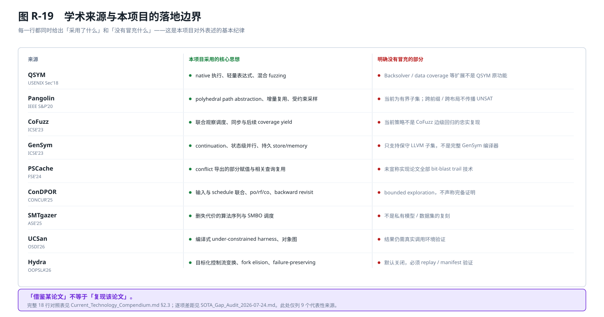

> 图 R-19。[PNG 版本](diagrams/report/fig-r19-sota-boundary.png)｜完整 18 行对照表见
> [`Current_Technology_Compendium.md`](Current_Technology_Compendium.md) §2.3

讨论"先进性"之前先划一条线：**"借鉴某论文"不等于"复现该论文"。** 项目对每一个
学术来源都同时记录"采用了什么核心思想"和"明确没有冒充什么"：

| 来源 | 采用的核心思想 | 明确没有冒充的部分 |
|---|---|---|
| **QSYM**（USENIX Sec'18） | native 执行、轻量表达式、混合 fuzzing | Backsolver、data coverage 等扩展不是 QSYM 原功能 |
| **[Pangolin](https://doi.org/10.1109/SP40000.2020.00063)**（S&P'20） | polyhedral path abstraction、增量复用、受约束多解采样 | 当前仅实现有界复用子集；跨前缀 / 跨布局路径**不传播 UNSAT** |
| **CoFuzz**（ICSE'23） | 联合观察调度、同步与后续 coverage yield | 当前策略不是 CoFuzz 边级回归的忠实复现 |
| **GenSym**（ICSE'23） | continuation、状态级并行、持久 store/memory | 只支持保守 LLVM 子集，不是完整 GenSym 编译器 |
| **PSCache**（FSE'24） | conflict 导出的部分赋值与相关查询复用 | 未宣称实现论文全部 bit-blast trail 技术 |
| **ConDPOR**（CONCUR'25） | 输入与 schedule 联合、po/rf/co、backward revisit | bounded exploration，不声称完备证明 |
| **SMTgazer**（ASE'25） | 删失代价的算法序列与 SMBO 调度 | 不是私有模型 / 数据集的复刻 |
| **UCSan**（OSDI'26） | 编译式 under-constrained harness、对象图 | 结果仍需真实调用环境验证 |
| **[Hydra](https://doi.org/10.1145/3798202)**（OOPSLA'26） | targeted control-flow transformation、fork elision、failure-preserving 变换 | 默认关闭，必须 replay / manifest 验证 |
| **Lase / Cottontail / S2F / TACO-Fuzz / ParaSuit / GenSlv / SymCC-str** | 在线语法、expressive coverage、PrefixDAG 调度、目标中心选种、自配置参数、reusable generator、BV/String 双表示 | 均为有界实现子集；agentic / 学习式模块位于**不可信平面** |

这张表的存在本身就是一项工程纪律：**它让"我们实现了 XX 论文"这句话没法含糊说出口。**

### 5.2 五个可归纳的组合创新

不借用论文名称、只从当前系统本身看，可以归纳出五个有研究价值的组合创新：

1. **多粒度并行的统一闭环**：seed 级、query 级、schedule 级和 continuation state 级
   四种并行粒度使用版本化、可互操作的 telemetry / artifact 契约，并在具体化之后汇入
   同一套 coverage ownership 与可信接纳边界。它们不是一个完全相同的 JSON schema，
   但确实共享身份与验证语义。

2. **Query IR 作为跨层证据总线**：求解复用、字符串、语法补洞、schedule 与 holdout
   campaign 共享内容身份和验证语义，使得"某个候选是怎么来的、被谁验证过"可以跨层追溯。

3. **双覆盖平面**：AFL 兼容位图保证生态互操作（能直接和 AFL++ 生态对接），显式结构键的
   data / grammar / structure 状态提高调度与研究测量的可解释性。前者解决"能不能用"，
   后者解决"能不能解释"。

4. **激进 proposal、保守 acceptance**（[§2.4](#24-最重要的系统不变量激进提议保守接纳)）：
   这是本项目最核心的设计取舍。它让 polyhedral renaming、optimistic slice、grammar/PCFG、
   agentic 路由和 Hydra 变换这些**不完备方法可以被大胆引入以提高召回**，而正确性由独立
   validator / replay 守住。

5. **证明携带的系统优化**：编译变换、parser forest、solver strategy 和 coverage join
   不只输出结果，还输出**可重算的结构证据和 sealed 实验身份**。这把"实验可复现"从
   事后补救变成了实现的一部分。

**工程侧的先进性**还体现在两处具体成果：

- **双引擎抽象**让两种原理完全不同的符号执行后端（编译期插桩 vs DFSan 标签传播）
  共享同一套评测口径，这在开源实现里并不常见；
- **20 轮独立样本配置比较**（independent bootstrap + label permutation + Holm 校正 + 批次 sanity）
  对两个名义 8 核 Hybrid 编排给出了稳定差异；同时它也暴露出 AFL-only 仅为 1 核，
  因此当前证据不能回答 Hybrid 相对等 CPU 纯 AFL 的因果优势。

---

## 六、边界、风险与下一步

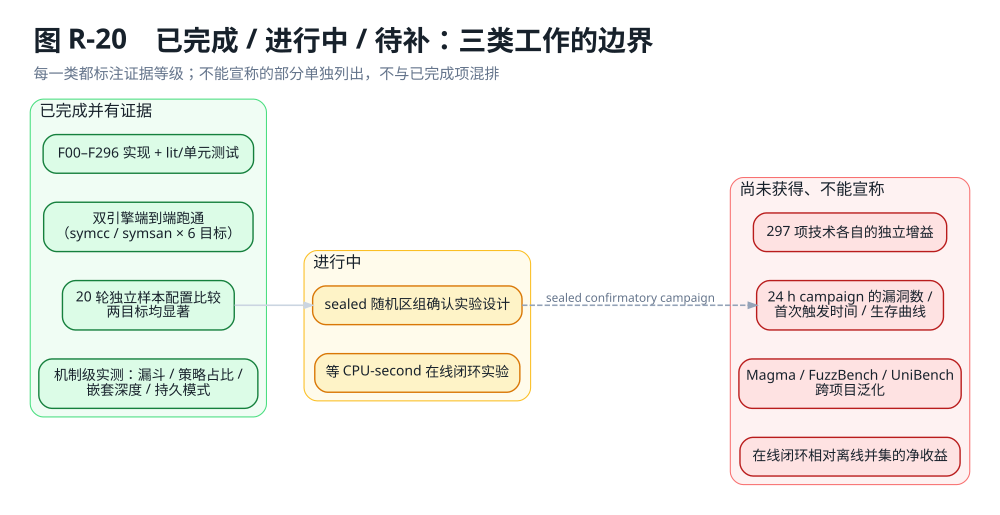

> 图 R-20。[PNG 版本](diagrams/report/fig-r20-roadmap.png)｜[DOT 图源](diagrams/report/src/fig-r20-roadmap.dot)

### 6.1 明确不能宣称的结论

以下五类说法**目前没有证据支撑，不应出现在汇报中**：

1. ❌ "全部 297 个功能条目让覆盖率提高了 X %"——20 轮比较改变的是**系统级组合配置**
   （AFL 实例数 + SymCC worker 数 + AFL profile 同时变），属于组合消融，不能拆到单项技术。
   **可以说的是**（[§4.4](#44-求解技术族消融完整-z3-调用下降但总成本上升c-级描述)）：
   求解技术族在 LAVA-M base64 上把完整路径 Z3 调用降低了 56.6 %、每 seed 候选总数增加
   33.7 %——但同一组实验同时表明 **solver queries 增加 190.5 %、候选吞吐下降 97.5 %、
   bug 数没有提升、平均墙钟涨了 53.3 倍**，这些数字必须一起说。
2. ❌ "Hybrid 已在等 CPU 下显著优于纯 AFL"——当前 AFL-only sanity 只有 1 核。
3. ❌ "AFL 已在线消费 SymCC 输入并形成闭环"——[§4.9](#49-两条负面结论c-级) 已直接证伪。
4. ❌ "漏洞发现速度提高 X 倍"——本轮 160 个测量单元的目标崩溃数**均为 0**，
   这只说明本轮没发现崩溃，既不能推出程序无漏洞，也不能推出系统有找 bug 的能力。
5. ❌ "达到 / 超过 SOTA"——缺少统一版本下的等 CPU、多轮、全消融 R 级结果。

### 6.2 已知的实现边界

| 边界 | 说明 |
|---|---|
| GenSym / ConDPOR / IFSS / SymCC-str 均为**有界实现** | 覆盖论文思想的重要可执行子集，不能用论文名称暗示已复刻全部语义或证明 |
| 学习与 agentic 模块**不可信** | 只能排序或提议，不能授权 UNSAT、覆盖或程序等价 |
| AFL data namespace **可能碰撞** | 需要 scheduler 的显式结构键 tracker 才能区分 `(object, offset, width, kind)` |
| 多 coordinator **依赖共享存储语义** | 不是无共享存储的拜占庭一致性系统 |
| proof artifact **有边界** | seal/replay 可检测本地漂移与篡改，不等于形式化验证或远程 attestation |
| LLVM lowering **fail closed** | 保守拒绝是正确性选择，不是"所有输入程序都已支持" |
| LLVM intrinsic 覆盖**不完整** | 编译日志仍显示 `llvm.umin` / `llvm.smin` / `llvm.umax` 被 concretize，会在相关数据流处丢失符号表达式 |

### 6.3 下一步

| 优先级 | 事项 | 为什么是它 |
|---|---|---|
| **P0　工程** | 把 `AFL_SYNC_TIME=1` 与 `symcc01/ → -F foreign_dirs` 接上，让短预算下的在线闭环真正成立，然后**重新测量在线闭环相对离线候选并集的净收益** | 这是当前最大的已知缺口——[§4.9](#49-两条负面结论c-级) 证明闭环目前不成立，而代码里已有那条路径，只是没接上 |
| ~~P0　工程~~ | ~~收尾 300 s 描述性复测与全量回归~~ | **已完成**，结果并入 [§4.10](#410-工程性能实测c-级) |
| **P1　科研证据** | 按 `research_protocol.py` 契约跑一次 **sealed confirmatory campaign**：同一工作树快照、相同 CPU-second、随机区组、每格 ≥20 次，增加 30 min / 2 h / 6 h 或 24 h 的 coverage AUC、首次 bug 时间与 right-censored 生存分析 | 这一步做完，当前 A/B/C 级观察才能升级到 R 级；[§6.1](#61-明确不能宣称的结论) 的五条禁语里有多条要靠它解禁 |
| **P1　能力** | 把技术族消融从 base64 单目标扩到多目标多轮：[§4.4](#44-求解技术族消融完整-z3-调用下降但总成本上升c-级描述) 已给出求解族的第一组机制描述（完整 Z3 调用 −56.6 %，但总 query +190.5 %、bug 数持平、墙钟 ×53.3），仍需 portfolio、grammar 两族与更多目标 | 直接对应 [§6.1](#61-明确不能宣称的结论) 第 1 条禁语；当前尚未形成性能增益结论 |
| **P2　能力** | 补齐 LLVM intrinsic 语义覆盖（`llvm.umin` / `llvm.smin` / `llvm.umax` 等） | 见 [§1.5](#15-顺带修掉的一个真实编译器崩溃)，会在相关数据流处静默丢失符号表达式 |

---

<a id="附录复现与证据索引"></a>
## 附录　复现与证据索引

### A.1 主要数据来源

| 内容 | 文件 | 等级 |
|---|---|---|
| 20 轮独立样本配置比较 | [`evidence/current-eval-2026-07-30/statistical_summary.md`](evidence/current-eval-2026-07-30/statistical_summary.md)、[`independent_comparisons.csv`](evidence/current-eval-2026-07-30/independent_comparisons.csv) | A（工程统计，非确认性随机区组） |
| 完整评估报告与方法学 | [`Current_Implementation_Evaluation_2026-07-30.md`](Current_Implementation_Evaluation_2026-07-30.md) | A |
| LAVA-M base64 当前求解消融 | [`evidence/lava_m_current_2026_07_30/base64_summary.json`](evidence/lava_m_current_2026_07_30/base64_summary.json)、[`base64_manifest.json`](evidence/lava_m_current_2026_07_30/base64_manifest.json) | C |
| 开发阶段 P01–P10 与提交映射 | [`Development_History_Traceability.md`](Development_History_Traceability.md) | — |
| SymSan 六目标基准 | [`symsan_hybrid_benchmark_6targets.md`](../symsan_hybrid_benchmark_6targets.md) | B |
| 漏斗 / 策略占比 / 求解开关 / 嵌套深度 / 种子长度 / 持久模式 / LAVA-M | [`Architecture_QA3.md`](Architecture_QA3.md)、[`benchmark/qa3_repro/`](../../benchmark/qa3_repro/README.md) | C |
| 技术全景与功能索引 | [`Current_Technology_Compendium.md`](Current_Technology_Compendium.md)、[`New_Implementation_Archive.md`](New_Implementation_Archive.md) | — |
| 外部文献核对 | [`Architecture_QA3.md`](Architecture_QA3.md) 文末"主要外部原始资料" | 论文 |

### A.2 两条构建管线：真实目标与自测试


> 图 2-4（引自 QA3 图集）。[PNG 版本](diagrams/qa3/fig-2-4-build-test-pipelines.png)

一个经常被问到的问题：**仓库里的自测试跑的不是 benchmark**。两者是两条独立管线——

- **真实目标构建**用 `symcc` / `sym++` 包装器编译整个项目（libxml2、SQLite、libarchive…），
  产出的是可以喂给 AFL 和 MPI worker 的二进制；
- **自测试（lit）**里 `%symcc` 就是 `build/symcc` 这个路径本身，多数用例编译一个几十行的
  `.c` 或直接对 `.ll` 跑 `%opt` + pass 插件，断言产出的输入字节或 telemetry JSON。

`test/` 一级目录共有 231 个文件，其中 `.ll` 102 个、`.c` 54 个、`.py` 52 个、
`.test32` 17 个，另有 lit 配置和 include/YAML 辅助文件。
**lit 层验证的是接口与不变量，campaign 层验证的是效果，两者不能互相替代。**

2026-07-30 的当前顺序复跑结果为：LLVM 18 `209/209` 通过（134.25 s）；
LLVM 17 `208 passed + 1 unsupported`（133.42 s）；Python unittest `475/475`
通过（82.962 s）。命令与完整口径见
[`current_document_review_verification.md`](evidence/current-eval-2026-07-30/current_document_review_verification.md)。

### A.3 配图复现

```bash
sudo apt-get install graphviz
python3 docs/codex/diagrams/render_qa3_diagrams.py       # QA3 图集 25 张
python3 docs/codex/diagrams/render_project_report.py     # 本报告图集 21 张
```

两个脚本共用同一份配色与字体常量，混排时视觉一致。两套图集共有 46 张可复现配图：
本报告图集 21 张（R-1 … R-21），QA3 图集 25 张。结构图走 Graphviz DOT
（DOT 源保存在各自的 `src/` 下），定量图直接生成 SVG，PNG 由 headless Chrome 栅格化。

### A.4 关键复现命令

```bash
# 20 轮独立样本配置比较的统计分析
python3 benchmark/analyze_current_evaluation.py

# SymSan 六目标 hybrid
export SYMSAN_FGTEST=<.../fgtest> SYMSAN_KO_CLANG=<.../ko-clang>
python3 benchmark/run_benchmark.py --engine symsan --hybrid --no-serial \
  --targets lava-base64_harness --np-list 8 --timeout 20 --rounds 3 --output /tmp/bench_b64

# QA3 机制实测（漏斗 / 策略占比 / 嵌套深度 / 持久模式）
ls benchmark/qa3_repro/
```

### A.5 可复现性边界

本报告引用的是一个**尚未封存的工作树**，分支名和 `file:line` 不是不可变证据。
正式发表或对外复现实验前，必须同时记录主仓库提交、子模块提交、dirty diff 摘要、
编译器 / AFL++ / Z3 版本，以及脚本、输入语料和结果 CSV 的内容清单。

当前环境：AMD Threadripper PRO 9995WX（96 核 / 192 线程）、250 GiB 内存、
Ubuntu LLVM 18.1.3、AFL++ 4.40c、Open MPI 4.1.6、系统 libz3 4.8.12、
Git HEAD `146e01b2d6f8e02fd2526764d46ea0d80a4bb6f6`（工作树含未提交改动）。
