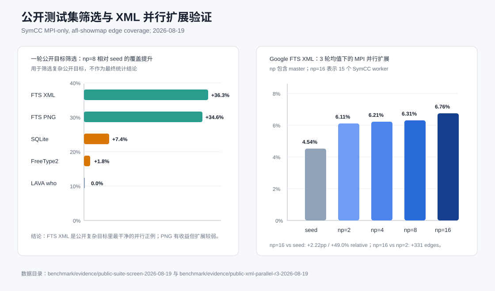

# 公开测试集调研与并行符号执行测试记录

日期：2026-08-19  
执行目录：`/home/ubuntu/code/symcc`  
实验目的：从公开 fuzzing / symbolic execution benchmark 中筛选更复杂、可复现、能体现并行符号执行优势的 testcase，并给出本项目当前实现的实测数据。



## 公开测试集调研结论

本次优先考虑四类公开测试集：

| 测试集 | 公开定位 | 本项目使用方式 | 本轮结论 |
|---|---|---|---|
| Google Fuzzer Test Suite / FTS | 真实库派生 fuzzing benchmarks，包含 libxml2、libpng、pcre2、sqlite 等 | 已在 `benchmark/public/bin/` 构建出 PNG/XML 以及多个真实目标 | 最适合快速筛选复杂公开 case；本轮选中 XML |
| FuzzBench | 面向 fuzzer 的大规模可复现实验平台，使用真实项目 benchmark 并提供统计报告能力 | 适合后续长时、大规模、多轮云实验 | 本轮不直接跑完整 FuzzBench，因为其 Docker/云实验成本较高 |
| Magma | ground-truth fuzzing benchmark，真实程序 + front-ported bugs + reached/triggered instrumentation | 适合后续做 bug-centric 指标 | 本轮没有完整构建 Magma；推荐后续接入 libxml2/sqlite/libpng 三类目标 |
| LAVA-M | ground-truth 注入 benchmark，base64/md5sum/uniq/who | 本地已有 LAVA-M 二进制和 seeds | `who` 短时覆盖率不随 worker 增长，不适合作为覆盖率并行正例 |

资料依据：

- Google Fuzzer Test Suite 仓库说明其目标是提供来自真实库、包含 hard-to-find code paths 的 fuzzing benchmarks，并列出 libxml2、libpng、pcre2、sqlite 等目标。
- FuzzBench 官方文档说明其目标是在真实 benchmark 上可复现地评估 fuzzers，并提供图表和统计检验。
- Magma 官方文档说明其提供真实程序、真实历史 bug、source-level instrumentation，可测量 reached/triggered。
- LAVA 论文定位是为自动化测试工具提供 ground-truth corpora。

## 本地可用公开目标

本地已构建并可被 `benchmark/run_benchmark.py --public` 自动发现的目标包括：

| Suite | 目标 |
|---|---|
| Google FTS | `gfts-png_read_fuzzer`, `gfts-xml_read_fuzzer` |
| FTS 派生真实目标 | `pcre2-pcre2_fuzzer`, `sqlite-sqlite_fuzzer`, `freetype2-freetype2_fuzzer`, `libarchive-archive_fuzzer` |
| LAVA-M | `lava-base64`, `lava-base64_harness`, `lava-md5sum`, `lava-uniq`, `lava-who` |
| Synthetic public | `synthetic-parallel_scaling` |

覆盖率由 AFL-instrumented companion binary 通过 `afl-showmap` 测量；本轮公开目标测试使用 MPI-only SymCC，不混入 AFL fuzzing，因此结果主要反映并行符号执行本身的路径扩展能力。

## 一轮筛选实验

命令：

```bash
python3 benchmark/run_benchmark.py \
  --no-default --public \
  --targets gfts-png_read_fuzzer,gfts-xml_read_fuzzer,sqlite-sqlite_fuzzer,freetype2-freetype2_fuzzer,lava-who \
  --np-list 2,4,8 \
  --rounds 1 --timeout 20 \
  --output benchmark/evidence/public-suite-screen-2026-08-19 \
  --skip-build --no-serial --timeseries 10
```

结果：

| Target | Seed coverage | np=2 | np=4 | np=8 | 评价 |
|---|---:|---:|---:|---:|---|
| `gfts-png_read_fuzzer` | 12.99% (399/3072) | 17.19% | 17.22% | 17.48% | 符号执行收益明显，但并行扩展较弱 |
| `gfts-xml_read_fuzzer` | 4.55% (2314/50880) | 5.76% | 6.09% | 6.20% | 公开复杂目标中并行扩展最清楚 |
| `sqlite-sqlite_fuzzer` | 13.85% (4370/31552) | 14.72% | 14.80% | 14.88% | 真实复杂目标，但短时增量较小 |
| `freetype2-freetype2_fuzzer` | 2.22% (481/21632) | 2.26% | 2.26% | 2.26% | candidates 增加但 coverage 不增加 |
| `lava-who` | 6.73% (719/10688) | 6.73% | 6.73% | 6.73% | 覆盖率维度无并行扩展信号 |

筛选结论：`gfts-xml_read_fuzzer` 是当前最适合作为“公开复杂测试集上的并行符号执行正例”的目标。它比 synthetic benchmark 更真实，包含 XML token、属性、DTD/entity、namespace、CDATA、嵌套树结构等解析路径；同时又不像 pcre2/libarchive persistent hybrid 那样被 AFL 吞吐主导。

## XML 三轮确认实验

命令：

```bash
python3 benchmark/run_benchmark.py \
  --no-default --public \
  --targets gfts-xml_read_fuzzer \
  --np-list 2,4,8,16 \
  --rounds 3 --timeout 30 \
  --output benchmark/evidence/public-xml-parallel-r3-2026-08-19 \
  --skip-build --no-serial --timeseries 15
```

结果为 3 轮均值：

| Mode | NP | Mean time | SymCC candidates | Unique retained | Edge coverage |
|---|---:|---:|---:|---:|---:|
| seed | 0 | 0.0s | 0 | 20 | 4.54% (2310/50880) |
| MPI | 2 | 45.8s | 2664 | 1889 | 6.11% (3110/50880) |
| MPI | 4 | 39.6s | 3101 | 2201 | 6.21% (3161/50880) |
| MPI | 8 | 41.0s | 3527 | 2497 | 6.31% (3212/50880) |
| MPI | 16 | 48.7s | 5669 | 4041 | 6.76% (3441/50880) |

关键结论：

- `np=16` 相对 seed 覆盖从 2310 edges 提升到 3441 edges，增加 1131 条边，覆盖率从 4.54% 到 6.76%，相对提升 49.0%。
- `np=16` 相对 `np=2` 多 331 条边，coverage 从 6.11% 到 6.76%，说明更多 worker 在同一复杂公开目标上仍能带来额外路径。
- candidates 从 `np=2` 的 2664 增至 `np=16` 的 5669，unique retained 从 1889 增至 4041，说明并行 worker 不只是重复求解，也在扩大可验证输入集合。
- 真实公开目标存在方差；本轮是 3 轮短时实验，足以作为汇报正例，但正式论文级结论仍应扩展到 10min/1h、更多 rounds 和 AFL-only/hybrid 对照。

## 推荐汇报口径

1. synthetic `parallel_scaling` 继续作为最干净的框架级并行扩展 case。
2. `gfts-xml_read_fuzzer` 作为公开复杂测试集正例：真实 parser、结构化输入、公开可复现、并行增益明确。
3. `gfts-png_read_fuzzer` 作为符号执行能提升真实库覆盖的补充，但不强调并行扩展。
4. SQLite、FreeType2、LAVA `who` 的短跑结果应作为筛选负例或边界条件，说明复杂目标需要按输入结构、种子质量、覆盖指标和运行时预算选择。

## 后续实验

- 对 `gfts-xml_read_fuzzer` 增加 `np=1/2/4/8/16/32`、10min/1h、5-10 rounds，输出置信区间。
- 为 XML 目标增加 hybrid AFL-only / AFL+SymCC 对照，区分“纯并行符号执行扩展”和“hybrid coverage 收益”。
- 继续接入 Magma 的 libxml2/sqlite/libpng，用 reached/triggered 指标补充 edge coverage。
- 对 XML seed corpus 做结构分层：DTD/entity、namespace、CDATA、deep nesting、attribute-heavy，分析哪些输入结构最能放大并行符号执行收益。

## 产物位置

- 筛选实验：`benchmark/evidence/public-suite-screen-2026-08-19/`
- XML 确认实验：`benchmark/evidence/public-xml-parallel-r3-2026-08-19/`
- 图：`docs/codex/figures/public_benchmark_parallel_2026-08-19.svg`
- 本文档：`docs/codex/Public_Benchmark_Search_Test_2026-08-19.md`
