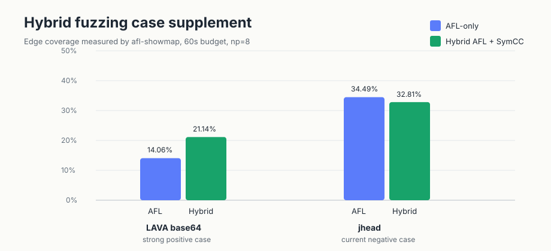

# 公开 hybrid fuzzing case 补充与测试记录

日期：2026-08-19

目标：在已确认 `lava-base64` 强正例之外，继续补充公开 benchmark case，验证哪些目标能体现“并行符号执行加入后，相比纯 AFL fuzzing 提升覆盖率”。



## 本轮结论

| Case | 状态 | 结果 |
|---|---|---|
| LAVA-M `base64` | 已有强正例 | 3 轮 60s，hybrid 21.14% / 230 edges，AFL-only 14.06% / 153 edges，hybrid +77 edges，约 +50.3% 相对 AFL-only |
| `jhead` JPEG | 本轮已接入并测试 | 可复现构建成功，但 60s 等核覆盖率 AFL-only 更高；不能作为当前强正例 |
| FTS `json-2017-02-12` | 本轮尝试接入 | 文件输入 harness 已准备；SymCC 插桩旧版 nlohmann/json 模板 parser 时触发 LLVM/SymCC pass 崩溃，暂不纳入可测试版本 |
| LAVA-1 `file-5.22` | 本轮尝试接入 | 目标有科研价值，但 `funcs.c` 在 SymCC 插桩阶段超过 5 分钟仍未完成，当前不纳入短期可测试集 |

## jhead 接入

来源：ICSE 2023 hybrid fuzzing 评估真实程序目标，输入为 JPEG，命令形式 `jhead @@`。

本轮新增：

- `benchmark/compile_public_benchmarks.sh --jhead`
- `benchmark/public/bin/jhead/jhead`
- `benchmark/public/bin/jhead-afl/jhead`
- `benchmark/public/bin/jhead-cmplog/jhead`
- AFL++ profile variants：`jhead-afl-laf`, `jhead-afl-ctx`, `jhead-afl-ngram4`, `jhead-afl-laf-ctx`
- 种子目录：`benchmark/public/seeds/jhead/jhead`，共 14 个 JPEG seed，来自 jhead 自带正常/异常样本和 FTS JPEG seed。

冒烟检查：

| 检查 | 结果 |
|---|---|
| SymCC 插桩符号 | 62 |
| AFL showmap 单 seed | 259 edges |
| SymCC 单 seed 运行 | 生成 1 个候选输入，但 QSYM 后端在非关系型分支断言退出 |

该 QSYM 断言没有阻止 benchmark runner 收集已写出的输入，但它明显限制了 jhead 上的 concolic 贡献。

## jhead 60 秒测试结果

配置一：symbolic-heavy，AFL profiles off，`np=8`，`1 AFL + 6 SymCC workers`，1 round。

```bash
python3 benchmark/run_benchmark.py \
  --no-default --public \
  --targets jhead-jhead \
  --np-list 8 \
  --rounds 1 --timeout 60 \
  --output benchmark/evidence/hybrid-advantage-jhead-screen-2026-08-19 \
  --skip-build --no-serial --no-mpi \
  --afl-only --hybrid \
  --hybrid-afl-instances 1 \
  --aflpp-profiles off \
  --timeseries 20
```

| Mode | NP | Time | SymCCGen | AFLExec | Unique | Showmap coverage |
|---|---:|---:|---:|---:|---:|---:|
| seed | 0 | 0.0s | 0 | 0 | 13 | 22.15% (397/1792) |
| AFL-only | 8 | 60.2s | 0 | 3,137,114 | 2,677 | 33.93% (608/1792) |
| Hybrid | 8 | 61.2s | 3 | 359,829 | 667 | 32.87% (589/1792) |

配置二：full AFL++ profiles，启用 jhead 的 LAF/CTX/Ngram/CmpLog 变体，`np=8`，1 round。

```bash
python3 benchmark/run_benchmark.py \
  --no-default --public \
  --targets jhead-jhead \
  --np-list 8 \
  --rounds 1 --timeout 60 \
  --output benchmark/evidence/hybrid-advantage-jhead-fullprofiles-2026-08-19 \
  --skip-build --no-serial --no-mpi \
  --afl-only --hybrid \
  --hybrid-afl-instances 1 \
  --aflpp-profiles full \
  --timeseries 20
```

| Mode | NP | Time | SymCCGen | AFLExec | Unique | Showmap coverage |
|---|---:|---:|---:|---:|---:|---:|
| seed | 0 | 0.0s | 0 | 0 | 13 | 22.10% (396/1792) |
| AFL-only | 8 | 61.1s | 0 | 2,982,107 | 3,920 | 34.49% (618/1792) |
| Hybrid | 8 | 61.2s | 6 | 411,343 | 723 | 32.81% (588/1792) |

判断：`jhead` 在论文中是 QSYM/CoFuzz 覆盖强正例，但在当前实现和 60 秒短预算下不是强正例。根因不是 AFL profile 缺失，而是 SymCC/QSYM 对 jhead 的路径贡献太弱：hybrid 只有 1 个 peer-published 输入，AFL 没有完成导入；AFL-only 依靠 8 实例吞吐达到约 3M execs/分钟。

## 构建受阻 case

### FTS json

操作：

- 下载 FTS 指定 commit 的 nlohmann/json 源码。
- 新增文件输入 wrapper：`benchmark/harnesses/fts_json_file_harness.cpp`。
- 复用 FTS seed：`json-2017-02-12/seeds/seed`。

阻塞：

- 旧版 JSON API 已适配为 iterator parse。
- SymCC 插桩时在 `nlohmann::basic_json::parser::parse_internal` 触发 LLVM/SymCC pass 崩溃。
- 因此当前没有生成 `fts-json` 可执行二进制，不纳入正式 benchmark。

### LAVA-1 file-5.22

操作：

- 使用本地 `benchmark/public/lava_corpus/LAVA-1/file-5.22`。
- 准备 seed：`foo.sh`, `gedcom.testfile`, `escapevel.testfile`, `README`。

阻塞：

- `configure` 成功进入构建。
- SymCC 插桩 `src/funcs.c` 时超过 5 分钟仍未完成，进程停留在大函数符号化阶段。
- 当前不适合放入短预算自动化测试。后续可尝试 `-O0`、拆分编译单元、跳过 debug intrinsic、或者只构建 libmagic harness。

## 当前推荐汇报 case

| 用途 | 推荐目标 | 理由 |
|---|---|---|
| hybrid 明显优于 AFL-only | `lava-base64` | 已有 3 轮稳定正向数据，差异大且机制清晰 |
| 并行符号执行扩展性 | `gfts-xml_read_fuzzer` MPI-only | np=2/4/8/16 覆盖率逐步提升，适合展示并行 worker 收益 |
| 真实程序接入与负例分析 | `jhead` | 已接入 ICSE23 真实目标，能说明当前系统瓶颈和后续优化方向 |

## 后续改进点

1. 修 QSYM `addJcc` 非关系型断言，或者在该类 branch 上降级为 conservative skip，使 jhead 能持续执行。
2. 对 `jhead` 增加更贴近 ICSE23 的 seed corpus 和更长预算（10min/1h），再评估 QSYM/CoFuzz 论文差距是否可复现。
3. 对 LAVA-1 `file-5.22` 采用 `-O0` 或按文件分批插桩，定位 `funcs.c` 编译瓶颈。
4. 对 FTS JSON 缩小模板实例化面，优先提取 C ABI wrapper 或较小版本，以验证 parser 型目标。
5. 新增 `bento`/binutils `strip,nm`，这两个在 ICSE23 中覆盖收益较大，更可能形成第二个真实程序正例。

## 证据目录

- `benchmark/evidence/hybrid-advantage-lava-base64-symbolic-heavy-r3-2026-08-19/`
- `benchmark/evidence/hybrid-advantage-jhead-screen-2026-08-19/`
- `benchmark/evidence/hybrid-advantage-jhead-fullprofiles-2026-08-19/`
- `benchmark/evidence/public-xml-parallel-r3-2026-08-19/`
