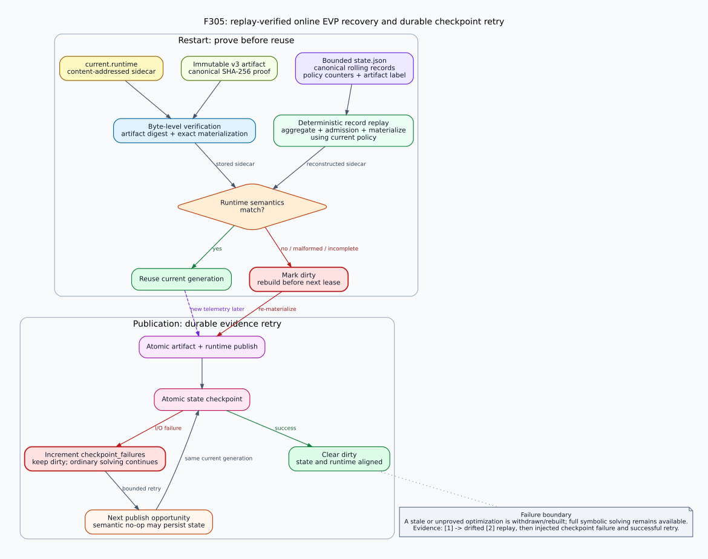

# F305：可重放验证的在线画像恢复与持久化重试

## 1. 摘要

F302--F304已经验证artifact和runtime侧车的字节身份，也用
`current_artifact_sha256`把checkpoint声明的代际与runtime绑定。进一步审查发现，
**标签一致不等于状态可重建**：`state.json`中的滚动记录可能已经损坏、被部分替换，
或只保存了与当前artifact摘要相同的陈旧标签；原恢复路径不会从这些记录重新执行聚合
和准入策略。另一个缺口是所有`_checkpoint()`返回值都被忽略，state写失败后协调器
可能清除`dirty`，直到出现新telemetry才再次尝试持久化。

F305把在线画像恢复升级为确定性replay：启动时使用与正常发布完全相同的候选构造函数，
从恢复记录重新执行画像聚合、成本感知准入和runtime物化，再与磁盘sidecar比较**求解
语义**。任何差异、畸形记录、不完整窗口、策略变化或重放异常都会在下一次lease前
重新物化。checkpoint失败则增加计数、保持`dirty`并在下一次发布机会重试；已经成功
写出的runtime仍可使用，普通完整符号求解不被中断。



## 2. 审查发现

### 2.1 代际标签不能证明记录支持当前域

旧恢复链验证了：

```text
state.current_artifact_sha256 == runtime.artifact_sha256
artifact SHA-256 valid
materialize(artifact) == runtime bytes
```

这能证明artifact和runtime没有被静默改写，但不能证明checkpoint中的`records[]`在当前
策略下仍会导出同一域集合。一个合法但被替换为其他值域的记录，可以与旧artifact标签
同时存在；重启后旧sidecar会被信任，后续滚动窗口和当前求解假设来自两个不同状态。

### 2.2 checkpoint失败没有进入重试状态

artifact、runtime和state是三个独立原子rename。即使前两个成功，最后一个仍可能因
磁盘满、权限变化或瞬时I/O错误失败。旧代码在调用checkpoint前已经把`dirty`清零，
又忽略布尔返回值，因此：

- 当前进程可以继续分发新runtime，但磁盘checkpoint仍对应旧记录；
- 没有新telemetry时不会主动重试；
- `publication_failures`也无法区分runtime发布失败和state持久化失败。

恢复期可以最终发现代际错配，所以这不是路径求解soundness错误；但它削弱了崩溃一致
性、审计可解释性和优化可用性。

## 3. F305执行流程

### 3.1 单一候选构造路径

新增`_build_candidate()`，正常发布和恢复重放共同调用：

```text
bounded records
  -> aggregate_value_profiles(current min observations/distinct policy)
  -> apply_online_admission_policy(current query/ratio/cost policy)
  -> verify and materialize runtime sidecar
```

这避免恢复验证器复制一份可能逐渐漂移的简化逻辑。重放使用当前进程配置，因此同时
覆盖schema升级、策略换代、旧11项反馈兼容和F304成本门。

### 3.2 启动恢复顺序

协调器启动后按固定顺序执行：

1. 有界读取并规范化`state.json`记录；任一畸形记录令状态`dirty`；
2. 独立验证artifact摘要和runtime逐字节物化；
3. 校验state声明的artifact标签、窗口完整性和当前策略字段；
4. 若state与runtime均存在，从恢复记录调用`_build_candidate()`；
5. 比较重建sidecar与磁盘sidecar的runtime语义；
6. 相同则允许复用，不同或重放失败则增加mismatch并在下一次lease前重建。

比较函数只忽略sidecar中的artifact摘要行，因为计数变化可能产生新证据摘要但不改变
worker求解域；schema、policy、`profile_count`及每一条context/site/bits/value域都必须
完全一致。策略本身变化时，F304的`_runtime_policy_mismatch`仍强制发布新证明代际，
不能由语义相同短路。

### 3.3 checkpoint失败重试

所有发布路径改用`_checkpoint_or_retry()`：

```text
checkpoint success -> 保持当前dirty状态
checkpoint failure -> checkpoint_failures += 1; dirty = true
```

它覆盖首次零域checkpoint、普通semantic no-op、artifact/runtime发布失败后的状态记录、
runtime成功发布后的最终checkpoint以及runtime解析防御分支。若runtime已经成功发布，
下一次重试通常是semantic no-op，只写state而不改变域集合；成功后`dirty=false`。

## 4. 状态与遥测

`state.json`和`snapshot()`新增三个有界饱和计数：

| 字段 | 含义 |
| --- | --- |
| `checkpoint_failures` | 当前进程观察到的state持久化失败次数；下次成功时落盘 |
| `recovery_replays` | 从已加载state记录重建候选sidecar的次数 |
| `recovery_replay_mismatches` | 重建语义与磁盘runtime不同或重放失败的次数 |

snapshot另显式暴露`dirty`，让MPI日志和实验摘要能区分“当前runtime可用”与“状态仍需
持久化/重建”。旧state缺少这些字段时以0迁移，不改变state schema或worker协议。

## 5. 实现映射

| 文件 | 职责 |
| --- | --- |
| `util/online_value_profile.py` | 单一候选构造、恢复重放、语义比较、失败计数和重试 |
| `test/test_online_value_profile.py` | 标签相同记录漂移、checkpoint故障注入及既有恢复矩阵 |
| `benchmark/run_evp_recovery_smoke.py` | 独立重放机制驱动、原始状态和SHA-256证据生成 |
| `docs/codex/verify_delivery.py` | 离线重算证据摘要、artifact和状态转换义务 |

F305没有增加用户配置；现有窗口、画像和F304准入阈值决定恢复重放结果。

## 6. 测试与可执行证据

### 6.1 自动化测试

在线协调器当前14项测试新增：

- 保留合法旧artifact标签，只把checkpoint记录从`[1]`替换为`[2]`；重启必须检测一次
  replay mismatch、设置dirty并发布`[2]`，不能继续复用`[1]`；
- 只对`state.json`原子写注入`OSError`；artifact/runtime发布仍成功，但dirty保持、
  failure计数为1，下一次semantic no-op成功持久化并清除dirty；
- 既有测试继续覆盖截断窗口、state/runtime代际错配、无state runtime撤销、无sidecar
  记录重评、策略只变化证明换代、窗口调整、payload篡改和普通发布I/O失败。

F305相关四个Python模块为`88/88`（0.553秒），在线协调器为`14/14`；LLVM 18/17
经验画像过滤组均为`5/5`。顺序全量门禁为Python `513/513`（84.787秒，shell real
85.316秒）、LLVM 18 `220 passed + 1 unsupported`（138.10秒，shell real
138.154秒）和LLVM 17 `219 passed + 2 unsupported`（138.78秒，shell real
138.840秒）。两版完整lit日志均实际执行`test_online_value_profile.py`。

### 6.2 归档机制证据

原始制品见
[`evidence/f305-replay-verified-evp-recovery-2026-08-04/`](evidence/f305-replay-verified-evp-recovery-2026-08-04/)：

| 阶段 | 磁盘/记录状态 | 结果 |
| --- | --- | --- |
| 初始发布 | artifact与runtime为`[1]` | 1个runtime域 |
| 标签保持的记录漂移 | artifact标签仍指向`[1]`，records改为`[2]` | 1 replay / 1 mismatch / dirty=true |
| 恢复发布 | 重放当前记录 | runtime精确替换为`[2]` |
| checkpoint故障注入 | runtime发布`[2,3]`，state写抛`OSError` | checkpoint_failures=1 / dirty=true |
| 无新telemetry重试 | 相同runtime语义 | semantic_noop=1 / state落盘 / dirty=false |

三代v3 artifact均可重算摘要；最终snapshot为3个发布代际、1次恢复重放、1次不匹配、
1次checkpoint失败、1次semantic no-op、0次普通publication failure。目录清单逐文件
SHA-256校验。

## 7. 正确性边界与后续研究

F305的保证是：**恢复后启用的经验域必须同时通过磁盘工件验证，并与存活记录在当前
策略下重建的求解语义一致**。不一致只撤销或重建可选经验探针；完整prefix、SAT候选
复验和完整公式回退均不改变。

仍有以下边界：

- 三个文件没有跨文件系统原子事务；F305依靠重放修复，不是分布式共识或线性一致存储；
- 超过16 MiB的checkpoint仍裁最旧记录并在重启后从存活子集重建，可能损失优化机会；
- checkpoint失败计数只有后续成功写入才能跨崩溃保存；故障瞬间断电时无法持久记录
  自己未写成功这一事实；
- 恢复重放增加一次有界启动计算，尚未测量10,000条最大窗口的P95启动开销；
- 机制证据不证明公开target的覆盖率、solver time或吞吐提升。

后续可研究把state、artifact和runtime组合为单一内容寻址generation descriptor，并用
write-ahead generation pointer或目录级事务进一步缩小崩溃窗口；但在引入更复杂的日志
协议前，应先测量当前重放开销和真实checkpoint故障率。
