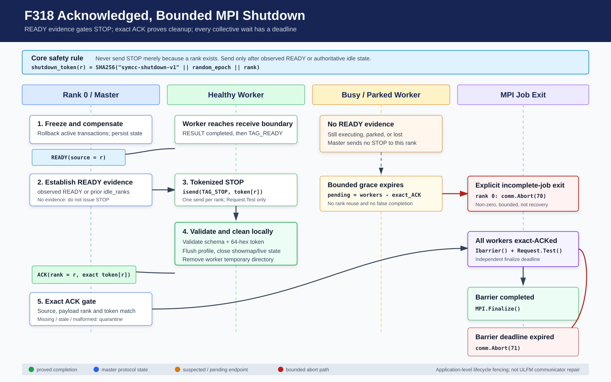

# F318：Acknowledged Bounded MPI Shutdown 与 Finalization

- 日期：2026-08-07
- 范围：MPI master/worker 停止协议、parked worker 收尾、ACK fencing、有界 collective exit
- 成熟度：I/T/E-mechanism；已完成真实三进程协议测试，尚无 rank-kill/网络故障性能实验

## 1. 审查问题

F317 已能在 worker 对一个 dispatch 完全静默时回滚精确代次、迁移语义任务并隔离原 rank，
但关闭阶段仍有两个独立的无限等待点：

1. master 在正常退出、已有输出目录错误和 AFL 配置错误三条路径中，对所有 rank 执行阻塞式
   `comm.send(TAG_STOP)`。被 watchdog parked、仍在目标程序中执行或已经失联的 rank 未必已经
   posted receive；“捕获 MPI 异常”只能处理已经返回控制权的错误，不能给阻塞调用建立 deadline；
2. 所有进程在 `main()` 尾部无条件调用阻塞式 `Barrier()`。即使 master 的 STOP 循环返回，只要
   任一 worker 没有进入 barrier，整个作业仍可能永久停在 finalization 前。

此外，旧 STOP 载荷为 `None`，没有关闭代次；master 无法区分“本轮 worker 已清理完成”和迟到、
畸形或未来可能出现的旧确认。F317 解决了运行期任务所有权，却没有闭合进程生命周期协议。

## 2. 技术定位

mpi4py 的 [`Comm` API](https://mpi4py.readthedocs.io/en/stable/reference/mpi4py.MPI.Comm.html)
提供对象级 `isend()`、非阻塞 `Ibarrier()` 和 `iprobe()`，相应 request 可用 `Test()`轮询完成。
MPI 5.0 将 `MPI_IBARRIER`定义为非阻塞集合操作，参见
[MPI Forum collective overview](https://www.mpi-forum.org/docs/mpi-5.0/mpi50-report/node116.htm)。

F318 利用这些原语实现应用层 bounded cooperative shutdown，但不改变 MPI 的故障模型：普通
MPI 仍不保证进程失败后 communicator 可以继续使用。超时后的 `Abort()`是停止不完整作业的
最终有界动作，不是 communicator repair；后者仍需要 ULFM 的 revoke/shrink/agree 或外部
作业编排支持。

## 3. 协议图



## 4. 状态机与不变量

对每个 worker `r`，master 在本次关闭 epoch 内派生独立 token：

```text
shutdown_token(r) = SHA256("symcc-shutdown-v1" || epoch || r)
```

token 只关联本次停止代次，不进入任务语义 identity，也不承担认证功能。

| 编号 | 不变量 |
| --- | --- |
| S1 | master 只有观察到 `TAG_READY`，或主循环已把该 rank 记录为 idle，才可向它发送 STOP |
| S2 | STOP 使用 `isend()`；关闭循环只调用 `Request.Test()`，不在 send completion 上阻塞 |
| S3 | 每个 rank 在一个关闭 epoch 中至多发送一次 tokenized STOP |
| S4 | worker 只接受 schema、目标 rank 正确且 token 为 64 位小写 hex 的 STOP；畸形/误投 STOP 不退出循环 |
| S5 | worker 在关闭 streaming showmap、live executor 和临时目录后才发送 ACK |
| S6 | ACK 必须同时匹配 MPI source rank、载荷 rank 和该 rank 的 exact shutdown token |
| S7 | missing、malformed、stale 和未发送 STOP 前的 ACK 均不能完成 rank，并进入原因计数 |
| S8 | 关闭循环持续排空有界批次 RESULT，使可能卡在大结果发送上的 worker 能推进到 READY |
| S9 | 宽限期结束仍未 ACK 的 rank 明确列为 pending；rank 0 随后 `Abort(70)`，不进入永久 barrier |
| S10 | 全部 ACK 后使用 `Ibarrier()+Test()`做第二个有限 deadline；超时以 `Abort(71)`结束 |

## 5. 实现细节

### 5.1 代际关闭门

`_ShutdownGenerationGate`保存 `tokens`、`ready`、`sent`和`acknowledged`四组状态。
`stop_message(rank)`只有在 ready 且未 sent/acked 时返回消息，并原子标记 sent；
`observe_ack()`先确认该 rank 已发 STOP，再调用`_shutdown_ack_status()`进行 exact-token 与载荷
rank 校验。`pending`始终由完整 worker 集减 acknowledged 集确定，避免计数与状态分离。

### 5.2 有界通信循环

`_cooperative_shutdown_workers()`统一替换三处旧的阻塞 STOP 循环：

1. 接收主循环已经消费的 idle rank 集合作为初始 READY 证据；
2. 对每个 rank 按 RESULT、READY、STOP_ACK 排空，每 tag 每轮最多 16 条，既解除反压又限制
   异常消息洪泛的单轮占用；
3. 对新 READY rank 调用对象级 `isend(STOP)`并保存 request；本地完成只用`Test()`探测；
4. 只有 exact ACK 才从 pending 移除；循环使用 monotonic deadline 和 10--50 ms 自适应轮询；
5. 返回结构化 outcome：clean、acked、pending、sent、ACK 隔离原因、通信错误和耗时。

`SYMCC_SHUTDOWN_GRACE_SEC`默认 `max(120, 4*SYMCC_TIMEOUT)`秒，范围0--3600；显式0允许
只做一次非阻塞探测。非法、NaN 或 Infinity 回到默认，负数归零，超大值截断。该值是工程上
覆盖目标执行 timeout 与清理时间的保守起点，不是实验拟合的最优故障检测阈值。

### 5.3 Worker 清理确认

worker 在每轮 READY 后仍以 `ANY_TAG`接收。收到 STOP 时先验证 schema、载荷rank和token；合法后退出工作
循环，依次落盘 profile、关闭 streaming showmap、关闭 live continuation executor、清理临时
目录，最后以 `TAG_STOP_ACK`回显 source rank 和 exact token。因此 ACK 表示应用层清理已走完，
而不仅是 STOP 已到达。

### 5.4 最终集合退出

master 返回本轮 shutdown 是否 clean。若存在 pending，只有 rank 0 调用`Abort(70)`；其他 rank
可能正在等待，但作业由 communicator 级 abort 一次性结束。若全部 ACK，各 rank 进入
`_bounded_mpi_barrier()`：调用 `Ibarrier()`并在`SYMCC_FINALIZE_GRACE_SEC`内轮询 request。
默认30秒，范围0--3600；成功后才调用 `MPI.Finalize()`，超时调用`Abort(71)`。

这两个 deadline 分别回答不同问题：shutdown grace 等待 worker 完成业务与资源清理；finalize
grace 只检查已经 ACK 的参与者是否都到达集合退出点。

### 5.5 同轮附带修复

F316/F317 的嵌套恢复函数原先在 `_rollback_owned_dispatch()`返回`None`时也会先 retire
generation gate。虽然该分支只应由内部 side-table 不一致触发，过早 retire 会丢失 READY/
invalid-result 诊断证据。F318 将 retire 移到精确 owned-state 回滚成功之后；失败时保留原证据，
便于下一轮诊断而不会把未回滚状态伪装成已完成。

## 6. 验证结果

### 6.1 自动化测试

[`test/test_afl_profile_orchestration.py`](../../../test/test_afl_profile_orchestration.py)新增3项：

1. READY 前不可产生 STOP；重复 STOP 被抑制；missing、stale、错误 rank 和未受托 ACK 均不能
   完成；exact ACK 才清除 pending；worker ACK sender 强制覆盖权威 token；
2. 仿真 communicator 中两个健康 rank 完成握手，一个完全静默 rank 从未收到 STOP，并在
   30 ms 虚拟 deadline 后准确报告 pending；
3. `Ibarrier` request 在完成时提前返回，在永不完成时精确到 deadline 返回 false，并覆盖
   timeout 的 zero、非法、NaN、负数与上界解析。

| 门禁 | 结果 |
| --- | --- |
| MPI/AFL profile 编排 | 54 passed + 8 subtests（0.55 秒） |
| 六个相关 Python 模块 | 259 passed + 12 subtests（13.29 秒） |
| 完整 Python unittest | 596/596（83.630 秒） |
| Ruff 与 `py_compile` | 通过 |

### 6.2 真实 MPI 协议与静默 rank 注入

在当前 Open MPI 4.1.6、MPI 3.1、3个进程（1 master + 2 worker）环境中执行最小协议测试。
worker 真实发送 READY，master 调用新关闭协调器，worker 验证 STOP 并回 ACK，随后三者进入
有界 `Ibarrier`。观测结果为：

```json
{"acknowledged":[1,2],"clean":true,"communication_errors":[],"elapsed":0.06032338412478566,"pending":[],"quarantined_acks":{},"sent":[1,2]}
```

同一环境还完成两项入口/故障测试：

1. 真实启动`mpi_fuzzing_helper.py -n 3`，让master走“输出目录已存在”的早期失败分支；三个
   rank完成新停止协议和最终barrier，mpiexec约0.6秒返回0。这覆盖了旧代码中第一处阻塞STOP；
2. 令rank 1正常READY/ACK、rank 2睡眠且不发送任何消息，master grace固定0.15秒，外层只设置
   5秒防失控上限。master在0.150064秒返回`acked=(1,), pending=(2,), sent=(1,)`，随后
   `MPI_Abort(70)`使mpiexec返回70，而非外层timeout的124：

```text
{'clean': False, 'acknowledged': (1,), 'pending': (2,), 'sent': (1,),
 'quarantined_acks': {}, 'communication_errors': (),
 'elapsed': 0.15006382996216416}
mpiexec_rc=70
```

这些证据证明当前MPI栈上的健康握手、真实入口收尾和静默rank有界失败路径可执行；单次约60 ms
或150 ms主要由配置deadline、Python进程调度和10/50 ms轮询粒度决定，不应解释为系统吞吐、
通用故障恢复延迟或最优阈值基准。

## 7. 科研边界与下一步

- F318消除的是应用代码自身的无界阻塞点；MPI runtime在硬进程失败时仍可能在Python获得控制前
  终止整个job；
- `Abort()`保证不完整作业不永久等待，但会产生非零退出，且不保留失败rank继续计算；
- 当前真实MPI测试是健康路径，不包含busy worker长结果、SIGSTOP、SIGKILL、节点断联、消息延迟
  或 communicator corruption；
- 尚未测量 shutdown grace 的false abort率、不同目标timeout下的退出延迟分布或资源清理完整率；
- ACK token提供代次相关性，不是密码学认证、共识epoch或跨job持久fence。

下一步应构建可重复的多rank fault-injection matrix：在exec、RESULT send、READY send、cleanup、
ACK和Ibarrier六个阶段分别注入延迟/SIGSTOP/kill，记录clean/pending/abort分类、任务journal完整性、
退出延迟和残留子进程；在ULFM-capable MPI上再比较应用层Abort与revoke/shrink修复两条路径。
