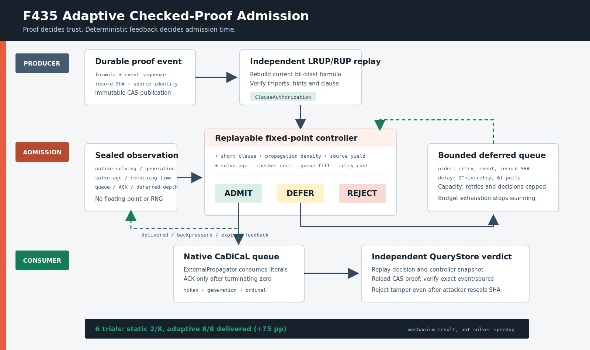

# F435：可回放的自适应 Checked-Proof 准入与背压恢复

- 功能编号：F435
- 日期：2026-08-18
- 研究主题：实时证明流的确定性准入、背压反馈、有界延迟重试、持久 worker 学习与独立裁决
- 当前等级：I/T/E-local；生产路径、故障测试和真实 CaDiCaL 本地压力 oracle 已完成
- 严格边界：没有 native-wire、效用感知的动态 worker 配对或 8/32/128 worker 公开目标 R 级结论



## 1. 问题与研究动机

F433 已能在 CaDiCaL 活动求解期间导入经过 LRUP/RUP 检查的子句，F434 又补齐了多 rank
因果门禁和独立 ACK 裁决；但此前 importer 对每个检查通过的候选只执行一次 `enqueue()`。当
native queue 满、solver 尚未进入 solve 或处于尾段时，候选直接丢失。静态队列容量因此既控制
内存，也意外决定了研究效果；publisher 质量、证明成本、solve 年龄和历史交付率都没有反馈。

分布式 SAT 的 Mallob/Painless 工作说明 worker 协作需要限制通信、动态响应资源和共享质量；
实时分布式 incremental proof checking 则要求外部子句在使用前保持可检查。F435 在现有可信边界
内组合这两条原则：**证明检查决定“能否导入”，自适应控制器只决定“何时尝试导入”**。
控制器不能把未经证明的子句升级为可信事实，也不能决定 SAT/UNSAT 结果。

## 2. 生产执行流程

### 2.1 从 durable event 到候选

每个 persistent CaDiCaL worker 持有一个 `AdaptiveProofController`，连续 solve 共享 source
feedback，但每个 `RealtimeClauseExchangeSession` 有独立 `stream_id` 和决策预算：

1. session 从 formula-scoped proof event stream 按单调 sequence 拉取 record；
2. `IncrementalProofChecker` 从当前 bit-blast plan 递归重放 record/import DAG；
3. checker 产出绑定 record、formula、source、clause、proof steps、propagation count 和检查耗时的
   `ClauseAuthorization`；
4. 规范化 clause 已见则只记 duplicate，不进入控制器；失败证明只记 reject；
5. 对新授权构造 `AdaptiveProofCandidate` 和实时 `AdaptiveProofObservation`；
6. 控制器用整数定点公式输出 `admit/defer/reject`，同时封印完整输入、分量、原因和 SHA-256；
7. `admit` 才调用 native queue；native 返回满时记录 backpressure 并重新进入延迟队列；
8. CaDiCaL ExternalPropagator 完整消费至 clause 终止符后生成 ACK，控制器记录 delivered 和本地延迟；
9. solve 结束或 abort 时，未 ACK admission 记为 expired，控制器必须在下个 stream 前 quiescent；
10. QueryStore 重放决策，再从 CAS 加载 record、重跑 proof 并核对 durable event，才接受结果。

`progress()` 分开暴露 `candidates` 与 `settled_candidates`。前者表示开始处理，后者只在证明失败、
规范化重复、已决策或静态 enqueue 完成后递增；实验门禁使用后者，避免观察线程在最后一个候选尚未
完成时过早启动 solve。

### 2.2 固定点评分

所有分量均为有界整数，不使用浮点、wall-clock 随机性或在线模型：

```text
score = length_quality
      + proof_density
      + 2 * source_delivery_yield
      + 2 * solve_age_bonus
      - checker_cost
      - 2 * source_failure_rate
      - 3 * queue_fill_rate
      - retry_penalty
```

- `length_quality = min(4000, 8000 / literals)`，优先短子句；
- `proof_density = min(2000, propagations * 1000 / max(1, proof_steps))`；
- source yield 使用 `(delivered + 1)/(admit + 2)` 的有界先验，避免新 source 被零样本锁死；
- solve age 在 `age_ramp_ms` 内升至 1000；求解年龄从首次 native `solving=true` 开始，不含预扫描；
- checker、queue 和 retry 均施加惩罚；所有除法是截断整数除法，跨机器可逐位回放。

硬限制先于分数：clause 过长、retry 达上限或初次进入时 deferred queue 已满直接 `reject`。solver
inactive、queue 达高水位、剩余时间过短或低于阈值时 `defer`。其余才 `admit`。当前 CaDiCaL
Learner ABI 不提供可审计 LBD，因此实现明确不伪造 LBD。更重要的是，SAT 2025 对 MallobSat 的
大规模实验显示，传输或打乱单条共享 clause 的 LBD 没有可测收益；后续即使 bridge 暴露 LBD，也只
应作为诊断性遥测，默认策略应优先使用实际 delivery、consumer utilization 和求解贡献。

### 2.3 有界延迟与反馈守恒

deferred record 以 `(retry_count, event_sequence, record_sha256)` 确定性排序；第 `r` 次延期等待
`2^min(r,6)` 个 poll。容量、最大 retry、单 stream 最大决策数、clause 长度和 source 数都有硬上限。
达到决策预算后停止新扫描和 retry，不让 deferred state 无界增长。

每个 `admit` 决策恰好进入三种终态之一：

```text
delivered | native-backpressure | expired
```

反馈由 decision SHA 精确关联且 exactly-once；未知、重复反馈或跨 stream 残留均失败关闭。结果验证要求：

```text
admit decisions == authorized enqueues + native backpressure
delivered records subseteq authorized records
snapshot pending_feedback == 0
current trace ordinals form the final suffix of controller snapshot
```

source 历史跨 solve 保留，使连续 persistent worker 能从实际交付/失败中调整；决策预算则在显式
`begin_stream(stream_id)` 时重置。控制器设计为每个 persistent backend 的串行对象，backend 已由
solve lock 保证不会并发调用同一实例。

## 3. 实现映射

| 文件 | 责任 |
| --- | --- |
| `util/qfbv_adaptive_exchange.py` | policy/candidate/observation、定点评分、controller、sealed decision/snapshot 与独立 replay |
| `util/qfbv_incremental_proof.py` | 将 source worker、epoch、sequence 保留到授权对象 |
| `util/qfbv_realtime_stream.py` | settled/duplicate 计数、defer/retry、native ACK/backpressure/expired 反馈与 session evidence |
| `util/cadical_qfbv_backend.py` | persistent controller 生命周期与 production session 接线 |
| `util/symcc_query_service.py` | `realtime_stream.adaptive` 严格配置、范围检查和显式 opt-in |
| `util/query_store.py` | 决策回放、CAS proof/event/source 二次核验和研究统计 |
| `benchmark/check_qfbv_adaptive_exchange_oracle.py` | 真实 CaDiCaL 静态 drop 与 adaptive retry 同步突发对照 |
| `test/test_qfbv_adaptive_exchange.py` | 固定点随机性质、预算、反馈守恒、snapshot/trace/tamper 合同 |
| `test/test_qfbv_realtime_stream.py` | fake native 并发、abort 恢复、production backend 与 QueryStore 防篡改 |

## 4. 配置与兼容性

该机制默认关闭；只在已有 `realtime_stream` 内加入 `adaptive` 对象：

```json
{
  "realtime_stream": {
    "library": "/path/to/libsymcc_qfbv_cadical_realtime.so",
    "max_imports": 64,
    "adaptive": {
      "high_watermark_permille": 750,
      "min_score": 1500,
      "max_deferred": 128,
      "max_retries": 4,
      "max_decisions": 4096,
      "max_clause_literals": 32,
      "checker_reference_us": 1000,
      "age_ramp_ms": 100,
      "minimum_remaining_ms": 2
    }
  }
}
```

queue capacity 直接继承 `realtime_stream.max_imports`，不能在 nested policy 中伪造不同容量。未知键、
布尔冒充整数、越界和 `max_retries=0` 均在服务启动时拒绝。省略 `adaptive` 时保持 F433/F434 的
一次性 enqueue 行为，现有 capability/结果路径不被悄然改变。

## 5. 真实实验与可解释结论

实验使用真实 CaDiCaL 3.0.1 realtime shim、同一随机 200-variable/860-clause bit-blast plan、8 条
经 checker 重放且规范化互异的 base clauses，native queue capacity 为 2。两个模式都先完成
8/8 settled prescan，再启动同一类 native solve：

| 模式 | published / settled / duplicate | delivered | backpressure | defer / retry | delivery gain |
| --- | ---: | ---: | ---: | ---: | ---: |
| 静态一次 enqueue | 8 / 8 / 0 | 2 | 6 | 0 / 0 | 基线 |
| 自适应延迟重试 | 8 / 8 / 0 | 8 | 0 | 8 / 8 | **+6** |

独立进程重复 6 次，六次均得到相同计数：静态 `2 delivered + 6 backpressure`，adaptive
`8 delivered + 0 backpressure`，即在这个**刻意构造的同步突发压力机制实验**中交付率由
25% 提升到 100%，绝对增加 75 percentage points，交付数量为 4.0x。每轮 artifact SHA 不同且
通过 sealed verifier。

这不是 solver speedup：实验顺序未随机化，solve wall time 不作为效果指标；也没有测 fuzzing
coverage、缺陷发现、真实网络或多节点扩展。数据只证明在 queue-capacity 小于同步 burst 的条件下，
F435 能通过有界延期恢复 F433 的一次性背压丢失，并保持 proof/ACK/QueryStore 验证链闭合。

## 6. 测试与多轮 review

专项回归为 **31 passed**，包含：

- 256 个随机 candidate/observation 的确定性决策回放与最终反馈守恒；
- queue、deferred、retry、decision、clause 和 source 硬边界；
- exactly-once delivery/backpressure/expired，未知或重复 feedback 拒绝；
- inactive-to-active retry、pending abort 后新 stream 复用、budget exhaustion；
- decision、score、enqueue mapping、snapshot suffix 和 oracle artifact 篡改；
- 即使攻击性地重算 decision SHA，错误 durable event 仍被 QueryStore 的独立 proof-store replay 拒绝。

完整 capability-closed Python 门禁为 **1,267 passed + 291 passed subtests**，规范 node-ID
`1267/1267` 精确相等且零 skip、xfail、deselection、collection error；LLVM 17/18 各发现
**325** 项，分别 `323 passed + 2 expected unsupported` 与
`324 passed + 1 expected unsupported`，零 FAIL/UNRESOLVED。

review 中修复了候选开始计数造成实验竞态；不同 literal 顺序的规范化重复进入样本；
预扫描时间误计为 solve age；abort 清理 controller 后 session pending 未清导致二次反馈。最终 oracle
和全量门禁制品见证据目录。最后一轮又关闭了两个边界问题：策略/身份字段不再接受浮点、数字字符串
或空值等隐式类型转换；`settled_candidates` 与 `duplicate_clauses` 必须成对通过范围校验并原样持久化。

## 7. 与 SOTA 的关系和剩余工作

F435 借鉴而不宣称完整复现以下工作：

- [Mallob: Scalable Job Scheduling for Parallel SAT Solving](https://arxiv.org/abs/2205.06590)：动态资源和分布式求解管理；
- [Painless: A Framework for Parallel SAT Solving](https://www.lrde.epita.fr/dload/papers/le-frioux.17.sat.pdf)：模块化 worker 与 clause sharing；
- [Streamlining Distributed SAT Solver Design](https://drops.dagstuhl.de/entities/document/10.4230/LIPIcs.SAT.2025.27)：分布式 clause-sharing 系统化简；
- [Real-time Proof Checking for Distributed Incremental SAT Solving](https://satres.kikit.kit.edu/papers/2026-tacas-distrincproof.pdf)：使用前实时检查外部子句。

当前仍未实现：ImpCheck/PalRUP 原生协议/制品互操作；由 native 导出的 clause utilization/activity；
proof-aware publisher-consumer 配对；Mallob 式可塑 worker 分配与运行中重调度；WAN durable cursor/partition
recovery；8/32/128 worker 公开目标等 CPU R 级效果实验；机器检查的 LRUP trusted core。F435 是
这些工作的可审计 admission/feedback 基础，不是其完成声明。

复现命令、六次原始输出、测试日志、源码清单和 SHA-256 manifest 位于
[`../evidence/f435-adaptive-proof-admission-2026-08-18/`](../evidence/f435-adaptive-proof-admission-2026-08-18/README.md)。
