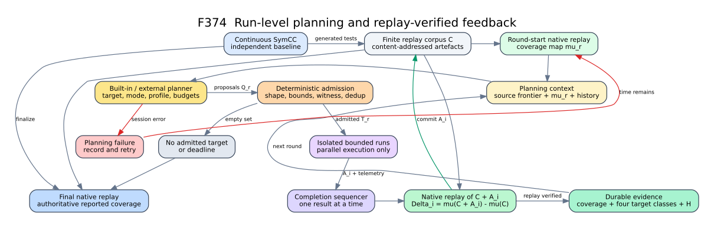

# F374：Agolic 式跨运行有界符号执行规划

- 日期：2026-08-12
- 实现入口：`util/agolic_planning.py`
- 测试入口：`test/test_agolic_planning.py`
- 成熟度：I/T/E-mechanism；尚无公开 benchmark 性能结论
- 研究来源：[Agolic: Agentic Planning for Symbolic Execution](https://arxiv.org/html/2608.06397)，arXiv v1，2026-07-31

## 1. 问题与技术定位

现有 agentic concolic hook 以单个 seed/trace 为决策单位，能够选择 target branch、字节焦点、
S2F action 和求解画像，但它不回答另一个更高层的问题：一次受限符号执行已经饱和后，下一次
独立运行应该以什么目标、入口、输入面和资源预算重新开始。F374 将控制单位提升为一次 bounded
symbolic execution（BSE）运行，在 BSE 之间积累可回放证据；单次运行内部仍由原有 SymCC、
Prefix DAG、S2F 和 solver portfolio 控制，不让上层 planner 改写实时状态搜索。

Agolic 论文报告其 KLEE 实现在 7 个 C/C++ 程序上相对 continuous symbolic execution 均增加
branch coverage，平均分支数超过 3 倍。该结果是论文系统的实验结果，不是本项目当前实测结果；
F374 只声称实现了可复用的运行级规划、准入、持久化和回放证据闭环。

## 2. 执行流程与严格次序

1. 启动一个独立 continuous SymCC baseline；它持续向有限语料库 `C` 提交生成物。
2. 每轮开始调用 `ReplayCoverage(C)`，通过目标程序原生执行得到累计 coverage map `mu_r`。
3. 规划器读取程序身份、覆盖前沿、最近历史、pending plan 和可用 profile，生成候选规格 `Q_r`。
4. deterministic admission 校验目标、模式、profile、witness、环境、符号输入面、时间/内存上界，
   并拒绝已经 issued 或 completed 的精确运行规格。
5. admitted plan 可交给多个隔离 worker 并行执行；worker callback 必须执行 plan 中的时间和内存限制。
6. worker 可以并行结束，但结果按完成顺序串行进入 `ReplayAndRecord`。对第 `i` 个结果，只把其生成物
   `A_i` 加入当时语料，原生回放 `C union A_i`，再计算 `Delta_i = mu(C union A_i) - mu(C)`。
7. 只有 replay-verified 覆盖可以推进累计 coverage；未回放、回放失败或声明与回放不一致的结果均不计覆盖。
8. planner session 失败会记录并在预算允许时重试；一次成功 session 没有 admitted target 时停止规划循环。
9. 停止 continuous run 后执行最终原生回放；最终回放覆盖才是报告结论的权威来源。

`AgolicRoundController` 刻意把 `execute_run` 与 `replay_run` 分成两个回调。前者可以并发，后者由
controller 串行调用，因此两个同时完成的 worker 不会对同一覆盖增量重复记账。

## 3. 核心数据模型

### 3.1 CoverageSnapshot

累计证据包括 source coverage elements、stable branch IDs、entered functions、语料 artifact SHA-256
及 `replay_identity`。集合在准入时去重并排序，使重启前后的 JSON 表示稳定。相同
`replay_identity` 必须对应完全相同的规范 coverage；identity 被复用于不同内容时立即失败关闭。

### 3.2 TargetCandidate 与 Witness

目标由 `target_id`、stable branch、source file、function、line、distance 和 coverage opportunity
组成。可执行模式为：

- `harness-entry`：从 harness 输入开始普通有界执行；
- `witness-guided`：规格必须携带经过 review 的 witness SHA-256、路径和 release function 或
  release branch。

F374 的 planner/controller 支持这两种模式的协议和准入。论文的具体实现是在 KLEE 中以单状态
执行 concrete prefix，到 release function 后恢复普通在线 fork/search。当前 SymCC 是 trace-based
concolic 引擎；其 executor callback 可用 witness 作为 concrete seed，并在 release branch 后应用
target/S2F 求解动作，但这不是 KLEE 在线状态 release 的逐指令等价实现。底层在线 release 能力仍归入
后续 live-state search 工作，本文不把协议支持写成底层能力已经等价完成。

### 3.3 RunPlan

可执行 fingerprint 只覆盖影响执行的字段：目标位置、模式、profile、时间/内存预算、witness、环境
和 symbolic input surface。distance、opportunity、rationale 只影响选择和解释，不污染精确去重。
`plan_id = SHA256(round, fingerprint)`；同 fingerprint 即使出现在不同轮次也不得再次派发。

### 3.4 Outcome 与四类证据

| 证据类 | replay 判定 |
| --- | --- |
| `new-reach` | 本次 replay 进入目标函数，先前累计语料未进入该函数 |
| `increased-target-coverage` | 先前已进入目标函数，本次增加该函数内目标 coverage element |
| `reached-no-gain` | replay 进入目标函数，但没有增加目标函数内 coverage |
| `not-reached` | replay function coverage 未包含目标函数 |
| `unverified` | 没有有效 concrete replay；不产生任何 coverage delta |

`target_reached` 不信任 worker 自报，而是由 replayed function set 推导；若 worker 同时提交声明且
与回放不一致，整个 outcome 被拒绝并保持 plan pending。

## 4. 规划与反馈策略

内置 planner 对未覆盖目标按以下信息排序：静态距离倒数、显式 coverage opportunity、witness
可用性、历史尝试多样性、已有 reach/gain 证据。首次优先 harness-entry；若同一目标此前完全未到达且
存在 witness，则转入 witness-guided，并轮换 reviewed witness。profile 优先选择该目标尚未使用过的
配置。外部 LLM/agent proposal 不直接成为命令，而是经过同一个 deterministic admission boundary。

这是一条可审计 baseline policy，不宣称复现论文中的具体 LLM 推理质量。planner-facing source/context
工具可继续由现有 agentic backend 提供；F374 保证即使 proposal 来源不可信，真正执行的字段仍被
确定性 schema、预算和 frontier 约束。

## 5. 持久化、恢复与资源边界

- 状态绑定 `experiment_id + program_id + program_sha256`，防止跨二进制复用历史。
- JSON 使用 duplicate-member 与 non-finite-number 拒绝、64 MiB 总上界及 aggregate text budget。
- state 读取使用 `O_NOFOLLOW`、regular-file 检查和读前/读后 inode/size/time identity 闭合。
- 写入使用同目录 exclusive temporary、完整 write、file `fsync`、atomic replace 和 directory `fsync`。
- 内存状态只在 durable write 成功后替换；写失败时 pending/history/coverage 保持原样。
- history 不截断。达到配置容量时停止产生新 plan，要求归档并开始新 experiment；否则删除旧
  fingerprint 会破坏“精确规格永不重复”的不变量。
- 单 planner coordinator 是 state file 的唯一 writer；并行度位于 admitted BSE worker 层。
- targets、proposals、coverage elements、artifacts、environment、symbolic inputs、时间和内存均有硬上界。

## 6. 深度 review 发现与修复

首版完成后进行了两轮反例驱动审查，修复了以下实质错误：

1. **历史截断破坏去重**：原实现保留最近 history，旧 fingerprint 会再次被派发。改为容量耗尽时 fail-closed。
2. **并行结果覆盖重复归因**：原 controller 允许 worker 返回各自 snapshot。改为 execution 并行、replay 串行，
   每个 `A_i` 相对完成时的当前 `C` 计算增量。
3. **witness-only 模式选择错误**：目标不支持 harness 时仍选择 harness。现按 executable modes 选择。
4. **`unverified` 被统计为 reach**：历史统计原先把除 `not-reached` 外全部当 reach，现仅三种 reached class 计数。
5. **恢复校验不完整**：旧状态只核对 fingerprint，未证明 target/spec/profile/witness 一致。现采用精确字段集、
   规范重建、round 单调、plan/fingerprint 唯一和 outcome 内部一致性校验。
6. **累计语料误记为单次产物**：现分离 `corpus_artifacts` 与 `generated_artifacts`，历史只保存 `A_i`。
7. **非整数预算被截断**：`1.5` 曾可被 `int()` 转为 `1`，现拒绝非整数 float 和 bool。
8. **replay identity 可复用到不同内容**：现将 identity 作为内容承诺，相同 identity 内容不同时失败关闭。
9. **同一 replay 缺少累计基线**：verified outcome 必须包含入账前全部 coverage 和 corpus artifact。
10. **未知执行字段静默忽略**：proposal/outcome 的未知字段现在拒绝，避免拼写错误悄悄降级。

## 7. 验证结果

2026-08-12 定向验证：

| 门禁 | 结果 |
| --- | --- |
| `ruff`，实现与测试 | 通过，0 diagnostics |
| `py_compile` | 通过 |
| `pytest test/test_agolic_planning.py` | 10 passed，0 skipped，0 failed，0.12 s |
| 完整 capability-closed Python gate | 816 passed + 178 subtests，0 skip/xfail/deselect，118.66 s |
| 规范 pytest identity | 816 node IDs，missing/unexpected 均为 0 |

测试覆盖 pending-plan 重启恢复、exact-spec 去重、四类 replay 证据、累计覆盖单调性、target reach
交叉验证、witness-only 与失败后模式切换、未知字段/未 review witness 拒绝、history 容量失败关闭、
原子写故障注入、symlink/duplicate JSON/实验身份拒绝、replay identity 内容承诺，以及两个 worker
并行执行后按完成顺序逐个 replay。当前环境未安装 `coverage.py`，因此未报告 line/branch coverage
百分比；不能把这 10 项机制测试解释为 branch coverage 提升。
本项没有修改 LLVM pass/runtime，因而没有用 Python 回归替代 LLVM 构建或 lit 结论。

## 8. 尚未完成与下一步

F374 已闭合运行级 planning/admission/replay/persistence 机制。仍需后续项目分别完成：

- 将在线 symbolic-state search 与可恢复 live state 接到底层 executor，才能提供与 KLEE witness-release
  更接近的单状态 concrete prefix / release 后 ordinary exploration；
- 在公开 benchmark 上进行固定预算、多随机重复、continuous baseline 与 planner ablation 比较，报告
  replay-derived branch identity、AUC、资源消耗和置信区间；
- 对外部 LLM planner 做 verifier-in-the-loop 和 provenance 评估，而不是用单次 agent 成功案例代替统计结论。
