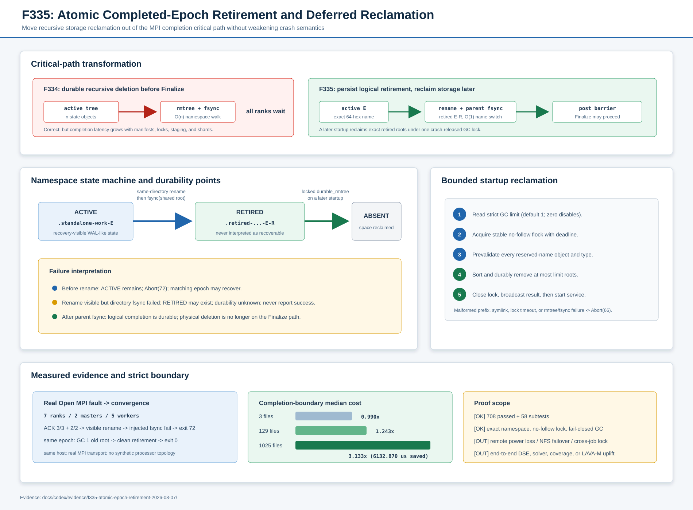

# F335：完成 Epoch 原子退役与延迟回收

> 功能编号：`F335`  
> 日期：2026-08-07  
> 成熟度：I/T/E-mechanism（实现、自动化测试、真实同机 MPI 故障注入、分层机制基准）

> 后续加固：F336 已用 Linux `renameat2(RENAME_NOREPLACE)` 和真实挂载点启动资格替代本报告中的
> `lexists + os.replace` 完成路径。本文保留 F335 当时的设计与实验快照；当前 no-clobber 语义以
> [`F336 报告`](Kernel_Enforced_No_Clobber_Epoch_Retirement_F336_2026-08-07.md) 为准。F337 又把本报告
> 只约束根数量的启动 GC 升级为 root/entry/cooperative-time 三预算可恢复删除；当前物理回收语义以
> [`F337 报告`](Resumable_Budgeted_Retired_Tree_GC_F337_2026-08-07.md) 为准。

## 1. 研究问题

F334 把 standalone 作业的成功退出绑定到 worker ACK、全局静止、完成态递归删除、父目录 fsync 和
post-cleanup barrier，修复了静默 `rmtree(ignore_errors=True)`。正确性得到保证后，新的性能问题变得
清晰：完成关键路径仍执行 O(n) 目录遍历和 inode 回收，`n` 是 work-state 内的 manifest、lease lock、
staging 和 shard record 数量。状态越丰富，所有 MPI rank 在 Finalize 前等待越久。

F335 的目标不是消除空间回收，而是分离两个不同的语义事件：

1. **逻辑完成**：active epoch 名称必须不可见且其消失已经持久确认；
2. **物理回收**：退役树占用的目录项、inode 和数据块最终被释放。

因此新的成功条件为：

\[
exit\_0 \Rightarrow ACK_{all} \land quiescent_{all} \land
\neg exists(active_E) \land fsync(sharedRoot) \land postBarrier_{all}
\]

它不要求在 `exit_0` 前完成 `reclaim(retired_E)`，但要求 retained namespace 不再被恢复器解释为 active
WAL-like 状态。

## 2. 原理依据与设计选择

### 2.1 名称切换是提交点

[POSIX.1-2024 `rename`](https://pubs.opengroup.org/onlinepubs/9799919799/functions/rename.html)
规定 rename 的文件层次效果是原子的；Linux `rename(2)` 也说明替换目标名时不存在目标名暂时缺失的
窗口，并明确跨挂载点返回 `EXDEV`。F335 始终在同一个 shared root 内完成：

```text
.standalone-work-<epoch>
    -> .retired-standalone-work-<epoch>-<128-bit retirement id>
```

这使 active 名称切换不随树内文件数量增长。128-bit id 隔离固定 epoch 的多次独立完成，调用前用
`lexists` 检测已经存在的目标；源对象还必须由 `lstat` 证明是真实目录，而不是同名符号链接。这里的
检查不是 `renameat2(RENAME_NOREPLACE)`：它不证明检查与 rename 之间不存在不遵守协议的外部创建者。
当前正确性边界依赖 128-bit 随机名称和合作进程遵守 reserved namespace，不能表述为对抗性
no-clobber 保证。

### 2.2 原子可见不等于崩溃持久

[Linux `fsync(2)`](https://man7.org/linux/man-pages/man2/fsync.2.html) 明确指出，对文件执行 fsync 不保证
父目录中的目录项已到达持久存储，必须显式同步目录。因此 F335 复用 `durable_replace`，执行同目录
rename 后同步 shared root。父目录 fsync 成功才是 retirement 的持久线性化点。

Linux 手册还指出，NFS server 可能已完成 rename，但 server crash 后的重传 RPC 返回失败。F335
不把错误返回解释为“肯定未改名”：任何 rename/fsync 异常均触发 `Abort(72)`；active 和 retired 的
实际可见组合留给下次启动的严格扫描收敛，不虚构原子回滚。

### 2.3 提交与垃圾回收解耦

[SQLite Atomic Commit](https://www.sqlite.org/atomiccommit.html) 把 journal 名称/存在性作为事务热状态，
并在提交点之后把 rollback journal 删除视为时序不再关键的清理。F335 借鉴的是这一系统原则，而非
SQLite 的数据库页协议：先持久改变恢复器识别的 active 名称，再延后物理清理。

该方法是面向并行符号执行状态树的系统实现创新，不应表述为新的求解算法，也不等价于已经证明 DSE
coverage 或 solver throughput 提升。

## 3. 协议总览



### 3.1 完成关键路径

1. workers 完成 generation-fenced `STOP -> exact ACK`；
2. masters 完成结果 drain、lease heartbeat、stats exchange 和 cleanup rendezvous；
3. 所有 rank 通过 bounded pre-cleanup barrier；
4. rank 0 验证 active 路径是 shared root 的直属真实目录，名称精确匹配
   `.standalone-work-<64 位小写十六进制>`；
5. 对显式 output，生成 128-bit retirement id，把 active 目录同目录改名到严格 retired namespace；
6. `durable_replace` 对 shared root 执行目录 fsync；
7. root 加入 post-cleanup barrier，全部 rank 通过后才进入 `MPI_Finalize`。

未指定 `-o` 时，shared root 是本进程创建的临时目录。此时仍按 F334 先持久删除 active tree，再删除
整个临时 root；保留一个无人管理的 `/tmp` retired tree 没有收益。

### 3.2 后续启动回收

对于持久 output，rank 0 在进入 service 前执行：

```text
read SYMCC_RETIRED_WORK_STATE_GC_LIMIT (default 1)
acquire .symcc-retired-work-state-gc.lock with bounded flock + O_NOFOLLOW
scan every direct child and prevalidate the complete reserved namespace
sort exact retired roots
durable_rmtree(first limit roots)
release lock by close
broadcast success/failure to every rank
```

先全量预验证、后进行任何删除，可避免“先删一个合法根，再遇到畸形 reserved object 才报错”的部分
副作用。普通 corpus 目录完全不进入候选集；以 reserved prefix 开头但格式错误、符号链接或非目录对象
会使启动以 `Abort(66)` 失败关闭。

稳定 lock 文件不会 unlink，避免旧 holder 锁住已 unlink inode、而新 opener 锁住另一个 inode的双锁
问题。锁由 descriptor/进程生命周期自动释放；如果平台没有 `O_NOFOLLOW`，不退化为跟随符号链接，
而是明确拒绝。

## 4. 命名空间与状态机

| 状态 | 名称 | 恢复解释 |
| --- | --- | --- |
| Active | `.standalone-work-<epoch>` | 中断任务，可恢复 WAL-like state |
| Retired | `.retired-standalone-work-<epoch>-<32 hex>` | 已逻辑完成，只允许 GC，不得恢复 |
| Absent | 无上述名称 | 没有该次任务的本地工作状态 |
| Invalid reserved object | retired prefix 但 schema/type 不匹配 | 启动失败关闭，不删除任何候选 |

允许的状态转换只有：

```text
Active -- rename + parent fsync --> Retired -- locked durable_rmtree --> Absent
```

GC 不能把对象从 Retired 改回 Active。固定 epoch 的下一次运行会创建新的 active tree，并在完成时获得
新的 retirement id，因此旧、新完成实例不会占用同一目标名称。

## 5. 故障语义

| 故障位置 | 可能可见状态 | 退出 | 后续处理 |
| --- | --- | ---: | --- |
| pre-cleanup 前 | Active | 70/71 | 原 epoch 恢复 |
| 路径身份不合法 | 非预期对象保持不变 | 72 | 人工纠正调用/命名空间 |
| rename 前失败 | Active | 72 | 原 epoch 恢复 |
| rename 已发生、父目录 fsync 失败 | Retired 可见，持久性未知 | 72 | 下次严格扫描/GC；不报告成功 |
| retirement 成功、post barrier 超时 | Retired 已持久 | 73 | 逻辑状态完成，MPI 生命周期失败 |
| GC lock 超时或 reserved object 畸形 | Retired 保持 | 66 | 启动前失败关闭 |
| GC rmtree/fsync 中途失败 | Retired 可能部分回收 | 66 | 下次在同一稳定锁下重试 |
| 所有完成步骤成功 | Active 不存在，Retired 持久或已被并发 GC 删除 | 0 | 物理回收可延后 |

即使另一个协作 GC 在 retirement 的 fsync 前删除新 retired 根，成功条件仍成立：GC 自己同步了 shared
root，active 已不存在；retirement 随后的 shared-root fsync 再次确认该名称状态。未使用相同锁的外部
进程仍不在协议证明内。

## 6. 正确性不变量

### I1：active 和 retired 身份互不混淆

active 必须是 64 位小写十六进制 epoch；retired 必须再带 32 位小写十六进制 retirement id。两种
parser 独立，reserved prefix 的畸形对象不能被静默忽略。

### I2：符号链接永不作为状态树或锁接受

active/retired 使用 `lstat`/`is_dir(follow_symlinks=False)`；GC lock 使用 `O_NOFOLLOW` 和 `fstat`
regular-file 检查。测试验证外部 target 内容保持不变。

### I3：Finalize 仍依赖持久逻辑完成

F335 没有绕过 F334 的两个 barrier。rename 只是替换中间的完成动作，parent fsync 和 post-cleanup
barrier 仍在 `MPI_Finalize` 之前。

### I4：回收并发受单一稳定锁串行化

所有协作进程使用 shared root 下同一个 `.symcc-retired-work-state-gc.lock`。内核锁随 descriptor close、
异常或进程退出释放，不依赖墙钟偷锁。

### I5：回收策略有显式上限和诚实边界

`limit=0` 禁用自动回收；默认 1。该上限只约束一次启动选择的 retired 根数量，不约束一棵树内部的
文件数、`rmtree` 系统调用数或远端存储响应时间。

## 7. 实现范围

| 模块 | 实现 |
| --- | --- |
| `util/distributed_state.py` | 导出 bounded crash-released advisory lock；`O_NOFOLLOW` 缺失时失败关闭 |
| `util/mpi_concolic_execution.py` | active/retired parser、128-bit 退役名称、持久 rename、locked startup GC、Abort(66/72) 接线 |
| `test/test_distributed_state.py` | no-follow 不可用和 symlink lock 反例 |
| `test/test_mpi_lifecycle.py` | 退役内容、owned root、身份反例、GC 上限/预验证、post-rename 不确定性与严格配置 |
| `docs/Configuration.txt` | 新配置、执行顺序、退出码、空间/时延边界 |

新增配置：`SYMCC_RETIRED_WORK_STATE_GC_LIMIT=0..1000000`，默认 1。

## 8. 自动化验证

| 层级 | 当前结果 |
| --- | ---: |
| distributed/lifecycle/filesystem 定向 | 195 passed + 30 subtests，15.74 s |
| MPI/distributed/hybrid 六模块关联 | 312 passed + 38 subtests，16.62 s |
| 完整 warnings-as-errors Python | 708 passed + 58 subtests，96.23 s |

新增测试重点包括：

- persistent output 退役后 active 消失、retired 内 `state` bytes 不变、完成路径不调用 rmtree；
- owned temporary root 仍完整删除；
- active symlink、普通目录、短/大写 epoch 全部拒绝；
- reserved malformed name 和 retired symlink 在删除任何合法候选前阻断；
- `limit=0/1/10` 的精确选择；
- rename 已可见后注入 fsync 异常，调用失败但 retired 内容可由下次 GC 回收；
- `O_NOFOLLOW` 不可用或锁路径是 symlink 时不获取锁；
- 非整数、负数和越界 GC limit 均失败关闭。

## 9. 真实 Open MPI 故障恢复

实验使用真实 `mpirun`/mpi4py transport：7 ranks、2 masters、5 workers、同一物理主机，未覆盖
processor identity，因此 `synthetic_topology=false`、`actual_multi_host=false`。

测试 wrapper 只在 rank 0 的完成态 rename 上执行真实 `os.replace`，随后在父目录 fsync 前抛出
`OSError`：

| 阶段 | 结果 |
| --- | ---: |
| 故障运行 worker ACK | 3/3 + 2/2，早于 failure marker |
| 故障运行退出 | 72，3.623895 s |
| active / retired | false / 1 |
| retired 内容 | `state.json` + fenced record + lock |
| 相同 epoch 重启启动 GC | reclaimed 1 |
| 恢复运行 worker ACK | 3/3 + 2/2 |
| 恢复运行退出 | 0，3.732016 s |
| active / 新 retired | false / 1，retirement id 与旧值不同 |
| corpus seed | SHA-256 与 bytes 均完整 |

该实验验证生产接线和可见状态收敛，不是实际断电、设备写回错误或 NFS server failover 实验。

## 10. 分层机制成本

本机 Linux overlayfs，每层 5 次 warm-up、30 组交错样本。树构造和 deferred GC 均在计时区外：

| 状态树 | durable rmtree 中位 / p95 | durable retirement 中位 / p95 | 中位节省 | 比率 |
| ---: | ---: | ---: | ---: | ---: |
| 3 files | 2593.562 / 2721.449 us | 2620.398 / 2661.560 us | -26.836 us | 0.990x |
| 129 files | 3280.479 / 3865.488 us | 2638.741 / 2732.876 us | 641.739 us | 1.243x |
| 1025 files | 9008.331 / 10274.199 us | 2875.461 / 3827.281 us | 6132.870 us | 3.133x |

结果符合复杂度预期：小树上 rename/fsync 没有优势，甚至略慢；递归删除随文件数增长，名称退役保持在
约 2.6--2.9 ms。3.133x 只表示 1025 文件本机完成边界，不是 end-to-end DSE throughput。下一次
启动的 GC 最终仍要支付回收 I/O；F335 的收益是缩短当前 MPI 作业的 collective critical path，允许
存储回收与后续生命周期分离。

## 11. 局限与后续研究

1. 当前真实 MPI 是同机实验；跨主机共享存储和跨作业 GC lock 仍需部署级证据；
2. `limit` 不提供 wall-clock deadline，单个超大树仍可能拖慢下一次启动；
3. 本实现没有后台线程或脱离 MPI 生命周期的 orphan reaper，避免引入不可追踪子进程；
4. 长期没有后续启动时会保留最后的 retired tree，需要运维调用下一次启动或专用维护工具；
5. adversarial 外部进程不遵守 lock/namespace 协议时，不在当前正确性证明内；完成路径的
   `lexists + os.replace` 也不是内核级 no-clobber 原语；
6. 尚未测真实 campaign 总耗时、DSE throughput、coverage、solver 或 LAVA-M 提升；
7. 下一阶段可研究增量目录 GC、独立有界 maintenance mode、真实 NFS/并行文件系统 crash matrix，
   以及把退役 backlog 纳入调度/遥测。

## 12. 证据索引

- 生产代码：`util/distributed_state.py`、`util/mpi_concolic_execution.py`
- 测试：`test/test_distributed_state.py`、`test/test_mpi_lifecycle.py`
- 原始证据：`docs/codex/evidence/f335-atomic-epoch-retirement-2026-08-07/`
- 机制图：`docs/codex/diagrams/atomic-completed-epoch-retirement-2026-08-07.svg`
- 配置语义：`docs/Configuration.txt`
