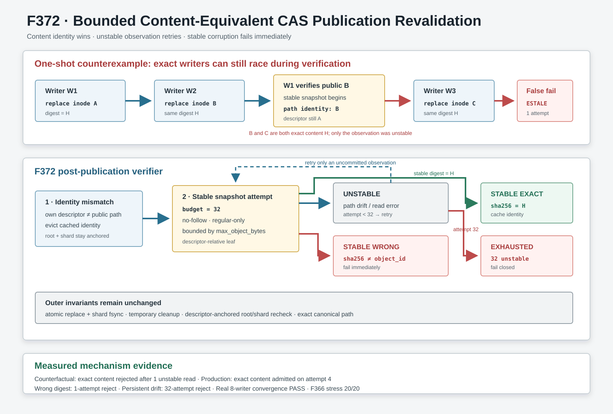

# F372：Bounded Content-Equivalent CAS Publication Revalidation

## 摘要

F366把Query artifact接入descriptor-anchored content-addressed store，并允许多个writer以相同SHA-256身份并发
收敛。F371交付校验器重放F366真实8-writer证据时发现一个低概率假失败：writer完成`durable_replace()`后，若
另一个同内容writer恰好再次替换public leaf，descriptor identity与path identity不同；旧fallback只做一次stable
snapshot。如果第三个替换又落在这次snapshot窗口内，它会把可安全收敛的精确内容误判为`ESTALE`。

F372把publication后的内容等价复核拆成一个专用、有界状态机：路径身份/OSError/ValueError表示“本次没有取得
稳定快照”，最多重试32次；取得稳定快照但SHA-256不是目标object ID时立即拒绝；取得精确digest时接纳当前public
inode；32次仍不稳定则失败关闭。外层descriptor-anchored root/shard身份复核、atomic replace、fsync和temporary
cleanup保持不变。



## 1. 发现过程与反例

### 1.1 原有并发收敛协议

`ContentAddressedInputStore.put(content, object_id)`原有关键步骤是：

1. 验证`SHA-256(content) == object_id`；
2. 在descriptor-anchored shard内创建唯一temporary leaf；
3. 写完全部字节、flush并fsync，记录temporary descriptor identity；
4. 以`durable_replace()`将temporary原子发布到规范public leaf并fsync shard；
5. 比较仍打开的descriptor identity与public path identity；
6. 若被同摘要竞争writer替换，则从public leaf重新验证内容；
7. 外层上下文再次验证CAS root和shard directory身份。

步骤6允许同内容、不同inode的writer收敛，而不是要求“最后public inode必须是本writer的inode”。这是内容寻址存储
正确的等价关系。

### 1.2 一次复核为什么不够

8个writer共享同一object ID时可能出现：

```text
W1 replace inode A → public
W2 replace inode B → public
W1 detects path != A and starts stable snapshot of B
W3 replace inode C → public during W1 snapshot
W1 snapshot rejects B/C identity drift → one-shot fallback returns None → ESTALE
```

B和C内容都严格等于object ID，最终namespace也是合法的，但W1错误失败。F366 driver在全局交付复核中真实触发该
窗口；修复前单独运行再次得到同一`input object changed during publication`错误，证明不是校验器或文件缺失误报。

## 2. 设计

### 2.1 专用publication复核

新增`_verified_object_after_publication()`，只用于writer已经完成atomic replace但发现path inode不是自身inode的
路径。每次尝试执行：

1. descriptor-relative、`follow_symlinks=False`地`stat`规范leaf；
2. 非regular对象立即返回失败；
3. 在同一shard descriptor下执行有界`stable_regular_file_snapshot()`；
4. 若snapshot因路径身份漂移、读取异常或语义边界失败，消耗一次预算后重试；
5. 若取得稳定snapshot但digest错误，立即返回失败，不重试稳定错误内容；
6. 若digest精确相等，返回该snapshot identity并进入verified identity cache；
7. 32次均未取得稳定snapshot则返回失败，由`put()`抛出`ESTALE`。

### 2.2 为什么只重试不稳定，而不重试错误内容

CAS身份是内容摘要。路径在读取中发生变化时，本次观察没有形成一个稳定对象，无法判断最终内容，重试是安全的。
一旦一个稳定regular snapshot的digest不等于object ID，系统已经获得完整反证；继续等待它被别人“修好”会把明确
损坏转化成不确定成功，因此立即失败关闭。

### 2.3 有界性

常量`_INPUT_STORE_PUBLICATION_VERIFY_ATTEMPTS = 32`限制单次`put()`的额外读取工作。该数值不是无限活锁保证，
而是竞争容忍预算：正常有限writer群最终静止并收敛；持续替换或异常文件系统在预算耗尽后仍失败。每次snapshot还
受`max_object_bytes`约束，因此重试次数和单次读取量都有硬上界。

## 3. 不变量

| 编号 | 不变量 | 实现 |
| --- | --- | --- |
| C1 | 只有目标digest可进入verified cache | stable snapshot后精确SHA-256比较 |
| C2 | 稳定错误内容不被等待式“修复” | digest mismatch立即返回失败 |
| C3 | 同digest不同inode可并发收敛 | path/descriptor不等时验证public内容 |
| C4 | 瞬态path drift不会被单次观察误判 | OSError/ValueError最多32次重试 |
| C5 | 持续漂移不能造成无限循环 | 固定attempt budget，耗尽后ESTALE |
| C6 | symlink/FIFO不因重试获得准入 | no-follow stat且regular-only |
| C7 | root/shard替换仍被拒绝 | `_object_directory()`退出时复核目录身份 |
| C8 | 失败不留下temporary leaf或cache身份 | 原finally cleanup与cache eviction保持 |

## 4. 可执行证据

### 4.1 确定性反事实

driver只把新增复核方法替换回旧的一次性调用，并注入一次精确内容competitor：第一次stable snapshot收到模拟
`ESTALE`。旧路径只尝试1次并错误拒绝精确内容；production前三次观察模拟路径漂移，第4次取得稳定精确snapshot
并成功。

### 4.2 负路径

- competitor发布稳定错误内容时，production只hash 1次就拒绝；
- 每次snapshot都模拟身份漂移时，production精确尝试32次后拒绝；
- 两类失败都不写verified identity。

### 4.3 真实并发

driver使用两个独立store实例和`ThreadPoolExecutor(max_workers=8)`，barrier同时释放8个同内容publisher。8个
调用全部返回相同`(object_id, canonical_path)`，最终字节精确且temporary files为0。另对既有F366完整driver执行
20轮，每轮都包含真实8-writer并发，20/20与历史归档JSON逐字节一致。

确定性F372 driver连续两遍字节一致，SHA-256为
`c249b6ac505516c1634a07204dba0b182981e535d9b20ecefb349d340bc8859e`。

## 5. 回归结果

| 验证层 | 实测结果 |
| --- | --- |
| F372反事实/production driver | PASS，连续两遍JSON字节一致 |
| 定向CAS race identity | 1 passed，0.21 s |
| distributed state + QueryStore关联 | 183 passed + 30 subtests，24.92 s |
| F366真实8-writer stress | 20/20 driver，历史JSON 20/20字节一致 |
| 规范pytest身份 | expected=observed=787，digest不变 |
| 完整16-capability门禁 | 787 passed + 137 subtests，121.54 s |

## 6. 先进性、挑战性与代价

### 6.1 内容身份优先于inode所有权

CAS并发writer的正确成功条件不是“我发布的inode仍在路径上”，而是“当前稳定public对象具有承诺digest”。F372
保留descriptor/inode检查用于发现竞态，再用内容证明决定可接受的等价收敛。这比简单锁住全shard保留更多并行性，
也不牺牲内容身份。

### 6.2 三值观察而不是二值折叠

旧逻辑把stable exact、stable wrong和unstable observation压成成功/失败。F372实际区分：

- `exact`：接纳；
- `wrong`：立即拒绝；
- `unstable`：预算内重试，预算外拒绝。

挑战在于不能让容错重试掩盖稳定损坏，也不能让一次合理的path drift破坏同内容writer收敛。

### 6.3 成本边界

无竞争fast path完全不进入新循环；自己的descriptor仍对应public path时不增加hash。只有publication identity发生
变化才重验证，最坏读取工作为32倍`max_object_bytes`。本轮没有测量竞争概率、额外I/O、fsync latency或高并发
吞吐，不能宣称性能提升；20轮stress证明的是消除观察到的假失败，不是统计性能结果。

## 7. 科研边界

证据基于本地Linux、真实线程、`openat`/`replaceat`语义和当前文件系统。没有模拟断电，没有资格验证NFS/并行
文件系统，没有真实跨主机writer或MPI campaign；没有运行公开benchmark、LAVA-M或coverage实验。F372不提供
Byzantine writer容忍：若主体能持续发布任意内容，预算耗尽后只保证失败关闭。等级为I/T/E-mechanism。

完整artifact位于
[`evidence/f372-bounded-cas-publication-revalidation-2026-08-11/`](../evidence/f372-bounded-cas-publication-revalidation-2026-08-11/)。
