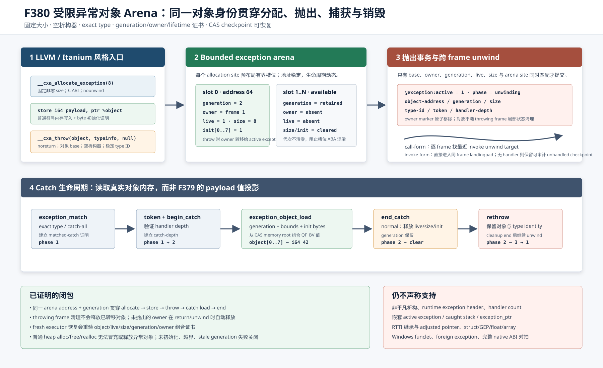

# F380：带代次与所有权证书的受限异常对象 Arena

- 日期：2026-08-12
- LLVM lowering：`compiler/ContinuationLowering.cpp`
- 执行器：`util/live_continuation.py`
- 产物审计：`util/check_live_continuation_lowering.py`
- 测试：`test/live_continuation_lowering.ll`、`test/test_live_exception_object_arena.py`
- 能力：`bounded-exception-object-arena`
- 成熟度：I/T/E-mechanism；固定大小、平凡析构、直接标量读取子集，不等价于完整 Itanium C++ ABI

## 1. 研究问题

F379 把 catch payload 看作 throw summary 中的一个 QF_BV 值，因此能验证生命周期，却没有真实对象身份、对象
内存或分配/释放语义。真实 Clang Itanium 风格 IR 的最小路径是：

```llvm
%object = call ptr @__cxa_allocate_exception(i64 8)
store i64 42, ptr %object
invoke void @__cxa_throw(ptr %object, ptr @typeinfo, ptr null)
    to label %unreachable unwind label %landing
```

catch 侧随后执行 `landingpad -> __cxa_begin_catch -> load -> __cxa_end_catch`。如果 continuation 在
throwing frame 退出时清除 heap object，catch 会读到悬空对象；如果仅保存地址而没有代次，槽位复用后旧
checkpoint 又可能把新对象误认为旧对象。F380 的问题因此不是“再加一个 load”，而是建立一个可迁移的对象
生命周期事务：

> 同一个 `(arena site, address, generation)` 身份必须贯穿 allocate、symbolic store、throw ownership
> transfer、跨 frame unwind、catch load 和 normal destruction；任一证书不一致都失败关闭。



## 2. 与规范的关系及诚实边界

实现入口依据 [Itanium C++ ABI Exception Handling](https://itanium-cxx-abi.github.io/cxx-abi/abi-eh.html) 中
`__cxa_allocate_exception`、`__cxa_throw`、`__cxa_begin_catch` 和 `__cxa_end_catch` 的用户对象生命周期，控制流
依据 [LLVM Exception Handling](https://llvm.org/docs/ExceptionHandling.html) 的 `invoke`、`landingpad`、
`resume` 关系。F380 采用这些接口的**受限可验证投影**，并不复制宿主 C++ runtime 的私有 header。

当前接受条件如下：

| 维度 | 接受 | 失败关闭 |
| --- | --- | --- |
| 分配 | C calling convention、默认 address space、nounwind、1--64 bit 整数 size 参数、固定非零字节数且不超过对象上限（默认 64 KiB） | 动态/零大小、错误签名、bundle、非 nounwind |
| 对象使用 | allocation 的直接非 atomic/volatile stores，及一个或多个直接 `__cxa_throw` consumers | escape、GEP 后 throw、普通 free/realloc、未知 consumer |
| 抛出 | object base、稳定 global typeinfo、第三参数为 null、noreturn 且 normal CFG 为 unreachable | interior pointer、非空析构器、不稳定 typeinfo、可返回 CFG |
| 捕获读取 | begin-result 上直接、非 atomic/volatile、1--64 bit integer load；当前 offset 为 0 | struct/GEP、float/vector/aggregate、写 catch object |
| 并发异常 | 每个 execution state 最多一个 active exception | 嵌套 active exception、caught stack、exception_ptr |

空析构器限制是语义边界，不是优化假设。非平凡对象需要 destructor identity、exactly-once 调用、重抛引用计数
和异常终止路径；这些尚未实现，故不能声称支持一般 C++ class exception。

## 3. 编译流程与 artifact

### 3.1 预扫描与内存布局

lowerer 在可达函数收集后预扫描合法 `__cxa_throw`，使 catch handler 即使先于 producer 被 lowering，也能选择
对象语义而非 F379 值投影。每个合法 `__cxa_allocate_exception` site 通过现有确定性内存布局器预留最多
`SYMCC_LIVE_HEAP_SITE_CAPACITY` 个槽位，但 metadata 与普通 heap 隔离：

对象式 `__cxa_throw` 与 F379 的 scalar throw summary 目前不能在同一可达 artifact 内混用。两者的
`__cxa_begin_catch` 返回值分别表示对象地址与标量值投影，而现有 artifact 没有逐 producer 标注 catch payload
种类；若允许混用，catch lowering 会依赖遍历顺序或到达路径。预扫描因此在输出任何 executable artifact 前
拒绝该组合，而不是把歧义延迟到运行时。

```json
{
  "kind": "heap",
  "allocation": "bounded-exception-arena",
  "lifetime": "exception-lifecycle",
  "site": "14578734765746138491",
  "slot": 0,
  "capacity": 4,
  "address": 64,
  "size": 8
}
```

固定地址只是 continuation artifact 内的虚拟地址，不是宿主进程地址。它使不同 worker 和 fresh executor 能对同
一 memory root 做确定性读写。`bounded-exception-arena` 不能由 `heap_alloc` 分配，不能成为 `heap_realloc`
source，也不能由 `heap_free` 释放。

### 3.2 三条新操作

```json
{"op":"exception_alloc","dst":"object","addresses":[64,80,96,112],
 "capacity":4,"size":8,"site":"...","bits":64}

{"op":"exception_throw","address":{"var":"object"},
 "addresses":[64,80,96,112],"arena_site":"...","site":"...",
 "bits":64,"type_id":1937073397,"unwind":"landing"}

{"op":"exception_object_load","dst":"payload","bits":64,"bytes":8,"offset":0}
```

validator 对字段集合、整数类型、宽度、地址顺序、容量、site-to-object 对应、type ID、unwind target 和 capability
闭包做双向检查。每个 arena site 必须恰有一个 allocation instruction；操作存在而 capability 缺失、或 capability
声明但没有任何 arena contract，都会拒绝。

## 4. 运行时事务与不变量

### 4.1 分配

`exception_alloc` 选择第一个非 live 槽位，清除旧初始化标记，设置：

- `@heap:live:<address> = const i1 1`；
- `@heap:size:<address> = const i64 object_size`；
- `@exception-arena:generation:<address> = previous + 1`；
- `@exception-arena:owner:<address> = current frame depth`。

generation 在 normal destruction 后保留，重新分配同一地址时递增；达到 `2^64-1` 不回绕而是拒绝。这样恢复
旧 checkpoint 时不会仅凭相同地址误认新对象。普通 store 复用现有 symbolic memory CAS，并按 byte 设置
`@heap:init:<address+offset>`，因此 padding 可以保持未初始化，而实际读取的 bytes 必须全部有证明。

### 4.2 抛出与所有权转移

`exception_throw` 在改变控制流前一次性验证：pointer width、concrete base、允许地址集合、arena site、当前
frame owner、非零 generation、live、固定 logical size 和 exact type。验证成功后删除 owner marker，并把
以下字段写入 active exception：

```text
active, value=object-address, handler-depth, type, phase=1, token,
object-address, object-generation, object-size
```

删除 owner 表示对象不再归 throwing frame 所有。call-form throw 使用 `_resume_exception` 逐 frame 弹栈，直到
最近具有 `unwind_target` 的 caller；invoke-form 直接进入本 frame landingpad。frame 清理只删除 local/stack
状态和仍由该 frame 持有的未抛出 arena 对象，不会释放已经转移给 active exception 的对象。

### 4.3 捕获、读取与销毁

执行次序固定为：

1. `exception_match` 校验 exact type 或 catch-all，并建立 match 证明；
2. `exception_token` 与 `exception_begin_catch` 校验 handler depth，phase 从 1 变为 2；
3. `exception_object_load` 重验 address/generation/size/live，执行 object bounds 与 byte initialization 检查，再从
   CAS memory root 组合目标端序的 QF_BV 值；
4. normal `exception_end_catch` 清除 live、logical size、所有 init bytes 和 active exception 字段，但保留
   generation；
5. rethrow 路径 phase 为 `2 -> 3 -> 1`，对象和 generation 继续随 unwind 传播，直到后续 handler 正常结束。

checkpoint restore 在执行下一条指令前检查所有字段必须是规定宽度的常量，并验证 owner depth、live、size、
generation marker 与 active object 的组合一致。缺字段、孤立字段、symbolic 伪证书、stale generation 和 owner
仍存在于 active object 等情况均拒绝。

## 5. 多轮 review 与修复

1. **ABI 与 CFG review**：从 Clang 18 真实 IR 对齐 allocate/store/throw/begin/load/end；throw 除 `noreturn` 外还
   要求 normal CFG 的 terminator 为 `unreachable`，避免错误 IR 在抛出后继续。
2. **所有权 review**：初版 frame unwind 会清理 owner object；修复为 throw 先删除 owner、再 unwind，只有未抛出
   object 在 return/unwind 时按 owner 自动释放。新增跨函数 call-form throw 证明对象跨 frame 存活。
3. **ABA 与 checkpoint review**：generation 不随 free 清除；fresh executor 会比较 active generation 与槽位
   generation digest。新增同槽第二次分配从 1 到 2、伪造 generation 和错误 owner depth 反例。
4. **heap 隔离 review**：发现手写 artifact 可让普通 heap op 指向 arena metadata；validator 与 runtime 双层禁止
   `heap_alloc/free/realloc` 冒充或释放异常对象。
5. **内存正确性 review**：throw 不要求整个对象含 padding 的所有 bytes 已初始化；仅在 catch load 时对实际读取
   byte range 建立 initialized conjunction。未初始化与 offset 越界分别有运行时负例。
6. **能力闭包 review**：arena 依赖 cleanup、typed matching 与 catch lifecycle；allocation/throw/load、metadata
   和 capability 互相约束，不能只修改 capability 字符串开启语义。
7. **编译边界 review**：动态 size、非空 destructor、interior pointer、escape 和普通 free/realloc 均有显式拒绝
   路径；LLVM 17/18 均重建，避免只在单一 opaque-pointer 工具链成立。
8. **producer 一致性 review**：发现同一可达 artifact 混合 F379 scalar summary 与对象式 throw 时，catch 的
   全局 payload 解释不唯一；增加 lowering 前的互斥检查及 LLVM 反例，以专用诊断失败关闭。

## 6. 测试结果

证据目录：
[`evidence/f380-bounded-exception-object-arena-2026-08-12/`](../evidence/f380-bounded-exception-object-arena-2026-08-12/)。

- LLVM 18 与 LLVM 17 插件重建通过；
- 完整 lit：238 passed、1 unsupported、0 failed，共 239 discovered；
- arena 定向 Python：8 passed；异常相关组合回归：32 passed、23 subtests passed；
- capability-closed Python gate：877 passed、229 subtests passed，877 个规范 node ID，零
  skip/xfail/xpass/deselection/集合漂移；
- 本 frame artifact 同时得到 normal=7、caught object=42；跨 frame artifact 得到 normal=7、caught object=84；
- 动态 size、非空 destructor、interior throw、scalar/object producer 混用、未初始化读取、越界、
  owner/generation 篡改和普通 heap op 混用均失败关闭；
- ruff、py_compile、diff whitespace、LLVM 17/18 build、SVG/XML 和 PNG 可视检查通过。

这些结果证明机制实现、生命周期安全和 checkpoint 恢复一致性，不证明 coverage、吞吐量、求解时间或漏洞发现率
提升。异常语义扩展的收益必须在包含 C++ exception-heavy target 的多重复 benchmark 中单独测量。

## 7. 下一研究边界

下一步不是直接声称“完整 C++ exception”，而应依次增加并对拍：

1. constant-GEP 的 struct/array 字段和多次标量 load，随后扩展 float/pointer payload；
2. destructor identity、exactly-once 调用、handler count、nested caught stack 与 exception_ptr 引用计数；
3. RTTI 继承匹配、multiple-inheritance adjusted pointer 与 personality action record；
4. native oracle：相同 Clang fixture 在 continuation 与 libstdc++/libc++abi 上逐事件比较构造、捕获、重抛和销毁；
5. Windows funclet、foreign exception 和 architecture-specific ABI 只能作为独立能力，不应混入当前 Itanium 子集。

F380 的创新点在于把异常用户对象变成可调度、可迁移、可恢复且带代次/所有权证明的 continuation state，而不是
把宿主 runtime 地址塞入 checkpoint。其挑战在跨 LLVM IR、symbolic memory、frame unwind 和生命周期协议四层
同时维持对象身份；当前实现完成了最小闭环，并保留清晰的扩大路径。
