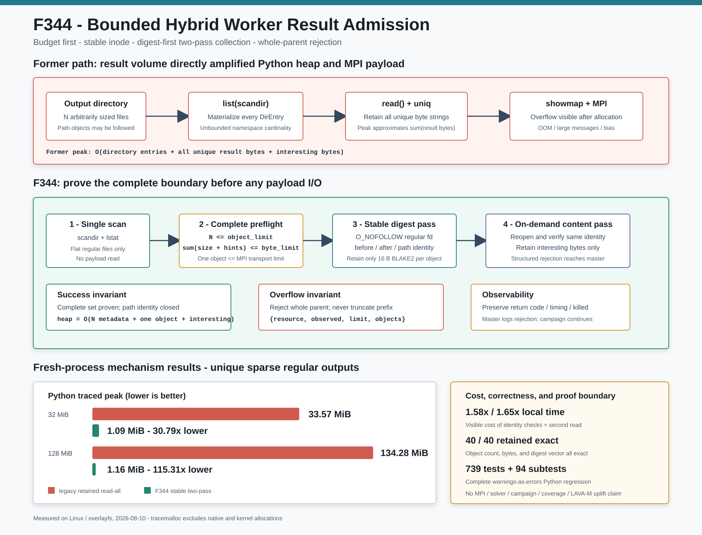

# F344：有界 Hybrid Worker 结果准入与稳定两遍收集

> 功能编号：`F344`  
> 日期：`2026-08-10`  
> 状态：已实现、已验证、已归档  
> 范围：`mpi_fuzzing_helper.py` 的 hybrid/MPI worker 输出收集路径



## 1. 研究问题

此前 F340-F343 已经把 standalone MPI runner 的结果、输入和模拟变异路径改为有界流式处理，
但代码审查发现 hybrid `mpi_fuzzing_helper.py` 仍有一条独立旧路径：

1. `list(os.scandir(output_dir))` 一次物化整个输出目录；
2. 对每个结果执行无上限 `read()`；
3. 把全部唯一输出的完整 `bytes` 同时保存在 `uniq`；
4. 完成全部收集后才运行 batch/streaming showmap；
5. coverage-interesting 内容最终再进入 Python 列表并由 mpi4py 序列化。

设一轮产生 `N` 个文件，总逻辑字节为 `B`，其中最终需要返回 master 的 interesting 字节为
`I`。旧路径的 payload 堆峰值至少为 `O(B + I)`，目录元数据还需要 `O(N)`。异常目标、错误的
求解策略或失控的候选物化都可能在不增加覆盖收益的情况下放大 worker 堆、MPI pickle 和后处理
延迟。更关键的是，旧路径只有在分配完成后才看见规模，无法做到“先证明边界，再消费结果”。

这不是 F340 的重复实现。F340 保护 `mpi_concolic_execution.py` 的 standalone staging/commit
协议；F344 保护 AFL hybrid helper 中直接把 interesting `bytes` 放入 RESULT 消息的路径。

## 2. 目标与不变量

F344 建立以下四个核心不变量：

### 2.1 完整集先于 payload

任何结果或 `.hints` payload 被读取前，worker 必须证明：

```text
regular_result_objects <= result_max_objects
sum(result_sizes + hint_file_sizes) <= result_max_bytes
each_payload_size <= min(result_max_bytes, transport_input_max_bytes)
parsed_hint_records <= result_max_hints
directory_entries <= 2 * result_max_objects + 16
```

最后一项防止生产者用大量点文件绕过结果对象计数，把攻击面转移为无界 `readdir` 工作。

### 2.2 整批接受或整批拒绝

超限不是截断策略。若只保留 `readdir` 返回的前 `K` 个文件，结果会依赖文件系统枚举顺序，
从而形成不可复现的路径选择偏差。F344 对一个 parent 的完整结果集进行原子语义判断：预算内才
进入内容处理，任一预算超限则 `new_tests=[]`，并报告结构化拒绝：

```text
{resource, observed, limit, objects}
```

hybrid campaign 不因单个 parent 超限而整体终止，但该 parent 不会被错误标记为“部分成功”。

### 2.3 内容绑定稳定 regular inode

预检记录 `device/inode/size/mtime_ns/ctime_ns`。内容读取通过
`O_NOFOLLOW|O_NONBLOCK|O_CLOEXEC` 打开 final component，要求：

```text
lstat identity == fd-before identity
fd-before identity == fd-after identity
fd-after identity == path-after identity
actual bytes == recorded size <= per-object limit
```

symlink、目录、FIFO 和设备不会被跟随。若目标路径在预检后被替换，或者原 inode 在读取期间发生
变化，该候选被拒绝而不是把不同版本的字节与同一 coverage 结果混合。

### 2.4 摘要遍与内容遍分离

第一遍对每个稳定对象计算 16 字节 BLAKE2 内容键，只保留：

```text
(bounded candidate metadata, 16-byte digest)
```

它继续支持跨 item `worker_seen` 内容去重，却不再在 showmap 前保留全部输出内容。第二遍才重开
候选、复验身份，并把内容送入 streaming/batch showmap。只有 coverage-interesting 内容会存入
最终 `new_tests` 并进入 RESULT 消息。

因此 showmap 前的 Python payload 空间由 `O(B)` 改为：

```text
O(N metadata + one_object_bytes + hint_records)
```

最终 RESULT 构造阶段仍需要 `O(I)`，因为当前 mpi4py 协议把全部 interesting children 作为一个
消息发送；F344 用 `result_max_bytes` 给该不可避免部分建立硬上界。

## 3. 配置与执行流程

新增三个环境变量：

| 配置 | 默认值 | 范围 | 含义 |
|---|---:|---:|---|
| `SYMCC_HYBRID_RESULT_MAX_OBJECTS` | 4096 | 1..1,000,000 | 每 parent 非隐藏 regular 输出数；`.hints` 文件也有同等文件数上限 |
| `SYMCC_HYBRID_RESULT_MAX_BYTES` | 268,435,456 | 1..1 TiB | 结果文件与 hint 文件的总逻辑字节 |
| `SYMCC_HYBRID_RESULT_MAX_HINTS` | 65,536 | 1..1,000,000 | 成功解析的 hint tuple 总数 |

单对象上限复用 `SYMCC_MAX_TRANSPORT_INPUT`，并与总字节上限取最小值。这一选择保证一个已接受
child 不会大于后续 content-addressed MPI 输入协议的默认承载能力。环境值缺失或格式错误时使用
默认值，越界整数被夹紧；直接 Python API override 则严格拒绝 bool、非整数、零、负数和越界值。

每个 worker item 的执行次序如下：

1. 创建私有 `run_output`，由 `ConcolicEngine.wrap_run` 启动目标；
2. 物化受独立记录/查询预算约束的 string-solver candidates；
3. 用一次 context-managed `scandir` 完成 flat namespace 预检；
4. 稳定读取 hint 文件，解析记录并执行全局 hint 上限；
5. 第一遍稳定读取普通结果，只保留 BLAKE2 digest 与候选身份；
6. batch showmap 使用有界候选路径列表，或退回 streaming showmap；
7. 第二遍重读、复验身份并进行 coverage merge；
8. 只把 interesting bytes 与稀疏 bitmap 放入 `new_tests`；
9. 超限时捕获 `_WorkerResultBudgetExceeded`，保留真实 target `retcode/elapsed/killed` 和
   `post_elapsed`；
10. RESULT 携带 `result_budget_error`，master 明确记录拒绝，随后正常回收该 worker 的私有目录。

## 4. 实现位置

主要实现位于 [`util/mpi_fuzzing_helper.py`](../../../util/mpi_fuzzing_helper.py)：

- `_WorkerFileIdentity`：稳定 inode 身份；
- `_WorkerOutputCandidate`：路径、名称与预检身份；
- `_WorkerResultBudgetExceeded`：结构化 whole-parent 拒绝及执行上下文；
- `_scan_worker_output_candidates`：无 payload 的完整预算预检；
- `_read_worker_output_snapshot`：no-follow、定长、读前/读后/path 身份闭合；
- `run_symcc_worker`：配置解析、hint 准入、摘要遍和内容遍；
- `worker`：把拒绝转换为普通 RESULT，而不是丢失 target telemetry；
- `master`：记录 worker 的结构化预算拒绝。

配置语义记录在 [`docs/Configuration.txt`](../../Configuration.txt)，回归位于
[`test/test_mpi_lifecycle.py`](../../../test/test_mpi_lifecycle.py)。

## 5. 正确性与故障测试

新增四个测试方法，覆盖：

1. regular candidate/hint 分类、symlink 排除、对象与 hint 文件数预算、非法 API limit；
2. 预检后 path replacement 与 symlink replacement；
3. 正常内容/hint 兼容、对象/聚合字节/hint 整批拒绝、拒绝 payload 精确性，以及 showmap
   I/O 失败时暂存 `worker_seen` 摘要的回滚；
4. 32 个 1 MiB coverage-redundant 输出的 heap 上界。

关键故障注入证明聚合字节 `6 > 5` 时 `_read_worker_output_snapshot` 调用次数严格为 0，即预算确实
在任何 payload read 前生效。定向回归结果为：

```text
57 passed, 47 subtests passed in 1.02s
```

相关六模块回归：

```text
346 passed, 74 subtests passed in 16.77s
```

完整 warnings-as-errors Python 回归：

```text
739 passed, 94 subtests passed in 96.63s
```

## 6. Fresh-process 机制实验

### 6.1 设计

实验比较：

- `legacy`：完整 `list(scandir)`，读取并同时保留全部唯一内容；
- `bounded`：调用 F344 生产预检和稳定读取 primitive，第一遍只保留 digest，第二遍逐对象复验。

输入为 overlayfs 上 32/128 个互异 sparse regular files，每个 1 MiB。所有结果建模为第二遍后
coverage-redundant，因而无需进入最终 RESULT。每个 scale/mechanism 先 2 次 warm-up，再在固定随机
顺序下交错运行 10 个 retained fresh Python processes，共保存 40 个 raw samples。每个样本必须
得到完全相同的对象数、总字节数和 ordered digest vector。

### 6.2 结果

| 规模 | 指标 | Legacy 中位数 | F344 中位数 | 变化 |
|---:|---|---:|---:|---:|
| 32 MiB | traced Python peak | 33,573,032 B | 1,090,489 B | **降低 30.787x** |
| 32 MiB | `ru_maxrss` | 85,180 KiB | 53,434 KiB | **降低 1.594x** |
| 32 MiB | elapsed | 33,771.3615 us | 53,452.954 us | 增加 1.583x |
| 128 MiB | traced Python peak | 134,282,660 B | 1,164,505 B | **降低 115.313x** |
| 128 MiB | `ru_maxrss` | 182,786 KiB | 52,590 KiB | **降低 3.476x** |
| 128 MiB | elapsed | 129,073.793 us | 212,854.175 us | 增加 1.649x |

32/128 MiB 的 F344 traced peak 只增长约 74 KiB，来自候选元数据，而旧路径随结果总量近似线性
增长。代价同样真实：稳定 identity 复核和第二遍读取带来约 58%-65% 的本地机制耗时增加。该权衡
用更多顺序、可缓存 I/O 换取确定的堆与 MPI 消息边界；对实际 campaign 的净效果仍取决于结果
冗余率、page cache、showmap 成本和 worker 并行度，不能由此微基准直接推出。

## 7. 生产 wrapper 集成

本地集成使用真实可执行 Python producer，经生产 `SymCCEngine` 设置 `SYMCC_OUTPUT_DIR`，并由
`run_symcc_worker` 启动实际 child process。四个 case 均在 0.02 秒内结束，target return code 均为
0：

| Case | 结果 |
|---|---|
| success | 2/2 内容 SHA-256 精确，`[(0,0,1)]` hint 保留 |
| objects | `{resource: objects, observed: 3, limit: 2, objects: 3}` |
| bytes | `{resource: bytes, observed: 6, limit: 5, objects: 2}` |
| hints | `{resource: hints, observed: 2, limit: 1, objects: 1}` |

6/6 结构化检查通过。这证明生产 engine wrapper、subprocess、输出目录和准入函数之间的接线，
但没有使用真实 MPI transport 或 afl-showmap。

## 8. 先进性、创新性与挑战

F344 的价值不是新增一个普通大小检查，而是把 hybrid 结果处理从“消费后检查”改为准入协议：

- **完整集证明**：对象、辅助 hints、总逻辑字节和目录枚举工作共同受界；
- **语义无偏**：whole-parent rejection 避免 `readdir` 前缀决定探索结果；
- **身份闭合**：coverage 评估、内容摘要和最终 RESULT 绑定到未变化的 regular inode；
- **反馈感知内存**：摘要遍让 coverage-redundant bytes 在 showmap 前即可释放；
- **可观测失败**：预算拒绝不会伪装为 target crash，也不会抹掉真实执行耗时；
- **跨阶段兼容**：单对象上限与 content-addressed input transport 使用同一容量契约。

实现挑战在于同时保留旧有内容去重、batch/streaming showmap、hint 关联、worker coverage merge、
telemetry 和 campaign 可用性；仅把 `read()` 改为分块读取并不能解决 `new_tests/uniq` 的聚合持有，
仅截断结果又会破坏调度语义。F344 因而采用“预算预检 + stable digest pass + stable content pass”
的组合，而不是局部替换一个 I/O 调用。

## 9. 局限与有效性威胁

1. 当前 mpi4py RESULT 仍是单消息；若所有预算内结果均 interesting，仍需保留最多
   `SYMCC_HYBRID_RESULT_MAX_BYTES` 的 bytes。进一步降低峰值需要分片 RESULT 协议与 master ACK。
2. 两遍读取增加本地 I/O；本实验受 Linux page cache 和 sparse overlayfs 影响，不能外推到 NFS、
   Lustre 或对象存储。
3. final-component `O_NOFOLLOW` 不等同于受信任父目录或 Byzantine 文件系统模型。run output 是
   worker 私有目录，但 F344 不提供 `openat2(RESOLVE_BENEATH)` 级的完整路径证明。
4. 预算只约束 worker 结果收集，不限制目标进程自身内存、solver 查询数、磁盘占用或阻塞系统调用。
5. 集成证据未使用真实 MPI、afl-showmap、符号求解或公开 benchmark；没有 coverage、吞吐、漏洞、
   LAVA-M 或多节点提升结论。
6. `tracemalloc` 不统计 native/kernel 分配；`ru_maxrss` 是 fresh-process 峰值而非瞬时增量。

## 10. 后续方向

1. 设计 generation-fenced 分片 RESULT/ACK，使 interesting bytes 也能以固定窗口跨 MPI 发送；
2. 为 hybrid worker 与 master 增加一致的 rank-level budget fingerprint，检测异构环境漂移；
3. 在真实 AFL++ + SymCC campaign 上分层统计拒绝率、结果冗余率、showmap 时间和吞吐变化；
4. 在多节点共享存储上验证二遍读取成本，并评估 digest pass 与 file lease/cache 的融合；
5. 研究按 coverage sketch 先筛选、内容后拉取的 pull-based result protocol。

## 11. 证据索引

- 证据目录：[`evidence/f344-bounded-hybrid-worker-results-2026-08-10/`](../evidence/f344-bounded-hybrid-worker-results-2026-08-10/)
- 机制 raw data：[`worker-result-admission-cost.json`](../evidence/f344-bounded-hybrid-worker-results-2026-08-10/worker-result-admission-cost.json)
- 本地集成：[`worker-result-integration.json`](../evidence/f344-bounded-hybrid-worker-results-2026-08-10/worker-result-integration.json)
- 定向测试：[`directed-tests.log`](../evidence/f344-bounded-hybrid-worker-results-2026-08-10/directed-tests.log)
- 相关回归：[`integration-tests.log`](../evidence/f344-bounded-hybrid-worker-results-2026-08-10/integration-tests.log)
- 完整回归：[`full-tests.log`](../evidence/f344-bounded-hybrid-worker-results-2026-08-10/full-tests.log)
- 机制图：[`bounded-hybrid-worker-results-2026-08-10.svg`](../diagrams/bounded-hybrid-worker-results-2026-08-10.svg)
