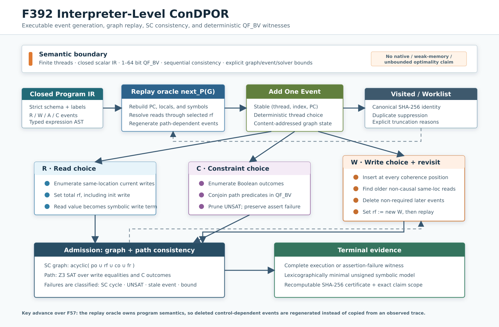

# F392：有界 Interpreter-Level ConDPOR

- 日期：2026-08-13
- 能力：`symcc-interpreter-condpor-v1`
- 程序 IR：`symcc-condpor-program-v1`
- 语义：`bounded-interpreter-sc-qfbv-condpor-v1`
- 状态：实现、定向测试、独立 oracle、CLI、机制实验与证据闭包已完成
- 架构图：[`interpreter-condpor-f392.svg`](../diagrams/interpreter-condpor-f392.svg)
  / [`PNG`](../diagrams/interpreter-condpor-f392.png)
- 可执行证据：[`f392-interpreter-condpor-2026-08-13/`](../evidence/f392-interpreter-condpor-2026-08-13/)

## 1. 研究问题

项目已有 F56/F57 的 Source-DPOR、wakeup tree 和 ConDPOR-style execution-graph
证书，但它们的输入仍是 native runtime 已经观察到的 schedule trace。系统能够回答“这条 trace 中哪些
读写冲突值得回放”，却不能回答更强的问题：

1. 如果把一个旧 read 改为读取后来出现的 write，原 trace 中 read 后面的分支是否仍然存在？
2. 被删除的 constraint/action 应当按什么程序状态重新生成？
3. `rf`、`co`、控制路径和符号模型是否在同一 execution graph 上共同一致？
4. 搜索在资源上限内是否确实穷尽，还是只重放了碰巧观察到的路径？

F57 的证书已诚实记录 `bounded-observed-control-flow-condpor-graph-v1`，并将
`unobserved path-dependent event generation` 列入 `not_proved`。F392 不是修改这一声明，而是新增一层
真正拥有程序语义的并发解释器：execution graph 每次都从程序入口重放，backward revisit 删除旧事件后，
后继事件由新的 `rf` 和路径状态重新生成。

## 2. 文献依据与实现定位

[CONCUR 2025 ConDPOR 论文](https://drops.dagstuhl.de/entities/document/10.4230/LIPIcs.CONCUR.2025.26)
把并发与数据非确定性统一到 execution graph：事件包括 read `R`、write `W`、symbol generation `A` 和
constraint evaluation `C`；读加入时枚举当前可读写，写加入时尝试 backward revisit 旧读，约束加入时枚举
可满足 outcome。论文还指出，revisit 必须删除可能依赖旧读值的事件，然后用 maximal extension 控制重复探索。

论文算法在满足其模型假设时给出 soundness、completeness 和 optimality 定理；证明关键依赖
`maximally extensible` 的程序/内存语义。论文 Java 实现支持 locks、monitors、thread creation/join，实际
memory-model implementation 当前为 SC，并使用 JavaSMT/Z3 与 solver pool。以上信息可由
[论文 HTML 的算法与实现章节](https://drops.dagstuhl.de/storage/00lipics/lipics-vol348-concur2025/html/LIPIcs.CONCUR.2025.26/LIPIcs.CONCUR.2025.26.html)
直接复核。

F392 对齐的是论文的 **execution-graph event generation 主干**，但不借用其完整定理：

| 维度 | 论文 ConDPOR | F57 | F392 |
|---|---|---|---|
| 程序语义来源 | instrumented Java + symbolic types | observed native trace | closed executable IR |
| 事件 | `R/W/A/C` + runtime events | trace 映射的 `R/W/C/A` | 解释器原生 `R/W/A/C` |
| read | 枚举当前 write | 推断 observed `rf` | 枚举当前 write + init |
| write | `co` + backward revisit | observed conflict 候选 | 全 `co` 插入 + backward revisit |
| revisit 后控制流 | 程序继续执行 | 只能 withholding | 从入口重放并重新生成 |
| consistency | 参数化 memory model + symbolic SAT | observed bounded checks | SC graph + QF_BV SAT |
| 可成立声明 | 论文条件下 sound/complete/optimal | trace-level bounded certificate | supported IR 内、无上限命中时 bounded exhaustive |

[Optimal DPOR / Source-DPOR](https://user.it.uu.se/~parosha/publications/papers/popl2014.pdf)
提供了 schedule equivalence 和 source-set reduction 的基础；F392 则把 symbolic value 与 constraint outcome
直接纳入图搜索。QF_BV 通过系统 `libz3` C API 求解，接口可由
[Z3 官方 C API](https://z3prover.github.io/api/html/group__capi.html) 与
[SMT-LIB 标准入口](https://smt-lib.org/)复核。

## 3. 架构



实现分为五个可独立检查的层次：

1. **Closed IR admission**：严格检查 schema、线程 ID、内存对象、label/target、操作字段和表达式结构；
2. **Replay oracle**：从入口按 graph 的 add order 重建每个线程的 PC、local term、symbol 和可见事件；
3. **Graph expansion**：按事件类型枚举 `rf`、constraint outcome 或 `co`，写事件同时产生 revisit；
4. **Joint admission**：图结构做 SC 一致性，符号路径做 Z3 QF_BV SAT；
5. **Evidence**：终态产生确定性 witness、完整 graph/relation 和可重算 SHA-256 证书。

关键实现文件：

| 文件 | 作用 |
|---|---|
| `util/condpor_interpreter.py` | IR、表达式、replay、SC、Z3、revisit、证书 |
| `util/symcc_condpor.py` | `explore` / `verify` CLI 与 durable atomic output |
| `test/test_condpor_interpreter.py` | 语义、oracle、故障与 CLI 测试 |
| `benchmark/benchmark_condpor_interpreter.py` | coherence 与控制重生成机制测量 |

## 4. 支持的封闭 IR

程序由固定线程、固定宽度共享标量和有限 instruction list 组成。全局 `bit_width` 为 1--64；每个共享对象
具有明确初值。当前操作如下：

| 类别 | 操作 | 语义 |
|---|---|---|
| `A` | `symbol dst [bits]` | 生成稳定命名的 QF_BV 符号 |
| `R` | `read object dst` | 从 graph 指定的 `rf` source 取得 symbolic write term |
| `W` | `write object value` | 产生 write term equality，加入 per-location `co` |
| `C` | `branch condition then else` | 对 true/false outcome 分别构图并求 SAT |
| `C` | `assume condition` | 只允许满足 assume 的继续路径 |
| `C` | `assert condition` | false 的可满足路径形成 assertion-failure witness |
| local | `set`, `jump`, `label`, `nop`, `halt` | replay 内部执行，不产生 graph event |

表达式不是字符串拼接，而是经校验的 JSON AST。支持 Boolean 组合、相等/不等、无符号/有符号比较、
bit-vector 算术/位运算、移位、`ite`、`concat/extract` 和 `zext/sext`。生成器使用合法 SMT-LIB 形式；
n 元 `xor/concat` 显式折叠成二元节点，避免依赖非标准 parser 扩展。

### 4.1 最小示例

```json
{
  "schema": "symcc-condpor-program-v1",
  "bit_width": 8,
  "memory": {"x": 0},
  "threads": {
    "0": [
      {"op": "read", "object": "x", "dst": "r"},
      {"op": "branch", "condition": {"op": "eq", "args": ["r", 1]},
       "then": "failure", "else": "done"},
      {"op": "label", "name": "failure"},
      {"op": "assert", "condition": false},
      {"op": "label", "name": "done"},
      {"op": "halt"}
    ],
    "1": [
      {"op": "write", "object": "x", "value": 1},
      {"op": "halt"}
    ]
  }
}
```

## 5. 精确执行次序

一次 `Visit(G)` 的实现次序如下；这个次序也是证书可重算性的基础：

1. 对 graph 做 canonical JSON SHA-256，已访问则停止；
2. 检查每个 read 恰有一个同址 `rf`，每个 `C` 恰有 outcome，每个 write 在该地址 `co` 中恰出现一次；
3. 构造 `po/rf/co/fr` 并检查 SC acyclicity；
4. 从所有线程入口按 graph add order 重放，逐事件检查 `(tid, thread_index, PC, kind, op, object)`；
5. 生成 write equality 和 constraint conjunction，调用 Z3；UNSAT graph 被剪枝；
6. 若已到完整执行或 assert failure，求词典序最小 unsigned symbol model 并输出终态；
7. 否则由确定性的 `next_P(G)` 选择下一个可见线程事件；
8. `A` 直接扩展一个 graph；`R` 按当前同址 writes 枚举；`C` 按语义枚举 outcome；`W` 按所有 `co` 插入点枚举；
9. 对新 `W`，扫描此前同址 read，生成符合条件的 backward revisit graph；
10. 所有 child 回到步骤 1，直到 worklist 空或显式 bound 命中。

线程选择本身是确定性的最小 thread ID；并发非确定性不靠排列 thread steps 表达，而由 `rf/co` execution-graph
等价类表达。graph identity 不包含运行时间，因此相同输入和 bounds 产生 byte-identical certificate。

## 6. Execution graph 与 SC

graph 保存：

- 稳定事件 ID `t<tid>:e<thread-index>`；
- event add order；
- total same-location `rf : R → (init ∪ W)`；
- 每地址从 `init:<object>` 开始的 total `co`；
- 每个 `C` 的 Boolean outcome。

对固定 `rf/co`，F392 构造：

```text
po = 每线程可见事件顺序
rf = 被选 write -> read
co = 同址 write 的 coherence order
fr = read -> 该 read 所见 write 之后的同址 writes
SC admission = acyclic(po ∪ rf ∪ co ∪ fr)
```

这使“同线程先 write、后 read 却读取 init”形成 `W →po R →fr W` 环并被拒绝；读未来加入的另一线程 write
在 add order 上看似逆序，但只要 execution graph 存在合法 SC linearization，就可以成立。add order 是搜索历史，
不是内存执行顺序。

## 7. Backward revisit 与真正的控制流重生成

对新 write `w` 和旧 read `r`：

1. 若 `r (po∪rf)+→ w`，revisit 会形成因果冲突，拒绝；
2. 选择 add order 中位于 `r` 之后、且不是 `w` 的因果前驱的事件作为 deleted set；
3. restriction 删除这些事件及其 `rf/outcome/co` 条目；
4. 将 `rf(r)` 改为 `w`；
5. SC admission 通过后，把 restricted graph 放回 worklist；
6. replay 从程序入口重建 `r` 的新 symbolic value，旧分支事件不复用；下一次 `C` 按新条件重新生成。

定向样例的原路径 add order 为：

```text
t0:e0 R(x<-init) -> t0:e1 C(false) -> t1:e0 W(x=1)
```

revisit 删除旧 `t0:e1`，保留产生新读值所需的 write，重生成后为：

```text
t0:e0 R(x<-t1:e0) -> t1:e0 W(x=1)
 -> t0:e1 C(true) -> t0:e2 Assert(false)
```

这正是 F57 无法仅靠 observed trace 完成的语义跃迁。

## 8. Z3、确定性模型与失败关闭

每个 write event 对应一个 QF_BV 常量，write 表达式产生 equality；read 从 `rf` source 引用该常量，因而允许
在 add order 中读尚未处理、但 graph 中已存在的 write。所有 `C` outcome 转为 path assertion 后一次求 SAT。

论文指出 maximal-extension 的 concolic 优化依赖 deterministic model。F392 不依赖 Z3 默认 model 顺序，
而是按符号名排序，对每个 unsigned bit-vector 二分求最小可行值，并固定后继续下一个符号。因此 witness 对同一
SMT 语义唯一，代价是每个符号最多 `bit_width` 次附加 solver check。该代价被
`max_solver_checks` 显式约束并计入证书。

错误分类遵循失败关闭：

| 情况 | 处理 |
|---|---|
| SC cycle | 正常剪枝并计数 |
| QF_BV UNSAT | 正常剪枝并计数 |
| revisit 后旧事件无法由新路径再生 | stale candidate 剪枝 |
| undefined local / sort 或 width 错误 | 整个 IR 拒绝，不允许声称 complete |
| internal loop / event / graph / revisit / solver 上限 | `status=truncated`，列出 exact bound reason |
| certificate 内容或 hash 篡改 | verifier 返回 false |

## 9. 证书与 CLI

```bash
python3 util/symcc_condpor.py explore program.json \
  --output certificate.json \
  --max-graphs 10000 --max-events 64

python3 util/symcc_condpor.py verify certificate.json
```

`explore` 完整时返回 0，命中 bounds 时返回 3，输入/求解错误返回 2。输出使用同目录 temporary file、file
`fsync`、atomic replace 和 directory `fsync`。`verify` 先验 SHA-256，再使用证书内 program 和 bounds 重跑
整个搜索；即使攻击者修改内容并重新计算 hash，语义重算仍会拒绝不一致证书。

## 10. 多轮验证

### 10.1 定向与联合回归

| 门禁 | 结果 |
|---|---:|
| F392 pytest | 12 passed |
| F392 warnings-as-errors unittest | 12 passed |
| F392 + existing schedule exploration | 72 passed |
| py_compile / Ruff / Ruff format / whitespace | 全部通过 |
| capability-closed full Python gate | 950 passed + 235 subtests |
| canonical pytest identity | 950 expected = 950 observed，零 missing/unexpected |
| full LLVM lit (`-j32`) | 251 discovered；250 passed + 1 unsupported |

12 项测试覆盖：

- write-triggered revisit 与控制依赖事件重生成；
- read 枚举 init/current write；
- 3 writer 的全部 `3! = 6` coherence orders；
- UNSAT constraint outcome 剪枝；
- assertion failure 的最小可重放 witness；
- SC cycle 拒绝；
- value-dependent 双对象程序与独立 concrete SC interleaving oracle 精确等价；
- byte-identical repeated exploration；
- hash tamper 与 resealed semantic tamper；
- internal/event bound 不得伪装 complete；
- malformed target/field/width/undefined local 失败关闭；
- CLI explore/verify/truncated exit contract。

完整 Python gate 同时前检 10 个外部命令、5 个 Python 模块和系统 `libz3`；skip、xfail、xpass、
deselect、collection error、failed subtest、missing/unexpected node ID 全为 0。canonical node-list SHA-256 为
`dff97eae0523f56a1cb56c66fc27b2b444c00a0db8a4ccb225f4d444f97b02dd`。lit 唯一 unsupported
仍为既有 `simple_out_of_order_input.c`，F392 自身作为 lit 项通过。

### 10.2 独立 SC oracle

测试不调用 production consistency helper，而是独立枚举 2 writer × 2 reader 的：

```text
2 个 write coherence permutations
× 每个 read 的 3 个 rf sources
= 18 个候选 graph
```

oracle 自行构造 `po/rf/co/fr` 并拓扑判环，得到 4 个 SC-consistent execution；F392 输出的 graph signature
集合与它精确相等。该测试同时检测漏探索和错误多探索。

第二个 oracle 不使用 graph consistency 公式，而是直接枚举一个双对象、双分支程序的全部 concrete SC
线程 interleavings，以 schedule 中最后 write 决定 read source，再归并为 `(events, rf, co, outcomes)` 等价类。
它也得到 4 类，和 F392 在 future-write revisit、路径特定 write 与后续 read 上的输出精确相等。

### 10.3 机制实验

环境：Python 3.12.3、Z3 4.8.12、AMD Threadripper PRO 9995WX、overlay filesystem；每例 11 次，
`perf_counter_ns`。结果为本机单进程机制成本：

| 场景 | 完整执行 | visited graph | solver checks | median | p95 |
|---|---:|---:|---:|---:|---:|
| 1 writer coherence | 1 | 2 | 2 | 11.943 ms | 20.356 ms |
| 2 writer coherence | 2 | 4 | 4 | 23.963 ms | 24.940 ms |
| 3 writer coherence | 6 | 10 | 10 | 60.147 ms | 62.069 ms |
| 4 writer coherence | 24 | 34 | 34 | 205.862 ms | 208.873 ms |
| 5 writer coherence | 120 | 154 | 154 | 934.887 ms | 941.554 ms |
| control regeneration | 1 normal + 1 error | 10 | 10 | 61.237 ms | 62.053 ms |

control regeneration 还记录 1 次 accepted revisit 和 3 个 UNSAT graph。coherence 场景符合 `n!` 终态，说明
`co` 插入枚举闭合，也直观展示 factorial state-space challenge。这里没有 old/new equivalent implementation，
因此不报告 speedup；也不据此声称 fuzzing coverage、LAVA-M bug 数或端到端吞吐提升。

## 11. Review 中修复的问题

1. **assert 后残留事件**：早期 replay 在 assert failure 后停止，但没有拒绝 graph 尾部事件；现要求 failure
   必须是 add order 最后事件，否则 graph 无效；
2. **非标准 n 元表达式**：`xor/concat` 原直接输出 n 元 SMT，现显式二元折叠；
3. **错误 complete 声明**：undefined local/sort error 原可能成为普通 pruned graph；现提升为 program error；
4. **CLI bound 测试误设**：单 event 后立即 halt 不会命中 `max_events=1`；测试改为两个 symbol event，明确
   验证 exit 3 和 `status=truncated`；
5. **只验 hash 的不足**：新增 resealed tamper，证明 verifier 通过重算而非只比较摘要。

## 12. 可成立与不可成立的结论

### 可成立

- F392 已从 observed-trace ConDPOR-style analysis 推进到 interpreter-level event generation；
- 对通过 admission 的 closed finite SC-QF_BV IR，证书未命中任何 bounds 时，搜索输出在其实现语义内有界穷尽；
- 每个输出 graph 同时通过 relation consistency 与 path SAT；
- backward revisit 后的路径事件由程序重放产生；
- terminal witness 可确定复现，certificate 可完整重算。

### 不可成立

- 不等价于任意 native pthread/C/C++/LLVM 程序；
- 尚无 locks、condition variables、atomics、dynamic thread lifecycle 或 object heap；
- 未实现 TSO/RA/C11 等弱内存模型；
- 没有复现论文针对任意语言语义的 unique maximal-extension proof；
- 不声称 unbounded soundness/completeness/optimality；
- 没有公开 benchmark、coverage、速度或漏洞发现提升结论。

## 13. 下一步科研路线

1. 将 LLVM/native runtime event adapter 变成 proof-carrying translation，并做 IR/native differential replay；
2. 将 F391 continuation state 作为 interpreter graph 的 staged snapshot，避免每图从入口全量重放；
3. 引入 solver pool、incremental prefix context 和确定性 model cache，测量每类 solver call 的消融；
4. 实现论文 maximal-extension criterion 并用 reference enumerator 验证 unique equivalence representative；
5. 加入 synchronization event 与 operational scheduler，再扩展 TSO/RA consistency checker；
6. 在公开 concurrent data-structure corpus 上做 equal-CPU、multi-run、统计检验，而非只测 synthetic graph。

F392 的价值不是“已经完成完整 ConDPOR 复现”，而是把此前最关键的语义断点变成了一个可执行、可测试、
可重算的研究平台；后续每个 native、snapshot、maximality 或 weak-memory 扩展都能在这一平台上给出明确反例和
证据，而不再依赖 observed trace 的隐含假设。
