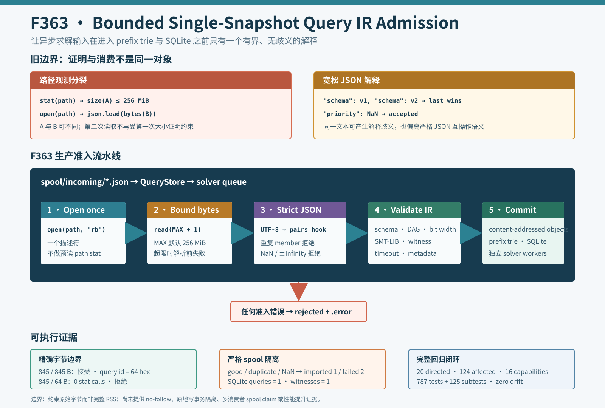

# F363：Bounded Single-Snapshot Query IR Admission

- 功能编号：F363
- 日期：2026-08-11
- 状态：已实现、已完成生产反例与完整回归
- 范围：异步 Query IR 文件准入、JSON 规范性、入库前失败关闭



## 1. 研究背景与执行位置

SymCC runtime 可以把一次路径求解请求编码为 `symcc-query-ir-v1` envelope。异步服务按以下次序处理它：

```text
runtime producer
  -> spool/incoming/*.json
  -> symcc_query_service.ingest_spool()
  -> QueryStore.ingest_file()
  -> QueryStore.ingest()
  -> schema / expression DAG / SMT-LIB validation
  -> content-addressed artifacts + prefix trie + SQLite work queue
  -> independent solver workers
```

因此 `ingest_file()` 不是普通配置读取器，而是文件系统字节进入持久求解状态的准入边界。它决定哪些表达式节点、路径
前缀、目标谓词、witness 和 SMT-LIB 工件可以进入共享 QueryStore。错误的准入语义会污染后续 prefix reuse、portfolio
solving、partial solution 和调度统计，即使求解器本身完全正确也无法补救。

## 2. 深度审查发现

原实现包含两类相互独立的问题：

1. 先执行 `source.stat().st_size` 验证 256 MiB 上限，再通过 `source.open()` 和 `json.load()` 重新按路径打开并读取。
   大小证明针对对象 A，解析可能消费对象 B；两次路径观测之间的目录项替换会破坏准入依据；
2. Python `json.load()` 默认采用 last-member-wins，并且默认接受 `NaN`、`Infinity` 和 `-Infinity`。重复的 `schema`、
   `target_root` 或 `metadata` 会被静默覆盖；非有限数也不是互操作意义上的严格 JSON。

此外，旧代码在 `stat` 后执行无界的 `json.load()`。即使第一次大小观测正确，第二次打开的对象也可能更大，解析前不再有
字节读取硬边界。该问题位于异步 spool 的生产调用链，不只是测试辅助函数。

## 3. 修复目标与准入不变量

F363 建立以下不变量：

1. 原始字节上限与 JSON 解析消费同一个已打开文件描述符产生的字节序列；
2. 解析前最多读取 `MAX + 1` 字节，默认 `MAX = 256 MiB`；
3. 正好 `MAX` 字节仍可进入解析，至少 `MAX + 1` 字节立即拒绝；
4. UTF-8 解码、JSON 构造和后续 envelope 校验消费同一内存字节快照；
5. 任意层级重复 JSON member 都失败，不采用 first/last-member-wins；
6. `NaN` 和正负无穷在 JSON 构造阶段失败；
7. 顶层必须是 JSON object，解析失败发生在 `QueryStore.ingest()` 和 SQLite mutation 之前。

## 4. 实现细节

### 4.1 有界单描述符读取

`util/query_store.py` 新增 `_load_query_envelope()`：

```python
with path.open("rb") as source:
    encoded = source.read(_MAX_ENVELOPE_BYTES + 1)
if len(encoded) > _MAX_ENVELOPE_BYTES:
    raise ValueError(...)
```

随后只对 `encoded.decode("utf-8")` 的结果执行 `json.loads()`。这关闭了旧流程中的 `stat(path) -> open(path)` 身份分裂。
读取多一个字节用于区分“恰好达到上限”与“已经超限”，无需把超限文件完整载入内存。

这里的“single snapshot”指一个描述符的一次有界读取结果；它不表示文件内容具有事务快照语义。同一 inode 被原地并发写入
时，读取仍可能看到写入过程中的内容，但该内容必须作为一个统一字节序列通过 UTF-8、严格 JSON 和 envelope 语义校验。

### 4.2 无歧义 JSON

`object_pairs_hook=_object_without_duplicate_keys` 在 Python 构造 `dict` 之前按顺序观察每个 member。发现已出现的 key 即抛出
`ValueError`，所以重复字段即使值完全相同也不被接受。`parse_constant=_reject_nonfinite_json` 则拒绝 Python JSON
扩展中的三个非有限 token。

重复键与非有限数错误保留明确诊断；UTF-8、JSON 语法和递归深度错误统一带上 `cannot parse query envelope` 上下文。
顶层数组或标量在解析后以 `query envelope must be a JSON object` 拒绝。

### 4.3 失败关闭位置

`QueryStore.ingest_file()` 现在只有两个阶段：

```text
_load_query_envelope(path) -> validated JSON object
QueryStore.ingest(object)   -> semantic normalization + durable mutation
```

文件准入失败不会调用 `ingest()`。在 spool 服务中，异常被写入同名 `.error`，原文件移动到 `rejected/`；只有成功项移动到
`accepted/`。本轮反例同时检查 SQLite 中只出现合法查询及其 witness，证明坏输入没有形成部分持久状态。

程序内部直接调用 `QueryStore.ingest(mapping)` 的路径不经过 JSON codec，这是有意的 API 分层：Python mapping 已不再是原始
JSON 文本，仍由既有 schema、位宽、DAG、SMT-LIB、metadata、timeout 和 priority 语义校验约束。

## 5. 生产反例设计

`run_adversarial_query_checks.py` 直接调用生产 API，得到以下结果：

| 反例 | 观测 | 结果 |
|---|---:|---|
| 845 B 合法 envelope，limit=845 B | query id 长度 64 | 精确边界接受 |
| 同一 845 B envelope，limit=64 B，伪造 `Path.stat=1 B` | stat 调用 0 | 读取 65 B 后拒绝 |
| 合法 envelope 增加第二个相同 `schema` | error 指明 duplicate member | 拒绝并隔离 |
| 合法 envelope 把 `priority` 改为 `NaN` | error 指明 non-finite number | 拒绝并隔离 |
| good + duplicate + nonfinite 同批 spool | imported=1，failed=2 | SQLite queries=1、witnesses=1 |

伪造 `Path.stat` 的目的不是模拟所有文件系统故障，而是证明生产 reader 已经不再依赖旧的预读路径元数据。精确边界用同一份
合法 envelope 验证实现没有把 `>= MAX` 错写为 `> MAX` 或反之。

## 6. 回归与结果

| 验证层 | 结果 |
|---|---:|
| 生产 adversarial checks | 5/5 PASS |
| `test/test_query_store.py` | 20 passed（2.14 秒） |
| QueryStore / QF_BV / schedule / semantic proposal 关联测试 | 124 passed（14.86 秒） |
| 规范 nodeid 重建 | 787 项，SHA-256 与文件字节均一致 |
| 完整 capability + identity gate | 787 passed + 125 subtests（98.41 秒） |
| 能力缺失 | 0 / 16 |
| 结果退化 | 0 failed/skip/xfail/xpass/deselected/collection error |
| 身份退化 | 0 missing/unexpected/duplicate |

本轮在既有 `test_spool_ingestion_is_atomic_and_quarantines_bad_json` 测试身份内扩展断言，没有新增 pytest test function；
因此 787-node manifest 保持字节一致。测试覆盖真实 `ingest_spool()`、错误文件、`QueryStore.ingest_file()` 和最终数据库计数，
而不是仅测试私有 hook。

## 7. 工程价值与研究定位

F363 将 Query IR 文件边界从“先相信路径 metadata，再让宽松 JSON parser 读取”提升为“有界字节观察、无歧义构造、语义
验证、持久提交”的分层协议。其直接价值是提高异步并行求解基础设施的可复现性：同一被接纳的字节序列只有一种 object
member 解释，并且坏输入在进入 prefix trie、content-addressed artifacts 和 solver queue 前被隔离。

该方法与内容寻址存储、编译器 manifest 和可重复构建中的 strict admission 原则一致，但不是新的符号执行算法 SOTA。
它不会自行增加分支覆盖率或减少 SMT 求解时间；先进性体现在把求解输入的可信边界与项目已有的持久复用机制对齐。

## 8. 局限与有效性威胁

1. 默认 256 MiB 只约束原始读取字节；UTF-8 字符串、JSON object tree 和后续规范化仍会产生额外内存，不是完整 RSS 上限；
2. 当前使用 `Path.open("rb")`，尚未要求 `O_NOFOLLOW`、regular-file descriptor 或打开后的 path identity closure；
3. 同一 inode 原地并发修改不具备事务隔离；producer 应继续使用临时文件加原子 rename 发布完整 envelope；
4. `ingest_spool()` 尚未通过 rename-to-processing 建立多消费者的原子 claim；多个服务实例共享同一 incoming 目录仍需单独验证；
5. 256 MiB 常量尚未暴露为运维配置，也没有按节点数、SMT 文本或输入大小细分预算；
6. 本轮没有触发 GitHub 托管 runner，也没有运行 LLVM lit、QSYM/PIN、真实 MPI、solver/coverage campaign、公开 benchmark
   或 LAVA-M；98.41 秒是一次回归耗时，不支持性能比较。

## 9. 实现与证据索引

- 生产代码：`util/query_store.py`；
- spool 调用链：`util/symcc_query_service.py`；
- 回归测试：`test/test_query_store.py`；
- 机制图：`docs/codex/diagrams/bounded-single-snapshot-query-ir-admission-2026-08-11.svg`；
- 可执行证据：`docs/codex/evidence/f363-bounded-query-ir-admission-2026-08-11/`；
- 完整门禁：证据目录中的 `full-gate.json` 与 `full-gate.log`。

## 10. 后续研究方向

1. 将 spool 文件先原子 claim 到 processing namespace，再以 no-follow regular descriptor 读取，闭合多消费者与 symlink 边界；
2. 给 Query IR 增加分层预算，在完整 JSON object tree 构造前约束 node、SMT、witness 和 metadata 的资源消耗；
3. 研究流式或事件式 decoder，使超大合法 envelope 的峰值内存不再同时包含 raw bytes、Unicode text 和完整 object tree；
4. 在等 CPU benchmark 中测量严格准入的开销，并统计真实 campaign 的 envelope 大小分布、拒绝原因和入库延迟；
5. 把 strict JSON codec 抽为共享基础设施，但必须保留不同协议各自的 schema、错误类型与上限语义。

## 11. 结论

F363 修复了异步 Query IR 入库的两个真实正确性缺口：大小门和解析对象不再跨两次路径观测，重复 JSON member 与非有限数
不再被宽松解析器静默接纳。五类生产反例、20 项定向测试、124 项关联测试以及完整 `787 passed + 125 subtests` 门禁共同
支持本地准入正确性与无回归结论。证据不支持 hostile-filesystem 完备证明、远端 CI 通过或符号执行性能与覆盖率提升。
