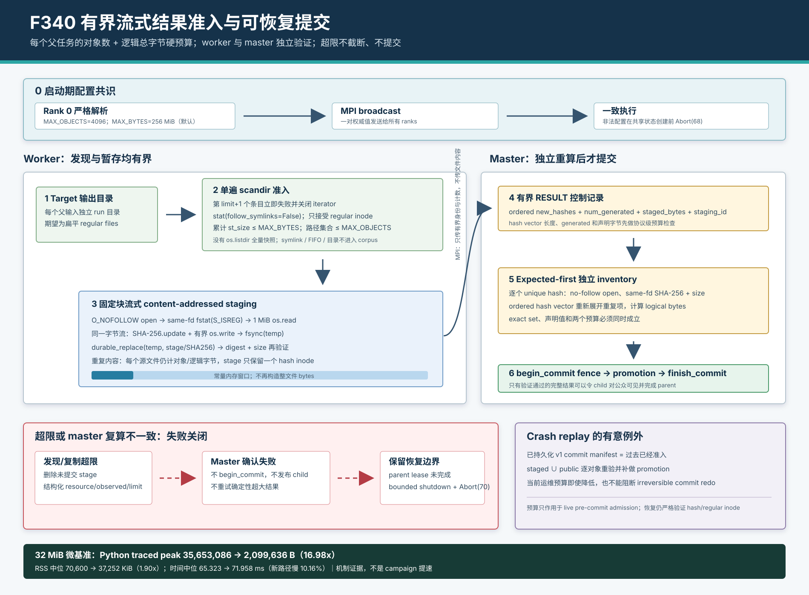

# F340：有界流式 Result Admission 与可恢复提交

> 日期：2026-08-10  
> 状态：生产路径已实现并完成单元、真实 MPI 与机制微基准验证；不是 coverage、solver 或漏洞发现效果结论  
> 代码：`util/mpi_concolic_execution.py`  
> 测试：`test/test_mpi_lifecycle.py`  
> 图示：[`bounded-streaming-result-admission-2026-08-10.svg`](../diagrams/bounded-streaming-result-admission-2026-08-10.svg)  
> 原始证据：[`f340-bounded-streaming-results-2026-08-10/`](../evidence/f340-bounded-streaming-results-2026-08-10/)

## 1. 研究问题

F321-F323 建立了 worker 私有 staging、父任务 fencing、持久 commit manifest 与崩溃重放；F339 又把 master
验证改为 expected-first、单遍目录消费和 descriptor-bound no-follow 摘要。然而，F340 审查发现结果进入该协议
之前仍有一个未受约束的资源通道：

```text
target output directory
  -> os.listdir(output_dir)                 # 所有名称先物化
  -> list[str] of every output path         # 无对象数上限
  -> open(path).read()                      # 每个文件整体载入 Python bytes
  -> SHA-256 + _atomic_write(content)        # staging 前无总字节上限
  -> RESULT(new_hashes, num_generated)       # master 不知道字节规模
```

单个父输入可以产生任意多文件或任意大文件。即使 master 最终会逐对象验证，准入检查发生得太晚：worker 已经承担
目录快照、整文件分配、MPI hash vector 和 staging 存储成本；master 也没有独立的数量或累计字节判断。F340 的
核心问题是：**如何把每父任务的结果资源纳入 commit 前协议，同时保持重复内容计费、exact result、失败恢复和
已持久化 commit 的 redo 语义？**

## 2. 目标与非目标

本功能建立五项可检查不变量：

1. `MAX_OBJECTS` 同时约束 output directory entries、worker path/hash vector 与 `num_generated`；
2. `MAX_BYTES` 计算每个原始结果文件的逻辑字节，重复内容不能通过 content-address dedup 逃避计费；
3. worker 不构造与单文件大小成正比的 Python `bytes`，而以固定块完成 hash、copy 和持久暂存；
4. master 不信任 worker 声明，独立重算 staged inventory、unique size 和重复展开后的 logical bytes；
5. 超限不得静默截断或完成 parent；已经进入 irreversible `committing` 的历史 manifest 又必须能够 redo。

该预算不是 target 进程的 CPU/RSS 限制、campaign corpus quota、文件系统容量预留、阻塞系统调用超时或
Byzantine worker 防护。它只约束 standalone MPI 中**一个父输入的一次结果提交**。

## 3. 完整执行流程



### 3.1 启动配置共识

Rank 0 用严格整数解析读取：

| 配置 | 默认值 | 有效范围 | 语义 |
| --- | ---: | ---: | --- |
| `SYMCC_STANDALONE_RESULT_MAX_OBJECTS` | 4,096 | 1..1,000,000 | 每 parent 最大结果条目/文件数 |
| `SYMCC_STANDALONE_RESULT_MAX_BYTES` | 268,435,456 B | 1..1,099,511,627,776 | 每 parent 原始结果逻辑总字节 |

Rank 0 在创建 shared state 前广播唯一配置。空值、小数、零、负数和越界值不会被 clamp 或退回默认值，而是令
所有 ranks 以 `Abort(68)` 结束。这样即使 MPI launcher 给不同节点注入了不同环境，运行期仍只有一个准入策略。

### 3.2 Worker 第一道检查：有界发现

`_discover_result_files` 使用 context-managed `os.scandir`，每次只消费一个条目：

```text
entry count + 1 > MAX_OBJECTS  -> 立即关闭 iterator 并失败
entry.stat(follow_symlinks=False)
not S_ISREG                    -> 失败
sum(st_size) > MAX_BYTES       -> 失败
otherwise                      -> 保留至多 MAX_OBJECTS 个路径
```

对象上限在第 `limit+1` 项停止，而不是继续扫描后再报告总数。因此目录枚举临时状态由旧版 `O(N)` 变为
`O(min(N, limit))`，异常目录的工作量也被限制在 `limit+1` 个条目。SymCC 结果目录应为扁平 regular files；
symlink、FIFO、device 和子目录不再被跟随或忽略，而是令该 parent 结果无效。

metadata 只是早期拒绝：文件可能在 discovery 与 copy 之间改变，所以它不能替代下一阶段的 same-fd 实际读取
计数。

### 3.3 Worker 第二道检查：流式 staging

`_stream_stage_result_file` 按以下顺序处理每个源文件：

1. `os.open(O_RDONLY | O_NOFOLLOW | O_NONBLOCK | O_CLOEXEC)`；平台缺少 `O_NOFOLLOW` 时失败关闭；
2. 在同一 descriptor 上 `fstat` 并要求 `S_ISREG`，先用实际 inode size 与剩余预算比较；
3. 每次最多 `1 MiB` 执行 `os.read`，同时更新 SHA-256 并以处理 partial write 的循环写入 exclusive temp；
4. 每一块更新实际字节计数，增长文件即使绕过 metadata 预检也会在超过剩余预算时停止；
5. `fsync(temp)`、关闭 temp、`durable_replace(temp, stage/SHA256)`；
6. 重新以 no-follow same-fd helper 校验 staged digest 和 size；任意异常关闭 descriptors、删除 temp 和整个
   未提交 stage。

内存上界由固定 chunk 和少量 hash/path 状态决定，不再由最大 child size 决定。结果的 `new_hashes` 保留原始
顺序和重复项；`staged_bytes` 是所有源文件实际读取字节之和。例如两个 8 MiB 同内容文件产生两个 hash vector
元素、`16 MiB staged_bytes`，但 stage 目录只有一个 SHA-256 inode。

### 3.4 Master 独立准入

worker 只发送有界控制记录：

```text
input_hash, staging_id, ordered new_hashes,
num_generated, staged_bytes, retcode, elapsed
```

master 先要求 `len(new_hashes) == num_generated <= MAX_OBJECTS`、声明字节不超过 `MAX_BYTES`、hash/stage/input
身份规范。随后复用 F339 expected-first verifier，以 `O_NOFOLLOW` 打开每个 unique staged inode，对同一 fd
重算 SHA-256 和 size。最后用 ordered hash vector 查表展开重复项：

```text
logical_bytes = sum(size_by_hash[h] for h in ordered_new_hashes)
```

只有 exact staged set、每个内容摘要、声明 `staged_bytes`、对象预算和逻辑字节预算全部一致，master 才构造
canonical v1 commit manifest 并调用 `begin_commit`。manifest 仍只持久化 deduplicated sorted hashes 和
`num_generated`；预算是 live admission policy，不改变历史 commit identity。

## 4. 为什么超限不是截断或自动重试

静默保留前 `K` 个 child 会让 parent 在结果不完整时进入 done，永久丢失后续可达路径，同时统计仍可能显示
任务成功。另一方面，同一个确定性 parent 在相同限制下重新执行通常还会产生同样超大结果；把它当普通 worker
协议错误轮流重试，会耗尽 worker 并形成无意义 quarantine 循环。

F340 因而定义独立的 `result-budget-exceeded` 控制记录，字段包含 `resource ∈ {objects, bytes}`、整数
`observed`、当前 `limit`，以及可能为空的规范化 `staging_id`。worker 即使本地清理失败也保留这个暂存身份；
master 绑定当前 input、要求空 child 声明、核对 limit 恰为广播配置，并按身份再次尝试清理，然后：

```text
delete uncommitted stage
do not begin_commit
do not publish children
leave parent pre-commit ownership incomplete/recoverable
bounded STOP + exact ACK
Abort(70)
```

master 自己发现 vector 或 staged logical bytes 超限时走相同 fatal control path。该行为让配置不足可见且可运维，
不会用“成功但丢结果”掩盖实验偏差。

## 5. Crash Replay 与预算的时间语义

`begin_commit` 是不可逆决定：之后即使进程崩溃，恢复者也不能把 parent 重新交给其他 worker，因为旧 holder
可能已经发布了部分 child。一个 durable v1 commit manifest 表示它在过去的 live policy 下已经完整准入。

因此当前预算**不重新应用于 recovery**。恢复仍严格验证 `staged ∪ public` 中每个 hash 的真实 regular inode
和内容，并补做缺失 promotion；但运维者降低当前 `MAX_BYTES` 不能令旧 commit 永久无法 redo。这区分了：

- admission policy：决定新结果能否跨过 pre-commit fence；
- durable decision：已经跨过 fence 的结果必须最终完成；
- integrity policy：无论 live/replay 都不能弱化 SHA-256、exact set 和 no-follow 检查。

## 6. 复杂度与资源边界

设 target 产生 `N` 个文件，总逻辑字节 `B`，预算为 `K` 个对象、`L` 字节，最大 chunk 为 `C=1 MiB`。

| 项目 | F339 之前的 worker | F340 |
| --- | --- | --- |
| 目录名称物化 | `O(N)`，无上限 | `O(min(N,K))`，第 K+1 项停止 |
| 单文件 Python 内容峰值 | `O(max_file_bytes)` | `O(C)` |
| 路径/hash metadata | `O(N)` | `O(K)` |
| 正常内容 I/O | 生成内容 + staged/post-hash | 同阶 `O(B)`，但分块 |
| 异常字节读取上界 | 无协议上限 | metadata 早拒绝；实际 copy 至 L+至多一个 chunk |
| MPI hash vector | 无上限 | 至多 K 个 64-hex strings |
| staged logical data | 无上限 | 每 parent 至多 L；content dedup 可更少 |

系统仍保存至多 `K` 个路径和 hash，不宣称总内存为 `O(1)`。此外单次 `open/read/write/fsync/scandir` 是同步
系统调用，预算只能在调用之间检查，不能预empt 一个卡住的远端文件系统操作。

## 7. 自动化正确性验证

新增测试覆盖以下边界：

- strict 环境整数的默认边界、空值、零、小数和上界+1；
- context-managed discovery 正常集合、对象 limit+1 提前关闭、累计 bytes、symlink 拒绝；
- worker 以被观测的固定 read size 流式复制，不出现整文件 read；
- 两个同内容源文件产生两个逻辑对象/双倍字节，但 stage exact set 只有一个 inode；
- master 以 ordered vector 重建 duplicate logical bytes，声明不一致失败，实际超限抛出明确资源错误；
- metadata oversize 在 copy 前拒绝，source symlink 不能被暂存；
- write 故障关闭两个 descriptors，并清除 temp/stage 残留；
- worker 本地清理不确定时仍传递规范 `staging_id`，master 可以重试删除对应的未提交 stage；
- worker RESULT 缺字段、generated/hash 不等、对象/字节超限和结构化 budget error 均严格验证；
- F339 promotion、partial replay、expected-first 和 no-follow 回归继续通过。

| 范围 | 结果 | 时间 |
| --- | ---: | ---: |
| 生命周期定向 | 45 passed + 35 subtests | 0.93 s |
| 六个 MPI/distributed/hybrid 关联模块 | 334 passed + 62 subtests | 16.51 s |
| `pytest -q -W error test/test_*.py` | 727 passed + 82 subtests | 94.94 s |

Ruff、`py_compile` 和 `git diff --check` 另行通过。定向集合用于定位机制边界，不能替代完整回归；完整 Python
回归也不等同于 LLVM lit、多机部署或实际 fuzzing campaign 证据。

## 8. 真实 Open MPI 验证

实验使用 Linux 7.0、Python 3.12.3、Open MPI 4.1.6、local overlayfs；每次为真实 `mpirun -np 2`、
1 master + 1 worker。确定性 synthetic target 实现 `SYMCC_OUTPUT_DIR` 契约，但不调用 solver。预算固定为
2 objects / 16 bytes，三个 case 分别运行一次：

| Case | Target 结果 | MPI 退出 | 公开对象 | 活动/退役 epoch | staging residue | 结论 |
| --- | --- | ---: | ---: | --- | ---: | --- |
| success | 1 个 10 B child | 0 | seed + child | 0 / 1 | 0 | 正常 fence/promotion |
| objects | 3 个 1 B child | 70 | 仅 seed | 1 / 0 | 0 | `observed=3, limit=2` |
| bytes | 1 个 17 B child | 70 | 仅 seed | 1 / 0 | 0 | `observed=17, limit=16` |

三次均打印一致的配置预算；所有 public 64-hex 对象都是名称等于真实内容 SHA-256 的 regular file。两个失败
case 没有 child 可见，没有误退役 epoch，并保留 active work state 供显式恢复或提高预算后重新处理。

这证明真实 MPI transport 和生产调用链的机制语义，不证明多机共享存储、求解器输出、覆盖率或 campaign 收益。

## 9. 流式暂存机制微基准

基准用 fresh Python subprocess 处理一个 sparse zero-filled regular file。旧机制执行 `read-all -> SHA-256 ->
_atomic_write -> post-hash`；新机制调用生产 `_stage_worker_outputs`，同样执行 SHA-256、fsync-backed publication 和
post-hash。每档每机制 2 次预热、10 个交错顺序样本；构造 source 不计时。

| 文件 | 指标 | 旧 read-all 中位 | F340 streaming 中位 | 旧/新 | 时间代价 |
| ---: | --- | ---: | ---: | ---: | ---: |
| 8 MiB | Python traced peak | 10,487,262 B | 2,099,636 B | 4.99x | - |
| 8 MiB | process max RSS | 45,980 KiB | 37,270 KiB | 1.23x | - |
| 8 MiB | elapsed | 32.789 ms | 41.966 ms | 0.781x | 新路径慢 27.99% |
| 32 MiB | Python traced peak | 35,653,086 B | 2,099,636 B | 16.98x | - |
| 32 MiB | process max RSS | 70,600 KiB | 37,252 KiB | 1.90x | - |
| 32 MiB | elapsed | 65.323 ms | 71.958 ms | 0.908x | 新路径慢 10.16% |

traced peak 在两个规模都约 2.10 MiB，符合“读块 + 写 slice/解释器状态”的常量窗口；旧路径随文件大小增长。
RSS 包含 Python、MPI/native libraries 和 allocator high-water，因此下降比例小于 tracemalloc，但 32 MiB case
仍减少 33,348 KiB 峰值。流式路径更慢，原因是 Python 层 `os.read/os.write` 循环、partial-write 分支和多次
系统调用；该实现选择显式峰值上界而非单文件热缓存吞吐。

这些数据来自本机 sparse/page-cache/overlayfs 微基准。它们不是 SymCC campaign throughput、solver time、
coverage、bug discovery、NFS/Lustre 或 LAVA-M 提升，不能据此声称整体执行快 1.90x 或 16.98x。

## 10. 先进性、创新性与挑战性

- **资源成为事务前置条件**：数量和逻辑字节不再是观测指标，而是与 exact parent result、fence 和恢复状态机
  结合的 admission invariant；
- **双阶段、双主体验证**：worker 用 metadata 早拒绝、actual stream 防竞态，master 再独立重算，不让声明值
  成为唯一事实来源；
- **dedup 与计费解耦**：物理 stage 可 content-deduplicate，协议仍按原始输出展开重复项，避免以 hash 合并绕过
  工作量预算；
- **失败语义优先于便利性**：明确拒绝静默截断和确定性无限重试，将不完整实验直接暴露为 nonzero job；
- **策略时间与 durable decision 分离**：当前运维限制不会破坏历史 irreversible commit 的可终止性；
- **正负数据共同交付**：保存 4.99x/16.98x traced-memory 改善，也保存 27.99%/10.16% 时间回退，避免只报告
  有利指标。

挑战主要不是把 `read()` 换成循环，而是同时维护源文件变化、symlink/type identity、重复内容计费、临时对象
持久性、MPI 消息上界、master 独立验证、父任务 fence 和 crash replay 的一致语义。

## 11. 已知限制与有效性威胁

1. 内部 worker 是 crash-fault、非 Byzantine 模型；MPI pickle 在 master 验证 list 长度前已经反序列化消息；
2. `O_NOFOLLOW` 只绑定最后一级，父目录身份仍依赖既有受控 work root 与共享文件系统资格；
3. target 退出后仍写同一文件的协作外进程可产生一个被捕获的读序列；stage 内容自身会被重新摘要，但没有源文件
   snapshot 一致性证明；
4. 同步 `fsync/read/write/scandir` 没有单调用 deadline；远端存储卡顿仍可能超过 wall-time 意图；
5. 256 MiB/4096 是保守工程默认值，不是通过多目标 workload 优化得到的统计最优阈值；
6. 当前没有真实多主机 NFS/Lustre/GPFS、节点失效、长期 churn、DSE coverage、solver throughput、bug discovery
   或 LAVA-M 增益数据；
7. 微基准 source 为 sparse zeros，page cache、压缩、底层存储、hash 指令集和 Python allocator 都影响绝对时间。

## 12. 下一步

1. 审计 master 的 public corpus scan：当前仍有 `os.listdir(shared_dir)` 路径，应评估 context-managed、类型绑定和
   scan work budget；
2. 将 worker 的 public input copy 从 path-level `shutil.copy2` 收紧为 source/destination descriptor-bound 的
   bounded streaming copy，并复用 input size policy；
3. 评估 chunk/Merkle manifest 是否能在可信模型清楚的前提下减少 master 第二次完整读取；在没有 durable chunk
   proof 与 crash semantics 前，不能取消独立内容回验；
4. 用真实 SymCC 目标采集每 parent result count/bytes 分布，基于 P95/P99 和覆盖收益选择默认值，并报告超限率；
5. 在真实多机共享存储上执行对象/字节 overflow、partial write、master crash 与 configured epoch redo 矩阵。

## 13. 证据索引

- 生产代码：`util/mpi_concolic_execution.py`
- 测试代码：`test/test_mpi_lifecycle.py`
- 配置说明：`docs/Configuration.txt`
- MPI 驱动与原始结果：`run_result_budget_mpi.py`、`result-budget-mpi.json`、`result-budget-mpi.log`
- 微基准与原始样本：`benchmark_result_staging.py`、`result-staging-cost.json`、`result-staging-cost.log`
- 架构图：`docs/codex/diagrams/bounded-streaming-result-admission-2026-08-10.svg`

所有 evidence 文件位于本报告页首链接目录。JSON 保留逐样本数据和明确 proof boundary；后续汇报必须引用这些
边界，不能把机制级内存结果改写为整体符号执行性能提升。
