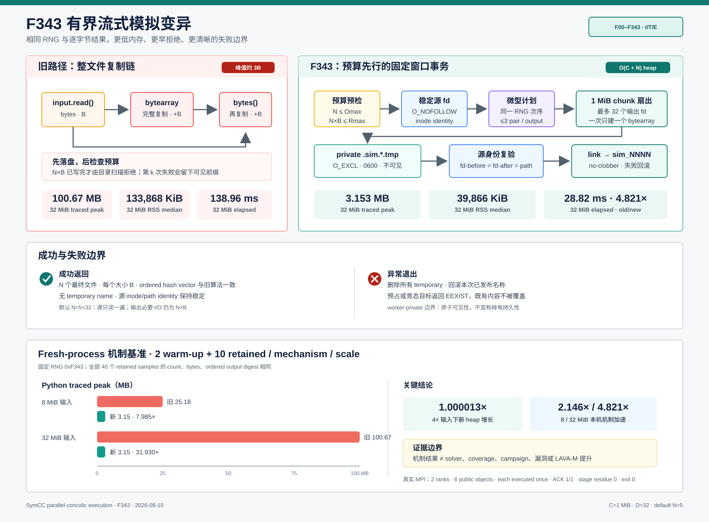

# F343：有界流式模拟变异与失败原子发布

> 日期：2026-08-10  
> 状态：已实现、已回归、已完成真实 Open MPI 与本机机制基准  
> 证据等级：I/T/E-mechanism（实现、测试、机制实验）  
> 适用范围：`mpi_concolic_execution.py --simulate` 的框架性能测试路径



## 1. 摘要

`--simulate` 用普通编译目标代替 SymCC 插桩目标，在目标没有产生求解输出时随机修改输入的 1～3
个字节。它不执行符号求解，主要用于测量 MPI 调度、worker 生命周期、stage、corpus 发布与去重等
框架机制。审查发现旧实现虽然只读取一次源文件，却同时保留：

1. 完整不可变输入 `bytes`；
2. 当前变异的完整 `bytearray`；
3. 写文件前由 `bytes(mutated)` 再创建的一份完整不可变副本。

对大小为 `B` 的输入，单 worker 的 Python payload 峰值可接近 `3B`；默认输入上限为 256 MiB，
多个 worker 并发时会把模拟框架测试变成宿主内存压力测试。旧实现还会先生成全部文件，再由
`_discover_result_files` 判断总结果是否越界；写失败会留下部分 `sim_*` 文件。

F343 把它改为：**预算预检 → no-follow 稳定源快照 → 保持旧随机序列的微型变异计划 → 固定窗口
单遍扇出 → 私有临时文件 → 源身份复验 → no-clobber 原子发布**。默认 5 个输出只读取源一次，
Python 堆峰值由 `O(B)` 降为 `O(C + N)`，其中默认窗口 `C=1 MiB`、输出数 `N=5`；输出字节
仍为必要的 `N×B`，但它们直接进入文件，不再同时驻留于 Python 堆。

## 2. 审查问题

### 2.1 输入大小被每个 worker 放大

旧路径的核心行为等价于：

```python
data = input.read()                 # B
mutated = bytearray(data)           # +B
output.write(bytes(mutated))        # 瞬时再 +B
```

这与 F340/F341 已建立的 result/input streaming admission 不一致：公共输入进入 worker 时已经按
固定块复制，但进入模拟变异后又被整体物化。若有 `W` 个 worker 同时处理接近上限的输入，仅上述
payload 的理论并发规模就接近 `3WB`，还没有计算解释器、solver/target、MPI 和页缓存。

### 2.2 结果预算检查过晚

模拟模式固定生成 5 份与输入等长的文件。旧实现只有在全部写完后再次扫描 output directory 才检查：

- 对象数是否超过 `SYMCC_STANDALONE_RESULT_MAX_OBJECTS`；
- 逻辑总字节是否超过 `SYMCC_STANDALONE_RESULT_MAX_BYTES`。

例如 64 MiB 输入的计划结果是 320 MiB，超过默认 256 MiB 结果预算。旧路径仍会先写完 320 MiB，
再拒绝这项工作，造成可预知的无效 I/O 和临时磁盘压力。

### 2.3 输出不是失败原子的

旧实现直接以最终名称 `sim_0000`、`sim_0001` 等顺序写入。第 `k` 次写失败时，前 `k-1` 个文件
已经可见；直接调用还会覆盖同名文件。worker 最终通常会删除整个 run directory，但 helper 自身没有
“成功返回完整集合，失败不发布本次集合”的局部合同，使测试、复用和错误分析变得脆弱。

### 2.4 源对象没有稳定身份约束

旧式 `open(...).read()` 会跟随最终 symlink，也没有比较读前、读后 descriptor 和最终 pathname。
模拟源通常是 worker 私有文件，风险低于 shared corpus，但同一模块已经建立 no-follow regular inode
合同；让模拟路径成为例外会制造不必要的语义分叉。

## 3. 目标与非目标

### 3.1 目标

- 对输入大小保持固定窗口内存，默认输出数下只读取源一次；
- 与旧实现保持逐次 `randint` 调用顺序和最终字节完全一致；
- 在任何结果文件创建前检查计划对象数与逻辑总字节；
- 拒绝 symlink、目录和不稳定源路径；
- 支持 partial `os.write`，并限制同时打开的输出 descriptor；
- 所有临时文件成功后才发布，失败时回滚本次已经发布的文件；
- 不覆盖预先存在或竞态出现的最终名称。

### 3.2 非目标

- F343 没有改变随机变异分布、路径选择、符号表达式或求解器；
- 不把 `--simulate` 变成 fuzzing havoc engine；
- 不声称提高真实 SymCC campaign 的覆盖率或漏洞发现数量；
- worker-private 临时输出不提供掉电持久性，它只提供进程可见性的原子边界；
- 不以本机 `/tmp`/overlayfs 结果外推 NFS、Lustre 或多主机共享存储。

## 4. 方案设计

### 4.1 前置资源证明

设输入字节数为 `B`、计划输出数为 `N`，配置对象上限为 `Omax`、结果逻辑字节上限为 `Rmax`。
任何文件创建前必须满足：

```text
N <= Omax
N * B <= Rmax
```

Python 整数不会发生定宽乘法溢出。违反任一条件立即抛出 `_ResultBudgetExceeded`，并报告完整计划
需求；output directory 此时尚未创建。`run_symcc` 现在把权威的 `result_max_objects` 和
`result_max_bytes` 显式传给 `_simulate_mutations`，因此预检与后续 discovery/staging 使用同一配置。

### 4.2 稳定 no-follow 源描述符

源文件使用以下 flags 打开：

```text
O_RDONLY | O_NOFOLLOW | O_CLOEXEC | O_NONBLOCK
```

打开后 `fstat` 必须是 regular file，并记录：

```text
(st_dev, st_ino, st_size, st_mtime_ns, st_ctime_ns)
```

全部输出写完后，再比较同一 fd 的 `fstat` 与 `stat(path, follow_symlinks=False)`。inode、大小、mtime、
ctime、路径绑定或实际读取长度任一变化都会抛出 `_SourceSnapshotChanged`，临时结果不会发布。

### 4.3 保持旧随机语义的 mutation plan

每个输出仍严格执行：

1. `randint(1, min(3, B))` 决定修改次数；
2. 每次依次抽取 `randint(0, B-1)` 位置和 `randint(0, 255)` 新值；
3. 允许同一位置重复出现，后一次赋值覆盖前一次。

F343 只把这些抽样先保存为最多 3 个 `(position, value)` pair，不提前复制输入。计划按输出索引顺序
生成；即使输出被分成多个 descriptor batch，跨 batch 的 RNG 调用顺序仍与旧实现一致。

### 4.4 固定窗口、descriptor-bounded 扇出

常量如下：

```text
C = _RESULT_STREAM_CHUNK_BYTES = 1 MiB
D = _SIMULATION_OUTPUT_BATCH_SIZE = 32
```

每批最多打开 `D` 个 `O_EXCL`、mode `0600` 的私有临时文件。源 descriptor rewind 后按 `C` 字节读取：

- 某输出在当前 chunk 没有变异位置时，直接把 immutable chunk 写入该 descriptor；
- 有变异位置时，只为当前输出构造一个 `bytearray(chunk)`，按计划顺序覆盖，再立即写出并释放；
- `_write_all_descriptor` 循环处理合法 partial write，`write<=0` 明确转为 `EIO`。

内层一次只持有一个可变 chunk，不会为所有输出同时保留 `D×C`。默认 `N=5<D`，因此源只读取一遍。
若内部调用未来请求更多输出，源读取遍数为 `ceil(N/D)`，同时打开的 descriptor 仍不超过 `D+1`。

### 4.5 temporary-first 与 no-clobber 发布

所有 batch 完成、descriptor 关闭并通过源身份复验后，才逐项执行：

```text
link(private_tmp, sim_NNNN, follow_symlinks=False)
unlink(private_tmp)
```

同目录 hard link 是原子的，且目标已存在时返回 `EEXIST`，不会像 `replace` 一样覆盖竞态创建者。若第
`k` 项发布失败，异常路径删除本次已经发布的 `1..k-1` 项，再删除所有临时名称。由于 target 已退出且
caller 只在 helper 成功返回后扫描目录，这建立了调用边界上的全有或全无可见性。

这里不执行 file/directory `fsync`：run directory 是 worker 本机的短生命周期暂存，随后还会由 F340
路径复制、hash、fsync 到 job-private staging，再由 master fenced promotion。F343 的 hard-link 边界是
并发/异常原子性，不是 crash durability 声明。

## 5. 复杂度与资源上界

| 指标 | 旧实现 | F343 |
| --- | ---: | ---: |
| Python 大对象峰值 | 约 `3B` | `O(C + N)`；默认约数个 `C` |
| 输出磁盘字节 | `N×B` | `N×B` |
| 源读取字节 | `B` | `B×ceil(N/D)`；默认为 `B` |
| 输出写入字节 | `N×B` | `N×B` |
| 同时打开输出 fd | 1 | `min(N,D)`，默认 5，上限 32 |
| mutation metadata | `O(1)` | 每批最多 `3D` 个 pair |
| 预算失败前落盘 | 最多 `N×B` | 0 |
| 中途失败可见结果 | 可能是前缀 | 成功返回完整集合，否则回滚 |

严格地说，新路径仍保存 `N` 个 destination/temporary pathname，因此是 `O(C+N)`，不能把它表述为对
任意输出数的绝对常量内存。项目默认和 CLI 行为固定 `N=5` 时，它对输入大小 `B` 为常量窗口内存。

## 6. 代码实现

主要实现位于 [`util/mpi_concolic_execution.py`](../../../util/mpi_concolic_execution.py)：

- `_SIMULATION_OUTPUT_BATCH_SIZE`：同时打开输出的硬上界；
- `_write_all_descriptor`：无额外完整副本的 partial-write 循环，也供 result stream copy 复用；
- `_simulation_mutation_plans`：保存旧式 RNG 顺序和重复位置语义；
- `_simulate_mutations`：预算、快照、分批流式生成、源复验、原子发布和回滚；
- `run_symcc`：向模拟路径传入当前权威 result admission limits。

测试位于 [`test/test_mpi_lifecycle.py`](../../../test/test_mpi_lifecycle.py)，覆盖：

- 固定 seed 下 7 个输出与局部重建的旧算法逐字节相同；
- 31-byte chunk、2-output batch 和每次最多 7-byte partial write；
- object/byte budget 在 output directory 创建前拒绝；
- empty、symlink、预占最终名称和 publish-time racer；
- 第二次写失败、源身份变化和第二次 link 失败后的完整清理；
- 8 MiB 输入、5 个输出、64 KiB chunk 的 traced peak 小于 2 MiB。

## 7. 自动化验证

### 7.1 定向与关联回归

```text
test/test_mpi_lifecycle.py
  53 passed + 43 subtests

六个 MPI/distributed/hybrid 相关模块
  342 passed + 70 subtests
```

关联集合包含 distributed state、filesystem qualification、MPI lifecycle、hybrid feedback、AFL profile
orchestration 和 adaptive components，避免仅用 helper 单测支持跨模块兼容性结论。

### 7.2 完整 Python 回归

```text
python3 -m pytest -q -W error test/test_*.py
735 passed + 90 subtests，95.02 s
```

同时通过 Ruff、`py_compile` 和 `git diff --check`。原始日志保存在
[`f343 evidence`](../evidence/f343-bounded-streaming-simulation-2026-08-10/README.md)。

## 8. 真实 Open MPI 证据

证据 driver 使用真实 `mpirun -np 2`、1 master、1 worker 和生产 `--simulate` 路径。输入为一个零字节
值；observer target 对 seed 不产生输出，使 worker 必须进入 F343；对非零 child 则回写原内容，阻止递归
模拟并让 master 的 content-addressed dedup 接管。

结果：

| 指标 | 观测值 |
| --- | ---: |
| return code | 0 |
| wall time | 2.081 s |
| public corpus | 6 个合法 1-byte regular objects |
| generated observations | 10 |
| new interesting objects | 5 |
| analysis observations | 6 |
| 每个 public object 执行次数 | 恰好 1 |
| shutdown ACK | 1/1 |
| staging residue | 0 |
| active/retired epoch | 0/1 |
| 结构检查 | 13/13 true |

这证明 F343 能穿过真实 MPI worker → result discovery → private stage → fenced master publication → dedup →
acknowledged shutdown 全链路。目标是 synthetic observer，不调用 SymCC runtime 或 solver。

## 9. 机制基准

### 9.1 方法

- 输入：本机 overlayfs 上的 8 MiB、32 MiB sparse zero-filled regular file；
- 每次生成 5 个等长输出；
- RNG seed 固定为 `0xF343`；
- 旧/新机制每个尺度先各 warm-up 2 次，再各保留 10 个 fresh-process 样本；
- 每轮交替执行顺序，降低单向缓存/负载顺序偏差；
- 所有 40 个 retained samples 都验证 output count、总字节和 ordered output hash vector；
- `tracemalloc` 是 Python allocator peak，`ru_maxrss` 是 Linux fresh-process peak；
- P95 使用 nearest-rank 定义。

### 9.2 结果

| 输入 | 机制 | elapsed median | elapsed P95 | traced peak median | RSS median |
| ---: | --- | ---: | ---: | ---: | ---: |
| 8 MiB | 旧 read-all | 22.789 ms | 24.027 ms | 25.176 MB | 66,968 KiB |
| 8 MiB | F343 | 10.617 ms | 10.970 ms | 3.153 MB | 40,098 KiB |
| 32 MiB | 旧 read-all | 138.964 ms | 141.787 ms | 100.673 MB | 133,868 KiB |
| 32 MiB | F343 | 28.822 ms | 29.619 ms | 3.153 MB | 39,866 KiB |

派生比率：

| 输入 | Python heap 旧/新 | RSS 旧/新 | elapsed 旧/新 |
| ---: | ---: | ---: | ---: |
| 8 MiB | 7.985× | 1.670× | 2.146× |
| 32 MiB | 31.930× | 3.358× | 4.821× |

输入放大 4× 时，旧 traced peak 增长 `3.9988×`，F343 仅增长 `1.000013×`；旧 RSS 增长
`1.9990×`，F343 为 `0.9942×`。新路径在该主机上不仅降低内存，还因为消除了整文件
`bytearray → bytes` 复制而取得机制级加速。该时间结果不能外推真实 campaign：真实 SymCC 通常由 target
执行和 solver 主导，且模拟模式本身不执行求解。

## 10. 正确性不变量

F343 成功返回时满足：

```text
len(outputs) = N
forall i: basename(outputs[i]) = sim_%04d(i)
forall i: size(outputs[i]) = B
sum(size(outputs)) = N * B <= Rmax
output[i] = legacy_mutation(input, identical_rng_prefix, i)
source_identity_before = source_identity_after = path_identity_after
temporary_names = empty
```

F343 抛出异常时满足局部 best-effort rollback 合同：

```text
temporary_names = empty
published_by_this_call = empty
pre-existing_or_racing_destination is never overwritten
```

若底层 `unlink` 本身持续失败，和任何本地 filesystem cleanup 一样，进程无法证明物理残留已经消失；
worker 外层仍会删除整个 private run directory。这一异常中的异常没有被宣称为 Byzantine storage 容错。

## 11. 创新性与系统意义

F343 不是新的符号执行算法。其研究价值在于把此前只用于“性能测试”的辅助路径纳入与生产 admission
一致的资源和失败模型：

1. **语义保持型系统重构**：用确定性 output vector 证明随机行为不变，而不是以更换策略掩盖差异；
2. **计划先于副作用**：对象/字节预算从事后目录扫描前移到文件创建前，形成可证明的 admission gate；
3. **双重有界**：chunk 限制 Python heap，descriptor batch 限制 fd；二者分别处理不同资源维度；
4. **稳定源与事务式可见性组合**：输入身份闭合后才发布完整输出集合，减少模拟路径对 worker 状态机的特殊假设；
5. **可复现实验闭环**：单测证明逐字节语义和异常边界，fresh-process 基准证明资源 scaling，真实 MPI
   证明系统集成，三种证据不互相替代。

这使后续大输入、多 worker 的 MPI 调度实验不再被测试替身自身的线性 Python 内存放大污染，提高性能
测量的内部有效性。

## 12. 局限与后续工作

- 当前随机策略仍是简单的 1～3 byte overwrite，不代表 AFL++ havoc、RedQueen 或 solver-guided mutation；
- benchmark 使用 sparse zero input 和热本地存储，没有测冷缓存、磁盘限速或多 NUMA worker；
- 机制测试固定 `N=5`；`N>32` 会增加源读取 pass，以 fd 上界换取读取带宽；
- hard-link publication 假设 worker 临时文件系统支持同目录 hard link；项目的 Linux/Open MPI 环境满足，
  但未对非 POSIX 本地文件系统提供兼容降级；
- `tracemalloc` 不统计 kernel page cache、MPI/native allocator 或 target 子进程内存；RSS 指标补充但不能分解来源；
- 真实 MPI 是同一物理主机、synthetic observer target，无 solver、覆盖率、bug 或 LAVA-M uplift 结论；
- 可进一步把 simulation RNG seed 暴露为显式实验配置，增强跨运行 corpus 的完全复现性；当前单测和机制
  基准已通过注入 `random.Random(seed)` 固定随机序列，生产 CLI 仍保持原来的非确定随机行为。

## 13. 证据索引

- 生产代码：[`util/mpi_concolic_execution.py`](../../../util/mpi_concolic_execution.py)
- 测试：[`test/test_mpi_lifecycle.py`](../../../test/test_mpi_lifecycle.py)
- 机制图：[`bounded-streaming-simulation-2026-08-10.svg`](../diagrams/bounded-streaming-simulation-2026-08-10.svg)
- 证据说明：[`evidence README`](../evidence/f343-bounded-streaming-simulation-2026-08-10/README.md)
- benchmark raw data：[`simulation-mutation-cost.json`](../evidence/f343-bounded-streaming-simulation-2026-08-10/simulation-mutation-cost.json)
- MPI raw data：[`streaming-simulation-mpi.json`](../evidence/f343-bounded-streaming-simulation-2026-08-10/streaming-simulation-mpi.json)
- 完整证据 manifest：[`SHA256SUMS.txt`](../evidence/f343-bounded-streaming-simulation-2026-08-10/SHA256SUMS.txt)
