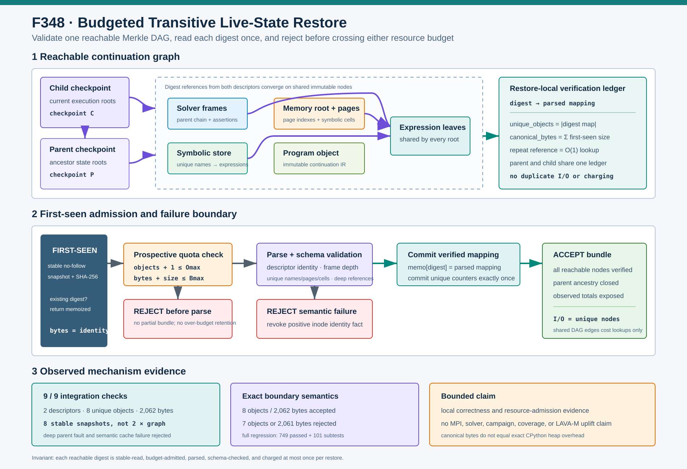

# F348：Budgeted Transitive Live-State Restore

> 功能编号：`F348`  
> 日期：`2026-08-10`  
> 状态：已实现；定向、相关、完整回归与生产原语机制验证完成



## 1. 研究背景与审查结论

F347 将 executable continuation 的所有 JSON 对象统一到可验证 CAS，并保证每次读取的摘要、inode
identity 与 JSON 消费来自同一稳定 snapshot。进一步审查恢复路径后发现：**单对象有界且可信，不等于整个
可达状态图有界且完整**。

一个 checkpoint 是 Merkle DAG 的根。descriptor 可以引用 parent checkpoint、solver-frame chain、
symbolic store、memory root 和 program；frame、store、page 又可共同引用 expression。F347 前后的
`restore_continuation()` 仍存在四个系统性缺口：

1. 只有单对象 `max_object_bytes`，没有一次恢复的唯一对象总数和累计规范字节预算；大量合法小对象仍可使
   恢复时间和内存无界增长；
2. parent descriptor 仅作为一个存在且 schema 正确的对象验证，其祖先根和子图没有在当前恢复事务中闭合；
3. memory root 只通过 `has_object(page_digest)` 证明 page 名称存在，没有要求对象是 memory-page schema，
   更没有在交付 bundle 前验证其 symbolic expression leaves；错误会延迟到某次实际内存读取才暴露；
4. 同一 expression/page/root 被多个 checkpoint 或结构引用时会重复稳定读取、解析和校验，资源成本按边而非
   按唯一节点放大。

此外，`_get_mapping()` 在 SHA-256 通过后、JSON/schema 解析前就登记 positive inode identity。无效 JSON
或错误 schema 虽然不会进入执行器，却会留下与“读取成功”不一致的正向 cache 事实。

F348 将一次 restore 明确定义为：**对当前 checkpoint 及其完整 parent ancestry 所能到达的状态 Merkle DAG
执行一个有预算、去重、失败关闭的验证事务**。

## 2. 目标与形式化不变量

令 `R` 为当前 checkpoint，`Reach(R)` 为沿 parent 和所有状态引用可达的内容摘要集合，`bytes(v)` 为对象
`v` 的 canonical JSON 长度。配置上限为 `Omax` 和 `Bmax`：

```text
unique_objects(R) = |Reach(R)| <= Omax
canonical_bytes(R) = sum(bytes(v) for v in Reach(R)) <= Bmax

for every v in Reach(R):
  stable_no_follow_sha256(path(v)) = v
  schema(v) = schema required by incoming reference
  semantic_structure(v) is valid
  read_count(v) = charge_count(v) = 1 per restore
```

恢复只在全部不变量成立后生成 `LiveContinuationBundle`。任何配额、摘要、schema、parent identity、链深度、
重复逻辑键或深层引用错误都终止整个事务，不返回部分 bundle。

## 3. 设计：restore-local 验证账本

### 3.1 两个独立预算

`LiveStateStore` 新增：

| 参数 | 默认值 | 语义 |
| --- | ---: | --- |
| `max_graph_objects` | 262,144 | 一次恢复最多接纳的唯一摘要数 |
| `max_graph_bytes` | 268,435,456 | 唯一对象 canonical JSON 长度之和 |

二者必须是正整数，布尔值、浮点数、零和负数均被库接口拒绝。MPI frontend 使用同一环境解析函数：

- `SYMCC_LIVE_GRAPH_MAX_OBJECTS`：范围 `1..10,000,000`；
- `SYMCC_LIVE_GRAPH_MAX_BYTES`：范围 `1..1,099,511,627,776`。

缺失或非法环境值回到默认值，有限越界值被夹紧；master 和 worker 构造 `LiveStateStore` 时消费完全相同的
结果。`symcc_live_state.py` 也提供 `--max-graph-objects` 与 `--max-graph-bytes`。

对象数预算防止“大量微小节点”，字节预算防止“少量巨大节点”。两者不能互相替代。

### 3.2 唯一摘要 memoization

每次 `restore_continuation()` 创建独立 `_LiveStateTraversalBudget`：

```text
digest -> parsed mapping
object_count = number of mapping keys
canonical_bytes = sum of first-seen object lengths
```

首次遇到摘要时执行稳定 no-follow snapshot、SHA-256、预算预检、JSON/schema 解析和语义验证；成功后才将
mapping 与计数一起提交。再次遇到相同摘要时直接返回已验证 mapping，并重新检查调用点要求的 schema。

这等价于 restore 作用域内的 hash-consing：共享的 expression、program、page 或 root 只支付一次 I/O、
摘要和 JSON 解析成本。memo 不跨 restore 传播，因此不会把旧事务的可达性或 schema 结论错误复用于后来
可能不同的恢复边界。

### 3.3 前瞻式预算准入

新节点在稳定读取并验证摘要后、JSON parse 前执行：

```text
if object_count + 1 > Omax: reject
if canonical_bytes + len(content) > Bmax: reject
```

因此系统仍需读取并哈希当前对象，才能证明其名称和长度属于哪个节点，但不会解析或把超过图预算的下一个
mapping 保留在 restore ledger 中。预算恰好等于实际图大小时允许通过，少一个对象或少一个字节时确定性
失败，没有模糊的 `>=` 边界。

## 4. 传递闭包验证流程

### 4.1 Checkpoint ancestry

1. 稳定读取当前 descriptor，并要求 canonical `checkpoint_id()` 等于请求 ID；
2. 沿 `parent` 逐项读取，每个 parent 都必须是 continuation schema，且其 canonical ID 等于引用摘要；
3. 用 checkpoint digest 集合拒绝 parent cycle；
4. 对每个祖先 descriptor 验证其 solver/store/memory/program 子图；
5. 最后物化当前 descriptor 的 solver frames、symbolic store 与 memory page 索引。

parent 与 child 若共享根，ledger 直接命中已有摘要，不重复读取。这样 ancestor integrity 与增量状态复用同时
成立。

### 4.2 Solver 与 symbolic store

Solver frame 恢复继续验证 cycle、最大 65,536 帧和连续 depth，并新增恢复侧每帧最大 65,536 assertions
检查。所有 assertion 必须是 expression schema；重复 assertion 在约束语义中可能有意义，因此允许，但
expression object 只计费一次。

Symbolic store 恢复验证：

- `entries` 必须为 list 且不超过 1,000,000 项；
- 每项必须是二元 `[name, digest]`；
- name 非空、长度不超过 256，且同一 store 中唯一；
- digest 必须是 64-hex，并指向 expression schema。

旧路径会把重复 name 交给后续 `dict()`，产生“后项静默覆盖前项”的隐含语义；F348 改为失败关闭。

### 4.3 Memory root、page 与 expression leaves

恢复当前或祖先 continuation 时，memory root 不再只检查 page 名称存在，而是调用 `_get_memory_page()` 深度
验证每一页：

1. root 的 page size 必须匹配 store；size 必须非负；
2. page index 非负、唯一，且 `index * page_size < size`；
3. digest 必须指向 memory-page schema；
4. concrete hex 必须恰好解码为一个 page；
5. symbolic cell 数不超过 page size，offset 合法且唯一；
6. 每个 symbolic digest 必须指向 expression schema。

这修复了“错误 schema page 在 checkpoint restore 时通过，直到后续命中该页才报错”的延迟故障。

### 4.4 Cache 失败语义

positive identity 现在只在 digest、JSON mapping 和调用点 schema 全部通过后登记。JSON 解码失败、顶层不是
mapping 或 schema 不符都会撤销该对象旧 identity。该 cache 仍表达“此 inode 已被当前内容验证”，而不再
在语义失败后残留容易误读的成功事实。

## 5. 实现与接口变化

主要实现位于：

- `util/distributed_state.py`
  - `_LiveStateTraversalBudget`：预算、计数和 digest mapping memo；
  - `LiveStateStore._get_mapping(..., _budget=...)`：first-seen 准入与复用；
  - `restore_solver_frames/restore_symbolic_store`：传递预算和结构验证；
  - `_get_memory_root/_get_memory_page`：深层 page/expression 验证；
  - `restore_continuation`：parent ancestry 与完整可达图闭合；
  - `LiveContinuationBundle.graph_object_count/graph_canonical_bytes`：观测结果。
- `util/mpi_fuzzing_helper.py`
  - `_live_state_graph_limits()`：master/worker 共用的有界环境配置；
- `util/symcc_live_state.py`
  - CLI 预算参数和 `graph_verification` 输出。

磁盘 schema、canonical JSON、SHA-256、`.json` 路径、checkpoint ID 和 page layout 均未改变。Bundle 仅在末尾
增加带默认值的观测字段，保持直接构造兼容性。

## 6. 测试设计与精确结果

### 6.1 单元测试

新增测试覆盖：

- 两层 parent/child 共享 solver/store/memory/program 的 DAG；
- 重复 expression 引用只触发一次稳定 snapshot 和一次预算计费；
- exact 对象/字节预算通过，分别减一后失败；
- parent 子图中的 wrong-schema memory page 在 child restore 时被发现；
- 重复 symbolic name 被拒绝；
- 合法摘要但非法 JSON 被拒绝且 identity cache 清空；
- 构造参数严格类型检查；
- MPI master/worker 环境默认、非法回退和上限夹紧一致；
- CLI 输出的观测计数与 bundle 一致。

结果：

- 定向：**4 passed + 4 subtests**，208 deselected，0.63 s；
- `test_distributed_state.py`：**153 passed + 18 subtests**，15.19 s；
- `test_distributed_state.py + test_mpi_lifecycle.py`：**212 passed + 65 subtests**，16.20 s；
- 六模块相关：**356 passed + 81 subtests**，17.20 s；
- 完整 `test/test_*.py`：**749 passed + 101 subtests**，94.35 s。

相对 F347 的完整 `745 + 97`，新增 4 个测试和 4 个 subtests，无既有失败。

### 6.2 生产原语集成

确定性集成建立两层 checkpoint ancestry。parent 与 child 共享 expression、solver frame、symbolic store、
memory root/page 和 program：

| 观测 | 精确值 |
| --- | ---: |
| parent-chain descriptors | 2 |
| unique graph objects | 8 |
| canonical graph bytes | 2,062 |
| stable snapshot reads | 8 |
| exact limit | 8 objects / 2,062 bytes，通过 |
| object underflow | 7 objects，拒绝 |
| byte underflow | 2,061 bytes，拒绝 |

另外构造仅从 parent 可达的 wrong-schema page、重复 symbolic name 和合法摘要非法 JSON。三者都在 bundle
交付前失败，最后一项的 positive identity cache 为空。集成共 **9/9 checks true**，无 temporary 残留。

## 7. 复杂度与预期收益

令 `V` 为唯一可达对象数，`E` 为引用边数，`B` 为唯一对象 canonical bytes 总和：

| 阶段 | 时间 | Restore-local 额外空间 |
| --- | --- | --- |
| 稳定读取、摘要、JSON parse | `O(B)` | `O(B)` 量级的 parsed mappings |
| 结构与引用遍历 | `O(E)` | `O(V)` digest index / cycle sets |
| 重复摘要引用 | 均摊 `O(1)` | 无重复 mapping |
| 预算判断 | 每个首次摘要 `O(1)` | 常数计数器 |

与旧路径按引用边重复读取相比，具有高共享率的增量 checkpoint ancestry 从“每条边可能重复 I/O”收敛为
“每个唯一摘要一次 I/O”。集成中的两层共享图是 8 次 snapshot，而不是两份子图之和。

这只是确定性机制观测，不是吞吐基准；当前没有真实 campaign 数据证明速度、coverage 或漏洞发现提升。

## 8. 先进性、创新性与挑战性

- **Merkle DAG 级资源治理**：配额从单对象扩展到一次恢复的唯一内容闭包，适配增量符号状态的共享结构；
- **验证与计费同索引**：digest memo 同时承担 hash-consing、schema 证明复用和资源账本，避免三套状态分叉；
- **exact-boundary admission**：前瞻式 `+1/+size` 检查给出可测试的精确边界，不靠异常内存耗尽兜底；
- **ancestry-aware closure**：parent 不再只是可信名称，祖先状态根也进入当前恢复事务；
- **deep typed references**：从 memory-root 名称存在性提升为 page 和 symbolic-expression 的逐层类型闭合；
- **negative-knowledge discipline**：语义失败同步撤销 inode 正向事实，缓存含义与 API 成功语义一致；
- **format-preserving deployment**：不迁移对象、ID 或 checkpoint，运行时和 CLI 可独立设置预算。

挑战在于既要沿完整 ancestry 深度验证，又不能使高度共享的增量状态按 checkpoint 数重复付费；还必须保证
预算在 parser 扩张之前判定、schema 在具体引用点检查，并保留重复 assertion 等合法语义。

## 9. 局限与有效性威胁

1. canonical-byte 预算统计序列化输入长度，不是 CPython dict/string 的精确 heap 占用；对象数预算共同降低但
   不能消除表示膨胀差异。
2. 引用边没有独立显式计数器；边本身受其所在 JSON 的单对象和全图字节预算间接约束。
3. program 在 store 层验证摘要与 schema，具体 continuation IR 结构仍由 `LiveContinuationExecutor` 验证。
4. restore-local memo 不跨进程或跨恢复共享；这是为了避免长期 cache 一致性和无界驻留。
5. F347 的父目录解析限制仍存在；F348 没有实现 directory-fd/openat2 根能力。
6. 本地机制集成没有执行真实 MPI、target、`afl-showmap`、solver 或 fuzzing campaign，不声称 throughput、
   coverage、bug-discovery 或 LAVA-M 提升。

## 10. 后续研究方向

1. directory-fd/openat2 anchored object namespace，闭合 CAS 父路径替换；
2. 加入解析后结构权重或受控 streaming JSON parser，更紧地逼近真实 heap；
3. 输出 restore 拒绝原因、共享率、unique bytes 和 memo hit 遥测，驱动自适应 checkpoint 粒度；
4. 在真实 MPI 和共享存储上测量 ancestry 深度、DAG 共享率、恢复延迟和峰值 RSS；
5. 研究带 lease 的已验证 mapping cache，使跨任务复用仍保持版本和容量边界。

## 11. 证据索引

- 生产实现：`util/distributed_state.py`、`util/mpi_fuzzing_helper.py`、`util/symcc_live_state.py`
- 单元测试：`test/test_distributed_state.py`、`test/test_mpi_lifecycle.py`
- 示意图：`../diagrams/budgeted-transitive-live-state-2026-08-10.svg`
- 集成结果：`../evidence/f348-budgeted-transitive-live-state-2026-08-10/graph-budget-integration.json`
- 复现脚本：`../evidence/f348-budgeted-transitive-live-state-2026-08-10/run_graph_budget_integration.py`
- 测试日志与边界：`../evidence/f348-budgeted-transitive-live-state-2026-08-10/`
- 完整性清单：`../evidence/f348-budgeted-transitive-live-state-2026-08-10/SHA256SUMS.txt`
