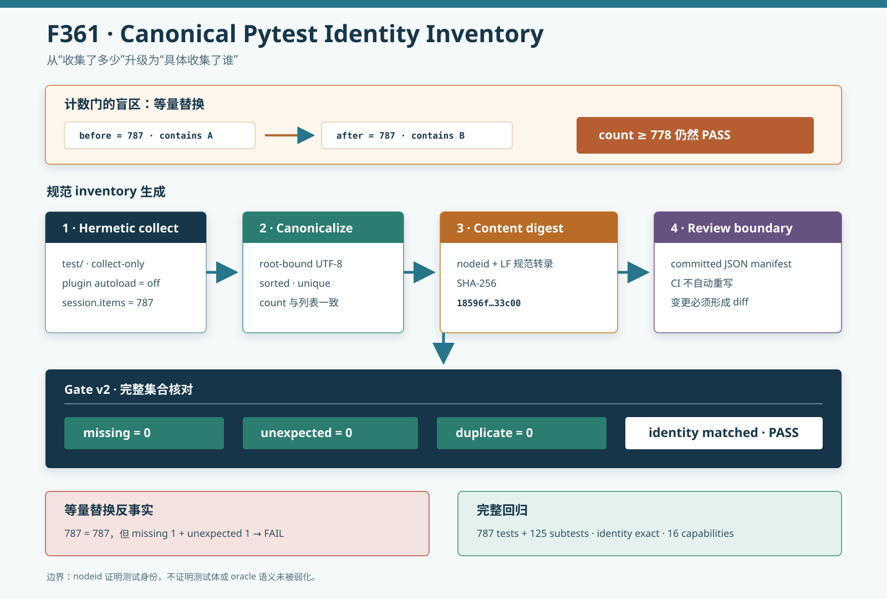

# F361：Canonical Pytest Identity Inventory

- 功能编号：F361
- 日期：2026-08-10
- 状态：已实现、已完成真实等量替换反事实、空环境复核与完整回归
- 范围：pytest 测试身份、collection 完整性、插件环境隔离和 CI 审查边界



## 1. 从 F360 继续发现的问题

F360 以 `min_collected=778` 阻止测试总数明显下滑，但计数不是测试身份。设基线包含测试 A，变更删除 A 并新增
无关测试 B，则变更前后都可能收集 787 项；collection floor、零 skip 和 pytest exit 0 都会通过。这类**等量替换**
会丢失原有行为覆盖，却不改变任何计数。

F360 报告已经把这一点列为有效性威胁。F361 将测试所有权从一个整数提升为版本化 node-id 集合：每个测试类、
函数和参数实例的 pytest nodeid 都进入 committed manifest；CI 比较完整集合，而不只比较集合基数。

## 2. 目标与不变量

F361 建立八条不变量：

1. inventory 只包含 F359 所定义的项目根 `test/`；
2. nodeid 必须是非空、有界、无 NUL/换行且位于声明根之下的 UTF-8 字符串；
3. nodeid 列表必须按字典序排列且无重复；
4. `count` 必须等于列表长度；
5. `nodeids_sha256` 必须等于规范行编码的 SHA-256；
6. CI 默认要求 missing、unexpected 和 observed duplicate 三类数量均为零；
7. 自动第三方 pytest 插件加载默认关闭，插件必须显式声明和 `-p` 启用；
8. inventory 只能作为版本化文件经代码审查更新，CI 不得自动重写基线。

collection floor 继续保留。它能在 manifest 读取失败之外提供独立数量下界，并使定向运行的意外空收集更容易归因；
identity inventory 则封堵“数量相同、测试不同”的缺口。

## 3. Manifest 规范

`test/pytest-nodeids.json` 使用 `symcc-pytest-nodeid-manifest-v1`：

```json
{
  "schema": "symcc-pytest-nodeid-manifest-v1",
  "root": "test",
  "count": 787,
  "nodeids_sha256": "18596f...33c00",
  "nodeids": ["test/...::test_...", "..."]
}
```

规范摘要输入不是整个 JSON 文件，而是排序后每个 nodeid 加一个 LF 的 UTF-8 字节串：

```text
SHA256(nodeid_0 || LF || nodeid_1 || LF || ... || nodeid_n || LF)
```

因此 node-list 摘要是 `18596f8387a8df5af2a1ead7cc829e9c95c1bb9e699f26d916e0f1a0de833c00`，
整个 JSON 文件摘要则是 `0899575ec9311ede8636b6eea97aed3b35d7b01a2907d78b4236bdc578168144`。
两者不同是预期语义：后者还覆盖 schema、root、count、JSON 标点和内嵌摘要。

读取端严格要求字段集合精确匹配 v1 schema，拒绝未知字段、错误类型、非规范 root、越界文件、乱序、重复、root
外 nodeid、count 不一致和摘要不一致。错误在 pytest 执行前成为 gate preflight failure，返回码为 2。

## 4. 生产生成器

新增 `util/python_test_inventory.py`。生成流程为：

1. 默认设置 `PYTEST_DISABLE_PLUGIN_AUTOLOAD=1`；
2. 强制加入 `--collect-only`，不执行测试体；
3. 通过 `pytest_collection_finish(session)` 读取权威 `session.items`；
4. 拒绝 collection error、deselection 和低于历史下界的收集；
5. 验证 root、字符、长度、唯一性并排序；
6. 计算规范 node-list 摘要；
7. 用临时文件加 `os.replace` 原子提交 manifest。

默认禁用 terminal 与 cacheprovider 插件，所以成功输出只有 count 和摘要，不把 787 个 nodeid 重复打印到 CI 或终端。
生成器连续两次对当前工作树运行，两个 JSON 字节完全一致。

## 5. Gate v2 身份准入

`util/python_test_gate.py` 升级为 `symcc-python-test-gate-v2`。它在 F360 的 capability 与结果门基础上新增：

- `--require-nodeid-manifest`：指定 committed inventory；
- `--max-missing-nodeids`：允许缺失的历史身份数，CI 为 0；
- `--max-unexpected-nodeids`：允许未登记身份数，CI 为 0；
- observed duplicate 永远失败，不提供放宽参数；
- JSON 同时记录 expected/observed 数量、两侧摘要、三类差异、manifest 错误和截断状态。

比较使用完整内部 nodeid；机器可读差异最多保留每类 1024 条、每条 512 字符，并另存精确计数，避免异常收集生成
无界 artifact。manifest 未启用时 gate 仍可支持开发者定向运行，但 CI 始终启用精确身份门。

## 6. 插件环境隔离

nodeid 可能受 collection 插件影响。当前 venv 的 `pytest11` entry-point inventory 为空，125 个 subtest 由 pytest
9.1.1 内置 `_pytest.subtests` 提供；但未来新增依赖仍可能带入自动插件。F361 因此在生成器、gate 和
`python_quality` job 三处设置 `PYTEST_DISABLE_PLUGIN_AUTOLOAD=1`。

这不会禁止 pytest 内置插件，也不会阻止命令行显式 `-p <plugin>`。若项目以后确实需要第三方插件，必须把包加入
`requirements-test.txt`、在命令中显式启用，并重新审查 inventory 差异，环境变化不再隐式发生。

## 7. 等量替换反事实

生产反事实从真实 manifest 复制 787 个 nodeid，删除第一个真实测试身份，并加入一个同根但不存在的 replacement，
随后重新排序、重算摘要，得到**结构与摘要均合法、数量仍为 787**的 manifest。

| 场景 | expected | observed | floor | missing | unexpected | 结果 |
|---|---:|---:|---:|---:|---:|---|
| committed manifest | 787 | 787 | 778 | 0 | 0 | PASS / exit 0 |
| equal-count replacement | 787 | 787 | 778 | 1 | 1 | FAIL / exit 1 |

两路都通过 pytest 真实 collect-only hook，并且 collection floor 都满足。只有 identity set difference 能区分它们，
直接证明 F361 修复的不是抽象风险，而是 F360 数量门无法表达的真实反例。

## 8. 防回退契约

`test/test_python_test_gate.py` 从 6 项扩展为 9 项，新增：

1. 生产生成器创建合法 manifest，gate 对精确 collection 通过且两侧摘要一致；
2. 一个测试被另一个测试等量替换时，gate 报告 1 missing + 1 unexpected；
3. 内嵌摘要被篡改时，在 pytest 运行前返回 2，`collected=0`。

既有 capability、普通/subtest skip、重复 subtest label、collection floor 和工作流静态契约继续通过。

## 9. 验证结果

| 验证层 | 结果 |
|---|---:|
| inventory 连续重建 | 787 nodeids，JSON 字节一致 |
| committed identity collect-only | 787/787，摘要相同，PASS |
| equal-count replacement | 787/787，但 1 missing + 1 unexpected，FAIL |
| 空 Python 3.12 venv identity check | 787/787，摘要相同，PASS |
| F361 定向契约 | 9 passed（1.31 秒） |
| Ruff / `py_compile` / actionlint 1.7.7 | 全部 PASS |
| 完整 capability + identity gate | 787 passed + 125 subtests（96.38 秒） |
| 完整结果退化 | 0 failed/skip/xfail/xpass/deselected/collection error |
| 完整身份退化 | 0 missing/unexpected/duplicate，摘要精确相同 |

完整门禁仍前检 F360 的 10 个命令、5 个 Python 模块和 1 个动态库，16 项均存在。测试总数从 F360 的 784 增至
787，恰好来自三项新 inventory 契约；不是发现算法覆盖提升。

## 10. 实现与证据位置

- `util/python_test_inventory.py`：规范、严格 reader、原子 writer 与 collect-only 生成器；
- `util/python_test_gate.py`：gate v2 与 identity set admission；
- `test/pytest-nodeids.json`：committed 787-node review boundary；
- `test/test_python_test_gate.py`：9 项正反契约；
- `.github/workflows/run_tests.yml`：精确 manifest、零身份差异与插件隔离；
- `docs/Testing.txt`：更新流程和禁止 CI 自动重写原则；
- `docs/codex/evidence/f361-canonical-pytest-inventory-2026-08-10/`：真实/反事实 JSON、日志与清单；
- `docs/codex/diagrams/canonical-pytest-identity-inventory-2026-08-10.svg`：身份准入示意图。

## 11. 工程价值与先进性边界

F361 把测试发现从 cardinality assertion 提升为 versioned semantic ownership inventory。它结合 hermetic plugin
loading、canonical serialization、content digest、set reconciliation 和 reviewable baseline，使 CI 能明确回答
“哪一个历史测试消失、哪一个新测试出现”，而不仅是“今天一共有多少测试”。这与科研 artifact manifest 的思想
一致，也为后续按技术族做影响分析和选择性回归提供基础。

它是测试完整性和可复现实验基础设施，不是符号执行算法 SOTA。nodeid 是测试身份代理，不是测试语义证明；不能从
identity match 推导程序正确性、覆盖提升或漏洞发现能力。

## 12. 局限与有效性威胁

1. 保持相同 nodeid 但删除断言、弱化 oracle 或改变 fixture 语义时，inventory 不会发现，仍需 review 和 mutation
   testing；
2. 测试重命名即使语义等价也会产生 missing/unexpected，需要有意更新 manifest；
3. SHA-256 用于一致性和内容寻址，不是签名，能修改仓库的人也能重写 manifest；
4. 当前稳定性证据来自同一 Ubuntu/Python/pytest 主版本，跨 pytest 主版本必须重新审计；
5. 本轮未触发 GitHub 托管 runner，也未运行 LLVM lit、QSYM/PIN、真实 MPI、solver/coverage campaign、公开
   benchmark 或 LAVA-M；
6. 96.38 秒为单次完整回归，不是与 F360 的性能对照，不报告加速或退化。

## 13. 后续计划

1. 将 manifest 差异生成审查摘要，按删除、重命名候选、参数变化和新增技术族分组；
2. 研究基于测试源/fixture/被测符号依赖的 semantic fingerprint，补足 nodeid 不感知测试体弱化的边界；
3. 在真实 GitHub Actions run 中保存 gate v2 artifact、workflow run URL 和 artifact digest；
4. 为 LLVM lit 与 QSYM 原生套件建立各自独立的身份 inventory，不混入父项目 pytest 生命周期。

## 14. 结论

F361 修复了 collection floor 无法识别等量测试替换的完整性缺口。生产生成器建立 787 项排序唯一、摘要绑定的
committed nodeid manifest；gate v2 对真实 collection 做 missing/unexpected/duplicate 三路集合核对，并关闭
隐式第三方插件加载。真实等量替换反事实在 expected/observed 都为 787、floor 已满足的情况下被准确拒绝为
1 missing + 1 unexpected。空 venv 和完整 `787 passed + 125 subtests` 回归均得到同一摘要且零身份退化。
这些证据支持测试身份与本地可复现性结论，不支持测试体语义证明、远端 CI 已通过或符号执行性能提升。
