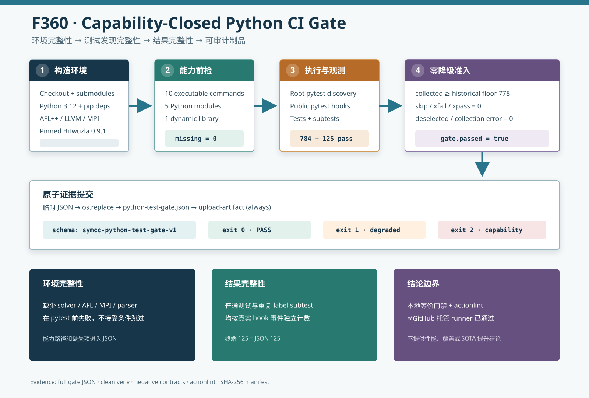

# F360：Capability-Closed Python CI Gate

- 功能编号：F360
- 日期：2026-08-10
- 状态：已实现、已完成本地等价门禁与依赖重建验证；尚未取得 GitHub 托管 runner 运行结果
- 范围：Python 测试依赖、CI 能力闭包、pytest 结果完整性和机器可读证据



## 1. 研究背景与审查发现

F359 使仓库根 `python3 -m pytest` 稳定进入父项目 `test/`，但它只解决“发现哪些测试”，没有解决“谁会持续运行
这些测试”。继续审查 `.github/workflows/run_tests.yml` 与依赖清单后发现三个相互关联的问题：

1. GitHub Actions 只有 Docker/CMake 构建和 LLVM 兼容性 job，没有 job 消费已经存在的 778 项 Python 回归；
2. `requirements.txt` 没有声明 pytest，当前机器的绿色结果依赖预先存在的开发环境；
3. 多个集成测试以 `skipUnless` 表达 solver、AFL++、LLVM、OpenSSL、tree-sitter、MPI 和系统 `libz3` 能力缺失。
   普通 `pytest` 在依赖退化时仍可能 exit 0，形成“绿色但实际少测”的结果。

因此，F359 的 hermetic discovery 仍没有成为可复现的持续门禁。F360 的目标不是增加一个裸 pytest step，而是让
CI 同时证明测试环境具备预期能力、测试规模没有收缩、结果没有被 skip/xfail/deselect 静默降级，并保存可审计
证据。

## 2. 设计目标与不变量

F360 建立以下门禁不变量：

1. pytest 版本由独立测试依赖文件声明，并在 CI 中固定主版本范围；
2. 系统命令、Python 模块和动态库在测试前显式检查，缺失能力不能退化为 skip；
3. 收集数量不得低于经验证的历史下界 778，但允许新增测试自然增长；
4. 普通测试和 `unittest.subTest()` 的 skip 总数必须为零；
5. xfail、xpass、deselection、collection error 和 pytest 非零退出均使门禁失败；
6. 无论通过还是失败，均原子生成同一 schema 的 JSON，并由 CI `always()` 上传；
7. 默认根发现仍由 F359 的 `pytest.ini` 管理，F360 不用 `--ignore` 或测试过滤制造绿色结果。

门禁的严格性是当前 `python_quality` job 的实验契约，不要求所有开发者的临时定向测试都达到 778 项。开发者可用
较小 collection floor 执行显式模块，但必须有意声明它。

## 3. 执行流程

### 3.1 CI 环境构造

`python_quality` job 在 `ubuntu-24.04` 上按以下顺序执行：

1. `actions/checkout@v4` 递归取得子模块；
2. `actions/setup-python@v5` 提供 Python 3.12，并按两份 requirements 建立 pip cache；
3. apt 安装编译器、AFL++、LLVM、OpenMPI、OpenSSL、cvc5、Z3、GMP/MPFR、Meson 与 Ninja；
4. pip 安装运行依赖和 `requirements-test.txt`；
5. 用现有安装脚本构建并缓存固定版本 Bitwuzla 0.9.1；
6. 执行 capability preflight；
7. 通过 pytest 公共 hook 运行无路径根套件并记录结果；
8. 应用零降级约束，原子写入 `python-test-gate.json`；
9. `if: always()` 上传 JSON，门禁自身失败时仍保留诊断。

工作流还显式设置 `permissions: contents: read`，并用 workflow/ref 级 concurrency 取消同一引用的旧运行，减少无意义
资源占用。Bitwuzla cache key 绑定平台、架构和安装脚本摘要，脚本发生变化时不会复用旧前缀。

### 3.2 能力闭包

| 类型 | CI 必须存在的能力 | 所覆盖的测试路径 |
|---|---|---|
| 命令（10） | `cc`、`z3`、`cvc5`、`bitwuzla`、`afl-clang-fast`、`afl-showmap`、`mpiexec`、`openssl`、`opt`、`llvm-diff` | 原生编译、QF_BV 三求解器、AFL map、MPI、artifact 签名和跨 LLVM replay |
| Python 模块（5） | `mpi4py`、`tree_sitter`、`tree_sitter_json`、`lark`、`parglare` | MPI 控制、增量解析、SPPF/歧义森林 |
| 动态库（1） | `libz3` | 基于 `ctypes` 的 schedule/SMT 集成 |

pytest 本身在 gate 脚本导入阶段就是硬依赖，由 `requirements-test.txt` 提供；若不存在，gate 无法启动，CI step 直接
失败。`pytest>=9.0,<10` 保持一个主版本范围，避免 hook 与 subtest 报告语义在 CI 中无审查漂移。

### 3.3 结果采集与退出语义

`util/python_test_gate.py` 注册 `PytestGateRecorder`，使用 pytest 的 collection、deselection、collect-report 和
runtest-report hooks 记录：

- collected、deselected；
- passed、failed、skipped；
- xfailed、xpassed；
- subtests passed/failed/skipped；
- collection errors 与有界原因文本。

退出语义被刻意区分：

| gate 返回码 | 含义 |
|---:|---|
| 0 | 能力完整、pytest exit 0、所有门限满足 |
| 1 | pytest 失败或出现收集收缩、skip、xfail/xpass、deselection 等结果退化 |
| 2 | pytest 尚未运行，能力前检已经发现缺失命令、模块或库 |

JSON 先写同目录临时文件，再由 `os.replace` 提交；失败不会留下半写 JSON。诊断被限制为 512 字符并清除 NUL，避免
异常对象产生无界 artifact。

## 4. 深度 review 中发现并修复的统计错误

第一版 recorder 为避免重复 hook，使用集合保存 subtest label。首次完整门禁的终端摘要为
`783 passed, 125 subtests passed`，JSON 却记录 `subtests_passed=121`。定位发现
`test_retired_gc_budget_environment_is_strict` 故意让三个环境变量共享相同的 `malformed` 输入；pytest 为它们
生成相同 `nodeid + context` 显示标签。显示标签不是事件唯一标识，集合错误地把 7 份真实报告折叠成 3 份。

修复后 recorder 按 hook 报告事件追加列表，不再把面向人的标签当主键。新增回归构造三个完全相同的 subtest
context，并要求 JSON 精确记录 3 个。最终完整运行的 pytest 摘要与 JSON 都为 125 个 subtest，通过事件计数一致。

同一轮 review 还发现 `max_skips` 最初只约束普通测试。当前实现把普通 skip 与 subtest skip 相加后再应用同一上限，
并在 JSON 中分别保存两类原因；回归测试证明单个 subtest skip 会使零跳过门禁失败。

## 5. 依赖可复现性

新增 `requirements-test.txt`，把测试 runner 与运行时/研究组件依赖分离。为验证声明不是只在当前虚拟环境有效，
本轮从空 Python 3.12 venv 执行：

```bash
python3 -m venv <temporary-directory>
<venv>/bin/python -m pip install \
  -r requirements.txt -r requirements-test.txt
```

安装得到 pytest 9.1.1、mpi4py 4.1.2、tree-sitter 0.26.0、tree-sitter-json 0.24.8、Lark 1.3.1、
parglare 0.21.1、lit 18.1.8 和 Ruff 0.16.2。随后从该 venv 执行两项发现契约 smoke，结果为 2 passed、零降级。
这证明 Python 依赖清单可从空环境重建；系统 apt recipe 和 Bitwuzla build 则由 workflow、actionlint 与当前机器
等价命令验证，尚未由 GitHub 托管 runner 实际证明。

## 6. 防回退测试

`test/test_python_test_gate.py` 包含六类契约：

1. 命令、模块和动态库均存在时，最小套件通过；
2. 普通 skip 被拒绝且原因保留；
3. subtest skip 被拒绝且原因保留；
4. 三个相同 subtest context 被计为三份独立报告；
5. collection floor 不足返回 1，缺失硬能力返回 2；
6. 工作流必须调用严格 gate、声明全部零退化参数、要求 `mpiexec` 并始终上传 artifact。

这些测试通过子进程调用生产脚本，不直接调用内部函数，因此同时覆盖 CLI 解析、pytest hook、退出码和 JSON 落盘。

## 7. 验证结果

| 验证层 | 结果 |
|---|---:|
| F360 门禁契约测试 | 6 passed（0.60 秒） |
| Ruff | PASS |
| `py_compile` | PASS |
| actionlint 1.7.7 | PASS，零诊断 |
| 空 Python 3.12 venv 依赖安装 | PASS |
| 空 venv capability smoke | 2 passed，gate PASS |
| 完整本地等价 CI 门禁 | 784 passed + 125 subtests（98.30 秒） |
| 完整结果退化 | 0 failed、0 skip、0 xfail、0 xpass、0 deselected、0 collection error |
| 能力前检 | 10 commands + 5 modules + 1 library，0 missing |

完整门禁 JSON 的 `collected=784`、`passed=784`、`subtests_passed=125` 与终端摘要一致。下界继续保持 778，新增
6 项 F360 契约自然提高当前总数，但不会迫使以后每次新增测试同步修改 workflow。

## 8. 实现与证据位置

- `.github/workflows/run_tests.yml`：独立 capability-closed Python job；
- `requirements-test.txt`：pytest 主版本依赖；
- `util/python_test_gate.py`：能力前检、pytest recorder、门限与原子 JSON；
- `test/test_python_test_gate.py`：六项正反契约；
- `docs/Testing.txt`：开发者入口和零降级语义；
- `docs/codex/evidence/f360-capability-closed-python-ci-2026-08-10/`：日志、JSON、版本和 SHA-256 清单；
- `docs/codex/diagrams/capability-closed-python-ci-gate-2026-08-10.svg`：执行流程示意图。

## 9. 工程价值与先进性边界

F360 将测试环境从隐式宿主状态提升为可检查的 capability contract，并把“测试通过”拆成环境完整性、发现完整性、
结果完整性和 artifact 完整性四个可审计条件。它能阻止依赖丢失导致的绿色降级，也为以后 solver、parser、MPI、AFL
和 benchmark 改动提供稳定门禁。

这是 hermetic CI、test observability 和科研可复现性基础设施改进，不是符号执行求解算法或学术 SOTA。它不会直接
提高覆盖率、求解吞吐或漏洞发现数量；价值在于防止这些指标建立在少测、跳过或环境漂移之上。

## 10. 局限与有效性威胁

1. 本轮没有触发 GitHub 远端 workflow，不能声称 `python_quality` 已在托管 runner 通过；
2. actionlint 证明 YAML/表达式和 shell 结构，不证明 apt 镜像、网络和 cache 服务在未来始终可用；
3. collection floor 只能检测数量下滑，不能单独证明测试语义没有被替换，因此仍需代码审查和内容级测试；
4. 能力前检证明可解析/可执行，不替代各集成测试对版本和语义的真实验证；
5. 本轮没有运行 QSYM/PIN 原生测试或 LLVM `ninja check`；
6. 没有运行真实多进程 MPI、solver campaign、coverage、公开 benchmark 或 LAVA-M；
7. 98.30 秒是单机单次回归耗时，不是性能实验，不与 F359 的 97.27 秒作加速或退化推断。

## 11. 后续计划

1. 在真实 GitHub Actions run 中验证 apt/Bitwuzla cache recipe，并保存 run URL 与 artifact digest；
2. 为 LLVM lit 和已构建 QSYM/PIN 建立相互独立的结果 artifact，形成分层测试矩阵；
3. 为 capability JSON 增加工具版本与可执行文件摘要，进一步约束环境语义漂移；
4. 评估将 gate schema 接入 benchmark claim gate，使性能报告引用同一测试资格证据。

## 12. 结论

F360 关闭了“本地存在 778+ 项 Python 测试但 CI 从不运行”的持续验证缺口。新 job 构造完整研究依赖，生产 gate
前检 16 项外部能力，拒绝收集下滑和任何 skip/xfail/xpass/deselection，并始终保存原子 JSON。深度 review 还发现
并修复了重复 subtest label 导致的统计折叠和 subtest skip 漏门禁问题。最终本地等价命令为
`784 passed + 125 subtests`，所有退化项为零且 JSON/终端计数一致。该证据支持门禁机制与本地可复现性结论，
不支持 GitHub 托管 job 已通过、后端/benchmark 已执行或符号执行性能提升结论。
