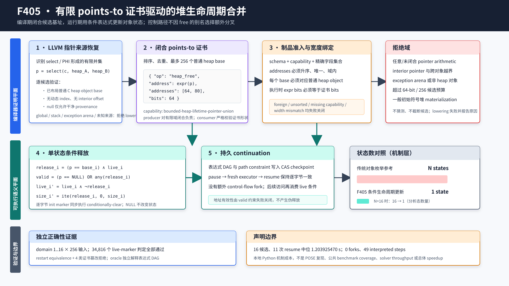

# F405：有限 points-to 证书驱动的堆生命周期合并

## 0. 结论与证据边界

- 功能编号：F405
- 实现日期：2026-08-15
- 所属工作包：W1 通用 continuation / heap / points-to
- 生产入口：LLVM continuation lowering 与 `LiveContinuationExecutor`
- 配置入口：无新增环境变量；对满足证明条件的 `free` 自动启用
- 交付分级：`I/T/E-mechanism`
- 证据目录：[`f405-certified-heap-lifetime-union-2026-08-15`](../evidence/f405-certified-heap-lifetime-union-2026-08-15/)

F405 关闭了此前 continuation heap 语义中的一个具体缺口：当 `free` 的参数是由
`select` 或 PHI 形成、并且静态分析能够证明其只可能取有限个已布局普通堆对象基址（或
`NULL`）时，编译器不再要求提前选定一个具体对象。它输出一个闭合 points-to 证书，运行时
在**同一个执行状态**中用条件表达式更新每个候选对象的 `live`、动态 `size` 和逐字节
初始化标记。因此，仅仅为了判断“释放了哪个候选对象”不会产生额外控制流分叉。

本功能借鉴 POSE 的核心原则，即把与控制流无关的别名选择保留在 ITE/条件表达式中，只在
程序真实控制流决策处产生路径。但当前实现不是完整 POSE：它处理的是 C 程序中**已经由
bounded allocator lowering 创建的有限对象基址集合**，不实现 Java 初始符号堆、fresh
object materialization、字段级 alias-set refinement、继承/多态或 POSE 的完整形式语义。

当前证据支持以下结论：

1. LLVM 17/18 都能对 select、PHI 和 nullable 基址域输出同一规范证书；
2. 运行时在有限域内保持 `free(NULL)`、有效释放、无效释放和暂停恢复语义；
3. domain 1--16、每域 256 个输入的独立 oracle 完成 34,816 次 live-marker 判定；
4. 16 候选机制实验执行 49 个解释指令、产生 0 个 continuation fork；
5. 分析态数量从“每对象枚举参考”的 16 个降为 1 个，这是机制层状态基数，不是实测
   16 倍速度提升。

不支持以下结论：

1. 不宣称完整复现 POSE 或其 Java/JBSE 工件；
2. 不宣称一般 C heap、任意 pointer arithmetic 或初始符号堆已经路径最优；
3. 不宣称当前 1.203925470 秒的 Python 机制中位成本优于原生 KLEE/POSE；
4. 不宣称公共目标 coverage、solver throughput、bug yield 或端到端 speedup 已提升。

## 1. 学术来源与技术定位

### 1.1 POSE

主要来源是 Braione、Denaro、Guglielmo 的 “Path-optimal symbolic execution of
heap-manipulating programs”，arXiv `2407.16827v2`，并已进入 SANER 2026 Research
Track。v2 于 2026-01-14 修订，共 18 页。论文指出，传统 lazy initialization 在首次访问
reference-typed input 时枚举 null、alias 和 fresh object，可能在一条真实程序路径内部产生
组合数量的分析 trace；POSE 则把这些关系编码进 if-then-else 表达式，只在实际 CFG 决策处
分叉。

论文实验使用基于 JBSE 的 Java bytecode 原型和 Z3，在 SBST Java benchmark 的 69 个类、
816 个方法上运行；过滤不可公平比较的样本后，Table I 汇总 55 个类、692 个方法。每个方法
限制 80 层调用、150 次循环迭代和 6 小时，测试生成阶段每类最多 10 小时。论文报告个别
subject 的 trace 数相差 5 个数量级，paired Wilcoxon 的 query-time `p=0.0014`。这些数字只
用于说明研究动机，**不是本仓库复现实验结果**。

本次核验身份：

| 对象 | 身份 |
| --- | --- |
| arXiv | `2407.16827v2`，2026-01-14 |
| 下载 PDF | SHA-256 `5a4137d0b06ad021ef08c653ee43339d158b44d197093f7766f626aa4ca3c9a7` |
| 论文页数 | 18 |
| SANER | 2026 Research Track，2026-03-20 报告 |
| 作者工件仓库 | `pietrobraione/jpose` |
| 工件 HEAD | `427c19bbbce12021fda958e7d88650be2417920e` |

主来源链接：

- [arXiv 2407.16827](https://arxiv.org/abs/2407.16827)
- [SANER 2026 Research Track 页面](https://conf.researchr.org/details/saner-2026/saner-2026-papers/7/Path-Optimal-Symbolic-Execution-of-Heap-Manipulating-Programs)
- [作者 jpose 仓库](https://github.com/pietrobraione/jpose)

### 1.2 KLEE 对照模型

KLEE 的经典内存模型把内存划分为不同 object；当 symbolic pointer 可能解析到多个 object
时，常见处理是对对象解析结果分别克隆 state。KLEE OSDI 2008 论文同时确立了路径条件、
求解生成测试、紧凑状态表示和搜索启发式的基础。本项目并不把 KLEE 的所有内存求解简化成
“总是 N 叉分裂”，但用“每对象一个解析状态”作为有限别名的分析态基数参考是明确、可审计
的对照。

- [KLEE OSDI 2008](https://www.usenix.org/legacy/event/osdi08/tech/full_papers/cadar/cadar_html/index.html)

### 1.3 本项目的工程适配

POSE 面向 object-oriented initial heap，F405 面向 bounded C heap lifetime。两者的共同点
和差异如下：

| 维度 | POSE | F405 |
| --- | --- | --- |
| 对象来源 | 初始符号堆、fresh/alias/null | lowering 已布局的普通 C heap slots |
| 表达式 | 字段值与 heap update 中的 ITE | `live/size/init` marker 的条件表达式 |
| 分叉原则 | 只按真实程序路径分叉 | `free` 的对象选择不额外产生 CFG fork |
| 闭合证明 | POSE 形式语义的 alias set | 编译器产生有限 points-to 基址证书 |
| 当前上界 | 论文形式域 | 最多 256 候选、pointer width 1--64 |
| 不覆盖 | 取决于 Java/原型支持域 | 初始符号堆、interior free、未知 pointer arithmetic |

因此，准确表述是“POSE-inspired finite heap-lifetime union”，而不是“已实现完整 POSE”。

## 2. 总体架构



架构分为三个责任平面：

1. **编译器证明平面**：从 LLVM SSA 恢复 pointer alternatives，验证有限域并输出证书；
2. **可执行语义平面**：严格准入制品，在同一 continuation 中建立条件生命周期表达式；
3. **验证平面**：LLVM 双版本 fixture、Python 单元测试、独立有限域 oracle、篡改反例和
   机制成本共同约束结论。

生产数据流为：

```text
LLVM free(select/PHI pointer)
  -> pointerAlternatives: [(guard_i, base_i)] + optional NULL
  -> validate ordinary heap base / no dynamic index / zero object offset
  -> canonical {address, addresses[], bits} + capability
  -> strict artifact validator
  -> execute address expression once
  -> add valid-address path constraint
  -> conditionally update every candidate lifetime marker
  -> checkpoint expression DAG and resume without an alias-choice fork
```

## 3. 编译期执行次序

### 3.1 识别 `free`

`ContinuationLowering.cpp` 只接纳声明函数 `free` 的精确单参数、void-return 调用。直接
`free(NULL)` 保持既有的 `{op,address}` 形式，因为它不需要 points-to 证书。其他非空参数
进入 `pointerAlternatives`。

### 3.2 恢复有限候选

`pointerAlternatives` 复用既有 pointer-domain 分析，能够沿受支持的 select/PHI/SSA 来源
得到 guarded alternatives。例如：

```llvm
%victim = select i1 %choice, ptr %left, ptr %right
call void @free(ptr %victim)
```

候选必须满足：

- `pointer.heapObject != nullptr`；
- `dynamicIndex == nullptr`；
- `objectOffset == 0`；
- allocation 不是 `__cxa_allocate_exception` 对应的 exception arena；
- null alternative 没有 heap owner、dynamic index 或非零 offset；
- pointer address space 的宽度在 1--64 bit。

候选基址用 `std::set<uint64_t>` 排序和去重。任何一个 alternative 不满足条件，整个 lowering
失败并报告 `free requires a supported heap object base`；系统不会删除坏候选后继续，也不会
把 interior pointer 强行向下取整为对象基址。

### 3.3 输出证书

编译器输出精确字段：

```json
{
  "op": "heap_free",
  "address": {"var": "victim"},
  "addresses": [64, 80],
  "bits": 64
}
```

只要存在这种 certified free，lowering metadata 增加
`bounded-heap-lifetime-pointer-union`。即使域只有一个非空基址，也保留证书；这样 runtime
能把“普通基址证明”和 legacy 未认证 free 区分开。只含 null 的 select 可以产生空
`addresses`，其执行域只能是 null。

### 3.4 证明生产者边界

制品 consumer 能验证 `addresses` 的规范性和每个基址的对象归属，但无法仅凭任意 expression
DAG 重新证明证书**穷尽**了表达式的全部可能值。穷尽性由 compiler producer 的
`pointerAlternatives` 证明承担；source contract、LLVM fixture 与双版本重放封存该实现。
若不可信生产者故意遗漏候选，runtime 会把遗漏值约束掉，形成保守 under-approximation，
而不是凭空释放错误对象。文档不把结构 validator 描述成独立 completeness proof。

## 4. 制品准入与失败关闭

`LiveContinuationExecutor` 的 validator 对 certified `heap_free` 要求：

1. 精确字段集合为 `op/address/addresses/bits`，不允许多余字段；
2. 必须声明 `bounded-heap-lifetime-pointer-union`，且该 capability 必须至少有一个证书使用点；
3. capability 依赖基础 `bounded-heap-lifetime`；
4. `bits` 在 1--64；候选数量不超过 256；
5. `addresses` 必须严格等于其排序去重形式；
6. 每个地址都属于 `memory_objects` 中的普通 heap base，不能属于 exception arena；
7. 小于 64 bit 时，每个地址必须落在可表示范围；
8. 执行时 address expression 的实际位宽必须与 `bits` 相同。

最后一项是本轮深度 review 新发现并修复的边界。此前制品的证书位宽经过结构校验，但执行
`heap_free` 时没有像 `realloc` 一样再次绑定表达式实际位宽。新增 runtime 检查和
`width-mismatch` 篡改 oracle 后，32-bit 证书不能消费 64-bit pointer expression。

## 5. 运行时形式语义

设 `p` 是待释放地址表达式，候选对象集合为 `O={o_1...o_n}`，`base_i`、`live_i`、
`size_i` 分别是对象基址、当前存活表达式和当前动态尺寸。定义：

```text
eq_i      := (p == base_i)
release_i := eq_i AND live_i
valid     := (p == NULL) OR release_1 OR ... OR release_n
```

执行器先把 `valid` 加入 path constraint。若 `valid` 不可定义/不可满足，则该操作失败，避免
free 未分配对象或 double-free。对每个候选对象执行：

```text
live_i' := live_i AND NOT release_i
size_i' := ITE(release_i, 0, size_i)
init_i,j' := init_i,j AND NOT release_i   for every byte j
```

这组更新有四个关键性质：

- **null identity**：`p==NULL` 时所有 `release_i==0`，状态不变；
- **single release**：不同普通对象基址唯一，因此一个具体 `p` 最多释放一个对象；
- **lifetime coherence**：`live`、动态 `size` 和所有 init marker 使用同一 release 条件；
- **no alias-choice fork**：更新只构造 expression DAG，不调用 continuation fork。

具体非符号地址仍走 `_free_heap` 快路径；若 certified 具体地址不在证书中，执行器在查找对象
前拒绝。exception arena 继续由 C++ exception lifecycle 管理，普通 `free` 不能释放它。

## 6. 持久化与并行恢复

条件释放产生的表达式 digest 和更新后的 symbolic store 通过现有 `LiveStateStore` 写入
content-addressed continuation。F405 没有引入新文件格式或独立可变状态；它复用已有：

- expression CAS；
- path constraint root；
- symbolic store marker；
- continuation checkpoint；
- fresh-process/fresh-executor restore。

独立 oracle 在 `free` 前暂停 domain=8 的运行，然后使用新的 executor 恢复；最终
`symbolic_store` 必须和不暂停的直接运行逐项相等。由于生命周期条件已经成为 immutable
expression DAG，worker 转移或进程重启不会重新采样别名选择。

## 7. 测试设计

### 7.1 LLVM 双版本 lowering

`test/live_continuation_lowering.ll` 增加四类生产 fixture：

| fixture | 预期 |
| --- | --- |
| `heap_select_free` | 证书 `[64,80]`，一个输入分支结果 11 |
| `heap_phi_free` | 证书 `[64,80]`，两个输入结果 31/42 |
| `heap_null_free` | 证书 `[64]` 加 null alternative，结果 7 |
| `bad_heap_mixed_free` | heap/global 混合域拒绝 |

既有 interior-pointer `free` 拒绝测试继续保留。LLVM 18 与 LLVM 17 的整份
`live_continuation_lowering.ll` 均通过，生成的 select/PHI/null 证书分别为 `[64,80]`、
`[64,80]`、`[64]`。

这些 fixture 刻意不在 symbolic free 后读取 survivor。F405 交付时的 initialization
writer-graph 尚不能闭合该问题，因此本报告把它列为后继工作。2026-08-15 的 F406 已完成一个
严格有限子域：多个普通heap alternatives分别由不同的dominating scalar stores完整初始化时，
load携带owner-base集合证书并可读取反向survivor；partial和branch-local非支配写入仍拒绝。
这不改变F405本节的原始fixture与生命周期证据，详见
[`F406报告`](Collective_Heap_Union_Initialization_F406_2026-08-15.md)。

### 7.2 Python 单元测试

扩展既有 heap lifecycle 测试，构造两个已分配对象和 symbolic select。独立解释最终 marker：

```text
raw=0 -> (live_left, live_right) = (1,0)
raw=1 -> (live_left, live_right) = (0,1)
```

同时验证 pause/resume、missing capability、foreign base 和 expression/certificate width
mismatch。相关 heap/pointer 选择回归为 17 passed。

### 7.3 独立有限域 oracle

`benchmark/check_heap_lifetime_union_oracles.py` 不调用生产生命周期判断 helper，而是：

1. 为 domain 1--16 分别创建有限 heap program；
2. 用一个输入字节选择待释放对象；超出 `domain-1` 的值统一选择最后一个对象；
3. 独立读取和解释 CAS expression DAG；
4. 对每个 domain 的全部 256 个输入检查“恰好目标对象 dead，其余 live”；
5. 检查 domain=8 的暂停恢复等价；
6. 篡改 foreign、unsorted、missing-capability、width-mismatch 四类合同并要求拒绝。

最终结果：

| 指标 | 结果 |
| --- | ---: |
| domains | 16 |
| input assignments | 4,096 |
| live-marker evaluations | 34,816 |
| restart equivalence | PASS |
| rejected mutations | 4/4 |
| continuation forks | 0 |

oracle 初版对共享 expression DAG 重复递归，资源消耗随共享子式显著增长；review 后改为每个
input assignment 按 digest memoization。断言数量与独立性不变，消除了 oracle 自身的重复
计算。这一修复属于测试基础设施质量改进，不计作被测机制性能收益。

### 7.4 完整回归门禁

- capability-closed Python：`1041 passed + 250 subtests`，耗时 138.19 秒；skip、xfail、
  xpass、deselection、collection error、missing/unexpected node ID 均为 0；
- LLVM 17 full lit：264 discovered，262 passed，2 个既有 unsupported，耗时 215.95 秒；
- LLVM 18 `live_continuation_lowering.ll`：1/1 passed，耗时 199.35 秒；
- canonical pytest inventory：1041 个 node ID，SHA-256
  `bbcfe092ee4c0fcec74f63eb910371509b074baaeb6a25d2b886f845d61adb48`。

F405 强化既有 Python test node 和既有 lit 文件，没有靠增加一个不被完整门禁发现的旁路测试
制造通过数。完整原始日志与 gate JSON 均保存在证据目录。

## 8. 机制实验

命令：

```bash
python3 benchmark/benchmark_heap_lifetime_union.py \
  --domain 16 --repeats 11
```

环境和原始 JSON 见证据目录。结果：

| 指标 | 数值 |
| --- | ---: |
| domain | 16 |
| repetitions | 11 |
| minimum resume cost | 1.166254803 s |
| median resume cost | 1.203925470 s |
| maximum resume cost | 1.459818673 s |
| interpreted instruction steps | 49 |
| continuation forks | 0 |
| analytic fork-per-object reference | 16 states |
| conditional lifetime update | 1 state |

该基准测量 Python continuation executor 从初始 checkpoint 到 halt 的本地机制成本。分析态
`16 -> 1` 是由两种对象解析策略定义得到的基数，不是另跑一个真实 fork-per-object executor
得到的 wall-time 对照。因此可以报告“避免 15 个别名解析状态”，不能报告“提速 16 倍”。

## 9. 实现映射

| 文件 | 责任 |
| --- | --- |
| `compiler/ContinuationLowering.cpp` | 有限候选恢复、基址证明、证书和 capability 输出 |
| `util/live_continuation.py` | 严格制品准入、位宽绑定、条件生命周期语义 |
| `util/check_live_continuation_lowering.py` | 生产 artifact 合同检查 |
| `test/live_continuation_lowering.ll` | LLVM 17/18 select/PHI/null/reject fixture |
| `test/test_distributed_state.py` | marker 语义、恢复和篡改单元测试 |
| `benchmark/check_heap_lifetime_union_oracles.py` | 独立有限域 expression-DAG oracle |
| `benchmark/benchmark_heap_lifetime_union.py` | 机制成本、步数、fork 数和分析态基数 |
| `docs/Configuration.txt` | 自动启用条件、合同和拒绝域 |
| `docs/Testing.txt`、`benchmark/README.md` | 可复现命令与声明边界 |

## 10. 创新性、挑战性与下一步

### 10.1 当前创新点

F405 不是把一个 Python heap 模型孤立加入仓库，而是形成 compiler proof producer、严格
artifact、persistent executor、双 LLVM fixture、独立 DAG oracle 的纵向闭环。相对既有
bounded heap lowering，其新增价值是：

- 把 pointer-domain 证书复用于 lifetime-changing operation，而不仅是 load/store；
- 将 alias choice 编码到 durable live/size/init 状态，实现 checkpoint-resumable 条件释放；
- 把 producer completeness 与 consumer structural validation 的责任明确拆开；
- 用位宽篡改、异物基址和不规范域证明制品边界失败关闭；
- 明确区分分析态基数改善、Python 机制成本和公共 benchmark 性能。

### 10.2 仍未关闭的 W1 工作

1. **更一般 alias-aware MemorySSA survivor initialization**：F406 已关闭“每个普通heap
   candidate有独立dominating scalar store”的有限子域；仍需证明guard-correlated
   branch-local stores、MemoryPhi、dynamic index和跨过程writer；
2. **更一般 points-to 域**：数组/对象字段、受限 interior pointer 使用、跨过程摘要和
   allocator wrapper；`free` 本身仍必须是对象 base；
3. **初始符号堆与 alias quotient**：要达到完整 POSE，需要 materialization、字段读写更新、
   reference equality 与 path-optimal fork oracle；
4. **native adapter**：将 continuation semantic artifact 接到原生执行/恢复，而不只由 Python
   interpreter 消费；
5. **R 级实验**：在等 CPU、固定 corpus/seed 的 public heap-heavy targets 上比较 coverage
   AUC、solver CPU、状态数、峰值内存与 accepted tests。

F406 已按上述原则完成第 1 项的首个可证切片。下一步应增加control-predicate/MemoryPhi
transcript，闭合路径相关writer；仍不能通过把未证明 load 当成已初始化来换取表面兼容性。
