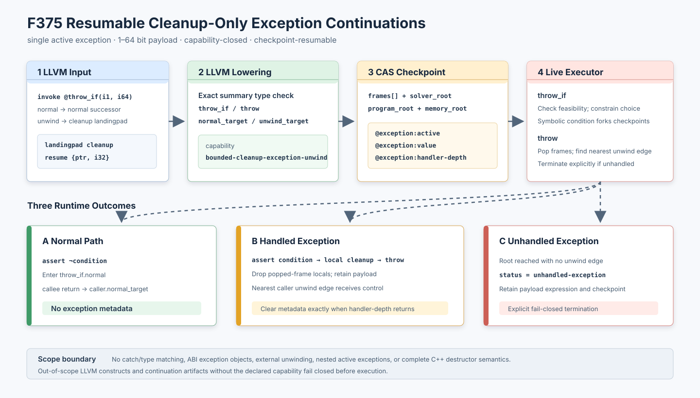

# F375：可检查点恢复的 cleanup-only 异常续执行

> 阶段说明：本文记录 F375 提交时的 cleanup-only 边界。当前仓库已由
> [F376](Exact_Typed_Exception_Matching_F376_2026-08-12.md) 扩展出精确 typeinfo matching；
> F375 中“catch 尚未支持”不是当前总能力结论。

- 日期：2026-08-12
- LLVM lowering：`compiler/ContinuationLowering.cpp`
- 执行器：`util/live_continuation.py`
- 产物审计：`util/check_live_continuation_lowering.py`
- 测试：`test/live_continuation_lowering.ll`、`test/live_continuation_exception_signature.ll`、
  `test/test_live_exception_semantics.py`
- 成熟度：I/T/E-mechanism；尚未声称完整 C++ EH 或公开 benchmark 性能提升

## 1. 研究问题与范围

此前 live continuation 能恢复普通分支、函数调用、COW 内存和求解器上下文，但 LLVM `invoke` 的
异常边只能在 `nounwind` 可证明时退化为普通调用。真实 continuation 若在 cleanup 中暂停、迁移到
另一 worker 后恢复，必须同时保存异常是否活动、异常值、当前 cleanup 层级以及调用栈上的异常边；
否则恢复后可能错误走 normal edge、重复执行 cleanup，或把异常状态泄漏到后续执行。

F375 实现一个严格受限但端到端闭合的子集：cleanup-only landingpad、单个活动异常、1–64 bit
整数 payload、内部有界调用图、可内容寻址持久化的 checkpoint。它不是 Itanium C++ ABI、Windows
SEH 或完整 LLVM EH 的替代品；catch/type matching、异常对象生命周期、外部库跨帧展开、filter、
catchswitch/catchpad/cleanuppad 和嵌套活动异常仍明确拒绝或不在本阶段语义内。

## 2. 编译与执行的严格次序

1. LLVM 测试或前端以精确声明 `void __symcc_continuation_throw_if(i1, iN)` 表示一个可控异常源，
   并且必须通过 `invoke` 提供 normal/unwind 两条边。
2. lowering 只在符号名、声明状态、非 varargs、返回类型、参数个数和参数位宽全部匹配时识别该
   summary；同名但不同类型的函数不能获得特殊语义。
3. summary invoke 被降为 `throw_if(condition, exception, exception_bits, normal, unwind, site)`；
   cleanup-only `landingpad` 不产生值操作，`resume` 被降为 `throw`。
4. 普通 may-unwind invoke 只接受可枚举且全部为内部定义的 direct/indirect target，并在 continuation
   call 上记录 `normal_target` 和 `unwind_target`。外部声明、intrinsic 或无界间接集合失败关闭。
5. lowering 只要产生异常操作或异常边，就声明 `bounded-cleanup-exception-unwind` capability。
6. 执行器加载产物时执行双向验证：异常操作/异常边没有 capability 会拒绝；capability 没有任何
   对应契约也会拒绝。`throw_if.site` 必须是 `[1, 2^64-1]` 内的十进制稳定标识。
7. 执行 `throw_if` 时，具体条件选择唯一边；符号条件分别检查 `condition` 与 `not(condition)` 的
   可行性，为可行子状态压入 solver frame，并记录搜索决策 token。
8. 异常子状态设置 `@exception:active`、`@exception:value` 与当前 `@exception:handler-depth`，随后先
   进入被调用函数自己的 cleanup block。正常子状态直接进入 normal block，不创建异常元状态。
9. cleanup 中的 `throw` 逐帧展开：清理弹出帧的局部 SSA/栈状态，检查 caller 当前 invoke 的
   `unwind_target`；找到最近 handler 后重写其 frame PC，并把 handler depth 更新为 caller depth。
10. handler 内允许调用普通 helper。只有执行 `return` 的栈深度精确等于 handler depth 时才同时
    清除三个异常字段，避免 helper return 提前结束异常处理。
11. 若展开至根仍没有 handler，执行结果显式标记为 `unhandled-exception`，并保留 payload expression
    与最终 checkpoint；不会静默改走 normal edge。

## 3. Checkpoint 与分布式恢复语义

异常状态没有保存在进程局部 Python 对象中，而是进入 continuation 的 `symbolic_store`，与 frames、
`solver_root`、`memory_root` 和 `program_root` 一同由 `LiveStateStore` 内容寻址提交。因此 worker 可在
以下两个敏感位置暂停并迁移：一是 `throw_if` 已选择异常边但尚未执行 `resume`；二是已展开到 caller
handler、尚未执行 handler。恢复时 handler depth 和 payload 都由 checkpoint 重建，不依赖原 worker
的地址空间或异常运行库栈。

状态不变量如下：

- `active = 1` 时必须同时存在 payload 与 handler depth；`throw` 在无活动异常时是运行时错误；
- 每次展开先清理被弹出 frame，再检查 caller invoke，因而被销毁 frame 的局部变量不能被 handler 误用；
- payload 保存为 expression digest，弹出产生它的 frame 不会破坏 CAS 中的不可变表达式对象；
- handler 返回清理与 return 状态转换在同一执行步完成，checkpoint 不会观察到“已离开 handler 但
  active 仍为 1”的中间状态；
- 第二个异常在 active 状态下发生时明确拒绝，避免把未建模的 nested-unwind 行为错误近似为正确结果。

## 4. 两轮反例驱动 review

第一轮审查修复了两个状态语义问题。初版没有 handler depth，cleanup handler 吞掉异常并返回后仍会
遗留 active/payload；如果简单地在任意 return 清除，又会使 handler 调用的 helper 提前清除。现以
精确栈深度门控。初版 fork 子状态还可能重复记录 search decision，现由 child search fields 统一继承，
route 阶段禁止二次记录。

第二轮审查修复 capability 闭包问题。最初只把 `throw_if/throw` 视为异常契约，遗漏了
`call.unwind_target`：这会错误拒绝纯内部 may-unwind invoke，也允许手写 invoke 绕过能力声明。
现在异常操作与异常边都要求 capability，并且任一都可证明 capability 非空。同期将 summary 识别从
“同名且调用参数看似匹配”收紧为对被调函数声明和调用点的双重类型验证。产物检查器也从错误的
“必须同时存在 exception op 和 unwind call”改为“至少存在一种异常契约”，并用可选精确断言覆盖
完整 throw 链和纯内部 may-unwind invoke 两种合法产物。

## 5. 测试证据与结果

2026-08-12 定向验证结果：

| 门禁 | 结果 |
| --- | --- |
| `py_compile` | 通过 |
| `ruff`，实现、检查器与测试 | 通过，0 diagnostics |
| `pytest test/test_live_exception_semantics.py` | 6 passed + 4 subtests，0 failed，0.55 s |
| `cmake --build build -j2` | 通过，`libsymcc.so` 成功重链 |
| `lit -sv --filter=live_continuation_lowering build/test` | 1 passed，0 failed，175.30 s |
| `lit -sv --filter=live_continuation_exception_signature build/test` | 1 passed，0 failed，0.09 s |
| 手工 LLVM lowering | 成功产生 1 个 `throw_if`、1 个 `throw`、1 条 caller `unwind_target` |
| 产物 capability/checker | `bounded-cleanup-exception-unwind` 存在；结果集合为 `{7, 99}` |

Python 测试覆盖符号异常条件双分支、根部未处理异常、无活动异常的非法 resume、capability 缺失与
空声明、site 的零值/负值/非数字/溢出、cleanup 内 checkpoint、展开后 handler checkpoint、handler
返回后的元状态清理。LLVM lit 输入同时包含合法 cleanup/resume 和带 catch clause 的反例。
独立 signature 用例证明同名 varargs 声明不会被误识别为受信 summary。

这些结果证明的是 lowering、验证、执行和恢复机制的一致性，不是覆盖率或吞吐率提升。异常支持能扩大
可被 live continuation 接受的 LLVM 程序集合，但其对公开 benchmark 的边覆盖、求解次数和状态迁移
开销仍需独立的多重复实验，本文不从单元测试推导性能结论。

## 6. 已知限制与下一阶段

当前 payload 是框架内部的有界整数，不建模 ABI exception object、selector 或 RTTI；cleanup
landingpad 仅接受零 clause，且 value 只能未使用或直接交给 `resume`。内部调用图仍受已有递归/规模
预算约束；外部 may-unwind 调用不会被乐观地当作 nounwind。完整下一阶段应按以下顺序推进：

1. 设计规范化 exception type ID 与 ordered clause table，实现 catch/type matching；
2. 给 handler 增加 `exception_value`/selector 读取操作，并验证 SSA 支配与位宽；
3. 建模 cleanup 链与 rethrow，区分 handler 已接管和仍在 unwinding 两种状态；
4. 对 clang 生成的 Itanium EH 子集做差分测试，并继续对未支持 pad 指令失败关闭；
5. 在 C++ exception-heavy benchmark 上报告 acceptance、路径数、checkpoint 字节数和运行开销。

在这些工作完成前，F375 的准确名称始终是“可恢复 cleanup-only 异常续执行”，不能表述为“完整
C++ exception support”。
