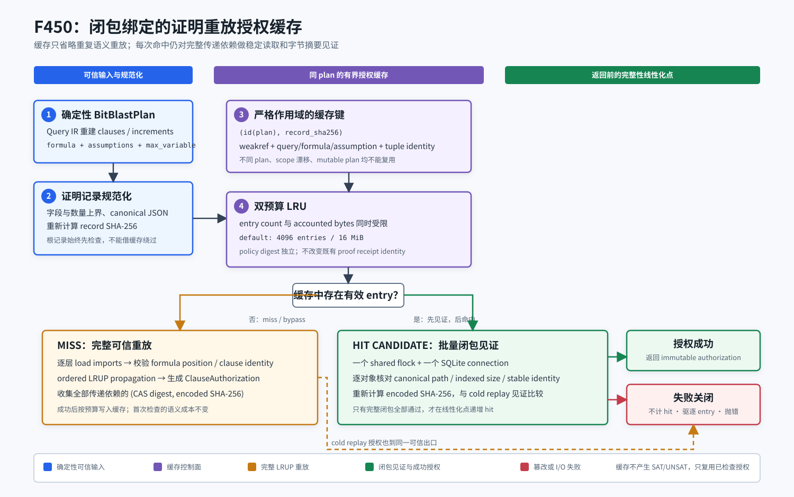

# F450：闭包绑定的有界证明重放授权缓存

## 1. 交付结论

F449 已把一个 QF_BV 查询拆成互斥、完备的 cubes，并能把叶级 UNSAT 证明聚合为原查询
回执；其正式机制实验同时暴露出一个新的串行成本：证明 DAG 越深，同一个 coordinator 越频繁
重复解析、重放和遍历已经检查过的 import closure。F450 在不扩大可信结论的前提下，引入
**plan-scoped、checker-policy-bound、transitive-closure-attested** 的授权缓存。

- 功能编号：F450；
- 当前等级：I/T/E-mechanism；
- 核心实现：`util/qfbv_incremental_proof.py`；
- 服务入口：`util/symcc_query_service.py`；
- 专项测试：`test/test_qfbv_proof_replay_cache.py`；
- 机制 oracle：`benchmark/check_qfbv_proof_replay_cache_oracles.py`；
- 正式证据：`docs/codex/evidence/f450-closure-bound-proof-replay-cache-2026-08-25/`；
- 结论边界：已证明同一不可变 plan 内的重复授权可跳过 LRUP/JSON 递归重放，同时仍逐对象
  校验完整 import closure；未据此声明 SAT 求解、fuzzing coverage 或 defect yield 提升。



## 2. 研究动机与 SOTA 关系

分布式 SAT 的可信执行不能把 proof checking 当成离线附属步骤。TACAS 2026 的
*Real-time Proof Checking for Distributed Incremental SAT Solving* 将增量公式、assumptions、
checked clause sharing 和动态资源重调度放在同一个实时检查协议中，并在最多 1216 cores 的
MallobSat 实验上报告平均检查开销低于 33%；论文还用在线 clause compression 降低 checker
内存。CAV 2026 的 Mallob 工具论文进一步把 proof checking、incremental queries 和 flexible
rescheduling 作为统一平台能力。SAT 2026 的 PalRUP 则说明持久并行 proof artifact 需要去中心化
检查，而不是汇聚为单一串行文件。

F450 **不是上述 checker compression 或 PalRUP 的复刻**。它解决的是本仓库 F432--F449
内容寻址 LRUP DAG 的重复授权成本：只有第一次执行完整语义重放，后续命中仍对已授权证明的
全部传递依赖做字节级稳定读取和摘要见证。该组合是面向 SymCC Query IR、确定性 bit-blast plan
和本项目 proof CAS 的工程创新。

## 3. 威胁模型与不变量

缓存保存的是“某个证明记录已经在某个具体 plan 上通过检查”的授权，不保存新的求解结论。
以下任一条件不满足时，系统必须回到完整重放或失败关闭：

| 不变量 | 实现 | 失败行为 |
| --- | --- | --- |
| 原始记录不能借缓存绕过规范化 | 每次调用先执行 bounded canonical record normalization，并复算 `record_sha256` | 根记录内容或 identity 改变即拒绝 |
| 授权不能跨 plan 传播 | key 为同一进程内的 `id(plan) + record digest`；entry 同时保存 weak reference 和 plan scope | 等价但不同对象的 plan 首次仍完整重放；对象回收或 scope 漂移即 miss/evict |
| plan 的 proof-relevant 结构不可变 | 只缓存精确 `BitBlastPlan`，且 clauses/每条 clause/increments 必须是规范 tuple/frozen records | 手工构造的 mutable plan 只重放、不缓存 |
| checker/store policy 不被缓存配置偷换 | 原有 `policy_sha256` 保持 `ordered-lrup-replay-v1` 兼容身份；另设 cache policy digest | store identity、checker policy 或预算改变会产生不同 cache policy |
| 传递 import 不能被旧授权掩盖 | cold replay 记录每个依赖的 CAS record digest 与 canonical encoded-byte SHA-256 | hot hit 在返回授权前重新稳定读取全部依赖；缺失、路径/大小/摘要漂移即拒绝 |
| 校验失败不能保留有毒 entry | attestation failure 在线性化点前发生 | 失败不计 hit，精确驱逐当前 entry，并记录 failure telemetry |
| 缓存占用有上界 | entry-count 与 accounted-byte 双 LRU 预算，任一为零时必须同时关闭 | oversized entry 不写入；按 LRU 顺序驱逐至两个预算均满足 |

## 4. 执行流程

1. query service 从 Query IR 重新构造确定性 `BitBlastPlan`；
2. checker 对调用方传入的 proof record 做规范化、字段边界检查和 content identity 复算；
3. 若 cache 关闭或 plan 不满足不可变准入条件，直接进入完整 LRUP replay；
4. 若 key 不存在、weak reference 失效或 plan scope 改变，记录 miss 并完整重放；
5. cold replay 逐层从 proof CAS 读取 imports，检查公式增量关系、import clause、ordered LRUP hints
   和最终 shared clause，同时收集完整传递闭包的 `(record digest, encoded SHA-256)`；
6. 授权与闭包按双预算写入 LRU；缓存不保存可变 raw JSON，也不改变外部 proof receipt；
7. hot replay 先在一个 shared store lock 和一个 SQLite connection 下批量校验闭包中所有对象的
   canonical path、indexed size、稳定读取 identity 和 encoded SHA-256；
8. 只有批量校验全部成功后才递增 `hits` 并返回 cached authorization；失败时驱逐对应 entry；
9. service 的 live stats 和 final summary 输出预算、占用、hits/misses、evictions、oversized、
   bypassed、attestation failures、attested object count 与 bytes。

## 5. 数据结构与成本模型

缓存 entry 包含：

```text
(plan object identity, proof record digest)
  -> weak plan reference
  -> plan replay scope
  -> immutable ClauseAuthorization
  -> sorted transitive import closure[(CAS digest, encoded SHA-256)]
  -> accounted bytes
```

设当前记录的传递依赖数为 `D`，LRUP proof/hint 总量为 `P`：

- cold replay 仍为 `O(P + D)`，不降低第一次可信检查成本；
- hot replay 跳过递归 JSON parse、formula-position search 和 LRUP propagation，保留 `O(D)` 的
  stable-read + SHA-256 见证；
- LRU entry 对闭包按保守的 128 bytes/object 计费，默认总预算 4096 entries 和 16 MiB；
- 该设计选择“降低 CPU 与 SQLite/JSON 递归开销，但不省略依赖完整性检查”，因此不会把缓存
  变成第二个未经检查的 proof store。

首版原型逐对象重复获取 flock、打开 SQLite 并解析 JSON，8/32/64 层均没有稳定收益；第二版只做
单对象摘要校验，锁与 connection 开销仍占主导。最终版把完整闭包放到一个锁和一个 connection 中
批量见证，才得到稳定机制收益。负结果和设计迭代保留在 review/evidence 说明中，不用最终数据掩盖。

## 6. 配置与操作

```bash
python3 util/symcc_query_service.py \
  --store /shared/query-store \
  --portfolio /shared/cadical-portfolio.json \
  --qfbv-incremental-proof-store /shared/qfbv-proofs \
  --qfbv-proof-replay-cache-entries 4096 \
  --qfbv-proof-replay-cache-bytes 16777216
```

等价环境变量为：

- `SYMCC_QFBV_PROOF_REPLAY_CACHE_ENTRIES`；
- `SYMCC_QFBV_PROOF_REPLAY_CACHE_BYTES`。

两项必须同时为零才表示关闭；一项为零而另一项非零、负数或超过硬上限均在启动阶段失败。
当前硬上限为 1,000,000 entries 和 16 GiB accounted bytes。缓存是进程内优化，不跨重启持久化；
持久信任仍只来自 Query IR 重建、proof CAS 和 proof receipt。

## 7. 测试与多轮审查

专项 9 项测试覆盖：

- 配置范围、双零关闭和 cache policy 身份；
- 同 plan object 命中、等价 plan 隔离、root record 篡改拒绝；
- entry/byte 双预算、LRU 驱逐、oversized 和 disabled telemetry；
- 非规范 mutable plan 永不缓存；
- cached parent 命中后对 complete import closure 的稳定读取；
- 同长度 CAS 内容篡改、失败不计 hit、精确 entry eviction；
- query-service CLI 失败关闭；
- 16 线程同时验证同一记录时的保守并发行为；
- 可执行 2/4 层 oracle smoke。

耦合回归覆盖 incremental SAT、F449 partition execution、proof wire 和 QueryStore，共
88 passed、50 subtests passed。完整 capability-closed gate 为 1428 passed、310 subtests passed；
16/16 外部能力存在，skip、xfail、xpass、deselect、collection error、missing nodeid 和 unexpected
nodeid 均为零。规范清单从 F449 的 1419 精确增加 9 项，既有 nodeid 删除数为零。

五轮审查结论：

1. **可信闭包审查**：修复初版只缓存父授权、可能掩盖 imported CAS 篡改的问题；
2. **协议兼容审查**：缓存预算不再改变外部 checker policy，新增独立 cache policy；
3. **性能反证审查**：拒绝逐对象 JSON/SQLite 原型的无收益结果，改为完整闭包批量见证；
4. **可变性与并发审查**：非规范 plan 不缓存，weakref/scope 防 id reuse，16 线程竞态保持一致；
5. **遥测与失败语义审查**：命中线性化点移到 attestation 成功之后，失败 entry 被驱逐并单独计数。

## 8. 正式机制实验

oracle 构造 8、32、64 层线性 imported-LRUP DAG；每档先 cold replay 填充缓存，再交替运行
10 轮 disabled full replay 和 enabled hot replay。每次结果都比较 record identity、shared clause
和 propagation count，并核对精确 cache/closure 计数。

| DAG 深度 | disabled 中位数 | hot 中位数 | 机制重放倍率 | 每档见证对象数 | 每档见证字节 |
| ---: | ---: | ---: | ---: | ---: | ---: |
| 8 | 35.655 ms | 9.140 ms | 3.900985x | 70 | 51,700 |
| 32 | 148.042 ms | 10.410 ms | 14.221134x | 310 | 233,350 |
| 64 | 279.206 ms | 10.997 ms | 25.389288x | 630 | 475,590 |

对象数满足 `(depth - 1) × 10`：顶层 raw record 由调用者每轮重新 load/normalize，缓存只对它的
传递 imports 做批量 attestation。三档均为 0 attestation failures；disabled 路径每轮仍递归重放
全部 `depth` 个记录。完整样本见 `oracle.json`，进程总 wall time 为 7.607 s。

**实验结论**：缓存消除了重复 LRUP/JSON/SQLite 递归的主要 CPU 与连接开销，且没有省略完整闭包
字节见证。倍率随 DAG 深度上升，说明收益来源是避免重复递归，而不是减少 proof integrity 工作。
该实验没有运行 SAT search 或目标程序，因此不得表述为 solver speedup、coverage gain 或漏洞数量提升。

## 9. 未闭合边界

1. hot replay 仍为 `O(D)` 并读取完整闭包；尚未实现 TACAS 2026 checker 内部的差分 literal、
   variable-byte 和小 clause inline compression；
2. 缓存只在单进程、同一 plan object 内有效，没有跨节点授权共享；
3. F449 cube leases 仍运行在同进程独立 backend slots，尚未映射到 F438/F447 的跨节点 worker catalog；
4. SymCC workers 尚不原生产生 SAT 2026 PalRUP 多片段，F439/F440 是 wire/check consumer；
5. 尚无公开 QF_BV 目标上的端到端等资源消融，因此 F450 保持 E-mechanism，不升级为 R。

## 10. 主要资料

- Schreiber et al., [*Real-time Proof Checking for Distributed Incremental SAT Solving*](https://publikationen.bibliothek.kit.edu/1000193848), TACAS 2026；
- Schreiber et al., [*Mallob: Scalable Automated Reasoning on Demand*](https://link.springer.com/chapter/10.1007/978-3-032-32526-6_5), CAV 2026；
- Götz et al., [*A Natively Parallel Proof Framework for Clause-Sharing SAT Solving*](https://drops.dagstuhl.de/entities/document/10.4230/LIPIcs.SAT.2026.17), SAT 2026；
- F449 本地报告：[`Proof_Aware_Certified_Partition_Execution_F449_2026-08-25.md`](Proof_Aware_Certified_Partition_Execution_F449_2026-08-25.md)。

论文中的规模和开销数字属于原论文；F450 只声明本仓库 evidence 直接支持的机制与数据。
