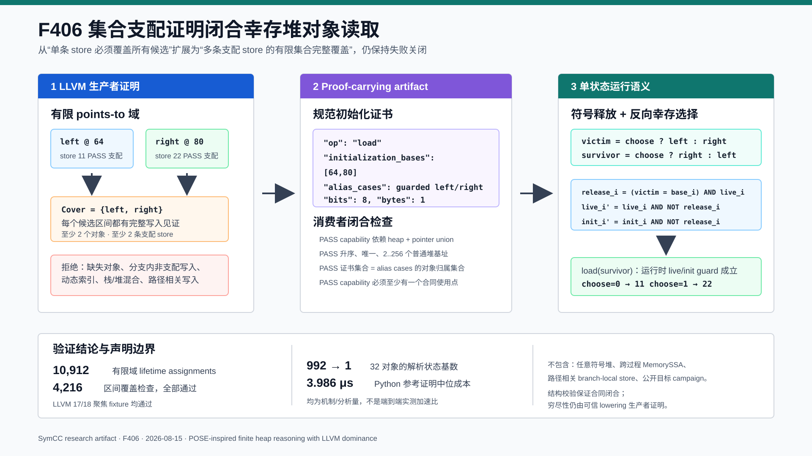

# F406：集合支配证明驱动的堆指针并集初始化闭合

## 0. 结论、定位与证据等级

- 功能编号：F406
- 实现日期：2026-08-15
- 所属工作包：W1 通用 continuation / heap / points-to
- 生产入口：`compiler/ContinuationLowering.cpp` 与 `util/live_continuation.py`
- 配置入口：无新增环境变量；仅在静态证明成功时自动启用
- 制品能力：`bounded-collective-heap-union-initialization`
- 交付等级：`I/T/E-mechanism`
- 证据目录：[`f406-collective-heap-union-initialization-2026-08-15`](../evidence/f406-collective-heap-union-initialization-2026-08-15/)

F406 关闭了 F405 明确保留的后继缺口。F405 已能在一个 continuation state 中表示：
“`free(select(left,right))` 到底释放哪个对象”。但当程序随后通过反向 select 读取仍然存活的
对象时，较旧的初始化准入规则要求**某一条 store 单独覆盖 load 的全部候选对象**。于是下面
这个已明确定义、且每个对象都在 load 前初始化的程序仍会在 lowering 阶段被误拒：

```llvm
store i8 11, ptr %left
store i8 22, ptr %right
%victim   = select i1 %choose, ptr %left,  ptr %right
%survivor = select i1 %choose, ptr %right, ptr %left
call void @free(ptr %victim)
%value = load i8, ptr %survivor
```

F406 将证明条件从：

```text
exists store s: for every load alternative a, covers(s, a)
```

扩展为：

```text
for every load alternative a:
  exists a distinct dominating store s in a finite admitted set S:
    covers(s, a)
```

成功时，编译器在 load 上输出排序唯一的 `initialization_bases`，消费者闭合检查该集合与
`alias_cases` 的对象归属集合完全相同。运行时仍使用已有的逐对象 `live/size/init` marker 和
alias guards 执行读取；证书不会替代运行期生命周期检查。因此该扩展既解除静态误拒，又没有
把未初始化或已释放对象伪装成有效对象。

当前证据支持以下结论：

1. LLVM 17.0.6 与 LLVM 18.1.3 均能降低“符号释放 + 反向幸存选择”fixture；
2. 成功制品包含 `[64,80]` 初始化证书、同一对象域的 alias cases 和 F405 释放证书；
3. 不完整覆盖与 branch-local 非支配写入仍失败关闭；
4. 独立 oracle 覆盖 domain 2--32、1--8 字节，共 4,216 次区间检查和 10,912 个不同
   `victim/survivor` 赋值；
5. 4 类制品篡改全部被生产消费者拒绝；
6. 32 对象 Python 参考证明的 11 轮中位成本为 3,986 ns/proof；
7. 32 对象时 `N*(N-1)=992` 到 1 是分析态基数对照，不是 992 倍墙钟加速。

当前证据**不**支持以下结论：

1. 不宣称实现任意 symbolic heap、完整 POSE、完整 MemorySSA 或一般 path-sensitive
   definite-initialization；
2. 不接纳路径相关的 branch-local stores，即使源程序中的 select 相关性可能使其安全；
3. Python 参考证明成本不是生产 C++ lowering latency；
4. 未进行公开目标上的 coverage、solver throughput、bug yield 或端到端性能实验；
5. 未证明优于 KLEE、POSE、MemSight、Segmented Memory Model 或其他系统。

## 1. 学术来源与研究定位

### 1.1 POSE：避免为堆别名选择制造伪路径

Braione、Denaro、Guglielmo 的 POSE（Path-Optimal Symbolic Execution）把堆对象之间的
alias/distinctness 关系保留在条件表达式中，只在真实程序控制流决策处产生路径。其研究动机
直接对应本项目 F405/F406 的组合：符号释放和幸存对象解析不应仅因为 points-to 域有多个对象
而提前复制 continuation state。

- [Path-optimal symbolic execution of heap-manipulating programs, arXiv 2407.16827](https://arxiv.org/abs/2407.16827)
- [SANER 2026 Research Track 页面](https://conf.researchr.org/details/saner-2026/saner-2026-papers/7/Path-Optimal-Symbolic-Execution-of-Heap-Manipulating-Programs)

但 F406 不是 POSE 的新实现版本。POSE 的形式域包含面向对象初始符号堆、fresh object 和字段
访问；F406 只处理 lowering 已经布局的普通 C heap object、有限 points-to 域和标量区间。
准确定位仍是 **POSE-inspired bounded C-heap adaptation**。

### 1.2 LLVM dominance 与 MemorySSA

LLVM IR 要求 SSA 定义支配其使用；对内存而言，LLVM MemorySSA 用 `MemoryDef`、`MemoryUse`
和 `MemoryPhi` 建立内存版本关系，并明确指出 MemorySSA 是 intraprocedural 分析。F406 使用
LLVM `DominatorTree` 证明每条候选 store 在 load 的所有控制流到达路径上执行，再以对象身份
和字节区间证明写入覆盖。

- [LLVM Language Reference Manual](https://llvm.org/docs/LangRef.html)
- [LLVM MemorySSA documentation](https://llvm.org/docs/MemorySSA.html)

当前实现没有把 `hasDominatingUnionStore` 改写成一般 MemorySSA clobber walker。它仍采用
函数内 bounded instruction scan，再由 dominance 与精确 points-to/区间关系筛选。因此文档
使用“dominance-proven collective cover”，不使用“完整 MemorySSA definite assignment”。

### 1.3 符号指针内存模型对照

符号指针可能表示多个可行地址；早期与后续工作分别探索对象枚举、运行时处理器、分段内存和
带合并的符号内存。F406 的研究价值不在于重新提出 symbolic pointer，而在于把已有的有限
pointer-union、heap lifetime 和初始化 marker 三个局部语义连接成一个可验证闭环。

- [symMMU, ASE 2014](https://doi.org/10.1145/2642937.2642974)
- [Rethinking Pointer Reasoning in Symbolic Execution, ASE 2017](https://season-lab.github.io/papers/memsight-ase17.pdf)
- [Segmented Memory Model project](https://srg.doc.ic.ac.uk/projects/klee-segmem/)
- [Precise Pointer Reasoning for Dynamic Test Generation](https://www.microsoft.com/en-us/research/publication/precise-pointer-reasoning-for-dynamic-test-generation/)

## 2. 架构与执行流程



完整执行次序如下：

1. continuation lowering 遇到标量 `load`；
2. `pointerAlternatives` 从 select/PHI/heap-pool SSA 恢复 guarded pointer alternatives；
3. 既有单 store 证明先执行，保证历史可接受域和制品不变；
4. 单 store 证明失败后，F406 检查候选是否属于严格 collective 子域；
5. 遍历函数内 store，过滤 volatile、atomic 和不支配当前 load 的指令；
6. 计算 store 字节宽度和 store pointer alternatives；
7. 只接受 pointer domain 只有一个静态对象 alternative 的 store；其地址 guard 可以保留，
   因为 store 指令本身支配 load 且该 alternative 穷尽该 store 的地址域；
8. 按对象身份、静态基址、dynamic-index 状态和字节区间更新 cover bitset；
9. 全部 load alternatives 都被至少两条不同 store 覆盖，且至少有两个不同对象基址时，生成
   规范 `initialization_bases`；否则沿用原诊断并拒绝；
10. lowering 生成 `alias_cases`，并在同一 load 上附加初始化证书与 capability；
11. `LiveContinuationExecutor._validate_program` 验证 capability 依赖、排序唯一、普通堆归属
    以及证书集合与 alias case owner 集合的精确相等；
12. 执行时 `heap_free` 用 F405 条件表达式更新 candidate lifetime；
13. 随后的 load 仍按 alias guards 选址，并要求被选对象 `live`、范围和 init marker 有效；
14. 程序真实的 `icmp/br` 可以产生 continuation fork，但对象解析本身不产生额外 fork。

## 3. 编译器证明细节

### 3.1 旧规则为何误拒

设 load alternatives 为 `A={a_left,a_right}`，支配 stores 为
`S={s_left,s_right}`。旧实现对每条 `s` 独立执行：

```text
coversAll(s) = all(covers(s, a) for a in A)
accept = any(coversAll(s) for s in S)
```

`s_left` 只能覆盖 `a_left`，`s_right` 只能覆盖 `a_right`，所以两次 `coversAll` 都是假。
这不是源程序未初始化，而是证明量词次序过强。

### 3.2 F406 的有限集合覆盖

F406 为每个 load alternative 建立 `collectivelyCovered[i]`，为每条真正贡献新覆盖的 store
记录 witness identity：

```text
covered := empty bitset
contributors := empty store set

for s in all instructions:
  if not scalar_nonvolatile_nonatomic(s): continue
  if not dominates(s, load): continue
  if pointer_domain(s.address).size != 1: continue
  for a_i in load_alternatives:
    if not covered[i] and covers(s, a_i):
      covered[i] = true
      contributors.add(s)

accept iff all(covered)
       and |contributors| >= 2
       and |distinct_object_bases(A)| >= 2
```

`DominatorTree::dominates(store, load)` 同时处理跨基本块和同一基本块的指令顺序。store 位于
load 之后、只位于某一 predecessor、或处于不保证执行的 branch 时都不能成为 witness。

### 3.3 准入域

load alternatives 必须全部满足：

- 至少两个 alternatives；
- `heapObject != nullptr`；
- 不是 interprocedural summary；
- 不是 calloc 的隐式零初始化特例；
- `dynamicIndex == nullptr`；
- `objectOffset >= 0`。

贡献 store 必须满足：

- 非 volatile、非 atomic；
- 支配 load；
- store width 不小于 load width；
- store pointer domain 恰好一个 alternative；
- alternative 属于普通本地 heap object；
- 无 dynamic index，offset 非负。

store alternative 可以带地址 guard。例如容量为 1 的 bounded malloc pool 仍会把“返回地址等于
slot base”保留为 guard，但该 store 的 domain 只有一个穷尽 alternative。容量大于 1 的 pool
会产生多个 alternatives，因此不会被 collective 规则错误地当作同时初始化所有 slots。

### 3.4 精确覆盖关系

对静态 stored pointer `p_s` 和 loaded pointer `p_l`，首先要求：

```text
p_s.stackObject == p_l.stackObject
p_s.heapObject  == p_l.heapObject
base(p_s)       == base(p_l)
```

对当前 F406 子域，dynamic index 必须为空。设 store 的静态对象内偏移为 `o_s`、宽度为
`w_s`，load 的偏移为 `o_l`、宽度为 `w_l`：

```text
covers(s,l) := o_s <= o_l AND (o_l - o_s) <= (w_s - w_l)
```

该无符号差值形式只在 `w_s >= w_l` 和两个 offset 均非负后计算，避免下溢。对象 identity
而非裸地址承担 provenance 区分，避免不同对象的地址算术偶然相同被视为同一初始化。

### 3.5 与既有规则的兼容

单 store `coversAll` 检查仍先执行。它适用于一个 symbolic-address store 在运行时按 guard
写入整个 pointer union 的既有场景。只有该规则失败后才累计 F406 cover，因此：

- 既有 artifact 不会因为新功能多出证书；
- 单 store 成功路径不会被重分类；
- F406 是支持域的单调扩展，不是替换旧证明；
- 所有旧拒绝诊断在 collective proof 也失败时保持不变。

## 4. Proof-carrying artifact 合同

成功 load 的核心制品为：

```json
{
  "op": "load",
  "dst": "v4",
  "address": {"var": "v3"},
  "alias_cases": [
    {"addresses": [80], "guards": ["malloc-domain", "choose==1"]},
    {"addresses": [64], "guards": ["malloc-domain", "choose==0"]}
  ],
  "initialization_bases": [64, 80],
  "bits": 8,
  "bytes": 1
}
```

实际 JSON 中 guard 是完整 `{value,equals,bits}` 对象；上例只为阅读压缩。lowering metadata
同时声明：

```text
bounded-heap-lifetime
bounded-pointer-union
bounded-collective-heap-union-initialization
```

消费者要求：

1. capability 必须依赖 `bounded-heap-lifetime` 与 `bounded-pointer-union`；
2. `initialization_bases` 只能出现在带 `alias_cases` 的 load；
3. 数组长度 2--256，成员必须是 JSON integer，禁止 bool/string；
4. 数组必须严格升序、无重复；
5. 每个基址对应一个普通 heap memory object，不能是 exception arena；
6. 将每个 alias address 按 load byte width 归属到 memory object 后，owner base 集合必须与
   证书精确相等；
7. 声明 capability 时至少存在一个合法使用点，删除全部证书会因 dangling capability 拒绝。

### 4.1 信任边界

消费者能独立验证证书的规范性、对象归属和 alias-case 集合一致性，但 artifact 目前没有携带
完整 LLVM CFG 和逐 store dominance transcript，因此 consumer structural validation 不能
独立重放 producer 的 dominance proof。穷尽性由可信 `ContinuationLowering` 生产者、双 LLVM
fixture、源码摘要和独立负例共同约束。

这不会让伪造证书绕过运行期初始化检查：load 仍消费真实 `@heap:live:*` 和逐字节 init marker。
结构证书控制的是“lowering 是否接纳该程序”，不是一个把未初始化内存直接标记为 initialized
的运行时指令。

## 5. F405 与 F406 的组合语义

设候选普通堆对象为 `O={o_i}`，基址、存活和初始化表达式分别为 `base_i`、`live_i`、
`init_i,j`。F405 对待释放指针 `v` 定义：

```text
release_i := (v == base_i) AND live_i
live_i'   := live_i AND NOT release_i
init_i,j' := init_i,j AND NOT release_i
```

F406 证明 load pointer `s` 的每个静态候选对象在释放前都有支配写入；运行时 load 则要求选中
对象在释放后仍满足：

```text
alias_i(s) AND live_i' AND in_dynamic_extent_i(s) AND all(init_i,j')
```

对于反向选择：

```text
v = choose ? left : right
s = choose ? right : left
```

`alias_i(s)` 与 `release_i` 的 guard 互补，因此具体 `choose` 下，load 只读取未释放对象。该
相关性保存在 expression DAG 与 path constraints 中，不需要在 `free` 处按对象复制 state。

## 6. 正确性论证

### 6.1 完整初始化

若 collective proof 接受，则对每个 admitted load alternative 都存在一个支配 store，其
对象 identity 相同、写入区间完全包含 load 区间。支配意味着任何到达 load 的执行都经过该
store；精确区间意味着 load 的每个 byte 都被该 store 写入。

### 6.2 非干扰对象

对象 identity 比较发生在区间计算前。一个对象的 store 不会为另一个对象设置 cover bit，
即使两个裸偏移相同。证书按 memory-object base 重建，与 alias-case owner 集合相等。

### 6.3 生命周期保持

F406 不修改 runtime lifetime transition。若 load 选择已释放对象，`live/init` guard 仍使该
访问无效；若选择幸存对象，其支配写入 marker 没有被另一个对象的 conditional release 清除。

### 6.4 保守性

branch-local stores 即使与 select 条件相关，也不支配 merge load，因此拒绝。这会损失支持域，
但不会错误接纳。要支持该域，需要携带 path predicate 与 MemoryPhi/guard-tree 证明，而不是
删除 dominance 条件。

## 7. 测试与实测结果

### 7.1 LLVM 17/18 聚焦回归

新增 `test/live_collective_heap_union_initialization.ll`：

| fixture | 预期 | 结果 |
| --- | --- | --- |
| `survivor_after_symbolic_free` | `[64,80]` 证书，返回 11/22 | LLVM 17/18 PASS |
| `bad_partial_collective_initialization` | 只写 left，拒绝 | LLVM 17/18 PASS |
| `bad_nondominating_collective_initialization` | F407 引入后改为 branch guard/store 对调，仍拒绝 | LLVM 17/18 PASS |

成功 fixture 的消费者还自动执行四类主动篡改：missing capability、单元素不完整证书、foreign
base、删除全部合同但保留 capability；四类均失败关闭。

### 7.2 相关 Python 回归

```text
test/test_distributed_state.py -k "heap or pointer": 17 passed, 147 deselected
test_python_test_gate + test_pytest_discovery_contract: 11 passed
```

这些回归验证 F406 没有破坏已有 heap lifecycle、pointer union 和测试身份门禁。

### 7.3 独立有限域 oracle

`benchmark/check_collective_heap_union_initialization_oracles.py` 不调用生产 C++ helper，独立实现
对象区间/支配集合公式，并用真实 `LiveContinuationExecutor` 验证制品篡改准入：

| 指标 | 结果 |
| --- | ---: |
| domains | 31（2..32） |
| maximum domain | 32 |
| interval checks | 4,216 |
| distinct victim/survivor assignments | 10,912 |
| legacy single-store expected rejections | 248/248 |
| incomplete-cover expected rejections | 248/248 |
| nondominating-cover expected rejections | 248/248 |
| certificate mutation rejections | 4/4 |
| overall | PASS |

其中 `4,216 = sum(N*8, N=2..32)`；`10,912 = sum(N*(N-1), N=2..32)`。计数公式与
脚本循环一一对应，不是把多条断言混合成不可解释的总数。

### 7.4 机制参考成本

环境固定后运行：

```bash
python3 benchmark/benchmark_collective_heap_union_initialization.py \
  --domain 32 --repeats 11 --iterations 10000
```

结果：

| 指标 | 结果 |
| --- | ---: |
| minimum batch | 39,691,970 ns |
| median batch | 39,866,532 ns |
| maximum batch | 44,144,475 ns |
| median per reference proof | 3,986 ns |
| certificate bases / store witnesses | 32 / 32 |
| analytic fork-by-pair states | 992 |
| merged formula states | 1 |

该脚本测量 Python 独立参考公式，不测 C++ pass，也不包含 LLVM parsing、pointer analysis、JSON
输出或求解器成本。它用于监控证明复杂度和实验可重复性，不能表述为生产 lowering 延迟。

## 8. 失败关闭矩阵

| 输入形态 | F406 行为 | 原因 |
| --- | --- | --- |
| 每个普通 heap candidate 有独立支配 store | 接受 | finite collective cover 闭合 |
| 少一个 candidate 的 store | 拒绝 | cover bitset 不完整 |
| store 只存在于 predecessor branch | 拒绝 | 不支配 merge load |
| 一个 symbolic-address store 覆盖全部候选 | 走旧规则 | 保持历史支持域与 artifact 稳定 |
| store pointer domain 有多个 alternatives | collective 拒绝 | 一条 store 不能伪称同时写完所有对象 |
| dynamic-index heap pointer | collective 拒绝 | 当前证书没有携带 index interval proof |
| stack/heap 混合 union | collective 拒绝 | capability 明确限定 ordinary heap |
| calloc alternative | 走既有 zero-init 规则 | 不重复编码隐式初始化 |
| interprocedural pointer summary | collective 拒绝 | 当前 dominance 证明是函数内的 |
| exception object arena | collective 拒绝 | 生命周期由 C++ exception 模型管理 |
| volatile/atomic store | collective 不采纳 | 当前标量顺序语义不覆盖它们 |
| forged base / missing base / dangling capability | consumer 拒绝 | 结构合同不闭合 |

## 9. 创新性与挑战性

### 9.1 创新点

1. **量词次序修复**：识别“每条 store 覆盖全部对象”是误拒根因，将其精确改写为有限集合
   覆盖，而非泛化到不受控 may-alias；
2. **生命周期和初始化组合**：把 F405 conditional free 与初始化 writer proof 连接起来，
   首次支持释放 pointer union 后读取反向幸存对象；
3. **proof-carrying admission**：编译器不只内部返回 bool，还把 owner-base cover 输出给
   continuation consumer；
4. **双层防线**：编译期证明负责支持域，运行期 marker 仍负责实际定义性，不让证书成为
   绕过动态检查的特权字段；
5. **明确保守边界**：对 path-correlated branch-local store 保持拒绝，为下一阶段 guard-tree/
   MemoryPhi 证明留下可验证问题，而不是用启发式接受掩盖语义缺口。

### 9.2 工程挑战

- `malloc` 即使容量为 1 也带地址-domain guard，不能简单要求 store alternative “无 guard”；
  正确条件是 domain 恰好一个穷尽 alternative，且 store 指令支配 load；
- 证书记录 object base，而 alias cases 记录实际访问地址；consumer 必须按 byte width 重新归属
  owner，不能直接比较两个地址数组；
- 旧单-store proof 必须先执行，否则历史 artifact 会无故改变；
- capability 必须与至少一个合同使用点闭合，避免删除字段后留下看似支持该语义的制品；
- symbolic free 的 runtime init marker 是条件表达式，静态证明和动态有效性不能混成同一层。

## 10. 文件映射与复现命令

| 文件 | 责任 |
| --- | --- |
| `compiler/ContinuationLowering.cpp` | 集合支配/区间证明、证书和 capability 生成 |
| `util/live_continuation.py` | 证书闭合、owner-base 重建、capability 使用点检查 |
| `util/check_live_continuation_lowering.py` | 正例合同与四类篡改检查 |
| `test/live_collective_heap_union_initialization.ll` | 双 LLVM 正例与失败关闭 fixture |
| `benchmark/check_collective_heap_union_initialization_oracles.py` | 独立有限域语义/篡改 oracle |
| `benchmark/benchmark_collective_heap_union_initialization.py` | 参考证明成本与分析态基数 |

聚焦复现：

```bash
ninja -C build SymCC
python3 /usr/lib/llvm-18/build/utils/lit/lit.py -sv build/test \
  --filter live_collective_heap_union_initialization

ninja -C build-llvm17 SymCC
python3 /usr/lib/llvm-17/build/utils/lit/lit.py -sv build-llvm17/test \
  --filter live_collective_heap_union_initialization

python3 benchmark/check_collective_heap_union_initialization_oracles.py
python3 benchmark/benchmark_collective_heap_union_initialization.py
python3 -m pytest -q test/test_distributed_state.py -k 'heap or pointer'
```

## 11. 后续研究问题

F406 完成的是 finite ordinary-heap dominance cover。后续按证明难度排序为：

> 2026-08-16 更新：下列第 1 项已由
> [`F407`](Guard_Correlated_Heap_Union_Initialization_F407_2026-08-16.md)
> 以有界 guard-tree + 同路径 store transcript 完成；第 2--6 项仍是后续工作。F407 上线后，
> 本文原始“纯 branch-local store”负例已改为真正的 guard/store 对调负例，以保持回归语义。

1. **guard-correlated branch-local initialization**：以 control predicate、MemoryPhi 和 load
   alternative guard 证明“不同路径各初始化其对应对象”；
2. **MemorySSA clobber transcript**：把 producer 的 store/load memory-def chain 与 AA 结论
   写入 artifact，使 consumer 能重放更多 producer proof；
3. **interprocedural allocator/initializer summaries**：闭合 wrapper allocation 与 callee write；
4. **dynamic-index interval cover**：将 symbolic GEP 的 index range、stride 和 byte lanes 纳入
   初始化证书；
5. **公开 heap-heavy campaign**：等 CPU 比较 feature-off/on 的 lowering acceptance、执行状态、
   solver time、coverage AUC 与最终覆盖；
6. **完整 POSE 研究线**：初始符号堆、fresh/alias/null materialization 和一般 heap formula，
   必须单独立项，不能由本功能外推。

## 12. 最终声明

F406 是一个范围严格、可失败关闭的支持域扩展：它让多条支配 store 共同证明有限 heap pointer
union 的初始化完整性，并与 F405 的单状态条件释放组合，实际跑通“释放一个符号候选、读取另一个
幸存候选”的执行链。它体现了 POSE 式避免别名伪分叉的方向，但没有越界宣称完整 symbolic heap、
一般 MemorySSA、公共 benchmark 收益或端到端 SOTA 优势。
