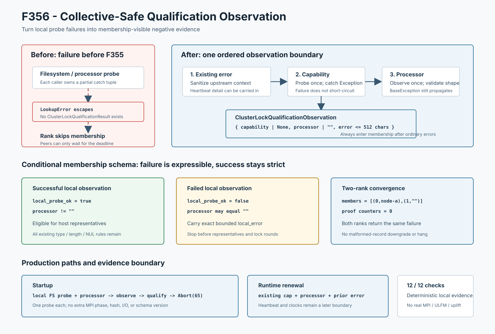

# F356：Collective-Safe Qualification Input Observation

- 功能编号：F356
- 日期：2026-08-10
- 状态：已实现、已进行机制验证
- 范围：MPI共享锁资格协议之前的本地filesystem/processor输入观测



## 1. 研究背景与真实缺陷

F355把公共`qualify_mpi_cluster_advisory_lock()`内部的普通异常总化为失败结果，但继续沿生产调用链向上审查
发现：进入公共API之前，调用方仍自行执行两个外部观测，并维护人工异常类型列表：

```text
startup: probe_shared_state_filesystem()
         catches OSError / RuntimeError / TypeError / ValueError

startup + renewal: MPI.Get_processor_name()
                   catches MPI.Exception / OSError / RuntimeError
```

两个可执行反例分别从filesystem adapter和processor adapter抛出`LookupError`，结果均为`escaped`。这类
普通异常发生在F355之前，会阻止本rank进入master-only membership exchange。其他master只能继续轮询到
deadline，startup无法到达统一`Abort(65)`，renewal也无法到达F353/F354 fatal-control链。

这不是锁证明算法错误，而是**证明输入采集与collective协议之间缺少异常契约**：内部结果生产已经total，
但生产所依赖的本地观测仍可能让rank提前离场。

## 2. 设计目标与失败语义

F356定义如下目标：

1. filesystem capability probe和processor identity probe的普通`Exception`不得越过输入观测边界；
2. 一个本地观测失败后，rank仍以显式失败记录参加bounded membership exchange；
3. 观测失败不得生成部分proof、代表主机或锁轮次；
4. filesystem probe失败后仍执行processor probe，使诊断尽可能完整且各rank调用形状一致；
5. `KeyboardInterrupt`、`SystemExit`等`BaseException`继续传播；
6. 成功路径不增加probe、MPI phase、filesystem I/O或hash。

观测失败的语义是“完成一次失败的本地输入观测”，随后由资格协议形成全master可见的失败结果；它不是
回滚到未调用，也不把未知processor伪装成某个有效主机。

## 3. 统一观测结果

新增不可变结果类型：

```text
ClusterLockQualificationObservation {
    capability: SharedFilesystemCapabilities | None
    processor_name: str
    error: str
}
```

公共函数`observe_cluster_lock_qualification_inputs()`接受可选既有capability、可选capability probe、
processor provider和已有local error，依次执行：

1. 清洗已有local error；非字符串输入映射为明确的invalid-input错误；
2. capability probe最多调用一次；普通异常映射为`capability=None`和有上下文的错误；
3. capability返回值必须是`SharedFilesystemCapabilities`，错误类型归一化为`None`；
4. processor provider最多调用一次，即使capability probe已经失败也继续执行；
5. processor必须是非空、最长255字符且不含NUL的字符串，否则归一化为空字符串并记录失败；
6. 多个错误按确定次序合并，删除换行/NUL并限制为512个Python字符。

F355的异常文本/类型名双层回退被抽取为共享`_bounded_exception_detail()`，避免producer boundary与
observation boundary各自实现一套容易漂移的诊断规则。异常`__str__`再次失败时使用同样受清洗和长度限制的
类型名。

## 4. Collective-safe membership 表达

旧membership schema无条件要求processor非空。即使F356把provider异常变成`processor=""`和
`local_probe_ok=false`，接收端仍会先报`malformed cluster membership record`，真实原因丢失。

F356把合法性条件精确改为：

\[
valid(record) = typed(record) \land bounded(processor) \land
(local\_probe\_ok \Rightarrow processor \ne \epsilon)
\]

因此：

- 成功记录仍必须有有效processor，跨host代表选择与锁证明条件完全不放宽；
- 失败记录可携带空processor和具体`local_error`，接收端在任何锁轮次前统一失败；
- rank、字段集合、布尔类型、processor类型/长度/NUL规则仍严格验证；
- 失败record会出现在诊断用members前缀，但不会进入representative选择或proof transcript。

资格函数同时改为“已有local error优先于泛化invalid-processor错误”，避免adapter根因被覆盖。

## 5. 生产调用链接入

### 5.1 Startup

```text
real local filesystem probe --\
                              observation boundary -> qualification membership
MPI processor provider ------/                         -> clean=False -> Abort(65)
```

filesystem probe通过闭包延迟到观测边界内部执行，processor provider也由同一API调用。任一普通异常都形成
local failure而不是单rank退出；有效结果继续沿原startup逻辑升级capability。

### 5.2 Runtime renewal

```text
existing capability + processor provider + prior heartbeat error
    -> observation boundary
    -> public qualification
    -> F353/F354 completion
    -> fatal-control on failure
```

runtime不重复昂贵filesystem probe，只验证并保留已有capability，processor仍每代观测一次。已有heartbeat
错误作为local error进入同一有界结果。heartbeat调用本身和qualification前后的`time.monotonic()`仍是独立
副作用/时钟边界，F356不声称已经总化，列入后续工作。

## 6. 正确性不变量

设`O`为本地观测，`M`为membership exchange，则F356要求：

\[
Exception(O) \Rightarrow O=(invalid, e) \land invoke(M,O)
\]

并保持：

```text
clean membership record  => non-empty valid processor
failed membership record => no representatives, no lock rounds, no transcript
ordinary probe exception => bounded error value
BaseException             => propagate
```

两rank合成执行中，rank 0使用`node-a`，rank 1的processor provider抛`LookupError`。两个rank最终均得到：

```text
members = ((0, "node-a"), (1, ""))
clean = verified = false
rounds = contention = release = identity = 0
error = master 1 local probe failed: processor identity probe raised: ...
```

这证明失败记录完成了collective诊断收敛，不代表MPI共识、原子提交或故障恢复。

## 7. 成本与兼容性

成功startup仍执行一次filesystem probe和一次processor probe；成功renewal仍只执行一次processor probe。
新增成本是一个冻结dataclass、少量类型检查和空错误拼接。MPI phase、lock litmus、proof transcript、
capability schema、消息tag、磁盘格式和配置项均不变。

失败路径不再立即展开Python栈，而是多执行一次既有bounded membership exchange。这会增加至多既有timeout
范围内的控制面工作，但换取全master一致的失败分类和统一shutdown入口。

## 8. 测试与可重算证据

| 验证层次 | 结果 |
|---|---:|
| F356定向输入观测 | 1 passed，35 deselected |
| 资格模块 + MPI生命周期 | 95 passed + 75 subtests |
| 生产API机制集成 | 12/12 checks |
| 六模块相关回归 | 378 passed + 101 subtests |
| 完整warnings-as-errors Python | 771 passed + 121 subtests（96.48秒） |

单元与机制driver覆盖：clean观测、filesystem/processor `LookupError`、失败后继续processor观测、有效capability
保留、错误返回类型归一化、已有local error清洗、512字符上限、异常文本渲染失败、两个`BaseException`
入口，以及双rank零滞留/同错误/零proof收敛。

driver使用真实本地filesystem capability probe；collective transport是线程安全的合成message bus。常量单调
时钟只用于消除非语义调度时间，JSON不包含临时路径，两次运行逐字节相同。

## 9. 先进性、创新性与挑战性

1. **从total result推进到collective-safe input**：F355保护协议函数内部，F356保护进入协议前的外部观测，
   形成`external observation -> typed failure -> membership -> total result`连续链；
2. **保持collective参与而非局部catch-and-return**：失败rank仍发送schema-valid负记录，使peer不必仅靠timeout
   猜测发生了什么；
3. **条件式schema而非放宽验证**：只对显式失败记录允许空processor，成功证明域保持原约束；
4. **多错误确定顺序聚合**：filesystem失败不短路processor观测，诊断既有上下文又受硬上限控制；
5. **共享异常渲染原语**：F355/F356共用文本失败与动态类型名回退规则，减少跨边界契约漂移。

创新点是把rank-local外部观测转换为collective可消费的类型化负证据，并精确调整membership schema使失败
可表达而成功证明不被削弱；不声称发明exception-as-value、MPI错误处理或failure detector。

## 10. 局限与有效性威胁

1. 双rank证据使用线程message bus，不是实际MPI transport或多机运行；
2. 真实filesystem probe只在本地文件系统执行，不认证NFS/Lustre跨client语义；
3. 普通异常边界不提供ULFM revoke/shrink、rank replacement或失败后继续运行；
4. peer仍受既有deadline约束，OS级进程终止或provider永久阻塞不能由Python异常边界处理；
5. runtime heartbeat及前后monotonic clock仍可能从不同语义边界抛异常；
6. 512字符诊断可能截断第二个错误，当前没有结构化多错误数组或跨rank traceback；
7. 在无法继续分配Python对象的资源耗尽状态，构造失败结果仍可能失败；
8. 12/12是机制断言，不是12次独立实验样本；没有运行solver、target、coverage、campaign、漏洞或LAVA-M，
   不提供性能、覆盖率或漏洞提升结论。

## 11. 后续研究

1. 为runtime heartbeat和pre/post-qualification clock建立副作用感知的失败原子观测边界；
2. 在真实双主机MPI中分别注入filesystem与processor provider异常，验证所有master进入同一Abort/shutdown；
3. 把字符串错误升级为结构化`stage/rank/generation/category/detail`记录，同时保留有界日志投影；
4. 对provider永久阻塞增加独立可取消执行或进程级watchdog，而不是依赖异常捕获；
5. 用状态模型组合F352-F356，验证任何普通失败都不能让单rank越过资格门继续派发工作。

## 12. 结论

F356修复了F355之前的两处真实普通异常逃逸。filesystem和processor观测现在通过同一total boundary生成
有界、类型化失败输入，失败rank仍参加membership exchange；条件式schema允许失败记录表达未知processor，
但不放宽成功证明。当前证据严格支持本地观测与合成collective的机制正确性，不外推真实MPI容错或符号执行
性能收益。
