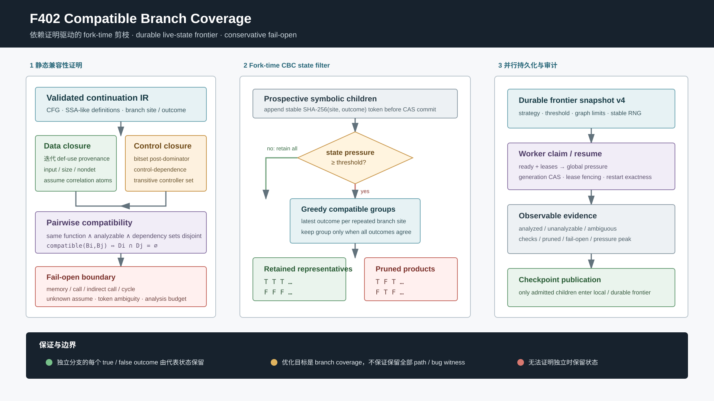

# F402：Compatible Branch Coverage 驱动的持久 Live-State 剪枝

- 日期：2026-08-14
- 功能编号：F402
- 状态：`I/T/E-mechanism`
- 工作包：W1 通用原生 continuation 与 live-state search
- 配置入口：`SYMCC_LIVE_SEARCH=cbc`
- 证据目录：[`f402-compatible-branch-coverage-2026-08-14`](../evidence/f402-compatible-branch-coverage-2026-08-14/)

## 1. 研究问题、来源与完成边界

普通覆盖导向符号执行把每次可行分叉都加入状态集合。若连续的 `n` 个分支彼此独立，状态
空间会形成 `2^n` 个笛卡尔积组合；但若目标只是覆盖每个分支的 true/false 两侧，许多组合
对 branch coverage 没有新增贡献。

Yi、Yu、Yang 在 PLDI 2024 提出的 Compatible Branch Coverage（CBC）先用程序依赖分析
构造 compatible branch set，再保留组内分支结果一致的状态，从而删除无新增分支覆盖贡献
的路径。论文、作者与会议信息见 [PLDI 2024 页面](https://pldi24.sigplan.org/details/pldi-2024-papers/67/Compatible-Branch-Coverage-Driven-Symbolic-Execution-for-Efficient-Bug-Finding)
和 [DOI 10.1145/3656443](https://doi.org/10.1145/3656443)；作者公开工件为
[CBC-SE V2.1](https://doi.org/10.5281/zenodo.10960926)。

本次开发没有只根据摘要实现一个同名 score。我们下载并校验了作者工件，逐项审阅其中
`ExecutionState.brSet`、`branchSet`、`computeBranchDependence`、`judgeDependence`、
`devideBranch`、`checkStates` 和 fork 接线。工件的关键判定是：

```text
对每个动态状态保存 branch -> latest T/F
将两两无依赖的 branch 贪心放入同一 compatible set
若某个 compatible set 内同时出现 T 和 F，则状态无覆盖贡献
仅当全局状态数达到 states_limit（工件默认 5）时执行剪枝
```

F402 将这一机制适配到项目的 content-addressed continuation 和 lease-fenced persistent
frontier。完成边界必须严格区分：

- **已实现**：函数内 data/control dependency closure、compatible set、fork-time 状态
  剪枝、状态压力门、snapshot v4、跨 worker 重启和可审计 telemetry；
- **工程收窄**：对 memory、普通/间接调用、循环分支、未知 `assume`、歧义 token 和超限
  图保守 fail-open；当前不是作者工件的 LLVM dependence graph 逐行移植；
- **保证目标**：保留静态证明为独立的分支的两侧覆盖代表，不保证保留全部路径、错误
  witness 或 target-specific reachability；
- **证据等级**：当前只有机制测试、穷举 oracle 和本机 synthetic benchmark，不把论文
  报告的路径缩减或 Coreutils 加速当成本项目实测，也不声称公开目标 coverage/bug-yield。

## 2. 总体架构



F402 分为三个边界清晰的阶段：

1. **静态证明面**：`LiveProgramGraph` 从已经过 validator 的 continuation IR 派生 CFG、
   SSA-like definition provenance、post-dominator 和控制依赖；
2. **动态剪枝面**：executor 先完成 feasibility check 和子状态构造，再对尚未提交的 child
   prefix 执行 CBC 判定；
3. **并行持久面**：策略配置随 search snapshot 持久化，worker 从 ready/lease 数量获得
   全局压力，只有被接纳的 child 才写入 CAS/frontier。

这与 F401 `path-cover` 的职责不同：F401 不删除状态，只改变领取顺序；F402 在满足压力门
后删除 compatible-set outcome 不一致的 prospective child。二者可以写成
`SYMCC_LIVE_SEARCH=cbc,path-cover` 交错选择，但 CBC 剪枝在每轮都保持启用。

## 3. 静态依赖分析

### 3.1 迭代 data provenance

每个函数先收集 `dst` 定义和显式 `{"var": name}` 使用。实现采用 worklist，而不是递归
遍历定义链，因此 1500 层的合法 unary chain 不受 Python recursion limit 影响。当前可证明
的来源为：

| IR 定义 | provenance |
| --- | --- |
| `const` | 空集合 |
| `input(offset)` | `input:offset` |
| `input_size` | `input-size` |
| `nondet` | 函数内唯一指令来源 |
| `binary/unary/select/pointer_offset` | 所有 operand provenance 的并集 |
| 声明式 `external_pure` | 所有实参 provenance 的保守并集 |

重复定义、未解析参数、definition cycle、`load`、heap、call result 和 exception/object 状态
得到 `unknown`。两个 branch 的 data closure 共享同一 input/nondet atom 时不会被判为兼容。

### 3.2 `assume` 相关性

仅比较两个 branch condition 的直接输入并不充分。例如 `B1` 依赖 `x`、`B2` 依赖 `y`，
但前缀含 `assume(x == y)` 时两者并不独立。F402 为每条可解析 `assume` 创建 correlation
atom，并把它加入所有与该 assume source 相交的 branch closure：

```text
D(B1) = {input:x, assume:k}
D(B2) = {input:y, assume:k}
D(B1) ∩ D(B2) = {assume:k}  -> dependent
```

`assume` 的任一变量无法解析时，整个函数的 CBC 分支都变为 unanalyzable；这是主动牺牲
剪枝机会的 soundness 边界。

### 3.3 bitset post-dominator 与控制依赖

函数内 CFG 加入 synthetic exit，反向计算可达 exit 的节点，再用 Python 整数 bitset 迭代
求 post-dominator。对分支 `A` 和候选分支节点 `B`：若 `B` post-dominate `A` 的某个
successor、但不 post-dominate `A`，则 `B` control-dependent on `A`。`B` 的 closure 会递归
吸收 controller 的 branch atom 和完整 data closure。

因此 diamond 汇合后的下一分支不依赖前一分支，而只存在于 true arm 内的嵌套分支一定
依赖外层分支。分支节点位于 cyclic SCC、存在不能到达 exit 的 successor，或 controller
不可分析时均 fail-open。

### 3.4 跨过程边界

当前 continuation CFG 的 return edge 位于动态 frame，静态图没有完整 call/return 匹配。
更重要的是，caller 的路径约束可能关联 callee 直接读取的不同输入。仅规定“不同函数的
branch 不兼容”仍不足以证明 callee 内部分支独立。因此 F402 对 call/indirect-call 的
caller 和所有静态 callee 整体禁用 CBC，telemetry 记录
`functions_interprocedural_fail_open`。后续只有在实现 context-sensitive interprocedural
summary 并验证 call-instance identity 后才能放宽。

### 3.5 Compatible set

每个 branch closure 至少包含自己的 branch atom。两个 branch 只有同时满足以下条件才兼容：

```text
不同 branch identity
∧ 同一 admitted function
∧ 两者均 analyzable
∧ dependency closures 不相交
```

动态 prefix 按首次出现顺序贪心分组；新 branch 只有与某组每个成员均兼容才进入该组。
重复执行同一 branch 时覆盖其 latest outcome，与作者工件的 `brSet[branch] = outcome` 一致。
同一 site 重用、未知 site 或 64 位 token 碰撞使 token 变为一对多时不参与分组。

## 4. 动态执行次序

普通 `branch` 和 `throw_if` 使用同一顺序：

1. 从当前 state 解析 condition 并构造 negation；
2. 结合 solver prefix 做 true/false feasibility check，删除已证明 UNSAT 的方向；
3. 若只剩一个方向，沿原有路径继续并记录 decision token；
4. 若有两个方向，先在内存中构造两个 child，追加稳定
   `SHA256(str(site) || NUL || str(choice))[0:8]` token；
5. 计算 `external ready/leases + local queue + local frontier + new children` 的状态压力；
6. 压力低于阈值时保留两者；达到阈值时分别运行 `cbc_guidance(prefix)`；
7. compatible group 中所有 latest outcomes 一致的 child 被接纳，出现混合结果的 child 被
   拒绝；
8. 若异常前缀导致本轮所有 child 都被拒绝，防御性 all-rejected fail-open，恢复两者；
9. 只有最终 survivor 才调用 `_commit()`，写入 content-addressed checkpoint 并进入 local
   queue 或 durable frontier。

CBC 位于 feasibility 之后，因此不会代替 Z3/solver 判断 SAT；又位于 CAS commit 之前，
因此被剪枝的状态不会制造孤立 checkpoint。它不写 AFL bitmap，也不改变 coverage corpus
准入语义。

## 5. 状态压力、并行与恢复

作者工件只在当前 state set 达到 `states_limit` 时剪枝，默认值为 5。F402 对应配置为
`SYMCC_LIVE_CBC_STATE_THRESHOLD`，默认同样为 5。

本地 `resume()` 使用 queue/frontier/children 数量。持久模式不能只看 claim 内的 queue：当
`max_states_per_claim=1` 时，本地几乎永远看不到全局爆炸。F402 在 claim 前读取当前
`ready + leases - selected`，将这个外部压力传入 `resume()`，再与本地 prospective states
相加。该值只是启发式启用门，不参与 checkpoint identity 或 lease correctness。

Search snapshot 从 v3 升为 v4并绑定：

- `cbc_state_threshold`；
- `cbc_max_function_nodes`；
- `cbc_max_branches`。

v1/v2/v3 均能以默认值升级到 v4。三个字段进入 `_configuration()`，因此 frontier 活跃时
由另一个环境不同的 worker 接管，仍恢复原策略；非法中途漂移由 selection/observation
transition verifier 拒绝。CBC 的静态图由 `program_root + config + enable flag` 确定性
重建，不把大图复制进每次 frontier transaction。

## 6. 配置与可观测性

| 配置 | 默认 | 范围 | 语义 |
| --- | ---: | ---: | --- |
| `SYMCC_LIVE_SEARCH` | `bfs` | 最多 8 个唯一策略 | 包含 `cbc` 才构造并使用 CBC；CBC 自身领取顺序为 FIFO |
| `SYMCC_LIVE_CBC_STATE_THRESHOLD` | 5 | 1..100000 | prospective state pressure 达到该值才剪枝 |
| `SYMCC_LIVE_CBC_FUNCTION_NODES` | 4096 | 16..262144 | 单函数 CFG 分析上限 |
| `SYMCC_LIVE_CBC_BRANCHES` | 4096 | 2..65536 | 单函数 branch 分析上限 |

`state_search.cbc_graph` 报告 enabled、函数准入/超限/跨过程降级、branch
analyzable/unanalyzable、token 和歧义数。`state_search.cbc_execution` 报告 checks、
pruned states、fail-open states、all-rejected recovery、threshold activations 和 pressure
peak。持久结果对每个 claim 保留原始 telemetry，并给出 campaign 内聚合值。

## 7. 实现与测试映射

| 文件 | 作用 |
| --- | --- |
| `util/live_state_search.py` | CBC provenance、post-dominator、控制闭包、compatible grouping、snapshot v4 |
| `util/live_continuation.py` | 普通/异常 fork-time filter、压力门、CAS 前剪枝、persistent pressure 和 telemetry |
| `test/test_live_cbc.py` | 数据/控制/assume/调用/内存/歧义/预算/深链/oracle/生产/重启测试 |
| `test/test_persistent_live_state_frontier.py` | v1/v2/v3 到 v4 升级与 transition 回归 |
| `test/test_persistent_live_continuation.py` | 原 path-cover worker 重启在 snapshot v4 下保持等价 |
| `benchmark/check_live_cbc_oracles.py` | 2--8 分支全部布尔组合穷举 oracle |
| `benchmark/benchmark_live_cbc.py` | exhaustive BFS 与 CBC 的 synthetic mechanism 对照 |

## 8. 当前实验结果

### 8.1 正确性证据

定向 CBC 测试覆盖：两两独立、共享输入、嵌套控制依赖、跨输入 `assume`、unknown load、
普通调用、重复 site、分析预算、1500 层定义链、全部组合 oracle、本地执行和持久重启。
独立 oracle 穷举 `n=2..8` 的全部 508 个布尔模式；每个规模只接纳 all-false 与 all-true
两个代表模式，且每个静态 branch 的 false/true outcome 都至少由一个代表模式保留。

| 门禁 | 封存结果 |
| --- | ---: |
| F402 定向 Python | 42 passed + 9 subtests |
| live/persistent 相关 Python | 132 passed + 60 subtests |
| capability-closed 完整 Python | 1013/1013 passed + 238 subtests |
| Python node-ID 清单 | 1013 个，SHA-256 `cb7a0cd0e4b001c3ced2b8264680a9a2604212d62356318b6bed001076ad7969` |
| LLVM 17 完整 lit | 262 discovered，260 passed，2 existing unsupported，0 failed |

上述计数、node-ID 清单和 SHA-256 身份均封存在证据目录，不以当前工作树的
临时输出替代。

### 8.2 Synthetic mechanism benchmark

固定模型由 6 个顺序、两两独立的 symbolic byte equality branch 组成，每种策略独立
执行 11 次。

| 指标 | BFS | CBC | 变化 |
| --- | ---: | ---: | ---: |
| 终止状态 | 64 | 2 | -96.875% |
| forks | 63 | 11 | -82.540% |
| checkpoint | 126 | 12 | -90.476% |
| feasibility checks | 126 | 22 | -82.540% |
| CBC checks / pruned children | 0 / 0 | 22 / 10 | 机制计数 |
| wall-clock 中位 | 2.776778111 s | 0.487879370 s | 仅本模型观测 |

CBC 静态构图 11 次的中位为 0.420460 ms（min 0.408432，max 0.685147 ms）。原始
多样本 wall-clock、solver check 和构图统计见 evidence 中的
`live-cbc-mechanism-benchmark.json`。

该模型特意构造论文算法最适合的独立笛卡尔积，不能代表真实程序分支依赖分布。wall-clock
还包含 Python interpreter、临时 CAS 和 solver 进程成本。因此这里可以证明“生产执行路径
确实删除了预期状态并减少相应 feasibility checks”，不能推导 Coreutils、LAVA-M、总体
coverage 或缺陷发现速度。

论文报告的“超过 45% 路径缩减”和 Coreutils 约 3 倍加速是作者实验结论，不是 F402 的
本地复现实验结果；两组数据在报告和 evidence 中保持分离。

## 9. 多轮 Review 结论

1. **算法身份 review**：CBC 必须是 fork-time pruning，不以未覆盖距离 score 冒充；
2. **数据依赖 review**：重复定义、load/heap/call/parameter 一律 unknown，不猜测 alias；
3. **约束相关性 review**：增加 `assume` correlation atom，关闭“输入不同即独立”的反例；
4. **控制依赖 review**：用 post-dominator 区分顺序汇合与嵌套分支，controller closure 传递；
5. **跨过程 review**：仅禁止跨函数分组仍不充分，最终把 caller/callee 均设为 fail-open；
6. **循环 review**：cyclic branch 和无 exit 路径不进入兼容证明；
7. **碰撞 review**：64 位 token 不是无碰撞身份证明，一对多映射不参与剪枝；
8. **持久并行 review**：压力包括 durable ready/leases，snapshot v4 阻止环境漂移；
9. **原子性 review**：先 filter 后 commit，剪枝状态不发布 CAS checkpoint；
10. **恢复 review**：all-rejected 时保留全部 child，避免 forced prefix 造成整棵子树消失；
11. **复杂度 review**：定义求解无递归，CFG/branch 数有独立上限；
12. **声明 review**：branch coverage 目标不扩写为 path completeness 或 bug preservation。

## 10. 尚未关闭的问题

- 作者工件的 LLVM dependence graph 有有界 interprocedural reverse traversal；F402 当前采用
  更保守的整函数 call boundary，尚缺 context-sensitive call/return summary；
- 当前 CFG provenance 没有 alias-aware MemorySSA，memory-derived branch 不参与 CBC；
- CBC 的 branch coverage 保证与 target-directed bug finding 可能冲突，需要 target pinning
  或 witness reservation 后再研究组合策略；
- 尚未完成公开 benchmark 上等 CPU、多 seed、固定 corpus 的确认性实验；
- W1 后续仍需实现 CGS concrete-constraint-guided selection 和 TopSeed 独立策略。

因此 F402 关闭的是 W1 中“CBC 兼容分支 live-state 剪枝”这一独立切片，W1 和十项 SOTA
路线整体仍未关闭。
