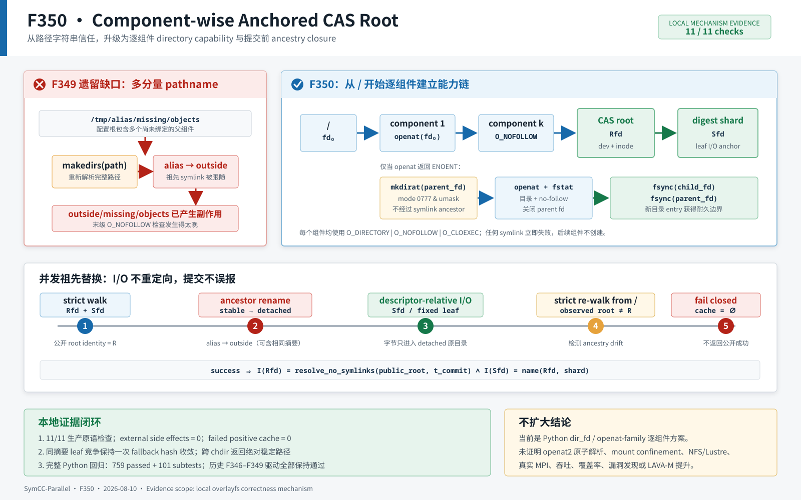

# F350：Component-Wise Anchored CAS Root

> 功能编号：`F350`  
> 日期：`2026-08-10`  
> 状态：已实现；定向、相关、完整回归和生产原语机制验证完成  
> 证据等级：`I/T/E-mechanism`，尚无真实多机或 campaign 性能结论



## 1. 研究背景与深度审查结论

F346 闭合了 CAS 写 descriptor 与最终 leaf 的发布竞态，F347 将同一发布/读取内核推广到 live-state JSON，
F348 对 continuation Merkle DAG 增加传递预算，F349 又把 CAS root、digest shard 和 leaf 纳入一次
descriptor-anchored namespace transaction。然而继续审查 F349 的构造与重开路径后，发现仍有一个位于
**配置根之上**的缺口：

```python
durable_makedirs(root)
root_fd = open(abspath(root), O_DIRECTORY | O_NOFOLLOW)
```

`O_NOFOLLOW` 只约束传给该次 `open` 的最后一个分量。若配置为
`/tmp/alias/missing/objects`，且 `alias` 是指向外部目录的符号链接，普通 `makedirs` 会先在外部创建
`missing/objects`；随后只检查最终 `objects` 并不能撤销副作用。更隐蔽的情况是外部已经存在真实
`objects` 目录，此时旧构造甚至会成功。每次对象操作按完整绝对路径重开 root 时也有同样问题：
祖先可在操作前或操作中被替换，最终分量本身仍可能是真目录。

因此 F349 报告中“配置 CAS root 以上祖先是部署信任边界”是当时实现的准确限制，而不是最终设计目标。
F350 将这个边界继续上推到文件系统根 `/`：配置根的**每一个路径组件**都相对于已经打开的父目录 fd
执行 no-follow 打开；缺失组件只在父 fd 内创建。操作结束前再从 `/` 逐组件重走，并要求最终 root 的
device/inode 与本次 I/O 使用的 root fd 相同。

该问题属于并行符号执行框架的共享状态正确性：错误的 CAS 路径归属会破坏 worker 输入、continuation
恢复和 positive cache 的语义，但本功能不涉及攻击实现，也不据此声称求解、覆盖率或漏洞发现提升。

## 2. 技术依据与现有方法对照

### 2.1 为什么单次 `O_NOFOLLOW` 不够

Linux `open(2)` 明确指出，`O_NOFOLLOW` 只拒绝 pathname 的 trailing component；前缀中的符号链接仍会
被解析。POSIX `openat()`、`mkdirat()` 和 `renameat()` 允许调用者用 directory fd 限定相对名称的解析位置，
避免父 pathname 在检查与使用之间再次解析。Python `os.open/os.mkdir/os.stat/os.replace/os.unlink` 暴露了
这些 `dir_fd` 能力，并通过 `os.supports_dir_fd` 描述平台支持情况。

F350 采用 portable Python 可表达的逐组件方案：

- `openat(parent_fd, component, O_DIRECTORY|O_NOFOLLOW|O_CLOEXEC)`；
- 仅当打开返回 `ENOENT` 时，在同一 `parent_fd` 中执行 `mkdirat`；
- 新目录打开成功后同步 child fd 和 parent fd；
- 关闭上一个 parent，只把新 child fd 作为下一步 capability；
- 最终 root fd 与重新逐组件解析得到的 fd 比较 `(st_dev, st_ino)`。

Linux `openat2(2)` 从 5.6 起提供 `RESOLVE_BENEATH`、`RESOLVE_NO_SYMLINKS`、
`RESOLVE_NO_MAGICLINKS` 和 `RESOLVE_NO_XDEV` 等整次路径解析约束。它对一次多分量解析的内核原子控制
强于当前循环；但 Python 标准库没有直接 `openat2` wrapper，本轮没有通过私有 syscall ABI 假装获得同等语义。

权威参考：

- [Linux `openat(2)`：`O_NOFOLLOW` 与 directory fd](https://man7.org/linux/man-pages/man2/openat.2.html)
- [Linux `openat2(2)`：`RESOLVE_BENEATH` 与 `RESOLVE_NO_SYMLINKS`](https://man7.org/linux/man-pages/man2/openat2.2.html)
- [Linux `path_resolution(7)`](https://man7.org/linux/man-pages/man7/path_resolution.7.html)
- [POSIX `mkdirat`](https://pubs.opengroup.org/onlinepubs/9799919799/functions/mkdir.html)
- [POSIX `renameat`](https://pubs.opengroup.org/onlinepubs/9799919799/functions/rename.html)
- [Python `os` descriptor-relative operations](https://docs.python.org/3/library/os.html#files-and-directories)

### 2.2 研究定位

本功能没有发明新的路径解析系统调用。研究贡献在于把操作系统 capability 语义嵌入并行符号执行的
content-addressed input/live-state 协议，并形成可测试的不变量：**只有公开 root 在事务结束时仍能通过
no-symlink 组件链解析到本次 I/O 使用的 inode，摘要对象才可成为调度器和 worker 的 positive fact。**

## 3. 并发与故障模型

考虑本地或共享文件系统上的非合作并发进程，它可以在任意系统调用之间：

1. rename 配置 root 的任一祖先；
2. 在原名称放入真实目录或指向其他目录的 symlink；
3. 在别名目录内放入内容完全相同、摘要也相同的对象；
4. 与当前 writer 竞争同一个 digest leaf。

本实现要求：

- 不沿配置 root 任一 symlink 祖先创建目录或读写对象；
- 已取得 `Rfd/Sfd` 后，后续 I/O 不因 pathname 替换而重定向；
- 若公开 root 在正常完成时不再解析到 `Rfd`，API 必须失败且不写 positive cache；
- 正确的同摘要 leaf writer 仍可收敛，不能把合法 CAS 并发一律视为错误；
- 错误路径清除 temporary 名称并撤销旧 cache identity。

不在本轮模型中的能力包括：修改已打开 inode 内容的特权进程、mount namespace 原子变化、Byzantine
存储、内核/硬件故障和 API 返回之后对字符串 pathname 的替换。

## 4. 形式化不变量

设绝对配置根分解为 `C = (c1, c2, ..., cn)`，`D0` 是 `/` 的目录 fd，
`Di = openat(Di-1, ci, DIRECTORY|NOFOLLOW)`。`I(fd)` 表示 fd 的 `(device,inode)`，
`Walk(C,t)` 表示时刻 `t` 从 `/` 开始、不允许任何 symlink 的逐组件解析结果。

### 4.1 构造不变量

```text
for every i in [1,n]:
  Di is opened relative to D(i-1)
  ci is a real directory, never a followed symlink

if ci is missing:
  mkdirat(D(i-1), ci)
  fsync(Di); fsync(D(i-1))

constructor success => I(Dn) = I(Walk(C, t_return))
```

若第 `k` 个已有组件是 symlink，遍历在 `k` 处失败，`k+1...n` 不会被创建。若遍历早期已经创建了合法
目录、而更晚组件失败，早期目录可能保留；这与 `makedirs` 的部分树语义一致，但不存在跨 symlink 的
外部副作用。

### 4.2 对象事务不变量

```text
Rfd = Walk(C, t_open)
Sfd = openat(Rfd, digest[0:2], DIRECTORY|NOFOLLOW)

all leaf I/O = op(Sfd, digest[2:] + suffix)

success => I(Rfd) = I(Walk(C, t_commit))
        && I(Sfd) = I(stat_at(Rfd, shard, no_follow))
        && SHA256(leaf bytes) = object_id

positive_cache[object_id] is committed only after all equalities hold
```

目录 fd 保证“操作没有写入新 alias”；提交前重走保证“detached 原目录中的成功没有被错报成公开成功”。
两条性质必须同时成立。

## 5. 实现与执行流程

### 5.1 根路径规范化

`ContentAddressedInputStore` 在构造时把 `os.fspath(root)` 固定为绝对路径，并把公开 `self.root` 也设为
该绝对值。此前内部 I/O 使用构造时绝对路径，而 `object_path()` 可能继续返回相对路径；进程 `chdir` 后，
消费者拿到的字符串会与真实 CAS 分叉。F350 使内部锚点和公开对象路径共享同一稳定根。

根路径必须是无 NUL 的字符串绝对路径。对象 suffix 仍受 leaf-only 校验，摘要仍必须是 64 位小写十六进制，
磁盘布局不变：

```text
<absolute-root>/<digest[0:2]>/<digest[2:] + optional-suffix>
```

### 5.2 `_open_root_directory(create=...)`

执行次序如下：

1. 以 `O_DIRECTORY|O_NOFOLLOW|O_CLOEXEC` 打开 `/`；
2. 将规范绝对路径拆成非空组件，不使用 `realpath`，因后者会主动解析 symlink；
3. 对每个组件先执行 descriptor-relative no-follow `open`；
4. 若且仅若结果为 `FileNotFoundError` 且 `create=True`，执行
   `mkdir(component, 0777, dir_fd=parent)`；实际权限由进程 umask 收紧，与旧 `makedirs` 一致；
5. 处理另一个创建者抢先完成的 `FileExistsError`，随后再次 no-follow 打开；
6. 新目录同步 child 与 parent，保证目录自身及其名称 publication 获得既有耐久边界；
7. 先把 child 设为当前受管 fd，再关闭 parent；异常时 `finally` 关闭唯一存活 fd，避免描述符泄漏；
8. 返回最终 root fd。

`open-first` 很重要：已有 `/tmp`、`home` 等祖先只产生一次 `openat`，不会每次构造都做必然失败的
`mkdirat`。只有实际缺失的组件和随后首次创建的 digest shard 进入创建路径。

### 5.3 `_verify_root_directory(root_fd)`

验证函数先记录 `fstat(root_fd)` identity，再用 `create=False` 从 `/` 严格重走完整组件链：

- 任一 symlink、非目录或缺失组件导致 ancestry failure；
- 重走成功但最终 device/inode 不同，同样报告 `ESTALE` 类错误；
- symlink/非目录保持 `NotADirectoryError` API 类型，使 F349 的故障分类与历史驱动可继续复现；
- 重开 fd 在比较后无条件关闭。

构造函数在创建后调用一次；每次 `_object_directory` 正常结束后再调用一次。内部操作抛错时不会登记
cache，因此无需用第二个错误覆盖原始故障。

### 5.4 与 F349 root/shard/leaf 事务组合

对象操作现在通过严格组件链获得 `Rfd`，随后保持 F349 的流程：

1. 从 `Rfd` 相对打开或创建两字符 shard，得到 `Sfd`；
2. temporary create、write、fsync、rename、stat、snapshot 和 cleanup 全部绑定 `Sfd`；
3. 正确同摘要 competitor 以一次稳定 fallback hash 收敛；
4. 内部 I/O 后先重走 root ancestry，再核对 `Rfd/shard` 与 `Sfd`；
5. context 成功退出后才登记 verified identity。

`LiveStateStore` 无旁路：expression、solver frame、symbolic store、memory page/root、program 和 checkpoint
descriptor 都继续复用同一 `ContentAddressedInputStore`。

## 6. 正确性论证

### 6.1 symlink 祖先

对某一组件 `ci`，唯一打开方式是 `openat(Di-1, ci, O_NOFOLLOW|O_DIRECTORY)`。若它是 symlink，系统调用
失败；算法不会取得 `Di`，也不会处理任何后继组件。因此不能在 symlink 目标中创建 `ci+1...cn`。

### 6.2 创建竞争

若首次 open 返回 `ENOENT`，两个创建者可以同时调用 `mkdirat`。至多一个成功；另一个收到
`FileExistsError`。两者都必须随后 no-follow 打开实际目录，所以不能因为 check/create 间隙接受 symlink。
若名称在创建后、打开前被替换为 symlink，第二次 open 失败；若替换为真实目录，则调用锚定替代目录并在
事务结束时重新验证公开路径。尚未对“必须是当前进程创建的 inode”提出所有权要求。

### 6.3 发布期间祖先替换

当祖先被 rename、原名称变成外部 alias 时，`Rfd/Sfd` 仍引用原 inode，所以 leaf bytes 只写到 detached
目录。内部 I/O 完成后，从 `/` 严格重走会在 symlink 处失败，或得到不同 root identity；API 失败、cache
为空。即使 alias 中存在内容和摘要完全相同的对象，也不能替代 namespace identity 证明。

### 6.4 正确同摘要竞争

祖先闭合与 leaf writer 仲裁是正交的：多个 writer 在同一 `Sfd` 中发布相同摘要对象时，最终 leaf inode
可能不是当前写 fd，但稳定 SHA-256 验证成功即可收敛。F350 没有把目录加固错误地变成 single-writer CAS。

## 7. 测试设计与精确结果

### 7.1 新增测试

`test/test_distributed_state.py` 新增 6 个顶层测试：

1. 三层缺失根按组件创建，put/snapshot 字节与摘要精确；
2. 相对根在构造后切换工作目录，公开路径仍为稳定绝对路径；
3. symlink 祖先下还有缺失后代时构造失败，外部目录保持空；
4. symlink 祖先下已经存在完整 root 时仍拒绝，sentinel 不变；
5. 发布后立即替换 root 的上层祖先，detached 对象精确、外部仅有 sentinel、cache 为空；
6. live-state 首次 read 后替换上层祖先，alias 预放完全相同 JSON，读取仍失败且 cache 为空。

同时保留 F349 的最终 root/shard symlink、root/shard replacement、leaf competitor 和 live shard read 用例。

### 7.2 自动化回归

| 验证层 | 命令范围 | 精确结果 |
| --- | --- | ---: |
| F350 定向 | 8 个 ancestry/root/shard 用例，`-W error` | 8 passed，155 deselected，0.21 s |
| `test_distributed_state.py` 开发门 | `unittest` 全模块 | 163 tests，15.154 s |
| 六模块相关 | distributed state、MPI filesystem/lifecycle、hybrid feedback、AFL profile、adaptive components | 366 passed + 81 subtests，17.05 s |
| 完整 Python | `test/test_*.py`，`-W error` | 759 passed + 101 subtests，95.53 s |
| 静态检查 | 生产代码、测试、F350 driver、delivery verifier | Ruff all checks passed |

相对 F349 的权威完整回归 `753 passed + 101 subtests`，F350 增加 6 个顶层测试，原 101 个 subtests 全部
保持通过。测试数字是正确性门，不是性能提升样本。

### 7.3 生产原语机制集成

F350 driver 在真实本地 overlayfs 上使用生产 store，只用 mock 固定 ancestor rename、首次 read 和 leaf
competitor 的发生时点。11/11 检查均为 true：

| 观测 | 精确结果 |
| --- | ---: |
| nested root + put + snapshot | exact |
| descriptor-relative mkdir calls | `level-one, level-two, objects, 17`，4/4 带 `dir_fd` |
| relative root after `chdir("/")` | absolute path，snapshot exact |
| missing/existing symlink ancestor | 均 `NotADirectoryError` |
| external missing-root side effects | 0 entries |
| publication ancestor replacement | `NotADirectoryError`，callback 收到 dirfd |
| detached publication object | exact |
| external publication directory | sentinel only，未重定向写入 |
| live read exact alias | `ValueError`，alias/detached bytes 均 exact |
| failed positive caches | publication 0，live read 0 |
| exact competitor fallback hashes | 1 |
| temporary residue | 0 |

固定普通对象 ID 为
`17876391d93c7ac6f062c86145779341d7107d31bc05d03e94c4ee4e3c399e33`。同一 driver 连续两次输出
字节一致的 JSON/log。F346、F347、F348、F349 历史生产原语 driver 在当前代码上继续分别通过
`8/8、8/8、9/9、11/11`。

## 8. 复杂度、性能预期与不可宣称项

设配置根深度为 `D`：

- 构造和每次严格重开为 `O(D)` 次 metadata open；
- 缺失组件额外产生一次失败 open、一次 mkdir、一次成功 open 和两个 fsync；
- 已有组件采用 open-first，不产生失败 mkdir；
- shard/leaf 的 payload hash 复杂度与 F349 相同；cache hit 不扫描 payload；
- 成功对象事务结束前增加一次 `O(D)` root re-walk。

这些是算法与系统调用级分析。本轮没有进行不同路径深度、冷/热 cache、并发 writer 数或远程文件系统下的
延迟微基准，因此不能声称性能提高；相反，更强 ancestry closure 必然增加常数级 metadata 工作。其价值是
消除错误成功和外部副作用，而不是在缺少测量时宣称吞吐收益。

## 9. 技术进步、创新性与挑战性

1. **可信边界连续扩展**：F346 leaf publication → F349 root/shard transaction → F350 `/` 到配置 root 的
   component chain，形成可追踪的分层证明，而非一次大而不可验证的重写。
2. **创建与使用采用同一 capability 模型**：不仅对象 I/O 相对 fd，root 本身的创建也相对已打开 parent；
   这关闭了“检查最终目录正确，但副作用已经穿过祖先 alias”的时序漏洞。
3. **open-first 的兼容性优化**：强约束没有以每次对所有祖先尝试 mkdir 为代价；只有 `ENOENT` 才进入创建，
   同时正确处理并发创建者。
4. **内容身份不能替代命名空间身份**：故障注入特意在 alias 中放入精确相同摘要对象；系统仍拒绝，证明
   digest integrity 与 namespace membership 是两个独立条件。
5. **内部与外部路径语义统一**：构造时固定绝对 root，消除 `chdir` 后“内部 fd 正确、返回字符串错误”的
   次生 bug。
6. **历史证据可运行**：错误分类保留、F346-F349 drivers 全部在新生产代码上复算通过，避免新实现让旧
   报告只剩不可执行快照。
7. **挑战性来自跨层状态机**：路径组件、fd 生命周期、mkdir/rename 竞争、fsync 顺序、leaf CAS 收敛、
   live-state 解析和 cache admission 必须同时成立；仅增加一次 `realpath`、`isdir` 或开始前检查都不足够。

## 10. 兼容性与部署影响

- CAS 磁盘布局、SHA-256、两字符 shard、live-state `.json` suffix 和 checkpoint ID 不变；
- 新建 root 组件继续使用 `0777 & umask`，digest shard 继续为原有 `0700 & umask`；
- 返回对象路径现在总是构造时固定的绝对路径；依赖相对返回值的非标准调用方需调整；
- 配置路径中任一 symlink 祖先现在明确拒绝。部署若使用 `/var/run -> /run`、symlinked scratch 目录或
  symlinked home，必须改为真实解析后的无 symlink 路径；系统不会提供静默弱化开关；
- 缺少 `O_NOFOLLOW` 或 `O_DIRECTORY` 的平台继续失败关闭；当前实现面向支持 Python `dir_fd` 的 Unix 环境。

## 11. 局限与有效性威胁

1. 逐组件循环不是单个 `openat2` 调用；组件可在相邻系统调用之间变化。已经打开的 parent fd 防止后续 I/O
   重定向，最终 re-walk 防止错误提交，但不能观测“替换后又恢复”的 ABA 历史。
2. 当前允许跨 mount point；没有 `RESOLVE_NO_XDEV` 等价约束，也不阻止 mount topology 变化。
3. 从 `/` 开始避免祖先 symlink，却不构成容器 escape 或不可信相对路径 sandbox。配置由运维提供，不接收
   任意 `..`/绝对 symlink 输入。
4. 后续组件失败时，之前由本次调用创建的真实目录可能保留；保证是“无外部 alias 副作用”，不是全树事务
   回滚。
5. `(device,inode)` 不是 Byzantine storage proof；regular leaf 的 SHA-256、稳定 metadata snapshot 和 JSON
   schema 仍承担内容正确性。
6. overlayfs 本地机制结果不能外推到 NFS、Lustre、另一主机或独立 mount namespace；目录 fd、attribute
   cache、rename 和 fsync 语义仍需实际部署资格测试。
7. 本轮不运行真实 MPI、符号执行目标、Z3、`afl-showmap` 或 fuzzing campaign，因此不声称 throughput、
   coverage、solver、bug-discovery 或 LAVA-M uplift。

## 12. 后续研究计划

1. 设计 Linux 可选 `openat2` backend，以受信 deployment fd 配合
   `RESOLVE_BENEATH|RESOLVE_NO_SYMLINKS|RESOLVE_NO_MAGICLINKS`，并保留当前 portable backend；
2. 扩展 shared-filesystem capability probe，验证部署根的 component-wise no-follow、directory-fd rename、
   fsync 与远程可见性，而不是由本地 overlayfs 结果推断 NFS/Lustre；
3. 为 ancestry failure、root/shard ESTALE、leaf competitor 和 cache invalidation 增加有界结构化 telemetry，
   量化真实运行中各失败来源；
4. 对路径深度、对象大小、cache hit ratio 和并发 writer 数执行交错微基准，报告 metadata 代价分布；
5. 将对外 pathname 交付逐步改为 digest capability + consumer-side revalidation contract，降低 API 返回后的
   pathname 信任窗口。

## 13. 证据索引

- 生产实现：[`util/distributed_state.py`](../../../util/distributed_state.py)
- 单元测试：[`test/test_distributed_state.py`](../../../test/test_distributed_state.py)
- 机制图：[`component-wise-anchored-cas-root-2026-08-10.svg`](../diagrams/component-wise-anchored-cas-root-2026-08-10.svg)
- 集成 JSON：[`component-wise-root-integration.json`](../evidence/f350-component-wise-anchored-cas-root-2026-08-10/component-wise-root-integration.json)
- 复现驱动：[`run_component_wise_root_integration.py`](../evidence/f350-component-wise-anchored-cas-root-2026-08-10/run_component_wise_root_integration.py)
- 测试日志与边界：[`F350 evidence`](../evidence/f350-component-wise-anchored-cas-root-2026-08-10/)
- 证据完整性：[`SHA256SUMS.txt`](../evidence/f350-component-wise-anchored-cas-root-2026-08-10/SHA256SUMS.txt)
