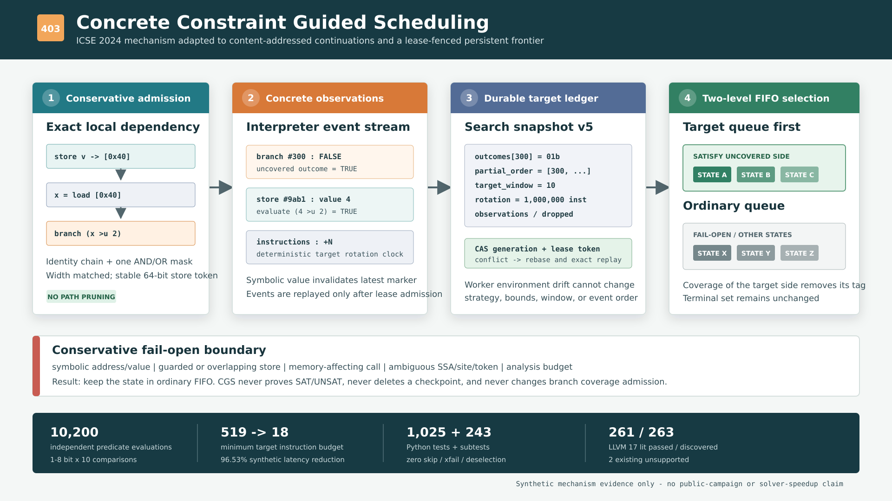

# F403：Concrete Constraint Guided Scheduling 持久化具体约束引导调度

## 0. 结论与边界

- 功能编号：F403
- 实现日期：2026-08-15
- 配置入口：`SYMCC_LIVE_SEARCH=cgs`
- 交付状态：生产 continuation 调度、持久 frontier、测试、独立 oracle、机制实验与文档均已接线
- 证据目录：[`f403-concrete-constraint-guided-scheduling-2026-08-15`](../evidence/f403-concrete-constraint-guided-scheduling-2026-08-15/)
- 实现分级：`I/T/E-mechanism`，不是论文全部 LLVM/IDA 分析能力的等价复现

F403 将 Sun 等人在 ICSE 2024 提出的 Concrete Constraint Guided Symbolic
Execution（CGS）适配到本项目的 content-addressed continuation 与 lease-fenced
persistent frontier。核心行为是：当一个**具体分支**只覆盖了一侧时，优先执行其最新具体
store 值能够满足未覆盖侧的状态；无证据的状态仍按 FIFO 保留。CGS 不调用求解器判断该
优先级，也不删除路径。

本次实现关闭的是“具体约束驱动的 live-state 优先调度”切片，不宣称以下结论：

1. 不宣称完整复现作者 IDA 的 alias-aware branch dependency analysis；
2. 不宣称具备作者 KLEE 工件对 switch、复杂布尔组合和全部 LLVM memory object 的支持面；
3. 不宣称合成机制实验等同于论文公开 benchmark；
4. 不宣称总体 wall time、solver throughput、公共目标覆盖率或漏洞发现率提高；
5. 不宣称 CGS 提供完备性证明。终态集合一致是本次有界合成程序的实测结果。

## 1. 研究来源与算法身份

主要研究来源为 Yue Sun、Guowei Yang、Shichao Lv、Zhi Li、Limin Sun 的
“Concrete Constraint Guided Symbolic Execution”，ICSE 2024，
[DOI 10.1145/3597503.3639078](https://doi.org/10.1145/3597503.3639078)。作者工件由
[ICSE 2024 Artifact Evaluation 页面](https://conf.researchr.org/details/icse-2024/icse-2024-artifact-evaluation/3/Concrete-Constraint-Guided-Symbolic-Execution)
指向 [Zenodo 10516325](https://zenodo.org/records/10516325)。本次核验的作者仓库提交为
`7cf3890d80df12660255d81a8b50945cf1cc85a3`，预印本 SHA-256 为
`91b85536eb9410eed2d019dee1dd884df6b5207419c9e83f925941af25e63969`。

论文和作者工件的算法身份不是“对 query complexity 打分”，也不是“遇到具体分支就随机
翻转”。其关键链条是：

1. 离线分析 concrete branch variable 与定义它的 store；
2. concrete branch 首次只覆盖一侧时，记录未覆盖谓词并成为 target；
3. 执行到相关 store 后，记录该 state 的具体 store value；
4. 若该值能够使 target 的未覆盖侧成立，把 state 放入优先队列；
5. 优先队列与普通队列内部均为 BFS/FIFO，优先队列先领取；
6. target 被完整覆盖后，删除相应 state tag；
7. 周期性更新 target branch 集合，控制状态与元数据预算。

作者源码默认 `target-branch-num=10`、`target-branch-reach-max=64`；
`target-branch-update-insts` 的帮助文本写 500000，而实际 `cl::init` 为 1000000。本实现以
实际初始化值 1000000 为默认 rotation interval，并在文档与证据中保留这一源码/说明差异。

## 2. 总体架构



F403 分为四层：

1. **静态准入层**：从 continuation IR 提取精确的函数内 `store -> load -> icmp` 链；
2. **动态观测层**：记录解释器指令、具体 branch outcome、具体 store value 与符号失效；
3. **持久目标层**：snapshot v5 保存 outcome mask、partial order、rotation clock 和预算；
4. **调度层**：满足未覆盖侧的 state 进入 target FIFO，其余 state 保持 ordinary FIFO。

这种拆分适配了项目已有的执行粒度：KLEE searcher 可在每条指令后更新 state queue，而本
项目一个 continuation claim 可能连续执行多条指令直到 fork、halt 或资源边界。因此，若
ready state 的 PC 正好位于相关 store，F403 对该 store RHS 做保守前瞻；只有 RHS 已是具体
值且谓词求值满足未覆盖侧，才提前进入 target FIFO。未知或符号 RHS 不获得优先级。

## 3. 静态依赖分析

### 3.1 支持的表达式形状

当前准入子集为：

```text
store concrete_value -> [fixed_address]
loaded = load [same_fixed_address]
[optional identity chain]
[optional: transformed = loaded AND/OR constant]
condition = ICMP transformed, constant
branch condition
```

比较谓词支持：

- `eq`、`ne`；
- `ult`、`ule`、`ugt`、`uge`；
- `slt`、`sle`、`sgt`、`sge`。

常量在比较左侧时，分析器交换操作数并规范化方向，例如 `C <u x` 转成 `x >u C`。有符号
比较先按目标位宽截断，再作二补码解释。`and`/`or` 变换最多一层，mask、比较常量、load
和 store 的显式位宽必须一致。identity 链以迭代方式追踪，1500 层测试不会使用 Python
递归栈。

### 3.2 store token 与碰撞处理

每个准入 store 使用

```text
SHA256(function \0 block \0 instruction_index)[0:64 bit]
```

生成稳定 token。token 在 checkpoint 中只用作内部 marker 名的一部分。若同一 program
出现 64-bit token collision，所有冲突 store 均不准入；branch site 重复映射到多个具体
目标时，该 site 也不准入。碰撞不靠“概率足够小”跳过验证。

### 3.3 常数级宽度的重叠检查

初版 review 发现“每个 branch 扫描函数内全部 store”最坏为二次复杂度。最终实现对每个
1--64 bit store 最多登记 8 个 byte slot，并建立 `(function,address,width) -> tokens`
索引。目标 load 只扫描自身最多 8 个 byte slot：

- guarded store 与其任一 byte 重叠：拒绝；
- 固定地址但宽度/起点不同的 store 与其重叠：拒绝；
- 符号地址或非法宽度无法定位：整个函数拒绝；
- 精确同址同宽、无 guard 的多个 store：全部作为可跟踪定义。

因此别名检查从 `O(branches * stores)` 收紧为建索引 `O(stores * 8)`、每目标 `O(8)`，同时
保持保守语义。

### 3.4 失败开放

以下情况不会产生 CGS target：

- symbolic address；
- guarded store；
- 相交但非精确同址同宽的 store；
- `call`、`indirect_call`、heap allocation/reallocation/free 或 exception allocation；
- guarded load、非唯一 SSA definition、循环 identity definition；
- 不支持的 predicate/transform；
- branch site 或 store token 歧义；
- 单函数 CFG/branch 数超过配置边界。

失败开放的含义是 state 进入普通 FIFO，不是终止 state，也不是假设 branch 不可达。
`external_pure` 已有无副作用契约，因此不会仅因其存在而禁用 CGS。

## 4. 动态执行流程

### 4.1 每条解释器指令

当策略集合包含 `cgs` 时，每执行一条 continuation IR 指令：

1. `cgs_instruction_count += 1`；
2. 本地把相邻 instruction 事件合并成一个 batch；
3. target window 按 `instruction_count // rotation_interval` 确定性旋转；
4. selection 本身不消耗随机数。

指令数使用有界 63-bit 单调计数；溢出失败关闭，而不是回绕改变调度顺序。

### 4.2 store 观测

解释器完成一个静态准入 store 的 memory mutation 后：

1. 用 `(function,block,instruction)` 查稳定 token；
2. RHS 为具体值时，在 state symbolic store 中写入 `@cgs:store:<token>` marker；
3. RHS 为符号表达式时删除该 marker，避免把旧具体定义当成 latest value；
4. checkpoint/CAS 提交自然携带 marker，worker 重启后不需要重放整个执行历史。

guarded/symbolic-address store 在静态层不会获得 token，因此不会污染 marker。

### 4.3 concrete branch 观测

解释器只在 condition 真正非符号时记录 CGS outcome；“符号条件被已有约束强制成单后继”
仍属于符号 branch，不冒充 concrete branch。false/true 分别写入 outcome mask 的 bit 0/1：

| Mask | 含义 | 调度状态 |
| --- | --- | --- |
| `01b` | 只观察 false | true 是未覆盖 target |
| `10b` | 只观察 true | false 是未覆盖 target |
| `11b` | 两侧均观察 | 从 partial order 删除 |

只有 `LiveProgramGraph` 已准入的 branch site 才记录，避免目标账本被不支持分支占满。

### 4.4 候选评分与双 FIFO

每次选择 ready state 时，对 active target window 中的每个 target：

1. 从 checkpoint marker 读取该 state 的 latest store values；
2. 若 PC 位于相关 store，尝试读取具体 RHS 作为 continuation 粒度前瞻；
3. 独立执行精确 bit-vector predicate；
4. 任一值满足未覆盖侧，则 `cgs_priority=2`；否则为 0；
5. 选择最高 priority 中最早的 state。

这等价于 target FIFO 优先、ordinary FIFO 兜底。不存在随机 tie break，也不存在
`cgs_priority=2` 之外的隐式距离权重。`cgs` 与其他策略交错时，只在轮到 CGS 的 selection
round 使用该规则。

## 5. 持久化与并发一致性

### 5.1 snapshot v5

v5 在 v4 的 CBC 配置与状态之外新增：

- `cgs_target_limit`；
- `cgs_rotation_instructions`；
- `cgs_max_function_nodes`；
- `cgs_max_branches`；
- `cgs_instruction_count`；
- 排序后的 `cgs_branch_outcomes`；
- `cgs_partial_order`；
- `cgs_observations`；
- `cgs_dropped_branches`。

v1--v4 快照均可读取，以默认 CGS 配置和空观测升级到 v5。若策略不包含 `cgs` 却携带
非空 CGS 动态状态，快照失败关闭。这样可区分合法的“预配置但未启用”和伪造观测。

### 5.2 transition verifier

selection transition 要求：

- 恰好增加一次 selection round 与一次对应 attempt；
- CGS configuration/state、coverage observation 和 outcome completion 不变；
- CGS/FIFO selection 的随机 draw delta 为 0。

observation transition 要求：

- instruction、observation、dropped 计数单调；
- 已见 outcome bit 只能增加，不能清除；
- 新 outcome bit 数加 dropped 增量不能超过 observation 增量；
- 仍 partial 的旧 site 保持相对顺序，新 partial site 只能追加；
- outcome mask 为 `11b` 至少需要两次观测；
- selection、随机流和配置不变。

### 5.3 lease conflict 重放

每个本地 `resume()` 保存压缩后的 instruction batch 和 branch event 序列。完成 claim 时：

1. 读取最新 frontier generation；
2. 从最新 snapshot 恢复 policy；
3. 重放 location observations；
4. 按原序重放 CGS instruction/branch events；
5. 记录该 claim 的 outcome completion；
6. 以 generation + lease token 原子发布 children 与新 snapshot。

若 CAS conflict，则从新的 generation 重新执行 1--6；若 lease 已 stale，本地事件和结果均
不进入 frontier。由此避免两个 worker 用同一旧基线分别增加计数后相互覆盖。

## 6. 配置与遥测

| 配置 | 默认 | 范围 | 含义 |
| --- | ---: | ---: | --- |
| `SYMCC_LIVE_SEARCH` | `bfs` | 最多 8 个唯一策略 | 包含 `cgs` 才构图、观测并调度 |
| `SYMCC_LIVE_CGS_TARGETS` | 10 | 1..1024 | active partial target window |
| `SYMCC_LIVE_CGS_ROTATION_INSTRUCTIONS` | 1000000 | 1..2147483647 | 确定性 window rotation interval |
| `SYMCC_LIVE_CGS_FUNCTION_NODES` | 4096 | 16..262144 | 单函数基本块上限 |
| `SYMCC_LIVE_CGS_BRANCHES` | 4096 | 1..65536 | 单函数分析及全局 outcome record 上限 |

`state_search.cgs_graph` 报告静态准入：函数、oversized/branch-limit、memory ambiguity、准入/
拒绝 branch、歧义 site/token 和准入 store。`state_search.cgs_execution` 报告本轮 instruction/
branch observations、store updates、symbolic invalidations、event batches 与 active targets。

这些字段是实验分层依据，不是 SAT proof，也不是 coverage bitmap。

## 7. 实现文件

| 文件 | 责任 |
| --- | --- |
| `util/live_state_search.py` | 静态依赖、位向量谓词、CGS policy、snapshot v5、transition verifier、遥测 |
| `util/live_continuation.py` | instruction/branch/store 观测、RHS 前瞻、checkpoint marker、持久事件重放 |
| `test/test_live_cgs.py` | 静态/动态/持久化/oracle/失败开放/终态一致测试 |
| `test/test_persistent_live_state_frontier.py` | v1--v4 到 v5 升级契约 |
| `test/test_persistent_live_continuation.py` | 原 path-cover 重启在 v5 下保持配置等价 |
| `test/test_live_cbc.py` | CBC 快照在 v5 下保持零随机 draw |
| `benchmark/check_live_cgs_oracles.py` | 独立 1--8 bit 谓词穷举 oracle |
| `benchmark/benchmark_live_cgs.py` | BFS/CGS synthetic target-latency 机制对照 |
| `docs/Configuration.txt` | 用户配置、语义、失败开放和遥测契约 |
| `docs/Testing.txt`、`benchmark/README.md` | 测试与实验复现命令、claim boundary |

## 8. 验证结果

### 8.1 专用与相关回归

| 门禁 | 结果 |
| --- | ---: |
| F403 + snapshot/persistent/scheduler 定向 Python | 47 passed + 11 subtests |
| live/persistent/ConDPOR 相关 Python | 216 passed + 65 subtests |
| 完整 capability-closed Python | 1025 passed + 243 subtests |
| 完整 LLVM 17 lit | 263 discovered；261 passed；2 existing unsupported |

完整 Python 门禁同时要求：0 skip、0 xfail/xpass、0 deselection、0 collection error、精确
1025 node-id 清单匹配，以及 Z3/CVC5/Bitwuzla/AFL/OpenMPI/tree-sitter/Lark/ParGlare 等
能力存在。LLVM 17 的两个 unsupported 是既有环境能力项，不是 F403 失败。

### 8.2 独立位向量 oracle

oracle 不调用 F403 的 `_cgs_evaluate` 作为参考，而用独立二补码和 Python 关系运算实现期望
值。覆盖：

- 位宽 1--8；
- 10 个比较谓词；
- 每个位宽的全部 bit-vector value；
- 每个 value 同时验证 desired=false 与 desired=true。

总计 80 个 `(width,operator)` case、10200 次 predicate/desired 评估，全部通过。

### 8.3 机制基准

程序包含：一个先覆盖 `loaded >u 2` false 侧的 seed state；一个 500 指令 ordinary
distractor；一个写入 4、可覆盖 true 侧的 target state。输入、fork 顺序、solver 和终态
保持相同，仅改变 ready-state selection。

| 指标 | BFS | CGS | 解释 |
| --- | ---: | ---: | --- |
| 最小 target 命中指令预算 | 519 | 18 | 降低 96.5318% |
| 完整运行总指令 | 519 | 519 | CGS 不删除 ordinary state |
| 完整运行 fork | 2 | 2 | 符号分支集合不变 |
| halt 顺序 | 10,20,30 | 10,30,20 | target 提前 |
| halt 集合 | {10,20,30} | {10,20,30} | 本例终态相同 |
| wall time 中位（11 轮） | 3.430162651 s | 3.441957820 s | CGS 高 0.3439%，无总体加速 |

CGS 静态构图 11 次中位 0.370628 ms（min 0.360763，max 0.542497 ms）。该程序对
CGS 极其有利，且 wall time 被 Python continuation 与 feasibility solver 开销主导。因此
`96.53%` 只能描述此程序的**首次目标指令预算**，不能描述总体执行加速。

## 9. 多轮 review 修复记录

1. **算法身份**：从笼统“query score”纠正为具体 store value 驱动的双 FIFO；
2. **执行粒度**：删除“位于 store block 即次级优先”的不精确规则，改为具体 RHS 前瞻；
3. **位宽**：补齐 mask 与 load 位宽一致性，独立覆盖有符号/无符号谓词；
4. **别名**：guarded、symbolic、overlapping writes 与 memory-affecting calls 失败开放；
5. **复杂度**：将 branch-store 二次扫描改为 byte-slot + exact-shape 索引；
6. **持久一致性**：补齐 instruction/branch event 重放，避免 conflict rebase 丢失观测；
7. **快照证明**：按 outcome bit 和 dropped event 校验最小 observation 数；
8. **策略隔离**：非 CGS policy 不能写入 CGS 动态观测；
9. **随机确定性**：CGS selection 与恢复均验证 zero random draws；
10. **claim 边界**：机制实验不表述为公共 campaign、solver speedup 或完备性证明。

## 10. 已知限制与后续研究

当前保守子集主动放弃若干作者工件可分析的情况：

- 尚无 alias-aware MemorySSA/points-to 证明，因此 symbolic address 和跨对象字段拒绝；
- 尚无跨函数 summary，任何 memory-affecting call 使 caller CGS 失败开放；
- 只支持一层 `and`/`or`，不支持一般布尔表达式树和 switch case；
- target rotation 是持久化确定性窗口，不是作者工件的 DFS partial-branch stack 精确复刻；
- continuation marker 增加 symbolic-store 元数据，尚需在大型公共目标上测量存储放大；
- 当前只有 synthetic mechanism target-latency 数据，尚无 Coreutils/SQLite 等确认性实验。

F403 之后按既定 W1 顺序进入 TopSeed 式 topological execution seed 选择。后续公共实验应把
`bfs`、`multi-objective`、`path-cover`、`cbc`、`cgs` 与交错组合分开消融，并预注册 target
coverage、time-to-coverage、solver queries、checkpoint bytes 和 worker scaling 指标。
