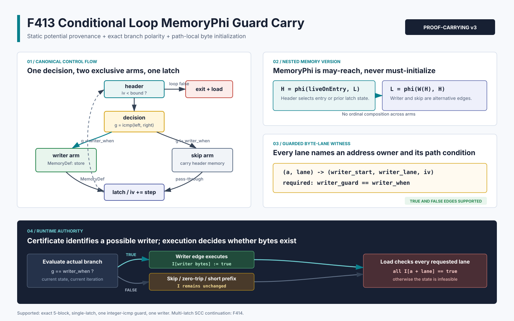

# F413：条件 Loop MemoryPhi Guard-Carry Byte-Lane 证书

> 日期：2026-08-16  
> 定位：F411/F412 无条件循环 writer 之后的 single-latch conditional writer 扩展  
> 等级：I/T/E-mechanism（生产实现、双 LLVM、严格重放、有限域 oracle 与机制实验）

## 1. 研究问题

F411/F412 能证明循环 writer 的地址 recurrence 和逐字节潜在覆盖，但要求每次进入 loop body
都执行 store。真实初始化循环常包含条件写：

```c
for (size_t i = 0; i < count; i += stride)
  if (should_write(i, input))
    store(object + i, value);
return load(object + symbolic_index);
```

此时 header `MemoryPhi` 的 backedge 不再直接来自 writer `MemoryDef`，而是来自 latch 上合并
writer 与 skip 的第二个 `MemoryPhi`。LLVM MemorySSA 只表示“某个 definition 可能到达”，不能
推出 writer 在当前迭代必然执行。若只看到 backedge 含 writer 就把目标 byte 标为 initialized，
guard 为 false、zero-trip 或提前退出路径都会被错误放行。

F413 为这一缺口引入 v3 proof-carrying contract：producer 从真实 CFG 与 MemorySSA 恢复 writer
分支方向；每个 F412 affine byte-lane witness 额外携带同一个 guard 及期望布尔结果；consumer
独立重建 CFG、dominance、比较表达式和嵌套 MemoryPhi；runtime 仍只在真实 store 路径更新
byte-init bitmap。证书说明“哪次满足 guard 的迭代可以写哪个 lane”，而不伪造“该迭代已经发生”。

主要依据：

- [LLVM MemorySSA](https://llvm.org/docs/MemorySSA.html)：`MemoryPhi` 合并可能到达的 memory
  definitions，而非 must-initialize 事实；
- [LLVM Language Reference](https://llvm.org/docs/LangRef.html)：条件 `br` 由一个 `i1` 值选择
  两个 successor，PHI incoming value 与 CFG edge 绑定；
- [LLVM MemorySSA API](https://llvm.org/docs/doxygen/MemorySSA_8h_source.html)：用 incoming block
  与 incoming access 对恢复嵌套 memory version；
- [Array-Carrying Symbolic Execution for Function Contract Generation (2026)](https://arxiv.org/abs/2602.23216)：
  近期工作用不变量和 assigns 信息携带数组片段 effect；F413 是当前有限 alias/byte-definedness
  架构下更窄、可独立重放的条件 effect 切片。

F413 没有实现任意循环谓词抽象、一般数组不变量或 SMT array summary，也不声称复现完整
ACSE。它优先闭合最容易产生不健全 initializedness 的单层 conditional writer。

## 2. 精确语义

设 header memory version 为 `H`，latch memory version 为 `L`，writer store effect 为
`W(H)`，writer guard 为 `g_k`，且 writer 位于 guard 结果 `e` 对应的 successor：

\[
H = \phi(\text{liveOnEntry}, L),\qquad
L = \phi(W(H), H)
\]

第二个式子的两个 incoming 分别来自 writer block 与 skip block，不能按顺序连续执行。
对第 `k` 次迭代，路径局部内存转移是：

\[
M_{k+1}=\begin{cases}
W(M_k), & g_k=e \\
M_k, & g_k\ne e
\end{cases}
\]

F412 的地址 recurrence 保持不变。令 `i_k = k s`、writer start
`p_k = p_0 + d i_k`、writer width 为 `W`。每个 load 地址 `a` 和 byte lane `l` 必须有唯一
见证：

\[
(a,l)\mapsto(p_k,r,i_k,g_k=e),\quad a+l=p_k+r,\ 0\le r<W.
\]

其中 guard 是条件写的必要条件，但不是 initializedness 的替代品。运行时只在实际 writer edge
被执行时更新：

\[
I'_{p_k+r}=\operatorname{ite}(g_k=e,\ true,\ I_{p_k+r}).
\]

退出后的 load 仍要求所有 lane 当前满足 `I[a+l]=true`。因此即使静态证书包含该地址，guard
false、尚未到达对应迭代、zero-trip 或 early exit 状态仍会进入 infeasible 分支，而不是读取
未初始化值。



## 3. 支持域与拒绝域

F413 接受以下精确形状：

- 单 preheader、单 header、单 decision、writer/skip 两个互斥 arm、单 latch、单 exit；
- `header -> decision -> writer|skip -> latch -> header`，exit load 的唯一前驱为 header；
- header MemoryPhi 的 incoming 为 `liveOnEntry` 与 latch MemoryPhi；
- latch MemoryPhi 的 incoming 为唯一 writer MemoryDef 与同一个 header MemoryPhi carry；
- writer guard 必须是在 decision block 定义的整数 `icmp`，两个 operand 同类型且在 guard 前可用；
- writer edge 可以是 branch true 或 false successor，方向显式写入证书；
- F412 的 seed 0、`ult(iv,bound)`、1--64 正向常量 step、正向 affine scale、1--8 byte
  非重叠 writer、有限 alias/lane 和 whole-domain no-wrap 条件；
- writer/load 必须属于同一 stack 或 heap allocation identity。

以下形状失败关闭：raw `i1` guard、guard operand 只在 writer/skip arm 才定义、两个 writer arm、
skip arm 的额外 MemoryDef/MemoryUse、额外 loop MemoryPhi、多个 latch、嵌套循环、多层条件、未知
call effect、pointer union、动态 writer width、overlapping writer、atomic/volatile 和跨对象读取。

有些形状在数学上可以总结，但未进入当前可信基。尤其是多 latch 条件循环需要对 SCC 上多个
memory transfer 求 fixed point，不能把不同 backedge 当成单次迭代内顺序组合。

## 4. Producer 执行流程

`compiler/ContinuationLowering.cpp` 按以下顺序构造证书：

1. 从 dynamic load 的真实 `MemoryUse` 取得 header MemoryPhi，并用 `LoopInfo` 定位循环边界；
2. 验证五块条件 CFG、writer/skip 互斥、单 latch 和 exit 唯一前驱；
3. 绑定 decision branch 的实际 `ICmpInst`，记录 predicate、两个 operand、writer true/false 方向；
4. 从 header backedge 取得 latch MemoryPhi，按 incoming block 区分 writer MemoryDef 与
   header MemoryPhi pass-through；
5. 枚举 loop 内全部 MemorySSA access，要求除两层 MemoryPhi 与唯一 store 外没有内存效应；
6. 重放 scalar induction、bound provenance、容量和 whole-domain no-wrap；
7. 从 writer GEP 恢复 scale，保留完整 store alias/index 域，再按 step 过滤 reachable writer；
8. 展开 writer interval，建立唯一 byte owner；对 load alias × lane 生成完整 witness；
9. 为每条 witness 附加同一个 writer guard variable 和精确 `equals` polarity；
10. 输出 v3 transcript，并同时声明 base、conditional 以及按实际 shape 所需的 strided capability。

生产逻辑接在真实 load-initialization admission 上。任何一项证明失败都会回退到原有支配 store
检查，并最终拒绝无法证明已初始化的 load；不存在仅用于测试的放宽入口。

## 5. v3 Proof-Carrying Artifact

条件证书 schema 为 `symcc-loop-memoryphi-byte-lane-induction-v3`，必须声明：

- `bounded-loop-memoryphi-byte-lane-induction`；
- `bounded-conditional-loop-memoryphi-byte-lane-induction`；
- 若 step、scale 或 writer width 为广义形状，还需
  `bounded-strided-loop-memoryphi-byte-lane-induction`。

核心结构如下：

```json
{
  "loop": {
    "decision": "decision",
    "writer_block": "writer",
    "skip": "skip",
    "latch": "latch"
  },
  "memory_phi": {
    "preheader": "live-on-entry",
    "backedge": "latch-memory-phi",
    "writer": "writer-memory-def",
    "skip": "header-memory-phi"
  },
  "writer_guard": {
    "block": "decision",
    "variable": {"var": "should_write"},
    "predicate": "ult",
    "left": {"var": "iv"},
    "right": {"var": "write_limit"},
    "writer_when": true,
    "writer": "writer",
    "skip": "skip"
  },
  "witnesses": [{
    "load_address": 65,
    "lane": 1,
    "writer_address": 66,
    "writer_lane": 0,
    "induction_value": 2,
    "writer_guard": {
      "variable": {"var": "should_write"},
      "equals": true
    }
  }]
}
```

顶层 guard transcript 绑定实际比较和 CFG 方向；lane 内 guard 绑定每个初始化来源的路径条件。
两份表示必须逐项一致，不能分别篡改。v3 同时保留 F412 的 complete aliases、reachable aliases、
stride、residue 与 writer-lane 字段。

## 6. Consumer 独立重放

`LiveContinuationExecutor._loop_memoryphi_byte_lane_initialization` 不读取 LLVM 对象，而从 artifact
独立完成：

- v3 精确 key 集、capability/use-point 双向闭合，以及 strided capability 依赖；
- direct CFG predecessor/successor、两条 scalar PHI edge copy 和条件五块 topology；
- 迭代计算 block dominators，要求 guard operand 在 decision guard 之前可用；
- decision 中实际 comparison 的 dst/predicate/left/right 与 transcript 精确相等；
- writer true/false successor、writer/skip/latch block 与两层 MemoryPhi transcript 对齐；
- writer block 内唯一真实 store、ordinal、address expression、完整 aliases/index values；
- `pointer_offset` 的 base/index/scale、recurrence reachable 域、no-wrap 与唯一 byte owner；
- 每条 guarded witness 及完整 load alias × lane 笛卡尔积；
- stack/heap owner、allocation identity、logical interval 和 runtime object lifecycle。

校验发生在 `LiveContinuationExecutor.create()`，因此缺 capability、孤立 capability、伪造 polarity、
改 predicate/operand、把 skip 改成 writer、插入 skip store、把 guard operand 后移至 writer block、
删除 transcript、异宽 operand、越出声明位宽的常量等均在执行前拒绝。

## 7. 测试设计与结果

### 7.1 LLVM 生产与真实执行

`test/live_conditional_loop_memoryphi_byte_lane_induction.ll` 含 15 条 `RUN`：

- true-edge writer 的 unit-stride 正例执行真实 continuation；输入 `000201` 产生 7 个返回值 75，
  并观察 infeasible states，覆盖 guard false 与尚未初始化前缀；
- false-edge writer 正例证明 polarity 不是固定假设；
- `i16` writer、step 2 的条件 stride 正例证明 v3 与 F412 组合；
- two-writer、raw-i1 guard、skip-path extra store 三类 source negative；
- 14 类 actual artifact mutation 经 `LiveContinuationExecutor.create()` 全部拒绝，包括同时篡改
  comparison 与 transcript 的异宽 operand、越出声明位宽的常量；
- 64-byte object、stride/writer/load 均为 8-byte 的 producer boundary。

LLVM 17/18 的 focused 均为 1/1，F411--F413 related fixture 均为 3/3。完整 LLVM 17 为
`275 passed + 2 unsupported`、零失败；Python exact identity gate 为 `1,066 passed + 250 subtests`，
skip、xfail、deselection、collection error 与 node-ID drift 均为零。node-ID manifest SHA-256 为
`5b51e98e49435739615fb1e3ffc8985e1b8834cd380e76c48331a3ff94b0e06a`。

### 7.2 独立有限域 oracle

oracle 不调用 producer 或生产 consumer，独立枚举 object size、step、scale、writer/load width、
load domain、`eq/ne/ult/ule` guard、limit 与 true/false writer edge：

| 指标 | 结果 |
|---|---:|
| 总参数组合 | 126,624 |
| 严格支持域接纳 | 20,640 |
| unsupported / partial 拒绝 | 105,984 |
| lane checks | 768,672 |
| runtime bitmap / guard-carry 等价 | 551,712 |
| guard true 且前缀充分的接纳 | 183,532 |
| guard false或前缀不足的拒绝 | 368,180 |
| structured certificate mutations | 18 / 18 拒绝 |

恒等式 `cases = accepted + rejected` 与
`bitmap equivalences = guard-true accepts + guard/prefix rejects` 均成立。

### 7.3 机制边界实验

64-byte、stride 8、8-byte writer/load 的证书含 57 个完整 writer aliases、8 个 reachable
writers、64 个潜在 writer bytes、57 个 load aliases、456 个 guarded lane witnesses、两个
MemoryPhi 节点和四条 incoming edges。11 轮、每轮 1,000 次的 Python reference-validator batch
最小/中位/最大为 `147,800,439 / 149,259,299 / 160,534,540 ns`，折算中位
`149,259 ns/certificate`。

该计时只描述 Python 参考校验器和证书基数，不包含 LLVM 分析、continuation 执行、SMT、
fuzzing、公共目标 coverage 或错误发现率，不能用作端到端加速结论。

## 8. 多轮 Review 结论

1. **MemorySSA review**：显式验证 header/latch 两层 MemoryPhi，不把 may-reach writer 当必写；
2. **CFG review**：writer polarity 取自真实 branch successor，同时覆盖 true/false writer；
3. **SSA review**：consumer 重建 dominance，拒绝只在 arm 中定义的 late guard operand；
4. **lane review**：每条 witness 绑定相同 guard variable/polarity，仍保留 F412 唯一 owner；
5. **runtime review**：证书不写 init bitmap，guard false/zero-trip/early-exit 保持 infeasible；
6. **artifact review**：capability、schema、use point 和实际指令四向闭合，独立恢复 operand
   位宽，结构篡改执行前拒绝；
7. **声明 review**：实验数字仅来自双 LLVM fixture、有限域 oracle 与 Python reference cost。

## 9. 先进性、创新性与挑战性

- **先进性**：把 LLVM CFG edge、嵌套 MemorySSA、affine recurrence、byte-lane definedness 与
  proof-carrying replay 统一到条件数组 effect 的可审计切片；
- **框架创新**：guard 同时绑定顶层 branch transcript 与逐 lane witness，而 runtime bitmap 保留
  最终权威，兼顾可重放性与路径敏感正确性；
- **挑战性**：同一个 writer 条件跨 LLVM SSA、MemoryPhi incoming、JSON、Python CFG/dominance
  和 runtime memory state 五层表示，任一 polarity 或时序偏差都可能产生不健全读取；
- **可证伪性**：true/false edge、source negative、14 类 actual artifact mutation、18 类独立
  oracle mutation、双 LLVM 和真实 infeasible state 共同限制机制声明。

## 10. 未完成边界与下一步

F413 关闭 F412 明确保留的 single-latch conditional writer 缺口，但 W1 仍未完成。该处原列的
multi-latch MemoryPhi SCC fixed point 已由
[F414](Multi_Latch_MemoryPhi_Fixed_Point_F414_2026-08-16.md) 落地：多个 backedge transfer 按
互斥 SCC 方程、有限 lane closure 和运行时 bitmap 权威处理。之后仍有 nested loop、
多 writer、overlapping last-write priority、pointer union、多对象、动态 extent 与跨过程 loop
effect 等支持域扩展。
