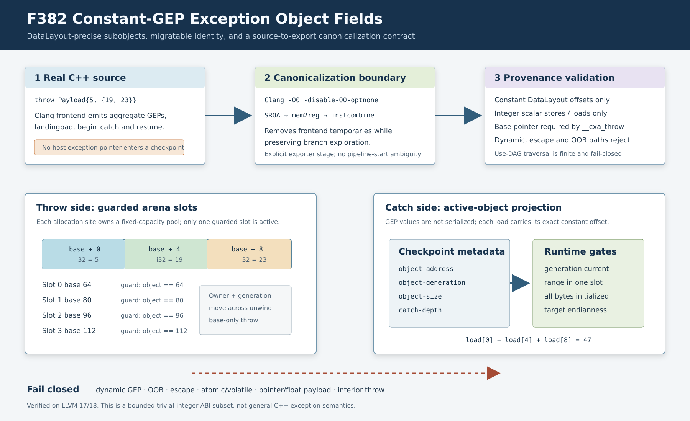

# F382：DataLayout 精确的异常聚合字段与源码规范化管线

- 日期：2026-08-12
- LLVM lowering：`compiler/ContinuationLowering.cpp`
- 执行器与合同：`util/live_continuation.py`
- 源码驱动：`util/llvm_to_continuation.py`
- 测试：`test/live_continuation_lowering.ll`、`test/live_exception_object_fields_source.cpp`、`test/test_live_exception_object_arena.py`
- 能力：`bounded-exception-object-fields`
- 成熟度：I/T/E-mechanism；整数聚合字段子集，不等价于完整 Itanium C++ ABI

## 1. 研究问题

F380 已把异常用户对象建模为带 generation、owner 和 lifetime 证书的固定容量 arena，但编译器只接受
`store scalar, %allocated` 与 `load scalar, %begin_catch_result`。真实 Clang 对结构体和数组异常会生成
constant GEP，因此即使对象大小、析构器和类型信息都满足 F380，字段访问仍会被拒绝。

F382 解决两个相互依赖的问题：

1. 如何在不把宿主指针写入 checkpoint 的前提下保留 `struct`/`array` 子对象身份；
2. 如何确保源码驱动真正把规范化后的 LLVM IR 交给 exporter，而不是名义上使用 `-O1`、实际在优化管线
   起点导出未规范化 IR。

语义依据是 [LLVM `getelementptr` 规范](https://llvm.org/docs/LangRef.html#getelementptr-instruction) 与
[Itanium C++ ABI 异常处理接口](https://itanium-cxx-abi.github.io/cxx-abi/abi-eh.html)。



## 2. 实现语义

### 2.1 Throw 侧：基址、偏移和 provenance 分离

`hasOnlyBoundedExceptionAllocationUses()` 由一层直接 user 检查改为有界的 pointer-use DAG 遍历：

- 根必须是签名正确、固定非零大小且 `nounwind` 的 `__cxa_allocate_exception`；
- GEP 的每一项都必须能由目标 `DataLayout` 折叠为非负常量偏移；
- store 只接受 1--64 bit、1--8 byte、非 atomic、非 volatile 的整数值；
- `offset + bytes` 必须落在声明的异常对象内；
- `__cxa_throw` 仍必须消费分配**基址**，任何 interior pointer throw 都拒绝；
- 动态索引、escape、pointer payload、越界和无消费者投影失败关闭。

普通内存 lowering 随后把每个字段 store 展开到 arena 各槽位。例如 12-byte 对象、四槽容量会形成
`base+0`、`base+4`、`base+8` 的四组 guard-correlated alias case。运行时只选择本次
`exception_alloc` 返回的活动槽位。

### 2.2 Catch 侧：投影不成为可迁移宿主指针

编译器沿 `__cxa_begin_catch` 的只读 user DAG 接受任意层 constant GEP 和多次整数 load。每个 GEP 的
DataLayout 偏移逐层累加并检查 uint64 溢出；动态 GEP、store、`ptrtoint`、atomic/volatile load 和其他
escape 均拒绝。

GEP 指令本身不写入 continuation state。相应 load 直接变为：

```json
{"op":"exception_object_load","dst":"v","bits":32,"bytes":4,"offset":8}
```

这不是丢失 pointer semantics，而是刻意使用 `(active exception base, constant offset)` 作为可迁移的
subobject identity。恢复后的 worker 从当前 catch 元数据重建地址，因而不会依赖原进程虚拟地址。

### 2.3 运行时合同

新增能力 `bounded-exception-object-fields`，并建立双向闭包：

- capability 存在时必须同时存在 `bounded-exception-object-arena` 和至少一个非零 offset load；
- 非零 offset load 没有 field capability 时 artifact 在执行前拒绝；
- offset 是 0--65535 的非布尔整数，宽度为 1--64 bit、字节数为 1--8；
- 执行时重新验证 active catch、arena allocation、object generation、object size 和对象边界；
- 所有目标 byte 必须已初始化，读取不得跨越相邻 arena 槽位；
- little/big-endian 均由 artifact 的目标端序决定。

因此 schema 校验不能伪造活动对象，checkpoint tamper 也不能用旧 generation 读取复用后的槽位。

## 3. 源码驱动正确性修复

首轮真实 C++ 测试发现：旧 `llvm_to_continuation.py` 直接以
`clang -fpass-plugin ... -O1` 编译，但 plugin 把 exporter 注册在 pipeline start，exporter 实际先于
`-O1` canonicalization 执行。原始 C++ IR 中的 exception temporary、insertvalue/reconstructed resume
因此被误当成最终输入。

F382 改为可审计的两阶段管线：

1. Clang 使用固定 `-O0 -Xclang -disable-O0-optnone -emit-llvm` 生成 bitcode；
2. `opt` 显式执行 `function(sroa,mem2reg,instcombine),live-continuation-export`。

该 profile 只做 exporter 所需的 SSA/aggregate canonicalization，不运行会把路径 branch if-convert 为
`select` 的完整 `-O1` pipeline。第二轮 review 曾观察到完整 `-O1` 使历史 `check()` 从两条可探索路径退化为
单个 symbolic select；当前 profile 同时保持旧 C fixture 的 `{0,66}` 路径集合和新 C++ fixture 的
`{7,47}` 路径集合。

驱动返回 `compile_command` 与 `command`，分别记录 frontend 和 exporter 阶段，编译失败与 lowering 失败使用
不同诊断，临时 bitcode 仍在 `finally` 中清理。

## 4. 测试与多轮 review

### Review 1：基本算法与失败关闭

- 手写 LLVM `struct { i32, [2 x i32] }`，写入 5/19/23，catch 三次 load 后返回 47；
- 四槽 artifact 的 store alias 精确为 `base+0/+4/+8`；
- 动态 catch GEP、动态 throw-side store、常量 OOB store、interior throw 均以精确诊断拒绝；
- Python runtime 覆盖多字段 roundtrip、缺 capability、空 capability、依赖缺失、未初始化和越界。

### Review 2：真实前端与跨版本

- 新增真实 C++ `throw ExceptionPayload{5,{19,23}}` fixture；
- 发现并修复 pipeline-start/`-O1` 语义不一致；
- LLVM 18 与 LLVM 17 分别完成 compile、canonicalize、lower、execute，均得到 7/47；
- 原 `live_continuation_source.c` 的全部 RUN 管线与新 C++ fixture 同时通过。

### Review 3：跨层合同与回归

- 编译器 offset 上限与 runtime schema 的 65535 上限对齐；
- capability 必须有非零字段合同，非零字段也必须声明 capability；
- exception 相关组合回归为 47 passed、51 subtests passed；
- C++/C 两个 source lit 测试通过；LLVM 17/18 手写 IR 单文件集成均通过；
- 编译器在两版本均以项目的 `-Wall -Wextra -Werror` 配置构建通过。

归档完整门禁已实际执行，而不是由定向结果外推：LLVM lit 为 239 passed、1 unsupported、0 failed；
capability-closed Python gate 为 878 passed、229 subtests passed，且 878 个 nodeid 与 canonical inventory
逐项一致，skip/xfail/xpass/deselection/missing/unexpected 均为零；LLVM 17/18 构建、Ruff、py_compile 和
whitespace gate 全部通过。新旧源码 lit 为 2/2，通过结果分别保持 `{7,47}` 与 `{0,66}`。原始输出、artifact、
失败关闭反例和摘要位于 `evidence/f382-constant-gep-exception-fields-2026-08-12/`，由目录级和交付级
SHA-256 清单共同约束。

## 5. 创新性与工程挑战

本实现的核心不是“支持一个 GEP opcode”，而是把 C++ subobject identity 转换成能够跨进程、跨 worker 和
checkpoint 恢复的 `(arena generation, owner, base, DataLayout offset)` 证书。throw 侧复用 guarded alias
memory，catch 侧使用 active-object projection，两端在对象边界汇合，同时仍保留基址 throw 的 ABI 约束。

真实源码 review 还纠正了编译管线的时间语义：优化级别不仅影响性能，也决定 exporter 看见的程序。固定的
canonicalization profile 在“足以消除 frontend temporary”和“不得消除待探索控制流”之间建立了显式合同。

## 6. 严格边界与下一步

F382 仍只支持平凡整数 payload。以下能力尚未实现：

1. float/vector/pointer 字段以及 pointer provenance 的对象内重建；
2. union active-member、bit-field、symbolic index、atomic/volatile 字段；
3. destructor identity、exactly-once 调用、handler count、nested caught stack 与 `exception_ptr`；
4. RTTI inheritance、multiple-inheritance adjusted pointer、personality action record；
5. 与 libstdc++/libc++abi 对构造、捕获、重抛和析构事件进行 native differential oracle。

因此 F382 可表述为“真实 Clang 可达的固定聚合整数异常对象子集”，不能表述为完整 C++ exception semantics，
也不提供覆盖率或 SOTA 性能提升结论。
