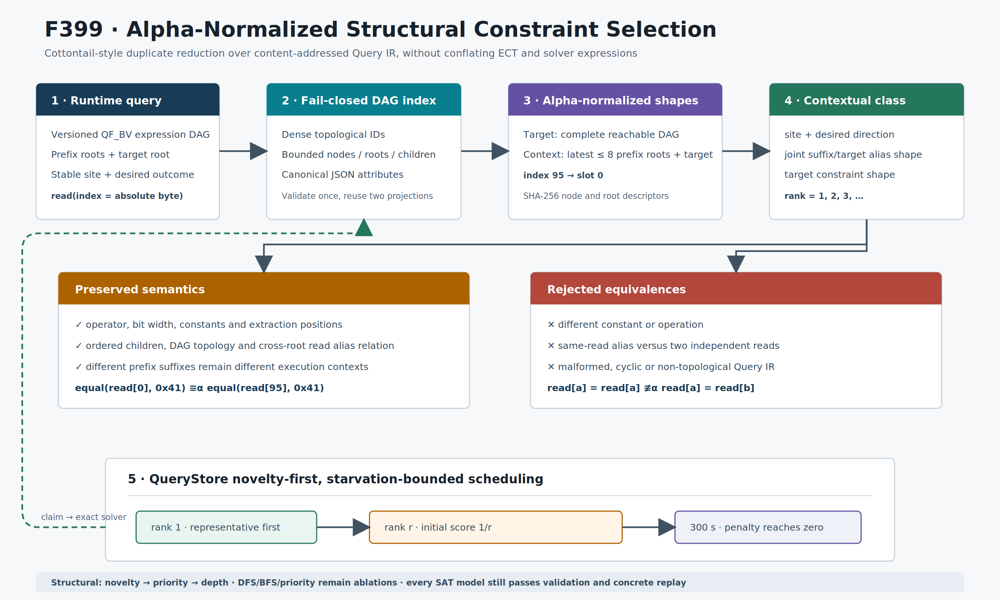

# F399：Cottontail 启发的 Alpha-Normalized Constraint Selection

> 日期：2026-08-13  
> 等级：I/T/E-mechanism（实现、测试、机制实验；没有公开目标覆盖率结论）  
> 代码：`util/constraint_shape.py`、`util/query_store.py`、
> `util/symcc_query_service.py`、`util/mpi_fuzzing_helper.py`  
> 图：[`cottontail-alpha-constraint-selection-f399.svg`](../diagrams/cottontail-alpha-constraint-selection-f399.svg)
> / [`PNG`](../diagrams/cottontail-alpha-constraint-selection-f399.png)  
> 证据：[`f399-cottontail-alpha-constraint-selection-2026-08-13/`](../evidence/f399-cottontail-alpha-constraint-selection-2026-08-13/)

## 1. 研究问题

异步符号执行会为同一程序位置积累大量“结构相同、仅输入字节位置不同”的分支约束。
例如，解析循环中的第 1 个字段和第 95 个字段都可能产生：

```text
equal(read[index], 0x41)
```

若把二者当成完全独立的工作，worker 会反复支付近似的持久上下文切换、solver
前处理和模型验证成本；若只删除字符串中的变量编号，又可能错误合并不同常量、不同
位宽、同一 read 与两个独立 read 等语义不同的约束。F399 的问题是：

1. 怎样在不信任 SMT 文本格式的前提下识别输入索引重命名下的约束同构；
2. 怎样把前缀执行上下文、目标分支和跨根 read alias 纳入等价类；
3. 怎样优先求解结构代表，又不永久饿死重复成员；
4. 怎样保持 QueryStore 的精确求解、模型验证和 concrete replay 边界不变。

## 2. 文献与源码审计

主要依据是 [Cottontail, IEEE S&P 2026](https://mboehme.github.io/paper/SP26-cottontail.pdf)
和[官方 artifact](https://github.com/Cottontail-Proj/cottontail)，本次审计固定在提交
`4efa4dcf8225040feeef8fd7017d32aaa21c9340`。论文把执行上下文树（ECT）、路径约束和
LLM 驱动输入生成组合起来；官方 `GenericTree.h` 的 ECT 节点保存 branch identity、
call-stack size、taken、visit count 等结构信息，约束表达式另写入
`path-constraints-expr.json`。因此，“ECT 本身不保存 Z3 expression”不是缺陷，也不能
据此判断缺少 Cottontail 的结构表示。

官方 `solver.cpp` 的第一阶段约束规约会把 SMT 字符串中的 `k!<digits>` 替换成
`k!X`，用于拒绝同一名字下仅变量编号不同的重复约束。该方法给出重要研究方向，但
字符串替换不知道变量别名、位宽、根次序和 Query IR 上下文。F399 采用更严格的
结构化版本，并且只把结果用于调度，不据此推断 SAT/UNSAT。

论文报告的平均 line/branch coverage 增幅属于论文系统和论文实验，不能记为本项目
结果。本报告只记录当前工作树可重放的机制数据。

## 3. 总体设计



一次 query admission 的执行次序为：

1. QueryStore 按既有合同读取并验证 `symcc-query-ir-v1` envelope；
2. `AlphaConstraintShapeIndex` 再检查 node ID 稠密、拓扑有序、child 数有界、位宽和
   `read.index` 合法、attributes 可规范 JSON 编码；
3. 在同一份已验证 DAG 上投影目标根形状；
4. 联合投影 `[最近最多 8 个 prefix roots, target root]`，保留前缀与目标之间的
   read alias 关系；
5. 结合 stable site（缺失时 branch fallback）和 desired outcome 形成 context hash；
6. 在 SQLite `BEGIN IMMEDIATE` 事务内为 `(context_hash, target_shape_hash)` 分配
   `duplicate_rank` 和 representative；
7. query service 默认按 `structural` 模式 claim；solver 结果仍经过原有 Query IR
   evaluator、candidate materialization 和 concrete replay。

## 4. Alpha-normalized Query IR

### 4.1 节点描述

对联合根按既定根顺序和 child 顺序做确定性 DFS。首次遇到绝对输入索引 `i` 时分配
alpha slot：

```text
rho(i) = 当前已见不同 read index 的个数
read(index=i, attrs=A) -> read(alpha_slot=rho(i), attrs=A-{index})
```

每个可达节点的规范描述为：

```text
H_node = SHA256({schema, op, bits, child_hashes, attrs})
H_shape = SHA256({schema, ordered_root_hashes, read_count, node_count})
```

这保持 `op`、bit width、常量、extract 位置、所有其他 attributes、child 次序、root
次序和 read alias 关系。绝对输入位置是唯一被重命名的量。

### 4.2 等价与非等价

```text
equal(read[0],  0x41)  ==alpha  equal(read[95], 0x41)
equal(read[a], read[a]) !=alpha  equal(read[a], read[b])
equal(read[a], 0x41)    !=alpha  equal(read[a], 0x42)
equal(read[a], 0x41)    !=alpha  distinct(read[a], 0x41)
```

节点 hash 会规范合并语义相同的子表达式描述；F399 不声称保留“内存中恰好创建了几份
相同节点”这一非语义属性。真实 read alias 则由相同 alpha slot 精确保留。

### 4.3 为什么必须联合投影

若前缀和目标分别归一化，以下两条路径会被错误归为一类：

```text
prefix: read[a] = 0x41, target: read[a] = 0x42
prefix: read[a] = 0x41, target: read[b] = 0x42
```

两边单独看都有相同形状，但第一条复用了前缀字节，第二条引入新字节。F399 使用
context schema v2，把 suffix 和 target 放入同一 alpha-renaming 域；对应反例已进入
`test_joint_context_preserves_prefix_target_read_aliasing`。

### 4.4 有界性与失败关闭

节点最多 250,000 个、每节点最多 3 个 child、投影根最多 100,001 个；node ID 必须等于
拓扑位置，child 只能引用更早节点。非法 bit width、boolean 冒充整数、循环/前向引用、
非法 read index 或不可规范 JSON attribute 都抛出 admission error，而不是退化成
宽松字符串 fingerprint。

## 5. 持久类与调度

SQLite 新表 `query_shapes` 保存：

| 字段 | 含义 |
| --- | --- |
| `shape_hash` | 目标根 alpha shape |
| `context_hash` | site/direction 与联合 suffix-target shape |
| `read_count`, `node_count` | 可审计规模 |
| `duplicate_rank` | 同上下文、同目标形状的到达顺序 |
| `representative_query_id` | rank 1 query |

事务采用 `BEGIN IMMEDIATE`，因此两个并发 admission 不会获得相同 rank。旧数据库没有
shape row 的 query 在调度中按 score 1 处理，升级不会使既有工作不可 claim。

rank 为 `r`、query 创建后经过 `t` 秒时，形状得分为：

```text
score(r,t) = 1/r + (1 - 1/r) * min(1, max(0, t/300))
```

代表项恒为 1；重复项初始为 `1/r`，300 秒后恢复为 1。默认 `structural` 排序为：

```text
shape score DESC -> explicit priority DESC -> prefix depth DESC
-> creation time ASC -> query_id ASC
```

这保证形状惩罚本身有界，但不承诺对任意持续注入的更高显式 priority 实现全局公平。
`dfs`、`bfs`、`priority` 保留为消融策略；`SYMCC_QUERY_SHAPE_SELECTION=0` 恢复 pre-F399
顺序。两项参数均标记为 `query-service` 生命周期，不能被 ParaSuit 按 seed 选择后错误
归因。

## 6. 与既有模块的关系

| 模块 | F399 关系 | 不变边界 |
| --- | --- | --- |
| ECT / expressive coverage | 提供 site/context/visit 等结构信号 | ECT 不承载 solver AST |
| Query IR / QueryStore | 提供精确、backend-neutral DAG | query identity 与 artifacts 仍内容寻址 |
| Prefix trie / solver pool | shape 只改变 claim 顺序 | prefix ownership、push/pop cache 不变 |
| partial solution / generator | 可在高价值 query 完成后继续复用 | 每个 candidate 仍独立验证 |
| AFL coverage | 没有改变 bitmap 或 corpus admission | shape 不是覆盖率 oracle |

这也是本实现相对直接 SMT 字符串规约的创新点：结构等价建立在已验证 Query IR 上，
上下文包含跨根 alias，调度有明确饥饿上界，而求解正确性仍由原有验证链负责。

## 7. 测试与机制结果

### 7.1 正确性

| 门禁 | 结果 |
| --- | ---: |
| F399 定向 Python | 9 passed |
| 相关 QueryStore/self-config/QF_BV/semantic 回归 | 119 passed + 22 subtests |
| capability-closed 完整 Python | 989/989 passed + 235 subtests |
| Python skip/xfail/deselect/identity drift | 0/0/0/0 |
| LLVM 17 完整 lit | 261 discovered，259 passed，2 unsupported |

两个 unsupported 是工具链能力条件，不是失败；证据包保留完整日志和 identity manifest。
1000 轮确定性随机性质检查得到：1000/1000 alpha-renaming 等价、1000/1000 常量扰动
分离、1000/1000 read-alias 扰动分离。

### 7.2 微基准

环境见 evidence `environment.txt`。固定 64 reads、192 nodes、1000 次：

| 操作 | median | P95 | max |
| --- | ---: | ---: | ---: |
| 冷构建全部 64 roots shape | 970.792 us | 1040.777 us | 1115.239 us |
| Query admission 实际 target + 8-root joint pipeline | 514.565 us | 588.766 us | 631.971 us |
| 已验证 DAG 上复用两次投影 | 73.100 us | 83.846 us | 89.785 us |

这些数字表明复用 validated DAG 能显著降低重复投影的 Python 机制成本，但没有 pre-F399
端到端 solver campaign 对照，不能换算为 solver throughput、coverage 或 bug yield 提升。

## 8. 配置与观测

```bash
# 默认：结构新颖度优先
export SYMCC_QUERY_TRAVERSAL=structural
export SYMCC_QUERY_SHAPE_SELECTION=1

# 消融：保持旧 priority 顺序，不计算 shape tie-break
export SYMCC_QUERY_TRAVERSAL=priority
export SYMCC_QUERY_SHAPE_SELECTION=0
```

`QueryStore.stats()` 新增 `query_shape_classes`、`query_shape_duplicates`、
`query_shape_max_class`；`query_constraint_shape(query_id)` 返回目标/context hash、规模、
rank 和 representative。当前 coordinator provider 为 42 项：28 task、12 query-service、
2 campaign；叠加 F397/F398 campaign provider 后为 51 项，其中仍只有 28 项进入逐任务采样。
原生 query-solver provider 接入后的生产 registry 为 64 项：28 task、25 query-service、
11 campaign。

## 9. 严格边界与下一步

F399 已关闭的是 Cottontail 启发的“约束索引重命名去重 + 上下文结构调度”核心，不是
完整 Cottontail 复现。仍缺：

- 论文完整 LLM seed acquisition/iterative solve-complete 闭环的同协议复现；
- ECT untaken/visit/depth 策略与 QueryStore shape score 的联合学习和严格消融；
- 官方目标、LAVA-M 和等 CPU 多种子实验中的 solver 次数、去重率、coverage AUC；
- 跨节点共享 shape-class 统计，而当前 SQLite 类属于一个共享 QueryStore；
- 经过版本升级的历史 shape 重建工具；同一 query identity 的后续 witness 不改变首次
  持久 context，因为 QueryStore 本身只求解一次该公式。

因此，后续汇报可称“实现结构化约束同构选择并通过完整门禁”，不能称“已经获得
Cottontail 论文覆盖率提升”或“完整复现 Cottontail”。

## 10. 可复现实验

```bash
python3 -m pytest -q test/test_constraint_shape.py
python3 benchmark/check_constraint_shape_properties.py --runs 1000 --seed 399
python3 benchmark/benchmark_constraint_shape.py --runs 1000 --reads 64
python3 util/python_test_gate.py \
  --output /tmp/f399-gate.json --min-collected 989 \
  --max-skips 0 --max-xfails 0 --max-xpasses 0 --max-deselected 0 \
  --max-missing-nodeids 0 --max-unexpected-nodeids 0 \
  --require-nodeid-manifest test/pytest-nodeids.json \
  -- -q -W error -p no:cacheprovider
```

完整 capability 参数、日志、源码摘要和上游 revision 见 evidence 目录。
