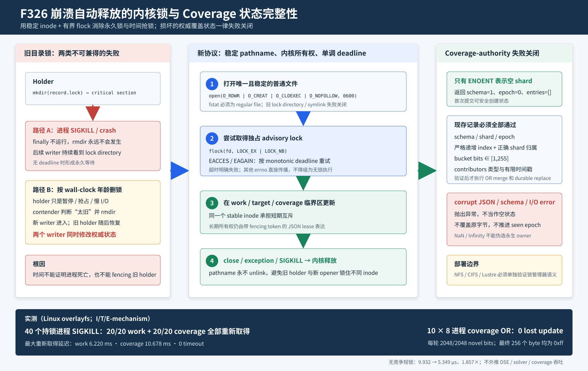

# F326：崩溃自动释放的内核锁与 Coverage 状态完整性

- 日期：2026-08-07
- 功能编号：F326
- 成熟度：I/T/E-mechanism
- 代码范围：跨 coordinator work/target lease 短锁、coverage-owner shard 短锁与状态校验
- 证据范围：真实 subprocess/fork SIGKILL、故障注入、8进程 coverage OR-state 竞争、系统调用追踪、
  无竞争短锁微基准与完整 Python 回归

## 1. 研究问题与代码审查结论

F320-F325逐步建立了跨coordinator work/target所有权、result fencing、持久manifest、目录项屏障和
分片group commit。然而，这些协议的最底层仍依赖“短期互斥”：writer必须在读取当前record、验证
token和替换record之间保持排他性。本轮审查发现，这一互斥层有两个相反但同样严重的问题。

### 1.1 `mkdir/rmdir`锁在持锁进程崩溃后永久残留

`FencedWorkLeaseTable._locked()`原先以lock directory是否存在表达锁所有权：

```text
mkdir(record.lock)
try:
    read → validate → write
finally:
    rmdir(record.lock)
```

正常异常可由`finally`清理，但`SIGKILL`、解释器崩溃或节点进程被强制终止不会执行Python清理代码。
目录仍在，后继writer只知道“路径存在”，无法证明holder已经死亡。若等待没有deadline，单个残留锁
即可永久阻塞对应work/target；若用固定年龄后强删，则进入下一类错误。

### 1.2 依据mtime年龄抢锁会破坏互斥

`CoverageOwnerShardGossip._locked()`曾在lock path超过`lock_ttl`后执行`rmdir`。但wall-clock年龄只
能说明“多久没有重建目录”，不能说明holder已经终止。holder可能被调度器暂停、遭遇慢I/O、stop-the-
world运行时暂停，或系统时钟发生跳变。contender删掉目录并建立新锁后，旧holder仍可恢复并继续写：

```text
holder A: mkdir(lock) → pause
holder B: age > ttl → rmdir(lock) → mkdir(lock) → update
holder A: resume → update
```

此时A、B都认为自己持锁。coverage shard的read-modify-write OR合并可能丢失更新，work/target token也
可能被旧快照覆盖。没有fencing token绑定**每一次短锁写入**时，单纯“超时抢mutex”不具备安全性。

### 1.3 损坏的 coverage shard 被当作空状态

旧`_read_shard()`把文件不存在、JSON损坏和一般`OSError`统一转换为空shard。若权威文件暂时不可读或
已损坏，下一次claim会从空状态开始并覆盖原文件，造成已经提交的coverage bit永久丢失。时间戳还接受
`NaN/Infinity`；`updated=Infinity`的peer可能永远满足心跳新鲜度判断，长期干扰owner选择。

审查后又补充发现：记录虽可声称正确`shard`，其`entries`却未验证每个bitmap index是否确实映射到
该shard。本轮把这类内部不一致也纳入失败关闭。

## 2. 技术定位与语义依据



Linux `flock(2)`把锁关联到open file description；显式`LOCK_UN`或所有引用该description的文件描述符
关闭时释放锁。进程退出会关闭描述符，因此本机进程级`SIGKILL`不再依赖用户态`finally`清理。
`LOCK_NB`允许调用方自行实现有界等待。
[Linux `flock(2)`](https://man7.org/linux/man-pages/man2/flock.2.html)

实现使用`O_CLOEXEC`防止描述符意外泄漏到exec后的程序，使用`O_NOFOLLOW`拒绝最终路径分量是符号链接；
Linux文档明确指出`O_NOFOLLOW`只约束trailing component，而不是完整路径中的所有祖先分量。因此它是
lock-file类型完整性加固，不应表述为通用的路径沙箱。
[Linux `open(2)`](https://man7.org/linux/man-pages/man2/open.2.html)

本轮还区分**短期互斥锁**和**长期租约**：

- kernel lock只保护一次read-validate-write临界区，不依据时间被其他writer强抢；
- JSON lease用TTL决定任务长期所有权是否可重新分配，并用单调变化的fencing token拒绝旧owner结果；
- Gray与Cheriton的经典lease工作把lease定义为有限期限的权利，并依赖服务端在期限内尊重该权利。
  这不同于直接删除一个仍可能被活holder使用的mutex pathname。
  [Gray and Cheriton, SOSP 1989](https://www.cs.cmu.edu/afs/cs.cmu.edu/academic/class/15712-s12/www/papers/gray89.pdf)

### 2.1 网络文件系统不能从本机结论直接外推

Linux自2.6.12起在NFS上把`flock`模拟为整文件`fcntl`字节区间锁，exclusive lock要求以可写方式打开；
`local_lock=flock/all`会把锁限制在单个client，本项目跨节点部署不能使用这种本地化语义。CIFS自Linux
5.5起通常映射为SMB byte-range lock，并可能呈现mandatory-like行为；实际结果仍受协议、mount option
和server影响。[Linux `flock(2)`](https://man7.org/linux/man-pages/man2/flock.2.html)，
[Linux `nfs(5)`](https://www.man7.org/linux/man-pages/man5/nfs.5%40%40nfs-utils.html)

因此F326当前证明的是Linux overlayfs上的进程级机制。NFS、CIFS、Lustre、FUSE和并行文件系统必须在
目标集群执行capability probe、跨主机互斥/故障测试与mount-option审计后才能启用。

## 3. 新的有界 advisory-lock 协议

共享helper `_bounded_advisory_lock(path, timeout, description, age_hint)`按以下次序执行：

1. 用耐久目录创建原语确保parent tree存在；
2. 以`O_RDWR | O_CREAT | O_CLOEXEC | O_NOFOLLOW`打开稳定lock file，初始mode为`0600`；
3. `fstat()`确认打开对象是普通文件；旧版本残留的lock directory、FIFO或device均失败关闭；
4. 计算`time.monotonic() + timeout`，循环调用`flock(LOCK_EX | LOCK_NB)`；
5. `EINTR`重试，只有`EACCES/EAGAIN`视为竞争；不支持锁的文件系统错误直接传播；
6. 竞争超过单调deadline时抛出`TimeoutError`，`lock_ttl`只作为诊断年龄提示；
7. 临界区完成后尝试`LOCK_UN`并关闭descriptor；即使unlock系统调用失败，close仍是权威释放动作。

伪代码如下：

```text
fd = open_stable_regular_file(path)
deadline = monotonic() + bounded_timeout
while flock(fd, EXCLUSIVE | NONBLOCK) == CONTENDED:
    if monotonic() >= deadline: fail_closed(TIMEOUT)
    sleep(min(2 ms, remaining))
try:
    yield critical_section
finally:
    unlock_best_effort(fd)
    close(fd)
```

### 3.1 为什么稳定lock file不能在释放后unlink

假设A已打开inode X并取得flock。若A或另一个cleanup线程unlink pathname，B可在相同pathname创建
inode Y并成功锁住Y；A仍锁住X并继续临界区。pathname相同不代表锁对象相同，因此会出现双holder。
F326刻意保留`.lock`普通文件，只改变其内核锁状态，不把pathname存在性解释为“当前有人持锁”。

代价是稳定文件会累积：coverage最多每个实际访问shard一个；work/target最多每个已触达record一个。
在没有目录级代际协议或全局静止点前，运行中自动删除这些文件是不安全的。

### 3.2 接入范围

同一个helper用于：

| 调用方 | 被保护状态 | 长期所有权机制 |
| --- | --- | --- |
| `FencedWorkLeaseTable` | work record read/validate/replace | lease TTL + per-claim fencing token |
| `FencedTargetLeaseTable` | target/group record mutation | target TTL + group token + digest全序加锁 |
| `CoverageOwnerShardGossip` | authoritative shard OR merge | epoch + commutative bitmap OR |

这保持了F320-F325上层协议不变，只替换最底层短锁的崩溃和等待语义。

## 4. Coverage-authority 完整性协议

### 4.1 只有`FileNotFoundError`表示空状态

`_read_shard()`现在区分三类情况：

| 读取结果 | 处理 |
| --- | --- |
| 路径确实不存在（ENOENT） | 构造epoch 0的空shard |
| JSON解析失败或schema不合法 | 抛出`ValueError`，保留原字节 |
| 权限、I/O、目录类型等其他`OSError` | 原样传播，不覆盖状态 |

临时写入仍采用write、flush、file fsync、atomic durable replace；任何失败都尝试清理本次临时文件。

### 4.2 完整记录验证

现存shard只有同时满足下列条件才可进入OR merge：

1. `schema == 1`，`shard`与当前路径一致，`epoch`为非布尔非负整数；
2. `entries`是严格按index递增的二元组列表；
3. index为非负整数，且`index % shard_count == shard`；
4. bit mask为`1..255`的整数；
5. `contributors`的identity非空、commit count为非负整数；
6. 可选`updated`必须为有限非负Unix时间。

heartbeat、owner query和claim入口同样拒绝`NaN`、`+/-Infinity`与负时间。读取peer heartbeat时，非法行
只从live-owner候选中排除，不污染其他合法peer；本地coordinator仍作为活跃fallback。

## 5. 正确性不变量

| 编号 | 不变量 | 实现/证据 |
| --- | --- | --- |
| L1 | 本机进程退出后不依赖用户态cleanup释放短锁 | flock绑定descriptor；subprocess SIGKILL后重新取得 |
| L2 | 活holder不能仅因mtime过旧被抢锁 | 不读取mtime做所有权判断；竞争只等待或timeout |
| L3 | 每次等待都有上界 | finite timeout + monotonic deadline |
| L4 | 不支持flock时不进入无锁临界区 | 非竞争errno直接传播 |
| L5 | 所有writer锁住同一inode | stable pathname保留；运行中不unlink |
| L6 | 非普通lock path不被接受 | `O_NOFOLLOW` + `fstat(S_ISREG)` |
| C1 | 损坏/不可读权威coverage不等价于空状态 | 仅ENOENT创建空shard |
| C2 | shard内部索引不能跨分片注入 | 每条index重新计算shard归属 |
| C3 | 非有限时间不能产生永生owner/lease | 所有外部时间入口执行finite/nonnegative校验 |
| C4 | 并发coverage更新保持单调OR | shard锁内read-modify-durable-replace |

## 6. 配置与兼容性

新增两项显式等待上界：

- `SYMCC_MULTI_MASTER_LOCK_ACQUIRE_TIMEOUT`：work/target共享短锁，默认60秒，范围0.001..3600；
- `SYMCC_COVERAGE_OWNER_LOCK_ACQUIRE_TIMEOUT`：coverage shard短锁，默认60秒，范围0.001..3600。

原`SYMCC_MULTI_MASTER_LOCK_TTL`和coverage内部`lock_ttl`保留为日志中的age hint，不再授权抢锁。
helper使用有限数值解析，`NaN/Infinity`回退默认值，超范围配置被夹到文档范围。

### 6.1 旧版本迁移边界

旧writer把`.lock`作为目录，新writer把同一路径作为普通文件；两种协议不能同epoch并发混用：

- 若旧lock directory已存在，新`open()`得到`IsADirectoryError`并失败关闭，不会擅自删除；
- 即使启动瞬间没有旧目录，旧/new writer随后仍可能对pathname采用不同协议；
- 迁移必须停止全部旧writer，确认没有持锁者，再由管理员删除旧lock directory并统一升级。

F326没有实现自动mixed-version migration，也不把失败关闭的旧目录误写成“自动恢复”。

## 7. 故障矩阵

| 故障 | 新行为 | 保证等级 |
| --- | --- | --- |
| Python异常 | context manager关闭fd，后继可取锁 | 单元测试 |
| holder `SIGKILL` | 内核关闭fd并释放flock | 真实subprocess + 独立多进程测试 |
| holder暂停超过age hint | contender到deadline失败，绝不删锁 | 单元测试 |
| `flock`返回`EOPNOTSUPP` | 传播错误，不执行临界区 | 故障注入 |
| lock path为目录 | `open`失败并保留原路径 | 单元测试 |
| lock path最终分量为symlink | `O_NOFOLLOW`拒绝 | 实现语义；未单独生成证据日志 |
| coverage JSON/schema/shard损坏 | 抛错且原文件字节不变 | 3个subtest变体 |
| coverage write/replace失败 | 抛错并清理临时文件 | 故障注入 |
| 非有限本地/peer时间 | 拒绝或排除peer | 单元测试 |
| 进程SIGKILL以外的节点掉电 | holder进程消失后预计由锁管理器回收 | 未做物理实验，不作为已证结论 |
| 网络分区/NFS server failover | 取决于文件系统和lock manager | 未验证，禁止外推 |

## 8. 自动化验证

可执行脚本、原始输出与哈希清单位于
[`F326 evidence`](../evidence/f326-crash-released-kernel-locks-2026-08-07/)。最终门禁如下：

| 门禁 | 结果 |
| --- | ---: |
| F326故障/配置定向 | 12 passed + 3 subtests，163 deselected |
| shared state + MPI lifecycle + AFL profile | 197 passed + 21 subtests |
| 完整`python3 -m pytest -q test -W error` | 654 passed + 41 subtests |
| Ruff / `py_compile` / `git diff --check` | 通过 |

定向测试使用全新Python subprocess持锁，父进程在读取到“已取得锁”的marker后发送SIGKILL，避免在
pytest多线程进程中直接`fork()`导致的运行时告警；独立evidence脚本是单线程父进程，适合使用fork做
大量真实进程故障轮次。

## 9. 多进程 crash-reclaim 与 coverage 并发结果

`verify_crash_reclaim_and_coverage.py`运行20轮。每轮分别启动work-lock holder与coverage-lock holder，
确认其持锁后共杀死40个进程，再立即执行真实claim：

| 指标 | 结果 |
| --- | ---: |
| killed holders | 40 |
| work reclaims | 20 / 20 |
| coverage reclaims | 20 / 20 |
| timeout | 0 |
| work最大重新取得延迟 | 6.220 ms |
| coverage最大重新取得延迟 | 10.678 ms |
| 最终稳定work/coverage lock files | 20 / 8 |

第二组实验运行10个campaign，每轮8个独立进程同时向相同256个index提交互不重叠的8个bucket bit。
每轮期望`256 × 8 = 2048`个novel bit；最终每个index必须精确等于`0xff`。

| 指标 | 结果 |
| --- | ---: |
| 完整campaign | 10 / 10 |
| 每轮novel bits | 2048 / 2048 |
| lost-update campaign | 0 |
| timeout / hang | 0 / 0 |

这证明测试条件下的进程崩溃回收与OR-state并发安全；20/10轮仍不足以估计极低概率竞态，也不证明
跨主机文件锁、锁公平性或真实hybrid execution吞吐。

## 10. 系统调用与微基准

Linux `strace 6.8`对同一稳定文件执行两次获取，观察到：

```text
openat(..., O_RDWR|O_CREAT|O_NOFOLLOW|O_CLOEXEC, 0600)
flock(fd, LOCK_EX|LOCK_NB)
flock(fd, LOCK_UN)
```

两次warm acquisition均没有`mkdir/rmdir`。这验证实际Python路径到Linux syscall的映射，而不是仅凭
源码推断。

微基准在本机overlayfs交错运行9轮，每轮10,000次无竞争短锁：reference严格执行旧
`os.mkdir/os.rmdir`，current调用`_bounded_advisory_lock`。它只测锁原语，不包含lease JSON、
coverage shard I/O、符号执行或solver。

| 协议 | 中位 ns/cycle | 经验P95 ns/cycle | warm namespace mutation/cycle |
| --- | ---: | ---: | ---: |
| 旧mkdir/rmdir | 9,932.2 | 11,335.2 | 2 |
| 稳定文件flock | 5,348.6 | 5,391.6 | 0 |

本机中位加速为`1.857x`。它说明新机制在当前文件系统上同时提升崩溃语义并减少目录namespace churn；
不能据此声称DSE、coverage或solver端到端加速1.857倍。

## 11. 创新性、先进性与挑战性

F326的`flock`本身是成熟操作系统机制，创新点不应写成“发明新锁”。项目贡献在于符号执行分布式状态
协议中的组合与证据闭环：

1. **分离mutex liveness与lease ownership。** 内核负责短临界区随进程生命周期释放，fencing token
   负责长期任务接管；不再让一个不可靠的wall-clock阈值同时承担两种职责。
2. **统一三条权威状态路径。** work、target和coverage使用同一有界、失败关闭的锁语义，避免一条路径
   crash-released而另一条仍可能永久等待或时间抢锁。
3. **把coverage corruption当作一致性故障。** 权威状态不可读时停止该操作，而不是以“提高可用性”为由
   从空集合覆盖，保护长期coverage单调性。
4. **跨层证明。** 单元故障注入验证分支，多进程SIGKILL验证生命周期，8进程竞争验证最终OR-state，
   strace验证系统调用，微基准只回答原语成本；各证据不越权替代其他层级。
5. **部署边界显式化。** 对NFS/CIFS语义、旧目录锁迁移、stable inode累积和非协作writer给出限制，
   防止“本机测试通过”被误读为分布式共识保证。

实现难点是稳定inode规则：看似自然的“unlock后删除空lock file”恰好会引入inode split；另一个难点是
把所有读取错误从“无状态”中拆开，同时保持真正ENOENT的首次初始化路径可用。

## 12. 已知限制与下一步

1. `flock`是advisory lock；不遵循协议的writer仍可直接修改状态文件。
2. 尚未执行NFS/CIFS/Lustre双节点capability matrix、server failover、网络分区与mount-option测试。
3. SIGKILL不是物理掉电；本轮不证明storage controller、lock manager或远端server在断电后的行为。
4. stable lock file不会自动回收，长期target表可能积累大量小文件；安全GC需要全局静止或目录代际切换。
5. mixed-version并发不受支持，旧lock directory需要停机迁移。
6. 当前重试固定最多sleep 2 ms，没有公平队列、随机抖动或contention telemetry；高竞争P99尚未测量。
7. F325 target-group仍只有检测故障补偿，没有durable group intent；进程在多record mutation中途崩溃
   仍需WAL/intent与recovery reconciliation才能获得crash atomicity。
8. coverage schema没有绑定AFL map size；当前writer来源可信且索引按shard验证，未来若支持异构map size，
   应把map bytes与instrumentation context加入epoch metadata。

后续优先顺序为：目标文件系统capability probe与跨节点lock test；lock contention/timeout telemetry；
target-group durable intent；最后才在真实多节点hybrid campaign中测量重复执行、coverage和solver吞吐。

## 13. 结论

F326修复了两个会破坏并行状态协调基础的错误：用户态目录锁在进程崩溃后永久残留，以及coverage锁按
wall-clock年龄删除活holder。新协议通过稳定普通文件、`LOCK_EX|LOCK_NB`、单调deadline和descriptor
生命周期释放，统一保护work、target和coverage短临界区；损坏、不一致或不可读的coverage authority
不再被当作空状态，非有限时间也不能制造永生owner。

本机证据中，40个已确认持锁的进程被SIGKILL后40次全部重新取得，10轮8进程coverage竞争均精确保留
2048/2048 bits且无lost update；无竞争短锁中位从9.932 μs降至5.349 μs。完整Python回归和warnings-
as-errors门禁通过。上述结果支持“提升了本机进程崩溃恢复、互斥安全与coverage状态完整性”，不支持
“已证明跨文件系统分布式锁正确”“已实现网络分区容错”或“真实符号执行吞吐提升1.857倍”。
