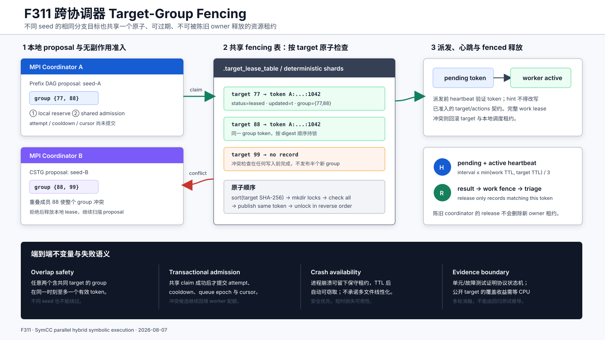

# F311：跨协调器 Target-Group 租约与派发契约

- 日期：2026-08-07
- 实现位置：`util/distributed_state.py`、`util/hybrid_feedback.py`、
  `util/mpi_fuzzing_helper.py`
- 回归位置：`test/test_distributed_state.py`、`test/test_hybrid_feedback.py`、
  `test/test_afl_profile_orchestration.py`
- 当前成熟度：I/T；尚无公开 target 的 R 级性能结论

## 1. 研究问题

F309/F310已经在一个 coordinator 内实现 target group 在途租约和事务式准入，但多主部署仍有
两个缺口。

第一，已有 `FencedWorkLeaseTable` 按完整 work payload 建立 ID。payload 包含 seed、focus、
target、S2F actions、策略和 continuation，因此两个 coordinator 用不同 seed 求解同一 branch
target 时会得到不同 work ID，仍可重复占用昂贵的 solver 预算。

第二，scheduler 在候选阶段租约的是 `ReplayJob(target, actions)`，但 MPI 派发前还会应用 builtin、
semantic 和 external agent hint。hint 可以改写 `target_branch` 或 `s2f_actions`，导致“租约的
target group”与“worker 实际求解的 target group”不一致。即使本地租约正确，跨主去重也会被
派发阶段的改写绕过。

F311把 target group 提升为独立于 seed/work payload 的共享资源，并将其接入 F310 的
proposal → admission → commit 边界。完整机制如下图。



## 2. 学术与系统依据

- Gray 与 Cheriton 的
  [Leases](https://web.stanford.edu/class/cs240/readings/leases.pdf)把有限时间权利作为故障后
  恢复可用性的机制。F311借鉴“租约到期后资源可重新分配”的原则，但用途是减少重复求解，
  不是文件缓存一致性协议。
- [Chubby](https://research.google/pubs/the-chubby-lock-service-for-loosely-coupled-distributed-systems/)
  强调粗粒度协调和可靠低容量状态。F311同样只为 branch target 保存小型控制记录；不过本实现
  依赖共享文件系统的 `mkdir`/`replace` 语义，没有复制状态机或共识层，不能等同于 Chubby。
- [WU-UCT](https://openreview.net/pdf?id=BJlQtJSKDB)把尚未完成的 rollout 显式放入并行选择
  状态。F309/F310把该原则映射为 target 在途占位；F311把可见范围扩展到多个 coordinator。
- [Sparrow](https://cs.stanford.edu/~matei/papers/2013/sosp_sparrow.pdf)中的 late binding 说明
  不可逆调度决定应尽量靠近真实资源可用点。F311在共享 target claim 成功后才提交 attempt、
  cooldown 和 cursor，并在派发前再次验证 pending token。

这些工作提供设计原则而非直接算法等价。F311没有复现 WU-UCT 公式、Sparrow probe 协议或
Chubby 共识服务，也不继承原论文的性能与正确性结论。

## 3. Target-group 身份

一个工作项的共享资源集合定义为：

```text
G(job) = unique(
    positive(primary_target)
    + every S2F action target whose action != "skip"
)[0:64]
```

`skip` 表示明确不求解，不应占用 target。primary 放在逻辑顺序首位，便于本地 group 释放；
共享表则对每个正整数 target 计算：

```text
target_id = SHA256("target:" || decimal(target))
shard     = first_u32(target_id) mod shard_count
```

因此 seed-A 的 `{77,88}` 与 seed-B 的 `{88,99}` 即使完整 work ID 不同，也会在 target 88 的
同一个记录和 update lock 上相交。

## 4. Group claim 协议

`FencedTargetLeaseTable.claim_group()` 执行以下步骤：

1. 正规化、去重并限制最多 64 个 target；
2. 按 `target_id` 排序获取全部短期 `mkdir` update lock，所有 coordinator 使用同一顺序避免
   交叉 group 死锁；
3. 在持有全部锁时读取全部记录；只要任一成员存在未过期 `status=leased`，整组拒绝且不写入；
4. 为所有成员写入同一个 opaque token、owner、worker、group、payload、时间和 attempt/steal
   计数；每条记录使用写临时文件、`fsync`、`os.replace` 发布；
5. 仅当全部记录发布成功时返回 token。普通写失败在仍持锁时尽力恢复旧记录或删除新记录；
6. 逆序释放 update lock。长时间 worker 执行期间不持有目录锁，只保留可 heartbeat 的记录。

该协议在合作 coordinator、共享目录 `mkdir` 原子且同目录 `replace` 原子的假设下保证：一次
正常 claim 对其他 claim 呈现全组冲突检查，失败返回不会留下可被本 coordinator 派发的半组。
进程在多文件发布中途崩溃可能留下保守的部分记录，但调用不可能返回成功并继续派发；残留项由
TTL 回收。它不是跨文件线性化事务。

## 5. Token 语义与准确边界

token 由 `owner:worker:pid:time_ns` 构成，并保存在当前 target 记录中。heartbeat 和 release
必须与**当前记录完全相等**。租约过期后若另一个 master 覆盖记录，旧 master 的 release 只会
清理仍属于旧 token 的残留项，不会删除新 owner 的记录。

这里使用“fencing”描述 current-record compare-and-match，必须与通用分布式系统中的单调
fencing number 区分：F311 token 不是全局递增序号，也不由外部资源服务器比较。target lease
用于效率而非结果正确性；极端暂停、时钟偏差或 heartbeat 丢失后，旧 worker 可能仍在执行，
新 coordinator 也可能在 TTL 后启动同一 target。此时会产生有界重复计算，但最终状态提交仍由
原有**完整 work fencing**的 `begin_commit()` 仲裁，target token 本身不授权 coverage 或
scheduler 结果写入。

## 6. 两级事务式准入

F311在 `AdaptiveHybridScheduler` 中增加可选 `external_admission(job)`：

```text
proposal
  → local target-group reserve
  → shared target-group claim
  → selector-specific commit_jobs
```

共享 claim 失败时，scheduler 立即释放本地 group；Prefix/CSTG/concurrency 的 attempt、
`last_scheduled`、`queue_epoch` 和 cursor 均不提交。callback 抛出异常时也先释放本地 lease，
避免异常路径制造虚假 cooldown。

外部冲突还暴露出 F310 的 proposal 深度问题：请求 1 个 worker 时，selector 原来只返回 1 个
proposal，首项被另一 coordinator 拒绝后无法回填。F311为 Prefix DAG、CSTG 和 concurrency
增加独立 `proposal_limit`：原 `limit` 仍决定高/低队列配额与最终 worker 数，proposal scan
则可遍历当前有界状态全集；scheduler在获得 `limit` 个成功租约后立即停止。fallback replay
同样从“先截断再准入”改为“按排序逐项准入直到填满”。

这保持了 Prefix DAG 的队列公平语义，同时使跨 coordinator 冲突下的调度保持 work-conserving。

## 7. MPI 生命周期

### 7.1 Candidate → pending

`target_candidates()` 与 `replay_candidates()` 通过 external callback 申请共享 group。成功 token
保存在 `pending_target_leases[group]`；候选进入 `work_queue` 后即使本轮没有空闲 worker，token
也随 carried item 保留并定期 heartbeat。

### 7.2 Hint target contract

派发函数在应用任何 hint 前冻结 scheduler/proposal 的 `target_branch` 和规范化 actions。若该
集合非空，hint 仍可调整 strategy、focus 或参数，但 target/actions 随后由
`_enforce_target_contract()` 恢复。untargeted 普通种子仍允许 hint 新建 target，此类 group 在
派发点即时 claim。

### 7.3 Pending → active

派发前重新 heartbeat pending token；token 已失效时尝试重新 claim。失败则不发送工作，并释放
本地租约。随后建立完整 work lease；若 exact work 已被另一 master 占用，target token 和本地
target group 一并回滚。成功发送后，token 从 pending 移到
`active_target_leases[worker]`。

### 7.4 Result → release

master同时 heartbeat pending target、active target 和 active exact-work token。结果到达时：

1. 先用 exact-work token 执行 `begin_commit()`；陈旧 work 结果直接丢弃；
2. 有效结果进入 telemetry、状态反馈和 AFL coverage triage；
3. triage 结束后按 token 释放共享 target group，并无条件释放对应本地 group；
4. target 记录被删除而不是标为永久 `done`，允许后续不同上下文在新证据支持下重试。

队列安全阀截断 carried items 时，已不再对应任何 retained item 的 pending token 会立即释放；正常
关闭也清理 pending/active target token。若共享存储临时不可用，释放失败由 TTL 最终恢复。

## 8. 正确性不变量

| 不变量 | 实现机制 |
| --- | --- |
| 不同 seed 的重叠 target 在有效租约期互斥 | target-only SHA identity 和全组持锁检查 |
| group 正常 claim 全有或全无 | 全部检查先于任何写入，成功只在全部写完后返回 |
| 不发生跨 group 锁死 | 所有 update lock 按 target digest 全序获取 |
| stale release 不删除新租约 | 每个成员均要求 current token 完全相等 |
| 外部拒绝不污染调度统计 | local reserve 回滚，`commit_jobs()` 不执行 |
| 冲突后仍可填满 worker | `proposal_limit` 与 worker `limit` 分离并持续扫描 |
| 租约目标等于 worker 目标 | targeted hint contract 恢复 target/actions |
| target 去重不替代结果正确性 fence | exact-work `begin_commit()` 仍是结果状态入口 |
| coordinator 失联不会永久占用 target | heartbeat + TTL；release failure 也由 TTL 收敛 |

## 9. 配置与观测

- `SYMCC_MULTI_MASTER_TARGET_LEASES=0/1`：仅在 multi-master work lease 启用时生效，默认 1；
- `SYMCC_MULTI_MASTER_TARGET_LEASE_DIR`：默认 `.target_lease_table`；
- `SYMCC_MULTI_MASTER_TARGET_LEASE_TTL`：默认沿用 `SYMCC_WORK_LEASE_TTL`；
- shard 数沿用 `SYMCC_MULTI_MASTER_LEASE_SHARDS`；
  `SYMCC_MULTI_MASTER_LOCK_TTL` 在F321后仅保留为兼容/诊断年龄提示，短update lock不能仅凭
  wall-clock年龄被删除，获取超时会fail closed；
- heartbeat 间隔不超过 work TTL、target TTL 两者较小值的三分之一，并封顶 30 秒；
- 周期日志输出磁盘记录的 leased/expired 数以及本 master 的 pending/active 数。

## 10. 自动化证据

新增 8 项回归：

1. 两个独立 table 实例的 `{11,22}` 与 `{22,33}` 冲突，且未发布 target 33 的部分记录；
2. heartbeat 延长 group，过期后新 owner 接管，旧 token 无法删除新记录；
3. 第二个 group member 写入故障时，第一个已写成员回滚；
4. shared admission 连续拒绝 Prefix/CSTG 的 target 77 后回填 target 88；被拒绝节点的 attempt、
   cooldown 保持为零；
5. fallback replay 外部拒绝后 target cursor 与 `last_replay` 不前移；
6. target group 排除 `skip`，primary 顺序稳定；
7. agent hint 改写 targeted job 后，派发契约恢复原 target/actions，同时保留 strategy 调整；
8. heartbeat 周期始终按 work/target 两类 TTL 的较小值计算，短至 1 秒的 TTL 仍满足三分之一
   周期约束。

本轮结果：

- 分布式状态、调度和 MPI 编排组合：167 passed，另有 12 个 subtest（5.77 秒）；
- 完整 Python unittest：561/561（测试计时 83.576 秒，shell 墙钟 84.111 秒）；
- `py_compile` 与 Ruff：通过；
- F311未修改 LLVM pass，LLVM lit 继续沿用 F307 最近一次完整双版本门禁，不把旧 lit 结果
  冒充本轮新执行。

自动化测试证明实现状态机、故障回滚和接口契约，不证明多节点真实吞吐或覆盖率改善。当前没有
在共享 NFS/并行文件系统上运行两个真实 MPI master 的故障注入 campaign。

## 11. 挑战性与创新点

该工作的难点不是增加另一个路径锁，而是协调三个不同身份层：exact work、target group 和
selector state。exact work 必须允许不同 seed 的多样化任务，target group 又要抑制昂贵的同目标
并发；agent hint 仍需保留策略探索能力，但不能破坏已经取得的共享资源契约；多 lane 的统计只有
在本地和共享两级都成功后才能提交。

相对单纯 `(seed,target)` 去重，F311实现了重叠 S2F action set 的 group 冲突；相对先选后锁，
它把跨主资源判断放入无副作用 admission；相对固定 proposal 截断，它保持原队列配额的同时
提供冲突后全状态回填。创新点位于并行混合符号执行的组合调度协议，不声称提出新的通用分布式
锁算法。

## 12. 科研边界与下一步实验

真实等 CPU 多主消融应至少比较：

1. target leasing off/on 的 shared claim、conflict、steal、expiry 和 backfill 数；
2. unique target/CPU-hour、重复 `(target, overlapping-prefix)` solve、solver CPU 与队列填充率；
3. coverage AUC、time-to-target、生成输入保留率及最终稳定 edge；
4. TTL = 0.5×/1×/2× timeout 下的误过期重复计算和等待时间；
5. target-only、target+prefix-class、允许 K 个不同 seed/target 并发三种多样性策略；
6. NFS/并行文件系统上的 lock/replace 延迟、时钟偏差、master kill -9 和写入故障注入。

当前实现故意选择安全而保守的部分发布恢复：中途崩溃可能短时阻塞一个 target，而不是让已经
失败的 claim 继续派发。若真实数据表明 target-only 租约压制了有价值的 seed 多样性，下一步应
将容量从二元互斥扩展为带 prefix 距离的 K-slot lease，而不是删除全局在途可见性。
