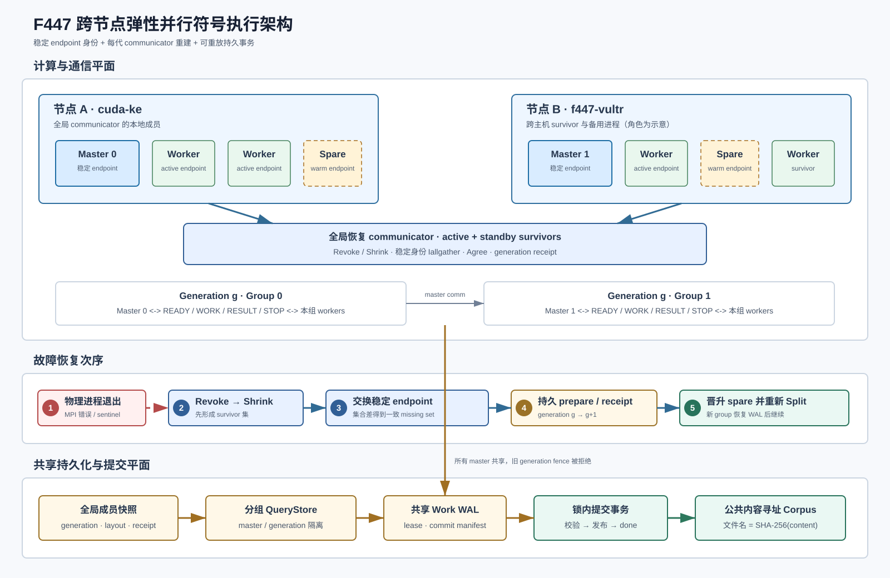
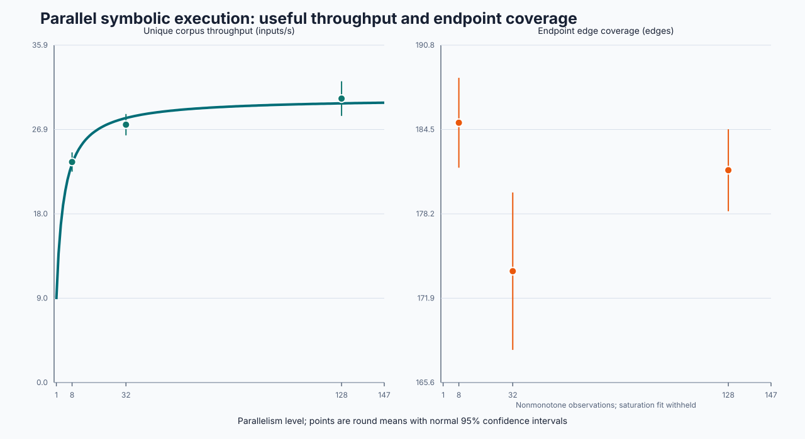

# F447：跨节点连续 ULFM 恢复与可审计规模证据

**日期**：2026-08-25  
**状态**：跨节点连续物理失效机制门禁通过；8/32/128-worker 提前停止工程实验已封存  
**前置**：F322 工作 WAL、F327-F330 文件系统资格、F441/F443 ULFM、F446 multi-master 与 warm spare  
**默认行为**：关闭；生产热路径必须显式设置 `SYMCC_ULFM_HOT_PATH=1`

## 1. 本阶段解决的问题

F446 已在单机证明 multi-master communicator 可重建、备用进程可连续晋升，但跨节点运行暴露了三类
不能靠单机测试发现的问题：

1. **失效认知是局部的**：远端 survivor 被 `Revoke` 唤醒时，`Get_failed` 可能仍为空；若把本地
   failed group 当成全局事实，不同节点会生成不同 recovery plan。
2. **多个 master 会争用同一状态与 staging**：每代分组控制器使用相同目录会发生 schema 冲突；两个
   master 同时重放同一 `committing` 记录时，一个可能在另一个校验期间删除暂存对象。
3. **共享状态不等于跨用户可读**：默认 `0600` 的快照与 corpus 在不同 Unix 用户的远端节点上不可读，
   但盲目继承 `umask` 又无法形成明确、可审计的权限合同。

F447 将这三类问题收敛为稳定身份发现、分代状态命名空间、单记录提交事务和显式文件模式合同，并在
两台主机上注入连续两次物理进程退出完成端到端验证。



## 2. 系统架构与职责边界

系统包含三层互不替代的状态。

| 层 | 权威事实 | 生命周期 | 失败后的作用 |
| --- | --- | --- | --- |
| 全局恢复 communicator | 当前 survivor 的通信可达性 | 每次 `Shrink` 后替换 | 删除失败进程，为稳定身份交换提供新上下文 |
| 全局成员快照 | stable endpoint、generation、active/spare、layout、receipt | 整个 campaign | 决定成员变化是否合法、哪个 spare 晋升 |
| 分组 QueryStore | 本 master、本 generation 的 shard/lease fence | 每组每代 | 拒绝旧代结果，隔离不同 master 的控制状态 |
| 共享 Work WAL | work identity、lease token、commit manifest、done | 跨 master、跨 generation | 接管未完成工作，幂等重做已经决定的发布 |
| 公共 corpus | `SHA-256(content)` 命名的不可变对象 | 跨代累计 | 对重复执行和重复发布进行内容级去重 |

ULFM 只修复通信能力，不恢复应用状态。应用层恢复依赖成员快照、QueryStore 和 WAL；因此不能把
`Shrink` 成功等同于 campaign 已恢复。

## 3. 正常执行流程

### 3.1 启动与角色形成

1. 每个 rank 在 `COMM_SELF` 上实际调用 ULFM 能力接口；所有 rank 交换能力与 policy SHA。接口缺失、
   runtime 未启用或策略不一致时立即失败，不退回普通 MPI。
2. 初始 rank 被封存为 stable endpoint identity；以后 `Shrink` 造成的 transport rank 变化只用于当前
   communicator 路由，不能用作持久 owner identity。
3. rank 0 创建 generation 0 全局成员快照，固定 active budget 和高 rank warm spares。
4. active endpoint 根据当前 transport 顺序计算 master/worker 布局，写入内容寻址的
   `generation-<g>-layout.json`，再分别 `Split` 出 group communicator 与 master communicator。
5. 每个 master 在
   `ulfm-query-store/master-<stable-master>/generation-<g>/` 打开独立控制器；WAL 和公共 corpus 仍由
   所有 master 共享。

### 3.2 派发、求解与提交

1. worker 发送 `READY`；master 通过 rendezvous ownership 选择输入，并先在 WAL 和 QueryStore 中
   持久化 work lease。
2. master 发送带 `generation + shard + lease + work hash` 的 `WORK` envelope。worker 只接受当前
   generation，并按 `input_hash` 读取内容寻址输入。
3. worker 运行符号执行，将候选对象写入自己的 staging，返回 `RESULT` 及完整 fence；它不能直接写入
  公共 corpus。
4. master 校验 transport owner、work identity、generation/shard/lease、对象数量、长度和 SHA-256，
   然后把规范 commit manifest 写入 WAL，使发布集合成为可恢复决定。
5. `replay_commit_once` 在该 work record 的排他锁内执行“重新读取 manifest → 校验/发布所有对象 →
   记录 done”。发布异常保留 `committing`，新 master 可重试；并发 master 不能同时消费 staging。
6. 公共对象使用 SHA-256 文件名；已有同摘要对象必须内容一致。新对象在 rename/link 前设置显式模式并
   `fsync`，发布和目录项按既有 durability contract 落盘。

这里保证的是 **effectively-once publication**，不是 exactly-once computation。恢复窗口可重复求解，
但 work fence、WAL 单提交和内容寻址 corpus 阻止重复副作用和重复记账。

## 4. 连续失效恢复的精确次序

1. group 数据面返回 `ERR_PROC_FAILED(_PENDING)`/`ERR_REVOKED`，或 master 为每个所辖 worker 预置的
   failure-sentinel receive 观察到失败。`Get_failed` 可以帮助触发恢复，但不再作为全局成员真相。
2. 首个观察者撤销全局 communicator；所有 survivor 进入恢复路径。
3. **先 `Shrink`** 得到共同 survivor communicator。每个 survivor 用固定宽度 `Iallgather` 发送自己的
   stable endpoint rank；以旧成员集合减 survivor 集合得到完全一致的 missing set，并 `Agree(True)`。
4. survivor 对该 missing set 幂等执行 durable `prepare`。若已有 pending plan，必须与发现集合兼容；
   否则按状态分叉失败关闭。
5. 在新的 communicator context 上再执行一次 shrink/attestation。这一恢复专用的第二次 shrink 用于
   吸收恰好发生在 discovery collective 期间的新故障；超时和重试次数均受 policy 限制。
6. durable receipt 提交 generation `g+1`；旧代 generation/shard/lease token 立即失效。
7. 按 stable identity 的确定顺序补足 active budget：最低可用 warm spare 晋升；随后重新生成 layout、
   `Split` group/master communicators，并打开新的 per-master/per-generation QueryStore。
8. 新 master 先重做 WAL 中的 `committing`，再接管可回收 lease，然后恢复 `READY/WORK/RESULT` 循环。
   campaign wall deadline 从 generation 0 起连续计时，不因恢复而延期。

该顺序修复了“本地 `Get_failed` 为空”的跨节点反例。共同 survivor 集来自 `Shrink` 的通信结果，稳定
身份集合差才是应用层失败事实；这两者均由所有 survivor 参与，而不是由某个 root 猜测。

## 5. 跨节点端到端结果

### 5.1 配置

- 节点：`cuda-ke` 与 `vultr`，远端以独立 `linuxuser` 运行；最终 oracle 要求至少两个 surviving hosts。
- 运行时：两端同一 Open MPI 5.0.10 portable build，`--with-ft ulfm`、`pml=ob1`、`btl=tcp,self`。
- 拓扑：10 ranks，初始 8 active + 2 warm spares，`workers-per-master=3`，形成 2 masters + 6 workers。
- 故障：generation 0 真实 `os._exit(86)` 终止 stable rank 2；generation 1 终止 stable rank 3。
- 时限：15 秒 simulation。该目标验证并行框架与故障协议，不测符号求解算法收益。
- 共享面：本地 ext4 经 SMB 提供远端视图；测试使用 NAT/端口转发 shim 与 flock broker。它们属于
  受控异构网络门禁，不是生产存储或网络方案。

### 5.2 可复核结果

| 指标 | r19 结果 | 交叉检查 |
| --- | ---: | --- |
| 物理故障 | 2 | receipt 依次为 `rank-2`、`rank-3` |
| 最终 generation | 2 | global snapshot 与 oracle 一致 |
| spare 晋升 | `rank-8`、`rank-9` | generation 1/2 layout 一致 |
| 最终 active | 8 | `[0,1,4,5,6,7,8,9]` |
| surviving hosts | 2 | 独立 oracle 的 minimum-host 门 |
| 最终 masters / workers | 2 / 6 | 最终统计日志 |
| WAL analyzed / generated | 164 / 820 | 扫描 done manifest 重新聚合 |
| 公共对象 | 820 | 逐文件验证“文件名 = 内容 SHA-256” |
| 证据文件 | 2,491 | `SHA256SUMS.txt` 全量复算 |

launcher 返回 86 是预期注入结果，只有独立 oracle 完成后才接纳。oracle 与独立 verifier 得到相同的
`result_sha256=915acdbd...d66159`；全局状态摘要为 `1c1e65b1...ceb122`，最终 snapshot 摘要为
`a2d51457...a841c`。远端节点另行读取一个 corpus 对象并重新计算摘要，证明文件不是只在本地视图可见。

日志中的 15.8 candidates/s、820 generated 和 820 public objects 是本次 simulation 的运行事实，
**不能用于宣称符号执行吞吐、coverage 或缺陷发现提升**。deadline 时仍有 653 条 leased frontier 记录，
说明这是有界 anytime campaign，而不是“耗尽所有可达工作”；已决定的 164 项工作和公开对象均可审计。

## 6. 审查中发现并修复的错误

| 错误 | 后果 | 修复 |
| --- | --- | --- |
| 以本地 `Get_failed` 作为失败集合 | 不同节点 prepare 不同 plan | shrink-first + stable endpoint Iallgather + set difference |
| 所有 master/代次共用 QueryStore 根 | controller/schema 互相覆盖 | `master-<id>/generation-<g>` 双维命名空间 |
| 多 master 分步 replay manifest | staging 校验/删除竞态 | `replay_commit_once` 把 publish 与 done 放在 record lock 内 |
| snapshot 固定 `0600` | 跨 Unix 用户恢复失败 | `SYMCC_ULFM_SNAPSHOT_FILE_MODE` 严格八进制合同 |
| corpus 继承临时对象权限 | 远端 coverage/replay 不可读 | `SYMCC_SHARED_CORPUS_FILE_MODE` + `fchmod/fsync` |
| 只验证 manifest 自身摘要 | 封存后修改源码仍可执行 | 每个新调度单元前 `verify_live_provenance` 复算源码/输入/工具身份 |
| 显式目标零匹配仍返回 0 | 空 CSV 被误当作成功实验 | 零 `available_targets` 时退出 2，并打印请求目标 |
| 内部 MPI 行失败但驱动器返回 0 | 协议层把 `exit-70` 标成成功 | 报告落盘后由 `benchmark_matrix_exit_code` 传播退出码 3 |

## 7. 规模上限模型：依据与边界

并行规模不能仅看“worker 越多，候选越多”。本项目同时拟合两个经验模型：

\[
X(N)=\frac{\gamma N}{1+\sigma(N-1)+\kappa N(N-1)}
\]

第一项是 Gunther Universal Scalability Law：`gamma` 表示单 worker 尺度，`sigma` 吸收共享队列、WAL、
master 调度等串行/竞争成本，`kappa` 吸收随 worker 对数增长的协调与一致性成本。该式有排队论依据，
但拟合参数是本项目特定目标和机器上的经验量，不是跨程序常数。

\[
E(N)=E_b+G_\infty(1-e^{-\rho(N-N_b)})
\]

第二项是项目自定义的覆盖饱和曲线，用于表达“新增 worker 继续生成候选，但新边际覆盖逐渐趋零”。最终
建议上限取 USL 边际吞吐阈值、覆盖边际增益阈值和物理资源上限的最小值。这个组合是**决策模型**，
不是学界已证明的符号执行定律；至少需要三个规模点，置信区间过宽、外推超出实测区间或目标变化时都
必须重新拟合。

### 7.1 实验合同与提前停止口径

实验预注册了 8/32/128 worker 三档、每档 20 次，固定 60 秒测量窗口和相同 130-core 调度资源，按
repeat 组成配对区组并随机化区组及组内顺序。协议摘要为
`395cedabb840...99e729f41037`，封存 worktree 摘要为
`2f00fd21b124...4449ae715b27`；24,406 个源码文件、两个目标二进制和 seed 目录在每个新 cell 前重新
核验。

用户要求在累计超过 30 个 cell 后停止。停止时已有 35 个外层结果完整落盘，第 36 个未完成目录不计入；
其中 11 个 repeat 具备三档完整结果。内部 CSV 复核发现 128-worker 有 2 次 `exit-70`，但旧驱动器错误
返回 0；因此可靠性使用 11 个平衡区组，性能比较进一步整组排除这两个失败 repeat，保留 **9 个三档均
成功的配对区组（27 cell）**。该数据是提前停止的 engineering evidence，不满足预注册的 20 次确认性
门槛，不能标为 R 级或推广到其他目标。

### 7.2 成功条件下的规模结果

下表均为 9 个有效配对区组的均值；方括号为跨轮 normal 95% CI。`unique/s` 是最终保留输入吞吐，
比原始候选率更接近系统的有效产出。

| worker | generated/s [95% CI] | unique/s [95% CI] | 保留率 | endpoint edges [95% CI] |
| ---: | ---: | ---: | ---: | ---: |
| 8 | 65.47 [61.65, 69.30] | 23.47 [22.45, 24.50] | 35.85% | 185.00 [181.64, 188.36] |
| 32 | 83.42 [79.63, 87.21] | 27.45 [26.31, 28.58] | 32.90% | 173.89 [168.00, 179.78] |
| 128 | 97.93 [91.47, 104.40] | 30.22 [28.38, 32.06] | 30.86% | 181.44 [178.38, 184.51] |



以同一 repeat 的 8-worker 结果为基线，Student-t 95% 配对区间得到：

| 对比 | generated/s 变化 | unique/s 变化 | endpoint edges 变化 | 保留率相对变化 |
| --- | ---: | ---: | ---: | ---: |
| 32 vs 8 | +29.01% [13.04%, 44.98%] | +17.63% [7.07%, 28.18%] | -5.99% [-9.38%, -2.60%] | -8.27% [-11.47%, -5.08%] |
| 128 vs 8 | +50.52% [35.61%, 65.43%] | +29.29% [17.80%, 40.78%] | -1.82% [-5.38%, 1.74%] | -13.98% [-15.79%, -12.17%] |

**结论**：更多 worker 确实提高了候选和有效输入吞吐，但收益远低于 worker 数增长；去重保留率持续下降。
在这个小型饱和目标和 60 秒窗口上，吞吐提升没有转化为 endpoint coverage 提升：32-worker 的配对边数
显著低于 8-worker，128-worker 与 8-worker 的区间跨 0。该结果说明当前瓶颈已经从“生成更多候选”转向
去重、目标分工、master/WAL 协调和高并行稳定性，不能仅凭 candidates/s 评价优化效果。

### 7.3 可靠性与上限模型

11 个三档完整区组中，8/32 worker 均为 0/11 内部失败；128 worker 为 2/11，即 18.18%，Wilson 95%
区间为 [5.14%, 47.70%]。样本仍少，区间较宽，但足以证明 128-worker 当前不能作为默认稳定规模。

成功样本的有效吞吐 USL 拟合为 `sigma=0.2933, kappa=0, R2=0.6359`；按“并行度翻倍的预测收益低于
10%”得到 11-worker 启发式阈值。原始吞吐模型阈值为 20 worker，物理资源上限为 191。由于只有三个
规模点、最低实测点已经是 8 worker、拟合 `R2` 偏低且实验提前停止，**11 不是生产上限或经验最优值**，
只表示现有数据中的有效吞吐很早进入强边际递减。

endpoint edges 不满足单调增长假设，覆盖饱和拟合被明确拒绝并记录
`coverage_fit_error=invalid coverage observation`；系统没有强行给出覆盖上限。因而本轮模型只能提供吞吐
饱和信号，不能给出联合 coverage ceiling。要形成可决策上限，仍需更长窗口、增加 1/2/4/16/64 等中间
规模并定位 `exit-70` 根因后重新拟合。

## 8. 与相关工作的关系

- Open MPI 5 ULFM 定义 `Revoke`、`Shrink`、`Agree`、failed group 与非致命错误码；F447 在其上增加
  应用级稳定身份、持久 membership、WAL 和发布事务。
- *Shrink or Substitute* 对比了缩容与备用进程替代。F447 选择预启动 warm spare，避免把
  `MPI_Comm_spawn` 当成等价容错原语，同时保持 active budget。
- FTHP-MPI 以复制结合 checkpoint/restart；F447 当前复制控制事实和工作身份，不复制完整求解进程
  内存，因此恢复成本和可恢复状态边界不同。
- USL 为并行吞吐的 contention/coherency 解释提供依据；覆盖饱和层与多门槛合并由本项目构造，必须
  通过预注册实验校准。

参考资料：

- [Open MPI 5.0 ULFM 官方文档](https://docs.open-mpi.org/en/v5.0.x/features/ulfm.html)
- [MPIX_Comm_shrink 官方语义](https://docs.open-mpi.org/en/v5.0.x/man-openmpi/man3/MPIX_Comm_shrink.3.html)
- [Gunther, A General Theory of Computational Scalability](https://arxiv.org/abs/0808.1431)
- [Ashraf et al., Shrink or Substitute](https://arxiv.org/abs/1801.04523)
- [Joshi and Vadhiyar, FTHP-MPI](https://arxiv.org/abs/2504.09989)

## 9. 复验、证据和结论等级

```bash
F447_OUTPUT_DIR=/tmp/f447 \
F447_HOST_SPEC='cuda-ke:9,f447-vultr:1' \
F447_MINIMUM_HOSTS=2 F447_RANKS=10 F447_WARM_SPARES=2 \
F447_FAILURE_SCHEDULE='0:2,1:3' \
benchmark/run_f447_multinode_ulfm_test.sh
```

- 核心实现：`util/mpi_concolic_execution.py`、`util/distributed_state.py`
- 原子快照：`util/ulfm_snapshot_store.py`
- 跨节点门禁：`benchmark/run_f447_multinode_ulfm_test.sh`
- 独立 oracle：`benchmark/check_f446_elastic_ulfm_oracles.py`
- 协议测试：`test/test_mpi_ulfm_recovery.py`、`test/test_distributed_state.py`、
  `test/test_research_protocol.py`
- 最终 Python 能力门：1,368 tests + 310 subtests，0 skip/xfail/deselect，规范 node-ID 清单无漂移；
  原生 lit 门：333 discovered，332 passed + 1 expected unsupported，0 failed
- 证据：`.symcc-research-evidence/f447-multinode-ulfm-20260825-current-r1/formal-r19/`
- 提前停止规模证据：`.symcc-research-evidence/f447-scale-confirmatory-20260825-r1/`；
  `selection.json` 给出所有接纳/排除规则，`analysis/paired_comparisons.json` 和
  `analysis/reliability.json` 保存配对区间与失败率

当前可声明：**在受控双节点测试拓扑中，10-rank multi-master campaign 经连续两次真实进程退出、两次
communicator replacement 和两级 spare 晋升后，仍保持 8 个 active endpoint，并生成通过独立摘要
验证的跨代 WAL/corpus 结果。**

当前不可声明：生产网络直接互通、原生分布式文件系统锁资格、真实目标 MTTR 分布、故障零开销、
8/32/128-worker 覆盖提升、通用最优 worker 上限或 R 级规模结论。NAT shim、SSH tunnel、SMB 与
flock broker 是测试条件，必须与生产部署分开表述；提前停止规模实验只支持“吞吐提高但强烈边际递减，
覆盖未提高且 128-worker 暴露稳定性风险”的目标/机器/预算特定结论。
