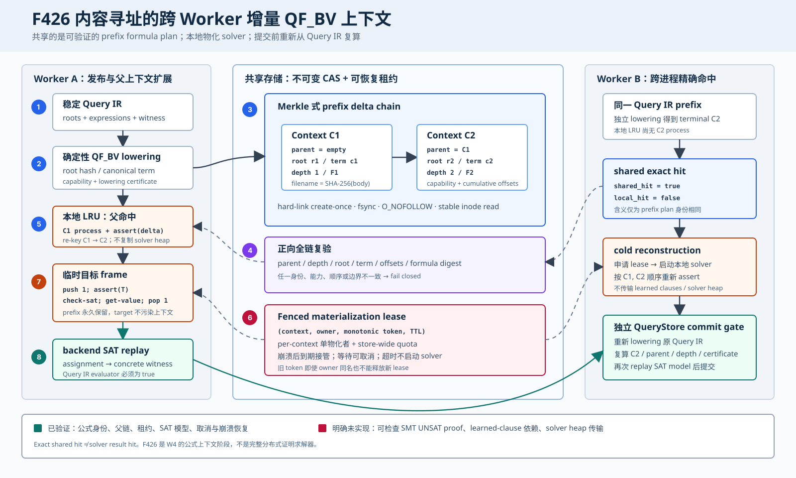

# F426：内容寻址的跨 Worker 增量 QF_BV 上下文

- 日期：2026-08-17
- 功能编号：F426
- 状态：I/T/E-mechanism；W4 第一阶段完成，证明级 UNSAT 与 learned-clause 共享未完成
- 主要实现：`util/cross_worker_context.py`、`util/qf_bv_backend.py`、
  `util/query_store.py`、`util/symcc_query_service.py`
- 自动化验证：`test/test_cross_worker_context.py`、`test/test_qf_bv_backend.py`、
  `test/test_query_store.py`、`benchmark/check_cross_worker_context_oracles.py`

## 1. 研究问题

动态符号执行会反复求解“长前缀 + 一个新目标”的查询：

\[
Q_i = P_k \land T_i,\qquad
P_k = c_1 \land c_2 \land \cdots \land c_k.
\]

项目原有 persistent QF_BV backend 已能在**单个进程**内保留 `P_k`，并以
`push/assert(T_i)/check-sat/pop` 求解多个目标。但是 worker A 已经降低、校验并物化的
前缀，对 worker B 仍是不可见的；worker 重启后也只能从 Query IR 重新发现同一结构。
问题不只是少一个 cache，而是缺少四个跨进程合同：

1. 两个 worker 如何证明它们讨论的是同一个 QF_BV 前缀，而不是恰好相同的可变名字；
2. 如何只发布增量 `c_k`，同时验证完整祖先链、能力集和输入字节声明；
3. 多 worker 同时物化 solver 时如何限制进程风暴，并在崩溃后自动恢复；
4. 后端上报“共享命中”后，QueryStore 如何独立复算，而不是信任 worker telemetry。

F426 实现的是**可移植的公式上下文计划**：共享存储保存规范化 SMT-LIB 前缀增量和
Merkle 式父链，worker 用它重建或扩展本地 solver process。它没有序列化 Z3/cvc5 的堆、
搜索栈、learned clauses 或 preprocessing 内部状态。这一区分很重要：跨进程共享公式身份
已经落地，跨进程共享完整求解器内部状态仍是后续研究问题。



## 2. 技术来源与本项目取舍

Bitwuzla 的公开 API 以 `push`/`pop` 支持增量求解，并允许读取当前 assertions；这验证了
“稳定前缀 + 临时目标”是主流位向量 solver 的一等执行模型。增量 SMT 预处理研究进一步指出，
当大量查询只对共同主公式做小修改时，每次清空 solver 会重复付出处理成本。

2026 年 TACAS 的 *Real-time Proof Checking for Distributed Incremental SAT Solving*
把公式增量、查询和跨 checker 信息绑定到 fingerprint，并强调不同实例必须对同一增量公式
达成身份一致。F426 借鉴其**增量公式身份和不可信传输复验**思想，但适用域和可信结论不同：

| 维度 | TACAS 2026 工作 | F426 |
| --- | --- | --- |
| 逻辑 | incremental SAT/LIDRUP 子集 | SymCC Query IR 降低后的 QF_BV SMT-LIB |
| 共享内容 | 公式/子句 fingerprint 与可检查信息 | 每级 prefix assertion 的内容寻址 manifest |
| 结果可信性 | trusted checker/confirmers 验证 SAT/UNSAT 信息 | SAT 候选由 backend 与 QueryStore 两次 Query IR replay 验证 |
| 尚未覆盖 | 不适用 | SMT UNSAT proof、learned clause 依赖与 solver heap transport |

因此，本文不继承论文的证明、开销或可扩展性数字；论文是架构来源，不是 F426 的实验结果。

## 3. 内容身份和数据模型

### 3.1 一层一个不可变增量

对第 `d` 条前缀约束，manifest 包含：

- 协议三元组：context schema、transport protocol、lowering protocol；
- 当前 Query IR `root_hash` 和规范 SMT-LIB `term`；
- 父上下文 SHA-256 与当前深度；
- backend capability SHA-256，隔离 solver 能力或配置漂移；
- 当前项新增字节 `delta_offsets` 与累计 `offsets`；
- 累计公式摘要 `formula_sha256`。

令 `H` 为规范 JSON 的 SHA-256，`t_d` 为 SMT term 摘要，则：

\[
F_d = H([(r_1,t_1),\ldots,(r_d,t_d)]),
\]

\[
C_d = H(schema, protocol, lowering, C_{d-1}, capability,
        r_d, term_d, offsets_d, F_d, d).
\]

文件名为 `C_d.json`，文件内容也携带 `C_d`。父摘要、路径名、内容摘要和累计公式身份形成
四重绑定；不同能力集、不同 root、不同 term、不同次序或不同 offset 集都不会碰巧命中同一
上下文。

### 3.2 为什么不直接共享一份 `.smt2`

整份脚本的摘要只能回答“完整文件是否相同”，不能高效表达 `P_2` 是 `P_1` 的一个增量，
也不能让本地 solver 只追加最后一条 assertion。F426 的父链同时服务三类路径：

1. exact hit：另一 worker 已发布完整 `C_d`；
2. parent extension：本进程已有 `C_{d-1}`，只声明新 offset 并永久 assert `term_d`；
3. cold reconstruction：本地没有 solver，验证祖先链后按序重建全部 terms。

### 3.3 有界性

单 term 最大 1 MiB、单链最大 64 MiB、深度最大 4096；共享对象数配置范围为
1--10,000,000，全局同时物化数为 1--4096。offset 必须是 32 位非负整数，term 必须是
无 NUL 的 ASCII SMT-LIB。循环父链、重复/乱序 offset、未知字段、能力漂移和累计摘要不一致
全部失败关闭。

## 4. 端到端执行次序

一次启用共享上下文的 persistent QF_BV 请求严格按以下顺序执行：

1. **稳定读取 Query IR**：QueryStore 返回经过既有 artifact/CAS 检查的 roots 与 expressions；
2. **确定性 lowering**：backend 产生每个 root 的规范 QF_BV term、offset 集和 lowering certificate；
3. **发布前缀链**：仅对 target 之前的 roots 调用 `publish_chain`，逐层 hard-link create-once；
4. **完整解析复验**：从 terminal digest 逆向读取父链，再正向复算 parent、depth、offset 与
   `formula_sha256`；
5. **本地 exact 查询**：以共享 terminal digest 作为 solver LRU key，不再依赖 worker 私有 key；
6. **物化租约**：本地未命中时，在剩余 query deadline 内申请带 token 的 expiring lease；全局
   配额满时等待可取消，超时返回 `unknown/quota-timeout`，不会偷偷启动 solver；
7. **parent extension 或 cold reconstruction**：若本地有精确父进程，则永久追加一个 delta 并
   将 LRU key 改为 child；否则启动新交互式 solver，声明 offsets 并按序 assert 完整 prefix；
8. **临时目标求解**：执行 `push 1`、`assert target`、`check-sat`、`get-value`、`pop 1`；
9. **本地 SAT 验证**：把模型覆盖到 concrete witness，调用 QueryStore 的 Query IR evaluator；
10. **结果提交复验**：QueryStore 独立重新 lowering 当前 Query IR，复算 terminal/parent/depth/
    certificate，并再次验证 SAT candidate，之后才提交结果与统计。

取消可发生在租约等待或 solver I/O 两处。前者取消 lease wait，后者中断活动进程；两者都返回
`unknown`，不把未完成结果写成 SAT/UNSAT。

## 5. 并发、崩溃与文件完整性

### 5.1 CAS 发布

发布先在目标 shard 中写临时文件，处理短写和 `EINTR`，`fsync` 文件后以 hard link
实现 no-replace。竞争失败的发布者重新读取权威对象并要求字节完全相同。对象读取要求
`O_NOFOLLOW`、regular inode、大小上界，并比较读取前后以及路径项的 device/inode/size/mtime，
拒绝 symlink 和读中替换。

SQLite WAL 只保存索引、store metadata 和物化租约；不可变 JSON 才是公式内容。schema、
protocol、最大对象数和最大并发物化数在首次创建时持久承诺，后续进程使用不同配置会启动失败，
避免同一共享目录出现不同配额解释。

### 5.2 Fenced materialization lease

每个 terminal context 最多有一个活动物化者，同时还受 store-wide 配额约束。lease 身份为
`(context_sha256, owner, token)`；过期或取消后的再次 claim 必须递增 token。旧 owner 即使名称
相同，也不能用旧 token 释放或取消新 lease。进程崩溃不需要清理回调，TTL 到期后即可接管。

租约限制的是**新建或父扩展 solver process**，而不是 QueryStore 查询所有权；已经在本地 LRU
中的 exact context 直接使用，不重复占用 materialization quota。

## 6. 正确性信任边界

### 6.1 SAT

SAT 结果需要两次独立于 solver 声明的检查：backend 先将 assignment 应用于原 witness 并执行
Query IR evaluator；QueryStore 在 commit 前再次加载查询、检查 telemetry 和共享上下文身份，
再验证 candidate。共享 exact hit 只说明前缀计划相同，**不等于** model/result cache hit。

### 6.2 UNSAT

F426 没有新增可检查的 SMT UNSAT proof。backend 原有 `accept_unsat` capability 语义保持不变，
共享上下文 telemetry 不能提高一个 solver 的 UNSAT 权限。当前不能声称：

- 不同 worker 可以共享 UNSAT 结论；
- 某个共享 learned clause 对当前 QF_BV 前缀可蕴含；
- F426 达到了 TACAS 2026 proof checker 的结果可信级别。

这些是 W4 后续阶段必须通过 proof receipt、独立 checker 或受限双 solver 确认解决的问题。

## 7. 实现细节

| 模块 | 责任 |
| --- | --- |
| `cross_worker_context.py` | 规范 manifest、CAS、父链解析、store metadata、fenced lease 和统计 |
| `qf_bv_backend.py` | Query IR lowering、共享发布/解析、本地 LRU、parent extension、目标 push/pop、取消 |
| `query_store.py` | telemetry schema、独立 identity/certificate 复算、SAT 准入与跨 worker 统计 |
| `symcc_query_service.py` | CLI/环境配置、共享 store 生命周期、每 backend owner 与 service stats |

生产配置为：

```text
SYMCC_QFBV_CONTEXT_STORE=/shared/symcc/qfbv-contexts
SYMCC_QFBV_CONTEXT_MAX_OBJECTS=1000000
SYMCC_QFBV_CONTEXT_MAX_ACTIVE=64
SYMCC_QFBV_CONTEXT_LEASE_SECONDS=30
```

未设置 `SYMCC_QFBV_CONTEXT_STORE` 时功能完全关闭，既有单进程 persistent prefix cache 行为保持
不变。服务端参数和完整范围见 `docs/Configuration.txt`。

## 8. 验证结果

### 8.1 独立有限域 oracle

oracle 使用一份不调用生产 digest builder 的参考编码器，枚举：深度 1--4、offset base 0--3、
两种 BV operator，共 32 条链。生产 manifest 与参考 manifest 逐字段相等，
`false_identity=0`，最大验证深度为 4。

### 8.2 真实 cvc5 跨 worker 路径

同一临时共享 store 上完成三个真实 SAT 查询：

| 请求 | worker / prefix | 预期模型 | 观察 |
| --- | --- | ---: | --- |
| Q1 | A / depth 1 | input[0] = 66 | 首次 cold materialization |
| Q2 | A / depth 2 | input[0] = 67 | `parent_reuse=true` |
| Q3 | B / depth 2 | input[0] = 68 | `shared_exact_hit=true` 且 `local_hit=false` |

三次状态均为 SAT，并全部通过 QueryStore commit。最终只有两个 context objects；统计为
3 个共享结果、1 个跨 worker exact hit、1 个 parent reuse、0 个 quota timeout。

### 8.3 反例与故障路径

测试覆盖 capability/root/term/digest 篡改、symlink 对象、并发同内容发布、store 配置漂移、深度与
大小上界、旧 token 同 owner 取消、lease 过期接管、全局 quota、等待超时、等待期间取消，以及
“无效 solver 命令在 quota-timeout/cancel 路径绝不能启动”的反例。F426定向Python为21/21，
关联集为49 passed加25 subtests；capability-closed全量Python为1,153 passed加253 subtests，零
skip/xfail/deselection/node-ID漂移。LLVM 17发现310项，308 passed加2项预期unsupported；LLVM 18
发现310项，309 passed加1项预期unsupported。两版F426定向lit均为2/2。

### 8.4 机制成本

20 次“八层 exact publish + 完整 verified resolve”的封存 run-1 中位数为
7.777 ms，最小 4.448 ms，最大 89.302 ms；紧邻 run-2 中位数为 4.123 ms，显示共享主机抖动
不可忽略。该数字包含 SQLite/文件系统同步，只用于给协议本身定量，不是求解加速、coverage AUC
或吞吐提升结论。

## 9. 创新性与挑战性

1. **Query IR 与跨进程 solver identity 闭合**：身份同时绑定语义 root、规范 term、能力集、
   输入声明和祖先顺序，避免“相同字符串 key”式弱 cache；
2. **公式共享与进程共享解耦**：共享层保持 solver-neutral，进程层可在 exact、parent 和 cold 三条
   路径间选择，既支持崩溃恢复，也不假装可移植 solver heap；
3. **双重独立复验**：生产 backend 验证 CAS，QueryStore 从原 Query IR 重新 lowering 后验证
   worker telemetry，使恶化为错误命中的路径失败关闭；
4. **资源安全成为语义合同**：全局 quota、deadline、cancellation 和 fenced TTL 不是外围运维参数，
   而是决定是否允许创建 solver 的可测试协议状态。

## 10. 明确未完成的 SOTA 部分

F426 关闭 W4 的第一阶段，但以下工作仍未完成：

1. proof-carrying UNSAT receipt，以及与 QF_BV solver proof 格式相匹配的独立 checker；
2. learned clause/lemma 的依赖闭包、prefix entailment 验证和跨版本能力协商；
3. solver-native snapshot/fork server，或可验证的 preprocessing/search-state transport；
4. context/result CAS 的淘汰、引用追踪和跨作业垃圾回收；
5. 在固定硬件、多节点和公开 benchmark 上，与 disabled/local-only/shared 三组做配对重复实验，
   报告 solver CPU、p50/p95、吞吐、coverage AUC 和最终覆盖率。

因此当前等级是 I/T/E-mechanism，而不是 R 级性能复现。下一步应优先实现可检查结果回执，先让
跨 worker 共享从“公式身份可信”扩展为“结果身份可独立裁决”，再进入 learned-clause 传输。

## 11. 参考资料

- Schreiber et al., *Real-time Proof Checking for Distributed Incremental SAT Solving*,
  TACAS 2026, DOI: https://doi.org/10.1007/978-3-032-22752-2_18
- Bitwuzla 0.9.1 API，incremental `push`/`pop` 与 termination contract：
  https://bitwuzla.github.io/docs/c/types/bitwuzla.html
- Haynal et al., *On Incremental Pre-processing for SMT*, CADE 2023：
  https://doi.org/10.1007/978-3-031-38499-8_3
- 项目 F426 可执行 oracle：`benchmark/check_cross_worker_context_oracles.py`
- F426 证据：`docs/codex/evidence/f426-cross-worker-incremental-qfbv-context-2026-08-17/`
