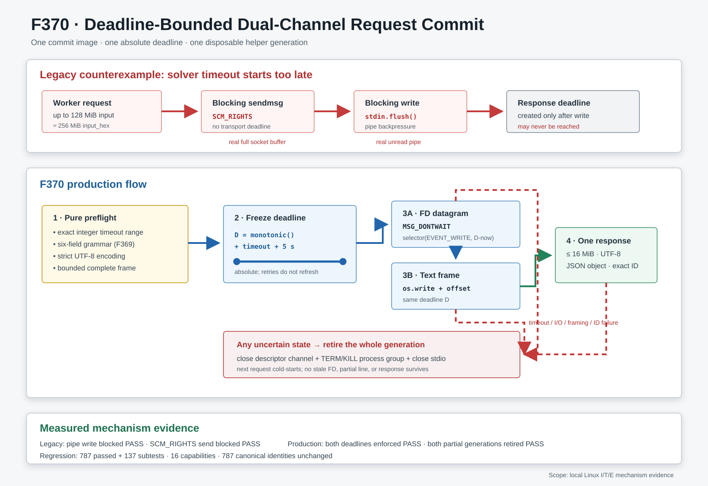

# F370：Deadline-Bounded Dual-Channel Request Commit

## 摘要

F367-F369依次把持久求解器的artifact身份、generation故障原子性和请求字段语法闭合起来，
但一次请求真正进入helper仍包含三个可能等待的阶段：

1. 通过Unix `SOCK_SEQPACKET`发送prefix/target的sealed descriptor；
2. 通过stdin pipe提交六字段文本frame；
3. 从stdout读取并验证单个JSON响应。

F368只给第三阶段配置了monotonic deadline。前两阶段仍使用阻塞`sendmsg`以及
`TextIOWrapper.write/flush`。当helper停止消费descriptor socket或stdin时，调用可能在求解器收到
请求之前无限等待；因此Z3 timeout、response deadline和portfolio取消都不能单独证明一次请求有界完成。
该问题对最多128 MiB的Query IR witness尤其明显：十六进制文本字段可以接近256 MiB，远大于典型
pipe容量。

F370把最终六字段tuple先编码成一个有界UTF-8 commit frame，并让descriptor发送、pipe写入和响应读取
共享同一个绝对monotonic deadline。两个写端均使用nonblocking syscall与selector等待；任一阶段超时、
部分提交或发生异常，都沿用F368的generation fencing，关闭socket/stdio并终止整个helper进程组。
纯预检失败发生在helper选择和transport之前，因此健康generation及其Z3 prefix cache保持不变。



## 1. 问题模型

### 1.1 六字段协议

普通兼容模式提交：

```text
request_id<TAB>timeout_ms<TAB>prefix_key<TAB>prefix_path<TAB>target_path<TAB>input_hex<LF>
```

sealed模式把第四、五字段替换成`@symcc-fd:prefix`和`@symcc-fd:target`，并在文本frame之前通过
`SCM_RIGHTS`发送两个不可变memfd。native helper以request ID绑定descriptor datagram和文本frame。

### 1.2 F369之后仍存在的等待窗口

旧时序是：

```text
sendmsg(SCM_RIGHTS)          # blocking, no deadline
stdin.write(frame); flush() # blocking, no deadline
start response deadline
read stdout
```

`timeout_ms`写进frame后，只有helper读到完整换行frame才会传给Z3。若pipe写入本身阻塞，Z3根本没有机会
启动它自己的timeout。类似地，sealed模式若descriptor接收端不消费，`sendmsg`可先于文本提交永久等待。

### 1.3 放大因素：witness文本化

Query IR允许`input_hex`表达最多128 MiB输入。每个输入字节编码为两个ASCII字符，因此请求frame仅witness
一项即可接近256 MiB。F370保留这一既有表达能力，但明确建立

```text
MAX_REQUEST = 2 * MAX_ARTIFACT + 64 KiB
```

的总frame上限。额外64 KiB覆盖ID、timeout、prefix key、artifact字段、分隔符和换行。这个上限是内存与
协议资源边界，不是对所有操作系统pipe容量的假设；真正的背压由nonblocking循环处理。

## 2. 可执行反例

F370 driver使用真实内核对象而不是模拟“已阻塞”状态：

- pipe反例启动一个持有stdin读端但60秒不读取的子进程；主线程复现F369的
  `write(1 MiB) + flush`，100 ms后writer仍未完成；终止helper后才释放；
- descriptor反例建立真实Unix `SOCK_SEQPACKET` socketpair，以nonblocking dummy datagram填满发送缓冲，
  再在线程中复现无flag的阻塞`sendmsg(SCM_RIGHTS)`；100 ms后sender仍未完成，关闭peer后才释放。

两个反例不依赖具体pipe或socket缓冲区大小：它们先持续写到内核明确返回`EAGAIN`，再测试旧阻塞调用。
证据JSON只记录布尔不变量，不记录PID或微秒时间，因此连续运行字节一致。

## 3. 正确性不变量

F370要求以下不变量同时成立：

| 编号 | 不变量 | 实现门 |
| --- | --- | --- |
| D1 | timeout必须是`[1, 3600000]`内的精确Python `int` | `_request_timeout_seconds()` |
| D2 | 最终六字段必须先通过F369的类型、非空及delimiter门 | `_validate_request_fields()` |
| D3 | 文本frame必须可严格编码为UTF-8且不超过总字节上限 | `_encode_request_frame()` |
| D4 | descriptor发送、pipe写入、response读取消费同一个绝对deadline | `_active_deadline`与显式`deadline`参数 |
| D5 | 写端遇到背压时不得阻塞线程 | `MSG_DONTWAIT`、nonblocking pipe、selector |
| D6 | 部分descriptor/frame提交后不得复用helper | F368 `_invalidate_process()` |
| D7 | 纯预检拒绝不得损伤健康generation | helper选择前完成D1-D3 |
| D8 | 合法Query IR最大witness仍在总frame envelope内 | `MAX_REQUEST >= 2 * MAX_ARTIFACT` |

## 4. 实现细节

### 4.1 纯commit-frame构造

`PersistentSubprocessSolver.__call__()`先固定pathname/sealed模式并构造F369的六字段tuple，然后依次执行：

```python
timeout_seconds = timeout_ms / 1000.0 + 5.0
validate_all_six_fields()
request_frame = strict_utf8_encode_and_bound()
deadline = monotonic() + timeout_seconds
```

编码在任何`_active_query`登记、helper重启、FD复制、socket发送或pipe写入之前完成。孤立surrogate、非字符串
字段、超大frame和非法timeout均是零transport副作用的`ValueError`。

### 4.2 descriptor发送

`_send_descriptor_request()`保留一个`array('i')` rights payload，以
`sendmsg(..., MSG_DONTWAIT)`尝试原子发送。遇到`EAGAIN`后用`DefaultSelector`等待socket可写，只等待绝对
deadline的剩余时间；`EINTR`重试但不刷新deadline。`SOCK_SEQPACKET`若报告短发送则按协议错误处理，不能把
它解释为可续写字节流。每次syscall前和成功返回后都复核绝对时刻，因此持续小进展或一次迟到成功也不能
越过deadline后被当成有效commit。

所有duplicated fd都在`finally`关闭。成功发送后若文本阶段失败，fd已可能留在helper接收队列，因此不能只
重试文本frame；F368会回收整个generation。

### 4.3 pipe提交

`_write_request()`直接对stdin descriptor执行nonblocking `os.write`：

1. `os.set_blocking(fd, False)`；
2. 用memoryview和offset记录当前frame前缀；
3. 每次write前检查绝对deadline，完整写完后再次检查；
4. `EINTR`原位重试；
5. `EAGAIN`时selector只等待deadline剩余量；
6. 零写或pipe错误失败关闭；
7. 只有按时完整写入后才进入response阶段。

这里允许字节流的合法部分写，但“部分写入”不是可跨generation恢复的事务状态。任何后续异常都终止helper，
避免残缺frame与下一请求拼接。

### 4.4 response读取

F368的16 MiB单frame reader继续负责64 KiB分块、严格UTF-8、单换行和response-ID检查。F370为它增加可选的
绝对deadline参数；生产调用传入请求开始时创建的同一个deadline，而历史独立调用仍可传相对
`timeout_seconds`。因此三个I/O阶段不会各自重新获得一份完整预算。

### 4.5 generation状态

`_active_deadline`仅在持有`_io_lock`的一次调用中有效，与`_active_query`和cancellation event同时登记并在
`finally`清除。持久solver本来就串行化协议I/O，因此不存在两个请求共享deadline的合法状态。`cancel()`仍可
终止进程组；pipe/socket关闭会唤醒正在等待的selector。

## 5. 完整执行次序

一次sealed请求的精确顺序为：

1. 读取lease的transport mode并构造最终六字段tuple；
2. 验证timeout精确类型和范围；
3. 验证六字段类型、非空、NUL/TAB/CR/LF及descriptor ID envelope；
4. 严格UTF-8编码并验证总frame字节上限；
5. 创建唯一absolute monotonic deadline；
6. 登记active query/cancellation/deadline；
7. 选择或冷启动helper generation；
8. duplicate prefix/target memfd；
9. 在deadline内以nonblocking `sendmsg(SCM_RIGHTS)`提交descriptor datagram；
10. 校验实际artifact字段仍等于预览；
11. 在同一deadline内以nonblocking pipe循环提交完整frame；
12. 在同一deadline内读取一个有界response frame；
13. 严格解析JSON object并核对request ID；
14. 返回结果并清除active状态。

第7-13步任一步失败都会先使generation无效，再关闭descriptor channel、终止进程组并关闭stdio。第1-4步
失败则不触碰generation。

## 6. 故障矩阵

| 故障点 | 可能的外部状态 | 当前动作 | 下一请求 |
| --- | --- | --- | --- |
| timeout/字段/UTF-8/大小预检 | 零transport副作用 | 直接拒绝 | 复用健康generation/cache |
| FD发送前deadline耗尽 | 未发送或状态不确定 | 回收generation | 冷启动 |
| FD发送成功、文本写失败 | helper可能持有本请求FD | 回收generation | 冷启动 |
| 文本frame部分写后超时 | helper stdin含残缺前缀 | 回收generation | 冷启动 |
| 完整写入、响应超时 | helper求解/输出状态未知 | 回收generation | 冷启动 |
| framing/UTF-8/JSON/ID错误 | stdout边界不可信 | 回收generation | 冷启动 |
| 成功响应 | 协议状态确定 | 保留generation | 可复用prefix cache |

## 7. 测试设计

没有新增顶层pytest身份；现有
`QueryStoreTest.test_cancelled_persistent_helper_restarts_cold`扩展为：

- 4类非法timeout值的零副作用拒绝；
- 孤立surrogate的UTF-8预检拒绝；
- 缩小测试上限后的超大frame拒绝；
- helper不读stdin时1 MiB frame在51 ms测试预算内超时、旧generation终止、下一请求冷恢复；
- 填满descriptor socket后sealed请求在同一预算内超时、旧generation终止、下一请求冷恢复；
- 即使mock write每次都返回1字节进展，下一轮越过absolute deadline也立即停止，而不是依赖`EAGAIN`触发检查；
- F367 sealed snapshot、F368 post-send fault和F369 delimiter/descriptor-ID用例继续通过。

历史F368与F369 driver均按保存的JSON逐字节复放，证明新写端没有改写既有反例结论。

## 8. 实验结果

| 验证层 | 结果 |
| --- | --- |
| F370反事实/production driver | PASS，连续两次JSON字节一致 |
| driver JSON SHA-256 | `616c65bd72f1b08c7fd9b49ddced0a7b7fdfd43aa92d1c7c701e7497c2bfd2fd` |
| QueryStore定向 | `20 passed + 12 subtests` |
| QueryStore/QF_BV/semantic/distributed关联 | `227 passed + 30 subtests` |
| native query/string lit | `10/10 passed`，226 discovered、216 excluded |
| 规范pytest身份 | 787，摘要`18596f8387a8df5af2a1ead7cc829e9c95c1bb9e699f26d916e0f1a0de833c00` |
| 完整能力/身份门禁 | `787 passed + 137 subtests`（115.36秒），16项能力齐全，零退化 |
| Ruff / py_compile / diff | PASS |

driver的稳定结论为：旧pipe写和旧descriptor发送都能在真实内核背压下保持阻塞；production两条路径都在
共享deadline内抛出`TimeoutExpired`、终止部分generation并从generation 2冷恢复；四类新纯预检拒绝保持
健康generation；最大Query IR witness仍可由配置的request envelope表示。

## 9. 先进性、创新性与挑战

### 9.1 从“求解timeout”升级为“请求事务deadline”

传统solver timeout通常只限制`check-sat`。F370关注的是异步并行系统更前面的排队/传输阻塞：如果请求无法
到达solver，solver timeout没有意义。把双通道提交和结果读取纳入同一个绝对deadline，使worker、lease和
portfolio的有界性假设覆盖完整请求生命周期。

### 9.2 双通道故障原子性与背压结合

SCM_RIGHTS datagram和stdin byte stream没有共同的内核事务。F370没有声称跨通道原子提交，而是以
“deadline + generation fencing”实现可恢复的事务语义：成功必须两个通道和响应都完成；任何不确定状态都
丢弃整代。这个选择牺牲故障时的prefix cache，但保留模型与请求绑定的正确性。

### 9.3 证据不依赖固定缓冲区常数

pipe/socket缓冲区受内核版本与配置影响。driver通过写到`EAGAIN`来建立反例前提，而不是假设64 KiB或某个
固定值；production判断也只使用布尔deadline、generation retirement和cold recovery，不把抖动时间写进
可重复JSON。

### 9.4 工程挑战

- descriptor发送必须保持datagram原子语义，不能照搬pipe的offset续写；
- deadline必须是绝对时刻，否则每次`EINTR/EAGAIN`重试都会隐式延长预算；
- 文本frame允许部分`os.write`，但任何失败后都必须杀死可能持有残片的helper；
- 新实现必须复用F368/F369测试身份和证据，而不能用更窄协议绕开128 MiB Query IR witness；
- 非阻塞stdio与Python TextIO包装器的混用容易形成第二套buffer，因此生产写路径只使用底层descriptor。

## 10. 科研边界

本轮等级为I/T/E-mechanism，证明本地Linux上的协议有界性与恢复行为。它没有测量：

- 默认5秒grace下的高分位提交时延；
- 大witness吞吐、内存峰值或prefix-cache冷启动成本；
- 真实MPI、跨主机共享文件系统或GitHub托管runner；
- 完整LLVM lit、vendored QSYM/PIN、公开solver benchmark；
- AFL coverage、LAVA-M、漏洞发现数或任何性能提升。

F370也没有把witness迁移到第三个sealed fd；大witness仍需经过文本pipe和native `getline`分配。后续若优化这一
路径，必须扩展C++ descriptor协议、版本协商、数量/角色证明和回归矩阵，不能只在Python侧更换sentinel。

## 11. 复现

```bash
python3 \
  docs/codex/evidence/f370-deadline-bounded-request-commit-2026-08-11/\
run_deadline_commit_checks.py
```

完整证据、测试日志、门禁JSON与SHA-256清单位于：

[`docs/codex/evidence/f370-deadline-bounded-request-commit-2026-08-11/`](../evidence/f370-deadline-bounded-request-commit-2026-08-11/)
