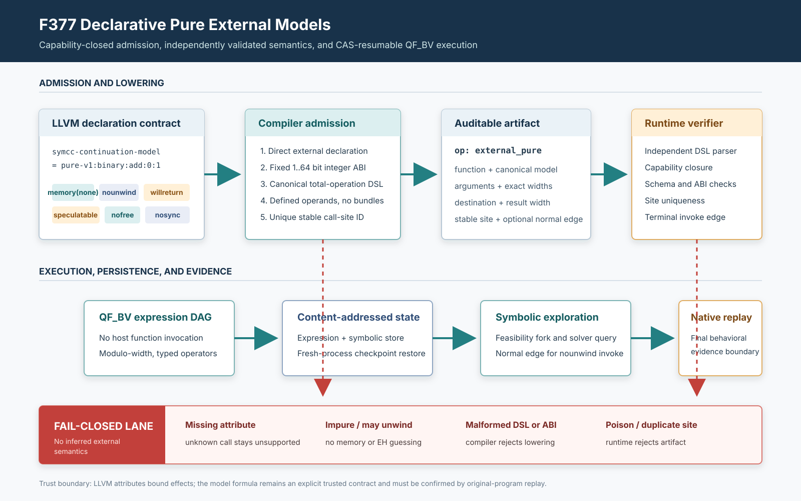

# F377：能力闭包的声明式纯外部函数模型

- 日期：2026-08-12
- LLVM lowering：`compiler/ContinuationLowering.cpp`
- 执行器：`util/live_continuation.py`
- 调度 CFG：`util/live_state_search.py`
- 产物检查器：`util/check_live_continuation_lowering.py`
- 测试：`test/live_continuation_lowering.ll`、`test/test_live_external_models.py`
- 能力：`declarative-pure-external-summary`
- 成熟度：I/T/E-mechanism；有界整数纯函数子集，不是任意外部环境或 libc 的完整语义

## 1. 研究问题

continuation lowering 要在 worker 之间迁移可执行状态，因而不能把未建模的外部调用留给某台主机“临时
执行”。这样做会把宿主库版本、进程全局状态、I/O、线程同步和异常行为带入 checkpoint，破坏确定性与
可重放性。旧实现只能识别编译器内硬编码的少数 scalar/libc summary；新增一个模型必须改 C++，而函数名
相同也不足以证明语义相同。

F377 引入一个小型、版本化、失败关闭的纯函数模型语言。只有**显式携带模型、满足 LLVM effect contract、
具有固定有界整数 ABI、可被两套独立 parser 接受**的外部 declaration 才能进入 continuation。未知调用、
模型语法错误、缺少任一纯度属性、可能 poison 的实参或 ABI 不一致均保持拒绝。

LLVM 官方定义 `memory(none)` 为不访问内存，`nounwind` 为不抛出同步异常，`willreturn` 约束调用回到现有
调用栈，`nofree`、`nosync` 分别约束既有分配释放与同步边；本实现同时要求 `speculatable`，并拒绝
`noreturn`、`returns_twice` 与 `convergent`。这些属性共同限定**可观察 effect envelope**，但不会证明开发者
写入的模型公式等于真实函数。属性语义依据 [LLVM Language Reference: Function Attributes](https://llvm.org/docs/LangRef.html#function-attributes)。
LLVM 15 兼容测试使用旧拼写 `readnone`；pass 通过 `doesNotAccessMemory()` 检查其语义，现代 LLVM 会将其
规范化为 `memory(none)`。



## 2. 模型语言与适用场景

模型通过 function string attribute `symcc-continuation-model` 声明，语法必须是规范十进制；索引不得有
前导零，参数数不超过 32，所有整数位宽为 1–64 bit。

| 规范形式 | 语义 | 典型适用场景 |
| --- | --- | --- |
| `pure-v1:constant:C` | 固定返回 `C` | target 配置常量、无状态 feature probe |
| `pure-v1:identity:I` | 返回第 `I` 个参数 | transparent wrapper、规范化 no-op |
| `pure-v1:unary:neg:I` | 模 `2^w` 取负 | 有界整数 helper |
| `pure-v1:unary:bitnot:I` | 逐位取反 | bit-mask helper |
| `pure-v1:binary:OP:L:R` | 二元 BV 运算 | add/sub/mul、and/or/xor |
| `pure-v1:binary:CMP:L:R` | i1 比较 | signed/unsigned order、eq/ne |
| `pure-v1:select:C:T:F` | i1 条件选择 | branch-free selector helper |

刻意不支持除法、余数和移位。它们在 LLVM 中存在除零、精确除法或超宽 shift 等定义域/poison 条件；仅凭
一个无前置条件的“pure”模型无法保持 totality。字符串、浮点、指针、数组、变长参数、外部内存读写和
可能抛异常的调用也不在本增量中。

## 3. 编译器准入与产物

`lowerDeclarativePureExternal()` 在普通 hard-coded summary 之前检查显式模型。准入顺序为：

1. callee 必须是直接外部 declaration，非 varargs，调用与声明的参数/返回类型精确一致；
2. 模型字符串长度不超过 256，语法版本和操作符在白名单内，参数索引有效；
3. 函数满足 `memory(none) nounwind willreturn speculatable nofree nosync`，无 operand bundle；
4. 返回值和每个参数是 1–64 bit 整数，实参未被 lowering 标记为 potentially poison；
5. 模型 ABI 成立：identity/unary 同宽，value binary 两端与结果同宽，compare 结果为 i1，select 条件为
   i1 且两值与结果同宽，常量能在结果位宽中表示；
6. 函数名采用两端一致的 ASCII 白名单，stable site 是非零 u64，在声明式外部调用点集合内不得重复。

通过后不把模型静默改写为普通 `binary`，而是发出可审计的 `external_pure`：

```json
{
  "op": "external_pure",
  "function": "modeled_add",
  "model": "pure-v1:binary:add:0:1",
  "args": [{"var": "lhs"}, {"var": "rhs"}],
  "arg_bits": [32, 32],
  "dst": "result",
  "bits": 32,
  "site": "12466126284269326922"
}
```

若原指令是已证明 `nounwind` 的 `invoke`，产物额外记录唯一 `normal` 边；不存在可执行的 unwind 边。LLVM
对一般 `invoke` 的 normal/unwind 双 continuation 定义见
[LLVM Exception Handling](https://llvm.org/docs/ExceptionHandling.html#try-catch)。

## 4. 独立验证与执行语义

Python executor 不信任编译器已验证过产物，而是重新执行：

- capability 与 op 双向闭包：有 op 无 capability、或空 capability 无 op，均拒绝；
- 独立 DSL parser、字段白名单、ASCII 标识符、严格整数类型和 1–64 bit 位宽检查；
- stable site 必须是规范非零 u64 且在全 program 的 `external_pure` 集合内唯一；
- model/ABI 关系重新验证，运行时再核对每个 expression digest 的真实位宽；
- 带 `normal` 的 op 必须是 block 最后一条指令，目标 block 必须存在。

执行器**不会调用宿主函数**。它只把模型构造成已有 content-addressed QF_BV expression DAG；add/sub/mul
按位宽取模，signed/unsigned compare 保持原操作符，select 生成 `ite`。expression、symbolic store、program
和 continuation descriptor 分别进入 CAS，新的 executor 进程可从 digest 重新加载。因此模型结果能继续
参与 feasibility fork、solver frame 复用和分布式 checkpoint 调度，而不是退化成一次 concrete oracle。

## 5. 正确性边界

需要区分三个层次：

1. **effect contract**：LLVM 属性约束模型调用没有本实现无法保存的外部副作用；
2. **artifact integrity**：compiler/runtime 双重准入、capability closure 与 CAS 确保执行的是同一个规范模型；
3. **semantic truth**：`pure-v1:binary:add:0:1` 是否真的描述目标函数，仍是模型作者提供的受信任事实。

所以 F377 不是自动函数摘要推断，也不是外部函数等价性证明。错误但属性齐全的人工模型仍可能产生伪输入；
最终结果必须由原程序 native replay 确认。该设计把不确定性收缩为显式、可审计的模型声明，并使未知环境
继续失败关闭，而不是把信任藏在函数名或宿主调用中。

## 6. 多轮 review 修复

1. **同进程 checkpoint 假证据**：checkpoint 测试原可命中 executor 的 expression cache；现关闭首个
   executor，启动独立 Python 子进程从同一 CAS 根恢复。
2. **编译器/runtime 名称域不一致**：两端统一为有限 ASCII 白名单，避免 Unicode 或 JSON 名称差异。
3. **稳定 site 理论碰撞**：lowering 和 runtime 都维护反向集合，重复 site 失败关闭。
4. **Python 数字隐式转换**：bool 与 float 不再经 `int()` 获得准入；位宽和 site 使用严格类型/规范文本。
5. **invoke 落空**：带 `normal` 的模型必须是当前 block terminator-like 最后一项，CFG graph 同步记录边。
6. **部分纯度契约**：由只检查 memory/nounwind 加强为六项正属性、三项负属性和 operand-bundle 拒绝。
7. **操作集合过宽**：拒绝需要额外定义域条件的 div/rem/shift，保持语言内每个模型为 total operation。
8. **双 parser 空字段分歧**：C++ 原先丢弃空 token，可能把双冒号模型规范化为合法形式；现保留空字段，
   与 Python 一致拒绝，并增加 LLVM 反例。
9. **operand 多义 JSON**：通用 operand 检查会接受 `var`/`const` 双键、额外字段和非字符串变量；F377
   现要求唯一规范形态、严格常量/位宽类型，并增加七个反例。
10. **零值/碰撞 site**：compiler 在发出 artifact 前同时拒绝显式零 metadata 与两个不同调用点的同 ID；
    runtime 继续独立执行非零、规范 u64 与重复检查。

## 7. 测试与证据

测试覆盖七类模型、8-bit wraparound、signed compare、symbolic feasibility 双分支、nounwind invoke 只走 normal、
fresh-process checkpoint 恢复，以及 capability 两向缺失、非规范索引、未知运算、索引越界、bool/float
位宽、非法函数名、空字段、operand 多义 JSON、未知字段、非末尾 normal op、ABI/运行时位宽错配、
零 site 和重复 site 等反例。

| 门禁 | 结果 |
| --- | --- |
| `cmake --build build -j2` | 通过 |
| F375–F377 定向 pytest | 22 passed + 35 subtests，0 failed，2.58 s |
| LLVM `live_continuation_lowering` lit | 1 passed，0 failed，179.06 s |
| LLVM 17 兼容构建与直接 artifact 检查 | 构建通过；symbolic add 结果 `{1,2}` |
| capability-closed 完整 Python gate | 852 passed + 213 subtests；0 skip/xfail/deselect；120.45 s |
| 规范 pytest identity | 852 node IDs；missing/unexpected 均为 0 |
| `ruff`、`py_compile`、`git diff --check` | 通过，0 diagnostics |

证据目录为 [`evidence/f377-declarative-pure-external-2026-08-12/`](../evidence/f377-declarative-pure-external-2026-08-12/)。
本轮结果证明机制与失败关闭，不提供 throughput、coverage 或 LAVA-M 提升百分比；这些指标需要声明式
model corpus、未建模 baseline、固定预算多重复实验和 native replay 后才能报告。

## 8. 后续研究方向

- 从人工 total model 扩展到带显式 read/write set、alias guard 和异常集合的 effect summary；
- 对 clang 生成的真实纯 helper 做 native-vs-continuation 差分与 Alive2 风格局部等价验证；
- 建立版本化 model registry、签名 provenance 和跨 worker 一致性协议；
- 将可靠外部语义作为 Gordian/ConcoLLMic/NeuroSCA 等智能路径规划的 verifier 层，而不是允许 agent
  直接修改执行语义；
- 完成完整 exception object lifecycle、C++ 继承 catch、Windows funclet 与 native frontier adapter。

F377 的贡献不在“支持更多函数名”，而在于把外部语义扩展从隐式代码分支变成版本化、能力闭包、可恢复、
可审计且失败关闭的研究接口，为后续更激进的自动摘要生成保留严格验证边界。
