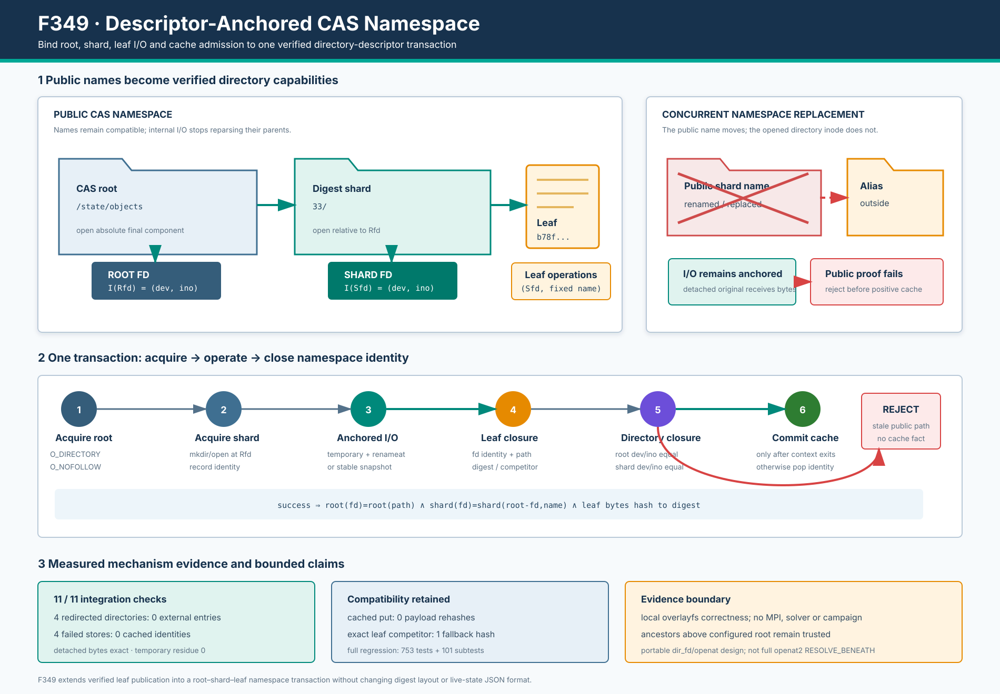

# F349：Descriptor-Anchored CAS Namespace

> 功能编号：`F349`  
> 日期：`2026-08-10`  
> 状态：已实现；定向、相关、完整回归与生产原语机制验证完成

> 后续状态：本文保留 F349 实现时点与证据边界。F350 已进一步关闭“配置 CAS root 祖先仍受信”的限制，
> 当前实现与部署要求见 [`F350 研究报告`](Component_Wise_Anchored_CAS_Root_F350_2026-08-10.md)。



## 1. 研究背景与审查结论

F345 以稳定 no-follow snapshot 闭合输入读取，F346 保持写 descriptor 跨越原子 rename 并验证最终 leaf，
F347 将同一 CAS 发布/读取内核扩展到 executable live-state JSON，F348 又对完整 continuation Merkle DAG
施加传递预算。继续审查 `ContentAddressedInputStore` 后发现，这些机制仍主要闭合**对象最终分量**：

```text
<CAS root>/<digest[0:2]>/<digest[2:] + suffix>
```

旧实现通过普通 pathname 创建 shard、temporary 和最终对象。`O_NOFOLLOW` 只作用于最终打开分量，不能证明
解析该分量时经过的 CAS root 与 digest shard 仍是调用开始时看到的目录。共享文件系统上的另一个进程若在
发布或读取期间 rename root/shard，再用同名目录或 symlink 代替，可能产生三种正确性问题：

1. I/O 落到调用者没有验证的替代目录；
2. 对象在已经脱离公开命名空间的目录中完成，但旧代码仍返回公开路径并登记 positive cache；
3. live-state 读取的对象 leaf 正确，却无法证明它属于调用者认为的那棵 CAS namespace。

这不是符号执行算法层面的求解漏洞，而是并行执行框架在共享存储竞争下的**命名空间一致性缺口**。F349
将 root、shard、leaf 三层纳入同一个 descriptor-anchored 事务：I/O 始终相对于已验证目录 fd，成功返回前再
证明公开路径仍指向这些目录 inode。

## 2. 系统依据与技术边界

Linux/POSIX `openat` 系列以 `dirfd + relative leaf` 解析对象；打开的目录 fd 即使原 pathname 被 rename，
仍引用原目录 inode。`renameat` 可在同一个已打开目录内原子替换名称。Python 的 `os.open`、`os.stat`、
`os.mkdir`、`os.replace` 和 `os.unlink` 暴露对应的 `dir_fd` 参数。

本实现同时使用：

- `O_DIRECTORY`：锚点必须是目录；
- `O_NOFOLLOW`：root、shard 和对象 leaf 的最终分量不能是 symlink；
- `O_CLOEXEC`：目录/对象 fd 不泄漏给执行目标；
- `O_EXCL`：temporary 名称只能由当前写入者创建；
- `fstat(fd)` 与 `stat(name, dir_fd=parent_fd, follow_symlinks=False)`：比较 fd 与公开名称的
  `(st_dev, st_ino)`。

Linux `openat2` 的 `RESOLVE_BENEATH`/`RESOLVE_NO_SYMLINKS` 可以对一次多分量解析施加更强的内核约束；
Python 标准库当前使用的是逐层 `dir_fd` 方案。因此 F349 明确不声称：

- 从系统根到配置 CAS root 的所有祖先均由内核 `RESOLVE_BENEATH` 锁定；
- 禁止 mount topology 变化或提供 Byzantine storage proof；
- 返回给外部 target 的 pathname 在 API 返回后仍不可替换。

参考：[Linux `openat(2)`](https://man7.org/linux/man-pages/man2/openat.2.html)、
[Linux `openat2(2)`](https://man7.org/linux/man-pages/man2/openat2.2.html)、
[POSIX `renameat`](https://pubs.opengroup.org/onlinepubs/9799919799/functions/rename.html)、
[Python `os` descriptor operations](https://docs.python.org/3/library/os.html#files-and-directories)。

## 3. 形式化不变量

设 `Rfd` 是打开的 CAS root，`Sfd` 是从 `Rfd` 相对打开的 digest shard，`P(x,t)` 是时刻 `t` 公开名称
`x` 指向的 `(device,inode)`，`I(fd)` 是 fd 指向的目录 identity。一次成功操作必须满足：

```text
I(Rfd) = P(CAS-root, t_open) = P(CAS-root, t_commit)
I(Sfd) = P(digest-shard relative to Rfd, t_open)
        = P(digest-shard relative to Rfd, t_commit)

all leaf operations ∈ {open, stat, replace, unlink, snapshot}
  are resolved as (Sfd, validated_leaf)

positive_identity_cache[digest] is admitted only after both equalities hold
```

若公开 root/shard 在事务内被 detach 或替换，fd 上的 I/O 不会被重定向；但退出 `_object_directory()` 时
identity closure 失败，调用失败且摘要不会进入 positive cache。这同时保证“不会写错目录”和“不会把已脱离
公开命名空间的成功错报给上层”。

## 4. 架构与执行流程

### 4.1 Root 与 shard 锚定

`ContentAddressedInputStore.__init__()` 先持久创建 root，再以
`O_RDONLY|O_DIRECTORY|O_NOFOLLOW|O_CLOEXEC` 打开其绝对路径，并立即比较 fd/path identity。最终 root
为 symlink、非目录或打开后被替换时构造失败。

每次对象操作进入 `_object_directory(object_id, create=...)`：

1. 校验 64 位小写十六进制摘要，摘要固定派生 2 字符 shard 与无 slash leaf；
2. 重新打开 root 并记录 `root_identity`；
3. 写路径用 `mkdir(shard, dir_fd=Rfd)` 创建 shard；读路径要求其已经存在；
4. 以 `open(shard, dir_fd=Rfd, O_DIRECTORY|O_NOFOLLOW)` 获得 `Sfd`；
5. 记录 `shard_identity`；新建 shard 时同步 shard 与 root directory；
6. 向内部操作只交付 `{Sfd, leaf, public_path}`，不再让内部 I/O 重新解析父 pathname；
7. 内部操作正常结束后，分别验证公开 root 与 `Rfd`、`Rfd/shard` 与 `Sfd` 的 identity；
8. 任一验证失败关闭 fd、撤销 cache 并向调用者报告失败。

每次操作重新取得 anchor，而不是跨调用永久持有 root fd，避免长期 fd 驻留，也使每次 API 调用对当前公开
namespace 独立负责。

### 4.2 Descriptor-relative 发布

`put(content,digest)` 的慢路径执行顺序为：

1. 在 `Sfd` 内以 `O_CREAT|O_EXCL|O_NOFOLLOW` 创建唯一 temporary leaf；
2. 通过该对象 fd 完整写入、flush、`fsync`，保存 `written_identity`；
3. 调用 `durable_replace(tmp_leaf, final_leaf, directory_fd=Sfd)`；该函数使用同一 dirfd 的
   `os.replace(src_dir_fd=...,dst_dir_fd=...)` 并同步 `Sfd`；
4. 再次 `fstat` 写 fd 获得 `published_identity`，并以 `stat(final_leaf,dir_fd=Sfd,no-follow)` 获得
   `path_identity`；
5. 无竞争时直接接受 descriptor/path identity，避免第二次 payload hash；
6. 若同一 shard 内另一个 writer 抢先替换 leaf，则稳定哈希竞争对象：摘要相同即收敛，错误内容或 symlink
   失败关闭；
7. 在 `Sfd` 内清除 temporary；
8. `_object_directory` 复核 root/shard 后，才登记 verified identity 并返回公开路径。

所以目录被 detach 后，剩余 I/O 仍发生在原目录 fd，不会穿过新 symlink；由于公开 identity 已改变，最终
结果不会进入上层。

### 4.3 Descriptor-relative 读取

`stable_regular_file_snapshot()` 新增可选 `directory_fd`。CAS snapshot 只传入摘要 leaf 和 `Sfd`：

1. no-follow 打开 regular leaf；
2. 读取前记录 fd 的 device/inode/size/mtime/ctime；
3. 有界分块读并计算 SHA-256，可选择保留同一批被哈希 bytes；
4. 读取后复核 fd 与 `stat(leaf,dir_fd=Sfd,no-follow)` identity；
5. 退出 CAS 目录上下文时再复核 root/shard identity。

`LiveStateStore._get_mapping()` 通过 `ContentAddressedInputStore.snapshot(...,retain_content=True)` 消费这一
原语，再验证 `snapshot.sha256 == object_id`、解析 canonical JSON 并检查 schema。于是 live-state JSON 的
目录归属、inode、摘要和解析字节属于同一次关闭的读取事务。

### 4.4 Cache 状态机

verified identity cache 的快路径仍只需 descriptor-relative `stat`，metadata identity 未变化时不重复哈希
payload。cache admission 被移到 root/shard 上下文成功退出之后。对象错误、目录打开失败、identity 漂移、
摘要失败、JSON/schema 失败都会执行 `pop(object_id,None)`。

## 5. 代码与兼容性

主要变更位于：

- `util/distributed_state.py`
  - `durable_replace(...,directory_fd=...)`：同目录 descriptor-relative rename 与 fsync；
  - `stable_regular_file_snapshot(...,directory_fd=...)`：descriptor-relative leaf snapshot；
  - `_ContentAddressedObjectDirectory`：内部 anchor capability；
  - `_open_directory/_verify_directory_path/_object_directory`：root/shard 获取和退出证明；
  - `_verified_object_in_directory/put/snapshot`：所有 CAS leaf I/O 绑定 `Sfd`；
  - `LiveStateStore._get_mapping`：统一使用 anchored snapshot。
- `test/test_distributed_state.py`
  - root/shard symlink、发布中 root/shard 替换、读取中 shard 替换、exact competitor 与 fast path。

对象摘要、两字符 shard、普通输入 leaf、live-state `.json` suffix、canonical JSON 和外部返回路径均未改变。
既有调用不传 `directory_fd` 时，`durable_replace` 与 `stable_regular_file_snapshot` 保持原 pathname 语义。

F346/F347 的确定性 race drivers 同步改为接收 `directory_fd` 并在相同 anchor 内制造 leaf competitor；原有
F346 8/8 与 F347 8/8 结果保持不变。这一点防止实现升级后旧证据脚本“文件仍在但已经不可运行”。

## 6. 验证方法与结果

### 6.1 单元与回归测试

新增/扩展测试验证：

- root 本身是 symlink 时，构造失败且外部目录为空；
- digest shard 是 symlink 时，put 失败且外部目录为空；
- 发布完成后立即替换 root，写入只留在 detached 原目录，最终失败且 cache 为空；
- 发布完成后立即替换 shard，行为与 root case 对称；
- live-state 第一次 read 后替换 shard，并让 alias 包含同摘要 JSON，读取仍失败而不是接受 alias；
- 同摘要 leaf competitor 仍以一次 fallback hash 收敛；
- 无竞争 verified-identity fast path 不重复 payload hash；
- 所有失败路径清除 temporary 与 positive identity。

精确结果：

| 验证层 | 结果 | 条件 |
| --- | ---: | --- |
| F349 定向 | 5 passed，152 deselected，0.16 s | `-W error` |
| `test_distributed_state.py`（加 root 用例前的中间门） | 156 passed + 18 subtests，15.27 s | 普通 pytest |
| 六模块相关 | 360 passed + 81 subtests，17.33 s | `-W error` |
| 完整 `test/test_*.py` | 753 passed + 101 subtests，95.93 s | `-W error` |
| Ruff | all checks passed | 生产、测试、driver、verifier |

相对 F348 完整回归的 749 tests，新增 4 个顶层测试且原 101 个 subtests 全部保持通过。中间的
`test_distributed_state.py` 计数发生在最后一个 root-race 测试加入之前，因此只作为开发门，不把它冒充最终
模块总数；权威交付结果是定向、六模块和完整三组日志。

### 6.2 生产原语机制集成

F349 driver 在真实 overlayfs 文件、目录和 symlink 上运行生产 store，并只用 mock 固定故障发生时点：

| 观测 | 精确结果 |
| --- | ---: |
| mechanism checks | 11/11 true |
| normal object ID | `33b78f369f841a1bd5b09078a1cf180dab714c7f5174bdea66baef3390da69b9` |
| cached fallback hashes | 0 |
| exact competitor fallback hashes | 1 |
| root/shard/competitor callbacks received dirfd | 3/3 true |
| detached root/shard/live-read bytes exact | true |
| redirected external entries | 0 in all 4 publication/alias directories |
| failed identity cache entries | 0 in all 4 failed stores |
| temporary residue | 0 |

五个拒绝场景均报告确定性错误：root alias、shard alias、root publication replacement 和 shard publication
replacement 为 `NotADirectoryError`；live-state read replacement 在 store API 边界映射为 `ValueError`。

## 7. 技术进步、创新性与挑战性

1. **从 leaf integrity 到 namespace integrity**：F346 证明“公开 leaf 等于写 fd”，F349 继续证明“公开
   root/shard 仍等于执行 I/O 的目录 fd”，把对象证明扩展为三层 namespace proof。
2. **Capability-style internal API**：内部函数不再接收可重新解析的父 pathname，而接收已打开的 shard fd
   与固定 leaf；目录 fd 是有生命周期、可验证的 I/O capability。
3. **使用后提交，而非使用前一次检查**：进入时验证只能证明起点，F349 在 I/O 后再证明公开命名空间，
   因而能识别操作期间发生的 detach/replace。
4. **竞争下不误写与不误报同时成立**：fd 保证操作不被新 alias 重定向，退出 identity closure 保证 detached
   成功不被报告为公开成功；二者缺一不可。
5. **零重哈希快路径保持**：目录证明只增加常数个 open/stat/fsync 元数据操作，缓存命中不扫描 payload；
   当前仅证明调用次数，不宣称端到端性能收益。
6. **跨状态类型统一**：输入对象和 continuation JSON 共用同一 CAS namespace primitive，避免同类文件因
   两条实现路径形成不同的竞争语义。
7. **可复现故障注入**：root、shard、leaf 和 read 四类状态变化都落在真实生产 primitive 上，结果记录
   detached bytes、external entries、cache 与 residue，不只断言“抛出了异常”。

实现挑战在于同时保留正确同摘要 writer 的合法收敛、无竞争零重哈希路径、原有磁盘布局与返回接口，又要
让任何目录漂移在 cache admission 前失败。尤其不能简单地在开始时做一次 `realpath` 或 `isdir`，因为这些
检查本身不绑定后续 I/O。

## 8. 局限与有效性威胁

1. 配置 CAS root 仍由绝对 pathname 打开；其祖先是部署信任边界。若需要接收不可信多分量 root，应从受信
   parent fd 使用 `openat2(RESOLVE_BENEATH|RESOLVE_NO_SYMLINKS)` 或逐层 anchor。
2. `O_NOFOLLOW`/`O_DIRECTORY` 不可用的平台直接失败，不提供弱化回退；这是显式 portability trade-off。
3. device/inode identity 不是 Byzantine filesystem 证明，也不能阻止特权进程修改已打开 regular inode；
   payload 摘要仍负责内容正确性。
4. API 返回的公开 pathname 在返回后可以变化。worker 的后续读取仍必须重新走稳定 snapshot/摘要栅栏，
   不能把字符串路径当永久 capability。
5. 目录 fsync、rename 和 inode 语义在 NFS/Lustre 上需要单独资格测试；本次 overlayfs 结果不能外推多机。
6. 没有采集目录锚定的独立延迟分布、系统调用数或真实 campaign 指标，因此不声称 throughput、coverage、
   bug-discovery 或 LAVA-M 提升。

## 9. 后续研究方向

1. Linux 可选 `openat2` backend：从受信 deployment root 对配置 CAS root 执行
   `RESOLVE_BENEATH|RESOLVE_NO_MAGICLINKS`，并保留当前 portable `dir_fd` fail-closed backend；
2. 为 root/shard identity closure 增加结构化 telemetry，量化真实共享存储中的 replacement/ESTALE 频率；
3. 在 NFS 与 Lustre 上对 open directory fd、rename、fsync、attribute cache 进行启动资格探针；
4. 测量 anchored metadata 操作在对象大小、cache hit ratio 与并发 writer 数变化下的延迟分布；
5. 将公开 pathname 交付升级为 digest capability + consumer-side revalidation contract，减少跨阶段隐式信任。

## 10. 证据索引

- 生产实现：[`util/distributed_state.py`](../../../util/distributed_state.py)
- 单元测试：[`test/test_distributed_state.py`](../../../test/test_distributed_state.py)
- 示意图：[`descriptor-anchored-cas-namespace-2026-08-10.svg`](../diagrams/descriptor-anchored-cas-namespace-2026-08-10.svg)
- 集成结果：[`descriptor-anchored-namespace-integration.json`](../evidence/f349-descriptor-anchored-cas-namespace-2026-08-10/descriptor-anchored-namespace-integration.json)
- 复现脚本：[`run_descriptor_anchored_namespace_integration.py`](../evidence/f349-descriptor-anchored-cas-namespace-2026-08-10/run_descriptor_anchored_namespace_integration.py)
- 测试日志与边界：[`F349 evidence`](../evidence/f349-descriptor-anchored-cas-namespace-2026-08-10/)
- 完整性清单：[`SHA256SUMS.txt`](../evidence/f349-descriptor-anchored-cas-namespace-2026-08-10/SHA256SUMS.txt)
